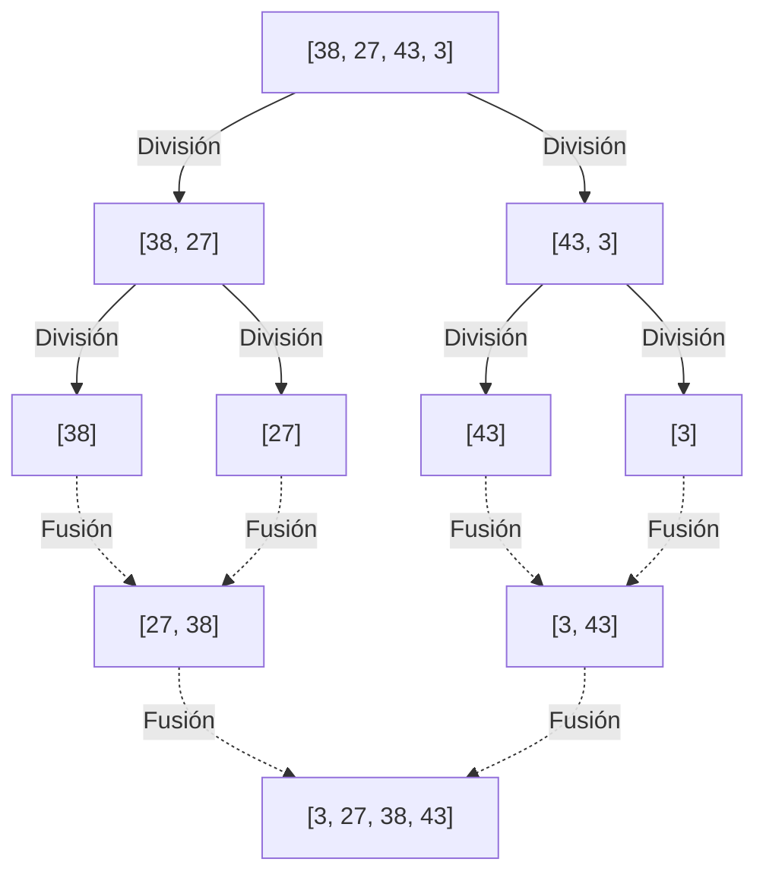
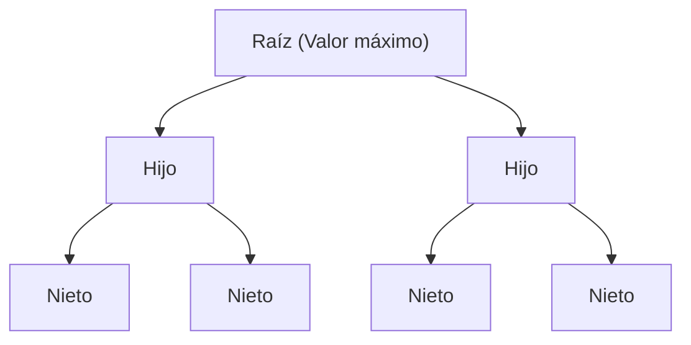

---

## 2. Algoritmos de $O(n^2)$: Conceptos básicos y enfoques intuitivos

Los primeros en ser presentados son un grupo de algoritmos básicos con una complejidad de $O(n^2)$. Si bien estos tienen una baja utilidad práctica para conjuntos de datos a gran escala, sus implementaciones son intuitivas y muy simples, lo que los convierte en excelentes materiales educativos para aprender los fundamentos de los algoritmos. Además, cuando el tamaño de los datos es extremadamente pequeño, o para datos que ya están casi ordenados, pueden ejecutarse más rápido que los algoritmos complejos.

### 2.1 Ordenamiento de burbuja (Bubble Sort)

El ordenamiento de burbuja es uno de los algoritmos de ordenamiento más famosos y simples. Compara dos elementos adyacentes y, si están en orden inverso, los intercambia. Esta operación se realiza hasta el final de la matriz. Esto se repite hasta que toda la matriz esté ordenada. Al final de cada pasada, el elemento más grande (o más pequeño) se mueve "flotando" hacia el extremo de la matriz, razón por la cual se le llama ordenamiento de burbuja.

#### Cómo funciona el ordenamiento de burbuja

1. Comenzando desde el principio de la matriz, compara los elementos adyacentes (`arr[i]` y `arr[i+1]`).
2. Si el elemento de la izquierda es mayor que el de la derecha, se intercambian (swap) ambos.
3. Repitiendo esto hasta el final de la matriz, el valor máximo de la matriz se moverá al extremo derecho.
4. En la siguiente pasada, se repite desde el paso 1 nuevamente, excluyendo el elemento en el extremo derecho.
5. En el momento en que no se realiza ningún intercambio, se determina que la matriz está completamente ordenada y el proceso termina.

#### Complejidad temporal/espacial y características

*   **Peor complejidad temporal**: $O(n^2)$ (Cuando la matriz está ordenada en orden inverso)
*   **Complejidad temporal promedio**: $O(n^2)$
*   **Mejor complejidad temporal**: $O(n)$ (Cuando ya está ordenada y se utiliza una bandera de optimización)
*   **Complejidad espacial**: $O(1)$ (In-place)
*   **Estabilidad**: Estable (Stable)

Dado que solo intercambia elementos adyacentes, los elementos con el mismo valor nunca se superponen entre sí, lo que lo convierte en un algoritmo estable.

#### Código de implementación en Python

```python
def bubble_sort(arr):
    n = len(arr)
    # Ejecuta n pasadas
    for i in range(n):
        # Bandera para terminación temprana
        swapped = False
        
        # Ignora la parte posterior ya ordenada (i elementos)
        for j in range(0, n - i - 1):
            # Intercambia si el elemento izquierdo es mayor que el derecho
            if arr[j] > arr[j + 1]:
                arr[j], arr[j + 1] = arr[j + 1], arr[j]
                swapped = True
                
        # Si no ocurre ningún intercambio en esta pasada, ya está completamente ordenado
        if not swapped:
            break
            
    return arr
```

#### Rastreo paso a paso

Veamos el proceso de ordenar la matriz `[5, 3, 8, 4, 2]` en orden ascendente usando el ordenamiento de burbuja.

*   **Pasada 1**:
    *   Compara (5, 3) $\rightarrow$ Intercambio: `[3, 5, 8, 4, 2]`
    *   Compara (5, 8) $\rightarrow$ Mantiene: `[3, 5, 8, 4, 2]`
    *   Compara (8, 4) $\rightarrow$ Intercambio: `[3, 5, 4, 8, 2]`
    *   Compara (8, 2) $\rightarrow$ Intercambio: `[3, 5, 4, 2, 8]` (8 queda fijado)
*   **Pasada 2**:
    *   Compara (3, 5) $\rightarrow$ Mantiene: `[3, 5, 4, 2, 8]`
    *   Compara (5, 4) $\rightarrow$ Intercambio: `[3, 4, 5, 2, 8]`
    *   Compara (5, 2) $\rightarrow$ Intercambio: `[3, 4, 2, 5, 8]` (5 queda fijado)
*   **Pasada 3**:
    *   Compara (3, 4) $\rightarrow$ Mantiene: `[3, 4, 2, 5, 8]`
    *   Compara (4, 2) $\rightarrow$ Intercambio: `[3, 2, 4, 5, 8]` (4 queda fijado)
*   **Pasada 4**:
    *   Compara (3, 2) $\rightarrow$ Intercambio: `[2, 3, 4, 5, 8]` (3 queda fijado, automáticamente 2 también queda fijado)

### 2.2 Ordenamiento por selección (Selection Sort)

El ordenamiento por selección es un algoritmo que divide la matriz en una "parte ordenada" y una "parte no ordenada", busca el elemento más pequeño (o más grande) en la parte no ordenada y lo intercambia con el primer elemento de la parte no ordenada. Esta operación se repite continuamente.

#### Cómo funciona el ordenamiento por selección

1. Inicialmente, toda la matriz es la parte no ordenada.
2. Busca el valor más pequeño dentro de la parte no ordenada.
3. Intercambia ese valor mínimo con el primer elemento de la parte no ordenada.
4. Con esto, el primer elemento se incluye en la parte ordenada y la parte no ordenada se reduce en uno.
5. Esta operación se repite hasta que no quede parte no ordenada.

#### Complejidad temporal/espacial y características

*   **Peor complejidad temporal**: $O(n^2)$
*   **Complejidad temporal promedio**: $O(n^2)$
*   **Mejor complejidad temporal**: $O(n^2)$
*   **Complejidad espacial**: $O(1)$ (In-place)
*   **Estabilidad**: Inestable (Unstable)

El ordenamiento por selección siempre realiza el escaneo hasta el final para encontrar el valor mínimo independientemente del orden de los datos, por lo que incluso en el mejor de los casos toma $O(n^2)$. Además, dado que realiza intercambios con elementos distantes, no es estable.

#### Código de implementación en Python

```python
def selection_sort(arr):
    n = len(arr)
    
    # Recorre toda la matriz
    for i in range(n):
        # Asume la posición actual como el índice del valor mínimo
        min_idx = i
        
        # Busca el verdadero valor mínimo en la parte no ordenada restante
        for j in range(i + 1, n):
            if arr[j] < arr[min_idx]:
                min_idx = j
                
        # Cuando se encuentra el valor mínimo, se intercambia con la posición actual (i)
        arr[i], arr[min_idx] = arr[min_idx], arr[i]
        
    return arr
```

#### Rastreo paso a paso

Vamos a ordenar la matriz `[29, 10, 14, 37, 13]` por selección.

*   **i = 0**: Busca el valor mínimo en `[29, 10, 14, 37, 13]` $\rightarrow$ El valor mínimo es 10. Intercambia 29 y 10.
    Resultado: `[10, 29, 14, 37, 13]` (10 queda fijado)
*   **i = 1**: Busca el valor mínimo en lo restante `[29, 14, 37, 13]` $\rightarrow$ El valor mínimo es 13. Intercambia 29 y 13.
    Resultado: `[10, 13, 14, 37, 29]` (13 queda fijado)
*   **i = 2**: Busca el valor mínimo en lo restante `[14, 37, 29]` $\rightarrow$ El valor mínimo es 14. Se mantiene igual (auto-intercambio).
    Resultado: `[10, 13, 14, 37, 29]` (14 queda fijado)
*   **i = 3**: Busca el valor mínimo en lo restante `[37, 29]` $\rightarrow$ El valor mínimo es 29. Intercambia 37 y 29.
    Resultado: `[10, 13, 14, 29, 37]` (29 queda fijado, automáticamente 37 también queda fijado)

### 2.3 Ordenamiento por inserción (Insertion Sort)

El ordenamiento por inserción es un método intuitivo que utilizamos a menudo cuando organizamos las cartas de juego en nuestras manos. Es un algoritmo que toma un elemento de la parte no ordenada y lo inserta en la posición correcta en la parte ya ordenada.

#### Cómo funciona el ordenamiento por inserción

1. Se considera que el primer elemento de la matriz (índice 0) ya está ordenado.
2. Toma el siguiente elemento (índice 1) (llamaremos a esto `key`) y lo compara en orden desde atrás con los elementos de la parte ordenada (lado izquierdo).
3. Si hay algún elemento mayor que `key`, desplaza ese elemento una posición a la derecha.
4. Cuando encuentra la posición correcta donde debería insertarse `key`, coloca `key` allí.
5. Esto se repite hasta el final de la matriz.

#### Complejidad temporal/espacial y características

*   **Peor complejidad temporal**: $O(n^2)$ (Cuando está ordenado en orden inverso)
*   **Complejidad temporal promedio**: $O(n^2)$
*   **Mejor complejidad temporal**: $O(n)$ (Cuando está casi ordenado)
*   **Complejidad espacial**: $O(1)$ (In-place)
*   **Estabilidad**: Estable (Stable)

La mayor fortaleza del ordenamiento por inserción es que **cuando los datos ya están ordenados (o casi ordenados), las comparaciones y los movimientos son mínimos, por lo que se ejecuta de manera extremadamente rápida, a una velocidad cercana a $O(n)$**. Esta propiedad se aprovecha enormemente en los algoritmos híbridos, como Timsort, que se describirán más adelante.

#### Código de implementación en Python

```python
def insertion_sort(arr):
    # Comienza desde el índice 1 (el elemento 0 se considera ordenado)
    for i in range(1, len(arr)):
        key = arr[i]
        j = i - 1
        
        # Escanea la parte ordenada desde atrás y desplaza a la derecha los elementos mayores que key
        while j >= 0 and key < arr[j]:
            arr[j + 1] = arr[j]
            j -= 1
            
        # Inserta key en la posición correcta vacía
        arr[j + 1] = key
        
    return arr
```

#### Rastreo paso a paso

Vamos a ordenar la matriz `[12, 11, 13, 5, 6]` por inserción.

*   **i = 1 (key = 11)**: Compara con 12 a la izquierda. Como 12 > 11, desplaza 12 a la derecha e inserta 11 en el espacio vacío.
    Resultado: `[11, 12, 13, 5, 6]`
*   **i = 2 (key = 13)**: Compara con 12 a la izquierda. Como 12 < 13, no es necesario desplazar. Se mantiene igual.
    Resultado: `[11, 12, 13, 5, 6]`
*   **i = 3 (key = 5)**: Compara con 13, 12, 11 en orden y como todos son mayores que 5, los desplaza todos a la derecha. Inserta 5 en el extremo izquierdo.
    Resultado: `[5, 11, 12, 13, 6]`
*   **i = 4 (key = 6)**: Compara con 13, 12, 11 en orden y desplaza a la derecha. Como 5 < 6, inserta 6 a la derecha del 5.
    Resultado: `[5, 6, 11, 12, 13]`

---

## 3. Algoritmos de $O(n \log n)$: Divide y vencerás y eficiencia abrumadora

A medida que el tamaño de los datos $n$ aumenta, el tiempo de cálculo de los algoritmos de $O(n^2)$ crece explosivamente, haciéndolos poco prácticos. Aquí es donde entran en juego los algoritmos que utilizan técnicas avanzadas como **divide y vencerás** (Divide and Conquer), que dividen la matriz y la procesan recursivamente. Alcanzan el límite teórico de $O(n \log n)$ para algoritmos de ordenamiento basados en comparaciones y exhiben un rendimiento abrumador para datos a gran escala.

### 3.1 Ordenamiento por mezcla (Merge Sort)

El ordenamiento por mezcla es un algoritmo hermoso y robusto concebido por John von Neumann en 1945. Es un ejemplo representativo de "divide y vencerás", tomando el enfoque de dividir la matriz por la mitad, y otra vez por la mitad, hasta que cada elemento quede solo, y luego "fusionarlos" (merge) mientras se ordenan.

#### Cómo funciona el ordenamiento por mezcla

1. **División (Divide)**: Divide la matriz dada por el centro en dos submatrices. Esto se repite recursivamente hasta que la longitud de las submatrices sea 1 (una matriz de longitud 1 puede considerarse como un estado ya ordenado).
2. **Conquista y fusión (Conquer and Combine)**: Compara los primeros elementos de dos submatrices ordenadas y coloca el menor en una nueva matriz. Esto se repite para fusionarlos hasta que vuelvan a ser la única matriz original.



#### Complejidad temporal/espacial y características

*   **Complejidad temporal (Peor, Promedio, Mejor)**: Todas son $O(n \log n)$
    *   Como siempre se divide por la mitad, la profundidad de la división es $\log_2 n$. Dado que el proceso de fusión en cada nivel toma $O(n)$ tiempo en total, se multiplica para convertirse en $O(n \log n)$. Como la complejidad computacional es constante independientemente del estado de los datos, es extremadamente predecible y robusto.
*   **Complejidad espacial**: $O(n)$ (Out-of-place)
    *   Su mayor debilidad es que requiere una matriz de trabajo adicional del mismo tamaño que la matriz original al realizar la fusión.
*   **Estabilidad**: Estable (Stable)
    *   Cuando los valores son iguales durante la fusión, se puede mantener la estabilidad priorizando la extracción del elemento de la matriz de la izquierda.

#### Código de implementación en Python

```python
def merge_sort(arr):
    # Si la longitud de la matriz es 1 o menos, la devuelve como ya ordenada
    if len(arr) <= 1:
        return arr
        
    # 1. División: Calcula el índice central
    mid = len(arr) // 2
    left_half = arr[:mid]
    right_half = arr[mid:]
    
    # Ordena de forma recursiva ambos lados
    left_sorted = merge_sort(left_half)
    right_sorted = merge_sort(right_half)
    
    # 2. Fusión: Fusiona las matrices ordenadas de la izquierda y la derecha
    return merge(left_sorted, right_sorted)

def merge(left, right):
    result = []
    i = j = 0
    
    # Mientras queden elementos en ambas matrices
    while i < len(left) and j < len(right):
        if left[i] <= right[j]:  # Se usa <= para la estabilidad
            result.append(left[i])
            i += 1
        else:
            result.append(right[j])
            j += 1
            
    # Agrega los elementos restantes
    result.extend(left[i:])
    result.extend(right[j:])
    
    return result
```

### 3.2 Ordenamiento rápido (Quick Sort)

El ordenamiento rápido, inventado por Tony Hoare, es, como su nombre indica, un excelente algoritmo que a menudo funciona más rápido en el mundo real. Al igual que el ordenamiento por mezcla, utiliza el enfoque de divide y vencerás, pero el enfoque es diferente. Elige un elemento base (**pivote**) y clasifica los elementos en un grupo menor y un grupo mayor que el pivote para avanzar en el ordenamiento.

#### Cómo funciona el ordenamiento rápido

1. **Elección del pivote**: Elige un elemento de la matriz como pivote (valor base).
2. **Partición (División)**: Reúne los elementos más pequeños que el pivote en el lado izquierdo y los elementos más grandes en el lado derecho. Una vez completada esta operación, se determina la posición final ordenada del propio pivote.
3. **Proceso recursivo**: Repite la misma operación recursivamente para la matriz a la izquierda del pivote y la matriz a la derecha.

El rendimiento cambia significativamente dependiendo de cómo se elige el pivote y el método de partición (esquema de Hoare, esquema de Lomuto).

#### Complejidad temporal/espacial y características

*   **Peor complejidad temporal**: $O(n^2)$
    *   Esta es una debilidad fatal. Si siempre se elige el elemento del extremo como pivote para una matriz que ya está ordenada, la matriz continuará dividiéndose de manera desigual en "1" y "todo lo demás", cayendo en la peor complejidad computacional. Para evitar esto, son esenciales técnicas ingeniosas para elegir el pivote, como la "mediana de tres" (tomando la mediana del principio, centro y final).
*   **Complejidad temporal promedio**: $O(n \log n)$
    *   En la práctica, la constante multiplicativa es muy pequeña y la eficiencia de caché es extremadamente buena, por lo que se ejecuta más rápido que el ordenamiento por mezcla y el ordenamiento por montículos ([Heap](https://kenji.blog/es/p/c-language-pointers-memory-management-stack-heap/) Sort).
*   **Complejidad espacial**: Promedio $O(\log n)$, Peor $O(n)$
    *   Aunque es un algoritmo in-place que reescribe directamente la matriz, consume pila de llamadas para las llamadas recursivas.
*   **Estabilidad**: Inestable (Unstable)
    *   Debido a que se produce el intercambio de elementos distantes durante la operación de partición, no es estable.

#### Código de implementación en Python (Versión de comprensión de listas fácil de entender)

Aunque la eficiencia de memoria no es buena, expresa muy claramente la intención del algoritmo.

```python
def quick_sort_simple(arr):
    if len(arr) <= 1:
        return arr
    
    # Selecciona el elemento central como pivote
    pivot = arr[len(arr) // 2]
    
    # Divide en tres listas: menores, iguales y mayores que el pivote
    left = [x for x in arr if x < pivot]
    middle = [x for x in arr if x == pivot]
    right = [x for x in arr if x > pivot]
    
    # Combina recursivamente
    return quick_sort_simple(left) + middle + quick_sort_simple(right)
```

#### Código de implementación en Python (Versión del esquema de partición in-place de Lomuto)

Esta es una implementación in-place que no usa memoria extra y que se utiliza en bibliotecas reales y similares.

```python
def quick_sort_inplace(arr, low, high):
    if low < high:
        # Realiza la partición y obtiene la posición correcta del pivote
        pi = partition(arr, low, high)
        
        # Ordena recursivamente los lados izquierdo y derecho del pivote
        quick_sort_inplace(arr, low, pi - 1)
        quick_sort_inplace(arr, pi + 1, high)

def partition(arr, low, high):
    # Selecciona el último elemento como pivote (esquema de Lomuto)
    pivot = arr[high]
    
    # i señala el último índice de los elementos menores que el pivote
    i = low - 1
    
    for j in range(low, high):
        # Si el elemento actual es menor o igual al pivote, avanza i e intercambia
        if arr[j] <= pivot:
            i = i + 1
            arr[i], arr[j] = arr[j], arr[i]
            
    # Inserta el pivote en la posición correcta (i+1)
    arr[i + 1], arr[high] = arr[high], arr[i + 1]
    
    return i + 1
```

### 3.3 Ordenamiento por montículos ([Heap](https://kenji.blog/es/p/c-language-pointers-memory-management-stack-heap/) Sort)

El ordenamiento por montículos es un algoritmo de ordenamiento que utiliza hábilmente una estructura de datos de árbol llamada **montículo binario (Binary Heap)**. Tiene las mejores características del ordenamiento por mezcla y del ordenamiento rápido, ya que el peor tiempo de cálculo es $O(n \log n)$ pero al mismo tiempo es un ordenamiento In-place que no utiliza memoria adicional.

#### Cómo funciona el ordenamiento por montículos

1. **Construcción del montículo**: Primero, convierte la matriz dada en un "montículo máximo" (Max Heap). Un montículo máximo es un árbol binario completo que satisface la regla de que el valor del nodo padre siempre es mayor o igual que los valores de sus nodos hijos. Mediante el uso del cálculo de índices en una matriz (padre: $(i-1)/2$, hijo izquierdo: $2i+1$, hijo derecho: $2i+2$), la estructura de árbol se puede representar tal cual en una matriz.
2. **Extracción del valor máximo y reconstrucción**: El valor máximo siempre existe en la raíz del montículo máximo (el comienzo de la matriz `arr[0]`). Intercambia este valor máximo con el último elemento de la matriz. Como resultado, el valor máximo queda fijo en la última posición de la matriz.
3. Debido a que la raíz fue sobreescrita, se rompe la condición de montículo, por lo que se realiza la "reconstrucción del montículo" (Heapify) excluyendo el final del montículo (la parte ya fijada), para que vuelva a cumplir la condición del montículo máximo.
4. Al repetir esta operación hasta que quede un solo elemento, los valores mayores se fijan en orden desde el final de la matriz y, finalmente, se ordena en orden ascendente.



#### Complejidad temporal/espacial y características

*   **Complejidad temporal (Peor, Promedio, Mejor)**: Todas son $O(n \log n)$
    *   Como construir el montículo toma $O(n)$ y extraer y reconstruir el valor máximo toma $O(\log n)$ repetido $n$ veces, el total es $O(n \log n)$. Dado que se garantiza esta complejidad computacional independientemente del orden de los datos, es útil en sistemas que requieren evitar el peor de los casos.
*   **Complejidad espacial**: $O(1)$ (In-place)
    *   Como representa el árbol de montículo directamente en la matriz, no requiere memoria adicional.
*   **Estabilidad**: Inestable (Unstable)
    *   Como intercambia elementos muy separados durante el proceso de construcción y extracción del montículo, no es estable.

#### Código de implementación en Python

```python
def heapify(arr, n, i):
    largest = i          # Asume que la raíz es el valor máximo
    left = 2 * i + 1     # Hijo izquierdo
    right = 2 * i + 2    # Hijo derecho

    # Si el hijo izquierdo es mayor que la raíz
    if left < n and arr[left] > arr[largest]:
        largest = left

    # Si el hijo derecho es mayor que el valor máximo actual
    if right < n and arr[right] > arr[largest]:
        largest = right

    # Si la raíz no era el valor máximo, se intercambia y se vuelve a aplicar heapify recursivamente
    if largest != i:
        arr[i], arr[largest] = arr[largest], arr[i]
        heapify(arr, n, largest)

def heap_sort(arr):
    n = len(arr)

    # 1. Construcción del montículo máximo (Construido de abajo hacia arriba)
    # Convierte en montículo desde el último nodo que no es hoja hacia la raíz
    for i in range(n // 2 - 1, -1, -1):
        heapify(arr, n, i)

    # 2. Extrae los elementos uno por uno y los ordena
    for i in range(n - 1, 0, -1):
        # Intercambia la raíz actual (valor máximo) con el final de la parte no ordenada
        arr[i], arr[0] = arr[0], arr[i]
        
        # Reconstruye el montículo con el nuevo tamaño reducido
        heapify(arr, i, 0)
        
    return arr
```

---

## 4. Algoritmos no basados en comparaciones de $O(n)$: Superando los límites de la comparación

Todos los algoritmos de ordenamiento que hemos visto hasta ahora eran "ordenamientos basados en comparaciones" que determinan la relación de tamaño entre los elementos utilizando operadores de comparación (`<`, `>`, `==`). Se ha demostrado matemáticamente que la clasificación basada en comparaciones no puede ser más rápida que $O(n \log n)$.

Sin embargo, si se utiliza de forma inteligente la naturaleza de los datos (como si son enteros, tienen un número fijo de dígitos o un rango estrecho) y se usan algoritmos especiales que no hacen "ninguna comparación" en absoluto, es posible lograr un ordenamiento ultrarrápido en tiempo lineal $O(n)$.

### 4.1 Ordenamiento por conteo (Counting Sort)

El ordenamiento por conteo es un algoritmo que calcula la posición correcta de un elemento "contando" cuántos valores de clave específicos existen en los datos. Muestra un efecto dramático, principalmente al clasificar enteros de rango estrecho desde 0 hasta un cierto valor máximo $k$.

#### Complejidad temporal y espacial
*   **Complejidad temporal**: $O(n + k)$. Depende de la cantidad de datos $n$ y del rango de valores $k$. Será $O(n)$ si $k$ está en el mismo orden que $n$, pero será significativamente ineficiente si $k$ es extremadamente grande (por ejemplo, una matriz que solo tiene un 1 y un 1,000,000,000).
*   **Complejidad espacial**: $O(n + k)$. Requiere una matriz de conteo y una matriz de salida.

#### Imagen de la implementación en Python
```python
def counting_sort(arr):
    if not arr:
        return arr
        
    max_val = max(arr)
    # Inicializa la matriz de conteo con ceros
    count = [0] * (max_val + 1)
    
    # 1. Cuenta el número de ocurrencias de cada elemento
    for num in arr:
        count[num] += 1
        
    # 2. Calcula la suma acumulada (para determinar la posición final de los elementos)
    for i in range(1, len(count)):
        count[i] += count[i - 1]
        
    # 3. Genera la matriz de salida (se recorre desde atrás para mantener la estabilidad)
    output = [0] * len(arr)
    for num in reversed(arr):
        output[count[num] - 1] = num
        count[num] -= 1
        
    return output
```

### 4.2 Ordenamiento Radix (Radix Sort)

El ordenamiento Radix superó la debilidad del ordenamiento por conteo que "no se puede usar si el rango de valores es amplio". Funciona aplicando un ordenamiento estable (a menudo usando el ordenamiento por conteo internamente) empezando desde el dígito inferior (LSD: Least Significant Digit) a "unidades", "decenas" y "centenas", completando así la clasificación de todos los elementos. También se aplica al ordenamiento de cadenas de texto.

### 4.3 Ordenamiento por casilleros (Bucket Sort)

El ordenamiento por casilleros divide el rango posible de datos en "casilleros" (buckets) de tamaño uniforme y distribuye cada dato en su casillero correspondiente. Luego, cada casillero se ordena individualmente (a menudo usando el ordenamiento por inserción) y finalmente, el contenido de todos los casilleros se combina en orden para finalizar. Funciona extremadamente rápido, en promedio en $O(n)$, cuando los datos están distribuidos uniformemente en un rango específico.

---

## 5. Algoritmos híbridos que dominan el mundo práctico moderno

En los libros de texto académicos, a menudo se tratan temas hasta el ordenamiento rápido y el ordenamiento por mezcla, pero lo que realmente se ejecuta en segundo plano en los lenguajes de programación actuales son **algoritmos híbridos** que combinan las fortalezas de múltiples algoritmos.

### 5.1 Timsort (Predeterminado en Python)

Timsort es un algoritmo implementado por Tim Peters en 2002 para Python, y actualmente es el ganador en el mundo práctico, adoptado en muchos lenguajes, desde las funciones de Python `list.sort()` y `sorted()`, hasta matrices de objetos en [Java](https://kenji.blog/es/p/programming-languages-history-paradigm-evolution/) y la ordenación estándar de [Rust](https://kenji.blog/es/p/webassembly-wasm-current-future/).

La filosofía de diseño más grande de Timsort se basa en la regla empírica de que **"en los datos del mundo real, rara vez son completamente aleatorios, sino que a menudo están parcialmente ordenados hasta cierto punto (hay bloques consecutivos en orden ascendente o descendente)"**.

#### Características de Timsort
*   **Fusión de ordenamiento por mezcla e inserción**: Divide la matriz en fragmentos (chunks) de un tamaño determinado (generalmente alrededor de 32 a 64 elementos) y los clasifica rápidamente usando el ordenamiento por inserción. Luego, los fusiona de manera similar al ordenamiento por mezcla.
*   **Utilización de secuencias (Run)**: Escanea la matriz para encontrar partes que sean continuamente ascendentes (o descendentes) desde el principio (las llamamos "Run"). Si es descendente, se invierte para hacerlo ascendente, y se usan como unidades para la fusión.
*   **Complejidad adaptativa (Adaptive)**: Garantiza en el peor de los casos $O(n \log n)$ para datos completamente aleatorios, al tiempo que proporciona velocidades increíbles, en el mejor de los casos de $O(n)$, para datos que ya están ordenados o parcialmente ordenados.
*   **Estabilidad**: Es un algoritmo estable.

### 5.2 Introsort (`std::sort` de C++)

Introspective Sort (Introsort) se adopta en `std::sort` de la STL (Standard Template Library) de C++, y en la ordenación estándar de .NET (C#), entre otros.

El ordenamiento rápido es en promedio el más rápido, pero dependiendo de cómo se elige el pivote, tiene la debilidad fatal de caer en el peor caso $O(n^2)$. Introsort es un método híbrido que superó por completo esta debilidad.

#### Características de Introsort
1. Básicamente utiliza el rápido **ordenamiento rápido** para ir dividiendo la matriz.
2. Sin embargo, monitorea la profundidad de recursión, y si la profundidad de la división excede un múltiplo constante de $\log_2 n$ (ejemplo: $2 \times \log_2 n$), juzga (Introspección: auto-reflexión) que "la selección del pivote no va bien y estamos a punto de caer en la peor complejidad temporal".
3. En ese punto, el método de ordenamiento para esa submatriz se cambia al **ordenamiento por montículos** ([Heap](https://kenji.blog/es/p/c-language-pointers-memory-management-stack-heap/) Sort), cuya peor complejidad computacional es $O(n \log n)$.
4. Además, cuando el número de elementos se vuelve muy pequeño (ejemplo: 16 elementos o menos), cambia al **ordenamiento por inserción** para evitar la sobrecarga (overhead) de las llamadas a funciones.

Gracias a esto, mantiene la abrumadora velocidad promedio del ordenamiento rápido, al mismo tiempo que asegura $O(n \log n)$ incluso en el peor de los casos, logrando un algoritmo impecable.

---

## 6. Resumen de la tabla de comparación completa

El rendimiento de los principales algoritmos de ordenamiento explicados en este artículo se ha resumido en formato de tabla.

| Algoritmo (Algorithm) | Mejor complejidad temporal (Best Time) | Complejidad temporal promedio (Avg Time) | Peor complejidad temporal (Worst Time) | Complejidad espacial (Space) | Estabilidad (Stability) | Método y características |
| :--- | :--- | :--- | :--- | :--- | :--- | :--- |
| **Ordenamiento de burbuja (Bubble Sort)** | $O(n)$ | $O(n^2)$ | $O(n^2)$ | $O(1)$ | Sí | Intercambio. Para educación. Baja utilidad práctica. |
| **Ordenamiento por selección (Selection Sort)** | $O(n^2)$ | $O(n^2)$ | $O(n^2)$ | $O(1)$ | No | Selección. Siempre requiere un escaneo completo. |
| **Ordenamiento por inserción (Insertion Sort)** | $O(n)$ | $O(n^2)$ | $O(n^2)$ | $O(1)$ | Sí | Inserción. Extremadamente potente con datos casi ordenados. |
| **Ordenamiento por mezcla (Merge Sort)** | $O(n \log n)$ | $O(n \log n)$ | $O(n \log n)$ | $O(n)$ | Sí | Divide y vencerás. Complejidad robusta pero consume memoria. |
| **Ordenamiento rápido (Quick Sort)** | $O(n \log n)$ | $O(n \log n)$ | $O(n^2)$ | $O(\log n)$ | No | Divide y vencerás. Más rápido en promedio, cuidado con el peor caso. |
| **Ordenamiento por montículos (Heap Sort)** | $O(n \log n)$ | $O(n \log n)$ | $O(n \log n)$ | $O(1)$ | No | Montículo binario. In-place y robusto. |
| **Ordenamiento por conteo (Counting Sort)** | $O(n+k)$ | $O(n+k)$ | $O(n+k)$ | $O(k)$ | Sí | No comparación. Más fuerte si el rango de claves es estrecho. |
| **Timsort** (Estándar en Python, etc.) | $O(n)$ | $O(n \log n)$ | $O(n \log n)$ | $O(n)$ | Sí | Híbrido. Adaptable y más rápido para datos reales. |
| **Introsort** (Estándar en C++, etc.) | $O(n \log n)$ | $O(n \log n)$ | $O(n \log n)$ | $O(\log n)$ | No | Híbrido. Combina la velocidad del Quick con la robustez del Heap. |

---

## 7. Conclusión: ¿Cuál debería usar al final?

Hasta ahora hemos explicado numerosos algoritmos de ordenamiento, pero en el desarrollo práctico de software, hay una respuesta clara.

**"Básicamente, usa la función de ordenamiento estándar incorporada en el lenguaje"**

Eso es todo. El `.sort()` de Python o el `std::sort` de C++ se implementan con algoritmos híbridos avanzados como Timsort o Introsort introducidos en este artículo, y tienen innumerables optimizaciones aplicadas (como mejoras en la eficiencia de caché de memoria y optimizaciones en la predicción de ramas). Un ordenamiento rápido escrito por uno mismo es casi imposible que supere la velocidad de la biblioteca estándar.

Pero, entonces, ¿por qué necesitamos aprender los algoritmos de ordenamiento?

1. **Comprensión de conceptos fundamentales**: Conceptos como la complejidad computacional ([Big O](https://kenji.blog/es/p/time-space-complexity-big-o-notation-examples/) Notation), in-place/out-of-place y la estabilidad son la base para el diseño de cualquier algoritmo o estructura de datos, no solo para la ordenación.
2. **Sistemas con restricciones especiales**: En entornos como sistemas embebidos donde la memoria es extremadamente limitada, puede ser necesario implementar un ordenamiento por montículos de espacio $O(1)$ o un ordenamiento rápido in-place por su cuenta.
3. **Aprovechar las características de los datos**: Cuando se clasifican "un millón de datos cuyo rango de valores se limita del 1 al 100", la implementación de un ordenamiento por conteo ($O(n)$) será abrumadoramente más rápida que el uso del Timsort estándar ($O(n \log n)$).

Al conocer la estructura interna de los algoritmos, puedes entender las fortalezas y debilidades de las funciones estándar proporcionadas como una caja negra, ¡lo que te permitirá realizar diseños de sistemas más avanzados y eficientes!

¡Anímate e intenta ejecutar el código Python de este artículo para experimentar el comportamiento y los tiempos de ejecución de cada algoritmo, variando la cantidad de datos o pasando datos en orden inverso!
