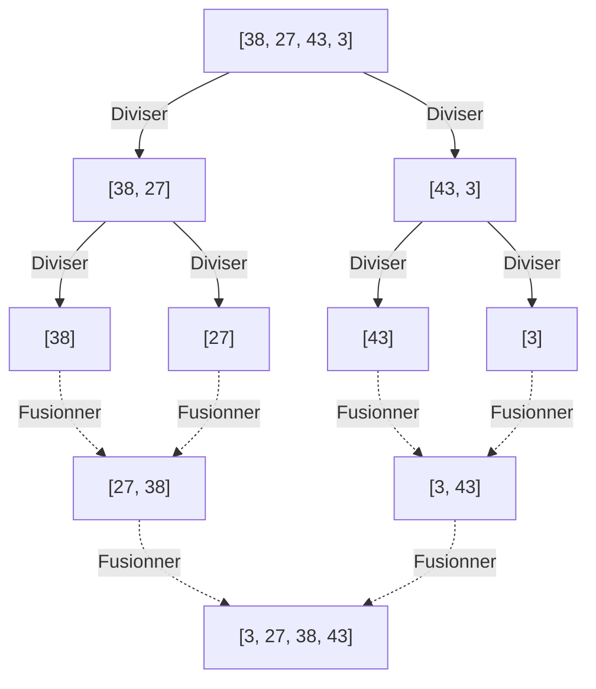
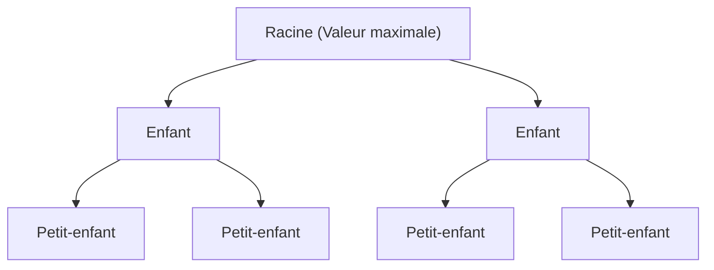

---

## 2. Les Algorithmes en $O(n^2)$ : Bases et Approches Intuitives

Les premiers que nous introduisons sont le groupe d'algorithmes de base dont la complexité est de $O(n^2)$. Bien qu'ils soient peu pratiques pour des ensembles de données à grande échelle, leur implémentation est intuitive et très simple, ce qui en fait un excellent matériel pédagogique pour apprendre les bases des algorithmes. De plus, lorsque la taille des données est extrêmement petite ou pour des données presque triées, ils peuvent fonctionner plus rapidement que des algorithmes complexes.

### 2.1 Tri à Bulles (Bubble Sort)

Le tri à bulles est l'un des algorithmes de tri les plus célèbres et les plus simples. Il compare deux éléments adjacents et les échange s'ils sont dans le mauvais ordre, en répétant cette opération jusqu'à la fin du tableau. Cela est répété jusqu'à ce que tout le tableau soit trié. À la fin de chaque passage, l'élément le plus grand (ou le plus petit) se déplace en "remontant" vers l'extrémité du tableau, d'où son nom de tri à bulles.

#### Fonctionnement du tri à bulles

1. Compare les éléments adjacents (`arr[i]` et `arr[i+1]`) dans l'ordre à partir du début du tableau.
2. Si l'élément de gauche est plus grand que celui de droite, ils sont permutés (échangés).
3. En répétant cela jusqu'à la fin du tableau, la valeur maximale du tableau est déplacée tout à droite.
4. Au passage suivant, on répète l'opération à partir du 1, en excluant l'élément le plus à droite.
5. Lorsque plus aucune permutation ne se produit, on considère que le tableau est complètement trié et on termine.

#### Complexité en temps/espace et caractéristiques

*   **Complexité en temps dans le pire des cas** : $O(n^2)$ (lorsque le tableau est trié en ordre inverse)
*   **Complexité en temps moyenne** : $O(n^2)$
*   **Complexité en temps dans le meilleur des cas** : $O(n)$ (lorsque c'est déjà trié et qu'on utilise un drapeau d'optimisation)
*   **Complexité en espace** : $O(1)$ (In-place)
*   **Stabilité** : Stable (Stable)

Étant donné qu'il n'effectue que des échanges d'éléments adjacents, les éléments ayant la même valeur ne se dépasseront jamais, ce qui en fait un algorithme stable.

#### Code d'implémentation Python

```python
def bubble_sort(arr):
    n = len(arr)
    # Exécuter n passages
    for i in range(n):
        # Drapeau pour une terminaison anticipée
        swapped = False
        
        # Ignorer la partie arrière déjà triée (i éléments)
        for j in range(0, n - i - 1):
            # Si l'élément de gauche est plus grand que celui de droite, les échanger
            if arr[j] > arr[j + 1]:
                arr[j], arr[j + 1] = arr[j + 1], arr[j]
                swapped = True
                
        # Si aucun échange n'a eu lieu pendant ce passage, le tri est déjà terminé
        if not swapped:
            break
            
    return arr
```

#### Trace étape par étape

Regardons le processus de tri du tableau `[5, 3, 8, 4, 2]` en ordre croissant avec le tri à bulles.

*   **Passage 1** :
    *   Comparer (5, 3) $\rightarrow$ Échanger : `[3, 5, 8, 4, 2]`
    *   Comparer (5, 8) $\rightarrow$ Conserver : `[3, 5, 8, 4, 2]`
    *   Comparer (8, 4) $\rightarrow$ Échanger : `[3, 5, 4, 8, 2]`
    *   Comparer (8, 2) $\rightarrow$ Échanger : `[3, 5, 4, 2, 8]` (8 est fixé)
*   **Passage 2** :
    *   Comparer (3, 5) $\rightarrow$ Conserver : `[3, 5, 4, 2, 8]`
    *   Comparer (5, 4) $\rightarrow$ Échanger : `[3, 4, 5, 2, 8]`
    *   Comparer (5, 2) $\rightarrow$ Échanger : `[3, 4, 2, 5, 8]` (5 est fixé)
*   **Passage 3** :
    *   Comparer (3, 4) $\rightarrow$ Conserver : `[3, 4, 2, 5, 8]`
    *   Comparer (4, 2) $\rightarrow$ Échanger : `[3, 2, 4, 5, 8]` (4 est fixé)
*   **Passage 4** :
    *   Comparer (3, 2) $\rightarrow$ Échanger : `[2, 3, 4, 5, 8]` (3 est fixé, 2 est aussi automatiquement fixé)

### 2.2 Tri par Sélection (Selection Sort)

Le tri par sélection divise le tableau en une "partie triée" et une "partie non triée", recherche l'élément le plus petit (ou le plus grand) dans la partie non triée et l'échange avec le premier élément de la partie non triée. C'est un algorithme qui répète cette opération.

#### Fonctionnement du tri par sélection

1. Au début, le tableau entier est la partie non triée.
2. Chercher la plus petite valeur parmi la partie non triée.
3. Échanger cette valeur minimale avec le premier élément de la partie non triée.
4. Ainsi, le premier élément est inclus dans la partie triée, et la partie non triée diminue de 1.
5. Répéter cette opération jusqu'à ce qu'il n'y ait plus de partie non triée.

#### Complexité en temps/espace et caractéristiques

*   **Complexité en temps dans le pire des cas** : $O(n^2)$
*   **Complexité en temps moyenne** : $O(n^2)$
*   **Complexité en temps dans le meilleur des cas** : $O(n^2)$
*   **Complexité en espace** : $O(1)$ (In-place)
*   **Stabilité** : Instable (Unstable)

Le tri par sélection parcourt toujours jusqu'à la fin pour trouver la valeur minimale quel que soit l'ordre des données, donc même dans le meilleur des cas cela prend $O(n^2)$. De plus, comme il effectue des permutations avec des éléments situés loin, il n'est pas stable.

#### Code d'implémentation Python

```python
def selection_sort(arr):
    n = len(arr)
    
    # Parcourir tout le tableau
    for i in range(n):
        # Supposer que la position actuelle est l'index de la valeur minimale
        min_idx = i
        
        # Chercher la vraie valeur minimale dans le reste de la partie non triée
        for j in range(i + 1, n):
            if arr[j] < arr[min_idx]:
                min_idx = j
                
        # Si une valeur minimale est trouvée, l'échanger avec la position actuelle (i)
        arr[i], arr[min_idx] = arr[min_idx], arr[i]
        
    return arr
```

#### Trace étape par étape

Trier le tableau `[29, 10, 14, 37, 13]` par sélection.

*   **i = 0** : Chercher la valeur minimale dans `[29, 10, 14, 37, 13]` $\rightarrow$ La valeur minimale est 10. Échanger 29 et 10.
    Résultat : `[10, 29, 14, 37, 13]` (10 est fixé)
*   **i = 1** : Chercher la valeur minimale dans le reste `[29, 14, 37, 13]` $\rightarrow$ La valeur minimale est 13. Échanger 29 et 13.
    Résultat : `[10, 13, 14, 37, 29]` (13 est fixé)
*   **i = 2** : Chercher la valeur minimale dans le reste `[14, 37, 29]` $\rightarrow$ La valeur minimale est 14. Tel quel (auto-échange).
    Résultat : `[10, 13, 14, 37, 29]` (14 est fixé)
*   **i = 3** : Chercher la valeur minimale dans le reste `[37, 29]` $\rightarrow$ La valeur minimale est 29. Échanger 37 et 29.
    Résultat : `[10, 13, 14, 29, 37]` (29 est fixé, 37 est aussi automatiquement fixé)

### 2.3 Tri par Insertion (Insertion Sort)

Le tri par insertion est une méthode intuitive que nous utilisons souvent lorsque nous tenons des cartes à jouer en main et organisons notre jeu. C'est un algorithme qui extrait un élément de la partie non triée et l'insère à la bonne position dans la partie déjà triée.

#### Fonctionnement du tri par insertion

1. Le premier élément du tableau (index 0) est considéré comme déjà trié.
2. Extraire l'élément suivant (index 1) (nommons-le `key`), et le comparer séquentiellement à partir de l'arrière avec les éléments de la partie triée (à gauche).
3. S'il y a un élément plus grand que `key`, décaler cet élément d'une position vers la droite.
4. Une fois que la position correcte où insérer `key` est trouvée, y placer `key`.
5. Répéter cela jusqu'à la fin du tableau.

#### Complexité en temps/espace et caractéristiques

*   **Complexité en temps dans le pire des cas** : $O(n^2)$ (lorsque trié en ordre inverse)
*   **Complexité en temps moyenne** : $O(n^2)$
*   **Complexité en temps dans le meilleur des cas** : $O(n)$ (lorsque presque trié)
*   **Complexité en espace** : $O(1)$ (In-place)
*   **Stabilité** : Stable (Stable)

La plus grande force du tri par insertion est que **lorsque les données sont déjà triées (ou proches de l'être), les comparaisons et les déplacements sont minimisés, de sorte qu'il fonctionne extrêmement rapidement avec une vitesse proche de $O(n)$**. Cette propriété est grandement exploitée dans les algorithmes hybrides comme le Timsort, qui sera décrit plus tard.

#### Code d'implémentation Python

```python
def insertion_sort(arr):
    # Commencer à l'index 1 (le 0ème est considéré comme trié)
    for i in range(1, len(arr)):
        key = arr[i]
        j = i - 1
        
        # Parcourir la partie triée à partir de l'arrière, décaler vers la droite ceux plus grands que key
        while j >= 0 and key < arr[j]:
            arr[j + 1] = arr[j]
            j -= 1
            
        # Insérer key dans la position correcte libérée
        arr[j + 1] = key
        
    return arr
```

#### Trace étape par étape

Trier le tableau `[12, 11, 13, 5, 6]` par insertion.

*   **i = 1 (key = 11)** : Comparer avec 12 à gauche. Comme 12 > 11, décaler 12 à droite et insérer 11 dans l'espace vide.
    Résultat : `[11, 12, 13, 5, 6]`
*   **i = 2 (key = 13)** : Comparer avec 12 à gauche. Comme 12 < 13, pas besoin de décaler. Tel quel.
    Résultat : `[11, 12, 13, 5, 6]`
*   **i = 3 (key = 5)** : Comparer successivement avec 13, 12, 11 ; tous étant plus grands que 5, les décaler tous vers la droite. Insérer 5 tout à gauche.
    Résultat : `[5, 11, 12, 13, 6]`
*   **i = 4 (key = 6)** : Comparer successivement avec 13, 12, 11 et décaler vers la droite. Comme 5 < 6, insérer 6 juste à droite de 5.
    Résultat : `[5, 6, 11, 12, 13]`

---

## 3. Les Algorithmes en $O(n \log n)$ : Diviser pour Régner et Efficacité Écrasante

Lorsque la quantité de données $n$ devient importante, le temps de calcul des algorithmes en $O(n^2)$ explose et ils ne sont plus utilisables en pratique. C'est là qu'interviennent les algorithmes utilisant des techniques avancées comme la méthode **Diviser pour régner** (Divide and Conquer), qui divise le tableau et le traite récursivement. Ils atteignent la limite théorique de $O(n \log n)$ des algorithmes de tri basés sur la comparaison et démontrent des performances écrasantes pour les données à grande échelle.

### 3.1 Tri Fusion (Merge Sort)

Le tri fusion est un algorithme beau et robuste inventé par John von Neumann en 1945. C'est un exemple typique de la méthode « diviser pour régner », adoptant une approche où le tableau est divisé en moitiés, puis encore en moitiés jusqu'à ce qu'il ne reste plus qu'un élément, après quoi ils sont « fusionnés » tout en étant triés.

#### Fonctionnement du tri fusion

1. **Diviser (Divide)** : Diviser le tableau donné au milieu en deux sous-tableaux. Répéter cela récursivement jusqu'à ce que la longueur du sous-tableau soit de 1 (un tableau de longueur 1 peut être considéré comme déjà trié).
2. **Régner et Combiner (Conquer and Combine)** : Comparer les premiers éléments de deux sous-tableaux triés, et stocker le plus petit dans un nouveau tableau. Répéter cela pour les fusionner jusqu'à retrouver le tableau unique d'origine.



#### Complexité en temps/espace et caractéristiques

*   **Complexités dans le pire cas, moyen et meilleur cas** : Toutes sont à $O(n \log n)$
    *   Puisqu'il divise toujours par deux, la profondeur de division est $\log_2 n$. À chaque niveau, le processus de fusion prend $O(n)$ en temps global, d'où la multiplication donnant $O(n \log n)$. Il est très prévisible et robuste car la complexité est constante quel que soit l'état des données.
*   **Complexité en espace** : $O(n)$ (Out-of-place)
    *   Son plus grand point faible est qu'il nécessite un tableau de travail de la même taille que le tableau d'origine lors de la fusion.
*   **Stabilité** : Stable (Stable)
    *   En cas de valeurs égales lors de la fusion, la stabilité peut être maintenue en donnant la priorité à l'extraction de l'élément du tableau de gauche.

#### Code d'implémentation Python

```python
def merge_sort(arr):
    # Si la longueur du tableau est de 1 ou moins, il est déjà trié, le renvoyer
    if len(arr) <= 1:
        return arr
        
    # 1. Diviser : Calculer l'index central
    mid = len(arr) // 2
    left_half = arr[:mid]
    right_half = arr[mid:]
    
    # Trier les côtés gauche et droit récursivement
    left_sorted = merge_sort(left_half)
    right_sorted = merge_sort(right_half)
    
    # 2. Fusionner : Fusionner les tableaux gauche et droit triés
    return merge(left_sorted, right_sorted)

def merge(left, right):
    result = []
    i = j = 0
    
    # Tant qu'il reste des éléments dans les deux tableaux
    while i < len(left) and j < len(right):
        if left[i] <= right[j]:  # Utiliser <= pour la stabilité
            result.append(left[i])
            i += 1
        else:
            result.append(right[j])
            j += 1
            
    # Ajouter les éléments restants
    result.extend(left[i:])
    result.extend(right[j:])
    
    return result
```

### 3.2 Tri Rapide (Quick Sort)

Le tri rapide, inventé par Tony Hoare, est, comme son nom l'indique, un excellent algorithme qui s'avère souvent être le plus rapide dans le monde réel. Tout comme le tri fusion, il utilise la méthode diviser pour régner, mais son approche est différente. Il choisit un élément de référence (**pivot**) et fait progresser le tri en répartissant les éléments en un groupe plus petit que le pivot et un groupe plus grand.

#### Fonctionnement du tri rapide

1. **Choix du pivot** : Choisir un élément du tableau comme pivot (valeur de référence).
2. **Partition (Division)** : Rassembler les éléments plus petits que le pivot à gauche et les éléments plus grands à droite. Une fois cette opération terminée, la position finale post-tri du pivot lui-même est fixée.
3. **Traitement récursif** : Répéter récursivement le même traitement pour le tableau à gauche du pivot et le tableau à droite.

Les performances varient considérablement selon la méthode de choix du pivot et la méthode de division (Méthode de Hoare, Méthode de Lomuto).

#### Complexité en temps/espace et caractéristiques

*   **Complexité en temps dans le pire des cas** : $O(n^2)$
    *   C'est un point faible fatal. Si l'on choisit toujours l'élément à l'extrémité comme pivot pour un tableau déjà trié, le tableau continuera à être divisé de manière déséquilibrée entre "un élément" et "tout le reste", tombant ainsi dans la pire complexité. Pour éviter cela, des astuces pour le choix du pivot comme la « Médiane de trois (prendre la médiane entre le premier, le milieu et le dernier) » sont indispensables.
*   **Complexité en temps moyenne** : $O(n \log n)$
    *   En réalité, le coefficient constant est très petit et l'efficacité du cache est extrêmement bonne, ce qui le fait fonctionner plus rapidement que le tri fusion ou le tri par tas.
*   **Complexité en espace** : Moyenne $O(\log n)$, Pire $O(n)$
    *   C'est un algorithme In-place qui modifie directement le tableau lui-même, mais il consomme de la pile d'appels pour les appels récursifs.
*   **Stabilité** : Instable (Unstable)
    *   Comme des échanges d'éléments éloignés se produisent lors de l'opération de partition, il n'est pas stable.

#### Code d'implémentation Python (Version par compréhension de liste facile à comprendre)

Celle-ci n'est pas efficace en mémoire, mais elle exprime le plus clairement l'intention de l'algorithme.

```python
def quick_sort_simple(arr):
    if len(arr) <= 1:
        return arr
    
    # Choisir l'élément central comme pivot
    pivot = arr[len(arr) // 2]
    
    # Diviser en 3 listes : inférieur au pivot, égal et supérieur
    left = [x for x in arr if x < pivot]
    middle = [x for x in arr if x == pivot]
    right = [x for x in arr if x > pivot]
    
    # Combiner récursivement
    return quick_sort_simple(left) + middle + quick_sort_simple(right)
```

#### Code d'implémentation Python (Version Schéma de Partition de Lomuto In-place)

C'est l'implémentation In-place sans utilisation de mémoire, telle qu'utilisée dans les bibliothèques réelles.

```python
def quick_sort_inplace(arr, low, high):
    if low < high:
        # Effectuer la division en partition et obtenir la position correcte du pivot
        pi = partition(arr, low, high)
        
        # Trier récursivement la gauche et la droite du pivot
        quick_sort_inplace(arr, low, pi - 1)
        quick_sort_inplace(arr, pi + 1, high)

def partition(arr, low, high):
    # Choisir le dernier élément comme pivot (Méthode de Lomuto)
    pivot = arr[high]
    
    # i pointe vers le dernier index des éléments plus petits que le pivot
    i = low - 1
    
    for j in range(low, high):
        # Si l'élément actuel est inférieur ou égal au pivot, avancer i et échanger
        if arr[j] <= pivot:
            i = i + 1
            arr[i], arr[j] = arr[j], arr[i]
            
    # Insérer le pivot à la position correcte (i+1)
    arr[i + 1], arr[high] = arr[high], arr[i + 1]
    
    return i + 1
```

### 3.3 Tri par Tas (Heap Sort)

Le tri par tas est un algorithme de tri qui utilise habilement une structure de données arborescente appelée **Tas Binaire (Binary Heap)**. Bien que sa complexité dans le pire des cas soit de $O(n \log n)$, il possède la caractéristique d'être un tri In-place n'utilisant pas de mémoire supplémentaire, ce qui le rend semblable à un regroupement des avantages du tri fusion et du tri rapide.

#### Fonctionnement du tri par tas

1. **Construction du tas** : D'abord, convertir le tableau donné en un "Tas Max (Max Heap)". Un tas max est un arbre binaire complet qui satisfait la règle selon laquelle la valeur d'un nœud parent est toujours supérieure ou égale à la valeur de ses nœuds enfants. En utilisant le calcul d'index sur le tableau (parent : $(i-1)/2$, enfant gauche : $2i+1$, enfant droit : $2i+2$), on peut représenter la structure en arbre directement avec le tableau.
2. **Extraction du maximum et reconstruction** : À la racine du tas max (le premier élément du tableau `arr[0]`) se trouve toujours la valeur maximale. On échange cette valeur maximale avec le dernier élément du tableau. Ainsi, la valeur maximale est fixée à la dernière position du tableau.
3. Étant donné que la racine a été modifiée, la condition du tas est brisée, nous effectuons donc une "Reconstruction du tas (Heapify)" sur la plage excluant la fin du tas (la partie déjà fixée), afin de satisfaire à nouveau la condition du tas max.
4. En répétant cette opération jusqu'à ce qu'il ne reste qu'un élément, de grandes valeurs sont fixées dans l'ordre à partir de la fin du tableau, et finalement il est trié en ordre croissant.



#### Complexité en temps/espace et caractéristiques

*   **Complexités dans le pire cas, moyen et meilleur cas** : Toutes sont à $O(n \log n)$
    *   Puisqu'il répète $n$ fois la construction du tas en $O(n)$ et l'extraction de la valeur maximale avec la reconstruction ($O(\log n)$), cela donne $O(n \log n)$ au total. Étant donné que cette complexité est garantie quel que soit l'ordre des données, c'est très utile dans les systèmes où l'évitement du pire des cas est requis.
*   **Complexité en espace** : $O(1)$ (In-place)
    *   Comme il représente l'arbre du tas tel quel sur le tableau, il ne nécessite pas de mémoire supplémentaire.
*   **Stabilité** : Instable (Unstable)
    *   Lors du processus de construction du tas et d'extraction, des éléments très éloignés sont échangés, il n'est donc pas stable.

#### Code d'implémentation Python

```python
def heapify(arr, n, i):
    largest = i          # Supposer que la racine est le maximum
    left = 2 * i + 1     # Enfant gauche
    right = 2 * i + 2    # Enfant droit

    # Si l'enfant gauche est plus grand que la racine
    if left < n and arr[left] > arr[largest]:
        largest = left

    # Si l'enfant droit est plus grand que la valeur maximale actuelle
    if right < n and arr[right] > arr[largest]:
        largest = right

    # Si la racine n'était pas la valeur maximale, l'échanger et entasser récursivement
    if largest != i:
        arr[i], arr[largest] = arr[largest], arr[i]
        heapify(arr, n, largest)

def heap_sort(arr):
    n = len(arr)

    # 1. Construction du tas max (construit de bas en haut)
    # Entasser depuis le dernier nœud non-feuille vers la racine
    for i in range(n // 2 - 1, -1, -1):
        heapify(arr, n, i)

    # 2. Extraire les éléments un par un et les trier
    for i in range(n - 1, 0, -1):
        # Échanger la racine actuelle (valeur maximale) avec la fin de la partie non triée
        arr[i], arr[0] = arr[0], arr[i]
        
        # Reconstruire pour le nouveau tas avec une taille réduite
        heapify(arr, i, 0)
        
    return arr
```

---

## 4. Tris Non Comparatifs en $O(n)$ : Au-delà des Limites de la Comparaison

Tous les algorithmes de tri que nous avons vus jusqu'à présent étaient des "tris basés sur la comparaison" qui jugeaient la relation de taille entre les éléments en utilisant des opérateurs de comparaison (`<`, `>`, `==`). Il est mathématiquement prouvé que les tris basés sur la comparaison ne peuvent pas être plus rapides que $O(n \log n)$.

Cependant, si l'on utilise intelligemment la nature des données (étant des nombres entiers, ayant un nombre fixe de chiffres, ayant une plage étroite, etc.) et qu'on utilise un algorithme spécial qui ne fait aucune "comparaison", il devient possible d'effectuer un tri ultra-rapide en temps linéaire $O(n)$.

### 4.1 Tri par Dénombrement (Counting Sort)

Le tri par dénombrement est un algorithme qui calcule la position correcte des éléments en « comptant » combien de fois une certaine valeur de clé existe dans les données. Il est particulièrement efficace lorsqu'il s'agit de trier des nombres entiers sur une plage étroite allant de 0 à une certaine valeur maximale $k$.

#### Complexité en temps/espace
*   **Complexité en temps** : $O(n + k)$. Dépend du nombre de données $n$ et de la plage de valeurs $k$. Si $k$ est à peu près du même ordre que $n$, ce sera $O(n)$, mais si $k$ est très grand (par exemple : un tableau qui n'a que 1 et 1 milliard), il deviendra considérablement inefficace.
*   **Complexité en espace** : $O(n + k)$. Nécessite un tableau pour compter et un tableau pour la sortie.

#### Image de l'implémentation en Python
```python
def counting_sort(arr):
    if not arr:
        return arr
        
    max_val = max(arr)
    # Initialiser le tableau de comptage avec des zéros
    count = [0] * (max_val + 1)
    
    # 1. Compter le nombre d'apparitions de chaque élément
    for num in arr:
        count[num] += 1
        
    # 2. Calculer la somme cumulée (pour déterminer la position finale de l'élément)
    for i in range(1, len(count)):
        count[i] += count[i - 1]
        
    # 3. Générer le tableau de sortie (parcourir par l'arrière pour maintenir la stabilité)
    output = [0] * len(arr)
    for num in reversed(arr):
        output[count[num] - 1] = num
        count[num] -= 1
        
    return output
```

### 4.2 Tri par Base (Radix Sort)

Celui qui surmonte la faiblesse du tri par dénombrement, "inutilisable si la plage de valeurs est large", est le tri par base. Il complète le tri global en appliquant un tri stable (souvent en utilisant le tri par dénombrement en interne) depuis le chiffre du bas (LSD: Least Significant Digit) comme "l'unité", "la dizaine", "la centaine". Il est également appliqué au tri de chaînes de caractères.

### 4.3 Tri par Baquets (Bucket Sort)

Le tri par baquets divise la plage possible des données en "baquets" de taille égale et répartit chaque donnée dans le baquet correspondant. Ensuite, il effectue un tri séparé à l'intérieur de chaque baquet (souvent en utilisant un tri par insertion), et finalement réunit le contenu de tous les baquets dans l'ordre pour compléter. Lorsque les données sont distribuées uniformément sur une certaine plage, il fonctionne de manière extrêmement rapide en moyenne avec $O(n)$.

---

## 5. Les Algorithmes Hybrides qui Dominent le Monde Pratique Moderne

Alors que les manuels académiques couvrent souvent jusqu'au tri rapide et au tri fusion, ce qui fonctionne réellement dans les coulisses des langages de programmation actuels, ce sont les **algorithmes hybrides** qui combinent les avantages de plusieurs algorithmes.

### 5.1 Timsort (Par défaut en Python)

Le Timsort est un algorithme implémenté pour Python en 2002 par Tim Peters. Aujourd'hui, il est le champion du monde pratique, adopté dans de nombreux langages, tels que `list.sort()` et `sorted()` de Python bien sûr, mais aussi pour les tableaux d'objets de Java et le tri standard de [Rust](https://kenji.blog/fr/p/webassembly-wasm-current-future/).

La plus grande philosophie de conception du Timsort est basée sur l'expérience selon laquelle **« dans le monde réel, les données sont rarement complètement aléatoires, et sont souvent partiellement triées (il y a des blocs consécutifs ascendants ou descendants) »**.

#### Caractéristiques du Timsort
*   **Fusion du tri fusion et du tri par insertion** : Il divise le tableau en blocs d'une certaine taille (généralement environ 32 à 64 éléments), et les trie chacun très rapidement avec le tri par insertion. Ensuite, il les fusionne à la manière d'un tri fusion.
*   **Utilisation des courses (Run)** : Il parcourt le tableau et détecte les parties qui sont consécutivement ascendantes (ou descendantes) depuis le début (nous appelons cela un "Run"). Dans le cas descendant, il l'inverse pour le rendre ascendant, et les utilise comme unités de fusion.
*   **Complexité adaptative (Adaptive)** : Pour des données complètement aléatoires, il garantit $O(n \log n)$ au pire, mais pour des données déjà triées ou partiellement triées, il peut atteindre une vitesse incroyable de $O(n)$ au mieux.
*   **Stabilité** : C'est un algorithme stable.

### 5.2 Introsort (C++ `std::sort`)

L'Introspective Sort (Introsort) est adopté par la STL de C++ pour `std::sort`, ainsi que pour le tri standard de .NET (C#), entre autres.

Le tri rapide est en moyenne le plus rapide, mais selon la façon de choisir le pivot, il avait un point faible fatal qui le faisait tomber au pire à $O(n^2)$. L'Introsort est une méthode hybride qui a complètement surmonté cette faiblesse.

#### Caractéristiques de l'Introsort
1. Fondamentalement, il utilise le **tri rapide** très véloce pour diviser le tableau.
2. Cependant, il surveille la profondeur de la récursion. Si la profondeur de division dépasse un multiple constant de $\log_2 n$ (ex: $2 \times \log_2 n$), il juge que « le choix du pivot ne fonctionne pas bien, et nous sommes sur le point de tomber dans la pire complexité » (Introspection : Auto-réflexion).
3. À ce stade, la méthode de tri pour ce sous-tableau passe au **tri par tas**, dont la pire complexité est de $O(n \log n)$.
4. De plus, lorsque le nombre d'éléments devient très petit (ex: 16 éléments ou moins), il passe au **tri par insertion** pour éviter les surcoûts d'appels de fonctions.

Grâce à cela, tout en conservant la vitesse moyenne écrasante du tri rapide, il garantit $O(n \log n)$ même dans le pire des cas, réalisant ainsi un algorithme sans faille.

---

## 6. Résumé du Tableau de Comparaison Globale

Nous avons résumé sous forme de tableau les performances des principaux algorithmes de tri expliqués dans cet article.

| Algorithme (Algorithm) | Complexité Meilleur Cas (Best Time) | Complexité Moyenne (Avg Time) | Complexité Pire Cas (Worst Time) | Complexité en Espace (Space) | Stabilité (Stability) | Méthode & Caractéristiques |
| :--- | :--- | :--- | :--- | :--- | :--- | :--- |
| **Tri à Bulles (Bubble Sort)** | $O(n)$ | $O(n^2)$ | $O(n^2)$ | $O(1)$ | Yes | Échange. Éducatif. Utilité pratique faible. |
| **Tri par Sélection (Selection Sort)** | $O(n^2)$ | $O(n^2)$ | $O(n^2)$ | $O(1)$ | No | Sélection. Nécessite toujours de parcourir tout. |
| **Tri par Insertion (Insertion Sort)** | $O(n)$ | $O(n^2)$ | $O(n^2)$ | $O(1)$ | Yes | Insertion. Extrêmement fort sur données presque triées. |
| **Tri Fusion (Merge Sort)** | $O(n \log n)$ | $O(n \log n)$ | $O(n \log n)$ | $O(n)$ | Yes | Diviser pour régner. Complexité robuste mais gourmand en mémoire. |
| **Tri Rapide (Quick Sort)** | $O(n \log n)$ | $O(n \log n)$ | $O(n^2)$ | $O(\log n)$ | No | Diviser pour régner. Plus rapide en moyenne mais attention au pire cas. |
| **Tri par Tas (Heap Sort)** | $O(n \log n)$ | $O(n \log n)$ | $O(n \log n)$ | $O(1)$ | No | Tas Binaire. In-place et robuste. |
| **Tri par Dénombrement (Counting Sort)** | $O(n+k)$ | $O(n+k)$ | $O(n+k)$ | $O(k)$ | Yes | Non comparatif. Imbattable si plage de clés étroite. |
| **Timsort** (Standard Python etc.) | $O(n)$ | $O(n \log n)$ | $O(n \log n)$ | $O(n)$ | Yes | Hybride. Adaptatif et le plus rapide pour données réelles. |
| **Introsort** (Standard C++ etc.) | $O(n \log n)$ | $O(n \log n)$ | $O(n \log n)$ | $O(\log n)$ | No | Hybride. Allie la vitesse de Quick et la robustesse de Heap. |

---

## 7. Conclusion : Lequel devriez-vous finalement utiliser ?

Bien que nous ayons expliqué de nombreux algorithmes de tri jusqu'ici, dans le développement logiciel pratique, il y a une réponse claire.

**« Fondamentalement, utilisez la fonction de tri standard intégrée au langage »**

Tout se résume à ça. `.sort()` en Python ou `std::sort` en C++ sont implémentés avec les algorithmes hybrides avancés comme Timsort et Introsort introduits dans cet article, et d'innombrables optimisations (amélioration de l'efficacité du cache mémoire, optimisation de la prédiction de branchement, etc.) y ont été appliquées. Il est presque impossible que votre propre tri rapide surpasse la vitesse de la bibliothèque standard.

Mais alors, pourquoi avons-nous besoin d'apprendre les algorithmes de tri ?

1. **Compréhension des concepts fondamentaux** : Les concepts de complexité (Big O Notation), de traitement In-place/Out-of-place et de stabilité sont les bases de la conception de tout algorithme et structure de données, pas seulement du tri.
2. **Systèmes sous contraintes spécifiques** : Dans un environnement où la mémoire est extrêmement restreinte comme les systèmes embarqués, il peut être nécessaire d'implémenter par soi-même un tri par tas avec un espace de $O(1)$ ou un tri rapide In-place.
3. **Exploiter la nature des données** : Lors du tri de « 1 million de données dont la plage de valeurs est limitée de 1 à 100 », implémenter un tri par dénombrement ($O(n)$) sera considérablement plus rapide que d'utiliser le Timsort standard ($O(n \log n)$).

En connaissant la structure interne des algorithmes, vous pouvez comprendre « ce en quoi elles sont douées » et « ce qu'elles ne font pas bien », même pour les fonctions standard fournies comme des boîtes noires, et vous serez capable de concevoir des systèmes plus avancés et plus efficaces.

N'hésitez pas à essayer de faire fonctionner le code Python de cet article sur votre ordinateur, à modifier la quantité de données ou à passer des données en ordre inverse, afin de ressentir par vous-même le comportement et le temps d'exécution de chaque algorithme !
