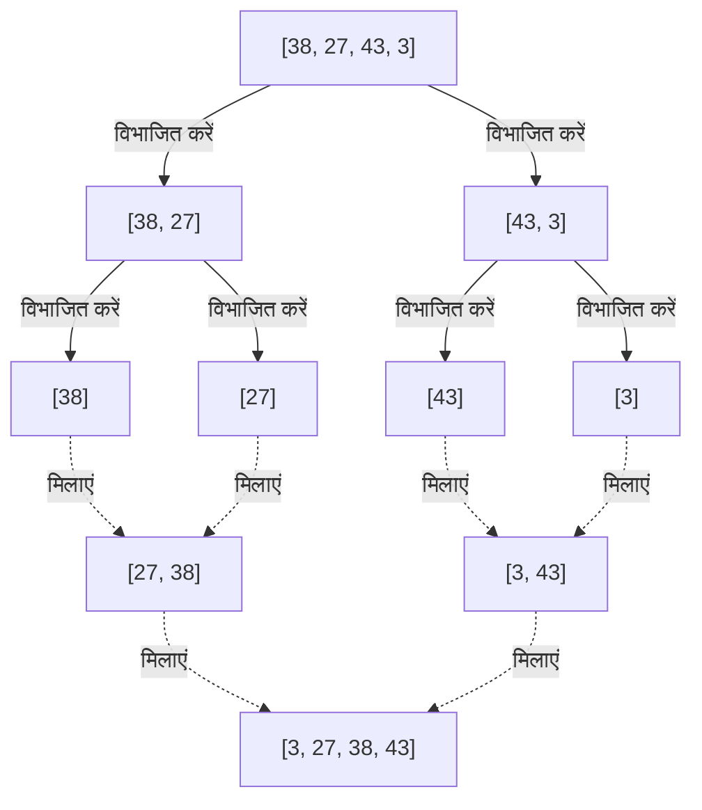
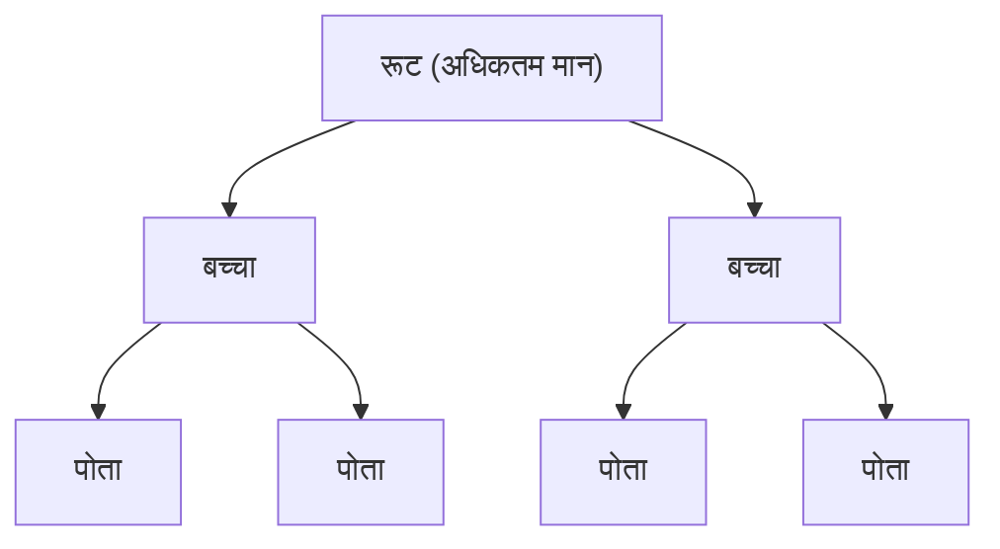

---

## 2. $O(n^2)$ के एल्गोरिदम: मूल बातें और सहज दृष्टिकोण

सबसे पहले हम बुनियादी एल्गोरिदम के उस समूह का परिचय देंगे जिनकी समय जटिलता $O(n^2)$ है। यद्यपि बड़े डेटासेट के लिए इनकी व्यावहारिकता कम है, इनका कार्यान्वयन सहज और बहुत सरल है, जो इन्हें एल्गोरिदम की मूल बातें सीखने के लिए एक उत्कृष्ट शिक्षण सामग्री बनाता है। इसके अलावा, जब डेटा का आकार बहुत छोटा होता है, या लगभग सॉर्ट किए गए डेटा के लिए, वे जटिल एल्गोरिदम की तुलना में तेज़ी से भी काम कर सकते हैं।

### 2.1 बबल सॉर्ट (Bubble Sort)

बबल सॉर्ट सबसे प्रसिद्ध और सरल सॉर्टिंग एल्गोरिदम में से एक है। यह आसन्न दो तत्वों की तुलना करता है और यदि उनका क्रम विपरीत है तो उन्हें स्वैप (अदला-बदली) करता है; यह प्रक्रिया ऐरे के अंत तक की जाती है। इसे तब तक दोहराया जाता है जब तक कि पूरा ऐरे सॉर्ट न हो जाए। चूंकि प्रत्येक पास के अंत में सबसे बड़ा (या सबसे छोटा) तत्व ऐरे के अंत तक "बुलबुले" की तरह ऊपर की ओर बढ़ता है, इसलिए इसे बबल सॉर्ट कहा जाता है।

#### बबल सॉर्ट कैसे काम करता है

1. ऐरे की शुरुआत से क्रमानुसार आसन्न तत्वों (`arr[i]` और `arr[i+1]`) की तुलना करें।
2. यदि बायां तत्व दाएं तत्व से बड़ा है, तो दोनों को स्वैप (अदला-बदली) करें।
3. इसे ऐरे के अंत तक दोहराएं, जिससे ऐरे का अधिकतम मान सबसे दाईं ओर खिसक जाएगा।
4. अगले पास में, सबसे दाएं तत्व को छोड़कर 1 से प्रक्रिया को फिर से दोहराएं।
5. जब कोई स्वैप नहीं होता है, तो यह माना जाता है कि ऐरे पूरी तरह से सॉर्ट हो गया है और प्रक्रिया समाप्त हो जाती है।

#### समय/स्थान जटिलता और विशेषताएं

*   **सबसे खराब समय जटिलता**: $O(n^2)$ (जब ऐरे उल्टे क्रम में सॉर्ट किया गया हो)
*   **औसत समय जटिलता**: $O(n^2)$
*   **सर्वोत्तम समय जटिलता**: $O(n)$ (जब यह पहले से ही सॉर्ट किया गया हो, और अनुकूलन ध्वज का उपयोग किया जाए)
*   **स्थान जटिलता**: $O(1)$ (इन-प्लेस)
*   **स्थिरता**: स्थिर (Stable)

चूंकि केवल आसन्न तत्वों का आदान-प्रदान किया जाता है, इसलिए समान मान वाले तत्व एक-दूसरे से आगे नहीं निकलते हैं, जिससे यह एक स्थिर एल्गोरिदम बन जाता है।

#### पायथन कार्यान्वयन कोड

```python
def bubble_sort(arr):
    n = len(arr)
    # n पास निष्पादित करें
    for i in range(n):
        # प्रारंभिक समाप्ति के लिए ध्वज
        swapped = False
        
        # पहले से सॉर्ट किए गए पिछले भाग (i तत्वों) को अनदेखा करें
        for j in range(0, n - i - 1):
            # यदि बायां तत्व दाएं से बड़ा है तो स्वैप करें
            if arr[j] > arr[j + 1]:
                arr[j], arr[j + 1] = arr[j + 1], arr[j]
                swapped = True
                
        # यदि इस पास में कोई स्वैप नहीं हुआ है, तो सॉर्टिंग पहले ही पूरी हो चुकी है
        if not swapped:
            break
            
    return arr
```

#### चरण-दर-चरण ट्रेस

आइए ऐरे `[5, 3, 8, 4, 2]` को बबल सॉर्ट का उपयोग करके आरोही क्रम में सॉर्ट करने की प्रक्रिया को देखें।

*   **पास 1**:
    *   (5, 3) की तुलना $\rightarrow$ स्वैप: `[3, 5, 8, 4, 2]`
    *   (5, 8) की तुलना $\rightarrow$ बनाए रखें: `[3, 5, 8, 4, 2]`
    *   (8, 4) की तुलना $\rightarrow$ स्वैप: `[3, 5, 4, 8, 2]`
    *   (8, 2) की तुलना $\rightarrow$ स्वैप: `[3, 5, 4, 2, 8]` (8 निश्चित)
*   **पास 2**:
    *   (3, 5) की तुलना $\rightarrow$ बनाए रखें: `[3, 5, 4, 2, 8]`
    *   (5, 4) की तुलना $\rightarrow$ स्वैप: `[3, 4, 5, 2, 8]`
    *   (5, 2) की तुलना $\rightarrow$ स्वैप: `[3, 4, 2, 5, 8]` (5 निश्चित)
*   **पास 3**:
    *   (3, 4) की तुलना $\rightarrow$ बनाए रखें: `[3, 4, 2, 5, 8]`
    *   (4, 2) की तुलना $\rightarrow$ स्वैप: `[3, 2, 4, 5, 8]` (4 निश्चित)
*   **पास 4**:
    *   (3, 2) की तुलना $\rightarrow$ स्वैप: `[2, 3, 4, 5, 8]` (3 निश्चित, 2 स्वचालित रूप से निश्चित)

### 2.2 चयन सॉर्ट (Selection Sort)

चयन सॉर्ट एक एल्गोरिदम है जो ऐरे को "सॉर्ट किए गए हिस्से" और "अनसॉर्ट किए गए हिस्से" में विभाजित करता है, अनसॉर्ट किए गए हिस्से से सबसे छोटे (या सबसे बड़े) तत्व को खोजता है, और इसे अनसॉर्ट किए गए हिस्से के पहले तत्व के साथ स्वैप करने की प्रक्रिया को दोहराता है।

#### चयन सॉर्ट कैसे काम करता है

1. प्रारंभ में, संपूर्ण ऐरे अनसॉर्ट किया गया हिस्सा होता है।
2. अनसॉर्ट किए गए हिस्से में सबसे छोटा मान खोजें।
3. उस न्यूनतम मान को अनसॉर्ट किए गए हिस्से के पहले तत्व के साथ स्वैप करें।
4. इसके परिणामस्वरूप, पहला तत्व सॉर्ट किए गए हिस्से में शामिल हो जाता है, और अनसॉर्ट किया गया हिस्सा एक से कम हो जाता है।
5. इस ऑपरेशन को तब तक दोहराएं जब तक कि कोई अनसॉर्ट किया गया हिस्सा न बचे।

#### समय/स्थान जटिलता और विशेषताएं

*   **सबसे खराब समय जटिलता**: $O(n^2)$
*   **औसत समय जटिलता**: $O(n^2)$
*   **सर्वोत्तम समय जटिलता**: $O(n^2)$
*   **स्थान जटिलता**: $O(1)$ (इन-प्लेस)
*   **स्थिरता**: अस्थिर (Unstable)

चयन सॉर्ट डेटा के क्रम की परवाह किए बिना हमेशा अंत तक न्यूनतम मान खोजने के लिए स्कैन करता है, इसलिए सर्वोत्तम स्थिति में भी $O(n^2)$ समय लगता है। इसके अलावा, चूंकि यह दूर के स्थानों पर मौजूद तत्वों के साथ स्वैप करता है, इसलिए यह स्थिर नहीं है।

#### पायथन कार्यान्वयन कोड

```python
def selection_sort(arr):
    n = len(arr)
    
    # संपूर्ण ऐरे को स्कैन करें
    for i in range(n):
        # वर्तमान स्थिति को न्यूनतम मान का इंडेक्स मान लें
        min_idx = i
        
        # शेष अनसॉर्ट किए गए हिस्से से वास्तविक न्यूनतम मान खोजें
        for j in range(i + 1, n):
            if arr[j] < arr[min_idx]:
                min_idx = j
                
        # यदि न्यूनतम मान मिल जाता है, तो इसे वर्तमान स्थिति (i) के साथ स्वैप करें
        arr[i], arr[min_idx] = arr[min_idx], arr[i]
        
    return arr
```

#### चरण-दर-चरण ट्रेस

ऐरे `[29, 10, 14, 37, 13]` को चयन सॉर्ट का उपयोग करके सॉर्ट करें।

*   **i = 0**: न्यूनतम मान खोजें `[29, 10, 14, 37, 13]` $\rightarrow$ न्यूनतम मान 10 है। 29 और 10 को स्वैप करें।
    परिणाम: `[10, 29, 14, 37, 13]` (10 निश्चित)
*   **i = 1**: शेष `[29, 14, 37, 13]` से न्यूनतम मान खोजें $\rightarrow$ न्यूनतम मान 13 है। 29 और 13 को स्वैप करें।
    परिणाम: `[10, 13, 14, 37, 29]` (13 निश्चित)
*   **i = 2**: शेष `[14, 37, 29]` से न्यूनतम मान खोजें $\rightarrow$ न्यूनतम मान 14 है। वैसा ही छोड़ दें (स्व-स्वैप)।
    परिणाम: `[10, 13, 14, 37, 29]` (14 निश्चित)
*   **i = 3**: शेष `[37, 29]` से न्यूनतम मान खोजें $\rightarrow$ न्यूनतम मान 29 है। 37 और 29 को स्वैप करें।
    परिणाम: `[10, 13, 14, 29, 37]` (29 निश्चित, 37 स्वचालित रूप से निश्चित)

### 2.3 इंसर्शन सॉर्ट (Insertion Sort)

इंसर्शन सॉर्ट एक सहज तरीका है जिसका उपयोग हम अक्सर तब करते हैं जब हम ताश के पत्तों को अपने हाथों में व्यवस्थित करते हैं। यह एक एल्गोरिदम है जो अनसॉर्ट किए गए हिस्से से एक तत्व लेता है और उसे पहले से सॉर्ट किए गए हिस्से में उसकी सही स्थिति में सम्मिलित (insert) करता है।

#### इंसर्शन सॉर्ट कैसे काम करता है

1. ऐरे के पहले तत्व (इंडेक्स 0) को पहले से सॉर्ट किया हुआ माना जाता है।
2. अगला तत्व (इंडेक्स 1) लें (हम इसे `key` कहेंगे) और पीछे से क्रमानुसार सॉर्ट किए गए हिस्से (बाईं ओर) के तत्वों के साथ इसकी तुलना करें।
3. यदि कोई तत्व `key` से बड़ा है, तो उस तत्व को एक स्थान दाईं ओर खिसकाएं।
4. जब `key` सम्मिलित करने के लिए सही स्थिति मिल जाती है, तो `key` को वहां रखें।
5. इसे ऐरे के अंत तक दोहराएं।

#### समय/स्थान जटिलता और विशेषताएं

*   **सबसे खराब समय जटिलता**: $O(n^2)$ (जब उल्टे क्रम में सॉर्ट किया गया हो)
*   **औसत समय जटिलता**: $O(n^2)$
*   **सर्वोत्तम समय जटिलता**: $O(n)$ (जब लगभग सॉर्ट किया गया हो)
*   **स्थान जटिलता**: $O(1)$ (इन-प्लेस)
*   **स्थिरता**: स्थिर (Stable)

इंसर्शन सॉर्ट की सबसे बड़ी ताकत यह है कि **जब डेटा पहले से ही सॉर्ट किया गया हो (या उसके करीब हो), तो यह बहुत तेज़ी से काम करता है, $O(n)$ गति के करीब, क्योंकि तुलना और संचलन न्यूनतम होते हैं**। इस विशेषता का व्यापक रूप से टिमसॉर्ट (Timsort) जैसे हाइब्रिड एल्गोरिदम में उपयोग किया जाता है, जिसका वर्णन बाद में किया जाएगा।

#### पायथन कार्यान्वयन कोड

```python
def insertion_sort(arr):
    # इंडेक्स 1 से शुरू करें (0वें इंडेक्स को सॉर्ट किया गया माना जाता है)
    for i in range(1, len(arr)):
        key = arr[i]
        j = i - 1
        
        # सॉर्ट किए गए हिस्से को पीछे से स्कैन करें, और key से बड़े तत्वों को दाईं ओर खिसकाएं
        while j >= 0 and key < arr[j]:
            arr[j + 1] = arr[j]
            j -= 1
            
        # सही खाली जगह में key सम्मिलित करें
        arr[j + 1] = key
        
    return arr
```

#### चरण-दर-चरण ट्रेस

ऐरे `[12, 11, 13, 5, 6]` को इंसर्शन सॉर्ट का उपयोग करके सॉर्ट करें।

*   **i = 1 (key = 11)**: बाईं ओर 12 से तुलना करें। चूंकि 12 > 11, 12 को दाईं ओर खिसकाएं और खाली जगह में 11 डालें।
    परिणाम: `[11, 12, 13, 5, 6]`
*   **i = 2 (key = 13)**: बाईं ओर 12 से तुलना करें। चूंकि 12 < 13, खिसकाने की आवश्यकता नहीं है। इसे वैसा ही रहने दें।
    परिणाम: `[11, 12, 13, 5, 6]`
*   **i = 3 (key = 5)**: क्रमानुसार 13, 12, और 11 से तुलना करें; चूंकि सभी 5 से बड़े हैं, सभी को दाईं ओर खिसकाएं। 5 को सबसे बाईं ओर डालें।
    परिणाम: `[5, 11, 12, 13, 6]`
*   **i = 4 (key = 6)**: क्रमानुसार 13, 12, और 11 से तुलना करें और दाईं ओर खिसकाएं। चूंकि 5 < 6, 6 को 5 के ठीक दाईं ओर डालें।
    परिणाम: `[5, 6, 11, 12, 13]`

---

## 3. $O(n \log n)$ के एल्गोरिदम: फूट डालो और राज करो (Divide and Conquer) और जबरदस्त दक्षता

जैसे-जैसे डेटा की मात्रा $n$ बढ़ती है, $O(n^2)$ वाले एल्गोरिदम का गणना समय बहुत तेज़ी से बढ़ता है और वे अव्यावहारिक हो जाते हैं। यहीं पर **फूट डालो और राज करो** (Divide and Conquer) जैसी उन्नत तकनीकों का उपयोग करने वाले एल्गोरिदम आते हैं, जो ऐरे को विभाजित करते हैं और उन्हें पुनरावर्ती (recursively) रूप से संसाधित करते हैं। वे $O(n \log n)$ प्राप्त करते हैं, जो तुलना-आधारित सॉर्टिंग एल्गोरिदम की सैद्धांतिक सीमा है, और बड़े पैमाने के डेटा के लिए जबरदस्त प्रदर्शन प्रदान करते हैं।

### 3.1 मर्ज सॉर्ट (Merge Sort)

मर्ज सॉर्ट एक सुंदर और मजबूत एल्गोरिदम है जिसका आविष्कार जॉन वॉन न्यूमैन ने 1945 में किया था। यह "फूट डालो और राज करो" विधि का एक विशिष्ट उदाहरण है, जो ऐरे को आधे में विभाजित करने का दृष्टिकोण अपनाता है, और फिर फिर से आधे में तब तक विभाजित करता है जब तक कि केवल एक तत्व न बचा हो, और फिर सॉर्ट करते समय उन्हें "मर्ज" (मिलाता) करता है।

#### मर्ज सॉर्ट कैसे काम करता है

1. **विभाजित करें (Divide)**: दिए गए ऐरे को बीच से दो उप-ऐरे में विभाजित करें। इसे तब तक पुनरावर्ती रूप से दोहराएं जब तक कि उप-ऐरे की लंबाई 1 न हो जाए (लंबाई 1 वाले ऐरे को पहले से ही सॉर्ट किया हुआ माना जा सकता है)।
2. **विजय प्राप्त करें और मिलाएं (Conquer and Combine)**: दो सॉर्ट किए गए उप-ऐरे के पहले तत्वों की तुलना करें और छोटे वाले को नए ऐरे में स्टोर करें। इस प्रक्रिया को तब तक दोहराएं जब तक कि वे मूल एकल ऐरे में विलीन (मर्ज) न हो जाएं।



#### समय/स्थान जटिलता और विशेषताएं

*   **सबसे खराब, औसत और सर्वोत्तम समय जटिलता**: सभी $O(n \log n)$
    *   चूंकि इसे हमेशा आधे में विभाजित किया जाता है, इसलिए विभाजन की गहराई $\log_2 n$ होती है। प्रत्येक स्तर पर मर्ज करने की प्रक्रिया में कुल $O(n)$ समय लगता है, इसलिए गुणा करने पर परिणाम $O(n \log n)$ होता है। चूंकि समय जटिलता डेटा की स्थिति की परवाह किए बिना स्थिर है, यह अत्यधिक अनुमानित और मजबूत है।
*   **स्थान जटिलता**: $O(n)$ (आउट-ऑफ-प्लेस)
    *   इसकी सबसे बड़ी कमजोरी यह है कि मर्ज करते समय मूल ऐरे के समान आकार के एक कार्यशील ऐरे की आवश्यकता होती है।
*   **स्थिरता**: स्थिर (Stable)
    *   मर्ज करते समय यदि मान समान हैं, तो स्थिरता बनाए रखने के लिए बाईं ओर के ऐरे के तत्व को प्राथमिकता देकर निकाला जा सकता है।

#### पायथन कार्यान्वयन कोड

```python
def merge_sort(arr):
    # यदि ऐरे की लंबाई 1 या उससे कम है, तो इसे पहले से सॉर्ट किया हुआ माना जाता है और वापस कर दिया जाता है
    if len(arr) <= 1:
        return arr
        
    # 1. विभाजित करें: मध्य इंडेक्स की गणना करें
    mid = len(arr) // 2
    left_half = arr[:mid]
    right_half = arr[mid:]
    
    # बाएँ और दाएँ को पुनरावर्ती रूप से सॉर्ट करें
    left_sorted = merge_sort(left_half)
    right_sorted = merge_sort(right_half)
    
    # 2. मिलाएं: सॉर्ट किए गए बाएँ और दाएँ ऐरे को मर्ज करें
    return merge(left_sorted, right_sorted)

def merge(left, right):
    result = []
    i = j = 0
    
    # जब तक दोनों ऐरे में तत्व शेष हैं
    while i < len(left) and j < len(right):
        if left[i] <= right[j]:  # स्थिरता के लिए <= का उपयोग करें
            result.append(left[i])
            i += 1
        else:
            result.append(right[j])
            j += 1
            
    # शेष तत्वों को जोड़ें
    result.extend(left[i:])
    result.extend(right[j:])
    
    return result
```

### 3.2 क्विक सॉर्ट (Quick Sort)

टोनी होरे द्वारा आविष्कार किया गया क्विक सॉर्ट, जैसा कि नाम से पता चलता है, एक उत्कृष्ट एल्गोरिदम है जो अक्सर वास्तविक दुनिया में सबसे तेज़ काम करता है। यह मर्ज सॉर्ट के समान "फूट डालो और राज करो" विधि का उपयोग करता है, लेकिन इसका दृष्टिकोण अलग है। यह एक संदर्भ तत्व (**पिवट**) का चयन करता है, और पिवट से छोटे और बड़े समूहों में तत्वों को सॉर्ट करके आगे बढ़ता है।

#### क्विक सॉर्ट कैसे काम करता है

1. **पिवट का चयन**: ऐरे से एक तत्व को पिवट (संदर्भ मान) के रूप में चुनें।
2. **पार्टीशन (विभाजन)**: पिवट से छोटे तत्वों को बाईं ओर और पिवट से बड़े तत्वों को दाईं ओर इकट्ठा करें। जब यह ऑपरेशन पूरा हो जाता है, तो सॉर्ट करने के बाद पिवट की अंतिम स्थिति निश्चित हो जाती है।
3. **पुनरावर्ती प्रसंस्करण (Recursive Processing)**: पिवट के बाएँ ऐरे और दाएँ ऐरे के लिए पुनरावर्ती रूप से उसी प्रक्रिया को दोहराएं।

पिवट का चयन करने और विभाजन करने की विधि (होरे विधि, लोमूटो विधि) के आधार पर प्रदर्शन बहुत भिन्न होता है।

#### समय/स्थान जटिलता और विशेषताएं

*   **सबसे खराब समय जटिलता**: $O(n^2)$
    *   यह एक घातक कमजोरी है। यदि आप पहले से ही सॉर्ट किए गए ऐरे के लिए हमेशा अंतिम तत्व को पिवट के रूप में चुनते हैं, तो ऐरे असंतुलित रूप से "एक" और "बाकी सभी" में विभाजित होता रहेगा, जिसके परिणामस्वरूप सबसे खराब समय जटिलता होगी। इससे बचने के लिए, पिवट चयन की तकनीकें जैसे "मीडियन-ऑफ-थ्री (पहले, मध्य और अंतिम का माध्यिका लेना)" आवश्यक हैं।
*   **औसत समय जटिलता**: $O(n \log n)$
    *   व्यावहारिक रूप से, निरंतर गुणांक बहुत छोटा है और कैश दक्षता अत्यंत अच्छी है, इसलिए यह मर्ज सॉर्ट और हीप सॉर्ट की तुलना में तेज़ी से काम करता है।
*   **स्थान जटिलता**: औसत $O(\log n)$, सबसे खराब $O(n)$
    *   यद्यपि यह एक इन-प्लेस एल्गोरिदम है जो सीधे ऐरे को फिर से लिखता है, यह पुनरावर्ती कॉल के लिए कॉल स्टैक का उपभोग करता है।
*   **स्थिरता**: अस्थिर (Unstable)
    *   चूंकि विभाजन संचालन के दौरान दूर के तत्वों का आदान-प्रदान किया जाता है, इसलिए यह स्थिर नहीं है।

#### पायथन कार्यान्वयन कोड (समझने में आसान लिस्ट कॉम्प्रिहेंशन संस्करण)

हालांकि यह मेमोरी कुशल नहीं है, यह एल्गोरिदम के इरादे को बहुत स्पष्ट रूप से व्यक्त करता है।

```python
def quick_sort_simple(arr):
    if len(arr) <= 1:
        return arr
    
    # मध्य तत्व को पिवट के रूप में चुनें
    pivot = arr[len(arr) // 2]
    
    # पिवट से छोटे, समान और बड़े - 3 सूचियों में विभाजित करें
    left = [x for x in arr if x < pivot]
    middle = [x for x in arr if x == pivot]
    right = [x for x in arr if x > pivot]
    
    # पुनरावर्ती रूप से संयोजित करें
    return quick_sort_simple(left) + middle + quick_sort_simple(right)
```

#### पायथन कार्यान्वयन कोड (इन-प्लेस लोमूटो पार्टीशन स्कीम संस्करण)

यह एक इन-प्लेस कार्यान्वयन है जो मेमोरी का उपयोग नहीं करता है और वास्तविक पुस्तकालयों आदि में उपयोग किया जाता है।

```python
def quick_sort_inplace(arr, low, high):
    if low < high:
        # विभाजन (पार्टीशन) करें, और पिवट की सही स्थिति प्राप्त करें
        pi = partition(arr, low, high)
        
        # पिवट के बाएँ और दाएँ को पुनरावर्ती रूप से सॉर्ट करें
        quick_sort_inplace(arr, low, pi - 1)
        quick_sort_inplace(arr, pi + 1, high)

def partition(arr, low, high):
    # अंतिम तत्व को पिवट के रूप में चुनें (लोमूटो विधि)
    pivot = arr[high]
    
    # i पिवट से छोटे तत्वों के अंतिम इंडेक्स को इंगित करता है
    i = low - 1
    
    for j in range(low, high):
        # यदि वर्तमान तत्व पिवट से कम या उसके बराबर है, तो i को आगे बढ़ाएं और स्वैप करें
        if arr[j] <= pivot:
            i = i + 1
            arr[i], arr[j] = arr[j], arr[i]
            
    # पिवट को सही स्थिति (i+1) में सम्मिलित करें
    arr[i + 1], arr[high] = arr[high], arr[i + 1]
    
    return i + 1
```

### 3.3 हीप सॉर्ट (Heap Sort)

हीप सॉर्ट एक सॉर्टिंग एल्गोरिदम है जो चतुरता से एक ट्री-संरचित डेटा संरचना का उपयोग करता है जिसे **बाइनरी हीप (Binary Heap)** कहा जाता है। यद्यपि इसकी सबसे खराब समय जटिलता $O(n \log n)$ है, यह एक इन-प्लेस सॉर्ट है जो अतिरिक्त मेमोरी का उपयोग नहीं करता है, जिसमें मर्ज सॉर्ट और क्विक सॉर्ट दोनों की सर्वोत्तम विशेषताएं हैं।

#### हीप सॉर्ट कैसे काम करता है

1. **हीप का निर्माण**: सबसे पहले, दिए गए ऐरे को "मैक्स हीप (Max Heap)" में बदलें। मैक्स हीप एक पूर्ण बाइनरी ट्री है जो इस नियम को पूरा करता है कि मूल (parent) नोड का मान हमेशा उसके बच्चे (child) नोड्स के मान से अधिक या उसके बराबर होना चाहिए। ऐरे पर इंडेक्स गणनाओं (parent: $(i-1)/2$, बायाँ child: $2i+1$, दायाँ child: $2i+2$) का उपयोग करके, ट्री संरचना को ऐरे के रूप में दर्शाया जा सकता है।
2. **अधिकतम मान का निष्कर्षण और पुनर्निर्माण**: मैक्स हीप के रूट (ऐरे की शुरुआत `arr[0]`) पर हमेशा अधिकतम मान मौजूद होता है। इस अधिकतम मान को ऐरे के अंतिम तत्व के साथ स्वैप करें। इसके परिणामस्वरूप, अधिकतम मान ऐरे के अंतिम स्थान पर निश्चित हो जाता है।
3. चूंकि रूट के ओवरराइट होने से हीप की स्थिति टूट जाती है, हीप के अंत (निश्चित भाग) को छोड़कर एक "हीप का पुनर्निर्माण (Heapify)" किया जाता है, ताकि यह फिर से मैक्स हीप की स्थिति को पूरा करे।
4. जब तक कि केवल एक तत्व न बचे तब तक इस ऑपरेशन को दोहराने से, बड़े मान ऐरे के पीछे से क्रम में निश्चित हो जाते हैं, और अंततः यह आरोही क्रम में सॉर्ट हो जाता है।



#### समय/स्थान जटिलता और विशेषताएं

*   **सबसे खराब, औसत और सर्वोत्तम समय जटिलता**: सभी $O(n \log n)$
    *   चूंकि हीप बनाने में $O(n)$ लगता है, और अधिकतम मान के निष्कर्षण और पुनर्निर्माण ($O(\log n)$) को $n$ बार दोहराया जाता है, कुल समय $O(n \log n)$ है। चूंकि यह समय जटिलता डेटा के किसी भी क्रम के लिए सुनिश्चित है, यह उन प्रणालियों में उपयोगी है जहाँ सबसे खराब स्थिति से बचना आवश्यक है।
*   **स्थान जटिलता**: $O(1)$ (इन-प्लेस)
    *   चूंकि हीप ट्री को सीधे ऐरे पर दर्शाया जाता है, इसलिए किसी अतिरिक्त मेमोरी की आवश्यकता नहीं होती है।
*   **स्थिरता**: अस्थिर (Unstable)
    *   चूंकि हीप निर्माण और निष्कर्षण प्रक्रिया के दौरान दूर के तत्वों को स्वैप किया जाता है, इसलिए यह स्थिर नहीं है।

#### पायथन कार्यान्वयन कोड

```python
def heapify(arr, n, i):
    largest = i          # रूट को अधिकतम मान मान लें
    left = 2 * i + 1     # बायां बच्चा
    right = 2 * i + 2    # दायां बच्चा

    # यदि बायां बच्चा रूट से बड़ा है
    if left < n and arr[left] > arr[largest]:
        largest = left

    # यदि दायां बच्चा वर्तमान अधिकतम मान से बड़ा है
    if right < n and arr[right] > arr[largest]:
        largest = right

    # यदि रूट अधिकतम मान नहीं था, तो स्वैप करें और पुनरावर्ती रूप से हीपीफाई (heapify) करें
    if largest != i:
        arr[i], arr[largest] = arr[largest], arr[i]
        heapify(arr, n, largest)

def heap_sort(arr):
    n = len(arr)

    # 1. मैक्स हीप का निर्माण (नीचे से ऊपर की ओर निर्माण)
    # अंतिम गैर-पत्ती नोड से रूट की ओर हीपीफाई करें
    for i in range(n // 2 - 1, -1, -1):
        heapify(arr, n, i)

    # 2. तत्वों को एक-एक करके निकालें और सॉर्ट करें
    for i in range(n - 1, 0, -1):
        # वर्तमान रूट (अधिकतम मान) को अनसॉर्ट किए गए हिस्से के अंत के साथ स्वैप करें
        arr[i], arr[0] = arr[0], arr[i]
        
        # छोटे आकार वाले नए हीप के लिए पुनर्निर्माण करें
        heapify(arr, i, 0)
        
    return arr
```

---

## 4. $O(n)$ के गैर-तुलनात्मक सॉर्ट: तुलना सीमा को पार करना

अब तक हमने जिन सॉर्टिंग एल्गोरिदम को देखा है, वे सभी "तुलना-आधारित सॉर्ट" थे जो तत्वों के बीच आकार संबंधों को निर्धारित करने के लिए तुलना ऑपरेटरों (`<`, `>`, `==`) का उपयोग करते हैं। यह गणितीय रूप से सिद्ध हो चुका है कि तुलना-आधारित सॉर्ट $O(n \log n)$ से तेज नहीं हो सकते।

हालाँकि, यदि हम डेटा की प्रकृति (जैसे पूर्णांक होना, अंकों की एक निश्चित संख्या होना, एक संकीर्ण सीमा होना, आदि) का अच्छा उपयोग करते हैं और विशेष एल्गोरिदम का उपयोग करते हैं जो कोई "तुलना" नहीं करते हैं, तो रैखिक समय $O(n)$ में अति-तीव्र सॉर्टिंग संभव हो जाती है।

### 4.1 काउंटिंग सॉर्ट (Counting Sort)

काउंटिंग सॉर्ट एक एल्गोरिदम है जो यह "गिन" कर तत्वों की सही स्थिति की गणना करता है कि डेटा में कितने विशिष्ट कुंजि (key) मान मौजूद हैं। यह विशेष रूप से तब नाटकीय रूप से प्रभावी होता है जब 0 से एक विशिष्ट अधिकतम मान $k$ तक संकीर्ण सीमा में पूर्णांकों को सॉर्ट किया जाता है।

#### समय/स्थान जटिलता
*   **समय जटिलता**: $O(n + k)$। यह डेटा की संख्या $n$ और मानों की सीमा $k$ पर निर्भर करता है। यदि $k$ लगभग $n$ के समान है, तो यह $O(n)$ होगा, लेकिन यदि $k$ बहुत बड़ा है (उदाहरण: एक ऐरे जिसमें केवल 1 और 1 बिलियन है), तो यह काफी अकुशल हो जाता है।
*   **स्थान जटिलता**: $O(n + k)$। इसके लिए एक काउंट ऐरे और एक आउटपुट ऐरे की आवश्यकता होती है।

#### पायथन कार्यान्वयन छवि
```python
def counting_sort(arr):
    if not arr:
        return arr
        
    max_val = max(arr)
    # काउंट ऐरे को शून्य से प्रारंभ करें
    count = [0] * (max_val + 1)
    
    # 1. प्रत्येक तत्व की उपस्थिति संख्या की गणना करें
    for num in arr:
        count[num] += 1
        
    # 2. संचयी योग (cumulative sum) की गणना करें (तत्वों की अंतिम स्थिति निर्धारित करने के लिए)
    for i in range(1, len(count)):
        count[i] += count[i - 1]
        
    # 3. आउटपुट ऐरे उत्पन्न करें (स्थिरता बनाए रखने के लिए पीछे से स्कैन करें)
    output = [0] * len(arr)
    for num in reversed(arr):
        output[count[num] - 1] = num
        count[num] -= 1
        
    return output
```

### 4.2 रेडिक्स सॉर्ट (Radix Sort)

रेडिक्स सॉर्ट ने काउंटिंग सॉर्ट की इस कमजोरी को दूर किया कि "जब मानों की सीमा विस्तृत हो तो इसका उपयोग नहीं किया जा सकता"। यह संख्याओं को "इकाई के अंक", "दहाई के अंक", "सैकड़े के अंक" आदि में, निचले अंकों से शुरू करके (LSD: Least Significant Digit), क्रमिक रूप से एक स्थिर सॉर्ट (आंतरिक रूप से अक्सर काउंटिंग सॉर्ट का उपयोग करता है) लागू करके सम्पूर्ण सॉर्टिंग को पूरा करता है। इसे स्ट्रिंग सॉर्टिंग आदि में भी लागू किया जाता है।

### 4.3 बकेट सॉर्ट (Bucket Sort)

बकेट सॉर्ट डेटा की संभावित सीमा को समान आकार के "बकेट्स (बाल्टियों)" में विभाजित करता है, और प्रत्येक डेटा को संबंधित बकेट में डालता है। उसके बाद, प्रत्येक बकेट के अंदर व्यक्तिगत रूप से सॉर्टिंग की जाती है (जैसे कि इंसर्शन सॉर्ट का उपयोग करके), और अंत में सभी बकेट्स की सामग्री को क्रमानुसार मिलाकर पूरा किया जाता है। यदि डेटा एक विशिष्ट सीमा में समान रूप से वितरित किया जाता है, तो यह औसतन $O(n)$ के साथ बहुत तेज़ी से काम करता है।

---

## 5. आधुनिक व्यावहारिक दुनिया पर हावी हाइब्रिड एल्गोरिदम

यद्यपि शैक्षणिक पाठ्यपुस्तकों में अक्सर क्विक सॉर्ट और मर्ज सॉर्ट को कवर किया जाता है, जो वास्तव में वर्तमान प्रोग्रामिंग भाषाओं के पीछे काम कर रहे हैं, वे **हाइब्रिड एल्गोरिदम** हैं जो कई एल्गोरिदम की खूबियों को जोड़ते हैं।

### 5.1 टिमसॉर्ट (Timsort - पायथन का डिफ़ॉल्ट)

टिमसॉर्ट (Timsort) 2002 में टिम पीटर्स द्वारा पायथन के लिए लागू किया गया एक एल्गोरिदम है। आज, यह व्यावहारिक दुनिया का निर्विवाद विजेता है, जिसे पायथन के `list.sort()` और `sorted()` के साथ-साथ जावा के ऑब्जेक्ट ऐरे और रस्ट के मानक सॉर्ट जैसी कई भाषाओं में अपनाया गया है।

टिमसॉर्ट का सबसे बड़ा डिज़ाइन दर्शन इस अनुभवजन्य नियम पर आधारित है कि **"वास्तविक दुनिया का डेटा शायद ही कभी पूरी तरह से यादृच्छिक होता है, और अक्सर कुछ हद तक आंशिक रूप से सॉर्ट किया जाता है (जिसमें क्रमिक आरोही या अवरोही ब्लॉक होते हैं)"**।

#### टिमसॉर्ट की विशेषताएं
*   **मर्ज सॉर्ट और इंसर्शन सॉर्ट का संलयन**: यह ऐरे को निश्चित आकार के चंक्स (आमतौर पर लगभग 32-64 तत्व) में विभाजित करता है और इंसर्शन सॉर्ट का उपयोग करके प्रत्येक को तेज़ी से सॉर्ट करता है। उसके बाद, यह उन्हें मर्ज सॉर्ट के तरीके से मिलाता (merge) है।
*   **रन (Run) का उपयोग**: यह ऐरे को स्कैन करता है और उन हिस्सों का पता लगाता है जो शुरू से ही क्रमिक आरोही (या अवरोही) क्रम में हैं (इन्हें "रन" कहा जाता है)। अवरोही क्रम के मामले में, यह उन्हें आरोही क्रम में उलट देता है और उन्हें मर्जिंग की इकाई के रूप में उपयोग करता है।
*   **अनुकूली (Adaptive) समय जटिलता**: पूरी तरह से यादृच्छिक डेटा के लिए सबसे खराब $O(n \log n)$ की गारंटी देते हुए, यह पहले से ही सॉर्ट किए गए या आंशिक रूप से सॉर्ट किए गए डेटा के लिए सर्वोत्तम $O(n)$ की अविश्वसनीय गति प्राप्त करता है।
*   **स्थिरता**: यह एक स्थिर एल्गोरिदम है।

### 5.2 इंट्रोसॉर्ट (Introsort - C++ `std::sort`)

इंट्रोस्पेक्टिव सॉर्ट (Introspective Sort) को C++ STL में `std::sort` और .NET (C#) के मानक सॉर्ट आदि में अपनाया गया है।

क्विक सॉर्ट औसतन सबसे तेज़ है, लेकिन पिवट चयन के आधार पर इसकी सबसे खराब स्थिति $O(n^2)$ में गिरने की एक घातक कमजोरी थी। इंट्रोसॉर्ट एक हाइब्रिड विधि है जिसने इस कमजोरी को पूरी तरह से दूर कर दिया है।

#### इंट्रोसॉर्ट की विशेषताएं
1. मूल रूप से, यह ऐरे को विभाजित करने के लिए तेज़ **क्विक सॉर्ट** का उपयोग करता है।
2. हालाँकि, यह पुनरावर्तन की गहराई की निगरानी करता है, और यदि विभाजन की गहराई $\log_2 n$ के निरंतर गुणक (उदाहरण: $2 \times \log_2 n$) से अधिक हो जाती है, तो यह निर्धारित करता है (इंट्रोस्पेक्शन: आत्म-निरीक्षण) कि "पिवट चयन अच्छी तरह से काम नहीं कर रहा है और यह सबसे खराब समय जटिलता में गिरने वाला है"।
3. उस बिंदु पर, यह उस उप-ऐरे के लिए सॉर्टिंग विधि को **हीप सॉर्ट** में बदल देता है, जिसकी सबसे खराब स्थिति की समय जटिलता $O(n \log n)$ है।
4. इसके अलावा, जब तत्वों की संख्या बहुत छोटी हो जाती है (उदाहरण: 16 या उससे कम तत्व), तो यह फ़ंक्शन कॉल ओवरहेड से बचने के लिए **इंसर्शन सॉर्ट** पर स्विच कर जाता है।

इस प्रकार, क्विक सॉर्ट की जबरदस्त औसत गति को बनाए रखते हुए, यह एक दोषरहित एल्गोरिदम का एहसास कराता है जो सबसे खराब स्थिति में भी $O(n \log n)$ की गारंटी देता है।

---

## 6. व्यापक तुलना तालिका सारांश

इस लेख में समझाए गए प्रमुख सॉर्टिंग एल्गोरिदम के प्रदर्शन को तालिका प्रारूप में संक्षेपित किया गया है।

| एल्गोरिदम (Algorithm) | सर्वोत्तम समय जटिलता (Best Time) | औसत समय जटिलता (Avg Time) | सबसे खराब समय जटिलता (Worst Time) | स्थान जटिलता (Space) | स्थिरता (Stability) | तरीके/विशेषताएं |
| :--- | :--- | :--- | :--- | :--- | :--- | :--- |
| **बबल सॉर्ट (Bubble Sort)** | $O(n)$ | $O(n^2)$ | $O(n^2)$ | $O(1)$ | Yes | स्वैप (आदान-प्रदान)। शैक्षिक उपयोग। व्यावहारिकता कम है। |
| **चयन सॉर्ट (Selection Sort)** | $O(n^2)$ | $O(n^2)$ | $O(n^2)$ | $O(1)$ | No | चयन। हमेशा पूरे स्कैन की आवश्यकता होती है। |
| **इंसर्शन सॉर्ट (Insertion Sort)** | $O(n)$ | $O(n^2)$ | $O(n^2)$ | $O(1)$ | Yes | इंसर्शन (सम्मिलन)। लगभग सॉर्ट किए गए डेटा पर अत्यंत मजबूत। |
| **मर्ज सॉर्ट (Merge Sort)** | $O(n \log n)$ | $O(n \log n)$ | $O(n \log n)$ | $O(n)$ | Yes | फूट डालो और राज करो। मजबूत समय जटिलता लेकिन अधिक मेमोरी की खपत। |
| **क्विक सॉर्ट (Quick Sort)** | $O(n \log n)$ | $O(n \log n)$ | $O(n^2)$ | $O(\log n)$ | No | फूट डालो और राज करो। औसतन सबसे तेज़ लेकिन सबसे खराब स्थिति से सावधान रहें। |
| **हीप सॉर्ट (Heap Sort)** | $O(n \log n)$ | $O(n \log n)$ | $O(n \log n)$ | $O(1)$ | No | बाइनरी हीप। इन-प्लेस और मजबूत। |
| **काउंटिंग सॉर्ट (Counting Sort)** | $O(n+k)$ | $O(n+k)$ | $O(n+k)$ | $O(k)$ | Yes | गैर-तुलनात्मक। संकीर्ण कुंजि (key) सीमा वाले मामलों में सबसे मजबूत। |
| **टिमसॉर्ट (Timsort)** (पायथन आदि में मानक) | $O(n)$ | $O(n \log n)$ | $O(n \log n)$ | $O(n)$ | Yes | हाइब्रिड। वास्तविक डेटा के लिए अनुकूली और सबसे तेज़। |
| **इंट्रोसॉर्ट (Introsort)** (C++ आदि में मानक) | $O(n \log n)$ | $O(n \log n)$ | $O(n \log n)$ | $O(\log n)$ | No | हाइब्रिड। क्विक की गति और हीप की मजबूती दोनों को संतुलित करता है। |

---

## 7. निष्कर्ष: अंत में, मुझे किसका उपयोग करना चाहिए?

अब तक, हमने कई सॉर्टिंग एल्गोरिदम समझाए हैं, लेकिन व्यावहारिक सॉफ़्टवेयर विकास में, एक स्पष्ट उत्तर है।

**"मूल रूप से, भाषा के अंतर्निहित मानक सॉर्ट फ़ंक्शन का उपयोग करें"**

बस यही है। पायथन का `.sort()` और C++ का `std::sort` टिमसॉर्ट और इंट्रोसॉर्ट जैसे उन्नत हाइब्रिड एल्गोरिदम का उपयोग करके लागू किए गए हैं जिन्हें इस लेख में पेश किया गया है, और अनगिनत अनुकूलन (बेहतर मेमोरी कैश दक्षता, अनुकूलित शाखा भविष्यवाणी, आदि) के अधीन किया गया है। यह लगभग असंभव है कि आपके द्वारा बनाया गया क्विक सॉर्ट मानक पुस्तकालय की गति को हरा दे।

लेकिन फिर, सॉर्टिंग एल्गोरिदम सीखने की आवश्यकता क्यों है?

1. **बुनियादी अवधारणाओं की समझ**: समय जटिलता ([Big O](https://kenji.blog/hi/p/time-space-complexity-big-o-notation-examples/) Notation), इन-प्लेस/आउट-ऑफ-प्लेस, और स्थिरता जैसी अवधारणाएं केवल सॉर्टिंग ही नहीं बल्कि सभी एल्गोरिदम और डेटा संरचनाओं को डिजाइन करने का आधार हैं।
2. **विशेष बाधाओं वाले सिस्टम**: एम्बेडेड सिस्टम जैसे अत्यधिक सीमित मेमोरी वाले वातावरण में, आपको अपनी खुद की $O(1)$ स्पेस हीप सॉर्ट या इन-प्लेस क्विक सॉर्ट लागू करने की आवश्यकता हो सकती है।
3. **डेटा की प्रकृति का लाभ उठाना**: उदाहरण के लिए, जब 1 मिलियन डेटा प्रविष्टियों को सॉर्ट किया जाता है जहाँ मान सीमा 1-100 तक सीमित होती है, तो मानक टिमसॉर्ट ($O(n \log n)$) का उपयोग करने की तुलना में काउंटिंग सॉर्ट ($O(n)$) को लागू करना बहुत तेज़ होगा।

एल्गोरिदम की आंतरिक संरचना को जानकर, आप ब्लैक बॉक्स के रूप में प्रदान किए गए मानक कार्यों के "मजबूत बिंदुओं" और "कमजोर बिंदुओं" को समझ सकते हैं, जिससे आप अधिक उन्नत और कुशल सिस्टम डिज़ाइन करने में सक्षम होते हैं।

कृपया इस लेख में दिए गए पायथन कोड को अपने हाथों से चलाने का प्रयास करें, डेटा की मात्रा बदलें, उल्टा डेटा पास करें, और प्रत्येक एल्गोरिदम के व्यवहार और निष्पादन समय का अनुभव करें!
