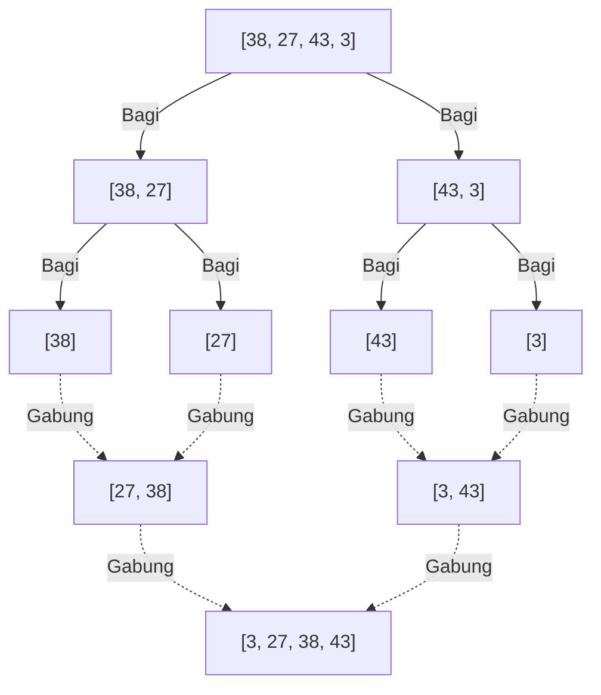
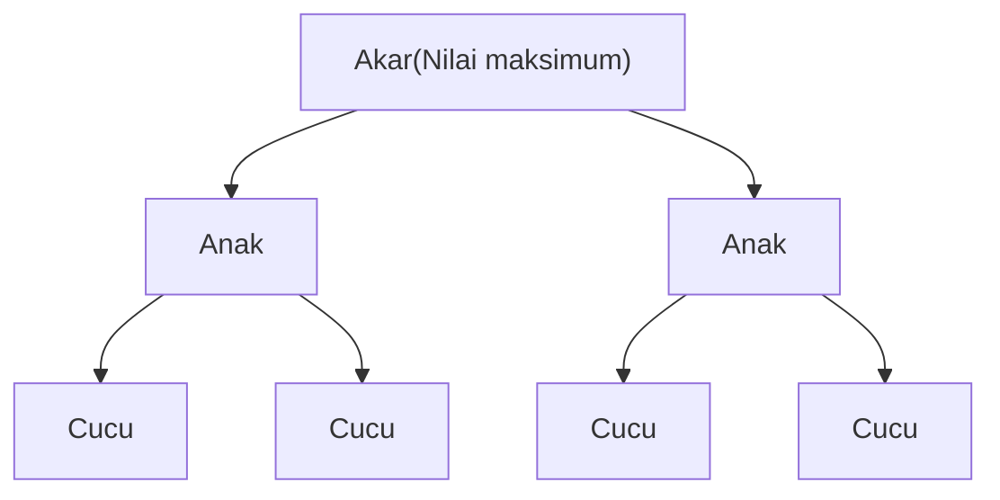

---

## 2. Algoritma $O(n^2)$: Pendekatan Dasar dan Intuitif

Yang pertama diperkenalkan adalah kelompok algoritma dasar yang memiliki kompleksitas $O(n^2)$. Meskipun kurang praktis untuk dataset skala besar, algoritma ini implementasinya sangat intuitif dan sederhana, menjadikannya materi pembelajaran yang sangat baik untuk dasar-dasar algoritma. Selain itu, ketika ukuran data sangat kecil atau untuk data yang hampir terurut, algoritma ini kadang-kadang dapat berjalan lebih cepat daripada algoritma yang kompleks.

### 2.1 Bubble Sort (Pengurutan Gelembung)

Bubble sort adalah salah satu algoritma pengurutan yang paling terkenal dan sederhana. Ia membandingkan dua elemen yang berdekatan, dan menukarnya jika urutannya terbalik, sebuah operasi yang dilakukan hingga akhir array. Ini diulang sampai seluruh array terurut. Pada akhir setiap iterasi (pass), elemen terbesar (atau terkecil) akan "menggelembung" bergerak ke ujung array, yang merupakan alasan dinamakan bubble sort.

#### Mekanisme Bubble Sort

1. Secara berurutan dari awal array, bandingkan elemen yang berdekatan (`arr[i]` dan `arr[i+1]`).
2. Jika elemen sebelah kiri lebih besar dari elemen sebelah kanan, tukar (swap) keduanya.
3. Ulangi ini sampai akhir array, maka nilai maksimum dari array akan pindah ke sisi paling kanan.
4. Pada iterasi berikutnya, ulangi dari langkah 1 lagi tanpa menyertakan elemen paling kanan.
5. Saat penukaran tidak terjadi lagi sama sekali, array dianggap sepenuhnya terurut dan selesai.

#### Kompleksitas Waktu, Ruang dan Karakteristik

*    **Kompleksitas Waktu Terburuk** : $O(n^2)$ (Jika array diurutkan secara terbalik)
*    **Kompleksitas Waktu Rata-rata** : $O(n^2)$
*    **Kompleksitas Waktu Terbaik** : $O(n)$ (Jika sudah terurut, dan menggunakan flag optimasi)
*    **Kompleksitas Ruang** : $O(1)$ (In-place)
*    **Stabilitas** : Stabil (Stable)

Karena hanya menukar elemen yang berdekatan, elemen dengan nilai yang sama tidak akan saling mendahului, menjadikannya algoritma yang stabil.

#### Kode Implementasi Python

```python
def bubble_sort(arr):
    n = len(arr)
    # Jalankan iterasi sebanyak n kali
    for i in range(n):
        # Flag untuk penghentian awal
        swapped = False
        
        # Abaikan bagian belakang (sebanyak i) yang sudah terurut
        for j in range(0, n - i - 1):
            # Jika elemen kiri lebih besar dari kanan, tukar
            if arr[j] > arr[j + 1]:
                arr[j], arr[j + 1] = arr[j + 1], arr[j]
                swapped = True
                
        # Jika tidak ada penukaran yang terjadi pada iterasi ini, pengurutan sudah selesai
        if not swapped:
            break
            
    return arr
```

#### Pelacakan Langkah demi Langkah

Mari kita lihat proses mengurutkan array `[5, 3, 8, 4, 2]` dalam urutan menaik dengan bubble sort.

*    **Iterasi 1** :
    *   Bandingkan (5, 3) $\rightarrow$ Tukar: `[3, 5, 8, 4, 2]`
    *   Bandingkan (5, 8) $\rightarrow$ Pertahankan: `[3, 5, 8, 4, 2]`
    *   Bandingkan (8, 4) $\rightarrow$ Tukar: `[3, 5, 4, 8, 2]`
    *   Bandingkan (8, 2) $\rightarrow$ Tukar: `[3, 5, 4, 2, 8]` (8 ditetapkan)
*    **Iterasi 2** :
    *   Bandingkan (3, 5) $\rightarrow$ Pertahankan: `[3, 5, 4, 2, 8]`
    *   Bandingkan (5, 4) $\rightarrow$ Tukar: `[3, 4, 5, 2, 8]`
    *   Bandingkan (5, 2) $\rightarrow$ Tukar: `[3, 4, 2, 5, 8]` (5 ditetapkan)
*    **Iterasi 3** :
    *   Bandingkan (3, 4) $\rightarrow$ Pertahankan: `[3, 4, 2, 5, 8]`
    *   Bandingkan (4, 2) $\rightarrow$ Tukar: `[3, 2, 4, 5, 8]` (4 ditetapkan)
*    **Iterasi 4** :
    *   Bandingkan (3, 2) $\rightarrow$ Tukar: `[2, 3, 4, 5, 8]` (3 ditetapkan, secara otomatis 2 juga ditetapkan)

### 2.2 Selection Sort (Pengurutan Pilihan)

Selection sort adalah algoritma yang membagi array menjadi "bagian terurut" dan "bagian belum terurut", mencari elemen terkecil (atau terbesar) dari bagian yang belum terurut, dan menukarnya dengan elemen pertama dari bagian yang belum terurut, dan operasi ini diulang-ulang.

#### Mekanisme Selection Sort

1. Pada awalnya, seluruh array adalah bagian yang belum terurut.
2. Temukan nilai terkecil dari bagian yang belum terurut.
3. Tukar nilai terkecil tersebut dengan elemen pertama dari bagian yang belum terurut.
4. Dengan ini, elemen pertama dimasukkan ke dalam bagian yang terurut, dan bagian yang belum terurut berkurang satu.
5. Ulangi operasi ini sampai bagian yang belum terurut habis.

#### Kompleksitas Waktu, Ruang dan Karakteristik

*    **Kompleksitas Waktu Terburuk** : $O(n^2)$
*    **Kompleksitas Waktu Rata-rata** : $O(n^2)$
*    **Kompleksitas Waktu Terbaik** : $O(n^2)$
*    **Kompleksitas Ruang** : $O(1)$ (In-place)
*    **Stabilitas** : Tidak stabil (Unstable)

Karena selection sort selalu memindai hingga akhir untuk menemukan nilai terkecil terlepas dari urutan datanya, ia membutuhkan $O(n^2)$ bahkan dalam kasus terbaik. Juga, karena ia menukar dengan elemen pada posisi yang berjauhan, ia tidak stabil.

#### Kode Implementasi Python

```python
def selection_sort(arr):
    n = len(arr)
    
    # Pindai seluruh array
    for i in range(n):
        # Asumsikan posisi saat ini sebagai indeks nilai minimum
        min_idx = i
        
        # Cari nilai minimum yang sebenarnya dari sisa bagian yang belum terurut
        for j in range(i + 1, n):
            if arr[j] < arr[min_idx]:
                min_idx = j
                
        # Jika nilai minimum ditemukan, tukar dengan posisi saat ini (i)
        arr[i], arr[min_idx] = arr[min_idx], arr[i]
        
    return arr
```

#### Pelacakan Langkah demi Langkah

Mengurutkan array `[29, 10, 14, 37, 13]` dengan selection sort.

*    **i = 0** : Cari nilai minimum `[29, 10, 14, 37, 13]` $\rightarrow$ Nilai minimum adalah 10. Tukar 29 dan 10.
    Hasil: `[10, 29, 14, 37, 13]` (10 ditetapkan)
*    **i = 1** : Cari nilai minimum dari sisa `[29, 14, 37, 13]` $\rightarrow$ Nilai minimum adalah 13. Tukar 29 dan 13.
    Hasil: `[10, 13, 14, 37, 29]` (13 ditetapkan)
*    **i = 2** : Cari nilai minimum dari sisa `[14, 37, 29]` $\rightarrow$ Nilai minimum adalah 14. Biarkan saja (tukar dengan dirinya sendiri).
    Hasil: `[10, 13, 14, 37, 29]` (14 ditetapkan)
*    **i = 3** : Cari nilai minimum dari sisa `[37, 29]` $\rightarrow$ Nilai minimum adalah 29. Tukar 37 dan 29.
    Hasil: `[10, 13, 14, 29, 37]` (29 ditetapkan, secara otomatis 37 juga ditetapkan)

### 2.3 Insertion Sort (Pengurutan Sisipan)

Insertion sort adalah metode intuitif yang sering kita gunakan saat kita memegang kartu remi dan menyusun kartu di tangan. Ini adalah algoritma yang mengambil satu elemen dari bagian yang belum terurut, dan menyisipkannya ke posisi yang benar pada bagian yang sudah terurut.

#### Mekanisme Insertion Sort

1. Elemen pertama dari array (indeks 0) dianggap sudah terurut.
2. Ambil elemen berikutnya (indeks 1) (misalkan ini sebagai `key`), dan bandingkan dengan elemen dari bagian yang terurut (sisi kiri) secara berurutan dari belakang.
3. Jika ada elemen yang lebih besar dari `key`, geser elemen tersebut ke kanan satu posisi.
4. Jika posisi yang benar di mana `key` harus disisipkan ditemukan, letakkan `key` di sana.
5. Ulangi ini sampai akhir array.

#### Kompleksitas Waktu, Ruang dan Karakteristik

*    **Kompleksitas Waktu Terburuk** : $O(n^2)$ (Jika array diurutkan secara terbalik)
*    **Kompleksitas Waktu Rata-rata** : $O(n^2)$
*    **Kompleksitas Waktu Terbaik** : $O(n)$ (Jika hampir terurut)
*    **Kompleksitas Ruang** : $O(1)$ (In-place)
*    **Stabilitas** : Stabil (Stable)

Kekuatan terbesar dari insertion sort adalah,  **jika data sudah terurut (atau mendekatinya), perbandingan dan pergerakan dapat diminimalkan sehingga beroperasi sangat cepat dengan kecepatan mendekati $O(n)$** . Sifat ini banyak dimanfaatkan dalam algoritma hibrida seperti Timsort yang akan dibahas nanti.

#### Kode Implementasi Python

```python
def insertion_sort(arr):
    # Mulai dari indeks 1 (yang ke-0 dianggap sudah terurut)
    for i in range(1, len(arr)):
        key = arr[i]
        j = i - 1
        
        # Pindai bagian yang terurut dari belakang, dan geser ke kanan yang lebih besar dari key
        while j >= 0 and key < arr[j]:
            arr[j + 1] = arr[j]
            j -= 1
            
        # Sisipkan key ke posisi kosong yang benar
        arr[j + 1] = key
        
    return arr
```

#### Pelacakan Langkah demi Langkah

Mengurutkan array `[12, 11, 13, 5, 6]` dengan insertion sort.

*    **i = 1 (key = 11)** : Bandingkan dengan 12 di kiri. 12 > 11 sehingga geser 12 ke kanan, sisipkan 11 ke tempat kosong.
    Hasil: `[11, 12, 13, 5, 6]`
*    **i = 2 (key = 13)** : Bandingkan dengan 12 di kiri. 12 < 13 sehingga tidak perlu bergeser. Biarkan saja.
    Hasil: `[11, 12, 13, 5, 6]`
*    **i = 3 (key = 5)** : Bandingkan secara berurutan dengan 13, 12, 11, karena semuanya lebih besar dari 5 maka semuanya digeser ke kanan. Sisipkan 5 ke paling ujung kiri.
    Hasil: `[5, 11, 12, 13, 6]`
*    **i = 4 (key = 6)** : Bandingkan secara berurutan dengan 13, 12, 11 dan geser ke kanan. 5 < 6 sehingga sisipkan 6 ke kanan 5.
    Hasil: `[5, 6, 11, 12, 13]`

---

## 3. Algoritma $O(n \log n)$: Divide and Conquer dan Efisiensi Luar Biasa

Ketika ukuran data $n$ membesar, waktu komputasi algoritma $O(n^2)$ akan meningkat secara eksplosif dan tidak dapat digunakan dalam praktik. Maka muncullah algoritma yang menggunakan teknik canggih seperti metode **Divide and Conquer** (Bagi dan Taklukkan), yang membagi array dan memprosesnya secara rekursif. Ini mencapai batas teoretis pengurutan berbasis perbandingan yaitu $O(n \log n)$ dan memberikan performa yang luar biasa untuk data berskala besar.

### 3.1 Merge Sort (Pengurutan Gabung)

Merge sort adalah algoritma yang indah dan kokoh, dirancang oleh John von Neumann pada tahun 1945. Sebagai contoh representatif dari "Divide and Conquer", algoritma ini mengambil pendekatan dengan membagi array menjadi separuh, lalu separuh lagi sampai elemennya tersisa satu, kemudian menggabungkan (merge) sambil mengurutkannya.

#### Mekanisme Merge Sort

1.  **Bagi (Divide)** : Bagi array yang diberikan di tengah menjadi dua subarray. Ulangi ini secara rekursif hingga panjang subarray menjadi 1 (array dengan panjang 1 dapat dianggap dalam keadaan sudah terurut).
2.  **Taklukkan dan Gabung (Conquer and Combine)** : Bandingkan elemen pertama dari dua subarray yang sudah terurut, lalu simpan yang lebih kecil ke dalam array baru. Ulangi ini, gabungkan hingga kembali menjadi satu array asli.



#### Kompleksitas Waktu, Ruang dan Karakteristik

*    **Kompleksitas Waktu Terburuk, Rata-rata, Terbaik** : Semuanya $O(n \log n)$
    *   Karena selalu membagi menjadi dua, kedalaman pembagiannya adalah $\log_2 n$. Proses penggabungan pada setiap level memakan waktu keseluruhan $O(n)$, sehingga jika dikalikan menjadi $O(n \log n)$. Karena kompleksitas selalu konstan terlepas dari status datanya, ini sangat mudah diprediksi dan kokoh.
*    **Kompleksitas Ruang** : $O(n)$ (Out-of-place)
    *   Kelemahan terbesarnya adalah, saat menggabungkan, ia membutuhkan array kerja tambahan yang berukuran sama dengan array asli.
*    **Stabilitas** : Stabil (Stable)
    *   Jika ada nilai yang sama saat menggabungkan, stabilitas dapat dipertahankan dengan memprioritaskan pengambilan elemen dari array sebelah kiri.

#### Kode Implementasi Python

```python
def merge_sort(arr):
    # Jika panjang array 1 atau kurang, kembalikan sebagai sudah terurut
    if len(arr) <= 1:
        return arr
        
    # 1. Bagi: Hitung indeks tengah
    mid = len(arr) // 2
    left_half = arr[:mid]
    right_half = arr[mid:]
    
    # Urutkan kiri dan kanan secara rekursif
    left_sorted = merge_sort(left_half)
    right_sorted = merge_sort(right_half)
    
    # 2. Gabung: Gabungkan array kiri dan kanan yang sudah terurut
    return merge(left_sorted, right_sorted)

def merge(left, right):
    result = []
    i = j = 0
    
    # Selama masih ada elemen di kedua array
    while i < len(left) and j < len(right):
        if left[i] <= right[j]:  # Gunakan <= demi stabilitas
            result.append(left[i])
            i += 1
        else:
            result.append(right[j])
            j += 1
            
    # Tambahkan elemen yang tersisa
    result.extend(left[i:])
    result.extend(right[j:])
    
    return result
```

### 3.2 Quick Sort (Pengurutan Cepat)

Quick sort, yang dirancang oleh Tony Hoare, seperti namanya, adalah algoritma hebat yang sering kali berjalan paling cepat di dunia nyata. Sama seperti merge sort ia menggunakan metode Divide and Conquer, tetapi pendekatannya berbeda. Ia memilih sebuah elemen referensi ( **pivot** ), lalu mendistribusikan ke grup yang lebih kecil dari pivot dan grup yang lebih besar dari pivot untuk melanjutkan pengurutan.

#### Mekanisme Quick Sort

1.  **Pemilihan Pivot** : Pilih satu elemen dari array sebagai pivot (nilai referensi).
2.  **Partisi (Pembagian)** : Kumpulkan elemen yang lebih kecil dari pivot ke sisi kiri, dan elemen yang lebih besar dari pivot ke sisi kanan. Setelah operasi ini selesai, posisi akhir yang telah terurut dari pivot itu sendiri akan ditetapkan.
3.  **Proses Rekursif** : Ulangi proses yang sama secara rekursif untuk array di sisi kiri pivot dan array di sisi kanan pivot.

Kinerjanya sangat bervariasi tergantung pada cara pemilihan pivot dan metode pembagian (Metode Hoare, Metode Lomuto).

#### Kompleksitas Waktu, Ruang dan Karakteristik

*    **Kompleksitas Waktu Terburuk** : $O(n^2)$
    *   Ini adalah kelemahan fatal. Untuk array yang sudah terurut, jika selalu memilih elemen tepi sebagai pivot, array akan terus terbagi secara timpang menjadi "satu" dan "sisanya", jatuh ke kompleksitas terburuk. Untuk menghindarinya, sangat penting menggunakan trik pemilihan pivot seperti "Median-of-three (ambil median dari awal, tengah, dan akhir)".
*    **Kompleksitas Waktu Rata-rata** : $O(n \log n)$
    *   Secara praktis, koefisien konstantanya sangat kecil dan efisiensi cache-nya sangat baik, sehingga ia bekerja lebih cepat daripada merge sort dan heap sort.
*    **Kompleksitas Ruang** : Rata-rata $O(\log n)$, Terburuk $O(n)$
    *   Ini adalah algoritma In-place yang secara langsung menulis ulang array, tetapi memakan memori untuk tumpukan pemanggilan (call stack) pada pemanggilan rekursif.
*    **Stabilitas** : Tidak stabil (Unstable)
    *   Karena penukaran elemen yang berjauhan terjadi pada operasi partisi, ini tidak stabil.

#### Kode Implementasi Python (Versi Pemahaman List yang Mudah Dipahami)

Versi ini tidak efisien secara memori, tetapi mengekspresikan niat algoritma dengan paling ringkas.

```python
def quick_sort_simple(arr):
    if len(arr) <= 1:
        return arr
    
    # Pilih elemen tengah sebagai pivot
    pivot = arr[len(arr) // 2]
    
    # Bagi menjadi 3 list: kurang dari, sama dengan, dan lebih dari pivot
    left = [x for x in arr if x < pivot]
    middle = [x for x in arr if x == pivot]
    right = [x for x in arr if x > pivot]
    
    # Gabungkan secara rekursif
    return quick_sort_simple(left) + middle + quick_sort_simple(right)
```

#### Kode Implementasi Python (Versi Skema Partisi In-place Lomuto)

Ini adalah implementasi In-place tanpa memakan banyak memori, yang digunakan di library sebenarnya.

```python
def quick_sort_inplace(arr, low, high):
    if low < high:
        # Lakukan pembagian partisi, dan dapatkan posisi pivot yang benar
        pi = partition(arr, low, high)
        
        # Urutkan kiri dan kanan pivot secara rekursif
        quick_sort_inplace(arr, low, pi - 1)
        quick_sort_inplace(arr, pi + 1, high)

def partition(arr, low, high):
    # Pilih elemen akhir sebagai pivot (Metode Lomuto)
    pivot = arr[high]
    
    # i menunjuk ke indeks terakhir dari elemen yang lebih kecil dari pivot
    i = low - 1
    
    for j in range(low, high):
        # Jika elemen saat ini lebih kecil dari atau sama dengan pivot, majukan i dan tukar
        if arr[j] <= pivot:
            i = i + 1
            arr[i], arr[j] = arr[j], arr[i]
            
    # Sisipkan pivot ke posisi yang benar (i+1)
    arr[i + 1], arr[high] = arr[high], arr[i + 1]
    
    return i + 1
```

### 3.3 [Heap](https://kenji.blog/id/p/c-language-pointers-memory-management-stack-heap/) Sort (Pengurutan Tumpukan)

Heap sort adalah algoritma pengurutan yang dengan cerdik memanfaatkan struktur data pohon yang disebut  **Binary Heap (Tumpukan Biner)** . Ia memiliki karakteristik hibrida yang mengambil keunggulan dari merge sort dan quick sort, di mana kompleksitas terburuknya adalah $O(n \log n)$, namun merupakan pengurutan In-place yang tidak memerlukan memori tambahan.

#### Mekanisme Heap Sort

1.  **Pembuatan Heap** : Pertama, ubah array yang diberikan menjadi "Max Heap (Tumpukan Maksimal)". Max heap adalah pohon biner lengkap yang memenuhi aturan bahwa nilai node induk selalu lebih besar dari atau sama dengan nilai node anak. Dengan menggunakan perhitungan indeks pada array (induk: $(i-1)/2$, anak kiri: $2i+1$, anak kanan: $2i+2$), struktur pohon dapat diekspresikan tetap sebagai array.
2.  **Ekstraksi dan Rekonstruksi Nilai Maksimum** : Akar dari max heap (awal array `arr[0]`) selalu berisi nilai maksimum. Tukar nilai maksimum ini dengan elemen terakhir dari array. Dengan ini, nilai maksimum ditetapkan pada posisi akhir array.
3. Karena akar telah ditulis ulang, kondisi heap menjadi rusak, sehingga "rekonstruksi heap (Heapify)" dilakukan pada rentang di luar akhir heap (bagian yang sudah ditetapkan) untuk kembali memenuhi kondisi max heap.
4. Mengulangi operasi ini hingga hanya tersisa satu elemen akan menetapkan nilai yang lebih besar dari belakang array, dan pada akhirnya terurut menaik.



#### Kompleksitas Waktu, Ruang dan Karakteristik

*    **Kompleksitas Waktu Terburuk, Rata-rata, Terbaik** : Semuanya $O(n \log n)$
    *   Membangun heap membutuhkan $O(n)$, dan mengekstraksi serta merekonstruksi nilai maksimum ($O(\log n)$) diulang $n$ kali, sehingga keseluruhannya menjadi $O(n \log n)$. Karena kompleksitas ini dijamin terlepas dari urutan data apa pun, ini sangat berguna dalam sistem yang memerlukan penghindaran kasus terburuk.
*    **Kompleksitas Ruang** : $O(1)$ (In-place)
    *   Karena mengekspresikan pohon heap secara langsung pada array, ia tidak memerlukan memori tambahan.
*    **Stabilitas** : Tidak stabil (Unstable)
    *   Karena menukar elemen yang berjauhan selama proses pembuatan dan ekstraksi heap, ini tidak stabil.

#### Kode Implementasi Python

```python
def heapify(arr, n, i):
    largest = i          # Asumsikan akar sebagai nilai maksimum
    left = 2 * i + 1     # Anak kiri
    right = 2 * i + 2    # Anak kanan

    # Jika anak kiri lebih besar dari akar
    if left < n and arr[left] > arr[largest]:
        largest = left

    # Jika anak kanan lebih besar dari nilai maksimum saat ini
    if right < n and arr[right] > arr[largest]:
        largest = right

    # Jika akar bukan nilai maksimum, tukar dan jadikan heap secara rekursif
    if largest != i:
        arr[i], arr[largest] = arr[largest], arr[i]
        heapify(arr, n, largest)

def heap_sort(arr):
    n = len(arr)

    # 1. Pembuatan max heap (dibangun dari bawah ke atas)
    # Jadikan heap dari node non-daun terakhir ke akar
    for i in range(n // 2 - 1, -1, -1):
        heapify(arr, n, i)

    # 2. Ekstrak elemen satu per satu dan urutkan
    for i in range(n - 1, 0, -1):
        # Tukar akar saat ini (nilai maksimum) dengan akhir dari bagian yang belum terurut
        arr[i], arr[0] = arr[0], arr[i]
        
        # Rekonstruksi pada heap baru dengan ukuran yang dikurangi
        heapify(arr, i, 0)
        
    return arr
```

---

## 4. Pengurutan Non-perbandingan $O(n)$: Melampaui Batas Perbandingan

Semua algoritma pengurutan yang kita lihat sejauh ini adalah "pengurutan berbasis perbandingan" yang menilai hubungan ukuran antar elemen menggunakan operasi perbandingan (`<`, `>`, `==`). Pengurutan berbasis perbandingan terbukti secara matematis tidak akan pernah lebih cepat dari $O(n \log n)$.

Namun, dengan memanfaatkan sifat data (misal berupa bilangan bulat, jumlah digit yang tetap, rentangnya sempit, dll.), dan menggunakan algoritma khusus yang sama sekali tidak melakukan "perbandingan", kita dapat melakukan pengurutan ultra-cepat dalam waktu linier $O(n)$.

### 4.1 Counting Sort (Pengurutan Hitung)

Counting sort adalah algoritma yang menghitung posisi yang benar dari elemen dengan "menghitung" berapa banyak nilai kunci tertentu ada di dalam data. Algoritma ini terutama menunjukkan efek dramatis saat mengurutkan bilangan bulat dalam rentang sempit dari 0 hingga nilai maksimum tertentu $k$.

#### Kompleksitas Waktu dan Ruang
*    **Kompleksitas Waktu** : $O(n + k)$. Bergantung pada jumlah data $n$ dan rentang nilai $k$. Jika $k$ sebanding dengan $n$ maka akan menjadi $O(n)$, tetapi jika $k$ sangat besar (misalnya: array yang hanya berisi 1 dan 1 miliar), ia akan menjadi sangat tidak efisien.
*    **Kompleksitas Ruang** : $O(n + k)$. Memerlukan array hitungan (count) dan array output.

#### Gambaran Implementasi Python
```python
def counting_sort(arr):
    if not arr:
        return arr
        
    max_val = max(arr)
    # Inisialisasi array hitungan dengan nol
    count = [0] * (max_val + 1)
    
    # 1. Hitung jumlah kemunculan setiap elemen
    for num in arr:
        count[num] += 1
        
    # 2. Hitung jumlah kumulatif (untuk menentukan posisi akhir elemen)
    for i in range(1, len(count)):
        count[i] += count[i - 1]
        
    # 3. Buat array output (pindai dari belakang untuk menjaga stabilitas)
    output = [0] * len(arr)
    for num in reversed(arr):
        output[count[num] - 1] = num
        count[num] -= 1
        
    return output
```

### 4.2 Radix Sort (Pengurutan Radiks)

Kelemahan dari counting sort, "tidak dapat digunakan jika rentang nilai besar", telah diatasi oleh Radix Sort. Algoritma ini menyelesaikan pengurutan keseluruhan dengan menerapkan pengurutan stabil (seringkali secara internal menggunakan counting sort) secara berurutan mulai dari digit terbawah (LSD: Least Significant Digit), dari "satuan", "puluhan", hingga "ratusan" nilai numerik. Algoritma ini juga diterapkan untuk mengurutkan string.

### 4.3 Bucket Sort (Pengurutan Ember)

Bucket sort membagi kemungkinan rentang data ke dalam "ember (bucket)" dengan ukuran yang sama rata, dan melempar setiap data ke dalam ember yang sesuai. Kemudian, secara individual diurutkan dalam setiap ember (sering menggunakan insertion sort, dll.), dan akhirnya semua isi ember digabungkan secara berurutan untuk penyelesaian. Jika data terdistribusi secara merata dalam rentang tertentu, ia beroperasi sangat cepat rata-rata dalam $O(n)$.

---

## 5. Algoritma Hibrida yang Menguasai Dunia Praktis Modern

Meskipun buku teks akademis sering kali membahas hingga quick sort dan merge sort, yang benar-benar berjalan di balik layar bahasa pemrograman modern saat ini adalah  **algoritma hibrida**  yang menggabungkan keunggulan beberapa algoritma.

### 5.1 Timsort (Bawaan pada Python)

Timsort adalah algoritma yang diimplementasikan oleh Tim Peters untuk Python pada tahun 2002. Saat ini, algoritma ini merupakan penguasa dunia praktis yang diadopsi dalam banyak bahasa, tidak hanya `list.sort()` atau `sorted()` pada Python, tetapi juga pada array objek [Java](https://kenji.blog/id/p/programming-languages-history-paradigm-evolution/) dan standard sort [Rust](https://kenji.blog/id/p/webassembly-wasm-current-future/).

Konsep desain terbesar Timsort didasarkan pada aturan praktis empiris bahwa  **"Data di dunia nyata jarang sepenuhnya acak, dan seringkali sebagian sudah terurut sampai tingkat tertentu (ada blok terurut menaik atau menurun secara berurutan)."** 

#### Karakteristik Timsort
*    **Perpaduan merge sort dan insertion sort** : Membagi array ke dalam chunk (potongan) dengan ukuran tertentu (biasanya sekitar 32-64 elemen), dan mengurutkan masing-masing dengan cepat menggunakan insertion sort. Kemudian, bagian-bagian ini digabungkan secara mirip dengan merge sort.
*    **Pemanfaatan Run** : Memindai array dan mendeteksi bagian yang berurutan secara menaik (atau menurun) dari awal (ini disebut "Run"). Jika dalam urutan menurun, ia membalikkannya menjadi menaik dan menggunakannya sebagai satuan penggabungan.
*    **Kompleksitas yang Adaptif** : Untuk data yang benar-benar acak, ini menjamin terburuk $O(n \log n)$, sementara untuk data yang sudah terurut, atau sebagian terurut, algoritma ini memberikan kecepatan luar biasa paling baik $O(n)$.
*    **Stabilitas** : Ini adalah algoritma yang stabil.

### 5.2 Introsort (Pada C++ `std::sort`)

Introspective Sort (Introsort) diadopsi dalam STL C++ yaitu `std::sort`, dan pada pengurutan standar .NET (C#).

Quick sort secara rata-rata paling cepat, namun memiliki kelemahan fatal di mana algoritma tersebut bisa jatuh ke terburuk $O(n^2)$ tergantung pada pemilihan pivotnya. Introsort adalah metode hibrida yang sepenuhnya mengatasi kelemahan ini.

#### Karakteristik Introsort
1. Pada dasarnya algoritma ini menggunakan  **quick sort**  yang cepat untuk membagi array.
2. Namun, ia memonitor kedalaman rekursi, dan jika kedalaman pembagian melebihi kelipatan konstan dari $\log_2 n$ (misalnya: $2 \times \log_2 n$), algoritma menilai bahwa "pemilihan pivot gagal, dan akan jatuh ke kompleksitas terburuk" (Introspection: Introspeksi diri).
3. Pada saat itu, ia mengubah metode pengurutan untuk subarray tersebut ke  **heap sort**  yang memiliki kompleksitas terburuk $O(n \log n)$.
4. Selain itu, ketika jumlah elemen menjadi sangat kecil (misalnya: 16 elemen atau kurang), ia beralih ke  **insertion sort**  untuk menghindari overhead panggilan fungsi.

Dengan ini, ia mencapai algoritma yang tanpa cela, yang mempertahankan kecepatan rata-rata quick sort yang luar biasa, sambil menjamin $O(n \log n)$ bahkan dalam kasus terburuk.

---

## 6. Rangkuman Tabel Perbandingan Komprehensif

Kinerja algoritma pengurutan utama yang dibahas dalam artikel ini telah dirangkum dalam format tabel.

| Algoritma (Algorithm) | Kompleksitas Waktu Terbaik (Best Time) | Kompleksitas Waktu Rata-rata (Avg Time) | Kompleksitas Waktu Terburuk (Worst Time) | Kompleksitas Ruang (Space) | Stabilitas (Stability) | Metode & Karakteristik |
| :--- | :--- | :--- | :--- | :--- | :--- | :--- |
|  **Bubble Sort (Pengurutan Gelembung)**  | $O(n)$ | $O(n^2)$ | $O(n^2)$ | $O(1)$ | Yes | Penukaran. Untuk edukasi. Praktisnya rendah. |
|  **Selection Sort (Pengurutan Pilihan)**  | $O(n^2)$ | $O(n^2)$ | $O(n^2)$ | $O(1)$ | No | Pilihan. Selalu butuh pemindaian keseluruhan. |
|  **Insertion Sort (Pengurutan Sisipan)**  | $O(n)$ | $O(n^2)$ | $O(n^2)$ | $O(1)$ | Yes | Sisipan. Sangat kuat pada data yang hampir terurut. |
|  **Merge Sort (Pengurutan Gabung)**  | $O(n \log n)$ | $O(n \log n)$ | $O(n \log n)$ | $O(n)$ | Yes | Divide & Conquer. Kompleksitas kokoh tapi makan memori. |
|  **Quick Sort (Pengurutan Cepat)**  | $O(n \log n)$ | $O(n \log n)$ | $O(n^2)$ | $O(\log n)$ | No | Divide & Conquer. Rata-rata tercepat tapi awas kasus terburuk. |
|  **[Heap](https://kenji.blog/id/p/c-language-pointers-memory-management-stack-heap/) Sort (Pengurutan Tumpukan)**  | $O(n \log n)$ | $O(n \log n)$ | $O(n \log n)$ | $O(1)$ | No | Binary Heap. In-place dan kokoh. |
|  **Counting Sort (Pengurutan Hitung)**  | $O(n+k)$ | $O(n+k)$ | $O(n+k)$ | $O(k)$ | Yes | Non-perbandingan. Terkuat jika rentang kunci sempit. |
|  **Timsort**  (Standar Python dkk.) | $O(n)$ | $O(n \log n)$ | $O(n \log n)$ | $O(n)$ | Yes | Hibrida. Adaptif terhadap data aktual dan tercepat. |
|  **Introsort**  (Standar C++ dkk.) | $O(n \log n)$ | $O(n \log n)$ | $O(n \log n)$ | $O(\log n)$ | No | Hibrida. Menyeimbangkan kecepatan Quick dan kekokohan Heap. |

---

## 7. Kesimpulan: Pada Akhirnya, Mana yang Harus Digunakan?

Sejauh ini kita telah membahas banyak algoritma pengurutan, tetapi dalam pengembangan perangkat lunak praktis, ada jawaban yang jelas.

 **"Pada dasarnya, gunakan fungsi sort standar bawaan dari bahasa tersebut"** 

Hanya itu. `.sort()` di Python dan `std::sort` di C++ diimplementasikan dengan algoritma hibrida tingkat lanjut seperti Timsort atau Introsort yang diperkenalkan di artikel ini, dan telah diberikan optimalisasi yang tak terhitung jumlahnya (peningkatan efisiensi cache memori, optimalisasi prediksi percabangan, dll.). Quick sort buatan sendiri hampir tidak mungkin mengalahkan kecepatan pustaka standar.

Namun, lalu mengapa kita perlu mempelajari algoritma pengurutan?

1.  **Pemahaman Konsep Dasar** : Konsep seperti kompleksitas (Notasi [Big O](https://kenji.blog/id/p/time-space-complexity-big-o-notation-examples/)), In-place/Out-of-place, dan stabilitas, adalah dasar dari desain semua algoritma dan struktur data, tidak hanya pengurutan.
2.  **Sistem Di Bawah Batasan Khusus** : Dalam lingkungan dengan memori yang sangat terbatas seperti sistem tersemat (embedded systems), mungkin perlu untuk mengimplementasikan sendiri heap sort dengan ruang $O(1)$ atau quick sort in-place.
3.  **Memanfaatkan Karakteristik Data** : Saat mengurutkan "1 juta data yang nilainya terbatas pada rentang 1-100", mengimplementasikan counting sort ($O(n)$) akan menjadi jauh lebih cepat daripada menggunakan Timsort bawaan ($O(n \log n)$).

Dengan mengetahui struktur internal dari algoritma, Anda akan dapat memahami "kelebihan" dan "kekurangan" dari fungsi standar yang disediakan sebagai kotak hitam (black box), dan mampu merancang sistem yang lebih canggih dan efisien.

Silakan coba jalankan kode Python dari artikel ini, ubah jumlah datanya, berikan data dengan urutan terbalik, dan rasakan perilaku dan waktu eksekusi masing-masing algoritma!
