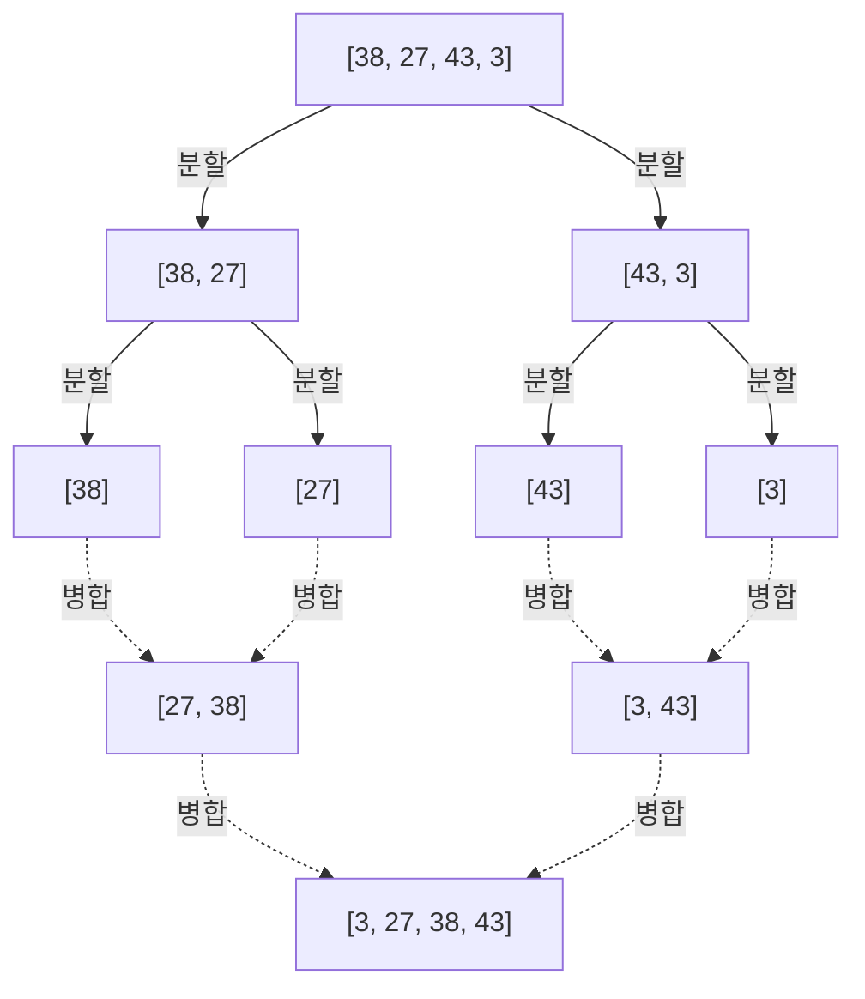
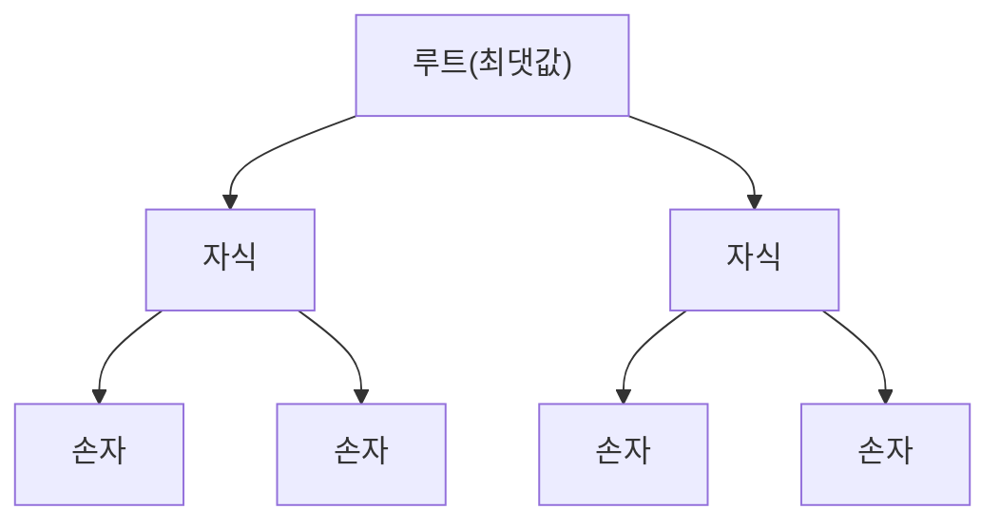

---

## 2. $O(n^2)$ 의 알고리즘: 기초와 직관적인 접근

처음으로 소개할 것은 시간 복잡도가 $O(n^2)$ 이 되는 기본적인 알고리즘 군입니다. 이들은 대규모 데이터 세트에는 실용성이 낮지만, 구현이 직관적이고 매우 단순하여 알고리즘의 기초를 배우기에 훌륭한 교재가 됩니다. 또한, 데이터의 크기가 극단적으로 작거나 거의 정렬된 데이터에 대해서는 복잡한 알고리즘보다 빠르게 동작할 수도 있습니다.

### 2.1 버블 정렬 (Bubble Sort)

버블 정렬은 가장 유명하고 단순한 정렬 알고리즘 중 하나입니다. 인접한 두 요소를 비교하여 순서가 거꾸로 되어 있으면 교환하는 작업을 배열의 끝까지 진행합니다. 이를 배열 전체가 정렬될 때까지 반복합니다. 각 패스가 끝날 때마다 가장 큰(또는 작은) 요소가 배열의 끝으로 '떠오르듯이' 이동하기 때문에 버블 정렬이라고 불립니다.

#### 버블 정렬의 원리

1. 배열의 처음부터 순서대로 인접한 요소(`arr[i]` 와 `arr[i+1]`)를 비교합니다.
2. 왼쪽 요소가 오른쪽 요소보다 크면 두 요소를 스왑(교환)합니다.
3. 이를 배열의 끝까지 반복하면 배열의 최댓값이 가장 오른쪽으로 이동합니다.
4. 다음 패스에서는 가장 오른쪽의 요소를 제외하고 다시 1번부터 반복합니다.
5. 스왑이 한 번도 일어나지 않게 된 시점에서 배열이 완전히 정렬되었다고 판단하여 종료합니다.

#### 시간/공간 복잡도와 특징

*   **최악 시간 복잡도**: $O(n^2)$ (배열이 역순으로 정렬되어 있을 경우)
*   **평균 시간 복잡도**: $O(n^2)$
*   **최선 시간 복잡도**: $O(n)$ (이미 정렬되어 있으며, 최적화 플래그를 사용했을 경우)
*   **공간 복잡도**: $O(1)$ (In-place)
*   **안정성**: 안정 (Stable)

인접한 요소의 교환만 수행하므로 같은 값을 가진 요소가 서로를 앞지르는 일이 없어 안정적인 알고리즘이 됩니다.

#### Python 구현 코드

```python
def bubble_sort(arr):
    n = len(arr)
    # n번의 패스를 실행한다
    for i in range(n):
        # 조기 종료를 위한 플래그
        swapped = False
        
        # 이미 정렬된 뒷부분(i개)은 무시한다
        for j in range(0, n - i - 1):
            # 왼쪽 요소가 오른쪽보다 크면 교환
            if arr[j] > arr[j + 1]:
                arr[j], arr[j + 1] = arr[j + 1], arr[j]
                swapped = True
                
        # 이번 패스에서 한 번도 교환이 발생하지 않으면 이미 정렬 완료
        if not swapped:
            break
            
    return arr
```

#### 단계별 과정 추적

배열 `[5, 3, 8, 4, 2]` 를 버블 정렬로 오름차순으로 정렬하는 과정을 살펴보겠습니다.

*   **패스 1**:
    *   (5, 3)을 비교 $\rightarrow$ 교환: `[3, 5, 8, 4, 2]`
    *   (5, 8)을 비교 $\rightarrow$ 유지: `[3, 5, 8, 4, 2]`
    *   (8, 4)를 비교 $\rightarrow$ 교환: `[3, 5, 4, 8, 2]`
    *   (8, 2)를 비교 $\rightarrow$ 교환: `[3, 5, 4, 2, 8]` (8 확정)
*   **패스 2**:
    *   (3, 5)를 비교 $\rightarrow$ 유지: `[3, 5, 4, 2, 8]`
    *   (5, 4)를 비교 $\rightarrow$ 교환: `[3, 4, 5, 2, 8]`
    *   (5, 2)를 비교 $\rightarrow$ 교환: `[3, 4, 2, 5, 8]` (5 확정)
*   **패스 3**:
    *   (3, 4)를 비교 $\rightarrow$ 유지: `[3, 4, 2, 5, 8]`
    *   (4, 2)를 비교 $\rightarrow$ 교환: `[3, 2, 4, 5, 8]` (4 확정)
*   **패스 4**:
    *   (3, 2)를 비교 $\rightarrow$ 교환: `[2, 3, 4, 5, 8]` (3 확정, 자동으로 2도 확정)

### 2.2 선택 정렬 (Selection Sort)

선택 정렬은 배열을 '정렬된 부분'과 '정렬되지 않은 부분'으로 나누고, 정렬되지 않은 부분에서 가장 작은(또는 큰) 요소를 찾아 정렬되지 않은 부분의 첫 번째 요소와 교환하는 작업을 반복하는 알고리즘입니다.

#### 선택 정렬의 원리

1. 처음에는 배열 전체가 정렬되지 않은 부분입니다.
2. 정렬되지 않은 부분 중에서 가장 작은 값을 찾습니다.
3. 그 최솟값을 정렬되지 않은 부분의 첫 번째 요소와 교환합니다.
4. 이로 인해 첫 번째 요소가 정렬된 부분에 포함되고, 정렬되지 않은 부분이 1개 줄어듭니다.
5. 이 작업을 정렬되지 않은 부분이 없어질 때까지 반복합니다.

#### 시간/공간 복잡도와 특징

*   **최악 시간 복잡도**: $O(n^2)$
*   **평균 시간 복잡도**: $O(n^2)$
*   **최선 시간 복잡도**: $O(n^2)$
*   **공간 복잡도**: $O(1)$ (In-place)
*   **안정성**: 불안정 (Unstable)

선택 정렬은 데이터의 정렬 순서와 관계없이 항상 최솟값을 찾기 위한 스캔을 끝까지 수행하므로, 최선의 경우에도 $O(n^2)$ 이 걸립니다. 또한, 멀리 떨어진 위치에 있는 요소와 스왑을 수행하므로 안정적이지 않습니다.

#### Python 구현 코드

```python
def selection_sort(arr):
    n = len(arr)
    
    # 배열 전체를 순회
    for i in range(n):
        # 현재 위치를 최솟값의 인덱스로 가정
        min_idx = i
        
        # 남은 정렬되지 않은 부분에서 진짜 최솟값을 찾는다
        for j in range(i + 1, n):
            if arr[j] < arr[min_idx]:
                min_idx = j
                
        # 최솟값을 찾으면 현재 위치(i)와 교환한다
        arr[i], arr[min_idx] = arr[min_idx], arr[i]
        
    return arr
```

#### 단계별 과정 추적

배열 `[29, 10, 14, 37, 13]` 을 선택 정렬합니다.

*   **i = 0**: 최솟값을 찾음 `[29, 10, 14, 37, 13]` $\rightarrow$ 최솟값은 10. 29와 10을 교환.
    결과: `[10, 29, 14, 37, 13]` (10 확정)
*   **i = 1**: 나머지 `[29, 14, 37, 13]` 에서 최솟값을 찾음 $\rightarrow$ 최솟값은 13. 29와 13을 교환.
    결과: `[10, 13, 14, 37, 29]` (13 확정)
*   **i = 2**: 나머지 `[14, 37, 29]` 에서 최솟값을 찾음 $\rightarrow$ 최솟값은 14. 그대로 유지(자기 교환).
    결과: `[10, 13, 14, 37, 29]` (14 확정)
*   **i = 3**: 나머지 `[37, 29]` 에서 최솟값을 찾음 $\rightarrow$ 최솟값은 29. 37과 29를 교환.
    결과: `[10, 13, 14, 29, 37]` (29 확정, 자동으로 37도 확정)

### 2.3 삽입 정렬 (Insertion Sort)

삽입 정렬은 우리가 트럼프 카드를 손에 쥐고 패를 정리할 때 자주 사용하는 직관적인 방법입니다. 정렬되지 않은 부분에서 요소를 1개 꺼내어 이미 정렬된 부분의 올바른 위치에 삽입해 나가는 알고리즘입니다.

#### 삽입 정렬의 원리

1. 배열의 첫 번째 요소(인덱스 0)는 이미 정렬되어 있다고 간주합니다.
2. 다음 요소(인덱스 1)를 꺼내어(이를 `key` 라고 합니다), 정렬된 부분(왼쪽)의 요소들과 뒤에서부터 차례대로 비교합니다.
3. `key` 보다 큰 요소가 있으면 그 요소를 1칸 오른쪽으로 이동시킵니다.
4. `key` 가 삽입되어야 할 올바른 위치를 찾으면 그곳에 `key` 를 놓습니다.
5. 이를 배열의 끝까지 반복합니다.

#### 시간/공간 복잡도와 특징

*   **최악 시간 복잡도**: $O(n^2)$ (역순으로 정렬되어 있을 경우)
*   **평균 시간 복잡도**: $O(n^2)$
*   **최선 시간 복잡도**: $O(n)$ (거의 정렬되어 있을 경우)
*   **공간 복잡도**: $O(1)$ (In-place)
*   **안정성**: 안정 (Stable)

삽입 정렬의 가장 큰 강점은 데이터가 이미 정렬되어 있거나(또는 그에 가까울) 경우, 비교와 이동이 최소한으로 끝나기 때문에 $O(n)$ 에 가까운 속도로 **매우 빠르게 동작한다** 는 점입니다. 이 성질은 나중에 설명할 Timsort 등의 하이브리드 알고리즘에서 크게 활용됩니다.

#### Python 구현 코드

```python
def insertion_sort(arr):
    # 인덱스 1부터 시작 (0번째는 정렬된 것으로 간주)
    for i in range(1, len(arr)):
        key = arr[i]
        j = i - 1
        
        # 정렬된 부분을 뒤에서부터 스캔하여 key보다 큰 것은 오른쪽으로 이동
        while j >= 0 and key < arr[j]:
            arr[j + 1] = arr[j]
            j -= 1
            
        # 비워진 올바른 위치에 key를 삽입
        arr[j + 1] = key
        
    return arr
```

#### 단계별 과정 추적

배열 `[12, 11, 13, 5, 6]` 을 삽입 정렬합니다.

*   **i = 1 (key = 11)**: 왼쪽의 12와 비교. 12 > 11이므로 12를 오른쪽으로 시프트하고, 빈자리에 11을 삽입.
    결과: `[11, 12, 13, 5, 6]`
*   **i = 2 (key = 13)**: 왼쪽의 12와 비교. 12 < 13이므로 시프트 불필요. 그대로 유지.
    결과: `[11, 12, 13, 5, 6]`
*   **i = 3 (key = 5)**: 13, 12, 11과 순서대로 비교하고, 모두 5보다 크기 때문에 모두 오른쪽으로 시프트. 가장 왼쪽에 5를 삽입.
    결과: `[5, 11, 12, 13, 6]`
*   **i = 4 (key = 6)**: 13, 12, 11과 순서대로 비교하여 오른쪽으로 시프트. 5 < 6이므로 5의 오른쪽에 6을 삽입.
    결과: `[5, 6, 11, 12, 13]`

---

## 3. $O(n \log n)$ 의 알고리즘: 분할 정복과 압도적인 효율

데이터양 $n$ 이 커지면 $O(n^2)$ 의 알고리즘은 계산 시간이 폭발적으로 증가하여 실용적이지 못하게 됩니다. 여기서 등장하는 것이 배열을 분할하여 재귀적으로 처리하는 **분할 정복법** (Divide and Conquer) 등의 고급 기법을 사용한 알고리즘입니다. 비교 기반 정렬 알고리즘의 이론적 한계인 $O(n \log n)$ 을 달성하며, 대규모 데이터에 대해 압도적인 성능 발휘합니다.

### 3.1 병합 정렬 (Merge Sort)

병합 정렬은 폰 노이만이 1945년에 고안한 아름답고 견고한 알고리즘입니다. '분할 정복법'의 대표적인 예로, 배열을 반, 또 반으로 요소가 1개가 될 때까지 분할하고, 그 후 정렬하면서 '병합(머지)'해 나가는 접근 방식을 취합니다.

#### 병합 정렬의 원리

1. **분할 (Divide)**: 주어진 배열을 중앙에서 2개의 부분 배열로 분할합니다. 이를 부분 배열의 길이가 1이 될 때까지 재귀적으로 반복합니다(길이가 1인 배열은 이미 정렬된 상태로 간주할 수 있습니다).
2. **정복과 병합 (Conquer and Combine)**: 2개의 정렬된 부분 배열의 첫 번째 요소끼리 비교하여 작은 쪽을 새로운 배열에 저장합니다. 이를 반복하여 원래의 1개 배열이 될 때까지 병합합니다.



#### 시간/공간 복잡도와 특징

*   **최악/평균/최선 시간 복잡도**: 모두 $O(n \log n)$
    *   항상 절반으로 분할해 나가기 때문에 분할의 깊이는 $\log_2 n$ 입니다. 각 계층에서의 병합 처리는 전체적으로 $O(n)$ 의 시간이 걸리므로 곱하면 $O(n \log n)$ 이 됩니다. 데이터의 상태에 관계없이 계산량이 일정하므로 매우 예측하기 쉽고 견고합니다.
*   **공간 복잡도**: $O(n)$ (Out-of-place)
    *   병합을 수행할 때 원래 배열과 같은 크기의 작업용 배열이 필요하다는 것이 가장 큰 약점입니다.
*   **안정성**: 안정 (Stable)
    *   병합 시 같은 값이면 왼쪽 배열의 요소를 우선하여 꺼냄으로써 안정성을 유지할 수 있습니다.

#### Python 구현 코드

```python
def merge_sort(arr):
    # 배열의 길이가 1 이하인 경우는 이미 정렬된 것으로 반환
    if len(arr) <= 1:
        return arr
        
    # 1. 분할: 중앙의 인덱스를 계산
    mid = len(arr) // 2
    left_half = arr[:mid]
    right_half = arr[mid:]
    
    # 재귀적으로 좌우를 정렬
    left_sorted = merge_sort(left_half)
    right_sorted = merge_sort(right_half)
    
    # 2. 병합: 정렬된 좌우의 배열을 병합한다
    return merge(left_sorted, right_sorted)

def merge(left, right):
    result = []
    i = j = 0
    
    # 두 배열에 요소가 남아있는 동안
    while i < len(left) and j < len(right):
        if left[i] <= right[j]:  # 안정성을 위해 <= 를 사용
            result.append(left[i])
            i += 1
        else:
            result.append(right[j])
            j += 1
            
    # 남아있는 요소를 추가
    result.extend(left[i:])
    result.extend(right[j:])
    
    return result
```

### 3.2 퀵 정렬 (Quick Sort)

토니 호어가 고안한 퀵 정렬은 이름 그대로 현실 세계에서 가장 빠르게 동작하는 경우가 많은 우수한 알고리즘입니다. 병합 정렬과 마찬가지로 분할 정복법을 사용하지만 접근 방식이 다릅니다. 기준이 되는 요소( **피벗** )를 선택하고, 피벗보다 작은 그룹과 큰 그룹으로 분류하여 정렬을 진행합니다.

#### 퀵 정렬의 원리

1. **피벗 선택**: 배열 중에서 1개의 요소를 피벗(기준값)으로 선택합니다.
2. **파티션(분할)**: 피벗보다 작은 요소를 왼쪽으로, 피벗보다 큰 요소를 오른쪽으로 모읍니다. 이 작업이 끝나면 피벗 자신의 최종적인 정렬 후 위치가 확정됩니다.
3. **재귀 처리**: 피벗의 왼쪽 배열과 오른쪽 배열에 대해 재귀적으로 같은 작업을 반복합니다.

피벗을 선택하는 방법이나 분할 방식(Hoare 방식, Lomuto 방식)에 따라 성능이 크게 달라집니다.

#### 시간/공간 복잡도와 특징

*   **최악 시간 복잡도**: $O(n^2)$
    *   이것은 치명적인 약점입니다. 이미 정렬된 배열에 대해 항상 끝의 요소를 피벗으로 선택해 버리면, 배열이 '1개'와 '나머지 전부'로 계속 치우쳐서 분할되어 최악의 시간 복잡도에 빠집니다. 이를 피하기 위해 'Median-of-three (처음, 중간, 끝의 중앙값을 취함)' 등의 피벗 선택 기법이 필수적입니다.
*   **평균 시간 복잡도**: $O(n \log n)$
    *   실질적으로 상수 계수가 매우 작고 캐시 효율이 극히 좋기 때문에 병합 정렬이나 힙 정렬보다 빠르게 동작합니다.
*   **공간 복잡도**: 평균 $O(\log n)$, 최악 $O(n)$
    *   배열 자체를 직접 수정하는 In-place 한 알고리즘이지만, 재귀 호출을 위한 콜 스택을 소비합니다.
*   **안정성**: 불안정 (Unstable)
    *   파티션 작업에서 떨어진 요소 간의 교환이 이루어지므로 안정적이지 않습니다.

#### Python 구현 코드 (이해하기 쉬운 리스트 컴프리헨션 버전)

이 코드는 메모리 효율은 좋지 않지만 알고리즘의 의도를 가장 단적으로 보여줍니다.

```python
def quick_sort_simple(arr):
    if len(arr) <= 1:
        return arr
    
    # 가운데 요소를 피벗으로 선택
    pivot = arr[len(arr) // 2]
    
    # 피벗 미만, 동일, 초과의 3개 리스트로 분할
    left = [x for x in arr if x < pivot]
    middle = [x for x in arr if x == pivot]
    right = [x for x in arr if x > pivot]
    
    # 재귀적으로 결합
    return quick_sort_simple(left) + middle + quick_sort_simple(right)
```

#### Python 구현 코드 (In-place Lomuto Partition Scheme 버전)

실제 라이브러리 등에서 사용되는 메모리를 사용하지 않는 In-place 구현입니다.

```python
def quick_sort_inplace(arr, low, high):
    if low < high:
        # 파티션 분할을 수행하여 피벗의 올바른 위치를 얻음
        pi = partition(arr, low, high)
        
        # 피벗의 좌우를 재귀적으로 정렬
        quick_sort_inplace(arr, low, pi - 1)
        quick_sort_inplace(arr, pi + 1, high)

def partition(arr, low, high):
    # 끝의 요소를 피벗으로 선택 (Lomuto 방식)
    pivot = arr[high]
    
    # i는 피벗보다 작은 요소의 마지막 인덱스를 가리킴
    i = low - 1
    
    for j in range(low, high):
        # 현재 요소가 피벗 이하이면 i를 진행시키고 스왑
        if arr[j] <= pivot:
            i = i + 1
            arr[i], arr[j] = arr[j], arr[i]
            
    # 피벗을 올바른 위치(i+1)에 삽입
    arr[i + 1], arr[high] = arr[high], arr[i + 1]
    
    return i + 1
```

### 3.3 힙 정렬 ([Heap](https://kenji.blog/ko/p/c-language-pointers-memory-management-stack-heap/) Sort)

힙 정렬은 **이진 힙(Binary Heap)** 이라는 트리 구조의 자료 구조를 교묘하게 이용한 정렬 알고리즘입니다. 최악 시간 복잡도가 $O(n \log n)$ 이면서 추가 메모리를 사용하지 않는 In-place 한 정렬이라는, 병합 정렬과 퀵 정렬의 장점만을 모아놓은 듯한 특성을 가집니다.

#### 힙 정렬의 원리

1. **힙 구성**: 먼저, 주어진 배열을 '최대 힙(Max Heap)'으로 변환합니다. 최대 힙이란 부모 노드의 값이 반드시 자식 노드의 값 이상이 된다는 규칙을 만족하는 완전 이진 트리를 말합니다. 배열 상에서 인덱스 계산(부모: $(i-1)/2$, 왼쪽 자식: $2i+1$, 오른쪽 자식: $2i+2$)을 사용함으로써 트리 구조를 배열 그대로 표현할 수 있습니다.
2. **최댓값 추출 및 재구성**: 최대 힙의 루트(배열의 첫 번째 `arr[0]`)에는 항상 최댓값이 존재합니다. 이 최댓값을 배열의 마지막 요소와 교환합니다. 이로써 최댓값이 배열의 마지막 위치에 확정됩니다.
3. 루트가 변경됨에 따라 힙의 조건이 깨지므로 힙의 마지막(확정된 부분)을 제외한 범위에서 '힙 재구성(Heapify)'을 수행하여 다시 최대 힙의 조건을 만족하도록 합니다.
4. 이 작업을 요소가 1개가 될 때까지 반복함으로써 배열의 뒤에서부터 순서대로 큰 값이 확정되어 최종적으로 오름차순으로 정렬됩니다.



#### 시간/공간 복잡도와 특징

*   **최악/평균/최선 시간 복잡도**: 모두 $O(n \log n)$
    *   힙 구성에 $O(n)$, 최댓값 추출 및 재구성($O(\log n)$)을 $n$ 번 반복하므로 전체적으로 $O(n \log n)$ 이 됩니다. 어떤 데이터 배열에서도 이 시간 복잡도가 보장되므로 최악의 경우를 피해야 하는 시스템에서 유용합니다.
*   **공간 복잡도**: $O(1)$ (In-place)
    *   배열 상에서 그대로 힙 트리를 표현하므로 추가 메모리가 필요하지 않습니다.
*   **안정성**: 불안정 (Unstable)
    *   힙 구성 및 추출 과정에서 멀리 떨어진 요소를 스왑하므로 안정적이지 않습니다.

#### Python 구현 코드

```python
def heapify(arr, n, i):
    largest = i          # 루트를 최댓값으로 가정
    left = 2 * i + 1     # 왼쪽 자식
    right = 2 * i + 2    # 오른쪽 자식

    # 왼쪽 자식이 루트보다 클 경우
    if left < n and arr[left] > arr[largest]:
        largest = left

    # 오른쪽 자식이 현재의 최댓값보다 클 경우
    if right < n and arr[right] > arr[largest]:
        largest = right

    # 루트가 최댓값이 아닌 경우, 스왑하고 재귀적으로 힙 생성
    if largest != i:
        arr[i], arr[largest] = arr[largest], arr[i]
        heapify(arr, n, largest)

def heap_sort(arr):
    n = len(arr)

    # 1. 최대 힙의 구성 (상향식으로 구성)
    # 마지막 비단말 노드에서 루트를 향해 힙 생성
    for i in range(n // 2 - 1, -1, -1):
        heapify(arr, n, i)

    # 2. 요소를 하나씩 추출하여 정렬
    for i in range(n - 1, 0, -1):
        # 현재의 루트(최댓값)를 정렬되지 않은 부분의 마지막과 교환
        arr[i], arr[0] = arr[0], arr[i]
        
        # 크기를 줄인 새로운 힙에 대해 재구성
        heapify(arr, i, 0)
        
    return arr
```

---

## 4. $O(n)$ 의 비비교 정렬: 비교 한계의 초월

지금까지 살펴본 정렬 알고리즘은 모두 요소 간의 대소 관계를 비교 연산(`<`, `>`, `==`)을 통해 판단하는 '비교 기반 정렬'이었습니다. 비교 기반 정렬은 수학적으로 $O(n \log n)$ 보다 빨라질 수 없다는 것이 증명되어 있습니다.

그러나 데이터의 성질(정수이다, 자릿수가 정해져 있다, 범위가 좁다 등)을 잘 활용하여 '비교'를 전혀 수행하지 않는 특수한 알고리즘을 사용하면 선형 시간 $O(n)$ 에서의 초고속 정렬이 가능해집니다.

### 4.1 계수 정렬 (Counting Sort)

계수 정렬은 데이터 속에 특정 키 값이 몇 개 존재하는지를 '카운트'함으로써 요소의 올바른 위치를 계산하는 알고리즘입니다. 주로 0부터 특정 최댓값 $k$ 까지의 좁은 범위의 정수를 정렬할 때 극적인 효과를 발휘합니다.

#### 시간/공간 복잡도
*   **시간 복잡도**: $O(n + k)$. 데이터 개수 $n$ 과 값의 범위 $k$ 에 의존합니다. $k$ 가 $n$ 과 비슷한 수준이라면 $O(n)$ 이 되지만, $k$ 가 매우 큰(예: 1과 10억밖에 없는 배열) 경우에는 현저히 비효율적이 됩니다.
*   **공간 복잡도**: $O(n + k)$. 카운트용 배열과 출력용 배열이 필요합니다.

#### Python 구현의 이미지
```python
def counting_sort(arr):
    if not arr:
        return arr
        
    max_val = max(arr)
    # 카운트용 배열을 0으로 초기화
    count = [0] * (max_val + 1)
    
    # 1. 각 요소의 출현 횟수를 카운트
    for num in arr:
        count[num] += 1
        
    # 2. 누적합을 계산 (요소의 최종 위치를 결정하기 위함)
    for i in range(1, len(count)):
        count[i] += count[i - 1]
        
    # 3. 출력 배열을 생성 (안정성을 유지하기 위해 뒤에서부터 순회)
    output = [0] * len(arr)
    for num in reversed(arr):
        output[count[num] - 1] = num
        count[num] -= 1
        
    return output
```

### 4.2 기수 정렬 (Radix Sort)

계수 정렬의 약점인 '값의 범위가 넓으면 사용할 수 없다'를 극복한 것이 기수 정렬입니다. 숫자를 '1의 자리', '10의 자리', '100의 자리'처럼 아래 자릿수부터 순서대로(LSD: Least Significant Digit) 안정적인 정렬(내부적으로 계수 정렬을 많이 사용함)을 적용해 나감으로써 전체 정렬을 완료시킵니다. 문자열 정렬 등에도 응용됩니다.

### 4.3 버킷 정렬 (Bucket Sort)

버킷 정렬은 데이터가 가질 수 있는 범위를 균등한 크기의 '버킷(양동이)'으로 나누고, 각 데이터를 해당하는 버킷에 던져 넣습니다. 그런 다음 각 버킷 내에서 개별적으로 정렬(삽입 정렬 등이 사용됨)을 수행하고, 마지막에 모든 버킷의 내용물을 차례로 결합하여 완성시킵니다. 데이터가 특정 범위에 균일하게 분포되어 있을 경우 평균 $O(n)$ 으로 극히 빠르게 동작합니다.

---

## 5. 현대 실무를 지배하는 하이브리드 알고리즘

학술적인 교과서에서는 퀵 정렬이나 병합 정렬까지 다루는 경우가 많지만, 현재 프로그래밍 언어의 이면에서 실제로 가동되고 있는 것은 여러 알고리즘의 장점을 결합한 **하이브리드 알고리즘** 입니다.

### 5.1 Timsort (Python의 기본)

Timsort(팀소트)는 Tim Peters가 2002년에 Python용으로 구현한 알고리즘으로, 현재는 Python의 `list.sort()` 나 `sorted()` 는 물론, [Java](https://kenji.blog/ko/p/programming-languages-history-paradigm-evolution/)의 객체 배열이나 [Rust](https://kenji.blog/ko/p/webassembly-wasm-current-future/)의 표준 정렬 등 수많은 언어에서 채택된 실무계의 패자입니다.

Timsort의 가장 큰 설계 철학은 **"현실 세계의 데이터는 완전히 무작위인 경우가 적고, 어느 정도 부분적으로 정렬되어 있는(연속적인 오름차순이나 내림차순 블록이 있는) 경우가 많다"** 는 경험 법칙에 근거하고 있습니다.

#### Timsort의 특징
*   **병합 정렬과 삽입 정렬의 융합**: 배열을 일정 크기(보통 32~64 요소 정도)의 청크로 나누어 각각을 삽입 정렬로 빠르게 정렬합니다. 그 후 이들을 병합 정렬의 요령으로 병합해 나갑니다.
*   **런(Run)의 활용**: 배열을 스캔하여 처음부터 연속적으로 오름차순(또는 내림차순)으로 되어 있는 부분(이를 "Run"이라고 부릅니다)을 감지합니다. 내림차순인 경우에는 반전시켜 오름차순으로 만들고 이들을 병합 단위로 활용합니다.
*   **적응형 (Adaptive) 시간 복잡도**: 완전히 무작위인 데이터에 대해서는 최악 $O(n \log n)$ 을 보장하면서, 이미 정렬되어 있거나 부분적으로 정렬된 데이터에 대해서는 최상으로 $O(n)$ 이라는 믿을 수 없는 속도를 냅니다.
*   **안정성**: 안정적인 알고리즘입니다.

### 5.2 Introsort (C++ `std::sort`)

Introspective Sort(인트로소트)는 C++의 STL인 `std::sort` 나 .NET (C#)의 표준 정렬 등에서 채택되어 있습니다.

퀵 정렬은 평균적으로 가장 빠르지만, 피벗을 선택하는 방법에 따라 최악 $O(n^2)$ 에 빠지는 치명적인 약점이 있었습니다. Introsort는 이 약점을 완전히 극복한 하이브리드 기법입니다.

#### Introsort의 특징
1. 기본적으로 고속인 **퀵 정렬** 을 사용하여 배열을 분할해 나갑니다.
2. 그러나 재귀 깊이를 모니터링하여 분할의 깊이가 $\log_2 n$ 의 상수배(예: $2 \times \log_2 n$)를 초과한 경우, '피벗 선택이 잘되지 않아 최악 시간 복잡도에 빠지려 하고 있다'고 판단(Introspection: 자기 성찰)합니다.
3. 그 시점에서 해당 부분 배열에 대한 정렬 기법을 최악 시간 복잡도가 $O(n \log n)$ 인 **힙 정렬** 로 전환합니다.
4. 또한 요소 수가 매우 작아졌을 경우(예: 16요소 이하)에는 함수 호출의 오버헤드를 피하기 위해 **삽입 정렬** 로 전환합니다.

이를 통해 퀵 정렬의 압도적인 평균 속도를 유지하면서 최악의 경우에도 $O(n \log n)$ 을 보장하는 흠잡을 데 없는 알고리즘을 구현하고 있습니다.

---

## 6. 종합 비교 테이블 요약

본 기사에서 해설한 주요 정렬 알고리즘의 성능을 표 형식으로 정리했습니다.

| 알고리즘 (Algorithm) | 최선 시간 복잡도 (Best Time) | 평균 시간 복잡도 (Avg Time) | 최악 시간 복잡도 (Worst Time) | 공간 복잡도 (Space) | 안정성 (Stability) | 기법 및 특징 |
| :--- | :--- | :--- | :--- | :--- | :--- | :--- |
| **버블 정렬 (Bubble Sort)** | $O(n)$ | $O(n^2)$ | $O(n^2)$ | $O(1)$ | Yes | 교환. 교육용. 실용성은 낮음. |
| **선택 정렬 (Selection Sort)** | $O(n^2)$ | $O(n^2)$ | $O(n^2)$ | $O(1)$ | No | 선택. 항상 전체 스캔 필요. |
| **삽입 정렬 (Insertion Sort)** | $O(n)$ | $O(n^2)$ | $O(n^2)$ | $O(1)$ | Yes | 삽입. 거의 정렬된 데이터에 극히 강함. |
| **병합 정렬 (Merge Sort)** | $O(n \log n)$ | $O(n \log n)$ | $O(n \log n)$ | $O(n)$ | Yes | 분할 정복. 견고한 복잡도지만 메모리를 많이 씀. |
| **퀵 정렬 (Quick Sort)** | $O(n \log n)$ | $O(n \log n)$ | $O(n^2)$ | $O(\log n)$ | No | 분할 정복. 평균적으로 가장 빠르나 최악의 경우 주의. |
| **힙 정렬 ([Heap](https://kenji.blog/ko/p/c-language-pointers-memory-management-stack-heap/) Sort)** | $O(n \log n)$ | $O(n \log n)$ | $O(n \log n)$ | $O(1)$ | No | 이진 힙. In-place로 견고함. |
| **계수 정렬 (Counting Sort)** | $O(n+k)$ | $O(n+k)$ | $O(n+k)$ | $O(k)$ | Yes | 비비교. 키 범위가 좁을 때 최강. |
| **Timsort** (Python 등 표준) | $O(n)$ | $O(n \log n)$ | $O(n \log n)$ | $O(n)$ | Yes | 하이브리드. 실제 데이터에 적응형이며 가장 빠름. |
| **Introsort** (C++ 등 표준) | $O(n \log n)$ | $O(n \log n)$ | $O(n \log n)$ | $O(\log n)$ | No | 하이브리드. Quick의 속도와 Heap의 견고성을 양립. |

---

## 7. 결론: 결국 어떤 것을 사용해야 하는가?

지금까지 수많은 정렬 알고리즘을 해설해 왔지만, 실전적인 소프트웨어 개발에서는 명확한 답이 있습니다.

**"기본적으로 언어에 내장된 표준 정렬 함수를 사용한다"**

이것이 전부입니다. Python의 `.sort()` 나 C++의 `std::sort` 는 본 기사에서 소개한 Timsort나 Introsort 같은 고급 하이브리드 알고리즘으로 구현되어 있으며, 셀 수 없이 많은 최적화(메모리 캐시 효율 향상, 분기 예측 최적화 등)가 적용되어 있습니다. 직접 만든 퀵 정렬이 표준 라이브러리의 속도를 이기는 일은 거의 없습니다.

하지만, 그렇다면 왜 정렬 알고리즘을 배워야 할까요?

1. **기초 개념의 이해**: 시간 복잡도([Big O](https://kenji.blog/ko/p/time-space-complexity-big-o-notation-examples/) Notation), In-place/Out-of-place, 안정성과 같은 개념은 정렬뿐만 아니라 모든 알고리즘 설계 및 데이터 구조 설계의 기초가 됩니다.
2. **특수한 제약이 있는 시스템**: 임베디드 시스템 등 메모리가 극도로 제한된 환경에서는 $O(1)$ 공간의 힙 정렬이나 In-place 한 퀵 정렬을 직접 구현해야 할 수도 있습니다.
3. **데이터의 성질 활용**: '값의 범위가 1~100으로 제한된 100만 건의 데이터'를 정렬할 경우, 표준 Timsort($O(n \log n)$)를 사용하는 것보다 계수 정렬($O(n)$)을 구현하는 것이 압도적으로 빠릅니다.

알고리즘의 내부 구조를 앎으로써 블랙박스로 제공되는 표준 함수의 '장점'과 '단점'을 이해하고, 더 고도화되고 효율적인 시스템 설계를 할 수 있게 되는 것입니다.

꼭 본 기사의 Python 코드를 직접 실행해 보고, 데이터양을 바꾸거나 역순의 데이터를 전달해 보며 각각의 알고리즘의 동작이나 실행 시간을 체감해 보시기 바랍니다!
