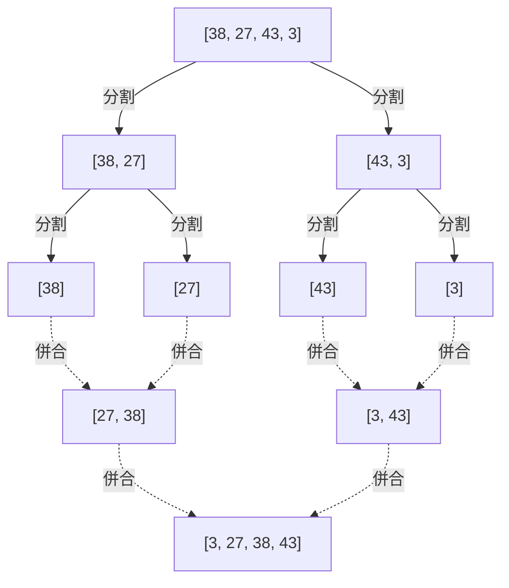
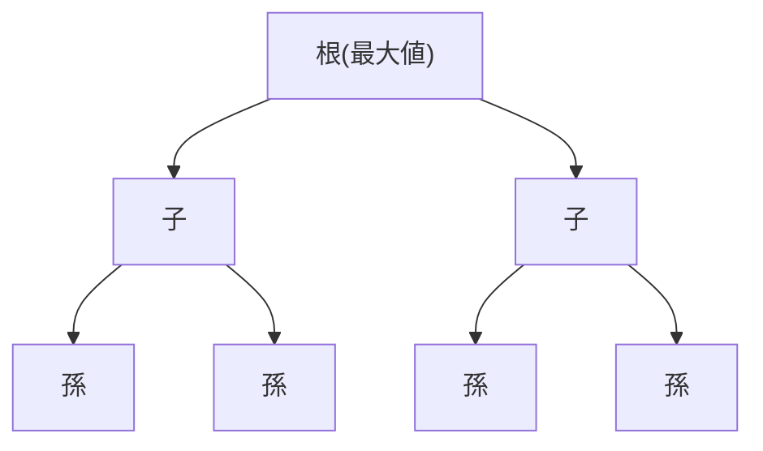

---

## 2. $O(n^2)$ のアルゴリズム：基礎と直感的なアプローチ

最初に紹介するのは、計算量が $O(n^2)$ となる基本的なアルゴリズム群です。これらは大規模なデータセットには実用性が低いものの、実装が直感的で非常にシンプルであり、アルゴリズムの基礎を学ぶための優れた教材となります。また、データのサイズが極端に小さい場合や、ほぼソート済みのデータに対しては、複雑なアルゴリズムよりも高速に動作することもあります。

### 2.1 バブルソート (Bubble Sort)

バブルソートは、最も有名で単純なソートアルゴリズムの一つです。隣り合う2つの要素を比較し、順序が逆であれば入れ替える、という操作を配列の末尾まで行います。これを配列全体がソートされるまで繰り返します。各パスの終了時には、最も大きい（または小さい）要素が配列の端に「浮かび上がる」ように移動していくため、バブルソートと呼ばれています。

#### バブルソートの仕組み

1. 配列の先頭から順に、隣り合う要素（`arr[i]` と `arr[i+1]`）を比較します。
2. 左側の要素が右側の要素より大きければ、両者をスワップ（交換）します。
3. これを配列の最後まで繰り返すと、配列の最大値が一番右側に移動します。
4. 次のパスでは、一番右側の要素を除いて、再度1から繰り返します。
5. スワップが一度も行われなくなった時点で、配列は完全にソートされていると判断して終了します。

#### 時間・空間計算量と特徴

*   **最悪時間計算量**: $O(n^2)$ （配列が逆順にソートされている場合）
*   **平均時間計算量**: $O(n^2)$
*   **最良時間計算量**: $O(n)$ （すでにソートされており、最適化フラグを用いた場合）
*   **空間計算量**: $O(1)$ （In-place）
*   **安定性**: 安定 (Stable)

隣り合う要素の交換しか行わないため、同じ値を持つ要素が互いを追い越すことはなく、安定なアルゴリズムとなります。

#### Python実装コード

```python
def bubble_sort(arr):
    n = len(arr)
    # n回のパスを実行する
    for i in range(n):
        # 早期終了のためのフラグ
        swapped = False
        
        # 既にソートされた後ろの部分(i個)は無視する
        for j in range(0, n - i - 1):
            # 左の要素が右より大きければ交換
            if arr[j] > arr[j + 1]:
                arr[j], arr[j + 1] = arr[j + 1], arr[j]
                swapped = True
                
        # このパスで一度も交換が発生しなければ、既にソート完了
        if not swapped:
            break
            
    return arr
```

#### ステップバイステップのトレース

配列 `[5, 3, 8, 4, 2]` をバブルソートで昇順に並べ替える過程を見てみましょう。

*   **パス 1**:
    *   (5, 3) を比較 $\rightarrow$ 交換: `[3, 5, 8, 4, 2]`
    *   (5, 8) を比較 $\rightarrow$ 維持: `[3, 5, 8, 4, 2]`
    *   (8, 4) を比較 $\rightarrow$ 交換: `[3, 5, 4, 8, 2]`
    *   (8, 2) を比較 $\rightarrow$ 交換: `[3, 5, 4, 2, 8]` (8が確定)
*   **パス 2**:
    *   (3, 5) を比較 $\rightarrow$ 維持: `[3, 5, 4, 2, 8]`
    *   (5, 4) を比較 $\rightarrow$ 交換: `[3, 4, 5, 2, 8]`
    *   (5, 2) を比較 $\rightarrow$ 交換: `[3, 4, 2, 5, 8]` (5が確定)
*   **パス 3**:
    *   (3, 4) を比較 $\rightarrow$ 維持: `[3, 4, 2, 5, 8]`
    *   (4, 2) を比較 $\rightarrow$ 交換: `[3, 2, 4, 5, 8]` (4が確定)
*   **パス 4**:
    *   (3, 2) を比較 $\rightarrow$ 交換: `[2, 3, 4, 5, 8]` (3が確定、自動的に2も確定)

### 2.2 選択ソート (Selection Sort)

選択ソートは、配列を「ソート済み部分」と「未ソート部分」に分け、未ソート部分から最小（または最大）の要素を探索して、未ソート部分の先頭要素と交換する、という操作を繰り返すアルゴリズムです。

#### 選択ソートの仕組み

1. 最初は配列全体が未ソート部分です。
2. 未ソート部分の中から最も小さい値を探します。
3. その最小値を、未ソート部分の先頭の要素と交換します。
4. これにより、先頭の要素がソート済み部分に含まれ、未ソート部分が1つ減ります。
5. この操作を未ソート部分がなくなるまで繰り返します。

#### 時間・空間計算量と特徴

*   **最悪時間計算量**: $O(n^2)$
*   **平均時間計算量**: $O(n^2)$
*   **最良時間計算量**: $O(n^2)$
*   **空間計算量**: $O(1)$ （In-place）
*   **安定性**: 不安定 (Unstable)

選択ソートは、データの並び順によらず常に最小値を探すためのスキャンを最後まで行うため、最良ケースでも $O(n^2)$ かかります。また、離れた位置にある要素とスワップを行うため、安定ではありません。

#### Python実装コード

```python
def selection_sort(arr):
    n = len(arr)
    
    # 配列全体を走査
    for i in range(n):
        # 現在の位置を最小値のインデックスと仮定
        min_idx = i
        
        # 残りの未ソート部分から本当の最小値を探す
        for j in range(i + 1, n):
            if arr[j] < arr[min_idx]:
                min_idx = j
                
        # 最小値が見つかったら、現在の位置(i)と交換する
        arr[i], arr[min_idx] = arr[min_idx], arr[i]
        
    return arr
```

#### ステップバイステップのトレース

配列 `[29, 10, 14, 37, 13]` を選択ソートします。

*   **i = 0**: 最小値を探す `[29, 10, 14, 37, 13]` $\rightarrow$ 最小値は 10。29 と 10 を交換。
    結果: `[10, 29, 14, 37, 13]` (10が確定)
*   **i = 1**: 残り `[29, 14, 37, 13]` から最小値を探す $\rightarrow$ 最小値は 13。29 と 13 を交換。
    結果: `[10, 13, 14, 37, 29]` (13が確定)
*   **i = 2**: 残り `[14, 37, 29]` から最小値を探す $\rightarrow$ 最小値は 14。そのまま(自己交換)。
    結果: `[10, 13, 14, 37, 29]` (14が確定)
*   **i = 3**: 残り `[37, 29]` から最小値を探す $\rightarrow$ 最小値は 29。37 と 29 を交換。
    結果: `[10, 13, 14, 29, 37]` (29が確定、自動的に37も確定)

### 2.3 挿入ソート (Insertion Sort)

挿入ソートは、私たちがトランプのカードを手に持って手札を整えるときによく使う直感的な方法です。未ソート部分から要素を1つ取り出し、それをすでにソート済みの部分の正しい位置に挿入していくアルゴリズムです。

#### 挿入ソートの仕組み

1. 配列の最初の要素（インデックス0）はすでにソートされているとみなします。
2. 次の要素（インデックス1）を取り出し（これを `key` とします）、ソート済み部分（左側）の要素と後ろから順に比較します。
3. `key` よりも大きい要素があれば、その要素を1つ右にずらします。
4. `key` が挿入されるべき正しい位置が見つかったら、そこに `key` を置きます。
5. これを配列の最後まで繰り返します。

#### 時間・空間計算量と特徴

*   **最悪時間計算量**: $O(n^2)$ （逆順にソートされている場合）
*   **平均時間計算量**: $O(n^2)$
*   **最良時間計算量**: $O(n)$ （ほぼソートされている場合）
*   **空間計算量**: $O(1)$ （In-place）
*   **安定性**: 安定 (Stable)

挿入ソートの最大の強みは、**データがすでにソートされている（または、それに近い）場合、比較と移動が最小限で済むため $O(n)$ に近い速度で非常に高速に動作する** 点です。この性質は、後述するTimsortなどのハイブリッドアルゴリズムで大いに活用されています。

#### Python実装コード

```python
def insertion_sort(arr):
    # インデックス1から開始 (0番目はソート済みとみなす)
    for i in range(1, len(arr)):
        key = arr[i]
        j = i - 1
        
        # ソート済み部分を後ろからスキャンし、keyより大きいものを右へずらす
        while j >= 0 and key < arr[j]:
            arr[j + 1] = arr[j]
            j -= 1
            
        # 空いた正しい位置にkeyを挿入
        arr[j + 1] = key
        
    return arr
```

#### ステップバイステップのトレース

配列 `[12, 11, 13, 5, 6]` を挿入ソートします。

*   **i = 1 (key = 11)**: 左の12と比較。12 > 11なので12を右へシフトし、空いた場所に11を挿入。
    結果: `[11, 12, 13, 5, 6]`
*   **i = 2 (key = 13)**: 左の12と比較。12 < 13なのでシフト不要。そのまま。
    結果: `[11, 12, 13, 5, 6]`
*   **i = 3 (key = 5)**: 13, 12, 11と順に比較し、すべて5より大きいためすべて右へシフト。一番左端に5を挿入。
    結果: `[5, 11, 12, 13, 6]`
*   **i = 4 (key = 6)**: 13, 12, 11と順に比較して右へシフト。5 < 6なので5の右隣に6を挿入。
    結果: `[5, 6, 11, 12, 13]`

---

## 3. $O(n \log n)$ のアルゴリズム：分割統治と圧倒的な効率

データ量 $n$ が大きくなると、$O(n^2)$ のアルゴリズムでは計算時間が爆発的に増大し、実用に耐えなくなります。そこで登場するのが、配列を分割して再帰的に処理する **分割統治法** (Divide and Conquer) などの高度なテクニックを用いたアルゴリズムです。比較ベースのソートアルゴリズムの理論的限界である $O(n \log n)$ を達成し、大規模データに対して圧倒的なパフォーマンスを発揮します。

### 3.1 マージソート (Merge Sort)

マージソートは、ジョン・フォン・ノイマンによって1945年に考案された、美しく堅牢なアルゴリズムです。「分割統治法」の代表例であり、配列を半分、また半分と要素が1つになるまで分割し、その後ソートしながら「併合（マージ）」していくアプローチをとります。

#### マージソートの仕組み

1. **分割 (Divide)**: 与えられた配列を中央で2つの部分配列に分割します。これを部分配列の長さが1になるまで再帰的に繰り返します（長さ1の配列はすでにソートされている状態とみなせます）。
2. **統治と併合 (Conquer and Combine)**: 2つのソート済みの部分配列の先頭要素同士を比較し、小さい方を新しい配列に格納していきます。これを繰り返し、元の1つの配列になるまで併合します。



#### 時間・空間計算量と特徴

*   **最悪・平均・最良時間計算量**: 全て $O(n \log n)$
    *   常に半分に分割していくため、分割の深さは $\log_2 n$。各階層での併合処理は全体で $O(n)$ の時間がかかるため、乗算して $O(n \log n)$ となります。データの状態によらず計算量が一定であるため、非常に予測しやすく堅牢です。
*   **空間計算量**: $O(n)$ （Out-of-place）
    *   併合を行う際に、元の配列と同じサイズの作業用配列を必要とするのが最大の弱点です。
*   **安定性**: 安定 (Stable)
    *   併合時に同じ値だった場合、左側の配列の要素を優先して取り出すことで安定性を維持できます。

#### Python実装コード

```python
def merge_sort(arr):
    # 配列の長さが1以下の場合はすでにソート済みとして返す
    if len(arr) <= 1:
        return arr
        
    # 1. 分割: 中央のインデックスを計算
    mid = len(arr) // 2
    left_half = arr[:mid]
    right_half = arr[mid:]
    
    # 再帰的に左右をソート
    left_sorted = merge_sort(left_half)
    right_sorted = merge_sort(right_half)
    
    # 2. 併合: ソート済みの左右の配列をマージする
    return merge(left_sorted, right_sorted)

def merge(left, right):
    result = []
    i = j = 0
    
    # 両方の配列に要素が残っている間
    while i < len(left) and j < len(right):
        if left[i] <= right[j]:  # 安定性のために <= を使用
            result.append(left[i])
            i += 1
        else:
            result.append(right[j])
            j += 1
            
    # 残っている要素を追加
    result.extend(left[i:])
    result.extend(right[j:])
    
    return result
```

### 3.2 クイックソート (Quick Sort)

トニー・ホアによって考案されたクイックソートは、名前の通り、実世界において最も高速に動作することが多い優れたアルゴリズムです。マージソートと同じく分割統治法を用いますが、アプローチが異なります。基準となる要素（**ピボット**）を選び、ピボットより小さいグループと大きいグループに振り分けることでソートを進めます。

#### クイックソートの仕組み

1. **ピボットの選択**: 配列の中から1つの要素をピボット（基準値）として選びます。
2. **パーティション（分割）**: ピボットより小さい要素を左側に、ピボットより大きい要素を右側に集めます。この操作が終わると、ピボット自身の最終的なソート後の位置が確定します。
3. **再帰処理**: ピボットの左側の配列と右側の配列に対して、再帰的に同じ処理を繰り返します。

ピボットの選び方や分割方法（Hoare方式、Lomuto方式）によって性能が大きく変わります。

#### 時間・空間計算量と特徴

*   **最悪時間計算量**: $O(n^2)$
    *   これは致命的な弱点です。すでにソート済みの配列に対して、常に端の要素をピボットとして選んでしまうと、配列が「1つ」と「残り全部」に偏って分割され続け、最悪計算量に陥ります。これを回避するために「Median-of-three（先頭・中央・末尾の中央値をとる）」などのピボット選択の工夫が必須です。
*   **平均時間計算量**: $O(n \log n)$
    *   実質的には定数係数が非常に小さく、キャッシュ効率が極めて良いため、マージソートやヒープソートよりも高速に動作します。
*   **空間計算量**: 平均 $O(\log n)$、最悪 $O(n)$
    *   配列自体を直接書き換える In-place なアルゴリズムですが、再帰呼び出しのためのコールスタックを消費します。
*   **安定性**: 不安定 (Unstable)
    *   パーティション操作において離れた要素の交換が行われるため、安定ではありません。

#### Python実装コード (わかりやすいリスト内包表記版)

これはメモリ効率は良くありませんが、アルゴリズムの意図を最も端的に表しています。

```python
def quick_sort_simple(arr):
    if len(arr) <= 1:
        return arr
    
    # 中央の要素をピボットに選択
    pivot = arr[len(arr) // 2]
    
    # ピボット未満、等しい、超過の3つのリストに分割
    left = [x for x in arr if x < pivot]
    middle = [x for x in arr if x == pivot]
    right = [x for x in arr if x > pivot]
    
    # 再帰的に結合
    return quick_sort_simple(left) + middle + quick_sort_simple(right)
```

#### Python実装コード (In-place Lomuto Partition Scheme版)

実際のライブラリなどで使われる、メモリを使わない In-place な実装です。

```python
def quick_sort_inplace(arr, low, high):
    if low < high:
        # パーティション分割を行い、ピボットの正しい位置を取得
        pi = partition(arr, low, high)
        
        # ピボットの左右を再帰的にソート
        quick_sort_inplace(arr, low, pi - 1)
        quick_sort_inplace(arr, pi + 1, high)

def partition(arr, low, high):
    # 末尾の要素をピボットとして選択 (Lomuto方式)
    pivot = arr[high]
    
    # iはピボットより小さい要素の最後のインデックスを指す
    i = low - 1
    
    for j in range(low, high):
        # 現在の要素がピボット以下なら、iを進めてスワップ
        if arr[j] <= pivot:
            i = i + 1
            arr[i], arr[j] = arr[j], arr[i]
            
    # ピボットを正しい位置(i+1)に挿入
    arr[i + 1], arr[high] = arr[high], arr[i + 1]
    
    return i + 1
```

### 3.3 ヒープソート (Heap Sort)

ヒープソートは、**二分ヒープ（Binary Heap）**という木構造のデータ構造を巧みに利用したソートアルゴリズムです。最悪計算量が $O(n \log n)$ でありながら、追加のメモリを使用しない In-place なソートであるという、マージソートとクイックソートの良いとこ取りのような特性を持ちます。

#### ヒープソートの仕組み

1. **ヒープの構築**: まず、与えられた配列を「最大ヒープ（Max Heap）」に変換します。最大ヒープとは、親ノードの値が必ず子ノードの値以上になるという規則を満たした完全二分木のことです。配列上でインデックス計算（親：$(i-1)/2$、左子：$2i+1$、右子：$2i+2$）を用いることで、木構造を配列のまま表現できます。
2. **最大値の抽出と再構築**: 最大ヒープのルート（配列の先頭 `arr[0]`）には必ず最大値が存在します。この最大値を配列の末尾の要素と交換します。これにより、最大値が配列の最終位置に確定します。
3. ルートが書き換えられたことでヒープの条件が崩れるため、ヒープの末尾（確定済みの部分）を除いた範囲で「ヒープの再構築（Heapify）」を行い、再び最大ヒープの条件を満たすようにします。
4. この操作を要素が1つになるまで繰り返すことで、配列の後ろから順に大きい値が確定し、最終的に昇順にソートされます。



#### 時間・空間計算量と特徴

*   **最悪・平均・最良時間計算量**: 全て $O(n \log n)$
    *   ヒープの構築に $O(n)$、最大値の抽出と再構築（$O(\log n)$）を $n$ 回繰り返すため、全体で $O(n \log n)$ となります。いかなるデータの並びでもこの計算量が保証されるため、最悪ケースの回避が求められるシステムで重宝します。
*   **空間計算量**: $O(1)$ （In-place）
    *   配列上でそのままヒープ木を表現するため、追加のメモリを必要としません。
*   **安定性**: 不安定 (Unstable)
    *   ヒープ構築と抽出の過程で遠く離れた要素をスワップするため、安定ではありません。

#### Python実装コード

```python
def heapify(arr, n, i):
    largest = i          # ルートを最大値と仮定
    left = 2 * i + 1     # 左の子
    right = 2 * i + 2    # 右の子

    # 左の子がルートより大きい場合
    if left < n and arr[left] > arr[largest]:
        largest = left

    # 右の子が現在の最大値より大きい場合
    if right < n and arr[right] > arr[largest]:
        largest = right

    # ルートが最大値でなかった場合、スワップして再帰的にヒープ化
    if largest != i:
        arr[i], arr[largest] = arr[largest], arr[i]
        heapify(arr, n, largest)

def heap_sort(arr):
    n = len(arr)

    # 1. 最大ヒープの構築 (ボトムアップに構築)
    # 最後の非葉ノードからルートに向かってヒープ化
    for i in range(n // 2 - 1, -1, -1):
        heapify(arr, n, i)

    # 2. 要素を1つずつ抽出してソート
    for i in range(n - 1, 0, -1):
        # 現在のルート(最大値)を未ソート部分の末尾と交換
        arr[i], arr[0] = arr[0], arr[i]
        
        # サイズを減らした新しいヒープに対して再構築
        heapify(arr, i, 0)
        
    return arr
```

---

## 4. $O(n)$ の非比較ソート：比較限界の超越

これまで見てきたソートアルゴリズムはすべて、要素同士の大小関係を比較演算（`<`, `>`, `==`）を用いて判断する「比較ベースのソート」でした。比較ベースのソートは数学的に $O(n \log n)$ より速くならないことが証明されています。

しかし、データの性質（整数である、桁数が決まっている、範囲が狭いなど）をうまく利用し、「比較」を一切行わない特殊なアルゴリズムを用いれば、線形時間 $O(n)$ での超高速ソートが可能になります。

### 4.1 計数ソート (Counting Sort)

計数ソートは、データの中に特定のキー値がいくつ存在するかを「カウント」することで、要素の正しい位置を計算するアルゴリズムです。主に、0から特定の最大値 $k$ までの狭い範囲の整数をソートする場合に劇的な効果を発揮します。

#### 時間・空間計算量
*   **時間計算量**: $O(n + k)$。データ数 $n$ と値の範囲 $k$ に依存します。$k$ が $n$ と同程度であれば $O(n)$ となりますが、$k$ が非常に大きい（例：1と10億しかない配列）場合は著しく非効率になります。
*   **空間計算量**: $O(n + k)$。カウント用配列と出力用配列を必要とします。

#### Python実装のイメージ
```python
def counting_sort(arr):
    if not arr:
        return arr
        
    max_val = max(arr)
    # カウント用配列をゼロで初期化
    count = [0] * (max_val + 1)
    
    # 1. 各要素の出現回数をカウント
    for num in arr:
        count[num] += 1
        
    # 2. 累積和を計算 (要素の最終的な位置を決定するため)
    for i in range(1, len(count)):
        count[i] += count[i - 1]
        
    # 3. 出力配列を生成 (安定性を保つため後ろから走査)
    output = [0] * len(arr)
    for num in reversed(arr):
        output[count[num] - 1] = num
        count[num] -= 1
        
    return output
```

### 4.2 基数ソート (Radix Sort)

計数ソートの弱点である「値の範囲が広いと使えない」を克服したのが基数ソートです。数値を「1の位」「10の位」「100の位」と、下の桁から順に（LSD: Least Significant Digit）安定なソート（内部的に計数ソートを使うことが多い）を適用していくことで、全体のソートを完了させます。文字列のソートなどにも応用されます。

### 4.3 バケツソート (Bucket Sort)

バケツソートは、データの取りうる範囲を均等なサイズの「バケツ」に分割し、各データを対応するバケツに放り込みます。その後、各バケツの中で個別にソート（挿入ソートなどが使われる）を行い、最後にすべてのバケツの中身を順に結合して完成させます。データが特定の範囲に一様に分布している場合、平均 $O(n)$ で極めて高速に動作します。

---

## 5. 現代の実用界を支配するハイブリッドアルゴリズム

学術的な教科書ではクイックソートやマージソートまでが扱われることが多いですが、現在のプログラミング言語の裏側で実際に稼働しているのは、複数のアルゴリズムの長所を組み合わせた **ハイブリッドアルゴリズム** です。

### 5.1 Timsort (Pythonのデフォルト)

Timsort（ティムソート）は、Tim Peters氏によって2002年にPython向けに実装されたアルゴリズムで、現在ではPythonの `list.sort()` や `sorted()` はもちろん、Javaのオブジェクト配列や[Rust](https://kenji.blog/p/webassembly-wasm-current-future/)の標準ソートなど、数多くの言語で採用されている実用界の覇者です。

Timsortの最大の設計思想は、 **「現実世界のデータは、完全にランダムなものは少なく、ある程度部分的にソートされている（連続した昇順や降順のブロックがある）ことが多い」** という経験則に基づいています。

#### Timsortの特徴
*   **マージソートと挿入ソートの融合**: 配列を一定のサイズ（通常は32〜64要素程度）のチャンクに分割し、それぞれを挿入ソートで高速に並べ替えます。その後、それらをマージソートの要領で併合していきます。
*   **ラン(Run) の活用**: 配列をスキャンし、最初から連続して昇順（または降順）になっている部分（これを "Run" と呼びます）を検出します。降順の場合は反転させて昇順にし、それらをマージの単位として活用します。
*   **適応的 (Adaptive) な計算量**: 完全にランダムなデータに対しては最悪 $O(n \log n)$ を保証しつつ、すでにソートされている、あるいは部分的にソートされているデータに対しては、最良で $O(n)$ という信じられない速度を叩き出します。
*   **安定性**: 安定なアルゴリズムです。

### 5.2 Introsort (C++ `std::sort`)

Introspective Sort (イントロソート) は、C++のSTLである `std::sort` や、.NET (C#) の標準ソートなどで採用されています。

クイックソートは平均的に最も高速ですが、ピボットの選び方によっては最悪 $O(n^2)$ に陥る致命的な弱点がありました。Introsortはこの弱点を完全に克服したハイブリッド手法です。

#### Introsortの特徴
1. 基本的には高速な **クイックソート** を用いて配列を分割していきます。
2. しかし、再帰の深さを監視し、分割の深さが $\log_2 n$ の定数倍（例: $2 \times \log_2 n$）を超えた場合、「ピボットの選択がうまくいかず、最悪計算量に陥りかけている」と判断（Introspection：自己内省）します。
3. その時点で、その部分配列に対するソート手法を、最悪計算量が $O(n \log n)$ である **ヒープソート** に切り替えます。
4. また、要素数が非常に小さくなった場合（例: 16要素以下）は、関数呼び出しのオーバーヘッドを避けるため **挿入ソート** に切り替えます。

これにより、クイックソートの圧倒的な平均速度を維持しつつ、最悪の場合でも $O(n \log n)$ を保証するという、非の打ち所がないアルゴリズムを実現しています。

---

## 6. 総合比較テーブルまとめ

本記事で解説した主要なソートアルゴリズムの性能を、表形式でまとめました。

| アルゴリズム (Algorithm) | 最良時間計算量 (Best Time) | 平均時間計算量 (Avg Time) | 最悪時間計算量 (Worst Time) | 空間計算量 (Space) | 安定性 (Stability) | 手法・特徴 |
| :--- | :--- | :--- | :--- | :--- | :--- | :--- |
| **バブルソート (Bubble Sort)** | $O(n)$ | $O(n^2)$ | $O(n^2)$ | $O(1)$ | Yes | 交換。教育用。実用性は低い。 |
| **選択ソート (Selection Sort)** | $O(n^2)$ | $O(n^2)$ | $O(n^2)$ | $O(1)$ | No | 選択。常に全体の走査が必要。 |
| **挿入ソート (Insertion Sort)** | $O(n)$ | $O(n^2)$ | $O(n^2)$ | $O(1)$ | Yes | 挿入。ほぼソート済みのデータに極めて強い。 |
| **マージソート (Merge Sort)** | $O(n \log n)$ | $O(n \log n)$ | $O(n \log n)$ | $O(n)$ | Yes | 分割統治。堅牢な計算量だがメモリを食う。 |
| **クイックソート (Quick Sort)** | $O(n \log n)$ | $O(n \log n)$ | $O(n^2)$ | $O(\log n)$ | No | 分割統治。平均最速だが最悪ケースに注意。 |
| **ヒープソート (Heap Sort)** | $O(n \log n)$ | $O(n \log n)$ | $O(n \log n)$ | $O(1)$ | No | 二分ヒープ。In-placeで堅牢。 |
| **計数ソート (Counting Sort)** | $O(n+k)$ | $O(n+k)$ | $O(n+k)$ | $O(k)$ | Yes | 非比較。キー範囲が狭い場合に最強。 |
| **Timsort** (Python等標準) | $O(n)$ | $O(n \log n)$ | $O(n \log n)$ | $O(n)$ | Yes | ハイブリッド。実データに対して適応的で最速。 |
| **Introsort** (C++等標準) | $O(n \log n)$ | $O(n \log n)$ | $O(n \log n)$ | $O(\log n)$ | No | ハイブリッド。Quickの速さとHeapの堅牢性を両立。 |

---

## 7. 結論：結局どれを使えばいいのか？

ここまで数多くのソートアルゴリズムを解説してきましたが、実践的なソフトウェア開発においては、明確な答えがあります。

**「基本的に、言語組み込みの標準ソート関数を使用する」**

これに尽きます。Pythonの `.sort()` や C++の `std::sort` は、本記事で紹介したTimsortやIntrosortなどの高度なハイブリッドアルゴリズムで実装されており、数え切れないほどの最適化（メモリのキャッシュ効率の向上、分岐予測の最適化など）が施されています。自作のクイックソートが標準ライブラリの速度に勝つことはまずありません。

しかし、ではなぜソートアルゴリズムを学ぶ必要があるのでしょうか？

1. **基礎概念の理解**: 計算量（Big O Notation）、In-place/Out-of-place、安定性といった概念は、ソートに限らずあらゆるアルゴリズム設計・データ構造設計の基礎となります。
2. **特殊な制約下のシステム**: 組み込みシステムなどメモリが極度に制限された環境では、$O(1)$ 空間のヒープソートや In-place なクイックソートを自前で実装する必要があるかもしれません。
3. **データの性質を活かす**: 「値の範囲が1〜100に限られている100万件のデータ」をソートする場合、標準のTimsort（$O(n \log n)$）を使うよりも、計数ソート（$O(n)$）を実装した方が圧倒的に高速になります。

アルゴリズムの内部構造を知ることで、ブラックボックスとして提供されている標準関数の「得意なこと」と「苦手なこと」を理解し、より高度で効率的なシステム設計を行うことができるようになるのです。

ぜひ、本記事のPythonコードを手元で動かしてみて、データ量を変えたり、逆順のデータを渡したりして、それぞれのアルゴリズムの挙動や実行時間を体感してみてください！
