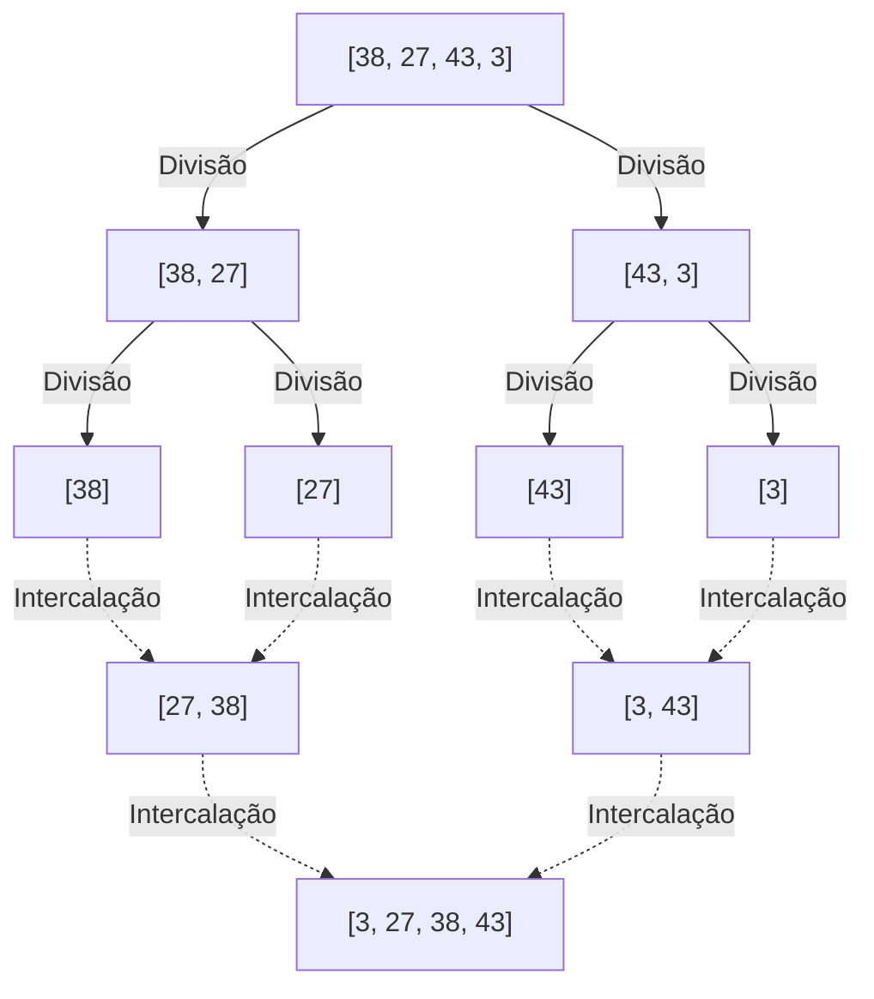
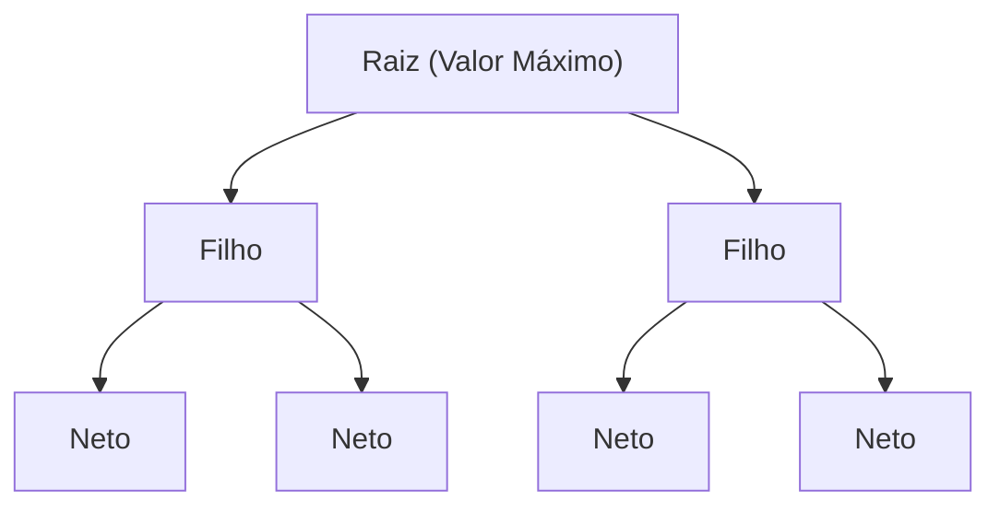

---

## 2. Algoritmos $O(n^2)$: Abordagens Básicas e Intuitivas

Os primeiros que apresentaremos são os grupos de algoritmos básicos cuja complexidade é $O(n^2)$. Embora tenham baixa praticidade para conjuntos de dados em larga escala, sua implementação é muito intuitiva e simples, tornando-os excelentes materiais de estudo para aprender os fundamentos dos algoritmos. Além disso, quando o tamanho dos dados é extremamente pequeno ou para dados que já estão quase ordenados, eles podem funcionar mais rapidamente do que algoritmos complexos.

### 2.1 Bubble Sort (Ordenação por Flutuação)

O Bubble Sort é um dos algoritmos de ordenação mais famosos e simples. A operação de comparar dois elementos adjacentes e trocá-los se a ordem estiver invertida é realizada até o final do array. Isso é repetido até que todo o array esteja ordenado. A cada passe concluído, o maior (ou menor) elemento se move como se "flutuasse" para a extremidade do array, e é por isso que é chamado de Bubble Sort.

#### Como o Bubble Sort Funciona

1. A partir do início do array, os elementos adjacentes (`arr[i]` e `arr[i+1]`) são comparados em ordem.
2. Se o elemento da esquerda for maior que o da direita, os dois são trocados (swap).
3. Repetindo isso até o final do array, o valor máximo do array se moverá para a extremidade direita.
4. No próximo passe, com exceção do elemento mais à direita, o processo é repetido novamente a partir do passo 1.
5. No momento em que nenhuma troca ocorrer em um passe, considera-se que o array está completamente ordenado e o processo é concluído.

#### Complexidade de Tempo/Espaço e Características

*   **Pior complexidade de tempo**: $O(n^2)$ (quando o array está ordenado na ordem inversa)
*   **Complexidade de tempo média**: $O(n^2)$
*   **Melhor complexidade de tempo**: $O(n)$ (quando já está ordenado e a flag de otimização é usada)
*   **Complexidade de espaço**: $O(1)$ (In-place)
*   **Estabilidade**: Estável (Stable)

Como ele apenas troca elementos adjacentes, os elementos com o mesmo valor não ultrapassam uns aos outros, tornando-o um algoritmo estável.

#### Código de Implementação em Python

```python
def bubble_sort(arr):
    n = len(arr)
    # Executa n passes
    for i in range(n):
        # Flag para término antecipado
        swapped = False
        
        # Ignora a parte traseira já ordenada (i elementos)
        for j in range(0, n - i - 1):
            # Troca se o elemento da esquerda for maior que o da direita
            if arr[j] > arr[j + 1]:
                arr[j], arr[j + 1] = arr[j + 1], arr[j]
                swapped = True
                
        # Se nenhuma troca ocorreu neste passe, a ordenação já está completa
        if not swapped:
            break
            
    return arr
```

#### Rastreamento Passo a Passo

Vamos ver o processo de ordenação do array `[5, 3, 8, 4, 2]` em ordem crescente com o Bubble Sort.

*   **Passe 1**:
    *   Compara (5, 3) $\rightarrow$ Troca: `[3, 5, 8, 4, 2]`
    *   Compara (5, 8) $\rightarrow$ Mantém: `[3, 5, 8, 4, 2]`
    *   Compara (8, 4) $\rightarrow$ Troca: `[3, 5, 4, 8, 2]`
    *   Compara (8, 2) $\rightarrow$ Troca: `[3, 5, 4, 2, 8]` (8 está determinado)
*   **Passe 2**:
    *   Compara (3, 5) $\rightarrow$ Mantém: `[3, 5, 4, 2, 8]`
    *   Compara (5, 4) $\rightarrow$ Troca: `[3, 4, 5, 2, 8]`
    *   Compara (5, 2) $\rightarrow$ Troca: `[3, 4, 2, 5, 8]` (5 está determinado)
*   **Passe 3**:
    *   Compara (3, 4) $\rightarrow$ Mantém: `[3, 4, 2, 5, 8]`
    *   Compara (4, 2) $\rightarrow$ Troca: `[3, 2, 4, 5, 8]` (4 está determinado)
*   **Passe 4**:
    *   Compara (3, 2) $\rightarrow$ Troca: `[2, 3, 4, 5, 8]` (3 está determinado, automaticamente o 2 também está)

### 2.2 Selection Sort (Ordenação por Seleção)

O Selection Sort é um algoritmo que divide o array em uma "parte ordenada" e uma "parte não ordenada", procura o menor (ou maior) elemento da parte não ordenada e o troca com o primeiro elemento da parte não ordenada. Esta operação é repetida.

#### Como o Selection Sort Funciona

1. Inicialmente, o array inteiro é a parte não ordenada.
2. Procura o menor valor dentro da parte não ordenada.
3. Troca esse menor valor pelo primeiro elemento da parte não ordenada.
4. Com isso, o primeiro elemento é incluído na parte ordenada, e a parte não ordenada diminui em um.
5. Repete essa operação até que não haja mais partes não ordenadas.

#### Complexidade de Tempo/Espaço e Características

*   **Pior complexidade de tempo**: $O(n^2)$
*   **Complexidade de tempo média**: $O(n^2)$
*   **Melhor complexidade de tempo**: $O(n^2)$
*   **Complexidade de espaço**: $O(1)$ (In-place)
*   **Estabilidade**: Instável (Unstable)

O Selection Sort varre até o fim para encontrar o menor valor, independentemente da ordem dos dados, então leva $O(n^2)$ mesmo no melhor caso. Além disso, como realiza trocas com elementos em posições distantes, não é estável.

#### Código de Implementação em Python

```python
def selection_sort(arr):
    n = len(arr)
    
    # Percorre todo o array
    for i in range(n):
        # Assume a posição atual como o índice do menor valor
        min_idx = i
        
        # Procura o verdadeiro menor valor no restante da parte não ordenada
        for j in range(i + 1, n):
            if arr[j] < arr[min_idx]:
                min_idx = j
                
        # Quando encontrar o menor valor, troca com a posição atual (i)
        arr[i], arr[min_idx] = arr[min_idx], arr[i]
        
    return arr
```

#### Rastreamento Passo a Passo

Vamos ordenar o array `[29, 10, 14, 37, 13]` com Selection Sort.

*   **i = 0**: Procura o menor valor `[29, 10, 14, 37, 13]` $\rightarrow$ O menor valor é 10. Troca 29 e 10.
    Resultado: `[10, 29, 14, 37, 13]` (10 está determinado)
*   **i = 1**: Procura o menor valor nos restantes `[29, 14, 37, 13]` $\rightarrow$ O menor valor é 13. Troca 29 e 13.
    Resultado: `[10, 13, 14, 37, 29]` (13 está determinado)
*   **i = 2**: Procura o menor valor nos restantes `[14, 37, 29]` $\rightarrow$ O menor valor é 14. Permanece o mesmo (troca consigo mesmo).
    Resultado: `[10, 13, 14, 37, 29]` (14 está determinado)
*   **i = 3**: Procura o menor valor nos restantes `[37, 29]` $\rightarrow$ O menor valor é 29. Troca 37 e 29.
    Resultado: `[10, 13, 14, 29, 37]` (29 está determinado, automaticamente o 37 também está)

### 2.3 Insertion Sort (Ordenação por Inserção)

O Insertion Sort é um método intuitivo que usamos frequentemente quando seguramos cartas de baralho e arrumamos nossa mão. É um algoritmo que retira um elemento da parte não ordenada e o insere na posição correta na parte já ordenada.

#### Como o Insertion Sort Funciona

1. O primeiro elemento do array (índice 0) é considerado já ordenado.
2. O próximo elemento (índice 1) é retirado (vamos chamá-lo de `key`), e comparado com os elementos da parte já ordenada (lado esquerdo) de trás para frente.
3. Se houver um elemento maior que a `key`, esse elemento é deslocado uma posição para a direita.
4. Quando a posição correta onde a `key` deve ser inserida é encontrada, a `key` é colocada lá.
5. Repete isso até o final do array.

#### Complexidade de Tempo/Espaço e Características

*   **Pior complexidade de tempo**: $O(n^2)$ (quando ordenado na ordem inversa)
*   **Complexidade de tempo média**: $O(n^2)$
*   **Melhor complexidade de tempo**: $O(n)$ (quando está quase ordenado)
*   **Complexidade de espaço**: $O(1)$ (In-place)
*   **Estabilidade**: Estável (Stable)

A maior força do Insertion Sort é que, **se os dados já estiverem ordenados (ou perto disso), ele opera extremamente rápido com uma velocidade próxima a $O(n)$, pois as comparações e movimentações são mínimas**. Essa propriedade é muito utilizada em algoritmos híbridos, como o Timsort, que será descrito posteriormente.

#### Código de Implementação em Python

```python
def insertion_sort(arr):
    # Inicia do índice 1 (considera o índice 0 como ordenado)
    for i in range(1, len(arr)):
        key = arr[i]
        j = i - 1
        
        # Varre a parte ordenada de trás para frente e desloca para a direita os maiores que key
        while j >= 0 and key < arr[j]:
            arr[j + 1] = arr[j]
            j -= 1
            
        # Insere a key na posição correta vazia
        arr[j + 1] = key
        
    return arr
```

#### Rastreamento Passo a Passo

Vamos ordenar o array `[12, 11, 13, 5, 6]` com Insertion Sort.

*   **i = 1 (key = 11)**: Compara com o 12 à esquerda. Como 12 > 11, desloca o 12 para a direita e insere o 11 no espaço vazio.
    Resultado: `[11, 12, 13, 5, 6]`
*   **i = 2 (key = 13)**: Compara com o 12 à esquerda. Como 12 < 13, o deslocamento não é necessário. Permanece como está.
    Resultado: `[11, 12, 13, 5, 6]`
*   **i = 3 (key = 5)**: Compara sequencialmente com 13, 12 e 11. Como todos são maiores que 5, todos são deslocados para a direita. Insere o 5 na extremidade esquerda.
    Resultado: `[5, 11, 12, 13, 6]`
*   **i = 4 (key = 6)**: Compara sequencialmente com 13, 12 e 11, deslocando-os para a direita. Como 5 < 6, insere o 6 à direita do 5.
    Resultado: `[5, 6, 11, 12, 13]`

---

## 3. Algoritmos $O(n \log n)$: Divisão e Conquista e Eficiência Esmagadora

À medida que a quantidade de dados $n$ aumenta, o tempo de computação de algoritmos $O(n^2)$ explode e eles não conseguem mais suportar o uso prático. É aí que entram os algoritmos que usam técnicas avançadas, como o método de **Divisão e Conquista** (Divide and Conquer), que divide o array e o processa recursivamente. Eles atingem o limite teórico de $O(n \log n)$ para algoritmos de ordenação baseados em comparação, exibindo um desempenho esmagador para dados em larga escala.

### 3.1 Merge Sort (Ordenação por Intercalação)

O Merge Sort é um algoritmo belo e robusto concebido por John von Neumann em 1945. É um exemplo representativo do "Método de Divisão e Conquista", adotando a abordagem de dividir o array pela metade e pela metade de novo até que cada parte tenha um elemento, e depois mesclá-los (intercalar) enquanto são ordenados.

#### Como o Merge Sort Funciona

1. **Divisão (Divide)**: Divide o array dado ao meio em dois sub-arrays. Isso é repetido recursivamente até que o comprimento dos sub-arrays seja 1 (um array de comprimento 1 pode ser considerado já ordenado).
2. **Conquista e Combinação (Conquer and Combine)**: Compara os primeiros elementos de dois sub-arrays já ordenados e armazena o menor no novo array. Isso é repetido até intercalá-los em um único array original.



#### Complexidade de Tempo/Espaço e Características

*   **Pior, Média, Melhor complexidade de tempo**: Todas $O(n \log n)$
    *   Como divide continuamente pela metade, a profundidade da divisão é $\log_2 n$. O processo de intercalação em cada nível leva um tempo de $O(n)$ no total, então, multiplicando, temos $O(n \log n)$. A complexidade é muito previsível e robusta, não importando o estado dos dados.
*   **Complexidade de espaço**: $O(n)$ (Out-of-place)
    *   Sua maior fraqueza é precisar de um array de trabalho do mesmo tamanho do array original ao realizar a intercalação.
*   **Estabilidade**: Estável (Stable)
    *   Ao priorizar a retirada de elementos do array esquerdo quando houver valores iguais durante a intercalação, a estabilidade pode ser mantida.

#### Código de Implementação em Python

```python
def merge_sort(arr):
    # Se o comprimento do array for 1 ou menos, retorna como já ordenado
    if len(arr) <= 1:
        return arr
        
    # 1. Divisão: Calcula o índice central
    mid = len(arr) // 2
    left_half = arr[:mid]
    right_half = arr[mid:]
    
    # Ordena as metades esquerda e direita recursivamente
    left_sorted = merge_sort(left_half)
    right_sorted = merge_sort(right_half)
    
    # 2. Intercalação: Mescla os arrays esquerdo e direito já ordenados
    return merge(left_sorted, right_sorted)

def merge(left, right):
    result = []
    i = j = 0
    
    # Enquanto houver elementos em ambos os arrays
    while i < len(left) and j < len(right):
        if left[i] <= right[j]:  # Usa <= para estabilidade
            result.append(left[i])
            i += 1
        else:
            result.append(right[j])
            j += 1
            
    # Adiciona os elementos restantes
    result.extend(left[i:])
    result.extend(right[j:])
    
    return result
```

### 3.2 Quick Sort (Ordenação Rápida)

O Quick Sort, inventado por Tony Hoare, é um algoritmo excelente que, como o nome sugere, frequentemente opera mais rapidamente no mundo real. Assim como o Merge Sort, ele usa o método de Divisão e Conquista, mas a abordagem é diferente. Ele escolhe um elemento como referência (**pivô**) e realiza a ordenação dividindo os dados em um grupo menor e um grupo maior que o pivô.

#### Como o Quick Sort Funciona

1. **Escolha do Pivô**: Um elemento do array é escolhido como pivô (valor de referência).
2. **Partição (Divisão)**: Os elementos menores que o pivô são reunidos à esquerda, e os maiores à direita. Quando essa operação termina, a posição final de ordenação do próprio pivô é definida.
3. **Processamento Recursivo**: O mesmo processo é repetido recursivamente no array à esquerda do pivô e no array à direita.

O desempenho muda enormemente dependendo de como o pivô é escolhido e do método de partição (método de Hoare, método de Lomuto).

#### Complexidade de Tempo/Espaço e Características

*   **Pior complexidade de tempo**: $O(n^2)$
    *   Esta é uma fraqueza fatal. Se um array já estiver ordenado e o elemento da extremidade for sempre escolhido como pivô, ele continuará a ser particionado assimetricamente em "um elemento" e "o resto todo", resultando na pior complexidade possível. Para evitar isso, truques de escolha de pivô, como "Mediana de Três" (pegando a mediana do início, meio e fim), são essenciais.
*   **Complexidade de tempo média**: $O(n \log n)$
    *   Na prática, o fator constante é muito pequeno e a eficiência de cache é extremamente boa, tornando-o mais rápido do que o Merge Sort ou o Heap Sort.
*   **Complexidade de espaço**: Média $O(\log n)$, Pior $O(n)$
    *   É um algoritmo In-place que reescreve diretamente o array, mas consome a pilha de chamadas para chamadas recursivas.
*   **Estabilidade**: Instável (Unstable)
    *   Como envolve a troca de elementos distantes durante a operação de partição, não é estável.

#### Código de Implementação em Python (Versão fácil de entender com List Comprehension)

Isso não é eficiente em termos de memória, mas expressa muito claramente a intenção do algoritmo.

```python
def quick_sort_simple(arr):
    if len(arr) <= 1:
        return arr
    
    # Escolhe o elemento central como pivô
    pivot = arr[len(arr) // 2]
    
    # Divide em três listas: menores que, iguais a, e maiores que o pivô
    left = [x for x in arr if x < pivot]
    middle = [x for x in arr if x == pivot]
    right = [x for x in arr if x > pivot]
    
    # Combina recursivamente
    return quick_sort_simple(left) + middle + quick_sort_simple(right)
```

#### Código de Implementação em Python (Versão Esquema de Partição de Lomuto In-place)

Uma implementação In-place que não usa memória extra, frequentemente usada em bibliotecas reais.

```python
def quick_sort_inplace(arr, low, high):
    if low < high:
        # Realiza a divisão em partição e obtém a posição correta do pivô
        pi = partition(arr, low, high)
        
        # Ordena recursivamente os lados esquerdo e direito do pivô
        quick_sort_inplace(arr, low, pi - 1)
        quick_sort_inplace(arr, pi + 1, high)

def partition(arr, low, high):
    # Escolhe o elemento final como pivô (método de Lomuto)
    pivot = arr[high]
    
    # i aponta para o último índice dos elementos menores que o pivô
    i = low - 1
    
    for j in range(low, high):
        # Se o elemento atual for menor ou igual ao pivô, avança i e troca
        if arr[j] <= pivot:
            i = i + 1
            arr[i], arr[j] = arr[j], arr[i]
            
    # Insere o pivô na posição correta (i+1)
    arr[i + 1], arr[high] = arr[high], arr[i + 1]
    
    return i + 1
```

### 3.3 Heap Sort (Ordenação por Heap)

O Heap Sort é um algoritmo de ordenação que faz uso inteligente de uma estrutura de dados em árvore chamada **Binary Heap** (Heap Binário). Ele tem a pior complexidade em $O(n \log n)$, mas ainda é uma ordenação In-place que não usa memória adicional, combinando os melhores atributos do Merge Sort e do Quick Sort.

#### Como o Heap Sort Funciona

1. **Construção do Heap**: Primeiro, o array fornecido é convertido em um "Max Heap" (Heap Máximo). Um Max Heap é uma árvore binária completa que atende à regra de que o valor do nó pai deve ser sempre maior ou igual ao valor dos nós filhos. Usando o cálculo de índice no array (pai: $(i-1)/2$, filho da esquerda: $2i+1$, filho da direita: $2i+2$), a estrutura de árvore pode ser expressa apenas como um array.
2. **Extração do Máximo e Reconstrução**: O valor máximo sempre existe na raiz do Max Heap (o início do array, `arr[0]`). Troca-se esse valor máximo pelo último elemento do array. Isso fixa o valor máximo na posição final do array.
3. Como a condição do heap é quebrada devido à alteração da raiz, realiza-se a "Reconstrução do Heap (Heapify)" no escopo excluindo o final do heap (a parte já fixada), para satisfazer a condição do Max Heap novamente.
4. Repetindo essa operação até que sofra apenas 1 elemento, os valores maiores são determinados em ordem de trás para frente no array e, por fim, ordenados de forma crescente.



#### Complexidade de Tempo/Espaço e Características

*   **Pior, Média, Melhor complexidade de tempo**: Todas $O(n \log n)$
    *   $O(n)$ para construir o heap, e extrair e reconstruir o valor máximo ($O(\log n)$) é repetido $n$ vezes, resultando em um total de $O(n \log n)$. Como essa complexidade é garantida independentemente da ordem dos dados, ela é útil em sistemas que exigem evitar o pior caso.
*   **Complexidade de espaço**: $O(1)$ (In-place)
    *   Por representar diretamente a árvore de heap no array, não precisa de memória extra.
*   **Estabilidade**: Instável (Unstable)
    *   Como troca elementos distantes uns dos outros durante a construção e extração do heap, não é estável.

#### Código de Implementação em Python

```python
def heapify(arr, n, i):
    largest = i          # Assume que a raiz é o valor máximo
    left = 2 * i + 1     # Filho da esquerda
    right = 2 * i + 2    # Filho da direita

    # Se o filho da esquerda for maior que a raiz
    if left < n and arr[left] > arr[largest]:
        largest = left

    # Se o filho da direita for maior que o valor máximo atual
    if right < n and arr[right] > arr[largest]:
        largest = right

    # Se a raiz não for o valor máximo, faz a troca e transforma em heap recursivamente
    if largest != i:
        arr[i], arr[largest] = arr[largest], arr[i]
        heapify(arr, n, largest)

def heap_sort(arr):
    n = len(arr)

    # 1. Construção do Max Heap (construído de baixo para cima)
    # Transforma em heap desde o último nó não-folha até a raiz
    for i in range(n // 2 - 1, -1, -1):
        heapify(arr, n, i)

    # 2. Extrai os elementos um por um para ordenar
    for i in range(n - 1, 0, -1):
        # Troca a raiz atual (valor máximo) com o final da parte não ordenada
        arr[i], arr[0] = arr[0], arr[i]
        
        # Reconstrói para o novo heap com tamanho reduzido
        heapify(arr, i, 0)
        
    return arr
```

---

## 4. Ordenações Não Comparativas $O(n)$: Transcendendo os Limites de Comparação

Todos os algoritmos de ordenação vistos até agora foram "ordenações baseadas em comparação" que avaliam as relações de tamanho dos elementos usando operadores de comparação (`<`, `>`, `==`). Foi matematicamente provado que ordenações baseadas em comparação não podem ser mais rápidas que $O(n \log n)$.

Contudo, ao utilizar habilmente a natureza dos dados (como serem inteiros, ter um número fixo de dígitos, intervalo restrito) e usando algoritmos especiais que não fazem "comparação" alguma, torna-se possível uma ordenação ultrarrápida em tempo linear $O(n)$.

### 4.1 Counting Sort (Ordenação por Contagem)

Counting Sort é um algoritmo que calcula a posição correta dos elementos contando a quantidade de chaves específicas presentes nos dados. Mostra um efeito dramático quando ordenando um intervalo estreito de inteiros de 0 a um valor máximo específico $k$.

#### Complexidade de Tempo/Espaço
*   **Complexidade de tempo**: $O(n + k)$. Depende do número de dados $n$ e da amplitude de valores $k$. Se $k$ for da mesma magnitude que $n$, ele torna-se $O(n)$; contudo, se $k$ for excessivamente grande (ex: o array possui apenas os números 1 e 1 bilhão), torna-se tremendamente ineficiente.
*   **Complexidade de espaço**: $O(n + k)$. Requer um array de contagem e um array de saída.

#### Imagem de Implementação em Python
```python
def counting_sort(arr):
    if not arr:
        return arr
        
    max_val = max(arr)
    # Inicializa o array de contagem com zeros
    count = [0] * (max_val + 1)
    
    # 1. Conta o número de ocorrências de cada elemento
    for num in arr:
        count[num] += 1
        
    # 2. Calcula a soma cumulativa (para determinar as posições finais dos elementos)
    for i in range(1, len(count)):
        count[i] += count[i - 1]
        
    # 3. Gera o array de saída (varre de trás para frente para preservar a estabilidade)
    output = [0] * len(arr)
    for num in reversed(arr):
        output[count[num] - 1] = num
        count[num] -= 1
        
    return output
```

### 4.2 Radix Sort (Ordenação Digital)

Superando a fraqueza do Counting Sort — "não pode ser usado quando o intervalo de valores é muito amplo" —, existe o Radix Sort. Ele conclui a ordenação inteira aplicando de forma consistente uma ordenação estável (muitas vezes, o próprio Counting Sort) a partir do dígito menos significativo (LSD: Least Significant Digit): a unidade, a dezena, a centena e assim por diante. Também é aplicado na ordenação de cadeias de caracteres.

### 4.3 Bucket Sort (Ordenação por Baldes)

Bucket Sort particiona a extensão possível de dados em "baldes" (buckets) de tamanho igual e coloca cada elemento no balde correspondente. Em seguida, os elementos dentro de cada balde são ordenados separadamente (geralmente via Insertion Sort), e finalmente os conteúdos de todos os baldes são concatenados. Se os dados estiverem distribuídos uniformemente em um intervalo específico, funciona de maneira extremamente rápida com a média $O(n)$.

---

## 5. Algoritmos Híbridos que Dominam a Prática Moderna

Embora os livros acadêmicos costumem cobrir apenas até o Quick Sort e o Merge Sort, os algoritmos operando nos bastidores de fato nas linguagens de programação modernas são **Algoritmos Híbridos**, combinando os pontos fortes de múltiplos algoritmos.

### 5.1 Timsort (Padrão no Python)

Timsort é um algoritmo implementado em 2002 por Tim Peters para o Python, e hoje é o campeão do mundo prático; foi adotado pelo `list.sort()` e `sorted()` do Python, e também em diversas linguagens, como no array de objetos do Java e na ordenação padrão do [Rust](https://kenji.blog/pt/p/webassembly-wasm-current-future/).

A principal filosofia de design por trás do Timsort baseia-se na heurística: **"Dados no mundo real raramente são completamente aleatórios e muitas vezes contêm blocos já ordenados de forma crescente ou decrescente"**.

#### Características do Timsort
*   **Fusão de Merge Sort e Insertion Sort**: O array é dividido em pedaços pequenos (chunks) fixos (normalmente em torno de 32 a 64 elementos) e ordenado rapidamente via Insertion Sort. Depois disso, esses chunks são fundidos nos moldes do Merge Sort.
*   **Uso de Runs**: Inspeciona o array encontrando uma sequência que já é consecutivamente crescente (ou decrescente) desde o início (chamada de "Run"). Se for decrescente, é invertida para crescente; todas essas sequências são aproveitadas como unidades para mesclagem.
*   **Complexidade Adaptativa (Adaptive)**: Embora garanta no pior cenário o tempo $O(n \log n)$ para dados completamente aleatórios, consegue atingir uma velocidade fantástica de $O(n)$ no melhor caso para dados já ordenados — ou parcialmente ordenados.
*   **Estabilidade**: É um algoritmo estável.

### 5.2 Introsort (C++ `std::sort`)

Introspective Sort (Introsort) foi adotado em implementações como o `std::sort` da biblioteca STL do C++ e na ordenação padrão de .NET (C#).

Apesar do Quick Sort possuir a velocidade média mais veloz, dependendo de como o pivô for escolhido, ele tinha um ponto fraco terrível, correndo o risco de chegar a um tempo de $O(n^2)$ no pior caso. O Introsort soluciona perfeitamente esse ponto fraco como um esquema híbrido.

#### Características do Introsort
1. Em sua base principal, usa o veloz **Quick Sort** para particionar o array.
2. Contudo, a profundidade das chamadas recursivas é acompanhada de perto; se a profundidade da subdivisão ultrapassar um múltiplo constante de $\log_2 n$ (ex: $2 \times \log_2 n$), o algoritmo percebe a si mesmo que "a escolha do pivô falhou, caindo na pior complexidade" (introspecção).
3. A partir desse ponto, muda repentinamente a estratégia de ordenação do sub-array para **Heap Sort**, garantindo sempre $O(n \log n)$ como limite no pior caso.
4. Além disso, se o tamanho dos fragmentos do array for minúsculo (ex: 16 elementos ou menos), o overhead (custo) de chamadas de função é evitado invocando o **Insertion Sort**.

Graças a isso, temos um algoritmo impecável e sem vulnerabilidades: retém a absurda velocidade média do Quick Sort, enquanto assegura o $O(n \log n)$ mesmo na pior das hipóteses.

---

## 6. Resumo e Tabela de Comparação

Compilamos em uma tabela as performances dos principais algoritmos de ordenação explicados neste artigo.

| Algoritmo (Algorithm) | Melhor Complexidade de Tempo (Best Time) | Complexidade de Tempo Média (Avg Time) | Pior Complexidade de Tempo (Worst Time) | Complexidade de Espaço (Space) | Estabilidade (Stability) | Método/Característica |
| :--- | :--- | :--- | :--- | :--- | :--- | :--- |
| **Bubble Sort (Ordenação por Flutuação)** | $O(n)$ | $O(n^2)$ | $O(n^2)$ | $O(1)$ | Yes | Troca. Fim educativo. Baixa praticidade. |
| **Selection Sort (Ordenação por Seleção)** | $O(n^2)$ | $O(n^2)$ | $O(n^2)$ | $O(1)$ | No | Seleção. A varredura de tudo é sempre obrigatória. |
| **Insertion Sort (Ordenação por Inserção)** | $O(n)$ | $O(n^2)$ | $O(n^2)$ | $O(1)$ | Yes | Inserção. Extremamente superior para dados semi-ordenados. |
| **Merge Sort (Ordenação por Intercalação)** | $O(n \log n)$ | $O(n \log n)$ | $O(n \log n)$ | $O(n)$ | Yes | Divisão e Conquista. Consome memória mas possui tempo robusto. |
| **Quick Sort (Ordenação Rápida)** | $O(n \log n)$ | $O(n \log n)$ | $O(n^2)$ | $O(\log n)$ | No | Divisão e Conquista. Em média o mais veloz, mas muito cuidado com os piores casos. |
| **Heap Sort (Ordenação por Heap)** | $O(n \log n)$ | $O(n \log n)$ | $O(n \log n)$ | $O(1)$ | No | Heap Binário. Robusto e do tipo In-place. |
| **Counting Sort (Ordenação por Contagem)** | $O(n+k)$ | $O(n+k)$ | $O(n+k)$ | $O(k)$ | Yes | Não comparativo. Fortíssimo num escopo delimitado de chaves. |
| **Timsort** (Padrão no Python, etc.) | $O(n)$ | $O(n \log n)$ | $O(n \log n)$ | $O(n)$ | Yes | Híbrido. Veloz e adaptável aos dados reais. |
| **Introsort** (Padrão no C++, etc.) | $O(n \log n)$ | $O(n \log n)$ | $O(n \log n)$ | $O(\log n)$ | No | Híbrido. União da robustez do Heap com rapidez do Quick. |

---

## 7. Conclusão: Afinal, qual deve ser escolhido?

Ao longo desta leitura, apresentamos dezenas de algoritmos, porém em desenvolvimento de software real, a resposta é nítida.

**"Como regra fundamental, utilize as funções padrão embutidas na linguagem"**

A resposta foca exclusivamente nisso. O `.sort()` no Python e o `std::sort` no C++ já estão construídos utilizando os robustos algoritmos híbridos mostrados no artigo, como Timsort e Introsort, com otimizações sem fim agregadas (como previsão de ramificações, aproveitamento massivo de cache em memória etc.). Raramente o seu próprio código isolado do Quick Sort superará a velocidade e solidez das bibliotecas padrão.

Logo, restam os questionamentos, então por que estudar algoritmos de ordenação?

1. **Fixação dos Conceitos**: Ideias como o Notação [Big O](https://kenji.blog/pt/p/time-space-complexity-big-o-notation-examples/), estabilidade (Stability), além de In-place/Out-place, formam o âmago e raciocínio de quase todas as arquiteturas de algoritmos e arranjos estruturais, sem se prender restritamente à ordenação.
2. **Entornos Restritos de Hardware**: Para ecossistemas estritamente limitados sob a capacidade da memória (microcontroladores embarcados), existirá talvez o dever de codificar sua própria elaboração baseada no Heap Sort In-place $O(1)$ ou similares.
3. **Explorando a Condição do Domínio**: Se a premissa consistir em arranjar "um milhão de elementos enjaulados no intervalo numérico entre 1 a 100", então fabricar um simples Counting Sort ($O(n)$) pode esmagar espetacularmente até o admirável Timsort (preso ao limite $O(n \log n)$).

Conhecer a profundidade da sua estrutura oculta é ter a compreensão íntima da engrenagem oculta, entendendo perfeitamente não apenas suas competências vitais, mas inclusive aquilo em que fracassam — promovendo a possibilidade da tomada de decisões robustas ao desenhar sistemas inteligentes em alto nível.

Incentivamos veementemente a tentar executar os trechos em Python transcritos, alternando entre variáveis randômicas de quantidade e inversões exóticas para analisar cada performance de tempos e comportamentos visuais de cada exemplar exposto!
