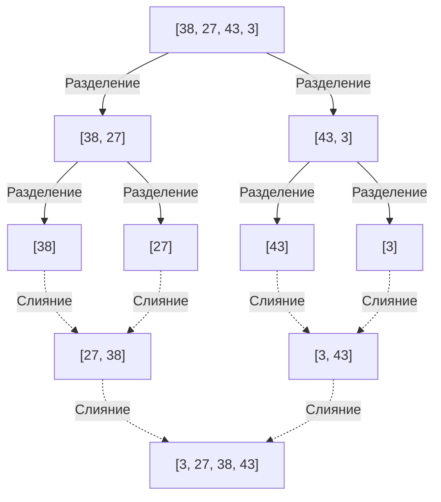
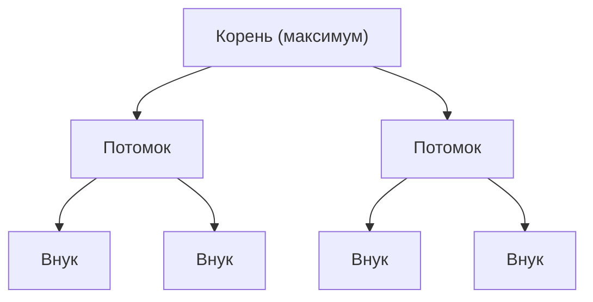

---

## 2. Алгоритмы со сложностью $O(n^2)$: Основы и интуитивные подходы

Сначала мы представим группу базовых алгоритмов со сложностью $O(n^2)$. Хотя они малопригодны для больших наборов данных, их реализация интуитивно понятна и очень проста, что делает их отличным учебным материалом для изучения основ алгоритмов. Кроме того, когда размер данных крайне мал или данные почти отсортированы, они могут работать быстрее, чем сложные алгоритмы.

### 2.1 Пузырьковая сортировка (Bubble Sort)

Пузырьковая сортировка — один из самых известных и простых алгоритмов сортировки. Он сравнивает два соседних элемента и меняет их местами, если их порядок неправилен. Эта операция продолжается до конца массива. Процесс повторяется, пока весь массив не будет отсортирован. В конце каждого прохода самый большой (или самый маленький) элемент "всплывает" к краю массива, отсюда и название.

#### Механизм пузырьковой сортировки

1. Начиная с начала массива, сравниваются соседние элементы (`arr[i]` и `arr[i+1]`).
2. Если левый элемент больше правого, они меняются местами (swap).
3. При повторении этого до конца массива максимальное значение массива перемещается в самый правый край.
4. В следующем проходе процесс повторяется с шага 1, исключая самый правый элемент.
5. Когда не произойдет ни одного обмена, массив считается полностью отсортированным, и процесс завершается.

#### Временная и пространственная сложность и особенности

*    **Наихудшая временная сложность** : $O(n^2)$ (когда массив отсортирован в обратном порядке)
*    **Средняя временная сложность** : $O(n^2)$
*    **Лучшая временная сложность** : $O(n)$ (когда данные уже отсортированы и используется флаг оптимизации)
*    **Пространственная сложность** : $O(1)$ (In-place)
*    **Стабильность** : Стабильная (Stable)

Поскольку обмениваются только соседние элементы, элементы с одинаковыми значениями никогда не обгонят друг друга, что делает этот алгоритм стабильным.

#### Реализация на Python

```python
def bubble_sort(arr):
    n = len(arr)
    # Выполнить n проходов
    for i in range(n):
        # Флаг для раннего завершения
        swapped = False
        
        # Игнорировать уже отсортированную заднюю часть (i элементов)
        for j in range(0, n - i - 1):
            # Если левый элемент больше правого, поменять местами
            if arr[j] > arr[j + 1]:
                arr[j], arr[j + 1] = arr[j + 1], arr[j]
                swapped = True
                
        # Если за этот проход не было ни одного обмена, сортировка завершена
        if not swapped:
            break
            
    return arr
```

#### Пошаговая трассировка

Давайте рассмотрим процесс сортировки массива `[5, 3, 8, 4, 2]` по возрастанию с помощью пузырьковой сортировки.

*    **Проход 1** :
    *   Сравнение (5, 3) $\rightarrow$ обмен: `[3, 5, 8, 4, 2]`
    *   Сравнение (5, 8) $\rightarrow$ сохранение: `[3, 5, 8, 4, 2]`
    *   Сравнение (8, 4) $\rightarrow$ обмен: `[3, 5, 4, 8, 2]`
    *   Сравнение (8, 2) $\rightarrow$ обмен: `[3, 5, 4, 2, 8]` (8 зафиксирована)
*    **Проход 2** :
    *   Сравнение (3, 5) $\rightarrow$ сохранение: `[3, 5, 4, 2, 8]`
    *   Сравнение (5, 4) $\rightarrow$ обмен: `[3, 4, 5, 2, 8]`
    *   Сравнение (5, 2) $\rightarrow$ обмен: `[3, 4, 2, 5, 8]` (5 зафиксирована)
*    **Проход 3** :
    *   Сравнение (3, 4) $\rightarrow$ сохранение: `[3, 4, 2, 5, 8]`
    *   Сравнение (4, 2) $\rightarrow$ обмен: `[3, 2, 4, 5, 8]` (4 зафиксирована)
*    **Проход 4** :
    *   Сравнение (3, 2) $\rightarrow$ обмен: `[2, 3, 4, 5, 8]` (3 зафиксирована, 2 автоматически фиксируется)

### 2.2 Сортировка выбором (Selection Sort)

Сортировка выбором — это алгоритм, который делит массив на "отсортированную" и "неотсортированную" части. Он многократно находит минимальный (или максимальный) элемент в неотсортированной части и меняет его местами с первым элементом неотсортированной части.

#### Механизм сортировки выбором

1. Сначала весь массив является неотсортированной частью.
2. Поиск наименьшего значения в неотсортированной части.
3. Обмен этого минимального значения с первым элементом неотсортированной части.
4. В результате первый элемент становится частью отсортированной области, а неотсортированная часть уменьшается на 1.
5. Эта операция повторяется, пока не исчезнет неотсортированная часть.

#### Временная и пространственная сложность и особенности

*    **Наихудшая временная сложность** : $O(n^2)$
*    **Средняя временная сложность** : $O(n^2)$
*    **Лучшая временная сложность** : $O(n^2)$
*    **Пространственная сложность** : $O(1)$ (In-place)
*    **Стабильность** : Нестабильная (Unstable)

Сортировка выбором всегда сканирует до конца массива для поиска минимального значения, независимо от порядка данных, поэтому даже в лучшем случае она требует $O(n^2)$ времени. Кроме того, она нестабильна из-за обмена с отдаленными элементами.

#### Реализация на Python

```python
def selection_sort(arr):
    n = len(arr)
    
    # Обход всего массива
    for i in range(n):
        # Предполагаем, что текущая позиция - индекс минимального значения
        min_idx = i
        
        # Поиск истинного минимального значения в оставшейся неотсортированной части
        for j in range(i + 1, n):
            if arr[j] < arr[min_idx]:
                min_idx = j
                
        # Если найдено минимальное значение, меняем его местами с текущей позицией (i)
        arr[i], arr[min_idx] = arr[min_idx], arr[i]
        
    return arr
```

#### Пошаговая трассировка

Сортировка выбором для массива `[29, 10, 14, 37, 13]`.

*    **i = 0** : Поиск минимального значения `[29, 10, 14, 37, 13]` $\rightarrow$ Минимальное значение 10. Обмен 29 и 10.
    Результат: `[10, 29, 14, 37, 13]` (10 зафиксировано)
*    **i = 1** : Поиск минимального значения среди оставшихся `[29, 14, 37, 13]` $\rightarrow$ Минимальное значение 13. Обмен 29 и 13.
    Результат: `[10, 13, 14, 37, 29]` (13 зафиксировано)
*    **i = 2** : Поиск минимального значения среди оставшихся `[14, 37, 29]` $\rightarrow$ Минимальное значение 14. Без изменений (обмен с самим собой).
    Результат: `[10, 13, 14, 37, 29]` (14 зафиксировано)
*    **i = 3** : Поиск минимального значения среди оставшихся `[37, 29]` $\rightarrow$ Минимальное значение 29. Обмен 37 и 29.
    Результат: `[10, 13, 14, 29, 37]` (29 зафиксировано, 37 автоматически фиксируется)

### 2.3 Сортировка вставками (Insertion Sort)

Сортировка вставками — интуитивно понятный метод, который мы часто используем при организации карт в руке. Это алгоритм, который берет один элемент из неотсортированной части и вставляет его в правильное положение в уже отсортированной части.

#### Механизм сортировки вставками

1. Первый элемент массива (индекс 0) считается уже отсортированным.
2. Берется следующий элемент (индекс 1) (назовем его `key`) и сравнивается в обратном порядке с элементами в отсортированной части (слева).
3. Если есть элемент больше, чем `key`, он сдвигается на одну позицию вправо.
4. Когда найдено правильное место для вставки `key`, `key` помещается туда.
5. Это повторяется до конца массива.

#### Временная и пространственная сложность и особенности

*    **Наихудшая временная сложность** : $O(n^2)$ (когда массив отсортирован в обратном порядке)
*    **Средняя временная сложность** : $O(n^2)$
*    **Лучшая временная сложность** : $O(n)$ (когда массив почти отсортирован)
*    **Пространственная сложность** : $O(1)$ (In-place)
*    **Стабильность** : Стабильная (Stable)

Главное преимущество сортировки вставками заключается в том, что  **когда данные уже отсортированы (или почти отсортированы), сравнений и перемещений происходит минимальное количество, и алгоритм работает очень быстро со скоростью, близкой к $O(n)$** . Это свойство широко используется в гибридных алгоритмах, таких как Timsort, который будет обсуждаться позже.

#### Реализация на Python

```python
def insertion_sort(arr):
    # Начинаем с индекса 1 (0-й элемент считается отсортированным)
    for i in range(1, len(arr)):
        key = arr[i]
        j = i - 1
        
        # Сканирование отсортированной части с конца, сдвиг элементов больше key вправо
        while j >= 0 and key < arr[j]:
            arr[j + 1] = arr[j]
            j -= 1
            
        # Вставка key в освободившуюся правильную позицию
        arr[j + 1] = key
        
    return arr
```

#### Пошаговая трассировка

Сортировка вставками для массива `[12, 11, 13, 5, 6]`.

*    **i = 1 (key = 11)** : Сравнение с 12 слева. 12 > 11, поэтому 12 сдвигается вправо, а 11 вставляется на пустое место.
    Результат: `[11, 12, 13, 5, 6]`
*    **i = 2 (key = 13)** : Сравнение с 12 слева. 12 < 13, поэтому сдвиг не требуется. Без изменений.
    Результат: `[11, 12, 13, 5, 6]`
*    **i = 3 (key = 5)** : Сравнение по очереди с 13, 12, 11. Все они больше 5, поэтому все сдвигаются вправо. 5 вставляется в крайнее левое положение.
    Результат: `[5, 11, 12, 13, 6]`
*    **i = 4 (key = 6)** : Сравнение по очереди с 13, 12, 11, они сдвигаются вправо. 5 < 6, поэтому 6 вставляется справа от 5.
    Результат: `[5, 6, 11, 12, 13]`

---

## 3. Алгоритмы со сложностью $O(n \log n)$: Разделяй и властвуй и потрясающая эффективность

Когда объем данных $n$ становится большим, время вычислений для алгоритмов $O(n^2)$ взрывообразно увеличивается, что делает их непригодными для практического использования. Здесь на помощь приходят алгоритмы, использующие продвинутые техники, такие как  **разделяй и властвуй**  (Divide and Conquer), которые разделяют массив и обрабатывают его рекурсивно. Они достигают теоретического предела $O(n \log n)$ для алгоритмов сортировки на основе сравнения и демонстрируют потрясающую производительность на больших наборах данных.

### 3.1 Сортировка слиянием (Merge Sort)

Сортировка слиянием, изобретенная Джоном фон Нейманом в 1945 году, представляет собой красивый и надежный алгоритм. Это типичный пример метода "разделяй и властвуй", в котором используется подход деления массива пополам снова и снова, пока элементы не станут единичными, а затем их "слияния" (merge) с одновременной сортировкой.

#### Механизм сортировки слиянием

1.  **Разделение (Divide)** : Разделение заданного массива посередине на два подмассива. Это рекурсивно повторяется до тех пор, пока длина подмассивов не станет равной 1 (массив длиной 1 уже считается отсортированным).
2.  **Властвование и слияние (Conquer and Combine)** : Сравниваются первые элементы двух отсортированных подмассивов, и меньший помещается в новый массив. Это повторяется до тех пор, пока они не сольются обратно в исходный единый массив.



#### Временная и пространственная сложность и особенности

*    **Наихудшая, средняя и лучшая временная сложность** : Все равны $O(n \log n)$
    *   Поскольку он всегда делится пополам, глубина разделения равна $\log_2 n$. Процесс слияния на каждом уровне занимает в общей сложности $O(n)$ времени, поэтому при умножении получаем $O(n \log n)$. Это очень предсказуемо и надежно, так как сложность постоянна независимо от состояния данных.
*    **Пространственная сложность** : $O(n)$ (Out-of-place)
    *   Его самый большой недостаток заключается в том, что для выполнения слияния требуется рабочий массив того же размера, что и исходный массив.
*    **Стабильность** : Стабильная (Stable)
    *   При одинаковых значениях во время слияния стабильность можно поддерживать, отдавая приоритет элементам левого массива.

#### Реализация на Python

```python
def merge_sort(arr):
    # Если длина массива меньше или равна 1, он уже отсортирован
    if len(arr) <= 1:
        return arr
        
    # 1. Разделение: вычисление центрального индекса
    mid = len(arr) // 2
    left_half = arr[:mid]
    right_half = arr[mid:]
    
    # Рекурсивная сортировка левой и правой частей
    left_sorted = merge_sort(left_half)
    right_sorted = merge_sort(right_half)
    
    # 2. Слияние: объединение отсортированных левой и правой частей
    return merge(left_sorted, right_sorted)

def merge(left, right):
    result = []
    i = j = 0
    
    # Пока в обоих массивах остаются элементы
    while i < len(left) and j < len(right):
        if left[i] <= right[j]:  # Использование <= для сохранения стабильности
            result.append(left[i])
            i += 1
        else:
            result.append(right[j])
            j += 1
            
    # Добавление оставшихся элементов
    result.extend(left[i:])
    result.extend(right[j:])
    
    return result
```

### 3.2 Быстрая сортировка (Quick Sort)

Быстрая сортировка, изобретенная Тони Хоаром, как следует из названия, является отличным алгоритмом, который чаще всего работает быстрее всех в реальном мире. Подобно сортировке слиянием, она использует принцип разделяй и властвуй, но отличается подходом. Выбирается базовый элемент ( **опорный элемент** или пивот), и данные распределяются в группы с элементами меньше пивота и больше пивота.

#### Механизм быстрой сортировки

1.  **Выбор опорного элемента** : Один элемент массива выбирается в качестве опорного (pivot).
2.  **Разбиение (Partition)** : Элементы меньше пивота собираются слева, а элементы больше пивота — справа. По завершении этой операции окончательная позиция самого пивота после сортировки фиксируется.
3.  **Рекурсивная обработка** : Тот же процесс рекурсивно повторяется для левого и правого массивов относительно пивота.

Производительность сильно зависит от метода выбора опорного элемента и метода разбиения (схема Хоара, схема Ломуто).

#### Временная и пространственная сложность и особенности

*    **Наихудшая временная сложность** : $O(n^2)$
    *   Это фатальная слабость. Если в качестве пивота всегда выбирается крайний элемент уже отсортированного массива, массив будет постоянно делиться на части "1 элемент" и "все остальные", что приведет к наихудшему времени выполнения. Чтобы избежать этого, необходимы такие стратегии выбора пивота, как "Медиана трех (Median-of-three)" (выбор медианы среди первого, среднего и последнего элементов).
*    **Средняя временная сложность** : $O(n \log n)$
    *   На практике константный множитель очень мал, а эффективность использования кэша чрезвычайно высока, поэтому она работает быстрее, чем сортировка слиянием или пирамидальная сортировка.
*    **Пространственная сложность** : Средняя $O(\log n)$, Наихудшая $O(n)$
    *   Хотя это In-place алгоритм, который напрямую перезаписывает массив, он потребляет стек вызовов для рекурсивных вызовов.
*    **Стабильность** : Нестабильная (Unstable)
    *   Она нестабильна, поскольку во время операции разбиения обмениваются далеко отстоящие друг от друга элементы.

#### Реализация на Python (Версия со списковыми включениями для простоты понимания)

Эта версия неэффективна по памяти, но наиболее четко выражает суть алгоритма.

```python
def quick_sort_simple(arr):
    if len(arr) <= 1:
        return arr
    
    # Выбор центрального элемента в качестве опорного
    pivot = arr[len(arr) // 2]
    
    # Разделение на 3 списка: элементы меньше, равные и больше опорного
    left = [x for x in arr if x < pivot]
    middle = [x for x in arr if x == pivot]
    right = [x for x in arr if x > pivot]
    
    # Рекурсивное объединение
    return quick_sort_simple(left) + middle + quick_sort_simple(right)
```

#### Реализация на Python (Версия In-place со схемой разбиения Ломуто)

Реализация In-place, не использующая дополнительную память, как это делается в реальных библиотеках.

```python
def quick_sort_inplace(arr, low, high):
    if low < high:
        # Выполнение разбиения и получение правильной позиции пивота
        pi = partition(arr, low, high)
        
        # Рекурсивная сортировка элементов слева и справа от пивота
        quick_sort_inplace(arr, low, pi - 1)
        quick_sort_inplace(arr, pi + 1, high)

def partition(arr, low, high):
    # Выбор последнего элемента в качестве опорного (схема Ломуто)
    pivot = arr[high]
    
    # i указывает на последний индекс элемента, который меньше пивота
    i = low - 1
    
    for j in range(low, high):
        # Если текущий элемент меньше или равен пивоту, продвигаем i и делаем обмен
        if arr[j] <= pivot:
            i = i + 1
            arr[i], arr[j] = arr[j], arr[i]
            
    # Вставляем пивот на правильную позицию (i+1)
    arr[i + 1], arr[high] = arr[high], arr[i + 1]
    
    return i + 1
```

### 3.3 Пирамидальная сортировка (Heap Sort)

Пирамидальная сортировка — это алгоритм, искусно использующий древовидную структуру данных, называемую  **двоичной кучей (Binary Heap)** . Он обладает преимуществами как сортировки слиянием, так и быстрой сортировки, представляя собой In-place сортировку без использования дополнительной памяти, при этом наихудшая временная сложность составляет $O(n \log n)$.

#### Механизм пирамидальной сортировки

1.  **Построение кучи** : Сначала заданный массив преобразуется в "максимальную кучу (Max Heap)". Максимальная куча — это полное бинарное дерево, удовлетворяющее правилу: значение родительского узла всегда больше или равно значению его дочерних узлов. Древовидная структура может быть представлена как массив с использованием вычисления индексов (родитель: $(i-1)/2$, левый потомок: $2i+1$, правый потомок: $2i+2$).
2.  **Извлечение максимального значения и перестроение** : В корне максимальной кучи (начало массива `arr[0]`) всегда находится максимальное значение. Это максимальное значение меняется местами с последним элементом массива. Таким образом, максимальное значение фиксируется в конечной позиции массива.
3. Поскольку корень был перезаписан, условие кучи нарушается, поэтому выполняется "перестроение кучи (Heapify)" в диапазоне, исключающем конец кучи (уже зафиксированную часть), чтобы снова выполнить условие максимальной кучи.
4. Эта операция повторяется до тех пор, пока не останется один элемент. В результате большие значения последовательно фиксируются в конце массива, и в итоге он оказывается отсортированным по возрастанию.



#### Временная и пространственная сложность и особенности

*    **Наихудшая, средняя и лучшая временная сложность** : Все равны $O(n \log n)$
    *   Построение кучи занимает $O(n)$, а извлечение и перестроение максимального значения ($O(\log n)$) повторяются $n$ раз, что в сумме дает $O(n \log n)$. Эта сложность гарантируется для любого порядка данных, поэтому алгоритм полезен в системах, где требуется избегать наихудших сценариев.
*    **Пространственная сложность** : $O(1)$ (In-place)
    *   Поскольку дерево кучи представляется непосредственно в массиве, дополнительная память не требуется.
*    **Стабильность** : Нестабильная (Unstable)
    *   Она нестабильна, так как в процессе построения кучи и извлечения происходит обмен далеко отстоящих элементов.

#### Реализация на Python

```python
def heapify(arr, n, i):
    largest = i          # Предполагаем, что корень является максимальным значением
    left = 2 * i + 1     # Левый потомок
    right = 2 * i + 2    # Правый потомок

    # Если левый потомок больше корня
    if left < n and arr[left] > arr[largest]:
        largest = left

    # Если правый потомок больше текущего максимального значения
    if right < n and arr[right] > arr[largest]:
        largest = right

    # Если корень не является максимальным значением, поменять местами и рекурсивно превратить в кучу
    if largest != i:
        arr[i], arr[largest] = arr[largest], arr[i]
        heapify(arr, n, largest)

def heap_sort(arr):
    n = len(arr)

    # 1. Построение максимальной кучи (снизу вверх)
    # Превращаем в кучу от последнего нелистового узла к корню
    for i in range(n // 2 - 1, -1, -1):
        heapify(arr, n, i)

    # 2. Поочередное извлечение элементов для сортировки
    for i in range(n - 1, 0, -1):
        # Обмен текущего корня (максимального значения) с концом неотсортированной части
        arr[i], arr[0] = arr[0], arr[i]
        
        # Перестроение новой кучи уменьшенного размера
        heapify(arr, i, 0)
        
    return arr
```

---

## 4. Несравнивающие алгоритмы сортировки за $O(n)$: Преодоление пределов сравнения

Все алгоритмы сортировки, рассмотренные до сих пор, являются "сортировками на основе сравнения", которые определяют соотношение размеров элементов с помощью операций сравнения (`<`, `>`, `==`). Математически доказано, что сортировки на основе сравнения не могут быть быстрее $O(n \log n)$.

Однако, умело используя свойства данных (например, они являются целыми числами, имеют фиксированное количество цифр или узкий диапазон) и применяя специальные алгоритмы, которые вообще не выполняют "сравнений", возможна сверхбыстрая сортировка за линейное время $O(n)$.

### 4.1 Сортировка подсчетом (Counting Sort)

Сортировка подсчетом — это алгоритм, вычисляющий правильные позиции элементов путем "подсчета" количества конкретных значений ключей в данных. Он особенно эффективен при сортировке целых чисел в узком диапазоне от 0 до определенного максимального значения $k$.

#### Временная и пространственная сложность
*    **Временная сложность** : $O(n + k)$. Зависит от количества данных $n$ и диапазона значений $k$. Если $k$ сопоставимо с $n$, то сложность будет $O(n)$, но если $k$ очень велико (например, массив содержит только 1 и 1 миллиард), алгоритм станет крайне неэффективным.
*    **Пространственная сложность** : $O(n + k)$. Требует массив для подсчета и массив для вывода.

#### Концепция реализации на Python
```python
def counting_sort(arr):
    if not arr:
        return arr
        
    max_val = max(arr)
    # Инициализация массива подсчета нулями
    count = [0] * (max_val + 1)
    
    # 1. Подсчет количества вхождений каждого элемента
    for num in arr:
        count[num] += 1
        
    # 2. Вычисление префиксных сумм (для определения конечной позиции элементов)
    for i in range(1, len(count)):
        count[i] += count[i - 1]
        
    # 3. Формирование выходного массива (обход с конца для сохранения стабильности)
    output = [0] * len(arr)
    for num in reversed(arr):
        output[count[num] - 1] = num
        count[num] -= 1
        
    return output
```

### 4.2 Поразрядная сортировка (Radix Sort)

Поразрядная сортировка преодолевает слабость сортировки подсчетом — "неприменимость при широком диапазоне значений". Она завершает всю сортировку путем применения стабильной сортировки (обычно внутри используется сортировка подсчетом) к числам разряд за разрядом, начиная с младших разрядов ("разряд единиц", "разряд десятков", "разряд сотен" и т. д. — LSD: Least Significant Digit). Она также применяется для сортировки строк.

### 4.3 Блочная сортировка (Bucket Sort)

Блочная сортировка (карманная сортировка) делит возможный диапазон данных на равномерные по размеру "блоки" (buckets) и помещает каждые данные в соответствующий блок. Затем данные в каждом блоке сортируются индивидуально (часто используется сортировка вставками), и, наконец, содержимое всех блоков последовательно объединяется для завершения. Когда данные равномерно распределены в определенном диапазоне, она работает чрезвычайно быстро, в среднем за $O(n)$.

---

## 5. Гибридные алгоритмы, доминирующие в современном практическом мире

В академических учебниках часто останавливаются на быстрой сортировке и сортировке слиянием. Однако в основе современных языков программирования работают  **гибридные алгоритмы** , сочетающие преимущества нескольких алгоритмов.

### 5.1 Timsort (По умолчанию в Python)

Timsort был реализован Тимом Питерсом (Tim Peters) в 2002 году для Python и сейчас является доминирующим алгоритмом в практическом мире, используемым в функциях `list.sort()` и `sorted()` в Python, а также для сортировки массивов объектов в Java, стандартной сортировки в [Rust](https://kenji.blog/ru/p/webassembly-wasm-current-future/) и многих других языках.

Главная философия дизайна Timsort основана на эмпирическом правиле:  **"Данные в реальном мире редко бывают полностью случайными, чаще они частично отсортированы (содержат непрерывные блоки по возрастанию или убыванию)"** .

#### Особенности Timsort
*    **Слияние сортировки слиянием и сортировки вставками** : Массив делится на части (chunks) определенного размера (обычно от 32 до 64 элементов), каждая из которых быстро сортируется сортировкой вставками. Затем они сливаются по принципу сортировки слиянием.
*    **Использование Run** : Массив сканируется для обнаружения частей, которые с самого начала последовательно идут по возрастанию (или по убыванию) (они называются "Run"). В случае убывания они переворачиваются на возрастание, и эти Run используются как единицы для слияния.
*    **Адаптивная вычислительная сложность (Adaptive)** : Для абсолютно случайных данных гарантируется наихудшее время $O(n \log n)$, в то время как для уже отсортированных или частично отсортированных данных он демонстрирует невероятную скорость, в лучшем случае $O(n)$.
*    **Стабильность** : Это стабильный алгоритм.

### 5.2 Introsort (C++ `std::sort`)

Introspective Sort (Интроспективная сортировка) используется в `std::sort` в STL для C++ и в стандартной сортировке .NET (C#).

Быстрая сортировка в среднем самая быстрая, но у нее есть фатальный недостаток: в зависимости от выбора опорного элемента она может выродиться в наихудшее время $O(n^2)$. Introsort — это гибридный метод, который полностью преодолел этот недостаток.

#### Особенности Introsort
1. В основном массив разбивается с использованием быстрой  **быстрой сортировки** .
2. Однако он отслеживает глубину рекурсии, и если она превышает константу, умноженную на $\log_2 n$ (например, $2 \times \log_2 n$), он решает, что "выбор опорного элемента неудачен и мы скатываемся к наихудшему времени" (Introspection: самоанализ).
3. На этом этапе метод сортировки для этого подмассива переключается на  **пирамидальную сортировку** , наихудшая сложность которой равна $O(n \log n)$.
4. Кроме того, когда количество элементов становится очень маленьким (например, 16 элементов или меньше), алгоритм переключается на  **сортировку вставками** , чтобы избежать накладных расходов на вызовы функций.

Таким образом достигается безупречный алгоритм, сохраняющий подавляющую среднюю скорость быстрой сортировки, но гарантирующий $O(n \log n)$ даже в худшем случае.

---

## 6. Сводная таблица комплексного сравнения

В таблице ниже обобщена производительность основных алгоритмов сортировки, рассмотренных в этой статье.

| Алгоритм (Algorithm) | Лучшее время (Best Time) | Среднее время (Avg Time) | Худшее время (Worst Time) | Пространство (Space) | Стабильность (Stability) | Метод / Особенности |
| :--- | :--- | :--- | :--- | :--- | :--- | :--- |
| **Пузырьковая сортировка (Bubble Sort)** | $O(n)$ | $O(n^2)$ | $O(n^2)$ | $O(1)$ | Да (Yes) | Обмен. Учебный. Низкая практичность. |
| **Сортировка выбором (Selection Sort)** | $O(n^2)$ | $O(n^2)$ | $O(n^2)$ | $O(1)$ | Нет (No) | Выбор. Всегда требует полного прохода. |
| **Сортировка вставками (Insertion Sort)** | $O(n)$ | $O(n^2)$ | $O(n^2)$ | $O(1)$ | Да (Yes) | Вставка. Очень эффективна на почти отсортированных данных. |
| **Сортировка слиянием (Merge Sort)** | $O(n \log n)$ | $O(n \log n)$ | $O(n \log n)$ | $O(n)$ | Да (Yes) | Разделяй и властвуй. Надежное время, но ест память. |
| **Быстрая сортировка (Quick Sort)** | $O(n \log n)$ | $O(n \log n)$ | $O(n^2)$ | $O(\log n)$ | Нет (No) | Разделяй и властвуй. Самая быстрая в среднем, но осторожно с худшим случаем. |
| **Пирамидальная сортировка (Heap Sort)** | $O(n \log n)$ | $O(n \log n)$ | $O(n \log n)$ | $O(1)$ | Нет (No) | Двоичная куча. In-place и надежная. |
| **Сортировка подсчетом (Counting Sort)** | $O(n+k)$ | $O(n+k)$ | $O(n+k)$ | $O(k)$ | Да (Yes) | Несравнивающая. Идеальна при узком диапазоне ключей. |
| **Timsort** (Стандарт в Python и др.) | $O(n)$ | $O(n \log n)$ | $O(n \log n)$ | $O(n)$ | Да (Yes) | Гибридный. Адаптируется к реальным данным, самый быстрый. |
| **Introsort** (Стандарт в C++ и др.) | $O(n \log n)$ | $O(n \log n)$ | $O(n \log n)$ | $O(\log n)$ | Нет (No) | Гибридный. Сочетает скорость Quick и надежность Heap. |

---

## 7. Заключение: что же все-таки использовать?

До сих пор мы рассматривали множество алгоритмов сортировки, но в практической разработке программного обеспечения есть четкий ответ.

 **"В принципе, используйте встроенную функцию стандартной сортировки вашего языка"** 

Этим всё сказано. Метод `.sort()` в Python и `std::sort` в C++ реализованы с использованием передовых гибридных алгоритмов, таких как представленные в этой статье Timsort и Introsort, и содержат бесчисленное количество оптимизаций (повышение эффективности кэширования памяти, оптимизация предсказания ветвлений и т. д.). Ваша собственная быстрая сортировка вряд ли превзойдет скорость стандартной библиотеки.

Но тогда зачем нужно изучать алгоритмы сортировки?

1.  **Понимание базовых концепций** : Понятия вычислительной сложности ([Big O](https://kenji.blog/ru/p/time-space-complexity-big-o-notation-examples/) Notation), In-place/Out-of-place и стабильности лежат в основе проектирования любых алгоритмов и структур данных, а не только сортировки.
2.  **Системы с особыми ограничениями** : В средах с жесткими ограничениями памяти, таких как встраиваемые системы, вам может потребоваться самостоятельно реализовать пирамидальную сортировку с пространством $O(1)$ или In-place быструю сортировку.
3.  **Использование свойств данных** : При сортировке "миллиона записей, значения которых ограничены диапазоном от 1 до 100", реализация сортировки подсчетом ($O(n)$) будет значительно быстрее, чем использование стандартного Timsort ($O(n \log n)$).

Понимая внутреннее устройство алгоритмов, вы сможете понять "сильные" и "слабые" стороны стандартных функций, предоставляемых в виде черных ящиков, и проектировать более сложные и эффективные системы.

Обязательно попробуйте запустить код на Python из этой статьи, изменяя объем данных или передавая данные в обратном порядке, чтобы ощутить поведение и время выполнения каждого алгоритма!
