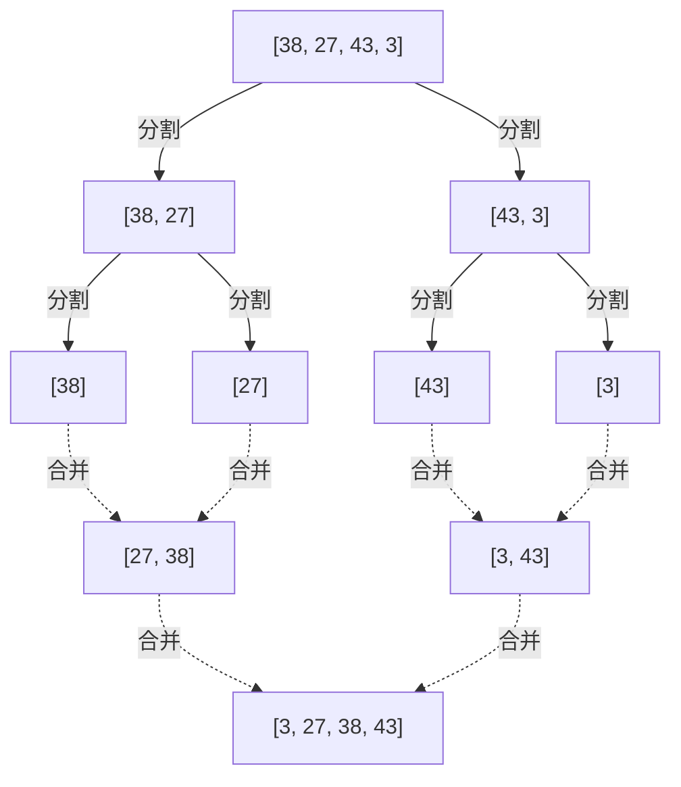
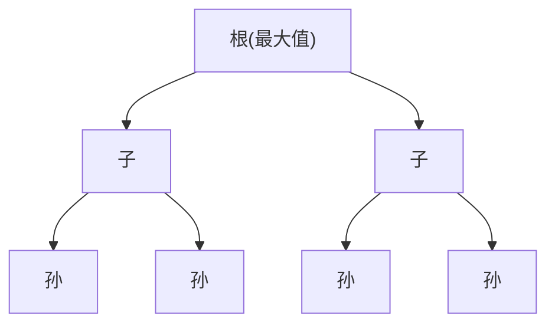

+++
title = "排序算法完全指南：从冒泡排序到Timsort"
description = "编程中排序算法的完全解析。从基础到高级全面涵盖。"
slug = "sorting-algorithms"
date = "2026-09-21T01:50:00+09:00"
image = "eyecatch.jpg"
categories = ["programming", "algorithms", "computer-science"]
tags = ["sort", "python", "algorithm", "big-o"]
+++

# 排序算法完全指南：从冒泡排序到Timsort

算法和数据结构是计算机科学的根基，也是非常重要的主题。其中“排序”在搜索、数据分组、可视化等各种场景中都是必不可少的基础操作。本文将非常详细地解析从初学者学习的基础排序算法，到现代编程语言标准库中采用的高级排序算法，涵盖其原理、实现、复杂度以及应该在什么场景下使用。

## 1. 排序算法的基础知识

在学习排序算法之前，需要理解几个作为算法评价标准的关键概念。理解这些概念后，就能明确为什么会有这么多排序算法，以及在不同情况下应该选择哪一种。

### 1.1 稳定性 (Stability)

排序算法中的 **稳定性** (Stability) 是指，具有相同键值的元素在排序前后的相对顺序是否保持不变的性质。

例如，假设有一个包含学生考试分数和姓名的数据列表：
`[ (80分, "A同学"), (70分, "B同学"), (80分, "C同学") ]`
当按分数升序排序时，如果是稳定的排序算法，必然会得到如下结果：
`[ (70分, "B同学"), (80分, "A同学"), (80分, "C同学") ]`
因为原本 "A同学" 在 "C同学" 前面，所以即使都是 80 分，"A同学" 也会排在前面。这就是 **稳定的排序** (Stable Sort)。

相反，在不稳定的排序算法中，这个顺序可能会发生反转，变成 `(80分, "C同学"), (80分, "A同学")`。稳定性在对多个键进行多次排序时（例如：先按姓名排序，再按分数排序）非常重要。

### 1.2 In-place 与 Out-of-place

这是表示算法在运行时需要多少额外内存的分类。

*   **In-place (原地)** : 在进行排序时直接修改输入数组本身，只需使用常数大小 ($O(1)$) 或对数大小 ($O(\log n)$) 的额外内存来进行元素交换等操作的算法。在内存限制严格的环境中非常有用。
*   **Out-of-place (非原地)** : 为了排序，除了输入数组之外，还需要与输入规模成正比（例如 $O(n)$）的额外内存空间的算法。

### 1.3 复杂度与 Big O 记号

为了表示算法的效率，我们使用渐进记号 **Big O Notation** (大O符号)。
在排序算法中主要评估 **时间复杂度** (执行时间) 和 **空间复杂度** (内存使用量)。

*   $O(1)$: 常数时间。无论数据量多少，时间始终不变。
*   $O(n)$: 线性时间。与数据量成正比增加。
*   $O(n \log n)$: 线性对数时间。基于比较的排序算法在理论上的最快速度。
*   $O(n^2)$: 平方时间。数据量增加 2 倍，时间会增加 4 倍，不适合大规模数据。

在基于比较的排序算法（通过比较元素大小来进行排序的方法）中，数学上已经证明了最坏复杂度的下界是 $O(n \log n)$。

$$
\text{比较排序的下界} = \Omega(n \log n)
$$

---

## 2. $O(n^2)$ 的算法：基础与直观的方法

首先介绍的是计算复杂度为 $O(n^2)$ 的基础算法群。虽然它们对于大规模数据集来说实用性较低，但实现非常直观且简单，是学习算法基础的优秀教材。此外，当数据规模极小，或者数据几乎已经有序时，它们有时比复杂的算法运行得更快。

### 2.1 冒泡排序 (Bubble Sort)

冒泡排序是最著名也是最简单的排序算法之一。它比较相邻的两个元素，如果顺序相反就交换它们，一直进行到数组末尾。这个过程会不断重复，直到整个数组排序完成。在每次遍历结束时，最大（或最小）的元素会像气泡一样“浮”到数组的一端，因此得名冒泡排序。

#### 冒泡排序的原理

1. 从数组开头按顺序比较相邻的元素（`arr[i]` 和 `arr[i+1]`）。
2. 如果左边的元素大于右边的元素，则交换 (Swap) 它们。
3. 将此操作重复到数组末尾，数组的最大值就会移动到最右侧。
4. 在下一次遍历中，除了最右侧的元素外，再次从步骤 1 开始重复。
5. 当没有任何交换发生时，判断数组已完全排序并结束。

#### 时间・空间复杂度与特征

*   **最坏时间复杂度**: $O(n^2)$ （当数组按逆序排列时）
*   **平均时间复杂度**: $O(n^2)$
*   **最好时间复杂度**: $O(n)$ （已经排好序，并且使用了优化标志的情况）
*   **空间复杂度**: $O(1)$ （In-place）
*   **稳定性**: 稳定 (Stable)

因为只进行相邻元素的交换，所以具有相同值的元素不会相互超越，是一个稳定的算法。

#### Python 实现代码

```python
def bubble_sort(arr):
    n = len(arr)
    # 执行 n 次遍历
    for i in range(n):
        # 用于提前结束的标志
        swapped = False
        
        # 忽略已经排好序的后半部分 (i 个)
        for j in range(0, n - i - 1):
            # 如果左边的元素比右边大，则交换
            if arr[j] > arr[j + 1]:
                arr[j], arr[j + 1] = arr[j + 1], arr[j]
                swapped = True
                
        # 如果在这次遍历中没有发生任何交换，说明已经排序完成
        if not swapped:
            break
            
    return arr
```

#### 逐步追踪

让我们看看使用冒泡排序将数组 `[5, 3, 8, 4, 2]` 按升序排列的过程。

*   **遍历 1**:
    *   比较 (5, 3) $\rightarrow$ 交换: `[3, 5, 8, 4, 2]`
    *   比较 (5, 8) $\rightarrow$ 保持: `[3, 5, 8, 4, 2]`
    *   比较 (8, 4) $\rightarrow$ 交换: `[3, 5, 4, 8, 2]`
    *   比较 (8, 2) $\rightarrow$ 交换: `[3, 5, 4, 2, 8]` (8 被确定)
*   **遍历 2**:
    *   比较 (3, 5) $\rightarrow$ 保持: `[3, 5, 4, 2, 8]`
    *   比较 (5, 4) $\rightarrow$ 交换: `[3, 4, 5, 2, 8]`
    *   比较 (5, 2) $\rightarrow$ 交换: `[3, 4, 2, 5, 8]` (5 被确定)
*   **遍历 3**:
    *   比较 (3, 4) $\rightarrow$ 保持: `[3, 4, 2, 5, 8]`
    *   比较 (4, 2) $\rightarrow$ 交换: `[3, 2, 4, 5, 8]` (4 被确定)
*   **遍历 4**:
    *   比较 (3, 2) $\rightarrow$ 交换: `[2, 3, 4, 5, 8]` (3 被确定，自动地 2 也被确定)

### 2.2 选择排序 (Selection Sort)

选择排序将数组分为“已排序部分”和“未排序部分”，从未排序部分中寻找最小（或最大）的元素，并将其与未排序部分的开头元素进行交换，不断重复此操作的算法。

#### 选择排序的原理

1. 初始时，整个数组都是未排序部分。
2. 从未排序部分中找到最小的值。
3. 将该最小值与未排序部分的第一个元素进行交换。
4. 这样一来，开头的元素就被包含在了已排序部分，未排序部分减少 1 个。
5. 重复此操作直到未排序部分为空。

#### 时间・空间复杂度与特征

*   **最坏时间复杂度**: $O(n^2)$
*   **平均时间复杂度**: $O(n^2)$
*   **最好时间复杂度**: $O(n^2)$
*   **空间复杂度**: $O(1)$ （In-place）
*   **稳定性**: 不稳定 (Unstable)

选择排序无论数据的排列顺序如何，都会始终扫描到底以寻找最小值，因此即使在最好情况下也需要 $O(n^2)$。此外，因为会与距离较远的元素进行交换，所以是不稳定的。

#### Python 实现代码

```python
def selection_sort(arr):
    n = len(arr)
    
    # 遍历整个数组
    for i in range(n):
        # 假设当前位置是最小值的索引
        min_idx = i
        
        # 从剩余的未排序部分寻找真正的最小值
        for j in range(i + 1, n):
            if arr[j] < arr[min_idx]:
                min_idx = j
                
        # 找到最小值后，与当前位置 (i) 进行交换
        arr[i], arr[min_idx] = arr[min_idx], arr[i]
        
    return arr
```

#### 逐步追踪

对数组 `[29, 10, 14, 37, 13]` 进行选择排序。

*   **i = 0**: 寻找最小值 `[29, 10, 14, 37, 13]` $\rightarrow$ 最小值为 10。交换 29 和 10。
    结果: `[10, 29, 14, 37, 13]` (10 被确定)
*   **i = 1**: 在剩余的 `[29, 14, 37, 13]` 中寻找最小值 $\rightarrow$ 最小值为 13。交换 29 和 13。
    结果: `[10, 13, 14, 37, 29]` (13 被确定)
*   **i = 2**: 在剩余的 `[14, 37, 29]` 中寻找最小值 $\rightarrow$ 最小值为 14。保持不变 (自我交换)。
    结果: `[10, 13, 14, 37, 29]` (14 被确定)
*   **i = 3**: 在剩余的 `[37, 29]` 中寻找最小值 $\rightarrow$ 最小值为 29。交换 37 和 29。
    结果: `[10, 13, 14, 29, 37]` (29 被确定，自动地 37 也被确定)

### 2.3 插入排序 (Insertion Sort)

插入排序与我们拿扑克牌理牌时常用的直观方法非常相似。它从未排序部分取出一个元素，并将其插入到已排序部分中正确的位置的算法。

#### 插入排序的原理

1. 认为数组的第一个元素（索引为 0）已经排好序。
2. 取出下一个元素（索引为 1）（记为 `key`），与已排序部分（左侧）的元素从后往前逐个比较。
3. 如果有大于 `key` 的元素，则将该元素向右移动一位。
4. 找到 `key` 应该插入的正确位置后，将 `key` 放在那里。
5. 将此操作重复到数组末尾。

#### 时间・空间复杂度与特征

*   **最坏时间复杂度**: $O(n^2)$ （按逆序排列时）
*   **平均时间复杂度**: $O(n^2)$
*   **最好时间复杂度**: $O(n)$ （几乎已排序时）
*   **空间复杂度**: $O(1)$ （In-place）
*   **稳定性**: 稳定 (Stable)

插入排序最大的优势在于， **当数据已经排好序（或接近排好序）时，比较和移动的次数可以减到最少，因此能以接近 $O(n)$ 的速度非常快地运行** 。这一特性在后文提到的 Timsort 等混合算法中得到了充分利用。

#### Python 实现代码

```python
def insertion_sort(arr):
    # 从索引 1 开始 (认为第 0 个元素已经排好序)
    for i in range(1, len(arr)):
        key = arr[i]
        j = i - 1
        
        # 从后往前扫描已排序部分，将大于 key 的元素向右移
        while j >= 0 and key < arr[j]:
            arr[j + 1] = arr[j]
            j -= 1
            
        # 将 key 插入到空出的正确位置
        arr[j + 1] = key
        
    return arr
```

#### 逐步追踪

对数组 `[12, 11, 13, 5, 6]` 进行插入排序。

*   **i = 1 (key = 11)**: 与左边的 12 比较。因为 12 > 11，将 12 向右移动，把 11 插入到空出的位置。
    结果: `[11, 12, 13, 5, 6]`
*   **i = 2 (key = 13)**: 与左边的 12 比较。因为 12 < 13，不需要移动。保持不变。
    结果: `[11, 12, 13, 5, 6]`
*   **i = 3 (key = 5)**: 依次比较 13, 12, 11，都大于 5，所以全部向右移动。将 5 插入到最左边。
    结果: `[5, 11, 12, 13, 6]`
*   **i = 4 (key = 6)**: 依次比较 13, 12, 11 并向右移动。因为 5 < 6，将 6 插入到 5 的右边。
    结果: `[5, 6, 11, 12, 13]`

---

## 3. $O(n \log n)$ 的算法：分治法与压倒性的效率

当数据量 $n$ 变大时，$O(n^2)$ 算法的计算时间会呈爆炸式增长，变得不再实用。于是就出现了使用 **分治法** (Divide and Conquer) 等高级技巧的算法，将数组分割并递归处理。它们达到了基于比较的排序算法的理论极限 $O(n \log n)$，对大规模数据表现出压倒性的性能。

### 3.1 归并排序 (Merge Sort)

归并排序是由约翰·冯·诺伊曼于 1945 年发明的，优美且坚固的算法。它是“分治法”的典型代表，采取将数组对半分割再对半分割直到元素只有 1 个，然后在排序的同时进行“合并 (Merge)”的方法。

#### 归并排序的原理

1. **分割 (Divide)**: 将给定的数组从中间分成两个子数组。递归地重复这一过程，直到子数组的长度为 1（长度为 1 的数组可以认为是已经排好序的状态）。
2. **治理与合并 (Conquer and Combine)**: 比较两个已排序子数组的首元素，将较小的一方放入新数组中。重复此操作，直到合并成原来那一个数组。



#### 时间・空间复杂度与特征

*   **最坏・平均・最好时间复杂度**: 均为 $O(n \log n)$
    *   因为总是对半分割，分割的深度为 $\log_2 n$。每一层的合并处理总体需要 $O(n)$ 的时间，相乘即得到 $O(n \log n)$。由于无论数据状态如何复杂度都固定，因此非常易于预测且非常可靠。
*   **空间复杂度**: $O(n)$ （Out-of-place）
    *   最大的弱点是在合并时需要一个与原数组大小相同的工作数组。
*   **稳定性**: 稳定 (Stable)
    *   在合并时如果值相同，通过优先取出左侧数组的元素就能保持稳定性。

#### Python 实现代码

```python
def merge_sort(arr):
    # 当数组长度小于等于 1 时，认为已排序并返回
    if len(arr) <= 1:
        return arr
        
    # 1. 分割: 计算中间的索引
    mid = len(arr) // 2
    left_half = arr[:mid]
    right_half = arr[mid:]
    
    # 递归地对左右两半进行排序
    left_sorted = merge_sort(left_half)
    right_sorted = merge_sort(right_half)
    
    # 2. 合并: 将已排序的左右数组合并起来
    return merge(left_sorted, right_sorted)

def merge(left, right):
    result = []
    i = j = 0
    
    # 当两个数组中都还有元素时
    while i < len(left) and j < len(right):
        if left[i] <= right[j]:  # 为了保持稳定性使用 <=
            result.append(left[i])
            i += 1
        else:
            result.append(right[j])
            j += 1
            
    # 追加剩余的元素
    result.extend(left[i:])
    result.extend(right[j:])
    
    return result
```

### 3.2 快速排序 (Quick Sort)

托尼·霍尔发明的快速排序，正如其名，是在现实世界中大多能发挥最快速度的优秀算法。与归并排序一样使用了分治法，但思路有所不同。它会选择一个基准元素 ( **基准 (Pivot)** )，将数据划分为比基准小的一组和比基准大的一组，以此推进排序。

#### 快速排序的原理

1. **选择基准**: 从数组中选择一个元素作为基准值 (Pivot)。
2. **划分 (Partition)**: 将小于基准的元素集中到左边，大于基准的元素集中到右边。该操作结束后，基准自身的最终排序位置就被确定了。
3. **递归处理**: 对基准左边的数组和右边的数组，递归地重复相同的处理。

根据基准的选择方法和划分方法（Hoare 方案、Lomuto 方案），性能会有很大差异。

#### 时间・空间复杂度与特征

*   **最坏时间复杂度**: $O(n^2)$
    *   这是它致命的弱点。对于已经排好序的数组，如果总是选择两端的元素作为基准，数组就会持续被划分为“1个”和“剩余全部”，陷入最坏复杂度。为了避免这种情况，“三数取中（取首、中、尾的中位数）”等选择基准的优化手段是必不可少的。
*   **平均时间复杂度**: $O(n \log n)$
    *   实际上其常数系数非常小，且缓存效率极高，因此运行速度比归并排序和堆排序都要快。
*   **空间复杂度**: 平均 $O(\log n)$，最坏 $O(n)$
    *   虽然是直接修改数组的 In-place 算法，但会消耗用于递归调用的调用栈。
*   **稳定性**: 不稳定 (Unstable)
    *   在划分操作中会发生远距离元素的交换，所以不稳定。

#### Python 实现代码 (易懂的列表推导式版)

这种方法内存效率不高，但最直接地表达了算法的意图。

```python
def quick_sort_simple(arr):
    if len(arr) <= 1:
        return arr
    
    # 选择中间的元素作为基准
    pivot = arr[len(arr) // 2]
    
    # 划分为小于、等于、大于基准的 3 个列表
    left = [x for x in arr if x < pivot]
    middle = [x for x in arr if x == pivot]
    right = [x for x in arr if x > pivot]
    
    # 递归地结合起来
    return quick_sort_simple(left) + middle + quick_sort_simple(right)
```

#### Python 实现代码 (In-place Lomuto 划分方案版)

这是实际的库中经常使用的，不消耗额外内存的 In-place 实现。

```python
def quick_sort_inplace(arr, low, high):
    if low < high:
        # 进行分区划分，并获取基准的正确位置
        pi = partition(arr, low, high)
        
        # 递归地对基准的左右进行排序
        quick_sort_inplace(arr, low, pi - 1)
        quick_sort_inplace(arr, pi + 1, high)

def partition(arr, low, high):
    # 选择末尾的元素作为基准 (Lomuto 方案)
    pivot = arr[high]
    
    # i 指向比基准小的元素的最后一个索引
    i = low - 1
    
    for j in range(low, high):
        # 如果当前元素小于等于基准，则让 i 前进并交换
        if arr[j] <= pivot:
            i = i + 1
            arr[i], arr[j] = arr[j], arr[i]
            
    # 将基准插入到正确的位置 (i+1)
    arr[i + 1], arr[high] = arr[high], arr[i + 1]
    
    return i + 1
```

### 3.3 堆排序 (Heap Sort)

堆排序是巧妙利用了一种名为 **二叉堆 (Binary Heap)** 的树形数据结构的排序算法。它的最坏时间复杂度是 $O(n \log n)$，同时又是不使用额外内存的 In-place 排序，可以说是结合了归并排序和快速排序优点的特性。

#### 堆排序的原理

1. **构建堆**: 首先，将给定的数组转换为“最大堆 (Max Heap)”。最大堆是指满足“父节点的值必然大于等于子节点的值”规则的完全二叉树。在数组上通过索引计算（父：$(i-1)/2$，左子：$2i+1$，右子：$2i+2$），就可以直接在数组中表达树的结构。
2. **提取最大值并重建**: 最大堆的根（数组开头 `arr[0]`）必然存在最大值。将这个最大值与数组末尾的元素进行交换。由此，最大值就被固定在了数组的最后位置。
3. 因为根节点被替换，破坏了堆的条件，所以在排除了堆尾（已确定部分）的范围内进行“堆的重建 (Heapify)”，使其再次满足最大堆的条件。
4. 重复此操作直到元素只剩下 1 个，较大的值会从数组后方开始依次确定，最终按升序排列完成。



#### 时间・空间复杂度与特征

*   **最坏・平均・最好时间复杂度**: 均为 $O(n \log n)$
    *   构建堆需要 $O(n)$，提取最大值并重建（$O(\log n)$）重复 $n$ 次，所以整体为 $O(n \log n)$。由于无论数据排列如何都能保证这个复杂度，因此在需要避免最坏情况的系统中非常有用。
*   **空间复杂度**: $O(1)$ （In-place）
    *   由于直接在数组上表达堆树结构，因此不需要额外的内存。
*   **稳定性**: 不稳定 (Unstable)
    *   在构建堆和提取的过程中会交换相隔较远的元素，所以不稳定。

#### Python 实现代码

```python
def heapify(arr, n, i):
    largest = i          # 假设根是最大值
    left = 2 * i + 1     # 左子节点
    right = 2 * i + 2    # 右子节点

    # 如果左子节点大于根
    if left < n and arr[left] > arr[largest]:
        largest = left

    # 如果右子节点大于当前的最大值
    if right < n and arr[right] > arr[largest]:
        largest = right

    # 如果根不是最大值，交换并递归地使其成为堆
    if largest != i:
        arr[i], arr[largest] = arr[largest], arr[i]
        heapify(arr, n, largest)

def heap_sort(arr):
    n = len(arr)

    # 1. 构建最大堆 (自底向上构建)
    # 从最后一个非叶子节点向根方向进行堆化
    for i in range(n // 2 - 1, -1, -1):
        heapify(arr, n, i)

    # 2. 逐个提取元素并排序
    for i in range(n - 1, 0, -1):
        # 将当前的根 (最大值) 与未排序部分的末尾交换
        arr[i], arr[0] = arr[0], arr[i]
        
        # 针对缩小了尺寸的新堆进行重建
        heapify(arr, i, 0)
        
    return arr
```

---

## 4. $O(n)$ 的非比较排序：超越比较极限

目前为止看到的排序算法，都是使用比较运算符（`<`, `>`, `==`）来判断元素大小关系的“基于比较的排序”。数学上已经证明，基于比较的排序不可能比 $O(n \log n)$ 更快。

但是，如果巧妙利用数据的性质（例如是整数、位数固定、范围较窄等），采用完全不进行“比较”的特殊算法，就能实现线性时间 $O(n)$ 的超高速排序。

### 4.1 计数排序 (Counting Sort)

计数排序是通过“计算”数据中特定键值存在多少个，来算出元素正确位置的算法。主要是对 0 到特定最大值 $k$ 这个较窄范围内的整数进行排序时，能发挥出戏剧性的效果。

#### 时间・空间复杂度
*   **时间复杂度**: $O(n + k)$。依赖于数据量 $n$ 和值的范围 $k$。如果 $k$ 和 $n$ 差不多，就是 $O(n)$；但如果 $k$ 非常大（例如：只有 1 和 10亿 的数组），则会极其低效。
*   **空间复杂度**: $O(n + k)$。需要用于计数的数组和输出的数组。

#### Python 实现的示意
```python
def counting_sort(arr):
    if not arr:
        return arr
        
    max_val = max(arr)
    # 将计数用的数组初始化为 0
    count = [0] * (max_val + 1)
    
    # 1. 计算各元素的出现次数
    for num in arr:
        count[num] += 1
        
    # 2. 计算累加和 (为了确定元素的最终位置)
    for i in range(1, len(count)):
        count[i] += count[i - 1]
        
    # 3. 生成输出数组 (为了保持稳定性从后往前扫描)
    output = [0] * len(arr)
    for num in reversed(arr):
        output[count[num] - 1] = num
        count[num] -= 1
        
    return output
```

### 4.2 基数排序 (Radix Sort)

克服了计数排序“值的范围太广就无法使用”弱点的，就是基数排序。将数字按照“个位”、“十位”、“百位”，从低位开始依次（LSD: Least Significant Digit）应用稳定的排序（内部通常使用计数排序），从而完成整体排序。它也可应用于字符串排序等场景。

### 4.3 桶排序 (Bucket Sort)

桶排序将数据的可能范围划分为大小均匀的“桶”，并将各个数据放入对应的桶中。然后，在各个桶内分别进行排序（通常使用插入排序等），最后按顺序合并所有桶中的内容即告完成。如果数据在特定范围内均匀分布，平均能以 $O(n)$ 的极快速度运行。

---

## 5. 统治现代实战领域的混合算法

在学术教科书中通常只涵盖到快速排序或归并排序，但在现代编程语言的底层实际运行的，是结合了多种算法优点的 **混合算法** 。

### 5.1 Timsort (Python的默认排序)

Timsort 是由 Tim Peters 在 2002 年为 Python 实现的算法。现在不仅是 Python 的 `list.sort()` 和 `sorted()`，在 Java 的对象数组、Rust 的标准排序等众多语言中也都被采用，是实战领域的霸主。

Timsort 最大的设计理念是基于一个经验法则： **“现实世界的数据很少是完全随机的，大部分情况下是部分有序的（存在连续的升序或降序块）”** 。

#### Timsort 的特征
*   **归并排序与插入排序的融合**: 将数组分割成一定大小（通常是 32〜64 个元素左右）的块（Chunk），分别用插入排序进行快速排序。然后，像归并排序那样将它们合并起来。
*   **利用游程 (Run)**: 扫描数组，检测从一开始就连续呈升序（或降序）的部分（这被称为 "Run"）。如果是降序则将其翻转为升序，并把它们作为合并的单位加以利用。
*   **自适应的 (Adaptive) 复杂度**: 对于完全随机的数据，它能保证最坏 $O(n \log n)$ 的性能；而对于已经排好序或部分排好序的数据，它能创造出最快 $O(n)$ 这种令人难以置信的速度。
*   **稳定性**: 是稳定的算法。

### 5.2 Introsort (C++ `std::sort`)

内省排序 (Introspective Sort) 被采用在 C++ 的 STL `std::sort`，以及 .NET (C#) 的标准排序中。

快速排序虽然在平均情况下最快，但由于基准的选择，存在可能陷入最坏 $O(n^2)$ 的致命弱点。Introsort 是完全克服了这一弱点的混合方法。

#### Introsort 的特征
1. 基本上使用高速的 **快速排序** 来分割数组。
2. 但是，它会监视递归的深度，如果分割深度超过了 $\log_2 n$ 的常数倍（例: $2 \times \log_2 n$），就会判断“基准的选择不够理想，快要陷入最坏复杂度了”（Introspection：自我内省）。
3. 此时，它会将该子数组的排序方法切换为最坏复杂度也是 $O(n \log n)$ 的 **堆排序** 。
4. 另外，当元素数量变得非常少时（例: 16 个元素以下），为了避免函数调用的开销，会切换到 **插入排序** 。

这样一来，它在维持了快速排序压倒性的平均速度的同时，保证了最坏情况下也有 $O(n \log n)$ 的表现，实现了一种无懈可击的算法。

---

## 6. 综合比较表格汇总

本文讲解的主要排序算法的性能，已汇总为下表。

| 算法 (Algorithm) | 最好时间复杂度 (Best Time) | 平均时间复杂度 (Avg Time) | 最坏时间复杂度 (Worst Time) | 空间复杂度 (Space) | 稳定性 (Stability) | 方法・特征 |
| :--- | :--- | :--- | :--- | :--- | :--- | :--- |
| **冒泡排序 (Bubble Sort)** | $O(n)$ | $O(n^2)$ | $O(n^2)$ | $O(1)$ | Yes | 交换。教学用。实用性低。 |
| **选择排序 (Selection Sort)** | $O(n^2)$ | $O(n^2)$ | $O(n^2)$ | $O(1)$ | No | 选择。始终需要全盘扫描。 |
| **插入排序 (Insertion Sort)** | $O(n)$ | $O(n^2)$ | $O(n^2)$ | $O(1)$ | Yes | 插入。对几乎排好序的数据极强。 |
| **归并排序 (Merge Sort)** | $O(n \log n)$ | $O(n \log n)$ | $O(n \log n)$ | $O(n)$ | Yes | 分治法。复杂度坚固但耗内存。 |
| **快速排序 (Quick Sort)** | $O(n \log n)$ | $O(n \log n)$ | $O(n^2)$ | $O(\log n)$ | No | 分治法。平均最快但要注意最坏情况。 |
| **堆排序 (Heap Sort)** | $O(n \log n)$ | $O(n \log n)$ | $O(n \log n)$ | $O(1)$ | No | 二叉堆。In-place 且坚固。 |
| **计数排序 (Counting Sort)** | $O(n+k)$ | $O(n+k)$ | $O(n+k)$ | $O(k)$ | Yes | 非比较。键范围窄时最强。 |
| **Timsort** (Python等标准) | $O(n)$ | $O(n \log n)$ | $O(n \log n)$ | $O(n)$ | Yes | 混合。对实际数据自适应且最快。 |
| **Introsort** (C++等标准) | $O(n \log n)$ | $O(n \log n)$ | $O(n \log n)$ | $O(\log n)$ | No | 混合。兼顾 Quick 的速度与 Heap 的坚固。 |

---

## 7. 结论：最终到底该用哪一个？

至此我们已经解说了众多数的排序算法，但在实际的软件开发中，有一个明确的答案。

 **“基本上，使用语言内置的标准排序函数”** 

仅此而已。Python 的 `.sort()` 或 C++ 的 `std::sort`，都是由本文介绍的 Timsort 或 Introsort 等高级混合算法实现的，并且经过了无数次的优化（提升内存缓存效率、分支预测优化等）。自己手写的快速排序几乎不可能胜过标准库的速度。

但是，那为什么还需要学习排序算法呢？

1. **理解基础概念**: 复杂度（Big O Notation）、In-place/Out-of-place、稳定性等概念，不只是排序，更是所有算法设计和数据结构设计的基础。
2. **特殊限制下的系统**: 在嵌入式系统等内存受到极大限制的环境中，可能需要自己实现 $O(1)$ 空间的堆排序或 In-place 的快速排序。
3. **利用数据的性质**: 如果要对“值的范围被限制在 1〜100 内的 100 万条数据”进行排序，自己实现一个计数排序（$O(n)$）会比使用标准的 Timsort（$O(n \log n)$）快上非常多。

通过了解算法的内部结构，就能理解作为黑盒提供的标准函数“擅长做什么”和“不擅长做什么”，从而能够进行更加高级和高效的系统设计。

请务必试着在手边运行一下本文的 Python 代码，尝试改变数据量、传入逆序的数据，亲身去体验每种算法的运行方式和执行时间吧！
