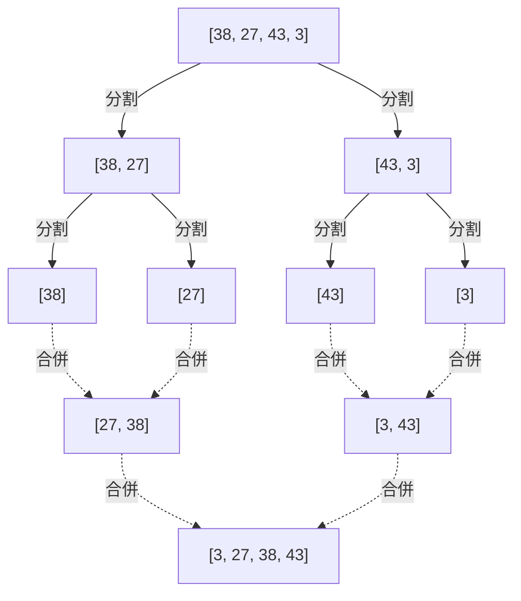
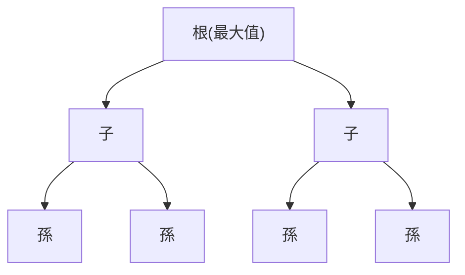

+++
title = "排序演算法完整指南：從氣泡排序到 Timsort"
description = "程式設計中排序演算法的完整解說。涵蓋從基礎到進階的內容。"
slug = "sorting-algorithms"
date = "2026-09-21T01:50:00+09:00"
image = "eyecatch.jpg"
categories = ["programming", "algorithms", "computer-science"]
tags = ["sort", "python", "algorithm", "big-o"]
+++

# 排序演算法完整指南：從氣泡排序到 Timsort

演算法與資料結構是構成計算機科學根基的非常重要的主題。在其中，「排序（並排）」是在搜尋、資料分組、視覺化等所有場合都必須的基礎操作。本篇文章將從初學者學習的基礎排序演算法，到現代程式語言的標準函式庫中所採用的進階排序演算法，針對其運作原理、實作、時間複雜度，以及應該在什麼場合使用，進行非常詳細的解說。

## 1. 排序演算法的基礎知識

在學習排序演算法之前，有必要先了解幾個作為演算法評估標準的重要概念。只要理解了這些，就能明確知道為什麼存在這麼多種排序演算法，以及應該根據情況選擇哪一種。

### 1.1 穩定性 (Stability)

排序演算法中的 **穩定性** （Stability）是指，具有相同排序鍵值的元素之間，在排序前後是否會保留其相對順序的特性。

例如，假設有一個包含學生考試分數與名字的資料列表：
`[ (80分, "A同學"), (70分, "B同學"), (80分, "C同學") ]`
當以此分數遞增排序時，如果是穩定的排序演算法，必然會變成以下結果：
`[ (70分, "B同學"), (80分, "A同學"), (80分, "C同學") ]`
因為原本 "A同學" 就在 "C同學" 前面，所以同樣是 80 分，"A同學" 也會被排在前面。這就是 **穩定的排序** (Stable Sort)。

另一方面，在不穩定的排序演算法中，這個順序有可能會顛倒變成 `(80分, "C同學"), (80分, "A同學")`。穩定性在需要根據多個鍵值進行多次排序時（例如：先以名字排序，接著以分數排序）會變得非常重要。

### 1.2 In-place 與 Out-of-place

這是表示演算法在執行時需要多少額外記憶體的分類。

*   **In-place (原地排序) **：在進行排序時直接改寫輸入陣列本身，只在元素交換等操作時需要常數大小 ($O(1)$) 或對數大小 ($O(\log n)$) 的額外記憶體的演算法。在記憶體限制嚴格的環境中非常實用。
*   **Out-of-place (非原地排序) **：除了輸入陣列之外，還需要與輸入大小成正比（例如 $O(n)$）的額外記憶體空間來進行排序的演算法。

### 1.3 時間複雜度與 Big O 記號

為了表示演算法的效率，我們會使用漸進記號 **Big O Notation** （大O記號）。
在排序演算法中主要會評估 **時間複雜度** （執行時間）與 **空間複雜度** （記憶體使用量）。

*   $O(1)$：常數時間。不依賴資料量，始終保持一定。
*   $O(n)$：線性時間。與資料量成正比增加。
*   $O(n \log n)$：線性對數時間。在基於比較的排序演算法中理論上的最高速度。
*   $O(n^2)$：平方時間。當資料量變成 2 倍時，時間會變成 4 倍，不適合處理大規模資料。

在基於比較的排序演算法（透過比較元素彼此的大小來重新排列的方法）中，已經在數學上證明了最壞時間複雜度的下界為 $O(n \log n)$。

$$
\text{比較排序的下界} = \Omega(n \log n)
$$

---

## 2. $O(n^2)$ 的演算法：基礎與直觀的方法

首先介紹的是時間複雜度為 $O(n^2)$ 的基本演算法群。這些演算法雖然對大規模資料集來說實用性不高，但實作直觀且非常簡單，是學習演算法基礎的優秀教材。此外，在資料規模極端小的情況，或是對於幾乎已經排好序的資料，它們有時會比複雜的演算法運作得更快。

### 2.1 氣泡排序 (Bubble Sort)

氣泡排序是最有名且最簡單的排序演算法之一。比較相鄰的 2 個元素，如果順序相反就交換，這個操作會一直進行到陣列末端。會一直重複這個過程，直到整個陣列都排好序為止。在每次遍歷結束時，最大（或最小）的元素會像「浮現」一樣移動到陣列的邊緣，因此被稱為氣泡排序。

#### 氣泡排序的運作原理

1. 從陣列的開頭依序比較相鄰的元素（`arr[i]` 與 `arr[i+1]`）。
2. 如果左邊的元素大於右邊的元素，就將兩者交換 (Swap)。
3. 將此操作重複到陣列末端後，陣列的最大值會移動到最右側。
4. 在下一次遍歷時，除了最右側的元素外，再次從 1 開始重複。
5. 在一次都沒有發生交換的時間點，就會判斷陣列已經完全排序好並結束。

#### 時間與空間複雜度及特徵

*   **最壞時間複雜度** ：$O(n^2)$ （當陣列為逆序排列時）
*   **平均時間複雜度** ：$O(n^2)$
*   **最佳時間複雜度** ：$O(n)$ （當已經排序好，且使用了最佳化標記時）
*   **空間複雜度** ：$O(1)$ （In-place）
*   **穩定性** ：穩定 (Stable)

因為只會進行相鄰元素的交換，所以擁有相同值的元素不會互相超越，是一種穩定的演算法。

#### Python 實作程式碼

```python
def bubble_sort(arr):
    n = len(arr)
    # 執行 n 次的遍歷
    for i in range(n):
        # 用於提早結束的標記
        swapped = False
        
        # 忽略已經排序好的後方部分 (i 個)
        for j in range(0, n - i - 1):
            # 如果左邊的元素比右邊大就交換
            if arr[j] > arr[j + 1]:
                arr[j], arr[j + 1] = arr[j + 1], arr[j]
                swapped = True
                
        # 如果在這次遍歷中一次交換都沒有發生，代表已經排序完成
        if not swapped:
            break
            
    return arr
```

#### 逐步追蹤

讓我們來看看將陣列 `[5, 3, 8, 4, 2]` 用氣泡排序以遞增順序排列的過程。

*   **遍歷 1**：
    *   比較 (5, 3) $\rightarrow$ 交換：`[3, 5, 8, 4, 2]`
    *   比較 (5, 8) $\rightarrow$ 維持：`[3, 5, 8, 4, 2]`
    *   比較 (8, 4) $\rightarrow$ 交換：`[3, 5, 4, 8, 2]`
    *   比較 (8, 2) $\rightarrow$ 交換：`[3, 5, 4, 2, 8]` (8 已確定)
*   **遍歷 2**：
    *   比較 (3, 5) $\rightarrow$ 維持：`[3, 5, 4, 2, 8]`
    *   比較 (5, 4) $\rightarrow$ 交換：`[3, 4, 5, 2, 8]`
    *   比較 (5, 2) $\rightarrow$ 交換：`[3, 4, 2, 5, 8]` (5 已確定)
*   **遍歷 3**：
    *   比較 (3, 4) $\rightarrow$ 維持：`[3, 4, 2, 5, 8]`
    *   比較 (4, 2) $\rightarrow$ 交換：`[3, 2, 4, 5, 8]` (4 已確定)
*   **遍歷 4**：
    *   比較 (3, 2) $\rightarrow$ 交換：`[2, 3, 4, 5, 8]` (3 已確定，同時 2 也自動確定)

### 2.2 選擇排序 (Selection Sort)

選擇排序是將陣列分為「已排序部分」與「未排序部分」，從未排序部分中尋找最小（或最大）的元素，並與未排序部分的首個元素交換，重複此操作的演算法。

#### 選擇排序的運作原理

1. 一開始整個陣列都是未排序部分。
2. 從未排序部分中尋找最小值。
3. 將該最小值與未排序部分的首個元素交換。
4. 這樣首個元素就會被包含在已排序部分中，而未排序部分會減少 1 個。
5. 重複此操作直到未排序部分消失為止。

#### 時間與空間複雜度及特徵

*   **最壞時間複雜度** ：$O(n^2)$
*   **平均時間複雜度** ：$O(n^2)$
*   **最佳時間複雜度** ：$O(n^2)$
*   **空間複雜度** ：$O(1)$ （In-place）
*   **穩定性** ：不穩定 (Unstable)

選擇排序不論資料的排列順序為何，始終會為了尋找最小值而掃描到最後，因此即使在最佳情況下也需要 $O(n^2)$ 的時間。此外，由於會與距離較遠的元素進行交換，因此並不穩定。

#### Python 實作程式碼

```python
def selection_sort(arr):
    n = len(arr)
    
    # 掃描整個陣列
    for i in range(n):
        # 假設目前的位置是最小值的索引
        min_idx = i
        
        # 從剩下的未排序部分尋找真正的最小值
        for j in range(i + 1, n):
            if arr[j] < arr[min_idx]:
                min_idx = j
                
        # 找到最小值後，與目前的位置 (i) 交換
        arr[i], arr[min_idx] = arr[min_idx], arr[i]
        
    return arr
```

#### 逐步追蹤

對陣列 `[29, 10, 14, 37, 13]` 進行選擇排序。

*   **i = 0**：尋找最小值 `[29, 10, 14, 37, 13]` $\rightarrow$ 最小值為 10。將 29 與 10 交換。
    結果：`[10, 29, 14, 37, 13]` (10 已確定)
*   **i = 1**：從剩餘的 `[29, 14, 37, 13]` 中尋找最小值 $\rightarrow$ 最小值為 13。將 29 與 13 交換。
    結果：`[10, 13, 14, 37, 29]` (13 已確定)
*   **i = 2**：從剩餘的 `[14, 37, 29]` 中尋找最小值 $\rightarrow$ 最小值為 14。保持原樣 (自我交換)。
    結果：`[10, 13, 14, 37, 29]` (14 已確定)
*   **i = 3**：從剩餘的 `[37, 29]` 中尋找最小值 $\rightarrow$ 最小值為 29。將 37 與 29 交換。
    結果：`[10, 13, 14, 29, 37]` (29 已確定，自動地 37 也確定)

### 2.3 插入排序 (Insertion Sort)

插入排序是我們在手拿撲克牌整理手牌時經常使用的直觀方法。從未排序部分取下 1 個元素，並將其插入到已經排序好的部分的正確位置中的演算法。

#### 插入排序的運作原理

1. 視陣列的第一個元素（索引 0）為已經排序完成。
2. 取出下一個元素（索引 1）（稱之為 `key`），並與已排序部分（左側）的元素由後往前依序比較。
3. 如果有比 `key` 大的元素，就將該元素向右移動 1 位。
4. 當找到 `key` 應該插入的正確位置後，將 `key` 放在那裡。
5. 將此過程重複到陣列末端。

#### 時間與空間複雜度及特徵

*   **最壞時間複雜度** ：$O(n^2)$ （當陣列為逆序排列時）
*   **平均時間複雜度** ：$O(n^2)$
*   **最佳時間複雜度** ：$O(n)$ （當資料幾乎已排序時）
*   **空間複雜度** ：$O(1)$ （In-place）
*   **穩定性** ：穩定 (Stable)

插入排序最大的優勢在於， **當資料已經排序好（或是接近此狀態）時，比較與移動次數可減到最少，能以接近 $O(n)$ 的速度極快地運作** 。這個特性在後續會提到的 Timsort 等混合演算法中被大量活用。

#### Python 實作程式碼

```python
def insertion_sort(arr):
    # 從索引 1 開始 (將第 0 個視為已排序)
    for i in range(1, len(arr)):
        key = arr[i]
        j = i - 1
        
        # 從後往前掃描已排序部分，將大於 key 的元素向右移
        while j >= 0 and key < arr[j]:
            arr[j + 1] = arr[j]
            j -= 1
            
        # 將 key 插入到空出的正確位置
        arr[j + 1] = key
        
    return arr
```

#### 逐步追蹤

對陣列 `[12, 11, 13, 5, 6]` 進行插入排序。

*   **i = 1 (key = 11)**：與左邊的 12 比較。12 > 11 所以將 12 向右移，並將 11 插入到空出的位置。
    結果：`[11, 12, 13, 5, 6]`
*   **i = 2 (key = 13)**：與左邊的 12 比較。12 < 13 所以不需要移動。保持原樣。
    結果：`[11, 12, 13, 5, 6]`
*   **i = 3 (key = 5)**：依序與 13、12、11 比較，由於全部都大於 5 所以全部向右移。將 5 插入到最左端。
    結果：`[5, 11, 12, 13, 6]`
*   **i = 4 (key = 6)**：依序與 13、12、11 比較並向右移。5 < 6 所以將 6 插入到 5 的右邊相鄰處。
    結果：`[5, 6, 11, 12, 13]`

---

## 3. $O(n \log n)$ 的演算法：分治法與壓倒性的效率

當資料量 $n$ 變大時，$O(n^2)$ 的演算法運算時間會呈爆炸性增長，變得難以實際應用。這時登場的就是採用了將陣列分割並遞迴處理的 **分治法** (Divide and Conquer) 等進階技巧的演算法。它們達到了基於比較的排序演算法的理論極限 $O(n \log n)$，對大規模資料展現出壓倒性的效能。

### 3.1 合併排序 (Merge Sort)

合併排序是由約翰·馮·諾伊曼在 1945 年發明的，是一個優美且穩健的演算法。它是「分治法」的代表範例，採用將陣列分成一半，再分成一半直到元素剩下 1 個為止，之後一邊排序一邊進行「合併」的方法。

#### 合併排序的運作原理

1.  **分割 (Divide)** ：將給定的陣列從中央分割成 2 個部分陣列。遞迴地重複此操作直到部分陣列的長度變為 1 (長度為 1 的陣列可視為已排序狀態)。
2.  **克服與合併 (Conquer and Combine)** ：將 2 個已排序的部分陣列的首個元素互相比較，將較小的放入新的陣列中。重複此操作，直到合併成原本的 1 個陣列。



#### 時間與空間複雜度及特徵

*   **最壞、平均、最佳時間複雜度**：全部都是 $O(n \log n)$
    *   因為總是分割成一半，所以分割的深度為 $\log_2 n$。每個階層的合併處理整體需要花費 $O(n)$ 的時間，所以相乘後得到 $O(n \log n)$。不論資料的狀態為何時間複雜度都固定，因此非常容易預測且穩健。
*   **空間複雜度** ：$O(n)$ （Out-of-place）
    *   在進行合併時，需要與原本陣列相同大小的作業用陣列是其最大的弱點。
*   **穩定性** ：穩定 (Stable)
    *   當合併時遇到相同值，只要優先取出左側陣列的元素就能維持穩定性。

#### Python 實作程式碼

```python
def merge_sort(arr):
    # 當陣列長度小於等於 1 時，視為已經排序完畢並回傳
    if len(arr) <= 1:
        return arr
        
    # 1. 分割: 計算中央的索引
    mid = len(arr) // 2
    left_half = arr[:mid]
    right_half = arr[mid:]
    
    # 遞迴地對左右進行排序
    left_sorted = merge_sort(left_half)
    right_sorted = merge_sort(right_half)
    
    # 2. 合併: 將已經排序好的左右陣列合併
    return merge(left_sorted, right_sorted)

def merge(left, right):
    result = []
    i = j = 0
    
    # 當兩個陣列都有剩餘元素時
    while i < len(left) and j < len(right):
        if left[i] <= right[j]:  # 為了穩定性使用 <=
            result.append(left[i])
            i += 1
        else:
            result.append(right[j])
            j += 1
            
    # 將剩餘的元素加入
    result.extend(left[i:])
    result.extend(right[j:])
    
    return result
```

### 3.2 快速排序 (Quick Sort)

由東尼·霍爾發明的快速排序，如同其名，是現實世界中最常表現出最高速運作的優秀演算法。與合併排序一樣使用了分治法，但方法不同。它會選擇一個作為基準的元素（ **樞紐** ），並將其分為比樞紐小的群組和比樞紐大的群組來進行排序。

#### 快速排序的運作原理

1.  **選擇樞紐** ：從陣列中選擇 1 個元素作為樞紐（基準值）。
2.  **劃分（分割）** ：將比樞紐小的元素集中到左邊，比樞紐大的元素集中到右邊。這個操作結束後，樞紐本身在排序後的最終位置就會確定。
3.  **遞迴處理** ：對樞紐左側的陣列與右側的陣列，遞迴地重複相同的處理。

根據樞紐的選擇方法與分割方法（Hoare 方式、Lomuto 方式），效能會有很大的改變。

#### 時間與空間複雜度及特徵

*   **最壞時間複雜度** ：$O(n^2)$
    *   這是致命的弱點。對於已經排序好的陣列，如果總是選擇邊緣的元素作為樞紐，陣列就會一直不平均地分割成「1個」和「剩下的全部」，而陷入最壞時間複雜度。為了避免這種情況，必須要使用諸如「三數取中（取開頭、中央、末端的中位數）」等選擇樞紐的技巧。
*   **平均時間複雜度** ：$O(n \log n)$
    *   實質上常數係數非常小，快取效率極佳，因此運作速度比合併排序和堆積排序還要快。
*   **空間複雜度** ：平均 $O(\log n)$，最壞 $O(n)$
    *   雖然是直接改寫陣列本身的 In-place 演算法，但會消耗用於遞迴呼叫的呼叫堆疊。
*   **穩定性** ：不穩定 (Unstable)
    *   由於在劃分操作中會進行相隔較遠的元素交換，所以並不穩定。

#### Python 實作程式碼 (易懂的串列綜合表達式版)

這種作法雖然記憶體效率不好，但最直接地表達了演算法的意圖。

```python
def quick_sort_simple(arr):
    if len(arr) <= 1:
        return arr
    
    # 選擇中央的元素作為樞紐
    pivot = arr[len(arr) // 2]
    
    # 分割為小於樞紐、等於樞紐、大於樞紐的 3 個列表
    left = [x for x in arr if x < pivot]
    middle = [x for x in arr if x == pivot]
    right = [x for x in arr if x > pivot]
    
    # 遞迴地結合
    return quick_sort_simple(left) + middle + quick_sort_simple(right)
```

#### Python 實作程式碼 (In-place Lomuto Partition Scheme 版)

這是在實際函式庫等會被使用的，不額外使用記憶體的 In-place 實作。

```python
def quick_sort_inplace(arr, low, high):
    if low < high:
        # 進行劃分分割，並取得樞紐的正確位置
        pi = partition(arr, low, high)
        
        # 對樞紐的左右遞迴地進行排序
        quick_sort_inplace(arr, low, pi - 1)
        quick_sort_inplace(arr, pi + 1, high)

def partition(arr, low, high):
    # 選擇末端的元素作為樞紐 (Lomuto 方式)
    pivot = arr[high]
    
    # i 指向小於樞紐的元素的最後一個索引
    i = low - 1
    
    for j in range(low, high):
        # 如果目前的元素小於等於樞紐，則推進 i 並交換
        if arr[j] <= pivot:
            i = i + 1
            arr[i], arr[j] = arr[j], arr[i]
            
    # 將樞紐插入到正確的位置 (i+1)
    arr[i + 1], arr[high] = arr[high], arr[i + 1]
    
    return i + 1
```

### 3.3 堆積排序 (Heap Sort)

堆積排序是巧妙利用被稱為 **二元堆積（Binary Heap）** 的樹狀資料結構的排序演算法。雖然最壞時間複雜度為 $O(n \log n)$，但卻是不使用額外記憶體的 In-place 排序，擁有了合併排序與快速排序兩者優點的特性。

#### 堆積排序的運作原理

1.  **建立堆積** ：首先將給定的陣列轉換為「最大堆積（Max Heap）」。最大堆積是指父節點的值必定大於等於子節點的值，滿足此規則的完整二元樹。在陣列上使用索引計算（父：$(i-1)/2$，左子：$2i+1$，右子：$2i+2$），就能直接以陣列來表現樹狀結構。
2.  **提取最大值與重建** ：最大堆積的根（陣列開頭 `arr[0]`）必定存在著最大值。將此最大值與陣列末端的元素交換。如此一來，最大值就會確定在陣列的最終位置。
3. 由於根被覆寫而破壞了堆積的條件，因此要在扣除堆積末端（已確定部分）的範圍內進行「堆積的重建（Heapify）」，使其再次滿足最大堆積的條件。
4. 將此操作重複到元素剩下 1 個為止，陣列就會從後面開始依序確定較大的值，最終完成遞增排序。



#### 時間與空間複雜度及特徵

*   **最壞、平均、最佳時間複雜度**：全部都是 $O(n \log n)$
    *   建立堆積需要 $O(n)$，提取最大值與重建（$O(\log n)$）重複 $n$ 次，所以整體為 $O(n \log n)$。不論資料的排列方式為何，都能保證這個時間複雜度，所以在需要避免最壞情況的系統中非常實用。
*   **空間複雜度** ：$O(1)$ （In-place）
    *   在陣列上直接表現堆積樹，因此不需要額外的記憶體。
*   **穩定性** ：不穩定 (Unstable)
    *   在堆積建立與提取的過程中會交換相距甚遠的元素，因此並不穩定。

#### Python 實作程式碼

```python
def heapify(arr, n, i):
    largest = i          # 假設根為最大值
    left = 2 * i + 1     # 左邊的子節點
    right = 2 * i + 2    # 右邊的子節點

    # 當左邊的子節點大於根時
    if left < n and arr[left] > arr[largest]:
        largest = left

    # 當右邊的子節點大於目前的最大值時
    if right < n and arr[right] > arr[largest]:
        largest = right

    # 如果根不是最大值，則交換並遞迴地進行堆積化
    if largest != i:
        arr[i], arr[largest] = arr[largest], arr[i]
        heapify(arr, n, largest)

def heap_sort(arr):
    n = len(arr)

    # 1. 建立最大堆積 (由下而上建立)
    # 從最後一個非葉子節點向根進行堆積化
    for i in range(n // 2 - 1, -1, -1):
        heapify(arr, n, i)

    # 2. 逐個提取元素並排序
    for i in range(n - 1, 0, -1):
        # 將目前的根(最大值)與未排序部分的末端交換
        arr[i], arr[0] = arr[0], arr[i]
        
        # 對減少了大小的新堆積進行重建
        heapify(arr, i, 0)
        
    return arr
```

---

## 4. $O(n)$ 的非比較排序：超越比較極限

到目前為止看過的排序演算法全部都是使用比較運算（`<`、`>`、`==`）來判斷元素彼此大小關係的「基於比較的排序」。已經在數學上證明了基於比較的排序無法比 $O(n \log n)$ 更快。

然而，如果巧妙地利用資料的性質（是整數、位數固定、範圍狹窄等），並使用完全不進行「比較」的特殊演算法，就有可能實現線性時間 $O(n)$ 的超高速排序。

### 4.1 計數排序 (Counting Sort)

計數排序是透過「計算」特定鍵值在資料中存在幾個，藉此算出元素正確位置的演算法。主要在針對從 0 到特定最大值 $k$ 之間狹窄範圍的整數進行排序時，能發揮戲劇性的效果。

#### 時間與空間複雜度
*   **時間複雜度**：$O(n + k)$。取決於資料數 $n$ 與值的範圍 $k$。如果 $k$ 與 $n$ 差不多就會是 $O(n)$，但如果 $k$ 非常大（例如：陣列裡只有 1 和 10 億）時，效率會顯著降低。
*   **空間複雜度**：$O(n + k)$。需要用於計數的陣列與用於輸出的陣列。

#### Python 實作的概念
```python
def counting_sort(arr):
    if not arr:
        return arr
        
    max_val = max(arr)
    # 將計數用陣列初始化為零
    count = [0] * (max_val + 1)
    
    # 1. 計算各元素出現的次數
    for num in arr:
        count[num] += 1
        
    # 2. 計算前綴和 (為了決定元素的最終位置)
    for i in range(1, len(count)):
        count[i] += count[i - 1]
        
    # 3. 產生輸出陣列 (為了保持穩定性從後面掃描)
    output = [0] * len(arr)
    for num in reversed(arr):
        output[count[num] - 1] = num
        count[num] -= 1
        
    return output
```

### 4.2 基數排序 (Radix Sort)

克服了計數排序「值的範圍太大就無法使用」這個弱點的就是基數排序。從數值「個位數」、「十位數」、「百位數」較低的位數開始依序（LSD: Least Significant Digit）套用穩定的排序（內部多半使用計數排序），就能完成整體的排序。也可以應用在字串的排序上。

### 4.3 桶排序 (Bucket Sort)

桶排序是將資料可能取值的範圍平均分割成數個「桶子」，然後將各資料丟進對應的桶子裡。接著，在各個桶子內部個別進行排序（會使用插入排序等），最後將所有桶子的內容依序結合起來就完成了。當資料均勻分佈在特定範圍內時，平均能以 $O(n)$ 極其高速地運作。

---

## 5. 支配現代實用界的混合演算法

在學術性的教科書中，大多只會介紹到快速排序或合併排序為止，但在現代程式語言背後實際運作的，是結合了多種演算法優點的 **混合演算法** 。

### 5.1 Timsort (Python 的預設)

Timsort (提姆排序) 是 Tim Peters 先生在 2002 年為了 Python 所實作的演算法，現在不僅是 Python 的 `list.sort()` 或 `sorted()`，也包含了 Java 的物件陣列與 Rust 的標準排序等，是被眾多語言所採用在實用界中的霸主。

Timsort 最大的設計理念是建立在 **「現實世界的資料很少是完全隨機的，大部分都已經有某種程度的局部排序（有連續的遞增或遞減區塊）」** 這個經驗法則上。

#### Timsort 的特徵
*   **融合了合併排序與插入排序** ：將陣列分割成一定大小（通常是 32～64 個元素左右）的區塊 (Chunk)，對各個區塊用插入排序進行高速排序。之後再用合併排序的要領將它們合併起來。
*   **活用 Run** ：掃描陣列，偵測從一開始就連續遞增（或遞減）的部分（稱之為 "Run"）。如果是遞減的情況就會將其反轉為遞增，並將它們作為合併的單位來活用。
*   **適應性 (Adaptive) 的時間複雜度** ：對於完全隨機的資料保證最壞有 $O(n \log n)$ 的效能，而對於已經排序好或是部分排序好的資料，最快則能達到 $O(n)$ 這種令人難以置信的速度。
*   **穩定性** ：是穩定的演算法。

### 5.2 Introsort (C++ `std::sort`)

Introspective Sort (內省排序) 被採用於 C++ 的 STL `std::sort`，以及 .NET (C#) 的標準排序等。

快速排序平均來說是最快的，但根據樞紐的選擇方式，有著會陷入最壞 $O(n^2)$ 致命弱點的問題。Introsort 就是完全克服了這個弱點的混合手法。

#### Introsort 的特徵
1.  基本上使用高速的 **快速排序** 來分割陣列。
2.  然而，會監控遞迴的深度，當分割的深度超過 $\log_2 n$ 的常數倍（例如：$2 \times \log_2 n$）時，就會判斷「樞紐的選擇不順利，即將陷入最壞時間複雜度」（Introspection：自我內省）。
3.  在那個時間點，就會將該部分陣列的排序方法，切換成最壞時間複雜度也是 $O(n \log n)$ 的 **堆積排序** 。
4.  另外，當元素數量變得非常小（例如：16 個元素以下）時，為了避免函式呼叫的額外開銷，會切換成 **插入排序** 。

這樣一來，就能在維持快速排序壓倒性的平均速度的同時，在最壞情況下也能保證 $O(n \log n)$，實現了無懈可擊的演算法。

---

## 6. 綜合比較表格總結

我們將本篇文章中解說的主要排序演算法的效能，以表格形式進行了總結。

| 演算法 (Algorithm) | 最佳時間複雜度 (Best Time) | 平均時間複雜度 (Avg Time) | 最壞時間複雜度 (Worst Time) | 空間複雜度 (Space) | 穩定性 (Stability) | 方法・特徵 |
| :--- | :--- | :--- | :--- | :--- | :--- | :--- |
| **氣泡排序 (Bubble Sort)** | $O(n)$ | $O(n^2)$ | $O(n^2)$ | $O(1)$ | Yes | 交換。教育用。實用性低。 |
| **選擇排序 (Selection Sort)** | $O(n^2)$ | $O(n^2)$ | $O(n^2)$ | $O(1)$ | No | 選擇。總是需要全部掃描。 |
| **插入排序 (Insertion Sort)** | $O(n)$ | $O(n^2)$ | $O(n^2)$ | $O(1)$ | Yes | 插入。對幾乎已排序的資料極強。 |
| **合併排序 (Merge Sort)** | $O(n \log n)$ | $O(n \log n)$ | $O(n \log n)$ | $O(n)$ | Yes | 分治法。穩健的時間複雜度但較耗記憶體。 |
| **快速排序 (Quick Sort)** | $O(n \log n)$ | $O(n \log n)$ | $O(n^2)$ | $O(\log n)$ | No | 分治法。平均最快但須注意最壞情況。 |
| **堆積排序 (Heap Sort)** | $O(n \log n)$ | $O(n \log n)$ | $O(n \log n)$ | $O(1)$ | No | 二元堆積。In-place 且穩健。 |
| **計數排序 (Counting Sort)** | $O(n+k)$ | $O(n+k)$ | $O(n+k)$ | $O(k)$ | Yes | 非比較。在鍵值範圍小的情況下最強。 |
| **Timsort** (Python 等標準) | $O(n)$ | $O(n \log n)$ | $O(n \log n)$ | $O(n)$ | Yes | 混合。對實際資料具適應性且最快。 |
| **Introsort** (C++ 等標準) | $O(n \log n)$ | $O(n \log n)$ | $O(n \log n)$ | $O(\log n)$ | No | 混合。兼具 Quick 的速度與 Heap 的穩健性。 |

---

## 7. 結論：結果到底該用哪一個？

到目前為止我們解說了許多排序演算法，但在實務的軟體開發中，有著明確的答案。

**「基本上，使用語言內建的標準排序函式」**

就是這樣。Python 的 `.sort()` 或 C++ 的 `std::sort` 等，都是採用本篇文章中介紹的 Timsort 或 Introsort 等進階的混合演算法實作而成，並且施加了數不清的最佳化（提升記憶體的快取效率、分支預測的最佳化等）。自己實作的快速排序幾乎不可能贏過標準函式庫的速度。

但是，那麼為什麼我們還需要學習排序演算法呢？

1.  **基礎概念的理解** ：時間複雜度（Big O Notation）、In-place/Out-of-place、穩定性等概念，是不侷限於排序的所有演算法設計與資料結構設計的基礎。
2.  **特殊限制下的系統** ：在嵌入式系統等記憶體受到極度限制的環境下，或許會需要自己實作 $O(1)$ 空間的堆積排序或 In-place 的快速排序。
3.  **活用資料的性質** ：在對「值的範圍被限制在 1～100 的 100 萬筆資料」進行排序時，自己實作計數排序（$O(n)$）會比使用標準的 Timsort（$O(n \log n)$）壓倒性地還要快。

透過了解演算法的內部結構，就能理解被作為黑盒子提供的標準函式「擅長的事」與「不擅長的事」，進而能夠進行更進階且更有效率的系統設計。

請務必手邊執行看看本篇文章的 Python 程式碼，改變資料量、或是傳入逆序的資料，親身體驗各個演算法的行為與執行時間！
