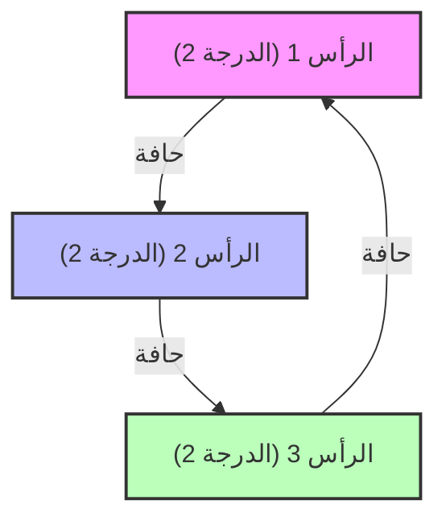

# ما هي نظرية الطيف للرسوم البيانية (Spectral Graph Theory)؟

نحن محاطون بالشبكات. يمكن نمذجة كل شيء كـ "رسم بياني (Graph)"، بدءاً من بنية الروابط التشعبية على الإنترنت، والعلاقات الاجتماعية على وسائل التواصل الاجتماعي، وشبكات الطاقة، وصولاً إلى الروابط بين الخلايا العصبية في الدماغ. نظرية الطيف للرسوم البيانية (Spectral Graph Theory) هي مجال يمثل هذه الرسوم البيانية كـ "مصفوفات"، ويستخدم مفاهيم الجبر الخطي مثل "القيم الذاتية (Eigenvalues)" و "المتجهات الذاتية (Eigenvectors)" للكشف عن الخصائص الكلية والجزئية المخفية في الشبكات.

في هذه المقالة، سنتعمق بشكل كبير ونشرح بدءاً من التمثيل المصفوفي الأساسي، والمعنى الفيزيائي للقيم الذاتية لمصفوفة لابلاس (Laplacian matrix)، و متباينة تشيغر (Cheeger's inequality) التي تعتبر علامة فارقة في تقسيم الرسوم البيانية، وصولاً إلى الإثبات الرياضي لخوارزمية PageRank التي كانت حجر الأساس لشركة Google.

---

## 1. التمثيل المصفوفي للرسم البياني

لنفترض وجود رسم بياني $G = (V, E)$. هنا، $V$ هي مجموعة الرؤوس (العقد)، و $E$ هي مجموعة الحواف (الروابط). ليكن عدد العقد $n = |V|$. لكي نتعامل مع بنية هذا الرسم البياني كمعادلات رياضية أو برمجياً عبر الحاسوب، نقوم بتعريف عدة مصفوفات.

### مصفوفة الجوار (Adjacency Matrix)

مصفوفة الجوار $A$ هي مصفوفة متماثلة بأبعاد $n \times n$، حيث تأخذ القيمة $A_{ij} = 1$ إذا كان هناك رابط (حافة) بين الرأسين $i$ و $j$، وتأخذ القيمة $A_{ij} = 0$ بخلاف ذلك (في حالة الرسم البياني غير الموجه وغير الموزون).

$$ A_{ij} = \begin{cases} 1 & \text{if } (i, j) \in E \\ 0 & \text{otherwise} \end{cases} $$

### مصفوفة الدرجة (Degree Matrix)

مصفوفة الدرجة $D$ هي مصفوفة قطرية، تحتوي عناصر قطرها الرئيسي على درجة كل رأس (عدد الحواف المتصلة به).

$$ D_{ii} = \sum_{j} A_{ij} $$
$$ D_{ij} = 0 \quad (\text{if } i \neq j) $$

### مصفوفة لابلاس (Laplacian Matrix)

عند تحليل خصائص الرسوم البيانية، يعتبر "لابلاسيان الرسم البياني" أداة أقوى بكثير من مصفوفة الجوار. تُعرّف مصفوفة لابلاس $L$ على النحو التالي:

$$ L = D - A $$

تتمتع مصفوفة لابلاس بالخصائص الرائعة التالية:
1. **التماثل (Symmetry)**: نظراً لأن $L$ مصفوفة متماثلة ($L = L^T$)، فإن جميع قيمها الذاتية هي أعداد حقيقية.
2. **شبه التحديد الموجب (Positive semi-definiteness)**: لأي متجه $x \in \mathbb{R}^n$، يمكن فك الشكل التربيعي $x^T L x$ على النحو التالي:
   $$ x^T L x = \sum_{(i,j) \in E} (x_i - x_j)^2 \geq 0 $$
   هذا يوضح أن جميع القيم الذاتية للمصفوفة $L$ هي أكبر من أو تساوي $0$ ($\lambda_0 \leq \lambda_1 \leq \dots \leq \lambda_{n-1}$).
3. **أصغر قيمة ذاتية**: دائماً ما تكون $\lambda_0 = 0$، والمتجه الذاتي المقابل لها هو المتجه $\mathbf{1}$ الذي يتكون من القيمة $1$ في جميع عناصره ($L\mathbf{1} = (D-A)\mathbf{1} = \mathbf{0}$).



---

## 2. المعنى الفيزيائي للقيم الذاتية: الاتصالية الجبرية ومتجه فيدلر (Fiedler Vector)

القيم الذاتية $\lambda_i$ لمصفوفة لابلاس $L$ تعبر بوضوح عن "شكل" الرسم البياني و"مدى ترابطه".

- **تعددية $\lambda_0 = 0$**: تشير إلى عدد المكونات المتصلة (الرسوم البيانية الجزئية المستقلة) في الرسم البياني. إذا كانت هناك قيمة واحدة فقط $\lambda_0 = 0$ (أي أن $\lambda_1 > 0$)، فهذا يعني أن الرسم البياني عبارة عن شبكة واحدة متصلة.
- **$\lambda_1$ (الاتصالية الجبرية, Algebraic Connectivity)**: القيمة الذاتية الثانية الأصغر $\lambda_1$ هي مؤشر يوضح قوة اتصال الرسم البياني، وتُعرف أيضاً بقيمة فيدلر (Fiedler value). كلما كانت هذه القيمة أكبر، كان الرسم البياني مترابطاً بكثافة، ويصبح من الصعب تقسيم الشبكة إلى قسمين. وعلى العكس، كلما اقتربت هذه القيمة من 0، دلّ ذلك على وجود "عنق زجاجة (Bottleneck)" حيث يمكن فصل الرسم البياني بقطع حواف قليلة جداً.
- **متجه فيدلر (Fiedler vector)**: يُسمى المتجه الذاتي المقابل للقيمة $\lambda_1$ بمتجه فيدلر. من خلال النظر إلى إشارات مكونات هذا المتجه (سواء كانت موجبة أو سالبة)، يمكننا تقسيم الرسم البياني بشكل طبيعي إلى مجموعتين (مجموعات متجمعة أو Clusters) (وهذا هو أساس التجميع الطيفي أو Spectral Clustering).

### تشابه مع التوصيل الحراري والمشي العشوائي (Random Walk)

في الفيزياء، يظهر مؤثر لابلاس $\nabla^2$ في معادلة التوصيل الحراري ومعادلة الموجة. وبالمثل، تلعب مصفوفة لابلاس $L$ على الرسم البياني نفس الدور تماماً. إذا افترضنا أن كل عقدة تمتلك "حرارة"، فإن هذه الحرارة ستنتشر عبر الحواف. تُحدد الاتصالية الجبرية $\lambda_1$ مدى سرعة تجانس هذه الحرارة وتوزيعها بالتساوي عبر الشبكة بأكملها (زمن الاسترخاء).

---

## 3. متباينة تشيغر (Cheeger's Inequality)

كمؤشر هندسي لقياس مدى سهولة تقسيم الرسم البياني، يوجد ما يسمى بـ "ثابت تشيغر (Cheeger constant, Isoperimetric number)" $h_G$. هذا الثابت هو الحد الأدنى لنسبة عدد الحواف التي تربط بين مجموعتين جزئيتين $S$ و $V \setminus S$ إلى حجم (أو حجم عناصر) المجموعة الأصغر بينهما، عند تقسيم الرسم البياني إلى هاتين المجموعتين.

$$ h_G = \min_{S \subset V, 0 < |S| \leq n/2} \frac{|E(S, V \setminus S)|}{|S|} $$

كون $h_G$ صغيراً يعني وجود "عنق زجاجة" حيث يمكن فصل مجموعة كبيرة عن طريق قطع عدد قليل من الحواف. ومع ذلك، فإن الحساب الدقيق لـ $h_G$ يُعتبر مشكلة من نوع NP-hard.

هنا يأتي دور "متباينة تشيغر"، والتي تُعتبر واحدة من أعظم إنجازات نظرية الطيف للرسوم البيانية. تربط هذه المبرهنة بين الكمية الهندسية $h_G$ والكمية الجبرية $\lambda_1$.

$$ \frac{\lambda_1}{2} \leq h_G \leq \sqrt{2 \lambda_1 \Delta} $$

(※ $\Delta$ هو الحد الأقصى لدرجة الرسم البياني)

بفضل هذه المتباينة، يمكننا ضمان وجود أو عدم وجود عنق زجاجة في الرسم البياني فقط من خلال حساب القيمة الذاتية $\lambda_1$ (وهو أمر ممكن في وقت متعدد الحدود أو Polynomial time). تشير المتباينة في الجانب الأيسر إلى أنه إذا كانت الاتصالية الجبرية كبيرة، فلن يكون هناك عنق زجاجة، بينما تشير المتباينة في الجانب الأيمن إلى أنه إذا كانت الاتصالية الجبرية صغيرة، فإنه من المؤكد وجود تقسيم جيد (عنق زجاجة).

---

## 4. سلاسل ماركوف والإثبات الرياضي لخوارزمية Google PageRank

التطبيق الأكثر شهرة لنظرية الطيف للرسوم البيانية هو خوارزمية PageRank التي دعمت محرك بحث Google. يتم تبسيط هذه المشكلة باعتبار الويب كرسم بياني موجه ضخم، والبحث عن التوزيع الثابت (Stationary distribution) لعملية مشي عشوائي (Random Walk) عليه.

### مصفوفة احتمالية الانتقال (Transition Matrix)

لنفترض أن $A$ هي مصفوفة الجوار للرسم البياني الموجه، و $d_i^{out}$ هي درجة الخروج من كل عقدة. تُعرّف مصفوفة احتمالية الانتقال $P$ على النحو التالي:

$$ P_{ij} = \begin{cases} \frac{1}{d_i^{out}} & \text{if } (i,j) \in E \\ 0 & \text{otherwise} \end{cases} $$

إذا كان متجه الصف $\pi$ هو التوزيع الاحتمالي للحالة، فإن التوزيع بعد خطوة واحدة سيكون $\pi P$. النهاية (التوزيع الثابت) بعد عدد لانهائي من الخطوات هي $\pi$ التي تحقق المعادلة $\pi = \pi P$. هذا ليس سوى المتجه الذاتي الأيسر للمصفوفة $P$ (المقابل للقيمة الذاتية 1).

### مبرهنة بيرون-فروبينيوس (Perron-Frobenius Theorem)

الذي يضمن أن هذا التوزيع الثابت محدد بشكل فريد وقابل للحساب هو "مبرهنة بيرون-فروبينيوس". ومع ذلك، فإن رسم الويب البياني الفعلي غير متصل بقوة (على سبيل المثال، وجود صفحات مسدودة بدون روابط خارجية)، وبالتالي فهو لا يلبي شروط هذه المبرهنة.

لذلك، قدم لاري بيج وسيرجي برين "عامل التخميد (Damping Factor)" $d \approx 0.85$. يفترض هذا أن المستخدم يتتبع الروابط باحتمالية $d$، ويقفز إلى صفحة عشوائية تماماً باحتمالية $1-d$.

يُعبر عن مصفوفة الانتقال المُعدلة $\tilde{P}$ على النحو التالي:

$$ \tilde{P} = d P + \frac{1-d}{n} \mathbf{1}\mathbf{1}^T $$

بما أن هذه المصفوفة $\tilde{P}$ تحتوي على عناصر موجبة بالكامل (مصفوفة موجبة)، يمكن تطبيق مبرهنة بيرون-فروبينيوس بالكامل.

1. **أكبر قيمة ذاتية هي 1 بصرامة**، وتعدديتها هي 1.
2. المتجه الذاتي الأيسر المقابل $\pi$ يحتوي على عناصر موجبة فقط، وهذا يمثل الـ PageRank (مستوى الأهمية) لكل صفحة.
3. القيم المطلقة لجميع القيم الذاتية الأخرى أقل من 1 بصرامة، لذا فإن طريقة القوة (Power Iteration) $\pi^{(k+1)} = \pi^{(k)} \tilde{P}$ ستتقارب دائماً نحو التوزيع الثابت $\pi$، بغض النظر عن الحالة الابتدائية.

بفضل هذا التعديل الرياضي الرائع، أصبحت خوارزمية PageRank قابلة للحساب ومستقرة.

---

## 5. مثال برمجي للتحليل الطيفي باستخدام Python (NetworkX)

لوضع النظرية موضع التنفيذ، دعونا نقوم بحساب القيم الذاتية لمصفوفة لابلاس للرسم البياني وتنفيذ التجميع الطيفي (Spectral Clustering) باستخدام متجه فيدلر، وذلك بالاعتماد على مكتبة `NetworkX` لشبكات الرسوم البيانية في بايثون، و `NumPy`، و `SciPy`.

```python
import networkx as nx
import numpy as np
import matplotlib.pyplot as plt
from scipy.linalg import eigh

# 1. تحميل بيانات شبكة نادي الكاراتيه
G = nx.karate_club_graph()

# 2. الحصول على مصفوفة لابلاس
L = nx.laplacian_matrix(G).todense()

# 3. تحليل القيم الذاتية (scipy.linalg.eigh مُحسّن للمصفوفات المتماثلة)
eigenvalues, eigenvectors = eigh(L)

# 4. الحصول على القيمة الذاتية الثانية (الاتصالية الجبرية) ومتجه فيدلر
lambda_1 = eigenvalues[1]
fiedler_vector = eigenvectors[:, 1]

print(f"الاتصالية الجبرية (lambda_1): {lambda_1:.4f}")

# 5. تقسيم الرسم البياني إلى قسمين بناءً على متجه فيدلر (التجميع الطيفي)
cluster_1 = [i for i, val in enumerate(fiedler_vector) if val < 0]
cluster_2 = [i for i, val in enumerate(fiedler_vector) if val >= 0]

# 6. عرض النتائج بصرياً
plt.figure(figsize=(10, 7))
pos = nx.spring_layout(G, seed=42)
nx.draw_networkx_nodes(G, pos, nodelist=cluster_1, node_color='lightblue', label='Cluster 1')
nx.draw_networkx_nodes(G, pos, nodelist=cluster_2, node_color='lightgreen', label='Cluster 2')
nx.draw_networkx_edges(G, pos, alpha=0.5)
nx.draw_networkx_labels(G, pos, font_size=10)
plt.title(f"Spectral Clustering based on Fiedler Vector (λ1 = {lambda_1:.4f})")
plt.legend()
plt.axis('off')
plt.show()
```

عند تشغيل هذا الكود، يمكن التأكد من أن شبكة نادي الكاراتيه الشهيرة لزاكاري يتم تقسيمها بنجاح إلى فصيلين بناءً فقط على إشارة (موجب أو سالب) متجه فيدلر. إنها اللحظة التي يتم فيها كشف بنية الشبكة المعقدة فقط من خلال العملية الجبرية لمتجهات المصفوفة.

---

## الخلاصة

نظرية الطيف للرسوم البيانية هي الجسر الذي يربط ببراعة بين عالم الرياضيات المتقطعة ([نظرية الرسوم البيانية](/ar/p/graph-theory-dijkstra-a-star/)) وعالم الرياضيات المتصلة (الجبر الخطي). تلتقط قيمة رقمية واحدة، ألا وهي القيمة الذاتية للمصفوفة، بشكل دقيق البنية الكلية مثل اتصال الشبكة بالكامل ووجود أعناق الزجاجة، وعلاوة على ذلك، تدعم البنية التحتية للمعلومات في المجتمع الحديث من خلال خوارزميات مثل PageRank.

الشبكات المعقدة التي نراها كل يوم، عند النظر إليها من خلال طيف المصفوفة (توزيع القيم الذاتية)، تكشف عن النظام والقوانين المخفية بداخلها.
