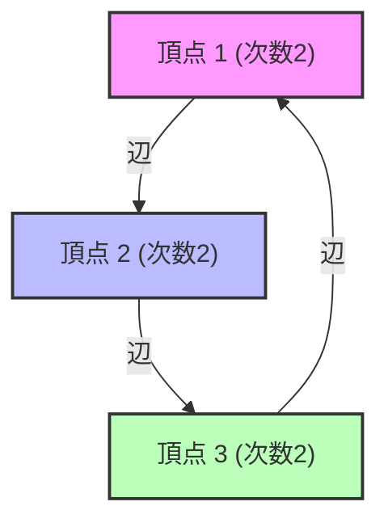

# Was ist Spektrale Graphentheorie?

Wir sind umgeben von Netzwerken. Von der Hyperlink-Struktur des Internets über soziale Netzwerke auf SNS, Stromnetze bis hin zu den Verbindungen der Nervenzellen im Gehirn – alles lässt sich als "Graph" (Graph) modellieren. Die Spektrale [Graphentheorie](/de/p/graph-theory-dijkstra-a-star/) (Spectral Graph Theory) ist ein Bereich, der diese Graphen als "Matrizen" darstellt und Konzepte der linearen Algebra wie "Eigenwerte" (Eigenvalues) und "Eigenvektoren" (Eigenvectors) verwendet, um die makroskopischen und mikroskopischen Eigenschaften aufzudecken, die in Netzwerken verborgen sind.

In diesem Artikel werden wir von grundlegenden Matrixdarstellungen ausgehen, die physikalische Bedeutung der Eigenwerte der Laplace-Matrix, die Cheeger-Ungleichung (Cheeger's inequality) – ein Meilenstein in der Graphenpartitionierung – und schließlich den mathematischen Beweis des PageRank-Algorithmus, der die Grundlage von Google bildet, sehr tiefgehend erklären.

---

## 1. Matrixdarstellung von Graphen

Betrachten wir einen Graphen $G = (V, E)$. Hier ist $V$ die Menge der Knoten (Nodes) und $E$ die Menge der Kanten (Edges). Sei die Anzahl der Knoten $n = |V|$. Um die Struktur dieses Graphen auf Computern oder als mathematische Formeln zu verarbeiten, definieren wir einige Matrizen.

### Adjazenzmatrix (Adjacency Matrix)

Die Adjazenzmatrix $A$ ist eine $n \times n$ symmetrische Matrix, bei der $A_{ij} = 1$, wenn es eine Verbindung (Kante) zwischen den Knoten $i$ und $j$ gibt, und andernfalls $A_{ij} = 0$ (im Fall eines ungewichteten ungerichteten Graphen).

$$ A_{ij} = \begin{cases} 1 & \text{if } (i, j) \in E \\ 0 & \text{otherwise} \end{cases} $$

### Gradmatrix (Degree Matrix)

Die Gradmatrix $D$ ist eine Diagonalmatrix, bei der die Diagonalelemente die Grade (Anzahl der verbundenen Kanten) jedes Knotens sind.

$$ D_{ii} = \sum_{j} A_{ij} $$
$$ D_{ij} = 0 \quad (\text{if } i \neq j) $$

### Laplace-Matrix (Laplacian Matrix)

Ein Werkzeug, das bei der Analyse von Grapheneigenschaften noch mächtiger ist als die Adjazenzmatrix, ist der "Graphen-Laplace". Die Laplace-Matrix $L$ ist wie folgt definiert.

$$ L = D - A $$

Die Laplace-Matrix hat folgende wunderbare Eigenschaften:
1. **Symmetrie**: Da $L$ eine symmetrische Matrix ($L = L^T$) ist, sind alle ihre Eigenwerte reelle Zahlen.
2. **Positiv-Semidefinitheit**: Für jeden Vektor $x \in \mathbb{R}^n$ kann die quadratische Form $x^T L x$ wie folgt entwickelt werden:
   $$ x^T L x = \sum_{(i,j) \in E} (x_i - x_j)^2 \geq 0 $$
   Daraus können wir ersehen, dass alle Eigenwerte von $L$ größer oder gleich $0$ sind ($\lambda_0 \leq \lambda_1 \leq \dots \leq \lambda_{n-1}$).
3. **Kleinster Eigenwert**: Es gilt immer $\lambda_0 = 0$, und der zugehörige Eigenvektor ist der Vektor $\mathbf{1}$, dessen Komponenten alle $1$ sind ($L\mathbf{1} = (D-A)\mathbf{1} = \mathbf{0}$).



---

## 2. Physikalische Bedeutung der Eigenwerte: Algebraische Konnektivität und Fiedler-Vektor

Die Eigenwerte $\lambda_i$ der Laplace-Matrix $L$ drücken anschaulich die "Form" und "Verbindungsfähigkeit" eines Graphen aus.

- **Vielfachheit von $\lambda_0 = 0$**: Sie gibt an, in wie viele verbundene Komponenten (unabhängige Teilgraphen) der Graph unterteilt ist. Wenn es nur ein einziges $\lambda_0 = 0$ gibt (d. h. $\lambda_1 > 0$), bedeutet dies, dass der Graph ein einzelnes, zusammenhängendes Netzwerk ist.
- **$\lambda_1$ (Algebraische Konnektivität, Algebraic Connectivity)**: Der zweitkleinste Eigenwert $\lambda_1$ ist ein Indikator für die Stärke der Verbindung des Graphen und wird auch Fiedler-Wert genannt. Je größer dieser Wert ist, desto dichter ist der Graph verbunden, was es schwieriger macht, das Netzwerk in zwei Teile zu zerlegen. Umgekehrt, je näher dieser Wert bei 0 liegt, desto eher existiert ein "Flaschenhals", der den Graphen teilt, wenn nur wenige Kanten geschnitten werden.
- **Fiedler-Vektor**: Der zu $\lambda_1$ gehörende Eigenvektor wird Fiedler-Vektor genannt. Indem man sich das Vorzeichen (positiv oder negativ) der Komponenten dieses Vektors ansieht, kann man den Graphen auf natürliche Weise in zwei Cluster aufteilen (die Grundlage des spektralen Clusterings).

### Analogie zu Wärmeleitung und Random Walk

In der Physik taucht der Laplace-Operator $\nabla^2$ in Wärmeleitungs- und Wellengleichungen auf. Die Laplace-Matrix $L$ auf einem Graphen spielt genau die gleiche Rolle. Wenn wir annehmen, dass jeder Knoten "Wärme" besitzt, breitet sich die Wärme über die Kanten aus. Die algebraische Konnektivität $\lambda_1$ bestimmt, wie schnell sich diese Wärme im gesamten Netzwerk ausgleicht (Relaxationszeit).

---

## 3. Cheeger-Ungleichung (Cheeger's Inequality)

Als geometrischer Indikator zur Messung der Trennbarkeit eines Graphen dient die "Cheeger-Konstante" (Cheeger constant, Isoperimetric number) $h_G$. Dies ist das Minimum des Verhältnisses der Anzahl der Kanten zwischen zwei Teilmengen $S$ und $V \setminus S$, in die der Graph unterteilt wurde, geteilt durch die Größe (oder das Volumen) der kleineren Menge.

$$ h_G = \min_{S \subset V, 0 < |S| \leq n/2} \frac{|E(S, V \setminus S)|}{|S|} $$

Ein kleines $h_G$ bedeutet, dass ein "Flaschenhals" existiert, bei dem durch das Schneiden weniger Kanten ein großer Cluster abgetrennt werden kann. Es ist jedoch ein NP-schweres Problem, $h_G$ exakt zu berechnen.

Hier kommt eine der größten Errungenschaften der spektralen [Graphentheorie](/de/p/graph-theory-dijkstra-a-star/) ins Spiel: die "Cheeger-Ungleichung". Dieses Theorem verbindet die geometrische Größe $h_G$ mit der algebraischen Größe $\lambda_1$.

$$ \frac{\lambda_1}{2} \leq h_G \leq \sqrt{2 \lambda_1 \Delta} $$

（※ $\Delta$ ist der maximale Grad des Graphen）

Durch diese Ungleichung kann die Existenz eines Flaschenhalses im Graphen allein durch die Berechnung des Eigenwerts $\lambda_1$ garantiert werden (was in polynomieller Zeit möglich ist). Die linke Ungleichung zeigt, dass kein Flaschenhals existiert, wenn die algebraische Konnektivität groß ist, während die rechte Ungleichung zeigt, dass es definitiv eine gute Partitionierung (einen Flaschenhals) gibt, wenn die algebraische Konnektivität klein ist.

---

## 4. Markov-Ketten und der mathematische Beweis des Google PageRank

Die berühmteste Anwendung der spektralen [Graphentheorie](/de/p/graph-theory-dijkstra-a-star/) ist der PageRank-Algorithmus, der der Suchmaschine von Google zugrunde liegt. Dies reduziert das Problem darauf, das Web als einen riesigen gerichteten Graphen zu betrachten und die stationäre Verteilung eines Random Walks zu finden.

### Übergangsmatrix (Transition Matrix)

Sei $A$ die Adjazenzmatrix eines gerichteten Graphen und $d_i^{out}$ der Ausgangsgrad jedes Knotens. Die Übergangsmatrix $P$ ist wie folgt definiert:

$$ P_{ij} = \begin{cases} \frac{1}{d_i^{out}} & \text{if } (i,j) \in E \\ 0 & \text{otherwise} \end{cases} $$

Wenn wir den Zeilenvektor $\pi$ als Zustandswahrscheinlichkeitsverteilung betrachten, ist die Verteilung nach einem Schritt $\pi P$. Der Grenzwert (die stationäre Verteilung) nach unendlich vielen Schritten ist ein $\pi$, das $\pi = \pi P$ erfüllt. Dies ist nichts anderes als der linke Eigenvektor der Matrix $P$ (der zum Eigenwert 1 gehört).

### Satz von Perron-Frobenius (Perron-Frobenius Theorem)

Der "Satz von Perron-Frobenius" garantiert, dass diese stationäre Verteilung eindeutig bestimmt und berechenbar ist. Der tatsächliche Web-Graph ist jedoch nicht stark zusammenhängend (z. B. gibt es Sackgassen-Seiten) und erfüllt die Bedingungen dieses Theorems nicht.

Daher führten Larry Page und Sergey Brin einen "Dämpfungsfaktor" (Damping Factor) $d \approx 0.85$ ein. Es wird angenommen, dass der Benutzer einem Link mit der Wahrscheinlichkeit $d$ folgt und mit der Wahrscheinlichkeit $1-d$ zu einer völlig zufälligen Seite springt.

Die modifizierte Übergangsmatrix $\tilde{P}$ wird wie folgt ausgedrückt:

$$ \tilde{P} = d P + \frac{1-d}{n} \mathbf{1}\mathbf{1}^T $$

Da diese Matrix $\tilde{P}$ nur positive Komponenten hat (positive Matrix), ist der Satz von Perron-Frobenius vollständig anwendbar.

1. **Der größte Eigenwert ist strikt 1** und seine Vielfachheit ist 1.
2. Der zugehörige linke Eigenvektor $\pi$ hat durchgehend positive Komponenten, was den PageRank (die Wichtigkeit) jeder Seite darstellt.
3. Der absolute Wert aller anderen Eigenwerte ist strikt kleiner als 1, daher konvergiert die Potenzmethode (Power Iteration) $\pi^{(k+1)} = \pi^{(k)} \tilde{P}$ unabhängig vom Anfangszustand immer zur stationären Verteilung $\pi$.

Durch diese geniale mathematische Modifikation wurde PageRank zu einem berechenbaren und stabilen Algorithmus.

---

## 5. Code-Beispiel zur Spektralanalyse mit Python (NetworkX)

Um die Theorie in die Praxis umzusetzen, lassen Sie uns die Eigenwerte der Laplace-Matrix eines Graphen berechnen und das spektrale Clustering mithilfe des Fiedler-Vektors unter Verwendung der Python-Bibliotheken für Graphennetzwerke, `NetworkX`, sowie `NumPy` und `SciPy`, implementieren.

```python
import networkx as nx
import numpy as np
import matplotlib.pyplot as plt
from scipy.linalg import eigh

# 1. カラテクラブのネットワークデータを読み込む
G = nx.karate_club_graph()

# 2. ラプラシアン行列の取得
L = nx.laplacian_matrix(G).todense()

# 3. 固有値分解 (scipy.linalg.eigh は対称行列に最適化されている)
eigenvalues, eigenvectors = eigh(L)

# 4. 第2固有値（代数的連結度）とFiedlerベクトルの取得
lambda_1 = eigenvalues[1]
fiedler_vector = eigenvectors[:, 1]

print(f"代数的連結度 (lambda_1): {lambda_1:.4f}")

# 5. Fiedlerベクトルに基づくグラフの2分割（スペクトルクラスタリング）
cluster_1 = [i for i, val in enumerate(fiedler_vector) if val < 0]
cluster_2 = [i for i, val in enumerate(fiedler_vector) if val >= 0]

# 6. 結果の可視化
plt.figure(figsize=(10, 7))
pos = nx.spring_layout(G, seed=42)
nx.draw_networkx_nodes(G, pos, nodelist=cluster_1, node_color='lightblue', label='Cluster 1')
nx.draw_networkx_nodes(G, pos, nodelist=cluster_2, node_color='lightgreen', label='Cluster 2')
nx.draw_networkx_edges(G, pos, alpha=0.5)
nx.draw_networkx_labels(G, pos, font_size=10)
plt.title(f"Spectral Clustering based on Fiedler Vector (λ1 = {lambda_1:.4f})")
plt.legend()
plt.axis('off')
plt.show()
```

Wenn dieser Code ausgeführt wird, können Sie bestätigen, dass das berühmte Zachary's Karate Club-Netzwerk nur durch das Vorzeichen (positiv oder negativ) des Fiedler-Vektors wunderbar in zwei Fraktionen aufgeteilt wird. Es ist der Moment, in dem eine komplexe Netzwerkstruktur allein durch die algebraische Operation der Eigenvektoren einer Matrix entschlüsselt wird.

---

## Fazit

Die spektrale [Graphentheorie](/de/p/graph-theory-dijkstra-a-star/) ist eine großartige Brücke, die die Welt der diskreten Mathematik ([Graphentheorie](/de/p/graph-theory-dijkstra-a-star/)) mit der Welt der kontinuierlichen Mathematik (lineare Algebra) verbindet. Eine einzige Zahl, der Eigenwert einer Matrix, erfasst die makroskopische Struktur des gesamten Netzwerks – wie Konnektivität und das Vorhandensein von Flaschenhälsen – genau und unterstützt durch Algorithmen wie PageRank die Informationsinfrastruktur unserer modernen Gesellschaft.

Wenn wir die komplexen Netzwerke, die wir täglich sehen, durch das Spektrum der Matrix (Verteilung der Eigenwerte) betrachten, kommen die darin verborgenen Ordnungen und Gesetzmäßigkeiten zum Vorschein.
