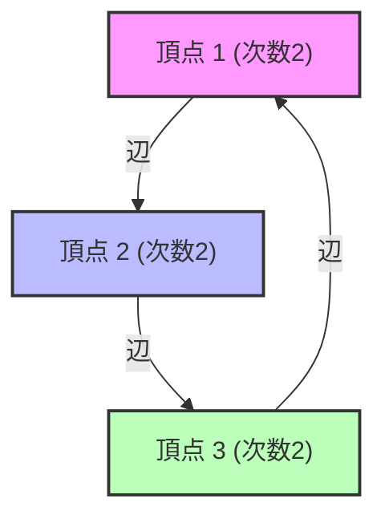

# What is Spectral Graph Theory?

Networks abound around us. From the hyperlink structure of the internet, social network connections, power grids, and even the neural connections in the brain, everything can be modeled as a "Graph". Spectral [Graph Theory](/en/p/graph-theory-dijkstra-a-star/) is a field that represents these graphs as "matrices" and reveals the macro and micro properties hidden within the networks using concepts from linear algebra such as "Eigenvalues" and "Eigenvectors".

This article delves deeply into the basic matrix representations, the physical meaning of the eigenvalues of the Laplacian matrix, Cheeger's inequality which is a monument in graph partitioning, and the mathematical proof of the PageRank algorithm that formed the foundation of Google.

---

## 1. Matrix Representation of Graphs

Consider a graph $G = (V, E)$. Here, $V$ is the set of vertices (nodes) and $E$ is the set of edges. Let the number of nodes be $n = |V|$. To handle the structure of this graph as computer or mathematical formulas, we define several matrices.

### Adjacency Matrix

The adjacency matrix $A$ is an $n \times n$ symmetric matrix where $A_{ij} = 1$ if there is a connection (edge) between vertex $i$ and $j$, and $A_{ij} = 0$ otherwise (for an unweighted undirected graph).

$$ A_{ij} = \begin{cases} 1 & \text{if } (i, j) \in E \\ 0 & \text{otherwise} \end{cases} $$

### Degree Matrix

The degree matrix $D$ is a diagonal matrix where the diagonal elements are the degree (number of connected edges) of each vertex.

$$ D_{ii} = \sum_{j} A_{ij} $$
$$ D_{ij} = 0 \quad (\text{if } i \neq j) $$

### Laplacian Matrix

When analyzing the properties of a graph, the "Graph Laplacian" becomes a more powerful tool than the adjacency matrix. The Laplacian matrix $L$ is defined as follows.

$$ L = D - A $$

The Laplacian matrix has the following wonderful properties.
1. **Symmetry**: Since $L$ is a symmetric matrix ($L = L^T$), all its eigenvalues are real numbers.
2. **Positive Semi-definiteness**: For any vector $x \in \mathbb{R}^n$, the quadratic form $x^T L x$ can be expanded as follows.
   $$ x^T L x = \sum_{(i,j) \in E} (x_i - x_j)^2 \geq 0 $$
   This shows that all eigenvalues of $L$ are greater than or equal to $0$ ($\lambda_0 \leq \lambda_1 \leq \dots \leq \lambda_{n-1}$).
3. **Smallest Eigenvalue**: $\lambda_0 = 0$ is always true, and the corresponding eigenvector is the vector $\mathbf{1}$ with all components being $1$ ($L\mathbf{1} = (D-A)\mathbf{1} = \mathbf{0}$).



---

## 2. Physical Meaning of Eigenvalues: Algebraic Connectivity and Fiedler Vector

The eigenvalues $\lambda_i$ of the Laplacian matrix $L$ vividly represent the "shape" and "connectivity" of the graph.

- **Multiplicity of $\lambda_0 = 0$**: Represents how many connected components (independent subgraphs) the graph is divided into. If there is only one $\lambda_0 = 0$ (i.e., $\lambda_1 > 0$), it means the graph is a single connected network.
- **$\lambda_1$ (Algebraic Connectivity)**: The second smallest eigenvalue $\lambda_1$ is an indicator of the strength of the graph's connectivity and is also called the Fiedler value. The larger this value, the more densely connected the graph is, making it difficult to split the network into two. Conversely, the closer this value is to 0, it suggests the existence of a "bottleneck" where the graph can be disconnected by cutting only a few edges.
- **Fiedler Vector**: The eigenvector corresponding to $\lambda_1$ is called the Fiedler vector. By looking at the sign (positive or negative) of the components of this vector, the graph can be naturally divided into two clusters (the foundation of spectral clustering).

### Analogy with Heat Conduction and Random Walks

In physics, the Laplacian operator $\nabla^2$ appears in the heat equation and the wave equation. The Laplacian matrix $L$ on a graph plays exactly the same role. If we assume each node holds "heat", the heat diffuses along the edges. The algebraic connectivity $\lambda_1$ determines how fast this heat equalizes across the entire network (relaxation time).

---

## 3. Cheeger's Inequality

A geometric indicator to measure how easily a graph can be disconnected is the "Cheeger constant (Isoperimetric number)" $h_G$. When a graph is divided into two subsets $S$ and $V \setminus S$, this is the minimum value of the number of edges connecting them divided by the size (or volume) of the smaller set.

$$ h_G = \min_{S \subset V, 0 < |S| \leq n/2} \frac{|E(S, V \setminus S)|}{|S|} $$

A small $h_G$ means that there is a "bottleneck" where a large cluster can be cut off by cutting a small number of edges. However, calculating $h_G$ exactly is an NP-hard problem.

Here, one of the greatest achievements of Spectral [Graph Theory](/en/p/graph-theory-dijkstra-a-star/), "Cheeger's Inequality", comes into play. This theorem connects the geometric quantity $h_G$ and the algebraic quantity $\lambda_1$.

$$ \frac{\lambda_1}{2} \leq h_G \leq \sqrt{2 \lambda_1 \Delta} $$

（※ $\Delta$ is the maximum degree of the graph）

Because of this inequality, just by calculating the eigenvalue $\lambda_1$ (which is possible in polynomial time), we can guarantee the existence of a bottleneck in the graph. The left inequality shows that if the algebraic connectivity is large, there is no bottleneck, and the right inequality shows that if the algebraic connectivity is small, a good partition (bottleneck) always exists.

---

## 4. Markov Chains and the Mathematical Proof of Google PageRank

The most famous application of Spectral [Graph Theory](/en/p/graph-theory-dijkstra-a-star/) is the PageRank algorithm that powered Google's search engine. This reduces to treating the web as a massive directed graph and finding the stationary distribution of a [random walk](/en/p/random-walk/).

### Transition Matrix

Let $A$ be the adjacency matrix of a directed graph, and $d_i^{out}$ be the out-degree from each node. The transition probability matrix $P$ is defined as follows.

$$ P_{ij} = \begin{cases} \frac{1}{d_i^{out}} & \text{if } (i,j) \in E \\ 0 & \text{otherwise} \end{cases} $$

If we let the row vector $\pi$ be the state probability distribution, the distribution after 1 step is $\pi P$. The limit (stationary distribution) after infinite steps is the $\pi$ that satisfies $\pi = \pi P$. This is nothing but the left eigenvector (corresponding to the eigenvalue 1) of the matrix $P$.

### Perron-Frobenius Theorem

The "Perron-Frobenius Theorem" guarantees that this stationary distribution is uniquely determined and computable. However, actual web graphs are not strongly connected (there are dead-end pages, etc.) and do not meet the conditions of this theorem.

Therefore, Larry Page and Sergey Brin introduced a "Damping Factor" $d \approx 0.85$. It assumes that a user follows a link with probability $d$ and jumps to a completely random page with probability $1-d$.

The modified transition matrix $\tilde{P}$ is expressed as follows.

$$ \tilde{P} = d P + \frac{1-d}{n} \mathbf{1}\mathbf{1}^T $$

Since this matrix $\tilde{P}$ has all positive components (positive matrix), the Perron-Frobenius theorem becomes fully applicable.

1. **The largest eigenvalue is strictly 1**, and its multiplicity is 1.
2. The corresponding left eigenvector $\pi$ has all positive components, and this becomes the PageRank (importance) of each page.
3. The absolute values of all other eigenvalues are strictly less than 1, so the Power Iteration $\pi^{(k+1)} = \pi^{(k)} \tilde{P}$ will always converge to the stationary distribution $\pi$ regardless of the initial state.

With this brilliant mathematical modification, PageRank became a computable and stable algorithm.

---

## 5. Python (NetworkX) Code Example for Spectral Analysis

To put theory into practice, let's calculate the eigenvalues of the graph's Laplacian matrix and implement spectral clustering using the Fiedler vector using Python's graph network libraries `NetworkX`, `NumPy`, and `SciPy`.

```python
import networkx as nx
import numpy as np
import matplotlib.pyplot as plt
from scipy.linalg import eigh

# 1. カラテクラブのネットワークデータを読み込む
G = nx.karate_club_graph()

# 2. ラプラシアン行列の取得
L = nx.laplacian_matrix(G).todense()

# 3. 固有値分解 (scipy.linalg.eigh は対称行列に最適化されている)
eigenvalues, eigenvectors = eigh(L)

# 4. 第2固有値（代数的連結度）とFiedlerベクトルの取得
lambda_1 = eigenvalues[1]
fiedler_vector = eigenvectors[:, 1]

print(f"代数的連結度 (lambda_1): {lambda_1:.4f}")

# 5. Fiedlerベクトルに基づくグラフの2分割（スペクトルクラスタリング）
cluster_1 = [i for i, val in enumerate(fiedler_vector) if val < 0]
cluster_2 = [i for i, val in enumerate(fiedler_vector) if val >= 0]

# 6. 結果の可視化
plt.figure(figsize=(10, 7))
pos = nx.spring_layout(G, seed=42)
nx.draw_networkx_nodes(G, pos, nodelist=cluster_1, node_color='lightblue', label='Cluster 1')
nx.draw_networkx_nodes(G, pos, nodelist=cluster_2, node_color='lightgreen', label='Cluster 2')
nx.draw_networkx_edges(G, pos, alpha=0.5)
nx.draw_networkx_labels(G, pos, font_size=10)
plt.title(f"Spectral Clustering based on Fiedler Vector (λ1 = {lambda_1:.4f})")
plt.legend()
plt.axis('off')
plt.show()
```

When you run this code, you can see that the famous Zachary's Karate Club network is beautifully divided into two factions simply by the sign (positive or negative) of the Fiedler vector. This is the moment when complex network structures are unraveled using merely algebraic operations like the eigenvectors of a matrix.

---

## Conclusion

Spectral [Graph Theory](/en/p/graph-theory-dijkstra-a-star/) is a bridge that beautifully connects the world of discrete mathematics, [graph theory](/en/p/graph-theory-dijkstra-a-star/), with the world of continuous mathematics, linear algebra. A single number, the eigenvalue of a matrix, accurately captures macro structures such as the connectivity of the entire network and the existence of bottlenecks, and further supports the information infrastructure of modern society through algorithms like PageRank.

Even the complex networks we see every day, when viewed through the spectrum (distribution of eigenvalues) of a matrix, reveal the hidden order and laws within them.
