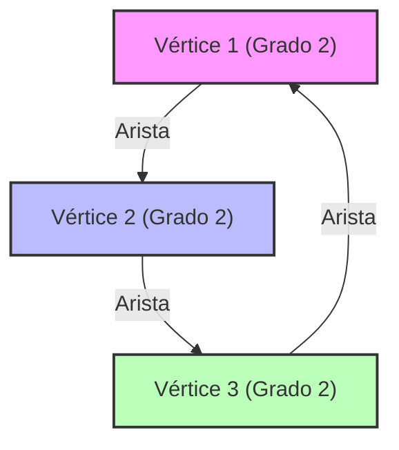

# ¿Qué es la Teoría Espectral de Grafos?

Nuestro entorno está lleno de redes. Desde la estructura de hipervínculos de Internet, las relaciones sociales en las redes sociales, la red eléctrica, hasta las conexiones de las neuronas en nuestro cerebro, todo puede ser modelado como un "grafo" (Graph). La Teoría Espectral de Grafos (Spectral Graph Theory) es un campo que representa estos grafos como "matrices" y utiliza conceptos del álgebra lineal como "valores propios" (Eigenvalues) y "vectores propios" (Eigenvectors) para revelar las propiedades macro y micro que se esconden en las redes.

En este artículo, comenzaremos con las representaciones matriciales básicas, el significado físico de los valores propios de la matriz Laplaciana, la desigualdad de Cheeger (Cheeger's inequality) que es un hito en la partición de grafos, y profundizaremos en la demostración matemática del algoritmo PageRank, que fue la base de Google.

---

## 1. Representación Matricial de un Grafo

Consideremos un grafo $G = (V, E)$. Aquí, $V$ es el conjunto de vértices (nodos) y $E$ es el conjunto de aristas (conexiones). Sea el número de nodos $n = |V|$. Para tratar la estructura de este grafo computacional o matemáticamente, definimos varias matrices.

### Matriz de Adyacencia (Adjacency Matrix)

La matriz de adyacencia $A$ es una matriz simétrica de $n \times n$ donde $A_{ij} = 1$ si hay una conexión (arista) entre los vértices $i$ y $j$, y $A_{ij} = 0$ en caso contrario (para un grafo no dirigido y sin peso).

$$ A_{ij} = \begin{cases} 1 & \text{if } (i, j) \in E \\ 0 & \text{otherwise} \end{cases} $$

### Matriz de Grado (Degree Matrix)

La matriz de grado $D$ es una matriz diagonal que contiene en su diagonal principal el grado (número de aristas conectadas) de cada vértice.

$$ D_{ii} = \sum_{j} A_{ij} $$
$$ D_{ij} = 0 \quad (\text{if } i \neq j) $$

### Matriz Laplaciana (Laplacian Matrix)

Para analizar las propiedades de un grafo, una herramienta aún más poderosa que la matriz de adyacencia es el "Laplaciano de grafo". La matriz Laplaciana $L$ se define de la siguiente manera:

$$ L = D - A $$

La matriz Laplaciana tiene las siguientes propiedades notables:
1. **Simetría**: Como $L$ es una matriz simétrica ($L = L^T$), todos sus valores propios son números reales.
2. **Semidefinida Positiva**: Para cualquier vector $x \in \mathbb{R}^n$, la forma cuadrática $x^T L x$ puede expandirse de la siguiente manera:
   $$ x^T L x = \sum_{(i,j) \in E} (x_i - x_j)^2 \geq 0 $$
   Esto demuestra que todos los valores propios de $L$ son mayores o iguales a $0$ ($\lambda_0 \leq \lambda_1 \leq \dots \leq \lambda_{n-1}$).
3. **Valor Propio Mínimo**: Siempre $\lambda_0 = 0$, y el vector propio correspondiente es el vector de todos unos $\mathbf{1}$ ($L\mathbf{1} = (D-A)\mathbf{1} = \mathbf{0}$).



---

## 2. Significado Físico de los Valores Propios: Conectividad Algebraica y Vector de Fiedler

Los valores propios $\lambda_i$ de la matriz Laplaciana $L$ representan claramente la "forma" y la "facilidad de conexión" del grafo.

- **Multiplicidad de $\lambda_0 = 0$**: Indica en cuántas componentes conexas (subgrafos independientes) está dividido el grafo. Si hay solo un $\lambda_0 = 0$ (es decir, $\lambda_1 > 0$), significa que el grafo es una única red conexa.
- **$\lambda_1$ (Conectividad Algebraica, Algebraic Connectivity)**: El segundo valor propio más pequeño, $\lambda_1$, es un indicador de la fuerza de conexión del grafo y también se conoce como el valor de Fiedler. Cuanto mayor sea este valor, más densamente conectada está la red, lo que dificulta dividirla en dos. Por el contrario, cuanto más cerca de 0 esté este valor, sugiere la existencia de un "cuello de botella" donde cortar unas pocas aristas dividiría el grafo.
- **Vector de Fiedler**: El vector propio correspondiente a $\lambda_1$ se llama vector de Fiedler. Al observar el signo (positivo o negativo) de los componentes de este vector, el grafo se puede dividir naturalmente en dos clústeres (la base del clustering espectral).

### Analogía con la Conducción del Calor y los Caminos Aleatorios

En física, el operador Laplaciano $\nabla^2$ aparece en la ecuación del calor y en la ecuación de onda. La matriz Laplaciana $L$ sobre un grafo desempeña exactamente el mismo papel. Si asignamos "calor" a cada nodo, el calor se difundirá a través de las aristas. La conectividad algebraica $\lambda_1$ determina la rapidez con la que este calor se homogeneíza en toda la red (tiempo de relajación).

---

## 3. Desigualdad de Cheeger (Cheeger's Inequality)

Un indicador geométrico para medir la facilidad con la que se puede dividir un grafo es la "constante de Cheeger" (Cheeger constant, Isoperimetric number) $h_G$. Este es el valor mínimo obtenido al dividir el grafo en dos subconjuntos $S$ y $V \setminus S$, dividiendo el número de aristas que los conectan por el tamaño (o volumen) del subconjunto más pequeño.

$$ h_G = \min_{S \subset V, 0 < |S| \leq n/2} \frac{|E(S, V \setminus S)|}{|S|} $$

Que $h_G$ sea pequeño significa que existe un "cuello de botella" que permite aislar un clúster grande cortando solo unas pocas aristas. Sin embargo, calcular $h_G$ de forma exacta es un problema NP-difícil.

Aquí es donde entra en juego uno de los mayores logros de la Teoría Espectral de Grafos: la "desigualdad de Cheeger". Este teorema vincula la cantidad geométrica $h_G$ con la cantidad algebraica $\lambda_1$.

$$ \frac{\lambda_1}{2} \leq h_G \leq \sqrt{2 \lambda_1 \Delta} $$

(※ $\Delta$ es el grado máximo del grafo)

Gracias a esta desigualdad, simplemente calculando el valor propio $\lambda_1$ (lo cual es posible en tiempo polinómico), podemos garantizar la existencia de un cuello de botella en el grafo. La desigualdad izquierda indica que si la conectividad algebraica es alta, no existen cuellos de botella, y la desigualdad derecha indica que si la conectividad algebraica es baja, seguramente existe una buena partición (cuello de botella).

---

## 4. Cadenas de Markov y la Demostración Matemática de Google PageRank

La aplicación más famosa de la Teoría Espectral de Grafos es el algoritmo PageRank que sustentó el motor de búsqueda de Google. Este reduce la Web a un enorme grafo dirigido y al problema de encontrar la distribución estacionaria de un camino aleatorio.

### Matriz de Transición de Probabilidad (Transition Matrix)

Sea $A$ la matriz de adyacencia de un grafo dirigido y $d_i^{out}$ el grado de salida de cada nodo. La matriz de transición de probabilidad $P$ se define de la siguiente manera:

$$ P_{ij} = \begin{cases} \frac{1}{d_i^{out}} & \text{if } (i,j) \in E \\ 0 & \text{otherwise} \end{cases} $$

Si el vector fila $\pi$ es la distribución de probabilidad de los estados, la distribución después de un paso es $\pi P$. El límite después de infinitos pasos (la distribución estacionaria) es el $\pi$ que satisface $\pi = \pi P$. Esto no es otra cosa que el vector propio izquierdo de la matriz $P$ (correspondiente al valor propio 1).

### Teorema de Perron-Frobenius (Perron-Frobenius Theorem)

El "teorema de Perron-Frobenius" garantiza que esta distribución estacionaria está determinada unívocamente y es calculable. Sin embargo, el grafo real de la Web no es fuertemente conexo (por ejemplo, hay páginas sin salida), por lo que no cumple las condiciones de este teorema.

Por ello, Larry Page y Sergey Brin introdujeron un "Factor de Amortiguación" (Damping Factor) $d \approx 0.85$. Se asume que el usuario sigue enlaces con una probabilidad $d$ y salta a una página completamente aleatoria con una probabilidad $1-d$.

La matriz de transición modificada $\tilde{P}$ se expresa de la siguiente manera:

$$ \tilde{P} = d P + \frac{1-d}{n} \mathbf{1}\mathbf{1}^T $$

Debido a que todas las componentes de esta matriz $\tilde{P}$ son positivas (una matriz positiva), el teorema de Perron-Frobenius se vuelve completamente aplicable.

1. **El valor propio más grande es estrictamente 1**, y su multiplicidad es 1.
2. El vector propio izquierdo correspondiente $\pi$ tiene todos sus componentes positivos, y esto es el PageRank (nivel de importancia) de cada página.
3. El valor absoluto de todos los demás valores propios es estrictamente menor que 1, por lo que el método de las potencias (Power Iteration) $\pi^{(k+1)} = \pi^{(k)} \tilde{P}$ siempre convergerá a la distribución estacionaria $\pi$, independientemente del estado inicial.

Gracias a esta brillante modificación matemática, PageRank se convirtió en un algoritmo calculable y estable.

---

## 5. Ejemplo de Código para Análisis Espectral Usando Python (NetworkX)

Para llevar la teoría a la práctica, implementaremos la descomposición en valores propios de la matriz Laplaciana de un grafo y el clustering espectral utilizando el vector de Fiedler, utilizando las bibliotecas de redes de grafos de Python `NetworkX`, `NumPy` y `SciPy`.

```python
import networkx as nx
import numpy as np
import matplotlib.pyplot as plt
from scipy.linalg import eigh

# 1. Cargar los datos de red del Club de Karate
G = nx.karate_club_graph()

# 2. Obtener la matriz Laplaciana
L = nx.laplacian_matrix(G).todense()

# 3. Descomposición en valores propios (scipy.linalg.eigh está optimizado para matrices simétricas)
eigenvalues, eigenvectors = eigh(L)

# 4. Obtener el segundo valor propio (conectividad algebraica) y el vector de Fiedler
lambda_1 = eigenvalues[1]
fiedler_vector = eigenvectors[:, 1]

print(f"Conectividad Algebraica (lambda_1): {lambda_1:.4f}")

# 5. División del grafo en 2 basada en el vector de Fiedler (Clustering Espectral)
cluster_1 = [i for i, val in enumerate(fiedler_vector) if val < 0]
cluster_2 = [i for i, val in enumerate(fiedler_vector) if val >= 0]

# 6. Visualización de los resultados
plt.figure(figsize=(10, 7))
pos = nx.spring_layout(G, seed=42)
nx.draw_networkx_nodes(G, pos, nodelist=cluster_1, node_color='lightblue', label='Cluster 1')
nx.draw_networkx_nodes(G, pos, nodelist=cluster_2, node_color='lightgreen', label='Cluster 2')
nx.draw_networkx_edges(G, pos, alpha=0.5)
nx.draw_networkx_labels(G, pos, font_size=10)
plt.title(f"Spectral Clustering based on Fiedler Vector (λ1 = {lambda_1:.4f})")
plt.legend()
plt.axis('off')
plt.show()
```

Al ejecutar este código, se puede confirmar que la famosa red del Club de Karate de Zachary se divide magistralmente en dos facciones usando solo el signo (positivo o negativo) del vector de Fiedler. Es el momento en que una compleja estructura de red se revela únicamente mediante una operación algebraica como es el vector propio de una matriz.

---

## Conclusión

La Teoría Espectral de Grafos es un puente magnífico que conecta el mundo de las matemáticas discretas de la [teoría de grafos](/es/p/graph-theory-dijkstra-a-star/) con el mundo de las matemáticas continuas del álgebra lineal. Un solo número, como un valor propio de una matriz, puede capturar con precisión estructuras macroscópicas como la conectividad de toda la red y la existencia de cuellos de botella, y además, sustenta la infraestructura de información de la sociedad moderna a través de algoritmos como PageRank.

Incluso las redes complejas que vemos todos los días, cuando se observan a través del espectro (distribución de valores propios) de una matriz, revelan el orden y las leyes ocultas en ellas.
