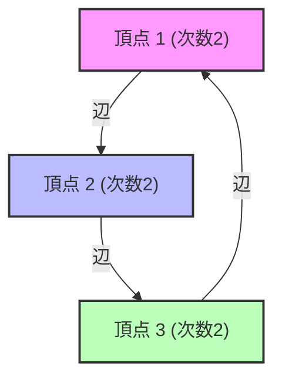

# Qu'est-ce que la théorie spectrale des graphes ?

Les réseaux sont omniprésents autour de nous. La structure des hyperliens d'Internet, les relations sur les réseaux sociaux, les réseaux électriques, et même les connexions des neurones dans le cerveau peuvent tous être modélisés sous forme de « graphes » (Graphs). La théorie spectrale des graphes (Spectral Graph Theory) représente ces graphes sous forme de « matrices » et utilise des concepts d'algèbre linéaire tels que les « valeurs propres » (Eigenvalues) et les « vecteurs propres » (Eigenvectors) pour clarifier les propriétés macro et micro cachées dans les réseaux.

Cet article explore ce domaine en profondeur, en commençant par les représentations matricielles de base, puis la signification physique des valeurs propres de la matrice laplacienne, l'inégalité de Cheeger qui est une pierre angulaire dans la partition de graphes, et enfin la preuve mathématique de l'algorithme PageRank, fondation de Google.

---

## 1. Représentation matricielle d'un graphe

Considérons un graphe $G = (V, E)$. Ici, $V$ est l'ensemble des sommets (nœuds) et $E$ est l'ensemble des arêtes (liens). Soit $n = |V|$ le nombre de nœuds. Pour manipuler la structure de ce graphe sous forme de formules mathématiques ou sur un ordinateur, nous définissons plusieurs matrices.

### Matrice d'adjacence (Adjacency Matrix)

La matrice d'adjacence $A$ est une matrice symétrique $n \times n$ où $A_{ij} = 1$ s'il y a une connexion (arête) entre le sommet $i$ et le sommet $j$, et $A_{ij} = 0$ sinon (dans le cas d'un graphe non orienté et non pondéré).

$$ A_{ij} = \begin{cases} 1 & \text{if } (i, j) \in E \\ 0 & \text{otherwise} \end{cases} $$

### Matrice des degrés (Degree Matrix)

La matrice des degrés $D$ est une matrice diagonale contenant le degré de chaque sommet (le nombre d'arêtes qui y sont connectées) sur ses éléments diagonaux.

$$ D_{ii} = \sum_{j} A_{ij} $$
$$ D_{ij} = 0 \quad (\text{if } i \neq j) $$

### Matrice laplacienne (Laplacian Matrix)

Pour analyser les propriétés d'un graphe, le « laplacien de graphe » est un outil encore plus puissant que la matrice d'adjacence. La matrice laplacienne $L$ est définie comme suit :

$$ L = D - A $$

La matrice laplacienne possède les excellentes propriétés suivantes :
1. **Symétrie** : Puisque $L$ est une matrice symétrique ($L = L^T$), toutes ses valeurs propres sont des nombres réels.
2. **Semi-définie positive** : Pour tout vecteur $x \in \mathbb{R}^n$, la forme quadratique $x^T L x$ peut être développée ainsi :
   $$ x^T L x = \sum_{(i,j) \in E} (x_i - x_j)^2 \geq 0 $$
   Cela montre que toutes les valeurs propres de $L$ sont supérieures ou égales à $0$ ($\lambda_0 \leq \lambda_1 \leq \dots \leq \lambda_{n-1}$).
3. **Valeur propre minimale** : On a toujours $\lambda_0 = 0$, et le vecteur propre correspondant est le vecteur $\mathbf{1}$ dont toutes les composantes sont $1$ ($L\mathbf{1} = (D-A)\mathbf{1} = \mathbf{0}$).



---

## 2. Signification physique des valeurs propres : Connectivité algébrique et vecteur de Fiedler

Les valeurs propres $\lambda_i$ de la matrice laplacienne $L$ expriment clairement la « forme » et la « connectivité » du graphe.

- **Multiplicité de $\lambda_0 = 0$** : Représente le nombre de composantes connexes (sous-graphes indépendants) dans lesquelles le graphe est divisé. S'il n'y a qu'un seul $\lambda_0 = 0$ (c'est-à-dire $\lambda_1 > 0$), cela signifie que le graphe est un réseau unique et connecté.
- **$\lambda_1$ (Connectivité algébrique, Algebraic Connectivity)** : La deuxième plus petite valeur propre $\lambda_1$ est un indicateur de la force de connexion du graphe, également appelée valeur de Fiedler. Plus cette valeur est grande, plus le graphe est densément connecté, et plus il est difficile de diviser le réseau en deux. Inversement, plus cette valeur est proche de 0, plus cela suggère l'existence d'un « goulot d'étranglement » où la simple coupure de quelques arêtes divise le graphe.
- **Vecteur de Fiedler** : Le vecteur propre correspondant à $\lambda_1$ est appelé vecteur de Fiedler. En observant le signe (positif ou négatif) des composantes de ce vecteur, nous pouvons naturellement diviser le graphe en deux clusters (c'est la base du partitionnement spectral ou spectral clustering).

### Analogie avec la conduction thermique et la marche aléatoire

En physique, l'opérateur laplacien $\nabla^2$ apparaît dans l'équation de la chaleur et l'équation des ondes. La matrice laplacienne $L$ sur un graphe joue exactement le même rôle. Si l'on attribue de la « chaleur » à chaque nœud, elle se diffuse à travers les arêtes. La connectivité algébrique $\lambda_1$ détermine la rapidité avec laquelle cette chaleur s'uniformise à travers tout le réseau (temps de relaxation).

---

## 3. Inégalité de Cheeger (Cheeger's Inequality)

La « constante de Cheeger » (Cheeger constant, Isoperimetric number) $h_G$ est un indicateur géométrique mesurant la facilité de division d'un graphe. C'est la valeur minimale obtenue en divisant le graphe en deux sous-ensembles $S$ et $V \setminus S$, et en divisant le nombre d'arêtes les reliant par la taille (ou volume) du plus petit des deux ensembles.

$$ h_G = \min_{S \subset V, 0 < |S| \leq n/2} \frac{|E(S, V \setminus S)|}{|S|} $$

Un $h_G$ petit signifie qu'il existe un « goulot d'étranglement » permettant de détacher un grand cluster en coupant seulement quelques arêtes. Cependant, le calcul exact de $h_G$ est un problème NP-difficile.

C'est ici qu'intervient l'« inégalité de Cheeger », l'un des plus grands résultats de la théorie spectrale des graphes. Ce théorème relie la quantité géométrique $h_G$ et la quantité algébrique $\lambda_1$.

$$ \frac{\lambda_1}{2} \leq h_G \leq \sqrt{2 \lambda_1 \Delta} $$

(※ $\Delta$ est le degré maximum du graphe)

Grâce à cette inégalité, il suffit de calculer la valeur propre $\lambda_1$ (ce qui est possible en temps polynomial) pour garantir l'existence d'un goulot d'étranglement dans le graphe. L'inégalité de gauche montre que si la connectivité algébrique est grande, il n'y a pas de goulot d'étranglement, tandis que l'inégalité de droite montre que si la connectivité algébrique est petite, il existe nécessairement une bonne partition (un goulot d'étranglement).

---

## 4. Chaîne de Markov et preuve mathématique du PageRank de Google

L'une des applications les plus célèbres de la théorie spectrale des graphes est l'algorithme PageRank, qui a soutenu le moteur de recherche de Google. Il considère le Web comme un graphe orienté géant et se ramène au problème de trouver la distribution stationnaire d'une [marche aléatoire](/fr/p/random-walk/).

### Matrice de transition de probabilité (Transition Matrix)

Soit $A$ la matrice d'adjacence d'un graphe orienté, et $d_i^{out}$ le degré sortant de chaque nœud. La matrice de transition de probabilité $P$ est définie comme suit :

$$ P_{ij} = \begin{cases} \frac{1}{d_i^{out}} & \text{if } (i,j) \in E \\ 0 & \text{otherwise} \end{cases} $$

Si l'on définit le vecteur ligne $\pi$ comme la distribution de probabilité des états, la distribution après une étape est $\pi P$. La limite (distribution stationnaire) après un nombre infini d'étapes est le $\pi$ qui satisfait $\pi = \pi P$. Ce n'est rien d'autre que le vecteur propre à gauche de la matrice $P$ (correspondant à la valeur propre 1).

### Théorème de Perron-Frobenius (Perron-Frobenius Theorem)

Le « théorème de Perron-Frobenius » garantit que cette distribution stationnaire est unique et calculable. Cependant, le graphe réel du Web n'est pas fortement connexe (il contient par exemple des pages sans issue), et ne satisfait donc pas les conditions de ce théorème.

Pour y remédier, Larry Page et Sergey Brin ont introduit un « facteur d'amortissement » (Damping Factor) $d \approx 0.85$. Ils ont supposé qu'un utilisateur suit un lien avec une probabilité $d$ et saute vers une page complètement aléatoire avec une probabilité $1-d$.

La matrice de transition modifiée $\tilde{P}$ est exprimée ainsi :

$$ \tilde{P} = d P + \frac{1-d}{n} \mathbf{1}\mathbf{1}^T $$

Comme tous les éléments de cette matrice $\tilde{P}$ sont positifs (matrice positive), le théorème de Perron-Frobenius est parfaitement applicable.

1. **La valeur propre maximale est strictement 1**, et sa multiplicité est de 1.
2. Le vecteur propre à gauche correspondant $\pi$ a toutes ses composantes positives, et ceci constitue le PageRank (l'importance) de chaque page.
3. Les valeurs absolues de toutes les autres valeurs propres sont strictement inférieures à 1, de sorte que la méthode de la puissance (Power Iteration) $\pi^{(k+1)} = \pi^{(k)} \tilde{P}$ convergera toujours vers la distribution stationnaire $\pi$, quel que soit l'état initial.

Grâce à cette brillante modification mathématique, le PageRank est devenu un algorithme calculable et stable.

---

## 5. Exemple de code d'analyse spectrale en Python (NetworkX)

Pour mettre la théorie en pratique, implémentons un partitionnement spectral basé sur le vecteur de Fiedler en calculant les valeurs propres de la matrice laplacienne d'un graphe, en utilisant les bibliothèques `NetworkX`, `NumPy` et `SciPy` en Python.

```python
import networkx as nx
import numpy as np
import matplotlib.pyplot as plt
from scipy.linalg import eigh

# 1. カラテクラブのネットワークデータを読み込む
G = nx.karate_club_graph()

# 2. ラプラシアン行列の取得
L = nx.laplacian_matrix(G).todense()

# 3. 固有値分解 (scipy.linalg.eigh は対称行列に最適化されている)
eigenvalues, eigenvectors = eigh(L)

# 4. 第2固有値（代数的連結度）とFiedlerベクトルの取得
lambda_1 = eigenvalues[1]
fiedler_vector = eigenvectors[:, 1]

print(f"代数的連結度 (lambda_1): {lambda_1:.4f}")

# 5. Fiedlerベクトルに基づくグラフの2分割（スペクトルクラスタリング）
cluster_1 = [i for i, val in enumerate(fiedler_vector) if val < 0]
cluster_2 = [i for i, val in enumerate(fiedler_vector) if val >= 0]

# 6. 結果の可視化
plt.figure(figsize=(10, 7))
pos = nx.spring_layout(G, seed=42)
nx.draw_networkx_nodes(G, pos, nodelist=cluster_1, node_color='lightblue', label='Cluster 1')
nx.draw_networkx_nodes(G, pos, nodelist=cluster_2, node_color='lightgreen', label='Cluster 2')
nx.draw_networkx_edges(G, pos, alpha=0.5)
nx.draw_networkx_labels(G, pos, font_size=10)
plt.title(f"Spectral Clustering based on Fiedler Vector (λ1 = {lambda_1:.4f})")
plt.legend()
plt.axis('off')
plt.show()
```

En exécutant ce code, on peut confirmer que le célèbre réseau du club de karaté de Zachary est brillamment divisé en deux factions simplement en regardant le signe (positif ou négatif) du vecteur de Fiedler. C'est le moment où la structure complexe d'un réseau est résolue par une simple opération algébrique : les vecteurs propres d'une matrice.

---

## Conclusion

La théorie spectrale des graphes est un pont magnifique entre le monde mathématique discret de la [théorie des graphes](/fr/p/graph-theory-dijkstra-a-star/) et le monde mathématique continu de l'algèbre linéaire. Une seule valeur, la valeur propre d'une matrice, capture avec précision les structures macroscopiques telles que la connectivité de l'ensemble du réseau et l'existence de goulots d'étranglement, et soutient l'infrastructure informationnelle de la société moderne à travers des algorithmes comme le PageRank.

Même les réseaux complexes que nous voyons tous les jours révèlent leur ordre caché et leurs lois lorsqu'on les observe à travers le spectre (distribution des valeurs propres) de leurs matrices.
