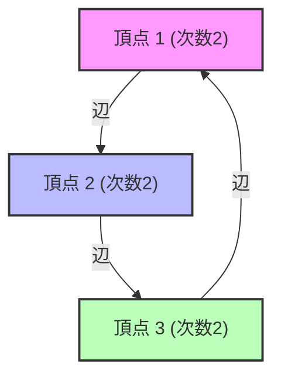

# स्पेक्ट्रल ग्राफ थ्योरी क्या है?

हमारे चारों ओर नेटवर्क मौजूद हैं। इंटरनेट की हाइपरलिंक संरचना, सोशल मीडिया पर दोस्ती के रिश्ते, पावर ग्रिड और यहाँ तक कि मस्तिष्क में न्यूरॉन्स के कनेक्शन को "ग्राफ (Graph)" के रूप में मॉडल किया जा सकता है। स्पेक्ट्रल ग्राफ थ्योरी (Spectral Graph Theory) इन ग्राफ़ों को "मैट्रिक्स" के रूप में व्यक्त करने और रैखिक बीजगणित (linear algebra) की अवधारणाओं, जैसे "आइगेनवैल्यू (Eigenvalues)" और "आइगेनवेक्टर (Eigenvectors)", का उपयोग करके नेटवर्क में छिपे मैक्रो और माइक्रो गुणों को प्रकट करने का क्षेत्र है।

इस लेख में, हम बुनियादी मैट्रिक्स निरूपण (matrix representation) से शुरू करके, लाप्लासियन मैट्रिक्स के आइगेनवैल्यू के भौतिक अर्थ, ग्राफ विभाजन में एक मील का पत्थर "चीगर की असमानता (Cheeger's inequality)", और Google की नींव बनाने वाले PageRank एल्गोरिदम के गणितीय प्रमाण तक बहुत गहराई से चर्चा करेंगे।

---

## 1. ग्राफ का मैट्रिक्स निरूपण (Matrix Representation of a Graph)

मान लीजिए कि एक ग्राफ $G = (V, E)$ है। यहाँ, $V$ शीर्षों (नोड्स) का सेट है, और $E$ किनारों (एज) का सेट है। नोड्स की संख्या $n = |V|$ मान लेते हैं। इस ग्राफ की संरचना को कंप्यूटर या गणितीय सूत्र के रूप में संभालने के लिए, हम कुछ मैट्रिक्स को परिभाषित करते हैं।

### आसन्न मैट्रिक्स (Adjacency Matrix)

आसन्न मैट्रिक्स $A$ एक $n \times n$ सममित मैट्रिक्स (symmetric matrix) है, जहाँ यदि शीर्ष $i$ और $j$ के बीच एक कनेक्शन (किनारा) है तो $A_{ij} = 1$ होता है, और अन्यथा $A_{ij} = 0$ होता है (बिना वजन वाले अदिष्ट ग्राफ के मामले में)।

$$ A_{ij} = \begin{cases} 1 & \text{if } (i, j) \in E \\ 0 & \text{otherwise} \end{cases} $$

### डिग्री मैट्रिक्स (Degree Matrix)

डिग्री मैट्रिक्स $D$ एक विकर्ण मैट्रिक्स (diagonal matrix) है, जिसके विकर्ण तत्वों (diagonal elements) में प्रत्येक शीर्ष की डिग्री (जुड़े हुए किनारों की संख्या) होती है।

$$ D_{ii} = \sum_{j} A_{ij} $$
$$ D_{ij} = 0 \quad (\text{if } i \neq j) $$

### लाप्लासियन मैट्रिक्स (Laplacian Matrix)

ग्राफ के गुणों का विश्लेषण करने में, आसन्न मैट्रिक्स से भी अधिक शक्तिशाली उपकरण "ग्राफ लाप्लासियन" है। लाप्लासियन मैट्रिक्स $L$ को इस प्रकार परिभाषित किया गया है:

$$ L = D - A $$

लाप्लासियन मैट्रिक्स में निम्नलिखित शानदार गुण होते हैं:
1. **सममिति (Symmetry)**: चूँकि $L$ एक सममित मैट्रिक्स ($L = L^T$) है, इसके सभी आइगेनवैल्यू वास्तविक संख्याएँ होते हैं।
2. **अर्ध-सकारात्मक निश्चितता (Positive Semi-definiteness)**: किसी भी सदिश $x \in \mathbb{R}^n$ के लिए, द्विघात रूप $x^T L x$ को इस प्रकार विस्तारित किया जा सकता है:
   $$ x^T L x = \sum_{(i,j) \in E} (x_i - x_j)^2 \geq 0 $$
   इससे यह पता चलता है कि $L$ के सभी आइगेनवैल्यू $0$ या उससे अधिक हैं ($\lambda_0 \leq \lambda_1 \leq \dots \leq \lambda_{n-1}$)।
3. **न्यूनतम आइगेनवैल्यू**: हमेशा $\lambda_0 = 0$ होता है, और इसके संगत आइगेनवेक्टर वह वेक्टर $\mathbf{1}$ होता है जिसके सभी घटक $1$ होते हैं ($L\mathbf{1} = (D-A)\mathbf{1} = \mathbf{0}$)।



---

## 2. आइगेनवैल्यू का भौतिक अर्थ: बीजीय कनेक्टिविटी और फिएडलर वेक्टर

लाप्लासियन मैट्रिक्स $L$ के आइगेनवैल्यू $\lambda_i$ स्पष्ट रूप से ग्राफ के "आकार" और "कनेक्टिविटी" को दर्शाते हैं।

- **$\lambda_0 = 0$ की बहुलता (Multiplicity)**: यह दर्शाता है कि ग्राफ कितने जुड़े हुए घटकों (स्वतंत्र उप-ग्राफ़) में विभाजित है। यदि $\lambda_0 = 0$ केवल एक है (यानी $\lambda_1 > 0$), तो इसका मतलब है कि ग्राफ एक एकल जुड़ा हुआ नेटवर्क है।
- **$\lambda_1$ (बीजीय कनेक्टिविटी, Algebraic Connectivity)**: दूसरा सबसे छोटा आइगेनवैल्यू $\lambda_1$ ग्राफ के कनेक्शन की ताकत का सूचक है, और इसे फिएडलर वैल्यू (Fiedler value) भी कहा जाता है। यह मान जितना बड़ा होगा, ग्राफ उतना ही घनीभूत रूप से जुड़ा होगा, और नेटवर्क को दो हिस्सों में विभाजित करना उतना ही कठिन होगा। इसके विपरीत, यदि यह मान 0 के करीब है, तो यह दर्शाता है कि एक "अड़चन (bottleneck)" मौजूद है जहाँ केवल कुछ किनारों को काटकर ग्राफ को विभाजित किया जा सकता है।
- **फिएडलर वेक्टर (Fiedler vector)**: $\lambda_1$ के संगत आइगेनवेक्टर को फिएडलर वेक्टर कहा जाता है। इस वेक्टर के घटकों के चिह्न (सकारात्मक या नकारात्मक) को देखकर, ग्राफ को स्वाभाविक रूप से दो समूहों (clusters) में विभाजित किया जा सकता है (स्पेक्ट्रल क्लस्टरिंग का आधार)।

### ऊष्मा चालन और रैंडम वॉक की समानता

भौतिकी में, लाप्लासियन ऑपरेटर $\nabla^2$ ऊष्मा चालन समीकरणों और तरंग समीकरणों में प्रकट होता है। ग्राफ़ पर लाप्लासियन मैट्रिक्स $L$ भी बिल्कुल यही भूमिका निभाता है। यदि हम मानते हैं कि प्रत्येक नोड में "ऊष्मा" है, तो ऊष्मा किनारों के माध्यम से फैल जाएगी। बीजीय कनेक्टिविटी $\lambda_1$ यह निर्धारित करती है कि यह ऊष्मा पूरे नेटवर्क में कितनी जल्दी समान हो जाती है (छूट का समय, relaxation time)।

---

## 3. चीगर की असमानता (Cheeger's Inequality)

ग्राफ के विभाजित होने की आसानी को मापने के लिए एक ज्यामितीय मीट्रिक के रूप में "चीगर स्थिरांक (Cheeger constant, Isoperimetric number)" $h_G$ है। यह न्यूनतम मान है जो तब प्राप्त होता है जब ग्राफ को दो उपसमुच्चयों $S$ और $V \setminus S$ में विभाजित किया जाता है, और उनके बीच जुड़ने वाले किनारों की संख्या को छोटे समूह के आकार (या आयतन) से विभाजित किया जाता है।

$$ h_G = \min_{S \subset V, 0 < |S| \leq n/2} \frac{|E(S, V \setminus S)|}{|S|} $$

यदि $h_G$ छोटा है, तो इसका मतलब है कि एक "अड़चन" मौजूद है जहाँ एक बड़े क्लस्टर को केवल कुछ किनारों को काटकर अलग किया जा सकता है। हालाँकि, $h_G$ की सटीक गणना करना एक NP-कठिन (NP-hard) समस्या है।

यहाँ स्पेक्ट्रल ग्राफ थ्योरी की सबसे बड़ी उपलब्धियों में से एक "चीगर की असमानता" आती है। यह प्रमेय ज्यामितीय मात्रा $h_G$ और बीजीय मात्रा $\lambda_1$ को जोड़ता है।

$$ \frac{\lambda_1}{2} \leq h_G \leq \sqrt{2 \lambda_1 \Delta} $$

(※ $\Delta$ ग्राफ की अधिकतम डिग्री है)

इस असमानता के कारण, केवल आइगेनवैल्यू $\lambda_1$ की गणना करके (जो बहुपद समय में संभव है), हम ग्राफ में एक अड़चन के अस्तित्व की गारंटी दे सकते हैं। बाईं ओर की असमानता दर्शाती है कि यदि बीजीय कनेक्टिविटी बड़ी है, तो कोई अड़चन नहीं है, और दाईं ओर की असमानता दर्शाती है कि यदि बीजीय कनेक्टिविटी छोटी है, तो हमेशा एक अच्छा विभाजन (अड़चन) मौजूद होता है।

---

## 4. मार्कोव चेन और Google PageRank का गणितीय प्रमाण

स्पेक्ट्रल ग्राफ थ्योरी के सबसे प्रसिद्ध अनुप्रयोगों में से एक PageRank एल्गोरिदम है जिसने Google के खोज इंजन को शक्ति प्रदान की। यह वेब को एक विशाल निर्देशित ग्राफ (directed graph) के रूप में मानता है और [रैंडम वॉक](/hi/p/random-walk/) के स्थिर वितरण (stationary distribution) को खोजने की समस्या में बदल जाता है।

### संक्रमण संभावना मैट्रिक्स (Transition Matrix)

मान लें कि निर्देशित ग्राफ का आसन्न मैट्रिक्स $A$ है, और प्रत्येक नोड से आउट-डिग्री $d_i^{out}$ है। संक्रमण संभावना मैट्रिक्स $P$ को इस प्रकार परिभाषित किया गया है:

$$ P_{ij} = \begin{cases} \frac{1}{d_i^{out}} & \text{if } (i,j) \in E \\ 0 & \text{otherwise} \end{cases} $$

यदि पंक्ति सदिश (row vector) $\pi$ राज्य संभावना वितरण (state probability distribution) है, तो 1 चरण के बाद वितरण $\pi P$ होगा। अनंत चरणों के बाद की सीमा (स्थिर वितरण) $\pi$ है जो $\pi = \pi P$ को संतुष्ट करती है। यह मैट्रिक्स $P$ के बाएं आइगेनवेक्टर (आइगेनवैल्यू 1 के अनुरूप) के अलावा और कुछ नहीं है।

### पेरोन-फ्रोबेनियस प्रमेय (Perron-Frobenius Theorem)

यह "पेरोन-फ्रोबेनियस प्रमेय" है जो गारंटी देता है कि यह स्थिर वितरण विशिष्ट रूप से निर्धारित है और गणना योग्य है। हालाँकि, वास्तविक वेब ग्राफ़ दृढ़ता से जुड़े नहीं हैं (जैसे डेड-एंड पेज होते हैं), और वे इस प्रमेय की शर्तों को पूरा नहीं करते हैं।

इसलिए, लैरी पेज और सर्गेई ब्रिन ने "डंपिंग फैक्टर (Damping Factor)" $d \approx 0.85$ पेश किया। यह माना जाता है कि उपयोगकर्ता $d$ की संभावना के साथ लिंक का अनुसरण करता है, और $1-d$ की संभावना के साथ पूरी तरह से यादृच्छिक पृष्ठ पर छलांग लगाता है।

संशोधित संक्रमण मैट्रिक्स $\tilde{P}$ इस प्रकार व्यक्त किया जाता है:

$$ \tilde{P} = d P + \frac{1-d}{n} \mathbf{1}\mathbf{1}^T $$

चूँकि इस मैट्रिक्स $\tilde{P}$ के सभी घटक सकारात्मक (positive matrix) हैं, पेरोन-फ्रोबेनियस प्रमेय पूरी तरह से लागू हो जाता है।

1. **सबसे बड़ा आइगेनवैल्यू कड़ाई से 1 है**, और इसकी बहुलता 1 है।
2. संबंधित बायां आइगेनवेक्टर $\pi$ में सभी सकारात्मक घटक हैं, और यह प्रत्येक पृष्ठ का PageRank (महत्व) बन जाता है।
3. अन्य सभी आइगेनवैल्यू का निरपेक्ष मान (absolute value) कड़ाई से 1 से कम है, इसलिए पावर इटरेशन (Power Iteration) $\pi^{(k+1)} = \pi^{(k)} \tilde{P}$ हमेशा प्रारंभिक स्थिति की परवाह किए बिना स्थिर वितरण $\pi$ में परिवर्तित (converge) होगा।

इस शानदार गणितीय संशोधन के साथ, PageRank एक गणना योग्य और स्थिर एल्गोरिदम बन गया।

---

## 5. Python (NetworkX) का उपयोग करके स्पेक्ट्रल विश्लेषण का कोड उदाहरण

सिद्धांत को व्यवहार में लाने के लिए, आइए ग्राफ के लाप्लासियन मैट्रिक्स के आइगेनवैल्यू की गणना करने के लिए पायथन की ग्राफ नेटवर्क लाइब्रेरी `NetworkX`, `NumPy` और `SciPy` का उपयोग करें, और फिएडलर वेक्टर का उपयोग करके स्पेक्ट्रल क्लस्टरिंग लागू करें।

```python
import networkx as nx
import numpy as np
import matplotlib.pyplot as plt
from scipy.linalg import eigh

# 1. カラテクラブのネットワークデータを読み込む
G = nx.karate_club_graph()

# 2. ラプラシアン行列の取得
L = nx.laplacian_matrix(G).todense()

# 3. 固有値分解 (scipy.linalg.eigh は対称行列に最適化されている)
eigenvalues, eigenvectors = eigh(L)

# 4. 第2固有値（代数的連結度）とFiedlerベクトルの取得
lambda_1 = eigenvalues[1]
fiedler_vector = eigenvectors[:, 1]

print(f"代数的連結度 (lambda_1): {lambda_1:.4f}")

# 5. Fiedlerベクトルに基づくグラフの2分割（スペクトルクラスタリング）
cluster_1 = [i for i, val in enumerate(fiedler_vector) if val < 0]
cluster_2 = [i for i, val in enumerate(fiedler_vector) if val >= 0]

# 6. 結果の可視化
plt.figure(figsize=(10, 7))
pos = nx.spring_layout(G, seed=42)
nx.draw_networkx_nodes(G, pos, nodelist=cluster_1, node_color='lightblue', label='Cluster 1')
nx.draw_networkx_nodes(G, pos, nodelist=cluster_2, node_color='lightgreen', label='Cluster 2')
nx.draw_networkx_edges(G, pos, alpha=0.5)
nx.draw_networkx_labels(G, pos, font_size=10)
plt.title(f"Spectral Clustering based on Fiedler Vector (λ1 = {lambda_1:.4f})")
plt.legend()
plt.axis('off')
plt.show()
```

जब आप इस कोड को चलाते हैं, तो आप देख सकते हैं कि ज़ाचरी (Zachary) का प्रसिद्ध कराटे क्लब नेटवर्क केवल फिएडलर वेक्टर के चिह्न (सकारात्मक या नकारात्मक) से दो गुटों में खूबसूरती से विभाजित हो गया है। यह वह क्षण है जब जटिल नेटवर्क संरचनाओं को केवल मैट्रिक्स के आइगेनवेक्टर के बीजगणितीय संचालन के साथ सुलझाया जाता है।

---

## निष्कर्ष

स्पेक्ट्रल ग्राफ थ्योरी ग्राफ थ्योरी की असतत गणितीय (discrete mathematics) दुनिया और रैखिक बीजगणित की निरंतर गणितीय (continuous mathematics) दुनिया को जोड़ने वाला एक शानदार पुल है। मैट्रिक्स का आइगेनवैल्यू, जो कि केवल एक संख्या है, सटीक रूप से मैक्रो संरचनाओं को पकड़ता है जैसे कि पूरे नेटवर्क की कनेक्टिविटी और अड़चनों का अस्तित्व, और PageRank जैसे एल्गोरिदम के माध्यम से आधुनिक समाज के सूचना बुनियादी ढांचे (information infrastructure) का समर्थन करता है।

यदि हम मैट्रिक्स के स्पेक्ट्रम (आइगेनवैल्यू के वितरण) के माध्यम से उन जटिल नेटवर्क को देखते हैं जिन्हें हम हर दिन देखते हैं, तो उनमें छिपी व्यवस्था और नियम उभर कर सामने आते हैं।
