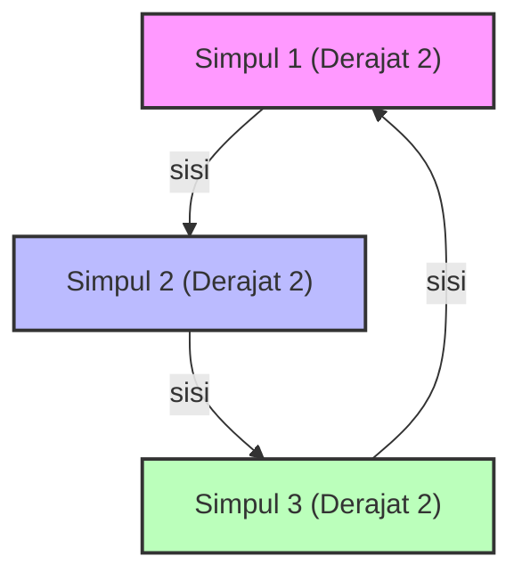

# Apa itu Teori Graf Spektral?

Di sekitar kita, jaringan (network) bertebaran di mana-mana. Struktur hyperlink internet, hubungan pertemanan di media sosial, jaringan listrik, hingga koneksi sel saraf di otak, semuanya dapat dimodelkan sebagai "Graf" (Graph). [Teori Graf](/id/p/graph-theory-dijkstra-a-star/) Spektral (Spectral Graph Theory) adalah bidang yang merepresentasikan graf-graf ini sebagai "matriks" dan menggunakan konsep aljabar linear seperti "Nilai Eigen" (Eigenvalues) dan "Vektor Eigen" (Eigenvectors) untuk mengungkap sifat makro dan mikro yang tersembunyi dalam sebuah jaringan.

Dalam artikel ini, kita akan membahas secara mendalam, mulai dari representasi matriks dasar, makna fisik dari nilai eigen matriks Laplacian, Ketaksamaan Cheeger (Cheeger's inequality) yang menjadi tonggak penting dalam partisi graf, hingga pembuktian matematis algoritma PageRank yang menjadi fondasi Google.

---

## 1. Representasi Matriks dari Graf

Mari kita pertimbangkan graf $G = (V, E)$. Di sini, $V$ adalah himpunan simpul (node/vertex), dan $E$ adalah himpunan sisi (edge). Misalkan jumlah simpul adalah $n = |V|$. Untuk menangani struktur graf ini sebagai persamaan matematis atau di dalam komputer, kita mendefinisikan beberapa matriks.

### Matriks Kedekatan (Adjacency Matrix)

Matriks kedekatan $A$ adalah matriks simetris berukuran $n \times n$, di mana $A_{ij} = 1$ jika ada hubungan (sisi) antara simpul $i$ dan $j$, dan $A_{ij} = 0$ jika tidak ada (dalam kasus graf tak berarah tanpa bobot).

$$ A_{ij} = \begin{cases} 1 & \text{if } (i, j) \in E \\ 0 & \text{otherwise} \end{cases} $$

### Matriks Derajat (Degree Matrix)

Matriks derajat $D$ adalah matriks diagonal, di mana elemen diagonalnya adalah derajat (jumlah sisi yang terhubung) dari setiap simpul.

$$ D_{ii} = \sum_{j} A_{ij} $$
$$ D_{ij} = 0 \quad (\text{if } i \neq j) $$

### Matriks Laplacian (Laplacian Matrix)

Untuk menganalisis sifat graf, alat yang lebih kuat daripada matriks kedekatan adalah "Graf Laplacian". Matriks Laplacian $L$ didefinisikan sebagai berikut:

$$ L = D - A $$

Matriks Laplacian memiliki sifat-sifat luar biasa berikut ini:
1. **Simetri**: Karena $L$ adalah matriks simetris ($L = L^T$), semua nilai eigennya adalah bilangan real.
2. **Semidefinit Positif**: Untuk setiap vektor $x \in \mathbb{R}^n$, bentuk kuadratik $x^T L x$ dapat diekspansi sebagai berikut:
   $$ x^T L x = \sum_{(i,j) \in E} (x_i - x_j)^2 \geq 0 $$
   Hal ini menunjukkan bahwa semua nilai eigen dari $L$ bernilai $0$ atau lebih ($\lambda_0 \leq \lambda_1 \leq \dots \leq \lambda_{n-1}$).
3. **Nilai Eigen Terkecil**: Selalu berlaku $\lambda_0 = 0$, dan vektor eigen yang berkorespondensi adalah vektor $\mathbf{1}$ yang semua komponennya bernilai $1$ ($L\mathbf{1} = (D-A)\mathbf{1} = \mathbf{0}$).



---

## 2. Makna Fisik Nilai Eigen: Konektivitas Aljabar dan Vektor Fiedler

Nilai eigen $\lambda_i$ dari matriks Laplacian $L$ secara jelas menunjukkan "bentuk" dan "kemudahan koneksi" dari graf.

- **Multiplisitas dari $\lambda_0 = 0$**: Menunjukkan berapa banyak komponen terhubung (subgraf independen) yang dimiliki graf. Jika hanya ada satu $\lambda_0 = 0$ (artinya $\lambda_1 > 0$), berarti graf tersebut adalah satu jaringan terhubung.
- **$\lambda_1$ (Konektivitas Aljabar, Algebraic Connectivity)**: Nilai eigen terkecil kedua $\lambda_1$ adalah indikator kekuatan koneksi graf, yang juga dikenal sebagai nilai Fiedler. Semakin besar nilai ini, semakin terhubung erat graf tersebut, membuatnya sulit untuk diputus menjadi dua jaringan. Sebaliknya, semakin mendekati 0, ini mengindikasikan adanya "bottleneck" (leher botol) di mana graf dapat dipisahkan hanya dengan memotong sedikit sisi.
- **Vektor Fiedler**: Vektor eigen yang berkorespondensi dengan $\lambda_1$ disebut vektor Fiedler. Dengan melihat tanda (positif atau negatif) dari komponen vektor ini, graf secara alami dapat dipartisi menjadi dua kluster (dasar dari clustering spektral).

### Analogi Konduksi Panas dan Random Walk

Dalam fisika, operator Laplacian $\nabla^2$ muncul pada persamaan konduksi panas dan persamaan gelombang. Matriks Laplacian $L$ pada graf memainkan peran yang persis sama. Jika kita memberikan "panas" pada setiap simpul, panas tersebut akan menyebar melalui sisi-sisi. Konektivitas aljabar $\lambda_1$ menentukan seberapa cepat panas tersebut menyebar secara merata ke seluruh jaringan (waktu relaksasi).

---

## 3. Ketaksamaan Cheeger (Cheeger's Inequality)

Sebagai indikator geometris untuk mengukur seberapa mudah graf dipisahkan, terdapat "Konstanta Cheeger (Cheeger constant, Isoperimetric number)" $h_G$. Nilai ini adalah nilai minimum ketika membagi graf menjadi dua himpunan bagian $S$ dan $V \setminus S$, dari jumlah sisi yang menghubungkan keduanya dibagi dengan ukuran (atau volume) dari himpunan yang lebih kecil.

$$ h_G = \min_{S \subset V, 0 < |S| \leq n/2} \frac{|E(S, V \setminus S)|}{|S|} $$

Nilai $h_G$ yang kecil berarti ada "bottleneck" di mana kita bisa memisahkan kluster besar dengan hanya memotong sedikit sisi. Namun, menghitung $h_G$ secara pasti adalah masalah NP-hard.

Di sinilah salah satu pencapaian terbesar [teori graf](/id/p/graph-theory-dijkstra-a-star/) spektral, yaitu "Ketaksamaan Cheeger", berperan. Teorema ini menghubungkan besaran geometris $h_G$ dengan besaran aljabar $\lambda_1$.

$$ \frac{\lambda_1}{2} \leq h_G \leq \sqrt{2 \lambda_1 \Delta} $$

(* $\Delta$ adalah derajat maksimum dari graf)

Berkat ketaksamaan ini, hanya dengan menghitung nilai eigen $\lambda_1$ (yang dapat dilakukan dalam waktu polinomial), kita dapat menjamin keberadaan bottleneck pada graf. Ketaksamaan di sebelah kiri menunjukkan bahwa jika konektivitas aljabarnya besar, maka tidak ada bottleneck; sedangkan ketaksamaan di sebelah kanan menunjukkan bahwa jika konektivitas aljabarnya kecil, maka pasti terdapat partisi yang baik (bottleneck).

---

## 4. Rantai Markov dan Pembuktian Matematis Google PageRank

Aplikasi paling terkenal dari [teori graf](/id/p/graph-theory-dijkstra-a-star/) spektral adalah algoritma PageRank yang mendasari mesin pencari Google. Masalah ini direduksi menjadi mencari distribusi stasioner dari random walk, dengan menganggap web sebagai graf berarah raksasa.

### Matriks Transisi Probabilitas (Transition Matrix)

Misalkan matriks kedekatan graf berarah adalah $A$, dan out-degree (derajat keluar) dari setiap simpul adalah $d_i^{out}$. Matriks transisi probabilitas $P$ didefinisikan sebagai berikut:

$$ P_{ij} = \begin{cases} \frac{1}{d_i^{out}} & \text{if } (i,j) \in E \\ 0 & \text{otherwise} \end{cases} $$

Jika vektor baris $\pi$ adalah distribusi probabilitas keadaan, maka distribusi setelah 1 langkah adalah $\pi P$. Limit setelah langkah tak berhingga (distribusi stasioner) adalah $\pi$ yang memenuhi $\pi = \pi P$. Ini tidak lain adalah vektor eigen kiri dari matriks $P$ (berkorespondensi dengan nilai eigen 1).

### Teorema Perron-Frobenius (Perron-Frobenius Theorem)

Teorema Perron-Frobenius menjamin bahwa distribusi stasioner ini unik dan dapat dihitung. Namun, graf web nyata tidak terhubung kuat (misalnya, ada halaman buntu), sehingga tidak memenuhi syarat teorema ini.

Oleh karena itu, Larry Page dan Sergey Brin memperkenalkan "Damping Factor" $d \approx 0.85$. Diasumsikan pengguna akan mengikuti tautan dengan probabilitas $d$, dan melompat ke halaman yang sepenuhnya acak dengan probabilitas $1-d$.

Matriks transisi yang telah dimodifikasi $\tilde{P}$ dinyatakan sebagai berikut:

$$ \tilde{P} = d P + \frac{1-d}{n} \mathbf{1}\mathbf{1}^T $$

Karena semua elemen matriks $\tilde{P}$ ini positif (matriks positif), Teorema Perron-Frobenius dapat diterapkan sepenuhnya.

1. **Nilai eigen terbesarnya tepat 1**, dengan multiplisitas 1.
2. Vektor eigen kiri yang berkorespondensi $\pi$ memiliki semua komponen positif, dan inilah PageRank (tingkat kepentingan) dari setiap halaman.
3. Nilai mutlak dari semua nilai eigen lainnya benar-benar kurang dari 1, sehingga metode pangkat (Power Iteration) $\pi^{(k+1)} = \pi^{(k)} \tilde{P}$ akan selalu konvergen ke distribusi stasioner $\pi$, apa pun keadaan awalnya.

Melalui modifikasi matematis yang brilian ini, PageRank menjadi algoritma yang dapat dihitung dan stabil.

---

## 5. Contoh Kode Analisis Spektral Menggunakan Python (NetworkX)

Untuk mempraktikkan teori tersebut, mari kita implementasikan perhitungan nilai eigen dari matriks Laplacian sebuah graf, dan clustering spektral menggunakan vektor Fiedler, dengan library jaringan graf Python `NetworkX`, `NumPy`, dan `SciPy`.

```python
import networkx as nx
import numpy as np
import matplotlib.pyplot as plt
from scipy.linalg import eigh

# 1. Memuat data jaringan Karate Club
G = nx.karate_club_graph()

# 2. Mendapatkan Matriks Laplacian
L = nx.laplacian_matrix(G).todense()

# 3. Dekomposisi nilai eigen (scipy.linalg.eigh dioptimalkan untuk matriks simetris)
eigenvalues, eigenvectors = eigh(L)

# 4. Mendapatkan nilai eigen ke-2 (konektivitas aljabar) dan vektor Fiedler
lambda_1 = eigenvalues[1]
fiedler_vector = eigenvectors[:, 1]

print(f"Konektivitas Aljabar (lambda_1): {lambda_1:.4f}")

# 5. Partisi 2 graf berdasarkan vektor Fiedler (Clustering Spektral)
cluster_1 = [i for i, val in enumerate(fiedler_vector) if val < 0]
cluster_2 = [i for i, val in enumerate(fiedler_vector) if val >= 0]

# 6. Visualisasi Hasil
plt.figure(figsize=(10, 7))
pos = nx.spring_layout(G, seed=42)
nx.draw_networkx_nodes(G, pos, nodelist=cluster_1, node_color='lightblue', label='Cluster 1')
nx.draw_networkx_nodes(G, pos, nodelist=cluster_2, node_color='lightgreen', label='Cluster 2')
nx.draw_networkx_edges(G, pos, alpha=0.5)
nx.draw_networkx_labels(G, pos, font_size=10)
plt.title(f"Spectral Clustering based on Fiedler Vector (λ1 = {lambda_1:.4f})")
plt.legend()
plt.axis('off')
plt.show()
```

Saat kode ini dijalankan, Anda dapat memastikan bahwa jaringan Karate Club Zachary yang terkenal secara sempurna terbagi menjadi dua faksi hanya dari tanda (positif atau negatif) dari vektor Fiedler. Ini adalah momen di mana struktur jaringan yang kompleks diungkap hanya melalui operasi aljabar yaitu vektor eigen dari sebuah matriks.

---

## Kesimpulan

[Teori graf](/id/p/graph-theory-dijkstra-a-star/) spektral adalah jembatan luar biasa yang menghubungkan dunia matematika diskrit yaitu [teori graf](/id/p/graph-theory-dijkstra-a-star/), dengan dunia matematika kontinu yaitu aljabar linear. Satu nilai dari matriks, yaitu nilai eigen, secara akurat menangkap struktur makro seperti konektivitas keseluruhan jaringan atau keberadaan bottleneck, serta mendukung infrastruktur informasi masyarakat modern melalui algoritma seperti PageRank.

Bahkan jaringan kompleks yang kita lihat setiap hari, jika dilihat melalui spektrum matriks (distribusi nilai eigen), akan menampakkan keteraturan dan hukum-hukum tersembunyi di dalamnya.
