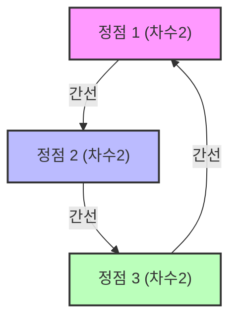

# 스펙트럴 그래프 이론이란 무엇인가?

우리 주변에는 네트워크가 넘쳐납니다. 인터넷의 하이퍼링크 구조, SNS의 교우 관계, 전력망, 심지어 뇌의 신경 세포 연결에 이르기까지 모든 것은 '그래프(Graph)'로 모델링할 수 있습니다. 스펙트럴 [그래프 이론](/ko/p/graph-theory-dijkstra-a-star/)(Spectral Graph Theory)은 이러한 그래프를 '행렬'로 표현하고, 그 '고윳값(Eigenvalues)'이나 '고유 벡터(Eigenvectors)' 같은 선형대수학의 개념을 사용하여 네트워크에 숨겨진 거시적·미시적 성질을 밝혀내는 분야입니다.

이 글에서는 기본적인 행렬 표현부터 시작하여 라플라시안 행렬의 고윳값이 갖는 물리적인 의미, 그래프 분할에 있어 금자탑이라 할 수 있는 치거의 부등식(Cheeger's inequality), 그리고 Google의 기반이 된 PageRank 알고리즘의 수학적 증명까지 매우 깊이 파고들어 설명합니다.

---

## 1. 그래프의 행렬 표현

그래프 $G = (V, E)$ 를 생각합시다. 여기서 $V$ 는 정점(노드)의 집합, $E$ 는 간선(에지)의 집합입니다. 노드의 수를 $n = |V|$ 로 둡니다. 이 그래프의 구조를 컴퓨터나 수학적인 수식으로 다루기 위해 몇 가지 행렬을 정의합니다.

### 인접 행렬 (Adjacency Matrix)

인접 행렬 $A$ 는 $n \times n$ 의 대칭 행렬이며, 정점 $i$ 와 $j$ 사이에 연결(간선)이 있는 경우에 $A_{ij} = 1$, 그렇지 않은 경우에 $A_{ij} = 0$ 을 취하는 행렬입니다(가중치가 없는 무방향 그래프의 경우).

$$ A_{ij} = \begin{cases} 1 & \text{if } (i, j) \in E \\ 0 & \text{otherwise} \end{cases} $$

### 차수 행렬 (Degree Matrix)

차수 행렬 $D$ 는 대각 행렬이며, 각 정점의 차수(연결된 간선의 수)를 대각 성분으로 갖는 행렬입니다.

$$ D_{ii} = \sum_{j} A_{ij} $$
$$ D_{ij} = 0 \quad (\text{if } i \neq j) $$

### 라플라시안 행렬 (Laplacian Matrix)

그래프의 성질을 해석하는 데 있어 인접 행렬 이상으로 강력한 도구가 되는 것이 '그래프 라플라시안'입니다. 라플라시안 행렬 $L$ 은 다음과 같이 정의됩니다.

$$ L = D - A $$

라플라시안 행렬은 다음과 같은 훌륭한 성질을 가지고 있습니다.
1. **대칭성**: $L$ 은 대칭 행렬($L = L^T$)이므로 모든 고윳값은 실수가 됩니다.
2. **반양정도성(Semi-Positive Definiteness)**: 임의의 벡터 $x \in \mathbb{R}^n$ 에 대해 이차 형식 $x^T L x$ 는 다음과 같이 전개할 수 있습니다.
   $$ x^T L x = \sum_{(i,j) \in E} (x_i - x_j)^2 \geq 0 $$
   이에 따라 $L$ 의 고윳값은 모두 $0$ 이상임을 알 수 있습니다($\lambda_0 \leq \lambda_1 \leq \dots \leq \lambda_{n-1}$).
3. **최소 고윳값**: 항상 $\lambda_0 = 0$ 이며, 대응하는 고유 벡터는 모든 성분이 $1$ 인 벡터 $\mathbf{1}$ 입니다($L\mathbf{1} = (D-A)\mathbf{1} = \mathbf{0}$).



---

## 2. 고윳값의 물리적 의미: 대수적 연결도와 피들러 벡터

라플라시안 행렬 $L$ 의 고윳값 $\lambda_i$ 는 그래프의 '형태'나 '연결성'을 여실히 나타냅니다.

- **$\lambda_0 = 0$ 의 중복도**: 그래프가 몇 개의 연결 성분(독립된 부분 그래프)으로 나뉘어져 있는지를 나타냅니다. $\lambda_0 = 0$ 이 하나밖에 없는(즉 $\lambda_1 > 0$) 경우, 그래프는 하나의 연결된 네트워크임을 의미합니다.
- **$\lambda_1$ (대수적 연결도, Algebraic Connectivity)**: 두 번째로 작은 고윳값 $\lambda_1$ 은 그래프 연결의 강도를 나타내는 지표이며, 피들러 값(Fiedler value)이라고도 불립니다. 이 값이 클수록 그래프는 밀집하게 결합되어 있어 네트워크를 두 개로 분할하기가 어려워집니다. 반대로 이 값이 0에 가까울수록 적은 간선을 자르는 것만으로도 그래프가 분할되는 '병목(bottleneck)'이 존재함을 시사합니다.
- **피들러 벡터(Fiedler Vector)**: $\lambda_1$ 에 대응하는 고유 벡터를 피들러 벡터라고 부릅니다. 이 벡터 성분의 부호(양인지 음인지)를 봄으로써 그래프를 자연스럽게 두 개의 클러스터로 분할할 수 있습니다(스펙트럴 클러스터링의 기초).

### 열전도와 랜덤 워크의 유추

물리학에서 라플라시안 연산자 $\nabla^2$ 는 열전도 방정식이나 파동 방정식에 등장합니다. 그래프 상의 라플라시안 행렬 $L$ 도 완전히 같은 역할을 수행합니다. 각 노드에 '열'을 갖게 했다고 하면 열은 에지를 따라 확산되어 갑니다. 대수적 연결도 $\lambda_1$ 은 이 열이 얼마나 빨리 네트워크 전체에 균일화되는지(완화 시간)를 결정짓습니다.

---

## 3. 치거의 부등식 (Cheeger's Inequality)

그래프의 분할 용이성을 측정하는 기하학적 지표로서 '치거 상수(Cheeger constant, Isoperimetric number)' $h_G$ 가 있습니다. 이는 그래프를 두 개의 부분집합 $S$ 와 $V \setminus S$ 로 나누었을 때, 그 사이를 잇는 간선의 수를 더 작은 쪽의 집합의 크기(또는 부피)로 나눈 값의 최솟값입니다.

$$ h_G = \min_{S \subset V, 0 < |S| \leq n/2} \frac{|E(S, V \setminus S)|}{|S|} $$

$h_G$ 가 작다는 것은 적은 간선을 절단하는 것만으로 큰 클러스터를 분리해 낼 수 있는 '병목'이 존재한다는 것을 의미합니다. 그러나 $h_G$ 를 엄밀하게 계산하는 것은 NP-난해(NP-hard) 문제입니다.

여기서 스펙트럴 [그래프 이론](/ko/p/graph-theory-dijkstra-a-star/)의 가장 큰 성과 중 하나인 '치거의 부등식'이 등장합니다. 이 정리는 기하학적 양인 $h_G$ 와 대수적 양인 $\lambda_1$ 을 연결합니다.

$$ \frac{\lambda_1}{2} \leq h_G \leq \sqrt{2 \lambda_1 \Delta} $$

(※ $\Delta$ 는 그래프의 최대 차수)

이 부등식에 의해 고윳값 $\lambda_1$ 을 계산하는 것(이는 다항 시간 내에 가능)만으로 그래프에 병목이 존재하는지 보장할 수 있습니다. 왼쪽 부등식은 대수적 연결도가 크면 병목이 존재하지 않음을 나타내고, 오른쪽 부등식은 대수적 연결도가 작으면 반드시 좋은 분할(병목)이 존재함을 나타냅니다.

---

## 4. 마르코프 연쇄와 Google PageRank의 수학적 증명

스펙트럴 [그래프 이론](/ko/p/graph-theory-dijkstra-a-star/)의 응용으로 가장 유명한 것이 Google의 검색 엔진을 뒷받침한 PageRank 알고리즘입니다. 이는 웹을 거대한 유향 그래프로 보고 [랜덤 워크](/ko/p/random-walk/)의 정상 분포(stationary distribution)를 구하는 문제로 귀결됩니다.

### 확률 추이 행렬 (Transition Matrix)

유향 그래프의 인접 행렬을 $A$ 라 하고, 각 노드에서의 출차수(out-degree)를 $d_i^{out}$ 이라 합시다. 확률 추이 행렬 $P$ 는 다음과 같이 정의됩니다.

$$ P_{ij} = \begin{cases} \frac{1}{d_i^{out}} & \text{if } (i,j) \in E \\ 0 & \text{otherwise} \end{cases} $$

행 벡터 $\pi$ 를 상태 확률 분포라 하면 1단계 후의 분포는 $\pi P$ 가 됩니다. 무한 번의 단계를 거쳤을 때의 극한(정상 분포)은 $\pi = \pi P$ 를 만족하는 $\pi$ 입니다. 이는 행렬 $P$ 의 좌고유벡터(고윳값 1에 대응)와 다름없습니다.

### 페론-프로베니우스 정리 (Perron-Frobenius Theorem)

이 정상 분포가 유일하게 정해지며 계산 가능함을 보장하는 것이 '페론-프로베니우스 정리'입니다. 그러나 실제 웹 그래프는 강연결(strongly connected)이 아니어서(막다른 페이지가 있는 등) 이 정리의 조건을 만족하지 못합니다.

그래서 래리 페이지와 세르게이 브린은 '감쇠 인자(Damping Factor)' $d \approx 0.85$ 를 도입했습니다. 사용자는 확률 $d$ 로 링크를 따라가고, 확률 $1-d$ 로 완전히 무작위적인 페이지로 점프한다고 가정합니다.

수정된 추이 행렬 $\tilde{P}$ 는 다음과 같이 표현됩니다.

$$ \tilde{P} = d P + \frac{1-d}{n} \mathbf{1}\mathbf{1}^T $$

이 행렬 $\tilde{P}$ 는 모든 성분이 양수인(양행렬) 특성 덕분에 페론-프로베니우스 정리가 완벽하게 적용될 수 있습니다.

1. **가장 큰 고윳값은 엄밀하게 1** 이며, 그 중복도는 1입니다.
2. 대응하는 좌고유벡터 $\pi$ 는 모든 성분이 양수이며, 이것이 각 페이지의 PageRank(중요도)가 됩니다.
3. 다른 모든 고윳값의 절댓값은 1보다 엄밀하게 작으므로, 거듭제곱법(Power Iteration) $\pi^{(k+1)} = \pi^{(k)} \tilde{P}$ 는 초기 상태와 관계없이 반드시 정상 분포 $\pi$ 로 수렴합니다.

이러한 훌륭한 수학적 수정을 통해 PageRank는 계산 가능하고 안정적인 알고리즘이 되었습니다.

---

## 5. Python (NetworkX) 을 활용한 스펙트럴 해석 코드 예시

이론을 실전에 적용해 보기 위해, Python의 그래프 네트워크 라이브러리인 `NetworkX` 와 `NumPy`, `SciPy` 를 사용하여 그래프의 라플라시안 행렬의 고윳값을 계산하고, 피들러 벡터를 이용한 스펙트럴 클러스터링을 구현해 봅시다.

```python
import networkx as nx
import numpy as np
import matplotlib.pyplot as plt
from scipy.linalg import eigh

# 1. 가라테 클럽 네트워크 데이터 불러오기
G = nx.karate_club_graph()

# 2. 라플라시안 행렬 얻기
L = nx.laplacian_matrix(G).todense()

# 3. 고윳값 분해 (scipy.linalg.eigh 는 대칭 행렬에 최적화되어 있음)
eigenvalues, eigenvectors = eigh(L)

# 4. 제2 고윳값(대수적 연결도)과 피들러 벡터 얻기
lambda_1 = eigenvalues[1]
fiedler_vector = eigenvectors[:, 1]

print(f"대수적 연결도 (lambda_1): {lambda_1:.4f}")

# 5. 피들러 벡터에 기반한 그래프 2분할 (스펙트럴 클러스터링)
cluster_1 = [i for i, val in enumerate(fiedler_vector) if val < 0]
cluster_2 = [i for i, val in enumerate(fiedler_vector) if val >= 0]

# 6. 결과 시각화
plt.figure(figsize=(10, 7))
pos = nx.spring_layout(G, seed=42)
nx.draw_networkx_nodes(G, pos, nodelist=cluster_1, node_color='lightblue', label='Cluster 1')
nx.draw_networkx_nodes(G, pos, nodelist=cluster_2, node_color='lightgreen', label='Cluster 2')
nx.draw_networkx_edges(G, pos, alpha=0.5)
nx.draw_networkx_labels(G, pos, font_size=10)
plt.title(f"Spectral Clustering based on Fiedler Vector (λ1 = {lambda_1:.4f})")
plt.legend()
plt.axis('off')
plt.show()
```

이 코드를 실행하면 유명한 재커리의 가라테 클럽 네트워크가 피들러 벡터의 부호(양수인지 음수인지)만으로 훌륭하게 두 개의 파벌로 나뉘는 것을 확인할 수 있습니다. 복잡한 네트워크 구조가 행렬의 고유 벡터라는 대수적 조작만으로 해명되는 순간입니다.

---

## 결론

스펙트럴 [그래프 이론](/ko/p/graph-theory-dijkstra-a-star/)은 [그래프 이론](/ko/p/graph-theory-dijkstra-a-star/)이라는 이산수학의 세계와 선형대수학이라는 연속수학의 세계를 훌륭하게 이어주는 가교입니다. 행렬의 고윳값이라는 단 하나의 수치가 네트워크 전체의 연결성이나 병목의 존재 같은 거시적인 구조를 정확하게 포착하고, 더 나아가 PageRank와 같은 알고리즘을 통해 현대 사회의 정보 인프라를 지탱하고 있습니다.

우리가 매일 접하는 복잡한 네트워크도 행렬의 스펙트럼(고윳값 분포)을 통해 보면, 그곳에 숨겨진 질서와 법칙이 드러나게 되는 것입니다.
