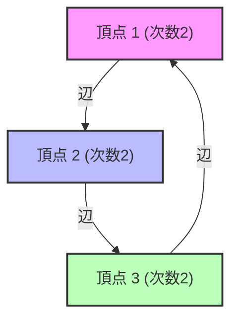

# スペクトルグラフ理論とは何か？

私たちの周りにはネットワークがあふれています。インターネットのハイパーリンク構造、SNSの交友関係、電力網、さらには脳の神経細胞のつながりに至るまで、すべては「グラフ（Graph）」としてモデル化できます。スペクトルグラフ理論（Spectral Graph Theory）は、これらのグラフを「行列」として表現し、その「[固有値](/p/eigenvalues-and-eigenvectors/)（Eigenvalues）」や「固有ベクトル（Eigenvectors）」といった線形代数学の概念を用いて、ネットワークに潜むマクロ・ミクロな性質を明らかにする分野です。

この記事では、基本的な行列表現から始まり、ラプラシアン行列の[固有値](/p/eigenvalues-and-eigenvectors/)が持つ物理的な意味、グラフの分割における金字塔であるチェーガーの不等式（Cheeger's inequality）、そしてGoogleの基盤となったPageRankアルゴリズムの数学的証明まで、非常に深く掘り下げて解説します。

---

## 1. グラフの行列表現

グラフ $G = (V, E)$ を考えます。ここで、$V$ は頂点（ノード）の集合、$E$ は辺（エッジ）の集合です。ノード数を $n = |V|$ とします。このグラフの構造をコンピュータや数学的な数式として扱うため、いくつかの行列を定義します。

### 隣接行列 (Adjacency Matrix)

隣接行列 $A$ は、$n \times n$ の対称行列であり、頂点 $i$ と $j$ の間につながり（辺）がある場合に $A_{ij} = 1$、そうでない場合に $A_{ij} = 0$ をとる行列です（重みなし無向グラフの場合）。

$$ A_{ij} = \begin{cases} 1 & \text{if } (i, j) \in E \\ 0 & \text{otherwise} \end{cases} $$

### 次数行列 (Degree Matrix)

次数行列 $D$ は、対角行列であり、各頂点の次数（つながっている辺の数）を対角成分に持つ行列です。

$$ D_{ii} = \sum_{j} A_{ij} $$
$$ D_{ij} = 0 \quad (\text{if } i \neq j) $$

### ラプラシアン行列 (Laplacian Matrix)

グラフの性質を解析する上で、隣接行列以上に強力なツールとなるのが「グラフラプラシアン」です。ラプラシアン行列 $L$ は以下のように定義されます。

$$ L = D - A $$

ラプラシアン行列は以下のような素晴らしい性質を持っています。
1. **対称性**: $L$ は対称行列（$L = L^T$）であるため、すべての[固有値](/p/eigenvalues-and-eigenvectors/)は実数になります。
2. **半正定値性**: 任意のベクトル $x \in \mathbb{R}^n$ に対して、二次形式 $x^T L x$ は次のように展開できます。
   $$ x^T L x = \sum_{(i,j) \in E} (x_i - x_j)^2 \geq 0 $$
   これにより、$L$ の[固有値](/p/eigenvalues-and-eigenvectors/)はすべて $0$ 以上であることが分かります（$\lambda_0 \leq \lambda_1 \leq \dots \leq \lambda_{n-1}$）。
3. **最小[固有値](/p/eigenvalues-and-eigenvectors/)**: 常に $\lambda_0 = 0$ であり、対応する固有ベクトルは全成分が $1$ のベクトル $\mathbf{1}$ です（$L\mathbf{1} = (D-A)\mathbf{1} = \mathbf{0}$）。



---

## 2. 固有値の物理的意味：代数的連結度とFiedlerベクトル

ラプラシアン行列 $L$ の[固有値](/p/eigenvalues-and-eigenvectors/) $\lambda_i$ は、グラフの「形」や「つながりやすさ」を如実に表します。

- **$\lambda_0 = 0$の重複度**: グラフがいくつの連結成分（独立した部分グラフ）に分かれているかを表します。$\lambda_0 = 0$ が一つしかない（つまり $\lambda_1 > 0$）場合、グラフは1つの連結したネットワークであることを意味します。
- **$\lambda_1$（代数的連結度, Algebraic Connectivity）**: 2番目に小さい[固有値](/p/eigenvalues-and-eigenvectors/) $\lambda_1$ は、グラフの連結の強さを示す指標であり、Fiedler値とも呼ばれます。この値が大きいほど、グラフは密に結合しており、ネットワークを2つに分断するのが困難になります。逆に、この値が0に近いほど、わずかな辺を切るだけでグラフが分断される「ボトルネック」が存在することを示唆します。
- **Fiedlerベクトル**: $\lambda_1$ に対応する固有ベクトルをFiedlerベクトルと呼びます。このベクトルの成分の符号（正か負か）を見ることで、グラフを自然に2つのクラスタに分割することができます（スペクトルクラスタリングの基礎）。

### 熱伝導とランダムウォークのアナロジー

物理学において、ラプラシアン演算子 $\nabla^2$ は熱伝導方程式や波動方程式に現れます。グラフ上のラプラシアン行列 $L$ も全く同じ役割を果たします。各ノードに「熱」を持たせたとすると、熱はエッジを伝って拡散していきます。代数的連結度 $\lambda_1$ は、この熱がどれだけ速くネットワーク全体に均一化されるか（緩和時間）を決定づけます。

---

## 3. チェーガーの不等式 (Cheeger's Inequality)

グラフの分断しやすさを測る幾何学的な指標として「チェーガー定数（Cheeger constant, Isoperimetric number）」$h_G$ があります。これは、グラフを2つの部分集合 $S$ と $V \setminus S$ に分けたとき、その間を結ぶ辺の数を、小さい方の集合のサイズ（または体積）で割った値の最小値です。

$$ h_G = \min_{S \subset V, 0 < |S| \leq n/2} \frac{|E(S, V \setminus S)|}{|S|} $$

$h_G$ が小さいということは、少ない辺を切断するだけで大きなクラスタを切り離せる「ボトルネック」が存在することを意味します。しかし、$h_G$ を厳密に計算することはNP困難な問題です。

ここでスペクトルグラフ理論の最大の成果の一つである「チェーガーの不等式」が登場します。この定理は、幾何学的な量 $h_G$ と代数的な量 $\lambda_1$ を結びつけます。

$$ \frac{\lambda_1}{2} \leq h_G \leq \sqrt{2 \lambda_1 \Delta} $$

（※ $\Delta$ はグラフの最大次数）

この不等式により、[固有値](/p/eigenvalues-and-eigenvectors/) $\lambda_1$ を計算する（これは多項式時間で可能）だけで、グラフのボトルネックの存在を保証できるのです。左側の不等式は、代数的連結度が大きければボトルネックが存在しないことを示し、右側の不等式は、代数的連結度が小さければ必ず良い分割（ボトルネック）が存在することを示しています。

---

## 4. マルコフ連鎖とGoogle PageRankの数学的証明

スペクトルグラフ理論の応用として最も有名なのが、Googleの[検索エンジン](/p/how-search-engines-work/)を支えたPageRankアルゴリズムです。これは、ウェブを巨大な有向グラフと見なし、[ランダムウォーク](/p/random-walk/)の定常分布を求める問題に帰着されます。

### 確率推移行列 (Transition Matrix)

有向グラフの隣接行列を $A$ とし、各ノードからの出次数を $d_i^{out}$ とします。確率推移行列 $P$ は次のように定義されます。

$$ P_{ij} = \begin{cases} \frac{1}{d_i^{out}} & \text{if } (i,j) \in E \\ 0 & \text{otherwise} \end{cases} $$

行ベクトル $\pi$ を状態確率分布とすると、1ステップ後の分布は $\pi P$ となります。無限回のステップを経たときの極限（定常分布）は、$\pi = \pi P$ を満たす $\pi$ です。これは、行列 $P$ の左固有ベクトル（[固有値](/p/eigenvalues-and-eigenvectors/)1に対応）に他なりません。

### ペロン・フロベニウスの定理 (Perron-Frobenius Theorem)

この定常分布が唯一に定まり、計算可能であることを保証するのが「ペロン・フロベニウスの定理」です。しかし、実際のウェブグラフは強連結ではなく（行き止まりのページがあるなど）、この定理の条件を満たしません。

そこで、ラリー・ペイジとセルゲイ・ブリンは「ダンピングファクター（Damping Factor）」$d \approx 0.85$ を導入しました。ユーザーは確率 $d$ でリンクを辿り、確率 $1-d$ で全くランダムなページへジャンプすると仮定します。

修正された推移行列 $\tilde{P}$ は次のように表されます。

$$ \tilde{P} = d P + \frac{1-d}{n} \mathbf{1}\mathbf{1}^T $$

この行列 $\tilde{P}$ は、すべての成分が正である（正行列）ため、ペロン・フロベニウスの定理が完全に適用可能になります。

1. **最大の[固有値](/p/eigenvalues-and-eigenvectors/)は厳密に 1** であり、その重複度は 1 です。
2. 対応する左固有ベクトル $\pi$ はすべての成分が正であり、これが各ページのPageRank（重要度）となります。
3. 他のすべての[固有値](/p/eigenvalues-and-eigenvectors/)の絶対値は 1 より厳密に小さいため、べき乗法（Power Iteration） $\pi^{(k+1)} = \pi^{(k)} \tilde{P}$ は、初期状態に関わらず必ず定常分布 $\pi$ に収束します。

この見事な数学的修正により、PageRankは計算可能かつ安定したアルゴリズムとなりました。

---

## 5. Python (NetworkX) を用いたスペクトル解析のコード例

理論を実践に移すため、Pythonのグラフネットワークライブラリである `NetworkX` と `NumPy`、`SciPy` を用いて、グラフのラプラシアン行列の[固有値](/p/eigenvalues-and-eigenvectors/)を計算し、Fiedlerベクトルを用いたスペクトルクラスタリングを実装してみましょう。

```python
import networkx as nx
import numpy as np
import matplotlib.pyplot as plt
from scipy.linalg import eigh

# 1. カラテクラブのネットワークデータを読み込む
G = nx.karate_club_graph()

# 2. ラプラシアン行列の取得
L = nx.laplacian_matrix(G).todense()

# 3. 固有値分解 (scipy.linalg.eigh は対称行列に最適化されている)
eigenvalues, eigenvectors = eigh(L)

# 4. 第2固有値（代数的連結度）とFiedlerベクトルの取得
lambda_1 = eigenvalues[1]
fiedler_vector = eigenvectors[:, 1]

print(f"代数的連結度 (lambda_1): {lambda_1:.4f}")

# 5. Fiedlerベクトルに基づくグラフの2分割（スペクトルクラスタリング）
cluster_1 = [i for i, val in enumerate(fiedler_vector) if val < 0]
cluster_2 = [i for i, val in enumerate(fiedler_vector) if val >= 0]

# 6. 結果の可視化
plt.figure(figsize=(10, 7))
pos = nx.spring_layout(G, seed=42)
nx.draw_networkx_nodes(G, pos, nodelist=cluster_1, node_color='lightblue', label='Cluster 1')
nx.draw_networkx_nodes(G, pos, nodelist=cluster_2, node_color='lightgreen', label='Cluster 2')
nx.draw_networkx_edges(G, pos, alpha=0.5)
nx.draw_networkx_labels(G, pos, font_size=10)
plt.title(f"Spectral Clustering based on Fiedler Vector (λ1 = {lambda_1:.4f})")
plt.legend()
plt.axis('off')
plt.show()
```

このコードを実行すると、有名なザカリーのカラテクラブ・ネットワークが、Fiedlerベクトルの符号（正か負か）だけで見事に2つの派閥に分割されることが確認できます。複雑なネットワーク構造が、行列の固有ベクトルという代数的な操作だけで解き明かされる瞬間です。

---

## 結論

スペクトルグラフ理論は、グラフ理論という離散数学の世界と、線形代数学という連続数学の世界を見事に繋ぐ架け橋です。行列の[固有値](/p/eigenvalues-and-eigenvectors/)という一つの数値が、ネットワーク全体の連結性やボトルネックの存在といったマクロな構造を的確に捉え、さらにPageRankのようなアルゴリズムを通じて現代社会の情報インフラを支えています。

私たちが日々目にする複雑なネットワークも、行列のスペクトル（[固有値](/p/eigenvalues-and-eigenvectors/)の分布）を通して見れば、そこに隠された秩序と法則が浮かび上がってくるのです。
