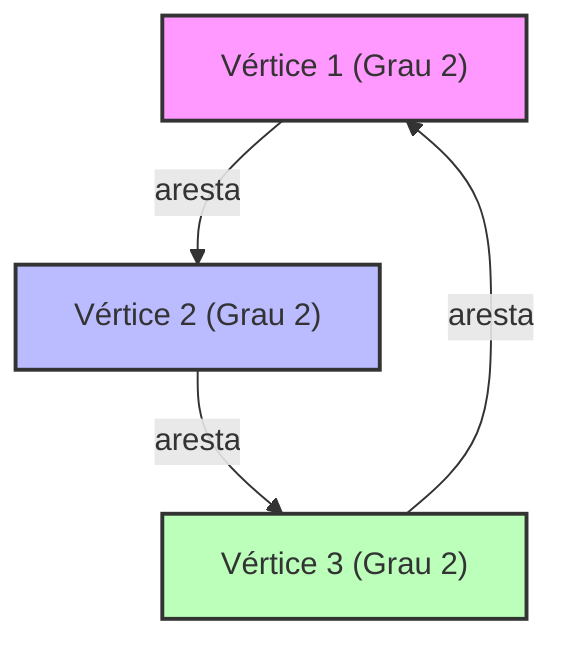

# O que é a Teoria Espectral de Grafos?

As redes estão em toda parte ao nosso redor. Desde a estrutura de hiperlinks da internet, relacionamentos em redes sociais, redes elétricas, e até mesmo as conexões de neurônios no cérebro, tudo pode ser modelado como um "Grafo" (Graph). A Teoria Espectral de Grafos (Spectral Graph Theory) é a área que representa esses grafos como "matrizes" e usa conceitos de álgebra linear, como "Autovalores" (Eigenvalues) e "Autovetores" (Eigenvectors), para revelar as propriedades macro e microscópicas ocultas nas redes.

Neste artigo, começaremos com a representação matricial básica, exploraremos o significado físico dos autovalores da matriz Laplaciana, a desigualdade de Cheeger (Cheeger's inequality) - um marco na divisão de grafos - e a prova matemática do algoritmo PageRank, que formou a base do Google, explicando tudo de forma muito aprofundada.

---

## 1. Representação Matricial de Grafos

Considere um grafo $G = (V, E)$. Aqui, $V$ é o conjunto de vértices (nós) e $E$ é o conjunto de arestas (links). Seja o número de nós $n = |V|$. Para tratar a estrutura desse grafo como fórmulas matemáticas ou processá-la em computadores, definimos algumas matrizes.

### Matriz de Adjacência (Adjacency Matrix)

A matriz de adjacência $A$ é uma matriz simétrica $n \times n$, onde $A_{ij} = 1$ se houver uma conexão (aresta) entre os vértices $i$ e $j$, e $A_{ij} = 0$ caso contrário (para o caso de um grafo não direcionado e sem peso).

$$ A_{ij} = \begin{cases} 1 & \text{if } (i, j) \in E \\ 0 & \text{otherwise} \end{cases} $$

### Matriz de Grau (Degree Matrix)

A matriz de grau $D$ é uma matriz diagonal que possui o grau de cada vértice (número de arestas conectadas) em seus elementos diagonais.

$$ D_{ii} = \sum_{j} A_{ij} $$
$$ D_{ij} = 0 \quad (\text{if } i \neq j) $$

### Matriz Laplaciana (Laplacian Matrix)

Para analisar as propriedades de um grafo, o "Laplaciano de Grafo" torna-se uma ferramenta ainda mais poderosa do que a matriz de adjacência. A matriz Laplaciana $L$ é definida da seguinte forma:

$$ L = D - A $$

A matriz Laplaciana tem as seguintes propriedades maravilhosas:
1. **Simetria**: Como $L$ é uma matriz simétrica ($L = L^T$), todos os seus autovalores são números reais.
2. **Semidefinida positiva**: Para qualquer vetor $x \in \mathbb{R}^n$, a forma quadrática $x^T L x$ pode ser expandida como se segue:
   $$ x^T L x = \sum_{(i,j) \in E} (x_i - x_j)^2 \geq 0 $$
   Isso mostra que todos os autovalores de $L$ são maiores ou iguais a $0$ ($\lambda_0 \leq \lambda_1 \leq \dots \leq \lambda_{n-1}$).
3. **Menor autovalor**: Sempre temos $\lambda_0 = 0$, e o autovetor correspondente é o vetor cujos componentes são todos $1$, denotado por $\mathbf{1}$ ($L\mathbf{1} = (D-A)\mathbf{1} = \mathbf{0}$).



---

## 2. O Significado Físico dos Autovalores: Conectividade Algébrica e Vetor de Fiedler

Os autovalores $\lambda_i$ da matriz Laplaciana $L$ descrevem vividamente a "forma" e a "conectividade" do grafo.

- **Multiplicidade de $\lambda_0 = 0$**: Representa em quantos componentes conectados (subgrafos independentes) o grafo está dividido. Se houver apenas um $\lambda_0 = 0$ (ou seja, $\lambda_1 > 0$), isso significa que o grafo é uma única rede conectada.
- **$\lambda_1$ (Conectividade Algébrica, Algebraic Connectivity)**: O segundo menor autovalor, $\lambda_1$, é um indicador da força de conectividade do grafo e também é chamado de valor de Fiedler. Quanto maior esse valor, mais densamente conectado é o grafo e mais difícil é dividi-lo em duas partes. Inversamente, se esse valor estiver próximo de 0, sugere a existência de um "gargalo" (bottleneck), onde o corte de poucas arestas pode dividir o grafo.
- **Vetor de Fiedler**: O autovetor correspondente a $\lambda_1$ é chamado de vetor de Fiedler. Observando o sinal (positivo ou negativo) dos componentes deste vetor, podemos particionar o grafo naturalmente em dois clusters (a base do agrupamento espectral, ou spectral clustering).

### A Analogia com a Condução de Calor e os Passeios Aleatórios

Na física, o operador Laplaciano $\nabla^2$ aparece nas equações de difusão de calor e nas equações de onda. A matriz Laplaciana $L$ no grafo desempenha um papel exatamente igual. Se atribuirmos "calor" a cada nó, ele se difundirá ao longo das arestas. A conectividade algébrica $\lambda_1$ determina a rapidez com que esse calor se uniformiza em toda a rede (tempo de relaxamento).

---

## 3. Desigualdade de Cheeger (Cheeger's Inequality)

Um indicador geométrico para medir a divisibilidade de um grafo é a "Constante de Cheeger" (Cheeger constant, Isoperimetric number) $h_G$. Ela representa o valor mínimo da razão entre o número de arestas conectando duas partições $S$ e $V \setminus S$ do grafo, e o tamanho (ou volume) do conjunto menor.

$$ h_G = \min_{S \subset V, 0 < |S| \leq n/2} \frac{|E(S, V \setminus S)|}{|S|} $$

Um valor pequeno de $h_G$ significa que há um "gargalo", e grandes clusters podem ser desconectados cortando apenas algumas arestas. No entanto, calcular estritamente $h_G$ é um problema NP-difícil.

Aqui, entra em cena uma das maiores conquistas da teoria espectral de grafos, a "Desigualdade de Cheeger". Este teorema conecta a quantidade geométrica $h_G$ à quantidade algébrica $\lambda_1$.

$$ \frac{\lambda_1}{2} \leq h_G \leq \sqrt{2 \lambda_1 \Delta} $$

(※ $\Delta$ é o grau máximo do grafo)

Através desta desigualdade, simplesmente calculando o autovalor $\lambda_1$ (o que é possível em tempo polinomial), podemos garantir a presença ou não de um gargalo no grafo. A desigualdade da esquerda mostra que, se a conectividade algébrica for grande, não existem gargalos; a desigualdade da direita indica que, se a conectividade algébrica for pequena, certamente há uma boa divisão (um gargalo).

---

## 4. Cadeias de Markov e a Prova Matemática do PageRank do Google

A aplicação mais famosa da teoria espectral de grafos é o algoritmo PageRank, que impulsionou o mecanismo de busca do Google. Ele considera a web como um enorme grafo direcionado e reduz o problema a encontrar a distribuição estacionária de um [passeio aleatório](/pt/p/random-walk/) (random walk).

### Matriz de Transição de Probabilidade (Transition Matrix)

Seja $A$ a matriz de adjacência de um grafo direcionado e seja $d_i^{out}$ o grau de saída (out-degree) de cada nó. A matriz de transição de probabilidade $P$ é definida como:

$$ P_{ij} = \begin{cases} \frac{1}{d_i^{out}} & \text{if } (i,j) \in E \\ 0 & \text{otherwise} \end{cases} $$

Se $\pi$ for o vetor linha que representa a distribuição de probabilidade de estado, a distribuição após um passo será $\pi P$. O limite após infinitos passos (distribuição estacionária) é o $\pi$ que satisfaz $\pi = \pi P$. Isto é nada mais nada menos do que o autovetor à esquerda da matriz $P$ (correspondente ao autovalor 1).

### Teorema de Perron-Frobenius (Perron-Frobenius Theorem)

O que garante que essa distribuição estacionária seja determinada de forma única e que seja calculável é o "Teorema de Perron-Frobenius". Porém, o grafo da web real não é fortemente conectado (há páginas sem saída, por exemplo) e não cumpre as condições desse teorema.

Por isso, Larry Page e Sergey Brin introduziram o "Fator de Amortecimento" (Damping Factor) $d \approx 0.85$. Assume-se que o usuário segue um link com probabilidade $d$, e com probabilidade $1-d$ pula para uma página completamente aleatória.

A matriz de transição modificada $\tilde{P}$ é expressa como:

$$ \tilde{P} = d P + \frac{1-d}{n} \mathbf{1}\mathbf{1}^T $$

Como todos os componentes da matriz $\tilde{P}$ são positivos (matriz estritamente positiva), o Teorema de Perron-Frobenius torna-se totalmente aplicável.

1. **O maior autovalor é estritamente 1**, e a sua multiplicidade é 1.
2. O autovetor à esquerda correspondente $\pi$ tem todos os componentes positivos e representa o PageRank (importância) de cada página.
3. O valor absoluto de todos os outros autovalores é estritamente menor que 1. Portanto, o método das potências (Power Iteration) $\pi^{(k+1)} = \pi^{(k)} \tilde{P}$ convergirá sempre para a distribuição estacionária $\pi$, independentemente do estado inicial.

Graças a esta excelente modificação matemática, o PageRank tornou-se um algoritmo calculável e estável.

---

## 5. Exemplo de Código para Análise Espectral usando Python (NetworkX)

Para colocar a teoria em prática, vamos implementar o cálculo dos autovalores da matriz Laplaciana do grafo e o agrupamento espectral usando o vetor de Fiedler, utilizando as bibliotecas de redes de grafos do Python: `NetworkX`, `NumPy` e `SciPy`.

```python
import networkx as nx
import numpy as np
import matplotlib.pyplot as plt
from scipy.linalg import eigh

# 1. Carregar os dados da rede Karate Club
G = nx.karate_club_graph()

# 2. Obter a matriz Laplaciana
L = nx.laplacian_matrix(G).todense()

# 3. Decomposição de autovalores (scipy.linalg.eigh é otimizada para matrizes simétricas)
eigenvalues, eigenvectors = eigh(L)

# 4. Obter o 2º autovalor (conectividade algébrica) e o vetor de Fiedler
lambda_1 = eigenvalues[1]
fiedler_vector = eigenvectors[:, 1]

print(f"Conectividade algébrica (lambda_1): {lambda_1:.4f}")

# 5. Partição em 2 do grafo com base no vetor de Fiedler (agrupamento espectral)
cluster_1 = [i for i, val in enumerate(fiedler_vector) if val < 0]
cluster_2 = [i for i, val in enumerate(fiedler_vector) if val >= 0]

# 6. Visualização dos resultados
plt.figure(figsize=(10, 7))
pos = nx.spring_layout(G, seed=42)
nx.draw_networkx_nodes(G, pos, nodelist=cluster_1, node_color='lightblue', label='Cluster 1')
nx.draw_networkx_nodes(G, pos, nodelist=cluster_2, node_color='lightgreen', label='Cluster 2')
nx.draw_networkx_edges(G, pos, alpha=0.5)
nx.draw_networkx_labels(G, pos, font_size=10)
plt.title(f"Spectral Clustering based on Fiedler Vector (λ1 = {lambda_1:.4f})")
plt.legend()
plt.axis('off')
plt.show()
```

Ao executar esse código, você pode confirmar que a famosa rede do clube de karatê de Zachary é excelentemente dividida em duas facções usando apenas o sinal (positivo ou negativo) do vetor de Fiedler. É o momento em que uma estrutura de rede complexa é desvendada com nada mais do que uma operação algébrica: o autovetor de uma matriz.

---

## Conclusão

A Teoria Espectral de Grafos é uma ponte maravilhosa que conecta o mundo da matemática discreta, como a [teoria dos grafos](/pt/p/graph-theory-dijkstra-a-star/), ao mundo da matemática contínua, como a álgebra linear. Um único número - o autovalor da matriz - capta com precisão as estruturas macroscópicas, como a conectividade global de uma rede e a presença de gargalos e, por meio de algoritmos como o PageRank, sustenta a infraestrutura de informações da sociedade moderna.

Se olharmos até mesmo para as redes complexas que vemos todos os dias, por meio do espectro das matrizes (distribuição de autovalores), a ordem e as leis ocultas por trás delas se revelam.
