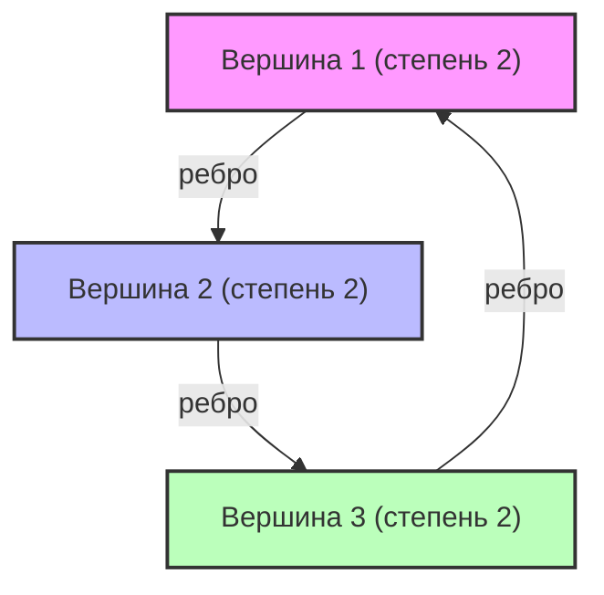

# Что такое спектральная теория графов?

Нас повсюду окружают сети. Структура гиперссылок в интернете, дружеские связи в социальных сетях, электрические сети и даже связи между нейронами в мозге — всё это можно смоделировать как «графы» (Graph). Спектральная [теория графов](/ru/p/graph-theory-dijkstra-a-star/) (Spectral Graph Theory) — это область, которая представляет эти графы в виде «матриц» и использует концепции линейной алгебры, такие как «собственные значения» (Eigenvalues) и «собственные векторы» (Eigenvectors), для выявления макро- и микроскопических свойств, скрытых в сетях.

В этой статье мы глубоко погрузимся в эту тему: начиная с базового матричного представления, мы рассмотрим физический смысл собственных значений матрицы Лапласа, неравенство Чигера (Cheeger's inequality), которое является монументальным достижением в области разбиения графов, и математическое доказательство алгоритма PageRank, ставшего основой Google.

---

## 1. Матричное представление графа

Рассмотрим граф $G = (V, E)$. Здесь $V$ — это множество вершин (узлов), а $E$ — множество ребер (связей). Пусть количество узлов равно $n = |V|$. Чтобы работать со структурой этого графа на компьютере или в виде математических формул, мы определяем несколько матриц.

### Матрица смежности (Adjacency Matrix)

Матрица смежности $A$ — это симметричная матрица размером $n \times n$. Если между вершинами $i$ и $j$ существует связь (ребро), то $A_{ij} = 1$, в противном случае $A_{ij} = 0$ (для невзвешенного неориентированного графа).

$$ A_{ij} = \begin{cases} 1 & \text{if } (i, j) \in E \\ 0 & \text{otherwise} \end{cases} $$

### Матрица степеней (Degree Matrix)

Матрица степеней $D$ — это диагональная матрица, на главной диагонали которой находятся степени каждой вершины (количество инцидентных ей ребер).

$$ D_{ii} = \sum_{j} A_{ij} $$
$$ D_{ij} = 0 \quad (\text{if } i \neq j) $$

### Матрица Лапласа (Laplacian Matrix)

Еще более мощным инструментом для анализа свойств графа, чем матрица смежности, является «лапласиан графа». Матрица Лапласа $L$ определяется следующим образом:

$$ L = D - A $$

Матрица Лапласа обладает следующими замечательными свойствами:
1. **Симметричность**: Поскольку $L$ является симметричной матрицей ($L = L^T$), все ее собственные значения — действительные числа.
2. **Полуположительная определенность**: Для любого вектора $x \in \mathbb{R}^n$ квадратичную форму $x^T L x$ можно развернуть следующим образом:
   $$ x^T L x = \sum_{(i,j) \in E} (x_i - x_j)^2 \geq 0 $$
   Из этого следует, что все собственные значения матрицы $L$ больше или равны $0$ ($\lambda_0 \leq \lambda_1 \leq \dots \leq \lambda_{n-1}$).
3. **Минимальное собственное значение**: Всегда $\lambda_0 = 0$, а соответствующий собственный вектор — это вектор $\mathbf{1}$, все компоненты которого равны $1$ ($L\mathbf{1} = (D-A)\mathbf{1} = \mathbf{0}$).



---

## 2. Физический смысл собственных значений: Алгебраическая связность и вектор Фидлера

Собственные значения $\lambda_i$ матрицы Лапласа $L$ наглядно показывают «форму» и «связность» графа.

- **Кратность $\lambda_0 = 0$**: Показывает, на сколько компонент связности (независимых подграфов) разделен граф. Если существует только одно значение $\lambda_0 = 0$ (то есть $\lambda_1 > 0$), это означает, что граф является единой связной сетью.
- **$\lambda_1$ (Алгебраическая связность, Algebraic Connectivity)**: Второе наименьшее собственное значение $\lambda_1$ является показателем силы связности графа и также называется числом Фидлера. Чем больше это значение, тем плотнее связи в графе, и тем сложнее разделить сеть на две части. Напротив, если это значение близко к 0, это говорит о наличии «узкого места», где достаточно удалить небольшое число ребер, чтобы разъединить граф.
- **Вектор Фидлера**: Собственный вектор, соответствующий $\lambda_1$, называется вектором Фидлера. Анализируя знаки компонентов этого вектора (положительные или отрицательные), можно естественным образом разделить граф на два кластера (основа спектральной кластеризации).

### Аналогия с теплопроводностью и случайным блужданием

В физике оператор Лапласа $\nabla^2$ встречается в уравнениях теплопроводности и волновых уравнениях. Матрица Лапласа $L$ на графе играет точно такую же роль. Если представить, что каждый узел обладает неким количеством «тепла», то это тепло будет распространяться по ребрам. Алгебраическая связность $\lambda_1$ определяет, насколько быстро это тепло равномерно распределится по всей сети (время релаксации).

---

## 3. Неравенство Чигера (Cheeger's Inequality)

Геометрическим показателем того, насколько легко разделить граф, является «константа Чигера» (Cheeger constant, Isoperimetric number) $h_G$. Это минимальное значение отношения количества ребер, соединяющих два подмножества $S$ и $V \setminus S$, на которые разделен граф, к размеру (или объему) меньшего из этих подмножеств.

$$ h_G = \min_{S \subset V, 0 < |S| \leq n/2} \frac{|E(S, V \setminus S)|}{|S|} $$

Малое значение $h_G$ означает наличие «узкого места», где можно отделить большой кластер, разрезав лишь небольшое число ребер. Однако точное вычисление $h_G$ является NP-трудной задачей.

Здесь на сцену выходит одно из величайших достижений спектральной теории графов — «неравенство Чигера». Эта теорема связывает геометрическую величину $h_G$ с алгебраической величиной $\lambda_1$.

$$ \frac{\lambda_1}{2} \leq h_G \leq \sqrt{2 \lambda_1 \Delta} $$

(Где $\Delta$ — максимальная степень графа)

Благодаря этому неравенству, просто вычислив собственное значение $\lambda_1$ (что можно сделать за полиномиальное время), можно гарантировать наличие или отсутствие узких мест в графе. Левое неравенство показывает, что если алгебраическая связность велика, узких мест не существует, а правое неравенство показывает, что если алгебраическая связность мала, хорошее разбиение (узкое место) обязательно существует.

---

## 4. Цепи Маркова и математическое доказательство Google PageRank

Самым известным применением спектральной теории графов является алгоритм PageRank, который лег в основу поисковой системы Google. Он рассматривает веб-пространство как гигантский ориентированный граф и сводит задачу к поиску стационарного распределения случайного блуждания.

### Матрица вероятностей переходов (Transition Matrix)

Пусть $A$ — матрица смежности ориентированного графа, а $d_i^{out}$ — исходящая степень каждого узла. Матрица вероятностей переходов $P$ определяется следующим образом:

$$ P_{ij} = \begin{cases} \frac{1}{d_i^{out}} & \text{if } (i,j) \in E \\ 0 & \text{otherwise} \end{cases} $$

Если вектор-строка $\pi$ — это распределение вероятностей состояний, то через один шаг распределение станет равным $\pi P$. Предел при бесконечном числе шагов (стационарное распределение) — это такое $\pi$, которое удовлетворяет условию $\pi = \pi P$. Это не что иное, как левый собственный вектор матрицы $P$ (соответствующий собственному значению 1).

### Теорема Перрона — Фробениуса (Perron-Frobenius Theorem)

То, что это стационарное распределение определяется однозначно и может быть вычислено, гарантируется «теоремой Перрона — Фробениуса». Однако реальный веб-граф не является сильно связным (например, существуют тупиковые страницы) и не удовлетворяет условиям этой теоремы.

Поэтому Ларри Пейдж и Сергей Брин ввели «коэффициент затухания» (Damping Factor) $d \approx 0.85$. Предполагается, что пользователь переходит по ссылке с вероятностью $d$, а с вероятностью $1-d$ перепрыгивает на совершенно случайную страницу.

Модифицированная матрица переходов $\tilde{P}$ выражается следующим образом:

$$ \tilde{P} = d P + \frac{1-d}{n} \mathbf{1}\mathbf{1}^T $$

Поскольку все элементы этой матрицы $\tilde{P}$ положительны (положительная матрица), к ней полностью применима теорема Перрона — Фробениуса.

1. **Максимальное собственное значение строго равно 1**, и его кратность равна 1.
2. Все компоненты соответствующего левого собственного вектора $\pi$ положительны, и это является PageRank (важностью) каждой страницы.
3. Абсолютные значения всех остальных собственных значений строго меньше 1, поэтому степенной метод (Power Iteration) $\pi^{(k+1)} = \pi^{(k)} \tilde{P}$ всегда сходится к стационарному распределению $\pi$, независимо от начального состояния.

Благодаря этой блестящей математической модификации PageRank стал вычислимым и стабильным алгоритмом.

---

## 5. Пример кода спектрального анализа на Python (NetworkX)

Чтобы применить теорию на практике, давайте используем библиотеки графовых сетей Python `NetworkX`, а также `NumPy` и `SciPy`, чтобы вычислить собственные значения матрицы Лапласа графа и реализовать спектральную кластеризацию с использованием вектора Фидлера.

```python
import networkx as nx
import numpy as np
import matplotlib.pyplot as plt
from scipy.linalg import eigh

# 1. Загрузка данных сети карате-клуба
G = nx.karate_club_graph()

# 2. Получение матрицы Лапласа
L = nx.laplacian_matrix(G).todense()

# 3. Спектральное разложение (scipy.linalg.eigh оптимизировано для симметричных матриц)
eigenvalues, eigenvectors = eigh(L)

# 4. Получение второго собственного значения (алгебраическая связность) и вектора Фидлера
lambda_1 = eigenvalues[1]
fiedler_vector = eigenvectors[:, 1]

print(f"Алгебраическая связность (lambda_1): {lambda_1:.4f}")

# 5. Разбиение графа на 2 части на основе вектора Фидлера (спектральная кластеризация)
cluster_1 = [i for i, val in enumerate(fiedler_vector) if val < 0]
cluster_2 = [i for i, val in enumerate(fiedler_vector) if val >= 0]

# 6. Визуализация результатов
plt.figure(figsize=(10, 7))
pos = nx.spring_layout(G, seed=42)
nx.draw_networkx_nodes(G, pos, nodelist=cluster_1, node_color='lightblue', label='Cluster 1')
nx.draw_networkx_nodes(G, pos, nodelist=cluster_2, node_color='lightgreen', label='Cluster 2')
nx.draw_networkx_edges(G, pos, alpha=0.5)
nx.draw_networkx_labels(G, pos, font_size=10)
plt.title(f"Spectral Clustering based on Fiedler Vector (λ1 = {lambda_1:.4f})")
plt.legend()
plt.axis('off')
plt.show()
```

Если выполнить этот код, можно убедиться, что известная сеть карате-клуба Закари великолепно делится на две фракции только по знаку (положительный или отрицательный) вектора Фидлера. Это тот момент, когда сложная структура сети раскрывается с помощью одной лишь алгебраической операции с собственным вектором матрицы.

---

## Заключение

Спектральная [теория графов](/ru/p/graph-theory-dijkstra-a-star/) — это великолепный мост, соединяющий мир дискретной математики (теорию графов) и мир непрерывной математики (линейную алгебру). Всего одно число — собственное значение матрицы — позволяет точно уловить макроскопическую структуру, такую как связность всей сети или наличие узких мест, и более того, через такие алгоритмы, как PageRank, оно поддерживает информационную инфраструктуру современного общества.

Сложные сети, которые мы видим каждый день, также могут раскрыть свои скрытые порядки и законы, если взглянуть на них через спектр (распределение собственных значений) матрицы.
