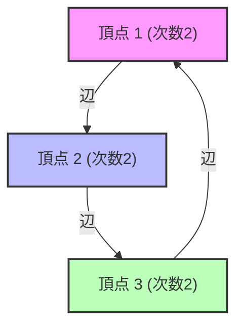

# 什么是谱图理论？

在我们的周围充满了网络。互联网的超链接结构、社交网络上的交友关系、电网，甚至大脑神经元的连接，都可以作为“图（Graph）”进行建模。谱图理论（Spectral Graph Theory）将这些图表示为“矩阵”，并使用诸如“[特征值](/zh-cn/p/eigenvalues-and-eigenvectors/)（Eigenvalues）”和“特征向量（Eigenvectors）”之类的线性代数概念，来揭示隐藏在网络中的宏观和微观属性的领域。

在本文中，我们将从基本的矩阵表示开始，深入探讨拉普拉斯矩阵[特征值](/zh-cn/p/eigenvalues-and-eigenvectors/)的物理意义、图分割中的重要基石——Cheeger不等式（Cheeger's inequality），以及作为Google基础的PageRank算法的数学证明。

---

## 1. 图的矩阵表示

考虑一个图 $G = (V, E)$。这里，$V$ 是顶点（节点）集合，$E$ 是边（边缘）集合。假设节点数为 $n = |V|$。为了在计算机或数学公式中处理这种图的结构，我们定义几个矩阵。

### 邻接矩阵 (Adjacency Matrix)

邻接矩阵 $A$ 是一个 $n \times n$ 的对称矩阵，如果顶点 $i$ 和 $j$ 之间存在连接（边），则 $A_{ij} = 1$，否则 $A_{ij} = 0$（在无权无向图的情况下）。

$$ A_{ij} = \begin{cases} 1 & \text{if } (i, j) \in E \\ 0 & \text{otherwise} \end{cases} $$

### 度矩阵 (Degree Matrix)

度矩阵 $D$ 是一个对角矩阵，其对角元素为每个顶点的度数（连接的边数）。

$$ D_{ii} = \sum_{j} A_{ij} $$
$$ D_{ij} = 0 \quad (\text{if } i \neq j) $$

### 拉普拉斯矩阵 (Laplacian Matrix)

在分析图的性质时，比邻接矩阵更强大的工具是“图拉普拉斯矩阵”。拉普拉斯矩阵 $L$ 定义如下：

$$ L = D - A $$

拉普拉斯矩阵具有以下极好的性质：
1. **对称性**: 因为 $L$ 是对称矩阵（$L = L^T$），所以所有[特征值](/zh-cn/p/eigenvalues-and-eigenvectors/)都是实数。
2. **半正定性**: 对于任意向量 $x \in \mathbb{R}^n$，二次型 $x^T L x$ 可以展开如下：
   $$ x^T L x = \sum_{(i,j) \in E} (x_i - x_j)^2 \geq 0 $$
   由此可知，$L$ 的所有[特征值](/zh-cn/p/eigenvalues-and-eigenvectors/)均大于或等于 $0$（$\lambda_0 \leq \lambda_1 \leq \dots \leq \lambda_{n-1}$）。
3. **最小[特征值](/zh-cn/p/eigenvalues-and-eigenvectors/)**: 始终有 $\lambda_0 = 0$，对应的特征向量是所有元素均为 $1$ 的向量 $\mathbf{1}$（$L\mathbf{1} = (D-A)\mathbf{1} = \mathbf{0}$）。



---

## 2. 特征值的物理意义：代数连通度与Fiedler向量

拉普拉斯矩阵 $L$ 的[特征值](/zh-cn/p/eigenvalues-and-eigenvectors/) $\lambda_i$ 真实地反映了图的“形状”和“连通性”。

- **$\lambda_0 = 0$ 的重数**: 表示图被分为多少个连通分量（独立的子图）。如果只有一个 $\lambda_0 = 0$（即 $\lambda_1 > 0$），则意味着该图是一个相连的网络。
- **$\lambda_1$（代数连通度, Algebraic Connectivity）**: 第二小的[特征值](/zh-cn/p/eigenvalues-and-eigenvectors/) $\lambda_1$ 是表示图连通强度的指标，也称为Fiedler值。这个值越大，图的结合就越紧密，网络就越难被分割成两部分。相反，这个值越接近0，暗示存在“瓶颈”，只需切断少量边即可将图分割。
- **Fiedler向量**: 对应于 $\lambda_1$ 的特征向量称为Fiedler向量。通过观察该向量元素的符号（正或负），可以将图自然地划分为两个聚类（这是谱聚类的基础）。

### 热传导与随机游走的比喻

在物理学中，拉普拉斯算子 $\nabla^2$ 出现在热传导方程和波动方程中。图上的拉普拉斯矩阵 $L$ 也起着完全相同的作用。如果给每个节点赋予“热量”，热量会沿着边缘扩散。代数连通度 $\lambda_1$ 决定了这种热量在整个网络中均匀化（弛豫时间）的速度有多快。

---

## 3. Cheeger不等式 (Cheeger's Inequality)

作为衡量图是否容易被分割的几何指标，有“Cheeger常数（Cheeger constant, Isoperimetric number）”$h_G$。当把图分为两个子集 $S$ 和 $V \setminus S$ 时，这是连接它们之间的边数除以较小集合的尺寸（或体积）的值的最小值。

$$ h_G = \min_{S \subset V, 0 < |S| \leq n/2} \frac{|E(S, V \setminus S)|}{|S|} $$

$h_G$ 较小意味着只需切断少量边即可分离出大型聚类的“瓶颈”存在。然而，严格计算 $h_G$ 是一个NP困难问题。

这里登场的是谱图理论的最大成果之一——“Cheeger不等式”。该定理将几何量 $h_G$ 与代数量 $\lambda_1$ 联系起来。

$$ \frac{\lambda_1}{2} \leq h_G \leq \sqrt{2 \lambda_1 \Delta} $$

（※ $\Delta$ 是图的最大度数）

通过这个不等式，仅仅计算[特征值](/zh-cn/p/eigenvalues-and-eigenvectors/) $\lambda_1$（这在多项式时间内是可能的），就能保证图中存在瓶颈。左侧的不等式表明，如果代数连通度大，则不存在瓶颈；右侧的不等式表明，如果代数连通度小，则必定存在良好的分割（瓶颈）。

---

## 4. 马尔可夫链与Google PageRank的数学证明

谱图理论最著名的应用是支撑Google搜索引擎的PageRank算法。这归结为将网络视为一个巨大的有向图，并求解随机游走的平稳分布问题。

### 概率转移矩阵 (Transition Matrix)

设有向图的邻接矩阵为 $A$，每个节点的出度为 $d_i^{out}$。概率转移矩阵 $P$ 定义如下：

$$ P_{ij} = \begin{cases} \frac{1}{d_i^{out}} & \text{if } (i,j) \in E \\ 0 & \text{otherwise} \end{cases} $$

如果行向量 $\pi$ 为状态概率分布，则1步后的分布为 $\pi P$。经过无限次步骤的极限（平稳分布）是满足 $\pi = \pi P$ 的 $\pi$。这无非是矩阵 $P$ 的左特征向量（对应于[特征值](/zh-cn/p/eigenvalues-and-eigenvectors/)1）。

### 佩伦-弗罗贝尼乌斯定理 (Perron-Frobenius Theorem)

保证该平稳分布唯一确定并可计算的是“佩伦-弗罗贝尼乌斯定理”。然而，实际的网络图并非强连通（比如存在死胡同页面等），并不满足该定理的条件。

因此，拉里·佩奇和谢尔盖·布林引入了“阻尼系数（Damping Factor）”$d \approx 0.85$。假设用户以概率 $d$ 点击链接，以概率 $1-d$ 跳转到完全随机的页面。

修正后的转移矩阵 $\tilde{P}$ 表示如下：

$$ \tilde{P} = d P + \frac{1-d}{n} \mathbf{1}\mathbf{1}^T $$

由于这个矩阵 $\tilde{P}$ 的所有元素均为正（正矩阵），因此佩伦-弗罗贝尼乌斯定理完全适用。

1. **最大的[特征值](/zh-cn/p/eigenvalues-and-eigenvectors/)严格为 1**，且其重数为 1。
2. 对应的左特征向量 $\pi$ 的所有元素均为正，这就是每个页面的PageRank（重要度）。
3. 所有其他[特征值](/zh-cn/p/eigenvalues-and-eigenvectors/)的绝对值严格小于 1，因此幂法（Power Iteration） $\pi^{(k+1)} = \pi^{(k)} \tilde{P}$ 无论初始状态如何，必定收敛于平稳分布 $\pi$。

通过这种巧妙的数学修正，PageRank成为一种可计算且稳定的算法。

---

## 5. 使用 Python (NetworkX) 进行谱分析的代码示例

为了将理论付诸实践，让我们使用 Python 的图网络库 `NetworkX` 结合 `NumPy` 和 `SciPy`，计算图的拉普拉斯矩阵[特征值](/zh-cn/p/eigenvalues-and-eigenvectors/)，并实现基于Fiedler向量的谱聚类。

```python
import networkx as nx
import numpy as np
import matplotlib.pyplot as plt
from scipy.linalg import eigh

# 1. カラテクラブのネットワークデータを読み込む
G = nx.karate_club_graph()

# 2. ラプラシアン行列の取得
L = nx.laplacian_matrix(G).todense()

# 3. 固有値分解 (scipy.linalg.eigh は対称行列に最適化されている)
eigenvalues, eigenvectors = eigh(L)

# 4. 第2固有値（代数的連結度）とFiedlerベクトルの取得
lambda_1 = eigenvalues[1]
fiedler_vector = eigenvectors[:, 1]

print(f"代数的連結度 (lambda_1): {lambda_1:.4f}")

# 5. Fiedlerベクトルに基づくグラフの2分割（スペクトルクラスタリング）
cluster_1 = [i for i, val in enumerate(fiedler_vector) if val < 0]
cluster_2 = [i for i, val in enumerate(fiedler_vector) if val >= 0]

# 6. 結果の可視化
plt.figure(figsize=(10, 7))
pos = nx.spring_layout(G, seed=42)
nx.draw_networkx_nodes(G, pos, nodelist=cluster_1, node_color='lightblue', label='Cluster 1')
nx.draw_networkx_nodes(G, pos, nodelist=cluster_2, node_color='lightgreen', label='Cluster 2')
nx.draw_networkx_edges(G, pos, alpha=0.5)
nx.draw_networkx_labels(G, pos, font_size=10)
plt.title(f"Spectral Clustering based on Fiedler Vector (λ1 = {lambda_1:.4f})")
plt.legend()
plt.axis('off')
plt.show()
```

执行这段代码，你可以看到著名的扎卡里空手道俱乐部网络仅仅通过Fiedler向量的符号（正或负）就被巧妙地分成了两个派系。这是仅通过矩阵特征向量的代数操作，就能揭开复杂网络结构的瞬间。

---

## 结论

谱图理论是完美连接图论这个离散数学世界与线性代数这个连续数学世界的桥梁。矩阵的[特征值](/zh-cn/p/eigenvalues-and-eigenvectors/)这一个数值，准确地捕捉了整个网络的连通性或瓶颈存在等宏观结构，并进一步通过PageRank等算法支撑着现代社会的信息基础设施。

只要通过矩阵的谱（[特征值](/zh-cn/p/eigenvalues-and-eigenvectors/)的分布）来观察我们每天看到的复杂网络，隐藏在其中的秩序和规律就会浮现出来。
