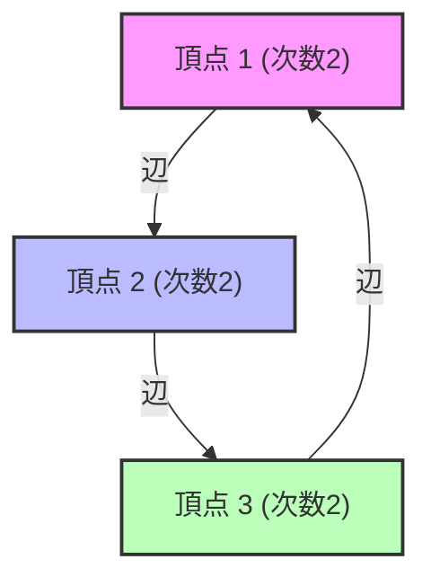

# 什麼是譜圖論？

我們的周遭充滿了各種網路。從網際網路的超連結結構、社群網站的交友關係、電力網，甚至大腦神經細胞的連結，全都可以被建模為「圖（Graph）」。譜圖論（Spectral Graph Theory）是將這些圖表示為「矩陣」，並使用線性代數中「[特徵值](/zh-tw/p/eigenvalues-and-eigenvectors/)（Eigenvalues）」和「特徵向量（Eigenvectors）」等概念，來揭示隱藏在網路中的宏觀與微觀性質的領域。

這篇文章將從基本的矩陣表示法開始，深入探討拉普拉斯矩陣[特徵值](/zh-tw/p/eigenvalues-and-eigenvectors/)所具備的物理意義、圖分割領域的里程碑「齊格不等式（Cheeger's inequality）」，以及成為 Google 基礎的 PageRank 演算法的數學證明。

---

## 1. 圖的矩陣表示法

考慮一個圖 $G = (V, E)$。這裡 $V$ 是頂點（節點）的集合，$E$ 是邊的集合。假設節點數為 $n = |V|$。為了能用電腦或數學公式處理這個圖的結構，我們定義了幾種矩陣。

### 鄰接矩陣 (Adjacency Matrix)

鄰接矩陣 $A$ 是一個 $n \times n$ 的對稱矩陣，當頂點 $i$ 和 $j$ 之間有連接（邊）時，$A_{ij} = 1$，否則 $A_{ij} = 0$（在無權無向圖的情況下）。

$$ A_{ij} = \begin{cases} 1 & \text{if } (i, j) \in E \\ 0 & \text{otherwise} \end{cases} $$

### 分支度矩陣 (Degree Matrix)

分支度矩陣 $D$ 是一個對角矩陣，其對角線元素為各頂點的分支度（相連邊的數量）。

$$ D_{ii} = \sum_{j} A_{ij} $$
$$ D_{ij} = 0 \quad (\text{if } i \neq j) $$

### 拉普拉斯矩陣 (Laplacian Matrix)

在分析圖的性質時，比鄰接矩陣更強大的工具就是「圖拉普拉斯」。拉普拉斯矩陣 $L$ 定義如下：

$$ L = D - A $$

拉普拉斯矩陣具有以下優異的性質：
1. **對稱性**: 因為 $L$ 是對稱矩陣（$L = L^T$），所以所有的[特徵值](/zh-tw/p/eigenvalues-and-eigenvectors/)都是實數。
2. **半正定性**: 對於任意向量 $x \in \mathbb{R}^n$，二次型 $x^T L x$ 可以展開如下：
   $$ x^T L x = \sum_{(i,j) \in E} (x_i - x_j)^2 \geq 0 $$
   由此可知，$L$ 的所有[特徵值](/zh-tw/p/eigenvalues-and-eigenvectors/)都大於或等於 $0$（$\lambda_0 \leq \lambda_1 \leq \dots \leq \lambda_{n-1}$）。
3. **最小[特徵值](/zh-tw/p/eigenvalues-and-eigenvectors/)**: 恆有 $\lambda_0 = 0$，其對應的特徵向量是所有元素皆為 $1$ 的向量 $\mathbf{1}$（$L\mathbf{1} = (D-A)\mathbf{1} = \mathbf{0}$）。



---

## 2. 特徵值的物理意義：代數連通度與 Fiedler 向量

拉普拉斯矩陣 $L$ 的[特徵值](/zh-tw/p/eigenvalues-and-eigenvectors/) $\lambda_i$ 如實地反映了圖的「形狀」和「連通性」。

- **$\lambda_0 = 0$ 的重數**: 表示圖被分成了多少個連通分量（獨立的子圖）。如果只有一個 $\lambda_0 = 0$（即 $\lambda_1 > 0$），這意味著圖是一個單一連通的網路。
- **$\lambda_1$（代數連通度, Algebraic Connectivity）**: 第二小的[特徵值](/zh-tw/p/eigenvalues-and-eigenvectors/) $\lambda_1$ 是顯示圖連通強度的指標，也被稱為 Fiedler 值。這個值越大，圖的結合越緊密，就越難將網路切分成兩個部分。反之，當這個值越接近 0，暗示著存在著「瓶頸」，只要切斷少數的邊就能使圖分裂。
- **Fiedler 向量**: 對應於 $\lambda_1$ 的特徵向量被稱為 Fiedler 向量。透過觀察這個向量元素的符號（正或負），可以將圖自然地分割成兩個叢集（譜分群的基礎）。

### 熱傳導與隨機漫步的類比

在物理學中，拉普拉斯算子 $\nabla^2$ 出現在熱傳導方程式或波動方程式中。圖上的拉普拉斯矩陣 $L$ 也扮演著完全相同的角色。如果讓每個節點擁有「熱量」，熱量會沿著邊擴散。代數連通度 $\lambda_1$ 決定了這個熱量能多快地在整個網路中達到均勻化（弛豫時間）。

---

## 3. 齊格不等式 (Cheeger's Inequality)

作為衡量圖是否容易被分割的幾何指標，有「齊格常數（Cheeger constant, Isoperimetric number）」$h_G$。這是當我們把圖分成兩個子集 $S$ 和 $V \setminus S$ 時，連接兩者的邊數除以較小集合的大小（或體積）所得到的最小值。

$$ h_G = \min_{S \subset V, 0 < |S| \leq n/2} \frac{|E(S, V \setminus S)|}{|S|} $$

$h_G$ 越小，意味著只要切斷少量的邊就能分離出一個大叢集，表示存在「瓶頸」。然而，要精確計算 $h_G$ 是一個 NP 困難問題。

這裡，譜圖論最偉大的成果之一「齊格不等式」登場了。這個定理將幾何量 $h_G$ 和代數量 $\lambda_1$ 聯繫了起來。

$$ \frac{\lambda_1}{2} \leq h_G \leq \sqrt{2 \lambda_1 \Delta} $$

（※ $\Delta$ 是圖的最大分支度）

藉由這個不等式，只要計算[特徵值](/zh-tw/p/eigenvalues-and-eigenvectors/) $\lambda_1$（這可以在多項式時間內完成），就能保證圖中是否存在瓶頸。左側的不等式表示，如果代數連通度很大，就不存在瓶頸；而右側的不等式則表示，如果代數連通度很小，就必定存在良好的分割（瓶頸）。

---

## 4. 馬可夫鏈與 Google PageRank 的數學證明

譜圖論最著名的應用，莫過於支撐 Google 搜尋引擎的 PageRank 演算法。這將網際網路視為一個巨大的有向圖，並歸結為求取[隨機漫步](/zh-tw/p/random-walk/)的平穩分佈問題。

### 轉移機率矩陣 (Transition Matrix)

設有向圖的鄰接矩陣為 $A$，各節點的出度為 $d_i^{out}$。轉移機率矩陣 $P$ 定義如下：

$$ P_{ij} = \begin{cases} \frac{1}{d_i^{out}} & \text{if } (i,j) \in E \\ 0 & \text{otherwise} \end{cases} $$

若將列向量 $\pi$ 設為狀態機率分佈，1 步後的分佈為 $\pi P$。經過無限次步驟後的極限（平穩分佈）是滿足 $\pi = \pi P$ 的 $\pi$。這正是矩陣 $P$ 的左特徵向量（對應於[特徵值](/zh-tw/p/eigenvalues-and-eigenvectors/) 1）。

### 佩龍-弗羅貝尼烏斯定理 (Perron-Frobenius Theorem)

保證這個平穩分佈是唯一確定且可計算的，正是「佩龍-弗羅貝尼烏斯定理」。但是，實際的網頁圖形並非強連通（例如存在死胡同的網頁等），因此並不滿足該定理的條件。

於是，賴瑞·佩吉 (Larry Page) 和謝爾蓋·布林 (Sergey Brin) 引入了「阻尼係數（Damping Factor）」$d \approx 0.85$。假設使用者以機率 $d$ 沿著連結點擊，並以機率 $1-d$ 完全隨機地跳躍到任意網頁。

修正後的轉移矩陣 $\tilde{P}$ 可以表示為：

$$ \tilde{P} = d P + \frac{1-d}{n} \mathbf{1}\mathbf{1}^T $$

因為這個矩陣 $\tilde{P}$ 的所有元素皆為正數（正矩陣），所以佩龍-弗羅貝尼烏斯定理可以完全適用。

1. **最大[特徵值](/zh-tw/p/eigenvalues-and-eigenvectors/)嚴格為 1**，且其重數為 1。
2. 對應的左特徵向量 $\pi$ 的所有元素皆為正，這就成為了各網頁的 PageRank（重要度）。
3. 其他所有[特徵值](/zh-tw/p/eigenvalues-and-eigenvectors/)的絕對值都嚴格小於 1，因此冪次法（Power Iteration） $\pi^{(k+1)} = \pi^{(k)} \tilde{P}$ 無論初始狀態為何，都必定會收斂到平穩分佈 $\pi$。

透過這種巧妙的數學修正，PageRank 成為了一個可計算且穩定的演算法。

---

## 5. Python (NetworkX) を用いたスペクトル解析のコード例

為了將理論付諸實踐，讓我們使用 Python 的圖網路函式庫 `NetworkX` 以及 `NumPy`、`SciPy`，來計算圖的拉普拉斯矩陣[特徵值](/zh-tw/p/eigenvalues-and-eigenvectors/)，並實作使用 Fiedler 向量進行譜分群。

```python
import networkx as nx
import numpy as np
import matplotlib.pyplot as plt
from scipy.linalg import eigh

# 1. カラテクラブのネットワークデータを読み込む
G = nx.karate_club_graph()

# 2. ラプラシアン行列の取得
L = nx.laplacian_matrix(G).todense()

# 3. 固有値分解 (scipy.linalg.eigh は対称行列に最適化されている)
eigenvalues, eigenvectors = eigh(L)

# 4. 第2固有値（代数的連結度）とFiedlerベクトルの取得
lambda_1 = eigenvalues[1]
fiedler_vector = eigenvectors[:, 1]

print(f"代数的連結度 (lambda_1): {lambda_1:.4f}")

# 5. Fiedlerベクトルに基づくグラフの2分割（スペクトルクラスタリング）
cluster_1 = [i for i, val in enumerate(fiedler_vector) if val < 0]
cluster_2 = [i for i, val in enumerate(fiedler_vector) if val >= 0]

# 6. 結果の可視化
plt.figure(figsize=(10, 7))
pos = nx.spring_layout(G, seed=42)
nx.draw_networkx_nodes(G, pos, nodelist=cluster_1, node_color='lightblue', label='Cluster 1')
nx.draw_networkx_nodes(G, pos, nodelist=cluster_2, node_color='lightgreen', label='Cluster 2')
nx.draw_networkx_edges(G, pos, alpha=0.5)
nx.draw_networkx_labels(G, pos, font_size=10)
plt.title(f"Spectral Clustering based on Fiedler Vector (λ1 = {lambda_1:.4f})")
plt.legend()
plt.axis('off')
plt.show()
```

執行這段程式碼後，就可以確認著名的 Zachary 空手道俱樂部網路，僅憑藉 Fiedler 向量的符號（正或負），就能完美地被分成兩個派系。這正是複雜的網路結構，單靠矩陣的特徵向量這種代數操作就被解開的瞬間。

---

## 結論

譜圖論是完美連接圖論這個離散數學世界與線性代數這個連續數學世界的橋樑。矩陣的[特徵值](/zh-tw/p/eigenvalues-and-eigenvectors/)這樣一個單純的數值，準確地捕捉了整個網路的連通性、瓶頸的存在等宏觀結構，更透過 PageRank 這類的演算法，支撐著現代社會的資訊基礎設施。

只要透過矩陣的譜（[特徵值](/zh-tw/p/eigenvalues-and-eigenvectors/)的分佈）來看待我們日常所見的複雜網路，隱藏在其中的秩序和法則就會浮現出來。
