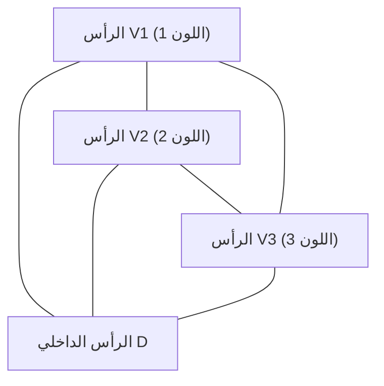

# 1. مقدمة: سر الرياضيات الذي يبدأ بلغز

يكمن جمال الرياضيات غالباً في كيف يمكن لقواعد بسيطة للغاية أن تؤدي إلى نتائج عميقة وغير متوقعة تماماً. أحد أكثر الأمثلة شهرة على ذلك هو **[توطئة سبيرنر](https://kenji.blog/ar/p/sperners-lemma/)** ([Sperner's Lemma](https://kenji.blog/ar/p/sperners-lemma/)). هذه التوطئة، التي نُشرت عام 1928 من قبل عالم الرياضيات الألماني إيمانويل سبيرنر، تبدو للوهلة الأولى مجرد "لغز تلوين مثلث" يمكن حتى لطالب في المدرسة الابتدائية فهمه.

ومع ذلك، يحتل هذا اللغز البسيط مكانة مهمة للغاية في الرياضيات الحديثة. على وجه الخصوص، فهو يعمل كأداة قوية لإثبات تركيبي وبناء لـ **نظرية النقطة الثابتة لـ براور** (Brouwer Fixed-Point Theorem)، وهي نظرية أساسية في الطوبولوجيا وتُطبق على نطاق واسع في مجالات مثل نظرية الألعاب في الاقتصاد (كما في إثبات وجود توازن ناش).

في هذه المقالة، سنشرح [توطئة سبيرنر](https://kenji.blog/ar/p/sperners-lemma/) بالتفصيل مع الرسوم البيانية، ونغطي كل شيء بدءاً من معناها البديهي وإثباتها الرياضي الدقيق، إلى تطبيقها على نظريات النقطة الثابتة التي تسد الفجوة مع العالم المستمر.

# 2. التبسيطات والمركبات المبسطة: أسس الهندسة

لفهم [توطئة سبيرنر](https://kenji.blog/ar/p/sperners-lemma/)، يجب علينا أولاً توضيح مفاهيم **المبسط** (Simplex) و **المركب المبسط** (Simplicial Complex / Triangulation).

## 2.1. ما هو المبسط؟

في مساحة ذات $n$ من الأبعاد، عندما يكون هناك $n+1$ من النقاط المستقلة هندسياً، فإن أصغر مجموعة محدبة مبنية معها كرؤوس تسمى **$n$-مبسط**.
- 0-مبسط: نقطة
- 1-مبسط: قطعة مستقيمة
- 2-مبسط: مثلث
- 3-مبسط: رباعي السطوح

هنا، سنركز بشكل أساسي على الـ 2-مبسط، "المثلث"، وهو الأسهل فهماً بصرياً. لنفترض أن هناك مثلثاً كبيراً $T$، ولتكن رؤوسه الثلاثة $V_1, V_2, V_3$.

## 2.2. المركب المبسط (التثليث)

دعونا نفكر في تقسيم هذا المثلث الكبير $T$ إلى عدة مثلثات أصغر. ومع ذلك، لا يمكنك تقسيمه بشكل تعسفي. يُطلق على التقسيم الذي يلبي الشروط التالية اسم **التثليث**.

1. لتكن $\mathcal{K}$ مجموعة المثلثات الصغيرة المتكونة من التقسيم. إذا تقاطع أي مثلثين في $\mathcal{K}$، يجب أن يكون تقاطعهما إما "رأساً مشتركاً" أو "حافة مشتركة".
2. لا يُسمح بـ "الاتصالات النصفية"، حيث تتداخل المثلثات الصغيرة جزئياً أو عندما يقع رأس مثلث آخر في منتصف حافة.

بالنسبة لشبكة المثلثات المقسمة بهذه الطريقة، فإن تلوين كل رأس يمهد الطريق ل[توطئة سبيرنر](https://kenji.blog/ar/p/sperners-lemma/).

# 3. تلوين سبيرنر: قواعد الحدود

لنفترض أنه تم إعطاء تثليث للمثلث $T$. ضع في اعتبارك وظيفة $C: V \to \{1, 2, 3\}$ تقوم بتعيين لون لـ **جميع الرؤوس** التي تظهر في هذا التقسيم (رؤوس المثلث الكبير، والرؤوس الموجودة على الحواف، والرؤوس الداخلية).

ومع ذلك، يجب عليك تلوينها وفقاً لـ **شرط سبيرنر** الصارم التالي (قواعد الحدود).

1. **تلوين الرؤوس الرئيسية** : يجب تلوين الرؤوس الثلاثة للمثلث الكبير، $V_1, V_2, V_3$، بلون مختلف لكل منها. على سبيل المثال، ليكن $C(V_1) = 1, C(V_2) = 2, C(V_3) = 3$.
2. **تلوين الرؤوس على الحواف** : يجب تلوين الرؤوس الموجودة على حواف المثلث الكبير بأحد الألوان نفسها كنقاط نهاية تلك الحافة.
   - الرؤوس على الحافة $V_1V_2$ هي اللون 1 أو اللون 2.
   - الرؤوس على الحافة $V_2V_3$ هي اللون 2 أو اللون 3.
   - الرؤوس على الحافة $V_3V_1$ هي اللون 3 أو اللون 1.
3. **تلوين الرؤوس الداخلية** : يمكن تلوين الرؤوس داخل المثلث الكبير بحرية بأي من الألوان 1 أو 2 أو 3.

يُطلق على التلوين الذي يتبع هذه القواعد اسم **تلوين سبيرنر** (Sperner Coloring).

# 4. بيان [توطئة سبيرنر](https://kenji.blog/ar/p/sperners-lemma/)

عند الانتهاء من التلوين وفقاً لقواعد تلوين سبيرنر، ما هي الظاهرة التي تحدث؟ تؤكد [توطئة سبيرنر](https://kenji.blog/ar/p/sperners-lemma/) الحقيقة المذهلة التالية.

> **[توطئة سبيرنر](https://kenji.blog/ar/p/sperners-lemma/) (ثنائية الأبعاد)**
> في أي تلوين سبيرنر، يجب أن يكون عدد المثلثات الصغيرة حيث يتم طلاء الرؤوس الثلاثة بألوان مختلفة (اللون 1، اللون 2، واللون 3) **عدداً فردياً**.
> ونظراً لأنه عدد فردي (1، 3، 5، ...)، فإن مثل هذا "المثلث الصغير الكامل ذي الألوان الثلاثة" **يجب أن يوجد مرة واحدة على الأقل**.

بغض النظر عن مدى تعمدك في تلوين الرؤوس الداخلية، أو مدى دقة وتعقيد تقسيمك للمثلث، فإن مثلثاً صغيراً بالألوان الثلاثة (دعنا نسميه **مثلثاً كاملاً**) سيظهر بالتأكيد في مكان ما.

# 5. إثبات جميل باستخدام نظرية المخططات

قد تبدو هذه النظرية سحرية بشكل بديهي، لكن يمكن إثباتها بشكل جميل باستخدام مفاهيم "المخطط المزدوج" و "توطئة المصافحة". من السهل جداً فهم هذا النهج إذا استخدمنا تشبيه "الغرف والأبواب".

## 5.1. تعريف الغرف والأبواب

اعتبر كل مثلث صغير مقسم كـ "غرفة". أيضاً، دعنا نطلق على الجزء الخارجي للمثلث الكبير $T$ اسم "الخارج".
ما يفصل الغرفة عن غرفة أخرى، أو الغرفة عن الخارج، هو "الحافة" (الجدار) للمثلث الصغير.

هنا، نحدد جداراً خاصاً على أنه **باب**.
- **تعريف الباب** : الحافة التي تم تلوين طرفيها بـ **اللون 1 واللون 2** تسمى "باباً".

دعونا نفكر في عدد الأبواب التي تمتلكها كل غرفة (مثلث صغير). نظراً لأن المثلث الصغير يحتوي على ثلاثة رؤوس، يتم تصنيفه إلى الحالات التالية بناءً على مجموعات الألوان.

1. **الغرف ذات الألوان (1, 1, 1), (2, 2, 2), (3, 3, 3)**
   - نظراً لعدم وجود حواف بزوج من 1 و 2، يوجد **0 أبواب** .
2. **الغرف ذات الألوان (1, 1, 2) أو (1, 2, 2)**
   - يوجد بالضبط حافتان تربطان اللون 1 واللون 2. لذلك، يوجد **بابان** .
3. **الغرف ذات الألوان (1, 3, 3) أو (2, 2, 3) إلخ.**
   - نظراً لعدم وجود زوج من 1 و 2، يوجد **0 أبواب** .
4. **الغرف ذات الألوان (1, 2, 3) (المثلث الكامل)**
   - توجد حافة واحدة فقط تربط اللون 1 واللون 2. لذلك، يوجد **باب واحد** .

باختصار، **الغرف ذات المثلثات الكاملة فقط هي التي تحتوي على عدد فردي (1) من الأبواب، وجميع الغرف الأخرى تحتوي على عدد زوجي (0 أو 2) من الأبواب** .

## 5.2. عدد الأبواب على الجدار الخارجي

بعد ذلك، نقوم بحساب عدد الأبواب على المحيط الخارجي (الجدار الخارجي) للمثلث الكبير.
الجدار الخارجي حيث يمكن أن توجد أبواب (حواف من اللون 1 و 2) موجود فقط على الحافة $V_1V_2$. (لن تظهر الألوان 1 و 2 معاً على الحواف $V_2V_3$ أو $V_3V_1$ بسبب القواعد).

إذا نظرنا إلى ألوان الرؤوس على الحافة $V_1V_2$ بشكل متسلسل من $V_1$، فإن الأول هو اللون 1 والأخير هو اللون 2. عدد المرات التي يتغير فيها اللون من 1 إلى 2، أو من 2 إلى 1، **يجب أن يكون عدداً فردياً** لأن نقطة البداية ونقطة النهاية لهما ألوان مختلفة.
لذلك، من الواضح أن عدد الأبواب المؤدية إلى الخارج هو **عدد فردي** .

## 5.3. حساب الدرجات باستخدام توطئة المصافحة

هنا يأتي دور نظرية المخططات.
- رؤوس المخطط: كل مثلث صغير (غرفة) والخارج.
- حواف المخطط: الأبواب (حواف من اللون 1 و 2). عندما تتشارك غرفتان في باب، قم بتوصيل رؤوسهما بحافة.

وفقاً لـ "توطئة المصافحة"، وهي نظرية أساسية في نظرية المخططات، فإن مجموع "درجات" (عدد الحواف المتصلة) لجميع الرؤوس يجب أن يكون دائماً عدداً زوجياً (ضعف عدد الحواف).

$$ \sum_{v \in V} \text{deg}(v) = 2|E| $$

في المخطط الذي أنشأناه، ما هي درجات (عدد الأبواب) لكل رأس؟
- درجة الخارج = عدد الأبواب على الجدار الخارجي = **عدد فردي**
- درجة غرف المثلث الكامل = 1 = **عدد فردي**
- درجة الغرف الأخرى = 0 أو 2 = **عدد زوجي**

دعونا نحسب المجموع الكلي للدرجات.
$$ \text{المجموع الكلي} = \text{درجة الخارج} + \text{مجموع درجات المثلثات الكاملة} + \text{مجموع درجات الغرف الأخرى} $$

يجب أن يكون المجموع الكلي عدداً زوجياً.
درجة الخارج "فردية"، ومجموع درجات الغرف الأخرى "زوجية".
لذلك، **يجب أن يكون "مجموع درجات المثلثات الكاملة" عدداً فردياً** ليكون المجموع الكلي زوجياً.
نظراً لأن درجة كل مثلث كامل هي 1، فإن عدد المثلثات الكاملة **يجب أن يكون عدداً فردياً** .

وبهذا، ثبت تماماً وجود مثلث كامل واحد على الأقل.

# 6. التعميم على الأبعاد الأعلى

لا تقتصر [توطئة سبيرنر](https://kenji.blog/ar/p/sperners-lemma/) على المثلثات ثنائية الأبعاد بل تنطبق على أي $n$-مبسط.

في حالة الـ $n$-مبسط (على سبيل المثال، رباعي السطوح لـ $n=3$)، يوجد $n+1$ من الرؤوس، ونستخدم $n+1$ من الألوان، $1, 2, \dots, n+1$.
يتم تعميم شرط الحدود على النحو التالي: "يجب أن تستخدم الرؤوس على أي وجه $k$-الأبعاد فقط نفس الألوان التي تستخدمها رؤوس الـ $k+1$ التي تشكل ذلك الوجه."

يستخدم الإثبات الاستقراء الرياضي.
- بالنسبة لـ $n=1$: نقطتا نهاية القطعة المستقيمة هما اللون 1 واللون 2. النقاط المتوسطة هي 1 أو 2. عدد الأماكن التي يتغير فيها من 1 إلى 2 (1-مبسط كامل) هو دائماً فردي.
- بافتراض أنه ينطبق على $n=k$، عند الإثبات لـ $n=k+1$، نقوم بحساب عدد "الأبواب" (وجوه كاملة من الألوان $n$) بنفس الطريقة السابقة، مما يوضح ببراعة وجود عدد فردي من المبسطات الكاملة ذات الألوان $n+1$.

# 7. التطبيق على نظرية النقطة الثابتة لـ براور

لماذا تعتبر [توطئة سبيرنر](https://kenji.blog/ar/p/sperners-lemma/) مهمة جداً؟ ذلك لأن هذه النظرية المنفصلة تعمل كجسر لإثبات نظرية طوبولوجية مستمرة، وهي **نظرية النقطة الثابتة لـ براور**.

## 7.1. ما هي نظرية النقطة الثابتة لـ براور؟

> **نظرية النقطة الثابتة لـ براور**
> أي تعيين مستمر $f: D \to D$ من كرة الوحدة ذات الأبعاد $n$ (أو مبسط) إلى نفسها يجب أن يكون له على الأقل نقطة واحدة $x$ (نقطة ثابتة) بحيث $f(x) = x$.

هذه نظرية مشهورة غالباً ما تُشرح بالمجاز التالي: عندما تقوم بتحريك قهوتك وتضع الفنجان، هناك دائماً على الأقل جسيم واحد من القهوة موجود في نفس الموضع تماماً كما كان قبل أن تبدأ في التحريك.

## 7.2. النهج من [توطئة سبيرنر](https://kenji.blog/ar/p/sperners-lemma/)

المنطق لاستنتاج نظرية النقطة الثابتة من [توطئة سبيرنر](https://kenji.blog/ar/p/sperners-lemma/) أنيق للغاية.

1. **تقييم إحداثيات مركز الثقل ومتجهات الإزاحة**
   قم بتطبيق التعيين المستمر $f$ على نقطة عشوائية $x$ على المبسط وانظر إلى الوجهة $f(x)$. قم بتعيين لون للنقطة $x$ بناءً على الاتجاه الذي تحركت فيه (أي مكون من إحداثيات مركز الثقل انخفض).
   $$ \text{على سبيل المثال، إذا كان المكون } i \text{ من } x \text{ أكبر بشكل صارم من المكون } i \text{ من } f(x) \text{، قم بطلائه باللون } i $$
   
2. **التحقق من شروط الحدود**
   بسبب طبيعة التعيين المستمر حيث لا يمكنك التحرك إلى الخارج عند الحدود، فإن طريقة التلوين هذه تلبي تماماً شروط تلوين سبيرنر.

3. **الانتقال إلى النهاية**
   نقوم بتثليث المثلث بشكل أدق وأدق. في كل تثليث، وفقاً ل[توطئة سبيرنر](https://kenji.blog/ar/p/sperners-lemma/)، هناك دائماً مثلث صغير حيث توجد الألوان الثلاثة.
   
4. **الاكتناز والتقارب**
   نأخذ النهاية عندما يقترب حجم التقسيم من الصفر. وفقاً لـ نظرية بولزانو-فايرستراس (سلسلة في مساحة مدمجة تحتوي على سلسلة فرعية متقاربة)، تتقارب هذه السلسلة من المثلثات الكاملة إلى نقطة واحدة $x^*$.
   
5. **تحديد النقطة الثابتة**
   نظراً لأن التعيين $f$ مستمر، يجب أن يكون له في نقطة النهاية $x^*$ "اتجاه تنخفض فيه جميع المكونات"، ولكن نظراً لأن مجموع إحداثيات مركز الثقل هو دائماً 1، فمن المستحيل أن تنخفض جميع المكونات. لذلك، فإن الاحتمال الوحيد هو أنه "لا يوجد مكون يتغير"، أي $f(x^*) = x^*$. هذه هي النقطة الثابتة.

# 8. تطبيقات أخرى: التقسيم العادل والاقتصاد

إلى جانب نظرية النقطة الثابتة، تُطبق [توطئة سبيرنر](https://kenji.blog/ar/p/sperners-lemma/) مباشرة على مشاكل العالم الحقيقي.
الأمثلة النموذجية هي "مشكلة تقسيم الإيجار العادل" و "مشكلة تقطيع الكيك".

عندما يتشارك العديد من الأشخاص في منزل، يمكن أن تنشأ صراعات حول من يستأجر أي غرفة وبأي مبلغ، لأن حجم وظروف الغرف تختلف. باستخدام الخوارزميات التي تطبق [توطئة سبيرنر](https://kenji.blog/ar/p/sperners-lemma/) (مثل خوارزمية سو)، يمكن إثبات أنه يوجد دائماً تخصيص عادل حيث "يشعر الجميع بالرضا عن غرفتهم وإيجارهم الذي اختاروه، ومجموع الإيجارات يتطابق مع المبلغ الأصلي"، وعلاوة على ذلك، يمكن العثور على ذلك تقريباً.

أيضاً، يعتمد "وجود توازن ناش" الذي أثبته جون ناش في الاقتصاد على نظريات النقطة الثابتة لـ براور أو كاكوتاني، مما يخفي بشكل أساسي الهياكل التركيبية مثل [توطئة سبيرنر](https://kenji.blog/ar/p/sperners-lemma/).

# 9. خاتمة

تبدأ [توطئة سبيرنر](https://kenji.blog/ar/p/sperners-lemma/) بإعداد يشبه اللعبة تقريباً لتلوين رؤوس مثلث وفقاً للقواعد. ومع ذلك، ففي إطار هذا المنطق البسيط لـ "عد عدد الأبواب"، اختبأت حقائق عميقة حول استمرارية وثبات المساحة.

الرياضيات المنفصلة والرياضيات المستمرة. إن حقيقة أن هذين العالمين المختلفين تماماً ظاهرياً مرتبطان بنظرية جميلة جداً هو بلا شك أحد أعظم جاذبيات الرياضيات كنظام. نحن نشجع القراء على أخذ ورقة وقلم، وتقسيم مثلث بشكل تعسفي وطلائه بـ 3 ألوان. عندما تجد "المثلث الكامل" الذي يختبئ هناك دائماً، يجب أن تكون قادراً أنت أيضاً على لمس سر الرياضيات.
