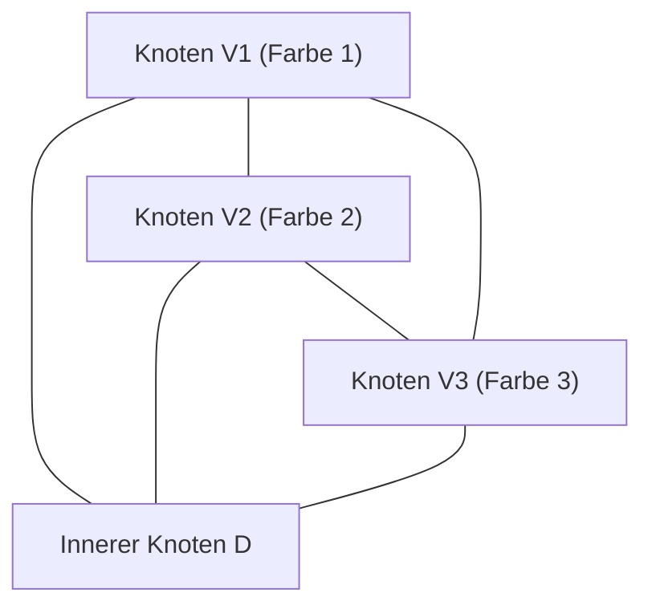

# 1. Einleitung: Das Geheimnis der Mathematik, das mit einem Puzzle beginnt

Die Schönheit der Mathematik liegt oft darin, wie extrem einfache Regeln zu tiefgreifenden und völlig unerwarteten Ergebnissen führen können. Eines der ikonischsten Beispiele dafür ist das **Spernersche Lemma** ([Sperner's Lemma](https://kenji.blog/de/p/sperners-lemma/)). Veröffentlicht 1928 von dem deutschen Mathematiker Emanuel Sperner, scheint dieses Lemma auf den ersten Blick nichts weiter als ein "Dreiecks-Färbepuzzle" zu sein, das selbst ein Grundschüler verstehen könnte.

Dieses einfache Puzzle nimmt jedoch eine extrem wichtige Position in der modernen Mathematik ein. Insbesondere dient es als mächtiges Werkzeug für einen kombinatorischen und konstruktiven Beweis des **Brouwerschen Fixpunktsatzes** (Brouwer Fixed-Point Theorem), der ein grundlegender Satz in der Topologie ist und in Bereichen wie der Spieltheorie in den Wirtschaftswissenschaften (z. B. beim Beweis der Existenz des Nash-Gleichgewichts) breite Anwendung findet.

In diesem Artikel werden wir [Sperners Lemma](https://kenji.blog/de/p/sperners-lemma/) im Detail mit Diagrammen erklären und dabei alles von seiner intuitiven Bedeutung und seinem strengen mathematischen Beweis bis hin zu seiner Anwendung auf Fixpunktsätze behandeln, die eine Brücke zur kontinuierlichen Welt schlagen.

# 2. Simplizes und Simplizialkomplexe: Die Grundlagen der Geometrie

Um [Sperners Lemma](https://kenji.blog/de/p/sperners-lemma/) zu verstehen, müssen wir zunächst die Konzepte eines **Simplexes** (Simplex) und eines **Simplizialkomplexes** (Simplicial Complex / Triangulation) klären.

## 2.1. Was ist ein Simplex?

Wenn es in einem $n$-dimensionalen Raum $n+1$ geometrisch unabhängige Punkte gibt, wird die kleinste konvexe Menge, die mit ihnen als Eckpunkten (Knoten) konstruiert wird, als **$n$-Simplex** bezeichnet.
- 0-Simplex: Punkt
- 1-Simplex: Streckenabschnitt
- 2-Simplex: Dreieck
- 3-Simplex: Tetraeder

Hier werden wir uns hauptsächlich auf das 2-Simplex konzentrieren, das "Dreieck", welches visuell am einfachsten zu verstehen ist. Angenommen, es gibt ein großes Dreieck $T$, und seine drei Eckpunkte seien $V_1, V_2, V_3$.

## 2.2. Simplizialkomplex (Triangulierung)

Betrachten wir die Unterteilung dieses großen Dreiecks $T$ in mehrere kleinere Dreiecke. Sie können es jedoch nicht willkürlich unterteilen. Eine Unterteilung, die die folgenden Bedingungen erfüllt, wird als **Triangulierung** bezeichnet.

1. Sei $\mathcal{K}$ die Menge der kleinen Dreiecke, die durch die Unterteilung entstehen. Wenn sich zwei beliebige Dreiecke in $\mathcal{K}$ schneiden, muss ihr Schnittpunkt entweder ein "gemeinsamer Knoten" oder eine "gemeinsame Kante" sein.
2. "Halbherzige Verbindungen", bei denen sich kleine Dreiecke teilweise überlappen oder ein Knoten eines anderen Dreiecks in der Mitte einer Kante liegt, sind nicht zulässig.

Für das auf diese Weise unterteilte Netzwerk von Dreiecken bereitet die Färbung jedes Knotens die Bühne für [Sperners Lemma](https://kenji.blog/de/p/sperners-lemma/).

# 3. Sperner-Färbung: Die Randregeln

Angenommen, eine Triangulierung des Dreiecks $T$ ist gegeben. Betrachten wir eine Funktion $C: V \to \{1, 2, 3\}$, die **allen Knoten**, die in dieser Unterteilung vorkommen (Knoten des großen Dreiecks, Knoten auf den Kanten und innere Knoten), eine Farbe zuweist.

Sie müssen sie jedoch nach der folgenden strengen **Sperner-Bedingung** (Randregeln) färben.

1. **Färbung der Hauptknoten** : Die drei Knoten des großen Dreiecks, $V_1, V_2, V_3$, müssen jeweils mit einer anderen Farbe gefärbt werden. Zum Beispiel sei $C(V_1) = 1, C(V_2) = 2, C(V_3) = 3$.
2. **Färbung der Knoten auf den Kanten** : Die Knoten auf den Kanten des großen Dreiecks müssen mit einer der gleichen Farben wie die Endpunkte dieser Kante gefärbt sein.
   - Knoten auf der Kante $V_1V_2$ haben Farbe 1 oder Farbe 2.
   - Knoten auf der Kante $V_2V_3$ haben Farbe 2 oder Farbe 3.
   - Knoten auf der Kante $V_3V_1$ haben Farbe 3 oder Farbe 1.
3. **Färbung der inneren Knoten** : Die Knoten innerhalb des großen Dreiecks können frei mit einer der Farben 1, 2 oder 3 gefärbt werden.

Eine Färbung, die diesen Regeln folgt, wird als **Sperner-Färbung** (Sperner Coloring) bezeichnet.

# 4. Die Aussage von [Sperners Lemma](https://kenji.blog/de/p/sperners-lemma/)

Wenn Sie die Färbung gemäß den Regeln der Sperner-Färbung abgeschlossen haben, welches Phänomen tritt auf? [Sperners Lemma](https://kenji.blog/de/p/sperners-lemma/) behauptet die folgende erstaunliche Tatsache.

> **Spernersches Lemma (2D)**
> Bei jeder Sperner-Färbung **muss die Anzahl** der kleinen Dreiecke, bei denen alle drei Knoten in verschiedenen Farben (Farbe 1, Farbe 2 und Farbe 3) gemalt sind, **eine ungerade Zahl sein**.
> Da es sich um eine ungerade Zahl (1, 3, 5, ...) handelt, **muss** ein solches "komplettes kleines Dreieck mit allen 3 Farben" **mindestens einmal existieren**.

Egal, wie absichtlich Sie die inneren Knoten färben oder wie fein und komplex Sie das Dreieck unterteilen, ein kleines Dreieck mit allen 3 Farben (nennen wir es ein **komplettes Dreieck**) wird definitiv irgendwo auftauchen.

# 5. Ein wunderschöner Beweis mit Hilfe der Graphentheorie

Dieser Satz mag intuitiv magisch erscheinen, aber er kann wunderbar mit den Konzepten des "dualen Graphen" und des "Handschlaglemmas" bewiesen werden. Dieser Ansatz ist sehr leicht zu verstehen, wenn wir die Analogie von "Räumen und Türen" verwenden.

## 5.1. Definition von Räumen und Türen

Betrachten Sie jedes triangulierte kleine Dreieck als einen "Raum". Nennen wir außerdem die Außenseite des großen Dreiecks $T$ das "Freie".
Was einen Raum von einem anderen Raum oder einen Raum vom Freien trennt, ist die "Kante" (Wand) des kleinen Dreiecks.

Hier definieren wir eine besondere Wand als **Tür**.
- **Definition einer Tür** : Eine Kante, deren Endpunkte mit **Farbe 1 und Farbe 2** gefärbt sind, wird als "Tür" bezeichnet.

Überlegen wir uns, wie viele Türen jeder Raum (kleines Dreieck) hat. Da ein kleines Dreieck drei Knoten hat, wird es basierend auf Farbkombinationen in die folgenden Fälle eingeteilt.

1. **Räume mit den Farben (1, 1, 1), (2, 2, 2), (3, 3, 3)**
   - Da es keine Kanten mit einem Paar von 1 und 2 gibt, gibt es **0 Türen** .
2. **Räume mit den Farben (1, 1, 2) oder (1, 2, 2)**
   - Es gibt genau zwei Kanten, die Farbe 1 und Farbe 2 verbinden. Daher gibt es **2 Türen** .
3. **Räume mit den Farben (1, 3, 3) oder (2, 2, 3) usw.**
   - Da es kein Paar von 1 und 2 gibt, gibt es **0 Türen** .
4. **Räume mit den Farben (1, 2, 3) (Komplettes Dreieck)**
   - Es gibt nur eine Kante, die Farbe 1 und Farbe 2 verbindet. Daher gibt es **1 Tür** .

Zusammenfassend lässt sich sagen, dass **nur die kompletten Dreiecksräume eine ungerade Anzahl (1) von Türen haben und alle anderen Räume eine gerade Anzahl (0 oder 2) von Türen haben** .

## 5.2. Anzahl der Türen an der Außenwand

Als nächstes zählen wir die Anzahl der Türen am äußeren Rand (Außenwand) des großen Dreiecks.
Die Außenwand, an der Türen (Kanten der Farbe 1 und 2) existieren können, befindet sich nur an der Kante $V_1V_2$. (Aufgrund der Regeln werden die Farben 1 und 2 niemals zusammen auf den Kanten $V_2V_3$ oder $V_3V_1$ erscheinen).

Wenn wir die Farben der Knoten auf der Kante $V_1V_2$ sequentiell von $V_1$ aus betrachten, ist die erste Farbe 1 und die letzte Farbe 2. Die Häufigkeit, mit der die Farbe von 1 zu 2 oder von 2 zu 1 wechselt, **muss eine ungerade Zahl sein**, da der Startpunkt und der Endpunkt unterschiedliche Farben haben.
Daher ist klar, dass die Anzahl der Türen, die ins Freie führen, eine **ungerade Zahl** ist.

## 5.3. Berechnung von Graden mit dem Handschlaglemma

Hier kommt die Graphentheorie ins Spiel.
- Knoten des Graphen: Jedes kleine Dreieck (Raum) und das Freie.
- Kanten des Graphen: Türen (Kanten der Farbe 1 und 2). Wenn zwei Räume eine Tür teilen, verbinden Sie Ihre Knoten mit einer Kante.

Nach dem "Handschlaglemma", einem grundlegenden Satz in der Graphentheorie, muss die Summe der "Grade" (Anzahl der verbundenen Kanten) aller Knoten immer eine gerade Zahl sein (das Doppelte der Anzahl der Kanten).

$$ \sum_{v \in V} \text{deg}(v) = 2|E| $$

Wie groß sind in dem von uns erstellten Graphen die Grade (Anzahl der Türen) der einzelnen Knoten?
- Grad des Freien = Anzahl der Türen an der Außenwand = **Ungerade Zahl**
- Grad der kompletten Dreiecksräume = 1 = **Ungerade Zahl**
- Grad anderer Räume = 0 oder 2 = **Gerade Zahl**

Berechnen wir die Gesamtsumme der Grade.
$$ \text{Gesamtsumme} = \text{Grad des Freien} + \text{Summe der Grade kompletter Dreiecke} + \text{Summe der Grade anderer Räume} $$

Die Gesamtsumme muss eine gerade Zahl sein.
Der Grad des Freien ist "ungerade", und die Summe der Grade der anderen Räume ist "gerade".
Daher **muss die "Summe der Grade kompletter Dreiecke" eine ungerade Zahl sein**, damit die Gesamtsumme gerade ist.
Da der Grad jedes kompletten Dreiecks 1 ist, **muss die Anzahl der kompletten Dreiecke eine ungerade Zahl sein**.

Damit ist perfekt bewiesen, dass es mindestens ein komplettes Dreieck gibt.

# 6. Verallgemeinerung auf höhere Dimensionen

[Sperners Lemma](https://kenji.blog/de/p/sperners-lemma/) ist nicht auf 2D-Dreiecke beschränkt, sondern gilt für jedes $n$-dimensionale Simplex.

Im Falle eines $n$-dimensionalen Simplexes (z. B. eines Tetraeders für $n=3$) gibt es $n+1$ Knoten, und wir verwenden $n+1$ Farben, $1, 2, \dots, n+1$.
Die Randbedingung ist wie folgt generalisiert: "Die Knoten auf jeder $k$-dimensionalen Fläche (Facette) dürfen nur dieselben Farben verwenden wie die $k+1$ Knoten, die diese Fläche bilden."

Der Beweis verwendet mathematische Induktion.
- Für $n=1$: Die Endpunkte des Liniensegments sind Farbe 1 und Farbe 2. Zwischenpunkte sind 1 oder 2. Die Anzahl der Stellen, an denen es von 1 auf 2 wechselt (komplettes 1-Simplex), ist immer ungerade.
- Unter der Annahme, dass es für $n=k$ gilt, zählen wir beim Beweis für $n=k+1$ die Anzahl der "Türen" (komplette Flächen mit $n$ Farben) auf die gleiche Weise wie zuvor, was auf brillante Weise die Existenz einer ungeraden Anzahl kompletter Simplizes mit $n+1$ Farben zeigt.

# 7. Anwendung auf den Brouwerschen Fixpunktsatz

Warum wird [Sperners Lemma](https://kenji.blog/de/p/sperners-lemma/) als so wichtig angesehen? Das liegt daran, dass dieser diskrete Satz als Brücke dient, um einen kontinuierlichen topologischen Satz zu beweisen, den **Brouwerschen Fixpunktsatz**.

## 7.1. Was ist der Brouwersche Fixpunktsatz?

> **Brouwerscher Fixpunktsatz**
> Jede stetige Abbildung $f: D \to D$ von einer $n$-dimensionalen Einheitskugel (oder einem Simplex) auf sich selbst muss mindestens einen Punkt $x$ (Fixpunkt) haben, so dass $f(x) = x$ gilt.

Dies ist ein berühmter Satz, der oft mit der folgenden Metapher erklärt wird: Wenn Sie Ihren Kaffee umrühren und die Tasse absetzen, gibt es immer mindestens ein Kaffeeteilchen, das sich genau in derselben Position befindet wie bevor Sie mit dem Rühren begonnen haben.

## 7.2. Ansatz aus [Sperners Lemma](https://kenji.blog/de/p/sperners-lemma/)

Die Logik zur Ableitung des Fixpunktsatzes aus [Sperners Lemma](https://kenji.blog/de/p/sperners-lemma/) ist sehr elegant.

1. **Auswertung von baryzentrischen Koordinaten und Verschiebungsvektoren**
   Wenden Sie die stetige Abbildung $f$ auf einen beliebigen Punkt $x$ auf dem Simplex an und betrachten Sie das Ziel $f(x)$. Weisen Sie dem Punkt $x$ eine Farbe zu, basierend auf der Richtung, in die er sich bewegt hat (welche Komponente der baryzentrischen Koordinaten abgenommen hat).
   $$ \text{Zum Beispiel, wenn die } i \text{-te Komponente von } x \text{ strikt größer ist als die } i \text{-te Komponente von } f(x) \text{, male sie in Farbe } i $$
   
2. **Überprüfung der Randbedingungen**
   Aufgrund der Natur stetiger Abbildungen, bei denen Sie sich an den Rändern nicht nach außen bewegen können, erfüllt diese Färbemethode genau die Bedingungen der Sperner-Färbung.

3. **Übergang zum Grenzwert**
   Wir triangulieren das Dreieck immer feiner. In jeder Triangulierung gibt es nach [Sperners Lemma](https://kenji.blog/de/p/sperners-lemma/) immer ein kleines Dreieck, in dem alle 3 Farben vorhanden sind.
   
4. **Kompaktheit und Konvergenz**
   Wir bilden den Grenzwert, wenn sich die Größe der Unterteilung Null nähert. Nach dem Satz von Bolzano-Weierstraß (eine Folge in einem kompakten Raum hat eine konvergente Teilfolge) konvergiert diese Folge kompletter Dreiecke gegen einen einzigen Punkt $x^*$.
   
5. **Identifizierung des Fixpunktes**
   Da die Abbildung $f$ stetig ist, muss sie an diesem Grenzpunkt $x^*$ eine "Richtung haben, in der alle Komponenten abnehmen", aber da die Summe der baryzentrischen Koordinaten immer 1 ist, ist es unmöglich, dass alle Komponenten abnehmen. Daher ist die einzige Möglichkeit, dass "sich keine Komponente ändert", das heißt, $f(x^*) = x^*$. Dies ist der Fixpunkt.

# 8. Weitere Anwendungen: Faire Aufteilung und Wirtschaft

Neben dem Fixpunktsatz wird [Sperners Lemma](https://kenji.blog/de/p/sperners-lemma/) direkt auf reale Probleme angewendet.
Typische Beispiele sind das "Problem der fairen Mietaufteilung" und das "Kuchenschneideproblem".

Wenn sich mehrere Personen ein Haus teilen, kann es zu Konflikten darüber kommen, wer welches Zimmer für wie viel mietet, da Größe und Bedingungen der Zimmer variieren. Mithilfe von Algorithmen, die [Sperners Lemma](https://kenji.blog/de/p/sperners-lemma/) anwenden (wie Su's Algorithmus), kann bewiesen werden, dass es immer eine faire Zuteilung gibt, bei der "jeder mit seinem gewählten Zimmer und der Miete zufrieden ist und die Summe der Mieten mit dem ursprünglichen Betrag übereinstimmt", und darüber hinaus kann sie näherungsweise gefunden werden.

Auch die von John Nash in den Wirtschaftswissenschaften bewiesene "Existenz des Nash-Gleichgewichts" hängt von Fixpunktsätzen (Brouwer oder Kakutani) ab, die grundlegend kombinatorische Strukturen wie [Sperners Lemma](https://kenji.blog/de/p/sperners-lemma/) verbergen.

# 9. Fazit

[Sperners Lemma](https://kenji.blog/de/p/sperners-lemma/) beginnt mit einer fast spielerischen Anordnung der Färbung der Knoten eines Dreiecks nach Regeln. Doch in dieser einfachen Logik des "Zählens der Türen" verbargen sich tiefgreifende Wahrheiten über die Kontinuität und Invarianz des Raumes.

Diskrete Mathematik und kontinuierliche Mathematik. Die Tatsache, dass diese beiden scheinbar völlig unterschiedlichen Welten durch einen so schönen Satz verbunden sind, ist wohl einer der größten Reize der Mathematik als Disziplin. Wir ermutigen die Leser, sich Papier und Stift zu schnappen, ein Dreieck willkürlich zu unterteilen und es in 3 Farben zu malen. Wenn Sie das "komplette Dreieck" finden, das sich dort immer versteckt, sollten auch Sie in der Lage sein, das Geheimnis der Mathematik zu berühren.
