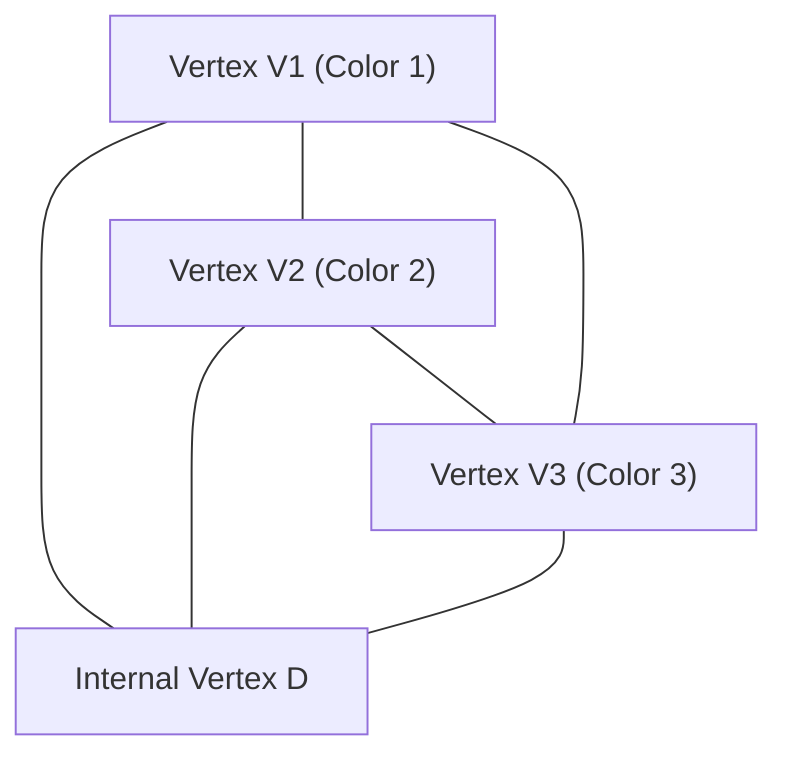

# 1. Introduction: The Mystery of Mathematics Starting from a Puzzle

The beauty of mathematics often lies in how extremely simple rules can lead to profound and completely unexpected results. One of the most iconic examples of this is **[Sperner's Lemma](https://kenji.blog/en/p/sperners-lemma/)**. Published in 1928 by the German mathematician Emanuel Sperner, this lemma, at first glance, seems to be nothing more than a "triangle coloring puzzle" that even an elementary school student could understand.

However, this simple puzzle holds an extremely important position in modern mathematics. In particular, it serves as a powerful tool for a combinatorial and constructive proof of the **Brouwer Fixed-Point Theorem**, which is a fundamental theorem in topology and is widely applied in fields like game theory in economics (such as proving the existence of Nash Equilibrium).

In this article, we will explain [Sperner's Lemma](https://kenji.blog/en/p/sperners-lemma/) in detail with diagrams, covering everything from its intuitive meaning and rigorous mathematical proof to its application to fixed-point theorems that bridge to the continuous world.

# 2. Simplices and Simplicial Complexes: The Foundations of Geometry

To understand [Sperner's Lemma](https://kenji.blog/en/p/sperners-lemma/), we must first clarify the concepts of a **Simplex** and a **Simplicial Complex** (or Triangulation).

## 2.1. What is a Simplex?

In an $n$-dimensional space, when there are $n+1$ geometrically independent points, the smallest convex set constructed with them as vertices is called an **$n$-simplex**.
- 0-simplex: Point
- 1-simplex: Line segment
- 2-simplex: Triangle
- 3-simplex: Tetrahedron

Here, we will mainly focus on the 2-simplex, the "triangle", which is the easiest to understand visually. Let there be a large triangle $T$, and let its three vertices be $V_1, V_2, V_3$.

## 2.2. Simplicial Complex (Triangulation)

Consider dividing this large triangle $T$ into multiple smaller triangles. However, you cannot divide it arbitrarily. A division that satisfies the following conditions is called a **Triangulation**.

1. Let $\mathcal{K}$ be the set of small triangles formed by the division. If any two triangles in $\mathcal{K}$ intersect, their intersection must be either a "shared vertex" or a "shared edge".
2. "Half-hearted connections", where small triangles partially overlap or a vertex of another triangle lies in the middle of an edge, are not allowed.

For the network of triangles divided in this way, coloring each vertex sets the stage for [Sperner's Lemma](https://kenji.blog/en/p/sperners-lemma/).

# 3. Sperner Coloring: The Boundary Rules

Suppose a triangulation of triangle $T$ is given. Consider a function $C: V \to \{1, 2, 3\}$ that assigns a color to **all vertices** appearing in this division (vertices of the large triangle, vertices on the edges, and internal vertices).

However, you must color them according to the following strict **Sperner Condition** (boundary rules).

1. **Coloring the main vertices**: The three vertices of the large triangle, $V_1, V_2, V_3$, must each be colored with a different color. For example, let $C(V_1) = 1, C(V_2) = 2, C(V_3) = 3$.
2. **Coloring the vertices on the edges**: The vertices on the edges of the large triangle must be colored with one of the same colors as the endpoints of that edge.
   - Vertices on edge $V_1V_2$ are color 1 or color 2.
   - Vertices on edge $V_2V_3$ are color 2 or color 3.
   - Vertices on edge $V_3V_1$ are color 3 or color 1.
3. **Coloring internal vertices**: The vertices inside the large triangle can be colored freely with any of color 1, 2, or 3.

A coloring that follows these rules is called a **Sperner Coloring**.

# 4. The Statement of [Sperner's Lemma](https://kenji.blog/en/p/sperners-lemma/)

When you finish coloring according to the rules of Sperner coloring, what phenomenon occurs? [Sperner's Lemma](https://kenji.blog/en/p/sperners-lemma/) asserts the following astonishing fact.

> **[Sperner's Lemma](https://kenji.blog/en/p/sperners-lemma/) (2D)**
> In any Sperner coloring, the number of small triangles where all three vertices are painted in different colors (color 1, color 2, and color 3) **must be an odd number**.
> Because it is an odd number (1, 3, 5, ...), such a "complete small triangle with all 3 colors" **must exist at least once**.

No matter how intentionally you color the internal vertices, or how finely and complexly you divide the triangle, a small triangle with all 3 colors (let's call it a **Complete Triangle**) will definitely appear somewhere.

# 5. A Beautiful Proof Using [Graph Theory](https://kenji.blog/en/p/graph-theory-dijkstra-a-star/)

This theorem might seem magical intuitively, but it can be proven beautifully using the concepts of "Dual [Graph](https://kenji.blog/en/p/tree-graph-data-structures-search-dfs-bfs-dijkstra/)" and "Handshaking Lemma". This approach is very easy to understand if we use the analogy of "rooms and doors".

## 5.1. Definition of Rooms and Doors

Regard each triangulated small triangle as a "room". Also, let's call the outside of the large triangle $T$ the "outdoors".
What separates a room from another room, or a room from the outdoors, is the "edge" (wall) of the small triangle.

Here, we define a special wall as a **door**.
- **Definition of a door**: An edge whose endpoints are colored with **Color 1 and Color 2** is called a "door".

Let's consider how many doors each room (small triangle) has. Since a small triangle has three vertices, it is classified into the following cases based on color combinations.

1. **Rooms with colors (1, 1, 1), (2, 2, 2), (3, 3, 3)**
   - Since there are no edges with a pair of 1 and 2, there are **0 doors**.
2. **Rooms with colors (1, 1, 2) or (1, 2, 2)**
   - There are exactly two edges connecting color 1 and color 2. Therefore, there are **2 doors**.
3. **Rooms with colors (1, 3, 3) or (2, 2, 3) etc.**
   - Since there is no pair of 1 and 2, there are **0 doors**.
4. **Rooms with colors (1, 2, 3) (Complete Triangle)**
   - There is only one edge connecting color 1 and color 2. Therefore, there is **1 door**.

To summarize, **only the complete triangle rooms have an odd number (1) of doors, and all other rooms have an even number (0 or 2) of doors**.

## 5.2. Number of Doors on the Outer Wall

Next, we count the number of doors on the outer perimeter (outer wall) of the large triangle.
The outer wall where doors (edges of color 1 and 2) can exist is only on the edge $V_1V_2$. (Colors 1 and 2 will never appear together on edges $V_2V_3$ or $V_3V_1$ due to the rules.)

If we look at the colors of the vertices on edge $V_1V_2$ sequentially from $V_1$, the first is color 1 and the last is color 2. The number of times the color changes from 1 to 2, or from 2 to 1, **must be an odd number** because the starting point and ending point have different colors.
Therefore, it is clear that the number of doors leading to the outdoors is an **odd number**.

## 5.3. Calculating Degrees Using the Handshaking Lemma

This is where [graph theory](/en/p/graph-theory-dijkstra-a-star/) comes in.
- Vertices of the graph: Each small triangle (room) and the outdoors.
- Edges of the graph: Doors (edges of color 1 and 2). When two rooms share a door, connect their vertices with an edge.

According to the "Handshaking Lemma", a fundamental theorem in [graph theory](/en/p/graph-theory-dijkstra-a-star/), the sum of the "degrees" (number of connected edges) of all vertices must always be an even number (twice the number of edges).

$$ \sum_{v \in V} \text{deg}(v) = 2|E| $$

In the graph we created, what are the degrees (number of doors) of each vertex?
- Degree of the outdoors = Number of doors on the outer wall = **Odd number**
- Degree of complete triangle rooms = 1 = **Odd number**
- Degree of other rooms = 0 or 2 = **Even number**

Let's calculate the total sum of degrees.
$$ \text{Total Sum} = \text{Degree of Outdoors} + \text{Sum of Degrees of Complete Triangles} + \text{Sum of Degrees of Other Rooms} $$

The total sum must be an even number.
The degree of the outdoors is "odd", and the sum of the degrees of other rooms is "even".
Therefore, the "Sum of Degrees of Complete Triangles" **must be an odd number** for the total sum to be even.
Since the degree of each complete triangle is 1, the number of complete triangles **must be an odd number**.

With this, it is perfectly proven that there is at least one complete triangle.

# 6. Generalization to Higher Dimensions

[Sperner's Lemma](https://kenji.blog/en/p/sperners-lemma/) is not limited to 2D triangles but holds for any $n$-dimensional simplex.

In the case of an $n$-dimensional simplex (e.g., a tetrahedron for $n=3$), there are $n+1$ vertices, and we use $n+1$ colors, $1, 2, \dots, n+1$.
The boundary condition is generalized as follows: "The vertices on any $k$-dimensional face (facet) must only use the same colors as the $k+1$ vertices that constitute that face."

The proof uses mathematical induction.
- For $n=1$: The endpoints of the line segment are color 1 and color 2. Intermediate points are 1 or 2. The number of places where it changes from 1 to 2 (complete 1-simplex) is always odd.
- Assuming it holds for $n=k$, when proving for $n=k+1$, we count the number of "doors" (complete faces of $n$ colors) in the same way as before, which brilliantly shows the existence of an odd number of complete simplices of $n+1$ colors.

# 7. Application to Brouwer's Fixed-Point Theorem

Why is [Sperner's Lemma](https://kenji.blog/en/p/sperners-lemma/) considered so important? It is because this discrete theorem acts as a bridge to prove a continuous topological theorem, the **Brouwer Fixed-Point Theorem**.

## 7.1. What is Brouwer's Fixed-Point Theorem?

> **Brouwer Fixed-Point Theorem**
> Any continuous mapping $f: D \to D$ from an $n$-dimensional unit ball (or simplex) to itself must have at least one point $x$ (fixed point) such that $f(x) = x$.

This is a famous theorem often explained with the metaphor: when you stir your coffee and put the cup down, there is always at least one coffee particle that is in the exact same position as before you started stirring.

## 7.2. Approach from [Sperner's Lemma](https://kenji.blog/en/p/sperners-lemma/)

The logic of deriving the fixed-point theorem from [Sperner's Lemma](https://kenji.blog/en/p/sperners-lemma/) is highly elegant.

1. **Evaluation of Barycentric Coordinates and Displacement Vectors**
   Apply the continuous mapping $f$ to an arbitrary point $x$ on the simplex and look at the destination $f(x)$. Assign a color to point $x$ based on the direction in which it moved (which component of the barycentric coordinates decreased).
   $$ \text{For example, if the } i \text{-th component of } x \text{ is strictly greater than the } i \text{-th component of } f(x) \text{, paint it color } i $$
   
2. **Checking the Boundary Conditions**
   Because of the nature of continuous mapping where you cannot move outside on the boundaries, this coloring method satisfies exactly the conditions of Sperner coloring.

3. **Transition to the Limit**
   We triangulate the triangle finer and finer. In each triangulation, by [Sperner's Lemma](https://kenji.blog/en/p/sperners-lemma/), there is always a small triangle where all 3 colors are present.
   
4. **Compactness and Convergence**
   We take the limit as the size of the division approaches zero. By the Bolzano-Weierstrass Theorem (a sequence in a compact space has a convergent subsequence), this sequence of complete triangles converges to a single point $x^*$.
   
5. **Identifying the Fixed Point**
   Since the mapping $f$ is continuous, at this limit point $x^*$, it must have a "direction where all components decrease", but since the sum of barycentric coordinates is always 1, it is impossible for all components to decrease. Therefore, the only possibility is that "no component changes", that is, $f(x^*) = x^*$. This is the fixed point.

# 8. Other Applications: Fair Division and Economics

Besides the fixed-point theorem, [Sperner's Lemma](https://kenji.blog/en/p/sperners-lemma/) is directly applied to real-world problems.
Typical examples are the "fair rent division problem" and the "cake cutting problem".

When multiple people share a house, conflicts can arise over who rents which room and for how much, because the size and conditions of the rooms vary. Using algorithms applying [Sperner's Lemma](https://kenji.blog/en/p/sperners-lemma/) (like Su's algorithm), it can be proven that there always exists a fair allocation where "everyone is satisfied with their chosen room and rent, and the sum of the rents matches the original amount", and furthermore, it can be found approximately.

Also, the "existence of Nash Equilibrium" proven by John Nash in economics depends on Brouwer's or Kakutani's fixed-point theorems, fundamentally concealing combinatorial structures like [Sperner's Lemma](https://kenji.blog/en/p/sperners-lemma/).

# 9. Conclusion

[Sperner's Lemma](https://kenji.blog/en/p/sperners-lemma/) starts with an almost game-like setup of coloring the vertices of a triangle according to rules. However, within that simple logic of "counting the number of doors", profound truths about the continuity and invariance of space were hidden.

Discrete mathematics and continuous mathematics. The fact that these two seemingly completely different worlds are connected by such a beautiful theorem is arguably one of the greatest appeals of mathematics as a discipline. We encourage readers to grab a piece of paper and pen, divide a triangle arbitrarily, and paint it in 3 colors. When you find the "complete triangle" that is always hiding there, you too should be able to touch the mystery of mathematics.
