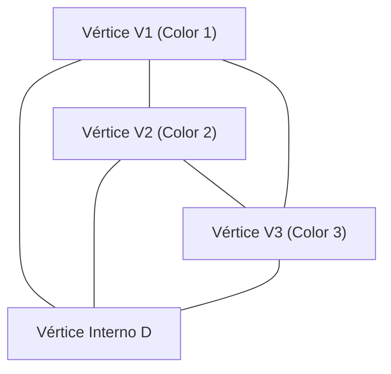

# 1. Introducción: El Misterio de las Matemáticas a Partir de un Rompecabezas

La belleza de las matemáticas a menudo radica en cómo reglas extremadamente simples pueden llevar a resultados profundos y completamente inesperados. Uno de los ejemplos más icónicos de esto es el **Lema de Sperner** ([Sperner's Lemma](https://kenji.blog/es/p/sperners-lemma/)). Publicado en 1928 por el matemático alemán Emanuel Sperner, este lema, a primera vista, parece no ser más que un "rompecabezas de colorear triángulos" que incluso un estudiante de primaria podría entender.

Sin embargo, este simple rompecabezas ocupa una posición extremadamente importante en las matemáticas modernas. En particular, sirve como una herramienta poderosa para una prueba combinatoria y constructiva del **Teorema del Punto Fijo de Brouwer** (Brouwer Fixed-Point Theorem), que es un teorema fundamental en topología y se aplica ampliamente en campos como la teoría de juegos en economía (como en la demostración de la existencia del Equilibrio de Nash).

En este artículo, explicaremos el Lema de Sperner en detalle con diagramas, cubriendo desde su significado intuitivo y su rigurosa demostración matemática, hasta su aplicación a los teoremas de punto fijo que sirven de puente hacia el mundo continuo.

# 2. Símplices y Complejos Simpliciales: Los Fundamentos de la Geometría

Para entender el Lema de Sperner, primero debemos aclarar los conceptos de un **Símplice** (Simplex) y un **Complejo Simplicial** (Simplicial Complex / Triangulation).

## 2.1. ¿Qué es un Símplice?

En un espacio de $n$ dimensiones, cuando hay $n+1$ puntos geométricamente independientes, el conjunto convexo más pequeño construido con ellos como vértices se llama un **$n$-símplice**.
- 0-símplice: Punto
- 1-símplice: Segmento de línea
- 2-símplice: [Tri](https://kenji.blog/es/p/sorting-algorithms/)ángulo
- 3-símplice: Tetraedro

Aquí nos enfocaremos principalmente en el 2-símplice, el "triángulo", que es el más fácil de entender visualmente. Supongamos que hay un gran triángulo $T$, y sean sus tres vértices $V_1, V_2, V_3$.

## 2.2. Complejo Simplicial (Triangulación)

Consideremos dividir este gran triángulo $T$ en múltiples triángulos más pequeños. Sin embargo, no se puede dividir arbitrariamente. Una división que satisface las siguientes condiciones se llama **Triangulación**.

1. Sea $\mathcal{K}$ el conjunto de pequeños triángulos formados por la división. Si dos triángulos cualesquiera en $\mathcal{K}$ se intersectan, su intersección debe ser un "vértice compartido" o un "borde compartido".
2. No se permiten "conexiones a medias", donde los triángulos pequeños se superponen parcialmente o un vértice de otro triángulo se encuentra en medio de una arista.

Para la red de triángulos dividida de esta manera, colorear cada vértice prepara el escenario para el Lema de Sperner.

# 3. Coloración de Sperner: Las Reglas de Frontera

Supongamos que se da una triangulación del triángulo $T$. Consideremos una función $C: V \to \{1, 2, 3\}$ que asigna un color a **todos los vértices** que aparecen en esta división (vértices del triángulo grande, vértices en los bordes y vértices internos).

Sin embargo, debes colorearlos de acuerdo con la siguiente estricta **Condición de Sperner** (reglas de frontera).

1. **Coloración de los vértices principales** : Los tres vértices del triángulo grande, $V_1, V_2, V_3$, deben estar coloreados cada uno con un color diferente. Por ejemplo, sea $C(V_1) = 1, C(V_2) = 2, C(V_3) = 3$.
2. **Coloración de los vértices en los bordes** : Los vértices en los bordes del triángulo grande deben estar coloreados con uno de los mismos colores que los puntos finales de ese borde.
   - Los vértices en el borde $V_1V_2$ son del color 1 o color 2.
   - Los vértices en el borde $V_2V_3$ son del color 2 o color 3.
   - Los vértices en el borde $V_3V_1$ son del color 3 o color 1.
3. **Coloración de los vértices internos** : Los vértices dentro del triángulo grande se pueden colorear libremente con cualquiera de los colores 1, 2 o 3.

Una coloración que sigue estas reglas se llama **Coloración de Sperner** (Sperner Coloring).

# 4. El Enunciado del Lema de Sperner

Cuando terminas de colorear de acuerdo con las reglas de la coloración de Sperner, ¿qué fenómeno ocurre? [El Lema de Sperner](https://kenji.blog/es/p/sperners-lemma/) afirma el siguiente hecho asombroso.

> **Lema de Sperner (2D)**
> En cualquier coloración de Sperner, el número de pequeños triángulos donde los tres vértices están pintados de colores diferentes (color 1, color 2 y color 3) **debe ser un número impar**.
> Como es un número impar (1, 3, 5, ...), tal "triángulo pequeño completo con los 3 colores" **debe existir al menos una vez**.

No importa cuán intencionadamente colorees los vértices internos, o cuán fina y complejamente dividas el triángulo, un pequeño triángulo con los 3 colores (llamémoslo un **[Tri](https://kenji.blog/es/p/sorting-algorithms/)ángulo Completo**) aparecerá definitivamente en alguna parte.

# 5. Una Hermosa Demostración Usando la Teoría de Grafos

Este teorema puede parecer mágico de forma intuitiva, pero se puede demostrar maravillosamente utilizando los conceptos de "Grafo Dual" y el "Lema del Apretón de Manos". Este enfoque es muy fácil de entender si usamos la analogía de "habitaciones y puertas".

## 5.1. Definición de Habitaciones y Puertas

Considera cada pequeño triángulo triangulado como una "habitación". Además, llamemos "exterior" al exterior del triángulo grande $T$.
Lo que separa una habitación de otra habitación, o una habitación del exterior, es la "arista" (pared) del pequeño triángulo.

Aquí, definimos una pared especial como una **puerta**.
- **Definición de puerta** : Una arista cuyos extremos están coloreados con **Color 1 y Color 2** se llama "puerta".

Consideremos cuántas puertas tiene cada habitación (triángulo pequeño). Dado que un triángulo pequeño tiene tres vértices, se clasifica en los siguientes casos según las combinaciones de colores.

1. **Habitaciones con colores (1, 1, 1), (2, 2, 2), (3, 3, 3)**
   - Como no hay aristas con un par de 1 y 2, hay **0 puertas** .
2. **Habitaciones con colores (1, 1, 2) o (1, 2, 2)**
   - Hay exactamente dos aristas que conectan el color 1 y el color 2. Por lo tanto, hay **2 puertas** .
3. **Habitaciones con colores (1, 3, 3) o (2, 2, 3) etc.**
   - Como no hay un par de 1 y 2, hay **0 puertas** .
4. **Habitaciones con colores (1, 2, 3) ([Tri](https://kenji.blog/es/p/sorting-algorithms/)ángulo Completo)**
   - Sólo hay una arista que conecta el color 1 y el color 2. Por lo tanto, hay **1 puerta** .

En resumen, **sólo las habitaciones de los triángulos completos tienen un número impar (1) de puertas, y todas las demás habitaciones tienen un número par (0 o 2) de puertas** .

## 5.2. Número de Puertas en el Muro Exterior

A continuación, contamos el número de puertas en el perímetro exterior (muro exterior) del triángulo grande.
El muro exterior donde pueden existir puertas (aristas de color 1 y 2) está únicamente en la arista $V_1V_2$. (Los colores 1 y 2 nunca aparecerán juntos en las aristas $V_2V_3$ o $V_3V_1$ debido a las reglas).

Si observamos los colores de los vértices en la arista $V_1V_2$ secuencialmente desde $V_1$, el primero es el color 1 y el último es el color 2. El número de veces que el color cambia de 1 a 2, o de 2 a 1, **debe ser un número impar** porque el punto de partida y el punto final tienen colores diferentes.
Por lo tanto, está claro que el número de puertas que conducen al exterior es un **número impar** .

## 5.3. Calculando Grados Usando el Lema del Apretón de Manos

Aquí es donde entra la teoría de grafos.
- Vértices del grafo: Cada pequeño triángulo (habitación) y el exterior.
- Aristas del grafo: Puertas (aristas de color 1 y 2). Cuando dos habitaciones comparten una puerta, conecta sus vértices con una arista.

Según el "Lema del Apretón de Manos", un teorema fundamental en la teoría de grafos, la suma de los "grados" (número de aristas conectadas) de todos los vértices debe ser siempre un número par (el doble del número de aristas).

$$ \sum_{v \in V} \text{deg}(v) = 2|E| $$

En el grafo que creamos, ¿cuáles son los grados (número de puertas) de cada vértice?
- Grado del exterior = Número de puertas en el muro exterior = **Número impar**
- Grado de las habitaciones de triángulos completos = 1 = **Número impar**
- Grado de otras habitaciones = 0 o 2 = **Número par**

Calculemos la suma total de los grados.
$$ \text{Suma Total} = \text{Grado del Exterior} + \text{Suma de Grados de [Tri](https://kenji.blog/es/p/sorting-algorithms/)ángulos Completos} + \text{Suma de Grados de Otras Habitaciones} $$

La suma total debe ser un número par.
El grado del exterior es "impar", y la suma de los grados de las otras habitaciones es "par".
Por lo tanto, la "Suma de Grados de [Tri](https://kenji.blog/es/p/sorting-algorithms/)ángulos Completos" **debe ser un número impar** para que la suma total sea par.
Como el grado de cada triángulo completo es 1, el número de triángulos completos **debe ser un número impar** .

Con esto, queda perfectamente demostrado que hay al menos un triángulo completo.

# 6. Generalización a Dimensiones Superiores

[El Lema de Sperner](https://kenji.blog/es/p/sperners-lemma/) no se limita a triángulos 2D, sino que es válido para cualquier símplice $n$-dimensional.

En el caso de un símplice $n$-dimensional (por ejemplo, un tetraedro para $n=3$), hay $n+1$ vértices, y utilizamos $n+1$ colores, $1, 2, \dots, n+1$.
La condición de frontera se generaliza de la siguiente manera: "Los vértices de cualquier cara $k$-dimensional (faceta) deben usar sólo los mismos colores que los $k+1$ vértices que constituyen esa cara."

La demostración utiliza la inducción matemática.
- Para $n=1$: Los puntos finales del segmento de línea son de color 1 y color 2. Los puntos intermedios son 1 o 2. El número de lugares donde cambia de 1 a 2 (1-símplice completo) es siempre impar.
- Suponiendo que se cumple para $n=k$, al demostrar para $n=k+1$, contamos el número de "puertas" (caras completas de $n$ colores) de la misma manera que antes, lo que muestra brillantemente la existencia de un número impar de símplices completos de $n+1$ colores.

# 7. Aplicación al Teorema del Punto Fijo de Brouwer

¿Por qué se considera tan importante el Lema de Sperner? Es porque este teorema discreto actúa como un puente para demostrar un teorema topológico continuo, el **Teorema del Punto Fijo de Brouwer**.

## 7.1. ¿Qué es el Teorema del Punto Fijo de Brouwer?

> **Teorema del Punto Fijo de Brouwer**
> Cualquier mapeo continuo $f: D \to D$ desde una bola unitaria $n$-dimensional (o símplice) hacia sí misma debe tener al menos un punto $x$ (punto fijo) tal que $f(x) = x$.

Este es un famoso teorema que a menudo se explica con la metáfora: cuando revuelves tu café y dejas la taza, siempre hay al menos una partícula de café que está en exactamente la misma posición que antes de que empezaras a revolver.

## 7.2. Aproximación desde el Lema de Sperner

La lógica para derivar el teorema del punto fijo a partir del Lema de Sperner es muy elegante.

1. **Evaluación de Coordenadas Baricéntricas y Vectores de Desplazamiento**
   Aplica el mapeo continuo $f$ a un punto arbitrario $x$ en el símplice y observa el destino $f(x)$. Asigna un color al punto $x$ basándote en la dirección en la que se movió (qué componente de las coordenadas baricéntricas disminuyó).
   $$ \text{Por ejemplo, si la componente } i \text{ de } x \text{ es estrictamente mayor que la componente } i \text{ de } f(x) \text{, píntalo de color } i $$
   
2. **Comprobación de las Condiciones de Frontera**
   Debido a la naturaleza del mapeo continuo donde no puedes moverte fuera en las fronteras, este método de coloración satisface exactamente las condiciones de la coloración de Sperner.

3. **Transición al Límite**
   Triangulamos el triángulo cada vez más fino. En cada triangulación, por el Lema de Sperner, siempre hay un triángulo pequeño donde los 3 colores están presentes.
   
4. **Compacidad y Convergencia**
   Tomamos el límite a medida que el tamaño de la división se acerca a cero. Por el Teorema de Bolzano-Weierstrass (una secuencia en un espacio compacto tiene una subsecuencia convergente), esta secuencia de triángulos completos converge a un solo punto $x^*$.
   
5. **Identificando el Punto Fijo**
   Dado que el mapeo $f$ es continuo, en este punto límite $x^*$, debe tener una "dirección donde todas las componentes disminuyen", pero como la suma de las coordenadas baricéntricas es siempre 1, es imposible que todas las componentes disminuyan. Por lo tanto, la única posibilidad es que "ninguna componente cambie", es decir, $f(x^*) = x^*$. Este es el punto fijo.

# 8. Otras Aplicaciones: División Justa y Economía

Además del teorema del punto fijo, el Lema de Sperner se aplica directamente a problemas del mundo real.
Ejemplos típicos son el "problema de la división justa del alquiler" y el "problema de cortar el pastel".

Cuando varias personas comparten una casa, pueden surgir conflictos sobre quién alquila qué habitación y por cuánto, porque el tamaño y las condiciones de las habitaciones varían. Utilizando algoritmos que aplican el Lema de Sperner (como el algoritmo de Su), se puede demostrar que siempre existe una asignación justa donde "todos están satisfechos con su habitación y alquiler elegidos, y la suma de los alquileres coincide con la cantidad original", y además, se puede encontrar aproximadamente.

Además, la "existencia del Equilibrio de Nash" demostrada por John Nash en economía depende de los teoremas del punto fijo de Brouwer o Kakutani, ocultando fundamentalmente estructuras combinatorias como el Lema de Sperner.

# 9. Conclusión

[El Lema de Sperner](https://kenji.blog/es/p/sperners-lemma/) comienza con un escenario casi parecido a un juego, de colorear los vértices de un triángulo según unas reglas. Sin embargo, dentro de esa simple lógica de "contar el número de puertas", se ocultaban profundas verdades sobre la continuidad y la invariancia del espacio.

Matemáticas discretas y matemáticas continuas. El hecho de que estos dos mundos aparentemente completamente diferentes estén conectados por un teorema tan hermoso es discutiblemente uno de los mayores atractivos de las matemáticas como disciplina. Animamos a los lectores a agarrar un papel y un bolígrafo, dividir un triángulo arbitrariamente y pintarlo de 3 colores. Cuando encuentres el "triángulo completo" que siempre se esconde allí, tú también deberías poder tocar el misterio de las matemáticas.
