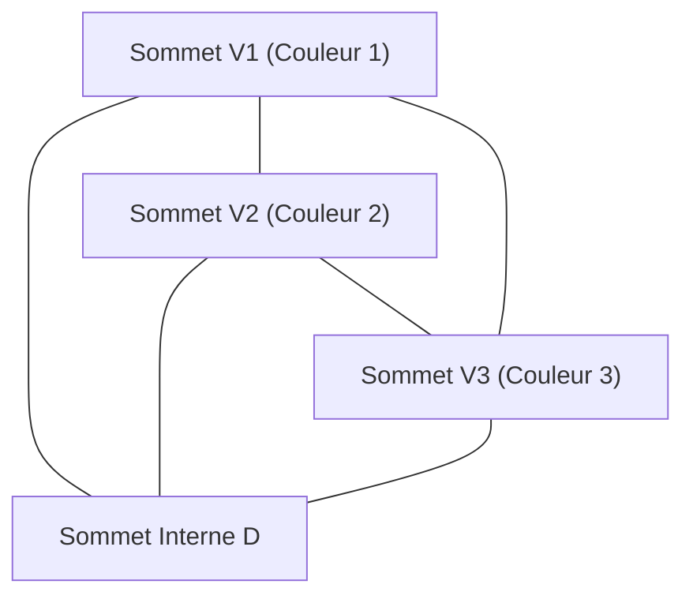

# 1. Introduction : Le mystère des mathématiques à partir d'un puzzle

La beauté des mathématiques réside souvent dans la façon dont des règles extrêmement simples peuvent conduire à des résultats profonds et complètement inattendus. L'un des exemples les plus emblématiques de cela est le **Lemme de Sperner** ([Sperner's Lemma](https://kenji.blog/fr/p/sperners-lemma/)). Publié en 1928 par le mathématicien allemand Emanuel Sperner, ce lemme, à première vue, semble n'être rien de plus qu'un "puzzle de coloriage de triangles" que même un élève du primaire pourrait comprendre.

Cependant, ce simple puzzle occupe une place extrêmement importante dans les mathématiques modernes. En particulier, il sert d'outil puissant pour une preuve combinatoire et constructive du **Théorème du point fixe de Brouwer** (Brouwer Fixed-Point Theorem), qui est un théorème fondamental en topologie et est largement appliqué dans des domaines comme la théorie des jeux en économie (comme dans la démonstration de l'existence de l'équilibre de Nash).

Dans cet article, nous expliquerons le lemme de Sperner en détail avec des diagrammes, couvrant tout, de sa signification intuitive et sa preuve mathématique rigoureuse, à son application aux théorèmes de point fixe qui font le pont avec le monde continu.

# 2. Simplexes et Complexes Simpliciaux : Les fondements de la géométrie

Pour comprendre le lemme de Sperner, nous devons d'abord clarifier les concepts de **Simplexe** (Simplex) et de **Complexe Simplicial** (Simplicial Complex / Triangulation).

## 2.1. Qu'est-ce qu'un Simplexe ?

Dans un espace à $n$ dimensions, lorsqu'il y a $n+1$ points géométriquement indépendants, le plus petit ensemble convexe construit avec eux comme sommets est appelé un **$n$-simplexe**.
- 0-simplexe : Point
- 1-simplexe : Segment de droite
- 2-simplexe : Triangle
- 3-simplexe : Tétraèdre

Ici, nous nous concentrerons principalement sur le 2-simplexe, le "triangle", qui est le plus facile à comprendre visuellement. Supposons qu'il y ait un grand triangle $T$, et que ses trois sommets soient $V_1, V_2, V_3$.

## 2.2. Complexe Simplicial (Triangulation)

Considérons la division de ce grand triangle $T$ en plusieurs triangles plus petits. Cependant, vous ne pouvez pas le diviser arbitrairement. Une division qui satisfait aux conditions suivantes est appelée une **Triangulation**.

1. Soit $\mathcal{K}$ l'ensemble des petits triangles formés par la division. Si deux triangles quelconques dans $\mathcal{K}$ se croisent, leur intersection doit être un "sommet partagé" ou une "arête partagée".
2. Les "connexions à moitié", où de petits triangles se chevauchent partiellement ou lorsqu'un sommet d'un autre triangle se trouve au milieu d'une arête, ne sont pas autorisées.

Pour le réseau de triangles ainsi divisé, le coloriage de chaque sommet prépare le terrain pour le lemme de Sperner.

# 3. Coloriage de Sperner : Les règles de frontière

Supposons qu'une triangulation du triangle $T$ soit donnée. Considérons une fonction $C: V \to \{1, 2, 3\}$ qui attribue une couleur à **tous les sommets** apparaissant dans cette division (sommets du grand triangle, sommets sur les arêtes et sommets internes).

Cependant, vous devez les colorier selon la stricte **Condition de Sperner** (règles de frontière) suivante.

1. **Coloriage des sommets principaux** : Les trois sommets du grand triangle, $V_1, V_2, V_3$, doivent être coloriés chacun avec une couleur différente. Par exemple, soit $C(V_1) = 1, C(V_2) = 2, C(V_3) = 3$.
2. **Coloriage des sommets sur les arêtes** : Les sommets sur les arêtes du grand triangle doivent être coloriés avec l'une des mêmes couleurs que les extrémités de cette arête.
   - Les sommets sur l'arête $V_1V_2$ sont de couleur 1 ou de couleur 2.
   - Les sommets sur l'arête $V_2V_3$ sont de couleur 2 ou de couleur 3.
   - Les sommets sur l'arête $V_3V_1$ sont de couleur 3 ou de couleur 1.
3. **Coloriage des sommets internes** : Les sommets à l'intérieur du grand triangle peuvent être coloriés librement avec n'importe quelle couleur 1, 2 ou 3.

Un coloriage qui suit ces règles est appelé un **Coloriage de Sperner** (Sperner Coloring).

# 4. L'Énoncé du Lemme de Sperner

Lorsque vous avez fini de colorier selon les règles du coloriage de Sperner, quel phénomène se produit-il ? Le lemme de Sperner affirme le fait étonnant suivant.

> **Lemme de Sperner (2D)**
> Dans tout coloriage de Sperner, le nombre de petits triangles où les trois sommets sont peints de couleurs différentes (couleur 1, couleur 2 et couleur 3) **doit être un nombre impair**.
> Puisque c'est un nombre impair (1, 3, 5, ...), un tel "petit triangle complet avec les 3 couleurs" **doit exister au moins une fois**.

Peu importe l'intention avec laquelle vous coloriez les sommets internes, ou la finesse et la complexité avec lesquelles vous divisez le triangle, un petit triangle avec les 3 couleurs (appelons-le un **Triangle Complet**) apparaîtra certainement quelque part.

# 5. Une belle preuve utilisant la théorie des graphes

Ce théorème peut sembler magique intuitivement, mais il peut être prouvé magnifiquement en utilisant les concepts de "Graphe Dual" et de "Lemme des poignées de main". Cette approche est très facile à comprendre si l'on utilise l'analogie des "pièces et des portes".

## 5.1. Définition des Pièces et des Portes

Considérez chaque petit triangle triangulé comme une "pièce". De plus, appelons l'extérieur du grand triangle $T$ "l'extérieur".
Ce qui sépare une pièce d'une autre pièce, ou une pièce de l'extérieur, c'est "l'arête" (le mur) du petit triangle.

Ici, nous définissons un mur spécial comme une **porte**.
- **Définition d'une porte** : Une arête dont les extrémités sont coloriées avec la **Couleur 1 et la Couleur 2** est appelée une "porte".

Considérons combien de portes possède chaque pièce (petit triangle). Puisqu'un petit triangle a trois sommets, il est classé dans les cas suivants en fonction des combinaisons de couleurs.

1. **Pièces avec les couleurs (1, 1, 1), (2, 2, 2), (3, 3, 3)**
   - Puisqu'il n'y a pas d'arêtes avec une paire de 1 et 2, il y a **0 porte** .
2. **Pièces avec les couleurs (1, 1, 2) ou (1, 2, 2)**
   - Il y a exactement deux arêtes reliant la couleur 1 et la couleur 2. Par conséquent, il y a **2 portes** .
3. **Pièces avec les couleurs (1, 3, 3) ou (2, 2, 3) etc.**
   - Puisqu'il n'y a pas de paire de 1 et 2, il y a **0 porte** .
4. **Pièces avec les couleurs (1, 2, 3) (Triangle Complet)**
   - Il n'y a qu'une seule arête reliant la couleur 1 et la couleur 2. Par conséquent, il y a **1 porte** .

En résumé, **seules les pièces des triangles complets ont un nombre impair (1) de portes, et toutes les autres pièces ont un nombre pair (0 ou 2) de portes** .

## 5.2. Nombre de Portes sur le Mur Extérieur

Ensuite, nous comptons le nombre de portes sur le périmètre extérieur (mur extérieur) du grand triangle.
Le mur extérieur où des portes (arêtes de couleur 1 et 2) peuvent exister est uniquement sur l'arête $V_1V_2$. (Les couleurs 1 et 2 n'apparaîtront jamais ensemble sur les arêtes $V_2V_3$ ou $V_3V_1$ à cause des règles).

Si l'on regarde les couleurs des sommets sur l'arête $V_1V_2$ séquentiellement depuis $V_1$, la première est la couleur 1 et la dernière est la couleur 2. Le nombre de fois où la couleur passe de 1 à 2, ou de 2 à 1, **doit être un nombre impair** car le point de départ et le point d'arrivée ont des couleurs différentes.
Par conséquent, il est clair que le nombre de portes menant à l'extérieur est un **nombre impair** .

## 5.3. Calcul des Degrés à l'aide du Lemme des Poignées de Main

C'est ici que la théorie des graphes intervient.
- Sommets du graphe : Chaque petit triangle (pièce) et l'extérieur.
- Arêtes du graphe : Portes (arêtes de couleur 1 et 2). Lorsque deux pièces partagent une porte, reliez leurs sommets avec une arête.

Selon le "Lemme des poignées de main", un théorème fondamental de la théorie des graphes, la somme des "degrés" (nombre d'arêtes connectées) de tous les sommets doit toujours être un nombre pair (le double du nombre d'arêtes).

$$ \sum_{v \in V} \text{deg}(v) = 2|E| $$

Dans le graphe que nous avons créé, quels sont les degrés (nombre de portes) de chaque sommet ?
- Degré de l'extérieur = Nombre de portes sur le mur extérieur = **Nombre impair**
- Degré des pièces de triangles complets = 1 = **Nombre impair**
- Degré des autres pièces = 0 ou 2 = **Nombre pair**

Calculons la somme totale des degrés.
$$ \text{Somme Totale} = \text{Degré de l'Extérieur} + \text{Somme des Degrés des Triangles Complets} + \text{Somme des Degrés des Autres Pièces} $$

La somme totale doit être un nombre pair.
Le degré de l'extérieur est "impair", et la somme des degrés des autres pièces est "paire".
Par conséquent, la "Somme des Degrés des Triangles Complets" **doit être un nombre impair** pour que la somme totale soit paire.
Puisque le degré de chaque triangle complet est 1, le nombre de triangles complets **doit être un nombre impair** .

Avec cela, il est parfaitement prouvé qu'il y a au moins un triangle complet.

# 6. Généralisation aux dimensions supérieures

[Le Lemme de Sperner](https://kenji.blog/fr/p/sperners-lemma/) ne se limite pas aux triangles 2D mais s'applique à tout simplexe de dimension $n$.

Dans le cas d'un simplexe de dimension $n$ (par exemple, un tétraèdre pour $n=3$), il y a $n+1$ sommets, et nous utilisons $n+1$ couleurs, $1, 2, \dots, n+1$.
La condition de frontière est généralisée comme suit : "Les sommets sur toute face de dimension $k$ (facette) doivent utiliser uniquement les mêmes couleurs que les $k+1$ sommets qui constituent cette face."

La preuve utilise l'induction mathématique.
- Pour $n=1$ : Les extrémités du segment de droite sont de couleur 1 et de couleur 2. Les points intermédiaires sont 1 ou 2. Le nombre d'endroits où il passe de 1 à 2 (1-simplexe complet) est toujours impair.
- En supposant que cela soit vrai pour $n=k$, lors de la preuve pour $n=k+1$, nous comptons le nombre de "portes" (faces complètes de $n$ couleurs) de la même manière qu'auparavant, ce qui montre brillamment l'existence d'un nombre impair de simplexes complets de $n+1$ couleurs.

# 7. Application au Théorème du point fixe de Brouwer

Pourquoi le lemme de Sperner est-il considéré comme si important ? C'est parce que ce théorème discret agit comme un pont pour prouver un théorème topológico continu, le **Théorème du point fixe de Brouwer**.

## 7.1. Qu'est-ce que le Théorème du point fixe de Brouwer ?

> **Théorème du point fixe de Brouwer**
> Toute application continue $f: D \to D$ d'une boule unité de dimension $n$ (ou simplexe) vers elle-même doit avoir au moins un point $x$ (point fixe) tel que $f(x) = x$.

C'est un théorème célèbre souvent expliqué avec la métaphore : quand vous remuez votre café et posez la tasse, il y a toujours au moins une particule de café qui se trouve exactement dans la même position qu'avant que vous ne commenciez à remuer.

## 7.2. Approche à partir du Lemme de Sperner

La logique pour déduire le théorème du point fixe à partir du lemme de Sperner est très élégante.

1. **Évaluation des coordonnées barycentriques et des vecteurs de déplacement**
   Appliquez l'application continue $f$ à un point arbitraire $x$ sur le simplexe et regardez la destination $f(x). Attribuez une couleur au point $x$ en fonction de la direction dans laquelle il s'est déplacé (quelle composante des coordonnées barycentriques a diminué).
   $$ \text{Par exemple, si la composante } i \text{ de } x \text{ est strictement supérieure à la composante } i \text{ de } f(x) \text{, peignez-le de la couleur } i $$
   
2. **Vérification des conditions de frontière**
   En raison de la nature de l'application continue où vous ne pouvez pas vous déplacer à l'extérieur sur les frontières, cette méthode de coloriage satisfait exactement les conditions du coloriage de Sperner.

3. **Transition vers la limite**
   Nous triangulons le triangle de plus en plus finement. Dans chaque triangulation, d'après le lemme de Sperner, il y a toujours un petit triangle où les 3 couleurs sont présentes.
   
4. **Compacité et Convergence**
   Nous prenons la limite alors que la taille de la division s'approche de zéro. D'après le Théorème de Bolzano-Weierstrass (une suite dans un espace compact a une sous-suite convergente), cette suite de triangles complets converge vers un seul point $x^*$.
   
5. **Identification du Point Fixe**
   Puisque l'application $f$ est continue, à ce point limite $x^*$, elle doit avoir une "direction où toutes les composantes diminuem", mais comme la somme des coordonnées barycentriques est toujours 1, il est impossible que toutes les composantes diminuent. Par conséquent, la seule possibilité est qu' "aucune composante ne change", c'est-à-dire $f(x^*) = x^*$. C'est le point fixe.

# 8. Autres Applications : Division Équitable et Économie

Outre le théorème du point fixe, le lemme de Sperner s'applique directement aux problèmes du monde réel.
Des exemples typiques sont le "problème de la division équitable du loyer" et le "problème de la coupe du gâteau".

Lorsque plusieurs personnes partagent une maison, des conflits peuvent survenir sur qui loue quelle pièce et pour combien, car la taille et les conditions des pièces varient. En utilisant des algorithmes appliquant le Lemme de Sperner (comme l'algorithme de Su), on peut prouver qu'il existe toujours une allocation équitable où "chacun est satisfait de sa chambre et de son loyer choisis, et la somme des loyers correspond au montant initial", et de plus, cela peut être trouvé approximativement.

De plus, l'"existence de l'équilibre de Nash" prouvée par John Nash en économie dépend des théorèmes du point fixe de Brouwer ou Kakutani, cachant fondamentalement des structures combinatoires comme le Lemme de Sperner.

# 9. Conclusion

Le lemme de Sperner commence par une configuration presque semblable à un jeu consistant à colorier les sommets d'un triangle selon des règles. Cependant, au sein de cette simple logique consistant à "compter le nombre de portes", se cachaient de profondes vérités sur la continuité et l'invariance de l'espace.

Mathématiques discrètes et mathématiques continues. Le fait que ces deux mondes apparemment complètement différents soient reliés par un si beau théorème est sans doute l'un des plus grands attraits des mathématiques en tant que discipline. Nous encourageons les lecteurs à prendre un papier et un stylo, à diviser un triangle arbitrairement et à le peindre en 3 couleurs. Lorsque vous trouverez le "triangle complet" qui s'y cache toujours, vous aussi devriez être capable de toucher le mystère des mathématiques.
