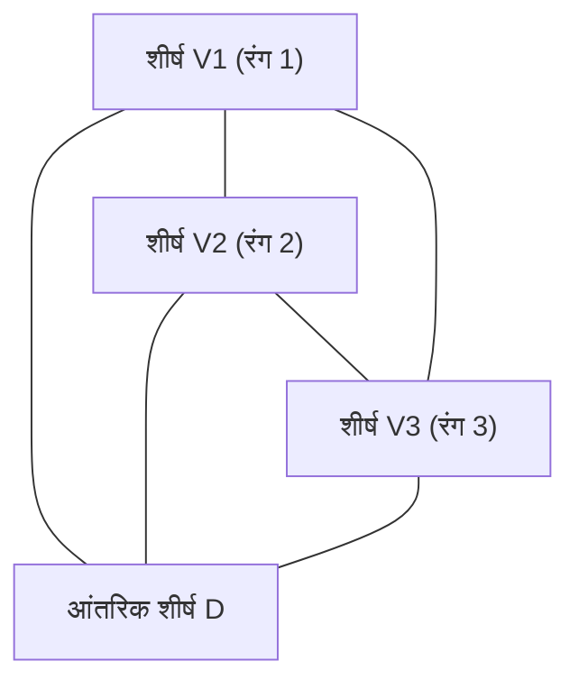

# 1. परिचय: एक पहेली से शुरू होने वाला गणित का रहस्य

गणित की सुंदरता अक्सर इस बात में निहित होती है कि कैसे अत्यंत सरल नियम गहरे और पूरी तरह से अप्रत्याशित परिणामों की ओर ले जा सकते हैं। इसका सबसे प्रतिष्ठित उदाहरणों में से एक है **[स्पर्नर की प्रमेयिका](https://kenji.blog/p/sperners-lemma/)** ([Sperner's Lemma](https://kenji.blog/p/sperners-lemma/))। 1928 में जर्मन गणितज्ञ इमैनुएल स्पर्नर द्वारा प्रकाशित, यह प्रमेयिका, पहली नज़र में, एक "त्रिभुज रंगने वाली पहेली" से ज्यादा कुछ नहीं लगती है जिसे एक प्राथमिक विद्यालय का छात्र भी समझ सकता है।

हालाँकि, यह सरल पहेली आधुनिक गणित में एक अत्यंत महत्वपूर्ण स्थान रखती है। विशेष रूप से, यह **ब्राउवर के स्थिर-बिंदु प्रमेय** (Brouwer Fixed-Point Theorem) के एक संयोजनात्मक और रचनात्मक प्रमाण के लिए एक शक्तिशाली उपकरण के रूप में कार्य करता है, जो टोपोलॉजी में एक मौलिक प्रमेय है और अर्थशास्त्र में गेम थ्योरी जैसे क्षेत्रों में व्यापक रूप से लागू होता है (जैसे कि नैश संतुलन के अस्तित्व को साबित करने में)।

इस लेख में, हम आरेखों के साथ [स्पर्नर की प्रमेयिका](https://kenji.blog/p/sperners-lemma/) को विस्तार से समझाएंगे, इसके सहज अर्थ और इसके कठोर गणितीय प्रमाण से लेकर स्थिर-बिंदु प्रमेयों के लिए इसके अनुप्रयोग तक सब कुछ शामिल करेंगे जो निरंतर दुनिया को पाटते हैं।

# 2. सिम्प्लेक्स और सिम्प्लिसियल कॉम्प्लेक्स: ज्यामिति की नींव

[स्पर्नर की प्रमेयिका](https://kenji.blog/p/sperners-lemma/) को समझने के लिए, हमें पहले **सिम्प्लेक्स** (Simplex) और **सिम्प्लिसियल कॉम्प्लेक्स** (Simplicial Complex / Triangulation) की अवधारणाओं को स्पष्ट करना चाहिए।

## 2.1. सिम्प्लेक्स क्या है?

$n$-आयामी स्थान में, जब $n+1$ ज्यामितीय रूप से स्वतंत्र बिंदु होते हैं, तो उन्हें शीर्षों के रूप में निर्मित सबसे छोटे उत्तल समुच्चय को **$n$-सिम्प्लेक्स** कहा जाता है।
- 0-सिम्प्लेक्स: बिंदु
- 1-सिम्प्लेक्स: रेखा खंड
- 2-सिम्प्लेक्स: त्रिभुज
- 3-सिम्प्लेक्स: चतुष्फलक (Tetrahedron)

यहाँ, हम मुख्य रूप से 2-सिम्प्लेक्स, "त्रिभुज" पर ध्यान केंद्रित करेंगे, जिसे दृश्य रूप से समझना सबसे आसान है। मान लीजिए कि एक बड़ा त्रिभुज $T$ है, और इसके तीन शीर्ष $V_1, V_2, V_3$ होने दें।

## 2.2. सिम्प्लिसियल कॉम्प्लेक्स (त्रिकोणीकरण)

इस बड़े त्रिभुज $T$ को कई छोटे त्रिभुजों में विभाजित करने पर विचार करें। हालाँकि, आप इसे मनमाने ढंग से विभाजित नहीं कर सकते। निम्नलिखित शर्तों को पूरा करने वाले विभाजन को **त्रिकोणीकरण** (Triangulation) कहा जाता है।

1. मान लीजिए $\mathcal{K}$ विभाजन द्वारा बनाए गए छोटे त्रिभुजों का समुच्चय है। यदि $\mathcal{K}$ में कोई भी दो त्रिभुज प्रतिच्छेद करते हैं, तो उनका प्रतिच्छेदन या तो एक "साझा शीर्ष" या "साझा किनारा" होना चाहिए।
2. "आधे-अधूरे कनेक्शन", जहां छोटे त्रिभुज आंशिक रूप से ओवरलैप होते हैं या जब किसी अन्य त्रिभुज का शीर्ष किसी किनारे के बीच में होता है, की अनुमति नहीं है।

इस तरह विभाजित त्रिभुजों के नेटवर्क के लिए, प्रत्येक शीर्ष को रंगना [स्पर्नर की प्रमेयिका](https://kenji.blog/p/sperners-lemma/) के लिए मंच तैयार करता है।

# 3. स्पर्नर रंग: सीमा नियम

मान लीजिए कि त्रिभुज $T$ का त्रिकोणीकरण दिया गया है। एक फ़ंक्शन $C: V \to \{1, 2, 3\}$ पर विचार करें जो इस विभाजन में दिखाई देने वाले **सभी शीर्षों** (बड़े त्रिभुज के शीर्ष, किनारों पर शीर्ष और आंतरिक शीर्ष) को एक रंग प्रदान करता है।

हालाँकि, आपको उन्हें निम्नलिखित सख्त **स्पर्नर शर्त** (सीमा नियम) के अनुसार रंगना होगा।

1. **मुख्य शीर्षों को रंगना** : बड़े त्रिभुज के तीन शीर्ष, $V_1, V_2, V_3$, प्रत्येक को एक अलग रंग से रंगा जाना चाहिए। उदाहरण के लिए, मान लें $C(V_1) = 1, C(V_2) = 2, C(V_3) = 3$।
2. **किनारों पर शीर्षों को रंगना** : बड़े त्रिभुज के किनारों पर शीर्षों को उसी रंग में से किसी एक रंग से रंगा जाना चाहिए जो उस किनारे के अंतिम बिंदुओं का है।
   - किनारे $V_1V_2$ पर शीर्ष रंग 1 या रंग 2 के होते हैं।
   - किनारे $V_2V_3$ पर शीर्ष रंग 2 या रंग 3 के होते हैं।
   - किनारे $V_3V_1$ पर शीर्ष रंग 3 या रंग 1 के होते हैं।
3. **आंतरिक शीर्षों को रंगना** : बड़े त्रिभुज के अंदर के शीर्षों को रंग 1, 2, या 3 में से किसी भी रंग के साथ स्वतंत्र रूप से रंगा जा सकता है।

इन नियमों का पालन करने वाले रंग को **स्पर्नर रंग** (Sperner Coloring) कहा जाता है।

# 4. [स्पर्नर की प्रमेयिका](https://kenji.blog/p/sperners-lemma/) का कथन

जब आप स्पर्नर रंग के नियमों के अनुसार रंगना समाप्त कर लेते हैं, तो क्या घटना होती है? [स्पर्नर की प्रमेयिका](https://kenji.blog/p/sperners-lemma/) निम्नलिखित आश्चर्यजनक तथ्य का दावा करती है।

> **[स्पर्नर की प्रमेयिका](https://kenji.blog/p/sperners-lemma/) (2D)**
> किसी भी स्पर्नर रंग में, उन छोटे त्रिभुजों की संख्या जहां सभी तीनों शीर्षों को अलग-अलग रंगों (रंग 1, रंग 2 और रंग 3) में रंगा गया है, **एक विषम संख्या होनी चाहिए**।
> चूँकि यह एक विषम संख्या (1, 3, 5, ...) है, इसलिए ऐसा "सभी 3 रंगों वाला एक पूर्ण छोटा त्रिभुज" **कम से कम एक बार मौजूद होना चाहिए**।

कोई फर्क नहीं पड़ता कि आप आंतरिक शीर्षों को कितने जानबूझकर रंगते हैं, या आप त्रिभुज को कितनी बारीकी और जटिलता से विभाजित करते हैं, सभी 3 रंगों वाला एक छोटा त्रिभुज (आइए इसे **पूर्ण त्रिभुज** कहें) निश्चित रूप से कहीं न कहीं दिखाई देगा।

# 5. ग्राफ़ सिद्धांत का उपयोग करते हुए एक सुंदर प्रमाण

यह प्रमेय सहज रूप से जादुई लग सकता है, लेकिन इसे "दोहरे ग्राफ़ (Dual Graph)" और "हैंडशेकिंग प्रमेयिका (Handshaking Lemma)" की अवधारणाओं का उपयोग करके खूबसूरती से साबित किया जा सकता है। अगर हम "कमरे और दरवाजे" सादृश्य का उपयोग करते हैं तो यह दृष्टिकोण समझना बहुत आसान है।

## 5.1. कमरे और दरवाजे की परिभाषा

प्रत्येक त्रिकोणीकृत छोटे त्रिभुज को एक "कमरा" मानें। इसके अलावा, आइए बड़े त्रिभुज $T$ के बाहरी हिस्से को "बाहर" कहें।
कमरे को दूसरे कमरे से, या कमरे को बाहर से जो अलग करता है, वह छोटे त्रिभुज का "किनारा" (दीवार) है।

यहाँ, हम एक विशेष दीवार को **दरवाजे** के रूप में परिभाषित करते हैं।
- **दरवाजे की परिभाषा** : एक किनारा जिसके अंतिम बिंदुओं को **रंग 1 और रंग 2** से रंगा गया है, उसे "दरवाजा" कहा जाता है।

आइए विचार करें कि प्रत्येक कमरे (छोटे त्रिभुज) में कितने दरवाजे हैं। चूँकि एक छोटे त्रिभुज के तीन शीर्ष होते हैं, इसलिए इसे रंग संयोजन के आधार पर निम्नलिखित मामलों में वर्गीकृत किया गया है।

1. **रंगों वाले कमरे (1, 1, 1), (2, 2, 2), (3, 3, 3)**
   - चूँकि 1 और 2 की एक जोड़ी वाले कोई किनारे नहीं हैं, इसलिए **0 दरवाजे** हैं।
2. **रंगों वाले कमरे (1, 1, 2) या (1, 2, 2)**
   - रंग 1 और रंग 2 को जोड़ने वाले ठीक दो किनारे हैं। इसलिए, **2 दरवाजे** हैं।
3. **रंगों वाले कमरे (1, 3, 3) या (2, 2, 3) आदि**
   - चूँकि 1 और 2 का कोई जोड़ा नहीं है, इसलिए **0 दरवाजे** हैं।
4. **रंगों वाले कमरे (1, 2, 3) (पूर्ण त्रिभुज)**
   - रंग 1 और रंग 2 को जोड़ने वाला केवल एक किनारा है। इसलिए, **1 दरवाजा** है।

संक्षेप में, **केवल पूर्ण त्रिभुज कमरों में विषम संख्या (1) में दरवाजे होते हैं, और अन्य सभी कमरों में सम संख्या (0 या 2) में दरवाजे होते हैं**।

## 5.2. बाहरी दीवार पर दरवाजों की संख्या

आगे, हम बड़े त्रिभुज की बाहरी परिधि (बाहरी दीवार) पर दरवाजों की संख्या गिनते हैं।
बाहरी दीवार जहाँ दरवाजे (रंग 1 और 2 के किनारे) मौजूद हो सकते हैं, केवल किनारे $V_1V_2$ पर है। (नियमों के कारण किनारों $V_2V_3$ या $V_3V_1$ पर रंग 1 और 2 एक साथ कभी नहीं दिखाई देंगे)।

यदि हम किनारे $V_1V_2$ पर शीर्षों के रंगों को क्रमिक रूप से $V_1$ से देखते हैं, तो पहला रंग 1 है और अंतिम रंग 2 है। जिस बार रंग 1 से 2, या 2 से 1 में बदलता है, वह **एक विषम संख्या होनी चाहिए** क्योंकि शुरुआती बिंदु और अंतिम बिंदु में अलग-अलग रंग होते हैं।
इसलिए, यह स्पष्ट है कि बाहर जाने वाले दरवाजों की संख्या एक **विषम संख्या** है।

## 5.3. हैंडशेकिंग प्रमेयिका का उपयोग करके डिग्री की गणना

यहीं से ग्राफ़ सिद्धांत आता है।
- ग्राफ़ के शीर्ष: प्रत्येक छोटा त्रिभुज (कमरा) और बाहर।
- ग्राफ़ के किनारे: दरवाजे (रंग 1 और 2 के किनारे)। जब दो कमरे एक दरवाजा साझा करते हैं, तो उनके शीर्षों को एक किनारे से जोड़ें।

"हैंडशेकिंग प्रमेयिका" के अनुसार, ग्राफ़ सिद्धांत में एक मौलिक प्रमेय, सभी शीर्षों की "डिग्री" (जुड़े हुए किनारों की संख्या) का योग हमेशा एक सम संख्या (किनारों की संख्या का दोगुना) होना चाहिए।

$$ \sum_{v \in V} \text{deg}(v) = 2|E| $$

हमारे द्वारा बनाए गए ग्राफ़ में, प्रत्येक शीर्ष की डिग्री (दरवाजों की संख्या) क्या है?
- बाहर की डिग्री = बाहरी दीवार पर दरवाजों की संख्या = **विषम संख्या**
- पूर्ण त्रिभुज कमरों की डिग्री = 1 = **विषम संख्या**
- अन्य कमरों की डिग्री = 0 या 2 = **सम संख्या**

आइए डिग्री के कुल योग की गणना करें।
$$ \text{कुल योग} = \text{बाहर की डिग्री} + \text{पूर्ण त्रिभुजों की डिग्री का योग} + \text{अन्य कमरों की डिग्री का योग} $$

कुल योग एक सम संख्या होनी चाहिए।
बाहर की डिग्री "विषम" है, और अन्य कमरों की डिग्री का योग "सम" है।
इसलिए, कुल योग सम होने के लिए "पूर्ण त्रिभुजों की डिग्री का योग" **एक विषम संख्या होनी चाहिए**।
चूँकि प्रत्येक पूर्ण त्रिभुज की डिग्री 1 है, इसलिए पूर्ण त्रिभुजों की संख्या **एक विषम संख्या होनी चाहिए**।

इसके साथ, यह पूरी तरह से सिद्ध हो जाता है कि कम से कम एक पूर्ण त्रिभुज है।

# 6. उच्च आयामों के लिए सामान्यीकरण

[स्पर्नर की प्रमेयिका](https://kenji.blog/p/sperners-lemma/) 2D त्रिभुजों तक सीमित नहीं है, बल्कि किसी भी $n$-आयामी सिम्प्लेक्स के लिए मान्य है।

एक $n$-आयामी सिम्प्लेक्स के मामले में (उदाहरण के लिए, $n=3$ के लिए एक चतुष्फलक), $n+1$ शीर्ष होते हैं, और हम $n+1$ रंगों, $1, 2, \dots, n+1$ का उपयोग करते हैं।
सीमा की स्थिति को निम्नानुसार सामान्यीकृत किया गया है: "किसी भी $k$-आयामी फलक (facet) पर शीर्षों को केवल उन्हीं रंगों का उपयोग करना चाहिए जो इस फलक को बनाने वाले $k+1$ शीर्षों का है।"

प्रमाण गणितीय प्रेरण (mathematical induction) का उपयोग करता है।
- $n=1$ के लिए: रेखा खंड के अंतिम बिंदु रंग 1 और रंग 2 हैं। मध्यवर्ती बिंदु 1 या 2 हैं। स्थानों की संख्या जहाँ यह 1 से 2 (पूर्ण 1-सिम्प्लेक्स) में बदलती है, हमेशा विषम होती है।
- यह मानते हुए कि यह $n=k$ के लिए मान्य है, जब $n=k+1$ के लिए सिद्ध करते हैं, तो हम पहले की तरह ही "दरवाजे" ($n$ रंगों के पूर्ण फलक) की संख्या की गणना करते हैं, जो शानदार ढंग से $n+1$ रंगों के विषम संख्या में पूर्ण सिम्प्लेक्स के अस्तित्व को दर्शाता है।

# 7. ब्राउवर के स्थिर-बिंदु प्रमेय पर अनुप्रयोग

[स्पर्नर की प्रमेयिका](https://kenji.blog/p/sperners-lemma/) को इतना महत्वपूर्ण क्यों माना जाता है? इसका कारण यह है कि यह असतत प्रमेय एक निरंतर टोपोलॉजिकल प्रमेय, **ब्राउवर के स्थिर-बिंदु प्रमेय** को साबित करने के लिए एक पुल के रूप में कार्य करता है।

## 7.1. ब्राउवर का स्थिर-बिंदु प्रमेय क्या है?

> **ब्राउवर का स्थिर-बिंदु प्रमेय**
> एक $n$-आयामी इकाई गेंद (या सिम्प्लेक्स) से स्वयं के लिए किसी भी निरंतर मानचित्रण $f: D \to D$ में कम से कम एक बिंदु $x$ (स्थिर बिंदु) होना चाहिए जैसे कि $f(x) = x$।

यह एक प्रसिद्ध प्रमेय है जिसे अक्सर एक रूपक के साथ समझाया जाता है: जब आप अपनी कॉफी को हिलाते हैं और कप नीचे रखते हैं, तो हमेशा कम से कम एक कॉफी का कण होता है जो ठीक उसी स्थिति में होता है जहाँ वह आपके हिलाना शुरू करने से पहले था।

## 7.2. [स्पर्नर की प्रमेयिका](https://kenji.blog/p/sperners-lemma/) से दृष्टिकोण

[स्पर्नर की प्रमेयिका](https://kenji.blog/p/sperners-lemma/) से स्थिर-बिंदु प्रमेय को प्राप्त करने का तर्क अत्यधिक सुरुचिपूर्ण है।

1. **बेरीसेंट्रिक निर्देशांक और विस्थापन वैक्टर का मूल्यांकन**
   सिम्प्लेक्स पर एक यादृच्छिक बिंदु $x$ पर निरंतर मानचित्रण $f$ लागू करें और गंतव्य $f(x)$ को देखें। उस दिशा के आधार पर जिसमें यह स्थानांतरित हुआ (बेरीसेंट्रिक निर्देशांक का कौन सा घटक कम हुआ), बिंदु $x$ को एक रंग निर्दिष्ट करें।
   $$ \text{उदाहरण के लिए, यदि } x \text{ का } i \text{-वां घटक सख्ती से } f(x) \text{ के } i \text{-वें घटक से बड़ा है, तो इसे रंग } i \text{ पेंट करें} $$
   
2. **सीमा शर्तों की जाँच करना**
   निरंतर मानचित्रण की प्रकृति के कारण जहाँ आप सीमाओं पर बाहर नहीं जा सकते हैं, रंगने की यह विधि स्पर्नर रंग की शर्तों को ठीक से पूरा करती है।

3. **सीमा में संक्रमण**
   हम त्रिभुज को और अधिक महीन त्रिकोणीकृत करते हैं। प्रत्येक त्रिकोणीकरण में, [स्पर्नर की प्रमेयिका](https://kenji.blog/p/sperners-lemma/) द्वारा, हमेशा एक छोटा त्रिभुज होता है जहाँ सभी 3 रंग मौजूद होते हैं।
   
4. **कॉम्पैक्टनेस और कन्वर्जेंस**
   हम सीमा लेते हैं क्योंकि विभाजन का आकार शून्य के करीब पहुंचता है। बोलजानो-वीयरस्ट्रास प्रमेय (एक कॉम्पैक्ट स्पेस में एक अनुक्रम का एक अभिसरण उप-अनुक्रम होता है) के अनुसार, पूर्ण त्रिभुजों का यह अनुक्रम एक एकल बिंदु $x^*$ पर अभिसरण करता है।
   
5. **स्थिर बिंदु की पहचान**
   चूँकि मानचित्रण $f$ निरंतर है, इस सीमा बिंदु $x^*$ पर, इसकी एक "दिशा होनी चाहिए जहाँ सभी घटक कम हो जाते हैं", लेकिन चूँकि बेरीसेंट्रिक निर्देशांक का योग हमेशा 1 होता है, इसलिए सभी घटकों का कम होना असंभव है। इसलिए, एकमात्र संभावना यह है कि "कोई घटक नहीं बदलता है", अर्थात, $f(x^*) = x^*$। यह स्थिर बिंदु है।

# 8. अन्य अनुप्रयोग: उचित विभाजन और अर्थशास्त्र

स्थिर-बिंदु प्रमेय के अलावा, [स्पर्नर की प्रमेयिका](https://kenji.blog/p/sperners-lemma/) वास्तविक दुनिया की समस्याओं पर सीधे लागू होती है।
विशिष्ट उदाहरण "उचित किराया विभाजन समस्या" और "केक काटने की समस्या" हैं।

जब कई लोग एक घर साझा करते हैं, तो इस बात पर विवाद उत्पन्न हो सकता है कि कौन सा कमरा कितना और किराए पर लेता है, क्योंकि कमरों का आकार और स्थितियां अलग-अलग होती हैं। [स्पर्नर की प्रमेयिका](https://kenji.blog/p/sperners-lemma/) को लागू करने वाले एल्गोरिदम का उपयोग करते हुए (जैसे सु का एल्गोरिदम), यह सिद्ध किया जा सकता है कि हमेशा एक उचित आवंटन होता है जहाँ "हर कोई अपने चुने हुए कमरे और किराए से संतुष्ट होता है, और किराए का योग मूल राशि से मेल खाता है", और इसके अलावा, यह अनुमानतः पाया जा सकता है।

साथ ही, अर्थशास्त्र में जॉन नैश द्वारा सिद्ध किया गया "नैश संतुलन का अस्तित्व" ब्राउवर या ककुटानी के स्थिर-बिंदु प्रमेयों पर निर्भर करता है, जो मौलिक रूप से [स्पर्नर की प्रमेयिका](https://kenji.blog/p/sperners-lemma/) जैसी संयोजनात्मक संरचनाओं को छुपाता है।

# 9. निष्कर्ष

[स्पर्नर की प्रमेयिका](https://kenji.blog/p/sperners-lemma/) नियमों के अनुसार एक त्रिभुज के शीर्षों को रंगने के लगभग गेम-जैसे सेटअप से शुरू होती है। हालाँकि, "दरवाजों की संख्या गिनने" के उस सरल तर्क के भीतर, अंतरिक्ष की निरंतरता और अपरिवर्तनशीलता के बारे में गहरी सच्चाइयाँ छिपी हुई थीं।

असतत गणित और निरंतर गणित। तथ्य यह है कि ये दो प्रतीत होने वाली पूरी तरह से अलग दुनिया एक इतने सुंदर प्रमेय से जुड़ी हुई हैं, संभवतः एक अनुशासन के रूप में गणित की सबसे बड़ी अपीलों में से एक है। हम पाठकों को एक कागज और कलम लेने, एक त्रिभुज को मनमाने ढंग से विभाजित करने और उसे 3 रंगों में रंगने के लिए प्रोत्साहित करते हैं। जब आपको "पूर्ण त्रिभुज" मिल जाए जो हमेशा वहां छिपा रहता है, तो आपको भी गणित के रहस्य को छूने में सक्षम होना चाहिए।
