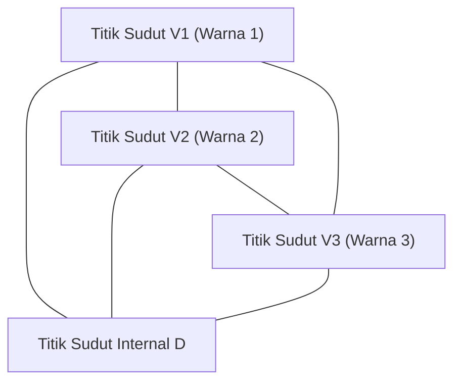

# 1. Pendahuluan: Misteri Matematika Mulai dari Teka-teki

Keindahan matematika sering kali terletak pada bagaimana aturan yang sangat sederhana dapat mengarah pada hasil yang mendalam dan sama sekali tidak terduga. Salah satu contoh paling ikonik dari hal ini adalah **[Lemma Sperner](https://kenji.blog/id/p/sperners-lemma/)** ([Sperner's Lemma](https://kenji.blog/id/p/sperners-lemma/)). Diterbitkan pada tahun 1928 oleh ahli matematika Jerman Emanuel Sperner, lemma ini, pada pandangan pertama, seolah-olah tidak lebih dari "teka-teki mewarnai segitiga" yang bahkan dapat dipahami oleh siswa sekolah dasar.

Namun, teka-teki sederhana ini memegang posisi yang sangat penting dalam matematika modern. Secara khusus, ini berfungsi sebagai alat yang ampuh untuk bukti kombinatorial dan konstruktif dari **Teorema Titik Tetap Brouwer** (Brouwer Fixed-Point Theorem), yang merupakan teorema fundamental dalam topologi dan diterapkan secara luas di bidang-bidang seperti teori permainan di bidang ekonomi (seperti dalam membuktikan keberadaan Ekuilibrium Nash).

Dalam artikel ini, kami akan menjelaskan [Lemma Sperner](https://kenji.blog/id/p/sperners-lemma/) secara rinci dengan diagram, mencakup segala hal mulai dari makna intuitif dan bukti matematisnya yang ketat, hingga penerapannya pada teorema titik tetap yang menjembatani dunia kontinu.

# 2. Simpleks dan Kompleks Simplisial: Dasar-dasar Geometri

Untuk memahami [Lemma Sperner](https://kenji.blog/id/p/sperners-lemma/), pertama-tama kita harus memperjelas konsep **Simpleks** (Simplex) dan **Kompleks Simplisial** (Simplicial Complex / Triangulation).

## 2.1. Apa itu Simpleks?

Dalam ruang dimensi $n$, ketika ada $n+1$ titik yang secara geometris independen, himpunan cembung terkecil yang dibangun dengan titik-titik tersebut sebagai titik sudut disebut **simpleks-$n$**.
- Simpleks-0: Titik
- Simpleks-1: Segmen garis
- Simpleks-2: Segitiga
- Simpleks-3: Tetrahedron

Di sini, kita akan fokus terutama pada simpleks-2, "segitiga", yang paling mudah dipahami secara visual. Misalkan ada segitiga besar $T$, dan biarkan ketiga titik sudutnya menjadi $V_1, V_2, V_3$.

## 2.2. Kompleks Simplisial (Triangulasi)

Pertimbangkan untuk membagi segitiga besar $T$ ini menjadi beberapa segitiga yang lebih kecil. Namun, Anda tidak dapat membaginya secara sewenang-wenang. Pembagian yang memenuhi kondisi berikut disebut **Triangulasi**.

1. Misalkan $\mathcal{K}$ adalah himpunan segitiga kecil yang dibentuk oleh pembagian. Jika dua segitiga mana pun di $\mathcal{K}$ berpotongan, perpotongannya harus berupa "titik sudut bersama" atau "tepi bersama".
2. "Koneksi setengah hati", di mana segitiga kecil saling tumpang tindih sebagian atau ketika titik sudut segitiga lain terletak di tengah tepi, tidak diizinkan.

Untuk jaringan segitiga yang dibagi dengan cara ini, mewarnai setiap titik sudut menyiapkan panggung untuk [Lemma Sperner](https://kenji.blog/id/p/sperners-lemma/).

# 3. Pewarnaan Sperner: Aturan Batas

Misalkan sebuah triangulasi dari segitiga $T$ diberikan. Pertimbangkan fungsi $C: V \to \{1, 2, 3\}$ yang memberikan warna ke **semua titik sudut** yang muncul dalam pembagian ini (titik sudut dari segitiga besar, titik sudut pada tepi, dan titik sudut internal).

Namun, Anda harus mewarnainya menurut **Kondisi Sperner** yang ketat berikut ini (aturan batas).

1. **Mewarnai titik sudut utama** : Tiga titik sudut dari segitiga besar, $V_1, V_2, V_3$, masing-masing harus diwarnai dengan warna yang berbeda. Misalnya, biarkan $C(V_1) = 1, C(V_2) = 2, C(V_3) = 3$.
2. **Mewarnai titik sudut pada tepi** : Titik sudut pada tepi segitiga besar harus diwarnai dengan salah satu warna yang sama dengan titik akhir tepi tersebut.
   - Titik sudut pada tepi $V_1V_2$ berwarna 1 atau warna 2.
   - Titik sudut pada tepi $V_2V_3$ berwarna 2 atau warna 3.
   - Titik sudut pada tepi $V_3V_1$ berwarna 3 atau warna 1.
3. **Mewarnai titik sudut internal** : Titik sudut di dalam segitiga besar dapat diwarnai secara bebas dengan salah satu warna 1, 2, atau 3.

Pewarnaan yang mengikuti aturan-aturan ini disebut **Pewarnaan Sperner** (Sperner Coloring).

# 4. Pernyataan [Lemma Sperner](https://kenji.blog/id/p/sperners-lemma/)

Ketika Anda selesai mewarnai menurut aturan pewarnaan Sperner, fenomena apa yang terjadi? [Lemma Sperner](https://kenji.blog/id/p/sperners-lemma/) menegaskan fakta mencengangkan berikut ini.

> **[Lemma Sperner](https://kenji.blog/id/p/sperners-lemma/) (2D)**
> Dalam pewarnaan Sperner apa pun, jumlah segitiga kecil di mana ketiga titik sudut dicat dengan warna yang berbeda (warna 1, warna 2, dan warna 3) **harus berupa bilangan ganjil**.
> Karena ini adalah bilangan ganjil (1, 3, 5, ...), maka "segitiga kecil lengkap dengan ketiga warna" seperti itu **pasti ada setidaknya satu kali**.

Tidak peduli seberapa sengaja Anda mewarnai titik sudut internal, atau seberapa halus dan rumit Anda membagi segitiga, segitiga kecil dengan ketiga warna (mari kita sebut **Segitiga Lengkap**) pasti akan muncul di suatu tempat.

# 5. Bukti Indah Menggunakan Teori Graf

Teorema ini mungkin tampak ajaib secara intuitif, tetapi dapat dibuktikan dengan indah menggunakan konsep "Graf Ganda" dan "Lemma Jabat Tangan". Pendekatan ini sangat mudah dipahami jika kita menggunakan analogi "ruangan dan pintu".

## 5.1. Definisi Ruangan dan Pintu

Anggaplah setiap segitiga kecil yang ditriangulasi sebagai "ruangan". Selain itu, mari kita sebut bagian luar segitiga besar $T$ sebagai "luar ruangan".
Apa yang memisahkan sebuah ruangan dari ruangan lain, atau sebuah ruangan dari luar ruangan, adalah "tepi" (dinding) dari segitiga kecil.

Di sini, kita mendefinisikan dinding khusus sebagai **pintu**.
- **Definisi pintu** : Tepi yang titik akhirnya diwarnai dengan **Warna 1 dan Warna 2** disebut "pintu".

Mari kita pertimbangkan berapa banyak pintu yang dimiliki setiap ruangan (segitiga kecil). Karena segitiga kecil memiliki tiga titik sudut, ia diklasifikasikan ke dalam kasus-kasus berikut berdasarkan kombinasi warna.

1. **Ruangan dengan warna (1, 1, 1), (2, 2, 2), (3, 3, 3)**
   - Karena tidak ada tepi dengan sepasang 1 dan 2, ada **0 pintu** .
2. **Ruangan dengan warna (1, 1, 2) atau (1, 2, 2)**
   - Tepat ada dua tepi yang menghubungkan warna 1 dan warna 2. Oleh karena itu, ada **2 pintu** .
3. **Ruangan dengan warna (1, 3, 3) atau (2, 2, 3) dll.**
   - Karena tidak ada pasangan 1 dan 2, ada **0 pintu** .
4. **Ruangan dengan warna (1, 2, 3) (Segitiga Lengkap)**
   - Hanya ada satu tepi yang menghubungkan warna 1 dan warna 2. Oleh karena itu, ada **1 pintu** .

Singkatnya, **hanya ruangan dari segitiga lengkap yang memiliki jumlah pintu ganjil (1), dan semua ruangan lainnya memiliki jumlah pintu genap (0 atau 2)** .

## 5.2. Jumlah Pintu di Dinding Luar

Selanjutnya, kita menghitung jumlah pintu di perimeter luar (dinding luar) segitiga besar.
Dinding luar di mana pintu (tepi warna 1 dan 2) dapat berada hanya pada tepi $V_1V_2$. (Warna 1 dan 2 tidak akan pernah muncul bersamaan pada tepi $V_2V_3$ atau $V_3V_1$ karena aturannya).

Jika kita melihat warna-warna titik sudut pada tepi $V_1V_2$ secara berurutan dari $V_1$, yang pertama adalah warna 1 dan yang terakhir adalah warna 2. Jumlah kali warna berubah dari 1 ke 2, atau dari 2 ke 1, **pasti merupakan bilangan ganjil** karena titik awal dan titik akhir memiliki warna yang berbeda.
Oleh karena itu, jelas bahwa jumlah pintu yang mengarah ke luar adalah **bilangan ganjil** .

## 5.3. Menghitung Derajat Menggunakan Lemma Jabat Tangan

Di sinilah teori graf berperan.
- Titik sudut graf: Setiap segitiga kecil (ruangan) dan luar ruangan.
- Tepi graf: Pintu (tepi warna 1 dan 2). Ketika dua ruangan berbagi pintu, hubungkan titik sudutnya dengan tepi.

Menurut "Lemma Jabat Tangan", sebuah teorema dasar dalam teori graf, jumlah "derajat" (jumlah tepi yang terhubung) dari semua titik sudut harus selalu merupakan bilangan genap (dua kali jumlah tepi).

$$ \sum_{v \in V} \text{deg}(v) = 2|E| $$

Dalam graf yang kita buat, apa derajat (jumlah pintu) dari setiap titik sudut?
- Derajat luar ruangan = Jumlah pintu di dinding luar = **Bilangan ganjil**
- Derajat ruangan segitiga lengkap = 1 = **Bilangan ganjil**
- Derajat ruangan lain = 0 atau 2 = **Bilangan genap**

Mari kita hitung jumlah total derajat.
$$ \text{Jumlah Total} = \text{Derajat Luar Ruangan} + \text{Jumlah Derajat Segitiga Lengkap} + \text{Jumlah Derajat Ruangan Lain} $$

Jumlah totalnya harus berupa bilangan genap.
Derajat luar ruangan adalah "ganjil", dan jumlah derajat ruangan lain adalah "genap".
Oleh karena itu, "Jumlah Derajat Segitiga Lengkap" **harus berupa bilangan ganjil** agar jumlah totalnya genap.
Karena derajat setiap segitiga lengkap adalah 1, jumlah segitiga lengkap **harus berupa bilangan ganjil** .

Dengan ini, terbukti dengan sempurna bahwa setidaknya ada satu segitiga lengkap.

# 6. Generalisasi ke Dimensi yang Lebih Tinggi

[Lemma Sperner](https://kenji.blog/id/p/sperners-lemma/) tidak terbatas pada segitiga 2D tetapi berlaku untuk setiap simpleks dimensi-$n$.

Dalam kasus simpleks dimensi-$n$ (misalnya, tetrahedron untuk $n=3$), ada $n+1$ titik sudut, dan kita menggunakan $n+1$ warna, $1, 2, \dots, n+1$.
Kondisi batas digeneralisasikan sebagai berikut: "Titik sudut pada permukaan (faset) berdimensi-$k$ apa pun hanya boleh menggunakan warna yang sama dengan $k+1$ titik sudut yang membentuk permukaan tersebut."

Bukti tersebut menggunakan induksi matematika.
- Untuk $n=1$: Titik akhir segmen garis adalah warna 1 dan warna 2. Titik perantara adalah 1 atau 2. Jumlah tempat yang berubah dari 1 ke 2 (simpleks-1 lengkap) selalu ganjil.
- Dengan asumsi hal itu berlaku untuk $n=k$, ketika membuktikan untuk $n=k+1$, kita menghitung jumlah "pintu" (permukaan lengkap $n$ warna) dengan cara yang sama seperti sebelumnya, yang secara brilian menunjukkan keberadaan simpleks lengkap berdimensi $n+1$ dalam jumlah ganjil.

# 7. Penerapan pada Teorema Titik Tetap Brouwer

Mengapa [Lemma Sperner](https://kenji.blog/id/p/sperners-lemma/) dianggap sangat penting? Itu karena teorema diskrit ini bertindak sebagai jembatan untuk membuktikan teorema topologis kontinu, **Teorema Titik Tetap Brouwer**.

## 7.1. Apa itu Teorema Titik Tetap Brouwer?

> **Teorema Titik Tetap Brouwer**
> Setiap pemetaan kontinu $f: D \to D$ dari bola satuan dimensi-$n$ (atau simpleks) ke dirinya sendiri harus memiliki setidaknya satu titik $x$ (titik tetap) sedemikian rupa sehingga $f(x) = x$.

Ini adalah teorema terkenal yang sering dijelaskan dengan metafora: ketika Anda mengaduk kopi dan meletakkan cangkirnya, selalu ada setidaknya satu partikel kopi yang berada di posisi yang sama persis dengan sebelum Anda mulai mengaduk.

## 7.2. Pendekatan dari [Lemma Sperner](https://kenji.blog/id/p/sperners-lemma/)

Logika untuk menurunkan teorema titik tetap dari [Lemma Sperner](https://kenji.blog/id/p/sperners-lemma/) sangat elegan.

1. **Evaluasi Koordinat Barycentric dan Vektor Perpindahan**
   Terapkan pemetaan kontinu $f$ ke titik arbitrer $x$ pada simpleks dan lihat tujuannya $f(x)$. Tetapkan warna ke titik $x$ berdasarkan arah perpindahannya (komponen koordinat barycentric mana yang menurun).
   $$ \text{Misalnya, jika komponen ke-} i \text{ dari } x \text{ benar-benar lebih besar dari komponen ke-} i \text{ dari } f(x) \text{, cat dengan warna } i $$
   
2. **Memeriksa Kondisi Batas**
   Karena sifat pemetaan kontinu di mana Anda tidak dapat bergerak ke luar pada batas-batasnya, metode pewarnaan ini persis memenuhi kondisi pewarnaan Sperner.

3. **Transisi ke Batas**
   Kita mentriangulasi segitiga menjadi lebih halus dan lebih halus lagi. Dalam setiap triangulasi, berdasarkan [Lemma Sperner](https://kenji.blog/id/p/sperners-lemma/), selalu ada segitiga kecil di mana ketiga warna hadir.
   
4. **Kekompakan dan Konvergensi**
   Kita mengambil batas saat ukuran pembagian mendekati nol. Menurut Teorema Bolzano-Weierstrass (barisan dalam ruang kompak memiliki subbarisan yang konvergen), barisan segitiga lengkap ini konvergen ke satu titik $x^*$.
   
5. **Mengidentifikasi Titik Tetap**
   Karena pemetaan $f$ kontinu, pada titik batas $x^*$ ini, ia harus memiliki "arah di mana semua komponen menurun", tetapi karena jumlah koordinat barycentric selalu 1, tidak mungkin semua komponen menurun. Oleh karena itu, satu-satunya kemungkinan adalah bahwa "tidak ada komponen yang berubah", yaitu $f(x^*) = x^*$. Ini adalah titik tetap.

# 8. Aplikasi Lain: Pembagian yang Adil dan Ekonomi

Selain teorema titik tetap, [Lemma Sperner](https://kenji.blog/id/p/sperners-lemma/) diterapkan secara langsung pada masalah dunia nyata.
Contoh tipikal adalah "masalah pembagian sewa yang adil" dan "masalah pemotongan kue".

Ketika beberapa orang berbagi rumah, konflik bisa timbul mengenai siapa yang menyewa kamar mana dan untuk berapa harga, karena ukuran dan kondisi kamar bervariasi. Menggunakan algoritma yang menerapkan [Lemma Sperner](https://kenji.blog/id/p/sperners-lemma/) (seperti algoritma Su), dapat dibuktikan bahwa selalu ada alokasi yang adil di mana "setiap orang puas dengan kamar dan sewa yang mereka pilih, dan jumlah sewanya sesuai dengan jumlah aslinya", dan terlebih lagi, ini dapat ditemukan secara perkiraan.

Selain itu, "keberadaan Ekuilibrium Nash" yang dibuktikan oleh John Nash di bidang ekonomi bergantung pada teorema titik tetap Brouwer atau Kakutani, yang pada dasarnya menyembunyikan struktur kombinatorial seperti [Lemma Sperner](https://kenji.blog/id/p/sperners-lemma/).

# 9. Kesimpulan

[Lemma Sperner](https://kenji.blog/id/p/sperners-lemma/) dimulai dengan pengaturan yang hampir seperti permainan berupa mewarnai titik-titik sudut dari sebuah segitiga sesuai aturan. Namun, di dalam logika sederhana "menghitung jumlah pintu", kebenaran mendalam tentang kontinuitas dan invariansi ruang tersembunyi.

Matematika diskrit dan matematika kontinu. Fakta bahwa kedua dunia yang tampaknya sama sekali berbeda ini dihubungkan oleh teorema yang begitu indah merupakan salah satu daya tarik terbesar matematika sebagai suatu disiplin ilmu. Kami mendorong para pembaca untuk mengambil kertas dan pena, membagi segitiga secara sembarang dan melukisnya dengan 3 warna. Ketika Anda menemukan "segitiga lengkap" yang selalu bersembunyi di sana, Anda juga akan dapat menyentuh misteri matematika.
