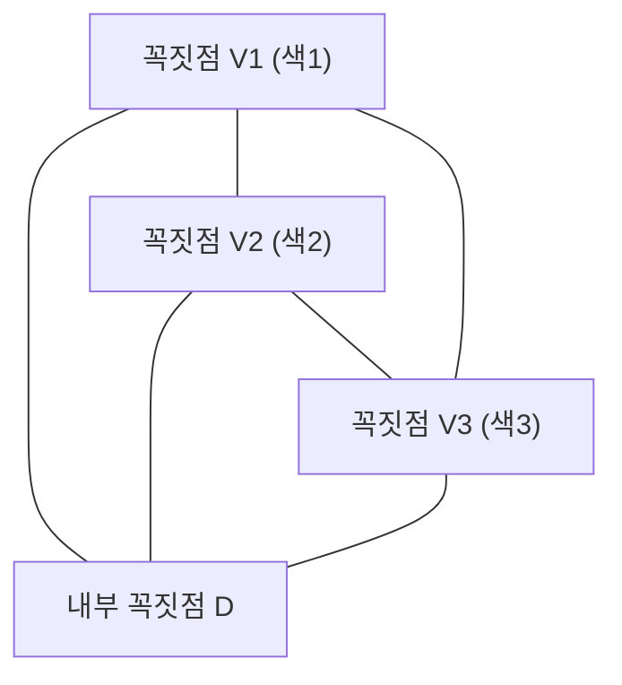

# 1. 서론: 퍼즐에서 시작되는 수학의 신비

수학의 아름다움은 종종 지극히 단순한 규칙에서 아무도 예상하지 못한 심오한 결과가 도출된다는 점에 있습니다. 그 가장 상징적인 예 중 하나가 **[스페르너의 보조정리](https://kenji.blog/ko/p/sperners-lemma/)** ([Sperner's Lemma](https://kenji.blog/ko/p/sperners-lemma/)) 입니다. 1928년 독일의 수학자 에마누엘 스페르너(Emanuel Sperner)가 발표한 이 정리는 언뜻 보면 초등학생도 이해할 수 있는 "삼각형 색칠 퍼즐"에 불과해 보입니다.

하지만 이 단순한 퍼즐은 현대 수학에서 매우 중요한 위치를 차지하고 있습니다. 특히 위상수학의 기본 정리이자 경제학의 게임 이론(내시 균형의 존재 증명) 등에도 응용되는 **브라우어 고정점 정리** (Brouwer Fixed-Point Theorem) 를 조합론적이고 구성적으로 증명하기 위한 강력한 도구가 됩니다.

본 글에서는 이 [스페르너의 보조정리](https://kenji.blog/ko/p/sperners-lemma/)에 대해 직관적인 의미부터 엄밀한 수학적 증명, 그리고 연속적인 세계로의 가교가 되는 고정점 정리로의 응용까지 그림과 함께 자세히 설명합니다.

# 2. 단체와 단체 분할: 기하학의 기초

[스페르너의 보조정리](https://kenji.blog/ko/p/sperners-lemma/)를 이해하기 위해서는 먼저 **단체** (Simplex) 와 **단체 분할** (Simplicial Complex / Triangulation) 이라는 개념을 명확히 해둘 필요가 있습니다.

## 2.1. 단체란 무엇인가?

$n$차원 공간에서 기하학적으로 독립적인 $n+1$개의 점이 있을 때, 이들을 꼭짓점으로 구성되는 가장 작은 볼록 집합을 **$n$차원 단체** (n-simplex) 라고 부릅니다.
- 0차원 단체: 점
- 1차원 단체: 선분
- 2차원 단체: 삼각형
- 3차원 단체: 사면체

여기서는 시각적으로 이해하기 가장 쉬운 2차원 단체, 즉 "삼각형"을 중심으로 생각해보겠습니다. 큰 삼각형 $T$가 있고, 그 세 꼭짓점을 $V_1, V_2, V_3$이라고 합시다.

## 2.2. 단체 분할 (삼각 분할)

이 큰 삼각형 $T$를 여러 개의 작은 삼각형으로 분할하는 것을 생각해 봅시다. 단, 아무렇게나 분할해서는 안 되며, 다음 조건을 만족하는 분할을 **단체 분할** (Triangulation) 이라고 부릅니다.

1. 분할된 작은 삼각형들의 집합을 $\mathcal{K}$라고 할 때, $\mathcal{K}$의 임의의 두 삼각형이 만나는 경우, 그 교집합은 "공유하는 꼭짓점"이거나 "공유하는 변" 중 하나여야 한다.
2. 작은 삼각형이 부분적으로 겹치거나, 다른 삼각형의 꼭짓점이 어떤 변의 중간에 오는 것과 같은 "어중간하게 접하는 방식"은 허용되지 않는다.

이렇게 분할된 삼각형의 네트워크에 대해 각 꼭짓점에 색을 칠해 나가는 것이 [스페르너의 보조정리](https://kenji.blog/ko/p/sperners-lemma/)의 무대가 됩니다.

# 3. 스페르너 채색: 경계 규칙

삼각형 $T$의 단체 분할이 주어졌다고 가정합시다. 이 분할에 나타나는 **모든 꼭짓점** (큰 삼각형의 꼭짓점, 변 위의 꼭짓점 및 내부의 꼭짓점)에 대해 색을 할당하는 함수 $C: V \to \{1, 2, 3\}$을 생각합니다.

단, 다음의 엄격한 **경계 규칙** (Sperner Condition) 에 따라 색을 칠해야 합니다.

1. **주 꼭짓점의 채색** : 큰 삼각형의 세 꼭짓점 $V_1, V_2, V_3$는 각각 서로 다른 색으로 칠해져야 합니다. 예를 들어 $C(V_1) = 1, C(V_2) = 2, C(V_3) = 3$이라고 합니다.
2. **변 위의 꼭짓점의 채색** : 큰 삼각형의 변 위에 있는 꼭짓점은 그 변의 양 끝점과 같은 색 중 하나여야 합니다.
   - 변 $V_1V_2$ 위의 꼭짓점은 색1 또는 색2.
   - 변 $V_2V_3$ 위의 꼭짓점은 색2 또는 색3.
   - 변 $V_3V_1$ 위의 꼭짓점은 색3 또는 색1.
3. **내부 꼭짓점의 채색** : 큰 삼각형 내부의 꼭짓점은 색1, 색2, 색3 중 아무거나 칠해도 자유입니다.

이 규칙에 따른 채색을 **스페르너 채색** (Sperner Coloring) 이라고 부릅니다.

# 4. [스페르너의 보조정리](https://kenji.blog/ko/p/sperners-lemma/)의 주장

스페르너 채색 규칙에 따라 색을 다 칠했을 때, 어떤 현상이 일어날까요? [스페르너의 보조정리](https://kenji.blog/ko/p/sperners-lemma/)는 다음과 같은 놀라운 사실을 주장합니다.

> **[스페르너의 보조정리](https://kenji.blog/ko/p/sperners-lemma/) (2차원)**
> 임의의 스페르너 채색에서 세 꼭짓점이 모두 다른 색(색1, 색2, 색3)으로 칠해진 작은 삼각형은 **반드시 홀수 개 존재한다** .
> 홀수 개(1, 3, 5, ...)이므로, 그러한 "3가지 색이 모두 모인 완전한 작은 삼각형"은 **적어도 1개는 반드시 존재한다** .

내부의 꼭짓점을 아무리 고의적으로 칠해도, 삼각형을 아무리 잘게 복잡하게 분할해도 반드시 3가지 색이 모인 작은 삼각형(이하 **완전 삼각형** 이라 부르겠습니다)이 어딘가에 나타나는 것입니다.

# 5. 그래프 이론을 이용한 아름다운 증명

이 정리는 직관적으로는 신기하게 여겨질지 모르지만, '쌍대 그래프(Dual [Graph](https://kenji.blog/ko/p/tree-graph-data-structures-search-dfs-bfs-dijkstra/))'와 '악수 보조정리(Handshaking Lemma)'를 사용하면 마술처럼 아름답게 증명할 수 있습니다. 이 접근법은 '방과 문'의 비유를 사용하면 매우 알기 쉽습니다.

## 5.1. 방과 문의 정의

단체 분할된 각각의 작은 삼각형을 "방"으로 간주합니다. 또한 큰 삼각형 $T$의 바깥을 "야외"라고 부르겠습니다.
방과 방, 혹은 방과 야외를 가르는 것은 작은 삼각형의 "변(벽)"입니다.

여기서 특별한 벽을 **문** 으로 정의합니다.
- **문의 정의** : 양 끝의 꼭짓점이 **색1과 색2** 로 칠해져 있는 변을 "문"이라고 부른다.

각 방(작은 삼각형)에는 몇 개의 문이 있는지 생각해 봅시다. 작은 삼각형은 3개의 꼭짓점을 가지므로 그 색 조합에 따라 다음과 같은 경우로 분류됩니다.

1. **색이 (1, 1, 1), (2, 2, 2), (3, 3, 3)인 방**
   - 1과 2의 쌍을 가지는 변이 존재하지 않으므로 문은 **0개** .
2. **색이 (1, 1, 2) 또는 (1, 2, 2)인 방**
   - 색1과 색2를 연결하는 변이 정확히 2개 있습니다. 따라서 문은 **2개** .
3. **색이 (1, 3, 3)이나 (2, 2, 3) 등인 방**
   - 1과 2의 쌍이 없으므로 문은 **0개** .
4. **색이 (1, 2, 3)인 방 (완전 삼각형)**
   - 색1과 색2를 연결하는 변은 1개뿐입니다. 따라서 문은 **1개** .

정리하면, **완전 삼각형인 방만이 홀수 개(1개)의 문을 가지며, 그 외의 모든 방은 짝수 개(0개 또는 2개)의 문을 가집니다** .

## 5.2. 외벽에 있는 문의 수

다음으로 큰 삼각형의 외곽(외벽)에 있는 문의 수를 세어 봅시다.
문(색1과 색2의 변)이 존재할 수 있는 외벽은 변 $V_1V_2$ 위뿐입니다. (변 $V_2V_3$나 $V_3V_1$에는 규칙에 의해 색1과 색2가 모두 나타나는 일은 없습니다.)

변 $V_1V_2$ 위의 꼭짓점의 색을 $V_1$부터 순서대로 보면, 처음은 색1이고 마지막은 색2입니다. 1에서 2로, 혹은 2에서 1로 색이 바뀌는 횟수는 시작점과 끝점의 색이 다르기 때문에 **반드시 홀수 번** 이 됩니다.
따라서 야외로 통하는 문의 수는 **홀수 개** 임을 알 수 있습니다.

## 5.3. 악수 보조정리에 의한 차수의 계산

여기서 [그래프 이론](/ko/p/graph-theory-dijkstra-a-star/)이 등장합니다.
- 그래프의 정점: 각 작은 삼각형(방) 및 야외.
- 그래프의 간선: 문(색1과 색2의 변). 두 방이 문을 공유할 경우 그 정점들을 간선으로 연결한다.

[그래프 이론](/ko/p/graph-theory-dijkstra-a-star/)의 기본 정리인 '악수 보조정리'에 따르면, 모든 정점의 '차수(연결된 간선의 수)'의 총합은 반드시 짝수(간선 수의 2배)가 됩니다.

$$ \sum_{v \in V} \text{deg}(v) = 2|E| $$

우리가 만든 그래프에서 각 정점의 차수(문의 수)는 어떻게 되어 있을까요?
- 야외의 차수 = 외벽의 문의 수 = **홀수**
- 완전 삼각형 방의 차수 = 1 = **홀수**
- 그 외 방의 차수 = 0 또는 2 = **짝수**

차수의 총합을 계산합니다.
$$ \text{총합} = \text{야외의 차수} + \text{완전 삼각형의 차수의 합} + \text{그 외 방의 차수의 합} $$

총합은 짝수여야 합니다.
야외의 차수는 "홀수", 그 외 방의 차수의 합은 "짝수"입니다.
따라서 "완전 삼각형의 차수의 합"이 **홀수** 여야만 전체 총합이 짝수가 됩니다.
완전 삼각형의 차수는 각각 1이므로, 완전 삼각형의 수는 **홀수 개** 여야만 하는 것입니다.

이로써 적어도 1개의 완전 삼각형이 존재한다는 것이 완벽하게 증명되었습니다.

# 6. 고차원으로의 일반화

[스페르너의 보조정리](https://kenji.blog/ko/p/sperners-lemma/)는 2차원 삼각형에 머물지 않고 임의의 $n$차원 단체에 대해서도 성립합니다.

$n$차원 단체(예를 들어 $n=3$이라면 사면체)의 경우 꼭짓점은 $n+1$개가 있고, 색은 $1, 2, \dots, n+1$의 $n+1$종류를 사용합니다.
경계 조건은 "임의의 $k$차원 면(패싯) 위의 꼭짓점은 그 면을 구성하는 $k+1$개의 꼭짓점과 같은 색만 사용해야 한다"고 일반화됩니다.

증명은 수학적 귀납법을 사용합니다.
- $n=1$인 경우: 선분의 양 끝이 색1과 색2. 중간의 점은 1 아니면 2. 1에서 2로 변하는 곳(완전한 1차원 단체)은 반드시 홀수 개.
- $n=k$에서 성립한다고 가정하고 $n=k+1$을 증명할 때도, 이전과 마찬가지로 '문($n$색의 완전면)'의 수를 셈으로써 놀랍게도 홀수 개의 $n+1$색 완전 단체의 존재가 나타납니다.

# 7. 브라우어 고정점 정리로의 응용

[스페르너의 보조정리](https://kenji.blog/ko/p/sperners-lemma/)가 왜 그토록 중요시되는 것일까요? 그것은 이 이산적인 정리가 연속적인 위상수학의 정리인 **브라우어 고정점 정리** 를 증명하기 위한 다리가 되기 때문입니다.

## 7.1. 브라우어 고정점 정리란

> **브라우어 고정점 정리**
> $n$차원 단위 구(또는 단체)에서 그 자신으로의 임의의 연속 함수 $f: D \to D$에는 반드시 $f(x) = x$가 되는 점 $x$(고정점)가 적어도 하나 존재한다.

커피를 저은 다음 잔을 내려놓았을 때, 젓기 전과 완전히 같은 위치에 있는 커피 입자가 반드시 적어도 하나 존재한다는 식의 비유로 회자되는 유명한 정리입니다.

## 7.2. [스페르너의 보조정리](https://kenji.blog/ko/p/sperners-lemma/)로부터의 접근

[스페르너의 보조정리](https://kenji.blog/ko/p/sperners-lemma/)에서 고정점 정리를 도출하는 논리는 매우 우아합니다.

1. **무게중심 좌표와 변위 벡터의 평가**
   단체 위의 임의의 점 $x$에 연속 함수 $f$를 적용하여 이동한 곳 $f(x)$를 봅니다. 점 $x$가 어느 방향으로 움직였는지(무게중심 좌표의 어느 성분이 감소했는지)에 따라 점 $x$에 색을 할당합니다.
   $$ \text{예를 들어, } x \text{의 제 } i \text{ 성분이 } f(x) \text{의 제 } i \text{ 성분보다 진정으로 크면 색 } i \text{를 칠한다} $$
   
2. **경계 조건의 확인**
   이 색칠 방법은 경계 위에서는 바깥으로 이동할 수 없다는 연속 함수의 성질 때문에, 바로 스페르너 채색의 조건을 만족하게 됩니다.

3. **극한으로의 이행**
   삼각형을 점점 더 잘게 단체 분할해 나갑니다. 각각의 분할에서 [스페르너의 보조정리](https://kenji.blog/ko/p/sperners-lemma/)에 의해 반드시 3색이 다 모인 작은 삼각형이 존재합니다.
   
4. **콤팩트성과 수렴**
   분할의 크기를 0에 가깝게 하는 극한을 취합니다. 볼차노-바이어슈트라스 정리(콤팩트 공간의 점열은 수렴하는 부분열을 가진다)에 의해 이 완전 삼각형의 수열은 어떤 한 점 $x^*$로 수렴합니다.
   
5. **고정점의 특정**
   함수 $f$는 연속이므로 이 극한점 $x^*$에서는 "모든 성분이 감소하는 방향"을 가져야 하지만, 무게중심 좌표의 합은 항상 1이기 때문에 모든 성분이 감소하는 것은 불가능합니다. 따라서 유일한 가능성은 "어느 성분도 변하지 않는다", 즉 $f(x^*) = x^*$가 되는 것뿐입니다. 이것이 바로 고정점입니다.

# 8. 기타 응용: 공평한 분할과 경제학

고정점 정리 외에도 [스페르너의 보조정리](https://kenji.blog/ko/p/sperners-lemma/)는 현실 세계의 문제에 직접적으로 응용됩니다.
대표적인 것이 "집세의 공평한 분할 문제"나 "케이크 자르기 문제"입니다.

여러 명이 집을 공유할 때, 방의 크기나 조건이 다르기 때문에 누가 어느 방을 얼마에 빌릴지를 두고 다투게 될 수 있습니다. [스페르너의 보조정리](https://kenji.blog/ko/p/sperners-lemma/)를 응용한 알고리즘(Su의 알고리즘 등)을 사용하면, "모두가 자신이 선택한 방과 집세에 납득하며 집세의 합계가 원래 액수와 일치하는" 공평한 할당이 반드시 존재함을 증명할 수 있고, 나아가 그것을 근사적으로 찾아낼 수 있습니다.

또한 경제학에서 존 내시가 증명한 "내시 균형의 존재"도 브라우어나 가쿠타니의 고정점 정리에 의존하고 있으며, 그 근본에는 [스페르너의 보조정리](https://kenji.blog/ko/p/sperners-lemma/)와 같은 조합론적인 구조가 숨어 있습니다.

# 9. 맺음말

[스페르너의 보조정리](https://kenji.blog/ko/p/sperners-lemma/)는 삼각형의 꼭짓점을 규칙대로 색칠한다는, 마치 놀이와 같은 설정에서 출발합니다. 하지만 그 '문의 수를 센다'는 단순한 논리 속에 공간의 연속성이나 불변성이라는 심오한 진리가 숨겨져 있었습니다.

이산 수학과 연속 수학. 언뜻 전혀 다른 두 세계가 이처럼 아름다운 정리에 의해 연결되어 있다는 것은 수학이라는 학문의 가장 큰 매력 중 하나라고 할 수 있을 것입니다. 독자 여러분도 꼭 종이와 펜을 들고 적당히 삼각형을 분할하여 3가지 색으로 칠해 보시기 바랍니다. 거기에 반드시 숨어 있는 '완전 삼각형'을 찾았을 때, 여러분도 수학의 신비를 경험할 수 있을 것입니다.
