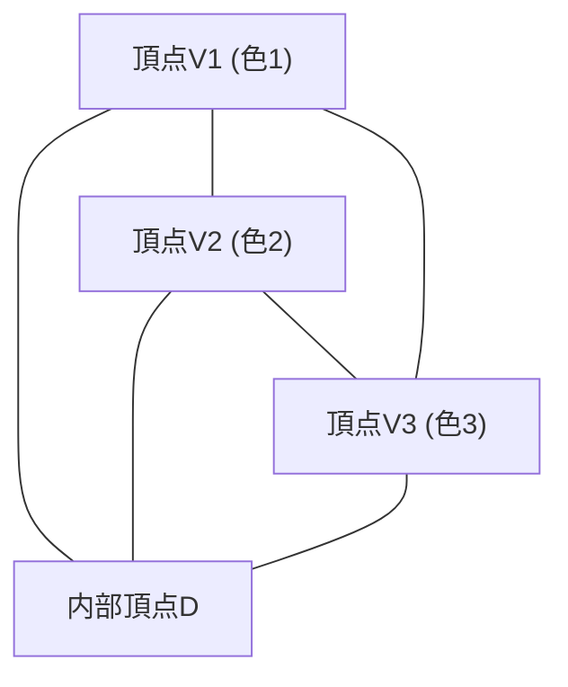

# 1. はじめに：パズルから始まる数学の神秘

数学の美しさは、しばしば極めて単純なルールから、誰も予想しなかったような深遠な結果が導かれる点にあります。その最も象徴的な例の一つが **[スペルナーの補題](https://kenji.blog/p/sperners-lemma/)** ([Sperner's Lemma](https://kenji.blog/p/sperners-lemma/)) です。1928年にドイツの数学者エマヌエル・スペルナーによって発表されたこの補題は、一見すると小学生でも理解できるような「三角形の色塗りパズル」に過ぎません。

しかし、この単純なパズルは、現代数学において極めて重要な位置を占めています。特に、位相幾何学（トポロジー）の基本定理であり、経済学におけるゲーム理論（ナッシュ均衡の存在証明）などにも応用される **ブラウワーの不動点定理** (Brouwer Fixed-Point Theorem) を、組合せ論的かつ構成的に証明するための強力な道具となるのです。

本記事では、この[スペルナーの補題](https://kenji.blog/p/sperners-lemma/)について、その直感的な意味から厳密な数学的証明、そして連続的な世界への架け橋となる不動点定理への応用までを、図解を交えながら詳細に解説します。

# 2. 単体と単体分割：幾何学の基礎

[スペルナーの補題](https://kenji.blog/p/sperners-lemma/)を理解するためには、まず **単体** (Simplex) と **単体分割** (Simplicial Complex / Triangulation) という概念を明確にしておく必要があります。

## 2.1. 単体とは何か

$n$次元の空間において、幾何学的に独立な $n+1$ 個の点があるとき、それらを頂点として構成される最小の凸集合を **$n$単体** (n-simplex) と呼びます。
- 0次元単体：点
- 1次元単体：線分
- 2次元単体：三角形
- 3次元単体：四面体

ここでは最も視覚的に理解しやすい2次元単体、すなわち「三角形」をメインに考えていきます。大きな三角形 $T$ があり、その3つの頂点を $V_1, V_2, V_3$ としましょう。

## 2.2. 単体分割（三角分割）

この大きな三角形 $T$ を、複数の小さな三角形に分割することを考えます。ただし、適当に分割してよいわけではなく、以下の条件を満たすような分割を **単体分割** (Triangulation) と呼びます。

1. 分割された小さな三角形の集合を $\mathcal{K}$ としたとき、 $\mathcal{K}$ の任意の2つの三角形が交わる場合、その交わりは「共有する頂点」または「共有する辺」のいずれかでなければならない。
2. 小さな三角形が部分的に重なったり、辺の途中に別の三角形の頂点が来るような「中途半端な接し方」は許されない。

このようにして分割された三角形のネットワークに対して、各頂点に色を塗っていくのが[スペルナーの補題](https://kenji.blog/p/sperners-lemma/)の舞台となります。

# 3. スペルナーの彩色：境界のルール

三角形 $T$ の単体分割が与えられたとします。この分割に現れる **すべての頂点** （大三角形の頂点、辺上の頂点、および内部の頂点）に対して、色を割り当てる関数 $C: V \to \{1, 2, 3\}$ を考えます。

ただし、以下の厳密な **境界のルール** (Sperner Condition) に従って色を塗らなければなりません。

1. **主頂点の彩色** ：大三角形の3つの頂点 $V_1, V_2, V_3$ は、それぞれ異なる色で塗る必要があります。例えば、 $C(V_1) = 1, C(V_2) = 2, C(V_3) = 3$ とします。
2. **辺上の頂点の彩色** ：大三角形の辺上にある頂点は、その辺の両端点と同じ色のいずれかでなければなりません。
   - 辺 $V_1V_2$ 上の頂点は、色1または色2。
   - 辺 $V_2V_3$ 上の頂点は、色2または色3。
   - 辺 $V_3V_1$ 上の頂点は、色3または色1。
3. **内部の頂点の彩色** ：大三角形の内部にある頂点は、色1、色2、色3のどれで塗っても自由です。

このルールに従った彩色を **スペルナー彩色** (Sperner Coloring) と呼びます。

# 4. [スペルナーの補題](https://kenji.blog/p/sperners-lemma/)の主張

スペルナー彩色のルールに従って色を塗り終えたとき、どのような現象が起きるでしょうか。[スペルナーの補題](https://kenji.blog/p/sperners-lemma/)は、次のような驚くべき事実を主張します。

> **[スペルナーの補題](https://kenji.blog/p/sperners-lemma/) (2次元)**
> 任意のスペルナー彩色において、3つの頂点がすべて異なる色（色1、色2、色3）で塗られた小三角形は、 **必ず奇数個存在する** 。
> 奇数個（1, 3, 5, ...）であるため、そのような「3色すべてが揃った完全な小三角形」は **少なくとも1つは必ず存在する** 。

内部の頂点をどのように意図的に塗っても、またどれほど細かく複雑に三角形を分割しても、必ず3色揃った小三角形（これを **完全三角形** と呼びましょう）がどこかに現れるのです。

# 5. グラフ理論を用いた美しい証明

この定理は、直感的には不思議に思えるかもしれませんが、「双対グラフ (Dual Graph)」と「握手補題 (Handshaking Lemma)」を用いることで、魔法のように美しく証明できます。このアプローチは「部屋とドア」のアナロジーを使うと非常に分かりやすいです。

## 5.1. 部屋とドアの定義

単体分割された各々の小三角形を「部屋」とみなします。また、大きな三角形 $T$ の外側を「屋外」と呼びましょう。
部屋と部屋、あるいは部屋と屋外を隔てるのは、小三角形の「辺（壁）」です。

ここで、特別な壁を **ドア** と定義します。
- **ドアの定義** ：両端の頂点が **色1と色2** で塗られている辺を「ドア」と呼ぶ。

各部屋（小三角形）には、いくつのドアがあるかを考えてみましょう。小三角形は3つの頂点を持つため、その色の組み合わせにより以下のケースに分類されます。

1. **色が (1, 1, 1), (2, 2, 2), (3, 3, 3) の部屋**
   - 1と2のペアを持つ辺は存在しないため、ドアは **0個** 。
2. **色が (1, 1, 2) または (1, 2, 2) の部屋**
   - 色1と色2を結ぶ辺がちょうど2つあります。したがって、ドアは **2個** 。
3. **色が (1, 3, 3) や (2, 2, 3) などの部屋**
   - 1と2のペアはないので、ドアは **0個** 。
4. **色が (1, 2, 3) の部屋（完全三角形）**
   - 色1と色2を結ぶ辺は1つだけです。したがって、ドアは **1個** 。

整理すると、 **完全三角形の部屋だけが奇数個（1個）のドアを持ち、それ以外のすべての部屋は偶数個（0個または2個）のドアを持ちます** 。

## 5.2. 外壁にあるドアの数

次に、大三角形の外周（外壁）にあるドアの数を数えます。
ドア（色1と色2の辺）が存在し得る外壁は、辺 $V_1V_2$ 上だけです。（辺 $V_2V_3$ や $V_3V_1$ には、ルールにより色1と色2の両方が現れることはありません。）

辺 $V_1V_2$ 上の頂点の色を $V_1$ から順に見ていくと、最初は色1、最後は色2です。1から2へ、あるいは2から1へ色が変わる回数は、始点と終点の色が異なるため、 **必ず奇数回** になります。
したがって、屋外に通じるドアの数は **奇数個** であることが分かります。

## 5.3. 握手補題による次数の計算

ここでグラフ理論の出番です。
- グラフの頂点：各小三角形（部屋）および屋外。
- グラフの辺：ドア（色1と色2の辺）。2つの部屋がドアを共有している場合、それらの頂点を辺で結ぶ。

グラフ理論の基本定理である「握手補題」によれば、すべての頂点の「次数（繋がっている辺の数）」の総和は、必ず偶数（辺の数の2倍）になります。

$$ \sum_{v \in V} \text{deg}(v) = 2|E| $$

私たちの作ったグラフにおいて、各頂点の次数（ドアの数）はどうなっているでしょうか。
- 屋外の次数 = 外壁のドアの数 = **奇数**
- 完全三角形の部屋の次数 = 1 = **奇数**
- それ以外の部屋の次数 = 0 または 2 = **偶数**

次数の総和を計算します。
$$ \text{総和} = \text{屋外の次数} + \text{完全三角形の次数の和} + \text{それ以外の部屋の次数の和} $$

総和は偶数でなければなりません。
屋外の次数は「奇数」、それ以外の部屋の次数の和は「偶数」です。
したがって、「完全三角形の次数の和」は **奇数** でなければ、全体の総和が偶数になりません。
完全三角形の次数はそれぞれ1なので、完全三角形の数は **奇数個** でなければならないのです。

これにより、少なくとも1つの完全三角形が存在することが完全に証明されました。

# 6. 高次元への一般化

[スペルナーの補題](https://kenji.blog/p/sperners-lemma/)は2次元の三角形に留まらず、任意の $n$ 次元単体に対しても成り立ちます。

$n$ 次元単体（例えば $n=3$ なら四面体）の場合、頂点は $n+1$ 個あり、色は $1, 2, \dots, n+1$ の $n+1$ 種類を使います。
境界条件は、「任意の $k$ 次元面（ファセット）上の頂点は、その面を構成する $k+1$ 個の頂点と同じ色しか使ってはならない」と一般化されます。

証明は数学的帰納法を用います。
- $n=1$ の場合：線分の両端が色1と色2。中間の点は1か2。1から2へ変わる場所（完全な1次元単体）は必ず奇数個。
- $n=k$ で成り立つと仮定し、 $n=k+1$ を証明する際も、先ほどと同じように「ドア（ $n$ 色の完全面）」の数を数え上げることで、見事に奇数個の $n+1$ 色の完全単体の存在が示されます。

# 7. ブラウワーの不動点定理への応用

[スペルナーの補題](https://kenji.blog/p/sperners-lemma/)がなぜそれほど重要視されるのか。それは、この離散的な定理が連続的なトポロジーの定理である **ブラウワーの不動点定理** を証明するための架け橋となるからです。

## 7.1. ブラウワーの不動点定理とは

> **ブラウワーの不動点定理**
> $n$ 次元単位球（または単体）からそれ自身への任意の連続写像 $f: D \to D$ には、必ず $f(x) = x$ となるような点 $x$ （不動点）が少なくとも1つ存在する。

コーヒーをかき混ぜてからカップを置いたとき、かき混ぜる前と全く同じ位置にあるコーヒーの粒子が必ず少なくとも1つ存在する、というような比喩で語られる有名な定理です。

## 7.2. [スペルナーの補題](https://kenji.blog/p/sperners-lemma/)からのアプローチ

[スペルナーの補題](https://kenji.blog/p/sperners-lemma/)から不動点定理を導くロジックは、非常にエレガントです。

1. **重心座標と変位ベクトルの評価**
   単体上の任意の点 $x$ に連続写像 $f$ を適用し、移動先 $f(x)$ を見ます。点 $x$ がどの方向に動いたか（重心座標のどの成分が減少したか）に基づいて、点 $x$ に色を割り当てます。
   $$ \text{例えば、} x \text{の第} i \text{成分が} f(x) \text{の第} i \text{成分より真に大きければ色} i \text{を塗る} $$
   
2. **境界条件の確認**
   この色の塗り方は、境界上では外側に移動できないという連続写像の性質から、まさにスペルナー彩色の条件を満たします。

3. **極限への移行**
   三角形をどんどん細かく単体分割していきます。それぞれの分割において、[スペルナーの補題](https://kenji.blog/p/sperners-lemma/)により、必ず3色が揃った小三角形が存在します。
   
4. **コンパクト性と収束**
   分割のサイズをゼロに近づける極限をとります。ボルツァーノ・ワイエルシュトラスの定理（コンパクト空間の点列は収束する部分列を持つ）により、この完全三角形の列は、ある1点 $x^*$ に収束します。
   
5. **不動点の特定**
   写像 $f$ は連続であるため、この極限点 $x^*$ においては「すべての成分が減少する方向」を持たなければなりませんが、重心座標の和は常に1であるため、すべての成分が減少することは不可能です。したがって、唯一の可能性は「どの成分も変化しない」、すなわち $f(x^*) = x^*$ となることだけです。これが不動点です。

# 8. その他の応用：公平な分割と経済学

不動点定理以外にも、[スペルナーの補題](https://kenji.blog/p/sperners-lemma/)は直接的に現実世界の問題に応用されます。
代表的なものが「家賃の公平な分割問題」や「ケーキ切り問題」です。

複数人で家をシェアする際、部屋の広さや条件が異なるため、誰がどの部屋をいくらで借りるかで揉めることがあります。[スペルナーの補題](https://kenji.blog/p/sperners-lemma/)を応用したアルゴリズム（Suのアルゴリズムなど）を用いると、「誰もが自分の選んだ部屋と家賃に納得し、かつ家賃の合計が元の額に一致する」という公平な割り当てが必ず存在することが証明でき、さらにそれを近似的に見つけ出すことができます。

また、経済学においてジョン・ナッシュが証明した「ナッシュ均衡の存在」も、ブラウワーや角谷の不動点定理に依存しており、その根本には[スペルナーの補題](https://kenji.blog/p/sperners-lemma/)のような組合せ論的な構造が隠れています。

# 9. おわりに

[スペルナーの補題](https://kenji.blog/p/sperners-lemma/)は、三角形の頂点をルール通りに色塗りするという、まるで遊びのような設定から出発します。しかし、その「ドアの数を数える」というシンプルな論理の中に、空間の連続性や不変性という深遠な真理が隠されていました。

離散数学と連続数学。一見全く異なる2つの世界が、このように美しい定理によって結びついていることは、数学という学問の最大の魅力の一つと言えるでしょう。読者の皆さんも、ぜひ紙とペンを取り、適当に三角形を分割して3色で塗ってみてください。そこに必ず隠れている「完全三角形」を見つけたとき、あなたも数学の神秘に触れることができるはずです。
