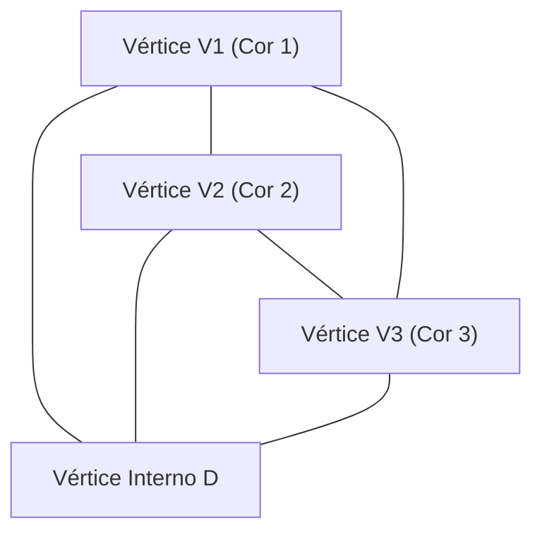

# 1. Introdução: O Mistério da Matemática a Partir de um Quebra-Cabeça

A beleza da matemática muitas vezes reside em como regras extremamente simples podem levar a resultados profundos e completamente inesperados. Um dos exemplos mais icônicos disso é o **Lema de Sperner** ([Sperner's Lemma](https://kenji.blog/pt/p/sperners-lemma/)). Publicado em 1928 pelo matemático alemão Emanuel Sperner, este lema, à primeira vista, parece não ser mais do que um "quebra-cabeça de colorir triângulos" que até mesmo um estudante do ensino fundamental poderia entender.

No entanto, este simples quebra-cabeça ocupa uma posição extremamente importante na matemática moderna. Em particular, serve como uma ferramenta poderosa para uma prova combinatória e construtiva do **Teorema do Ponto Fixo de Brouwer** (Brouwer Fixed-Point Theorem), que é um teorema fundamental na topologia e é amplamente aplicado em campos como a teoria dos jogos na economia (como na demonstração da existência do Equilíbrio de Nash).

Neste artigo, explicaremos o Lema de Sperner em detalhes com diagramas, cobrindo tudo, desde seu significado intuitivo e sua rigorosa prova matemática, até sua aplicação em teoremas de ponto fixo que servem de ponte para o mundo contínuo.

# 2. Simplexos e Complexos Simpliciais: Os Fundamentos da Geometria

Para entender o Lema de Sperner, devemos primeiro esclarecer os conceitos de um **Simplexo** (Simplex) e um **Complexo Simplicial** (Simplicial Complex / Triangulation).

## 2.1. O que é um Simplexo?

Em um espaço de $n$ dimensões, quando existem $n+1$ pontos geometricamente independentes, o menor conjunto convexo construído com eles como vértices é chamado de um **$n$-simplexo**.
- 0-simplexo: Ponto
- 1-simplexo: Segmento de reta
- 2-simplexo: Triângulo
- 3-simplexo: Tetraedro

Aqui, vamos nos concentrar principalmente no 2-simplexo, o "triângulo", que é o mais fácil de entender visualmente. Suponha que exista um grande triângulo $T$, e que seus três vértices sejam $V_1, V_2, V_3$.

## 2.2. Complexo Simplicial (Triangulação)

Vamos considerar a divisão deste grande triângulo $T$ em múltiplos triângulos menores. No entanto, você não pode dividi-lo arbitrariamente. Uma divisão que satisfaça as seguintes condições é chamada de **Triangulação**.

1. Seja $\mathcal{K}$ o conjunto de pequenos triângulos formados pela divisão. Se dois triângulos quaisquer em $\mathcal{K}$ se interceptarem, sua interseção deve ser um "vértice compartilhado" ou uma "aresta compartilhada".
2. Não são permitidas "conexões pela metade", onde pequenos triângulos se sobrepõem parcialmente ou um vértice de outro triângulo fica no meio de uma aresta.

Para a rede de triângulos dividida desta forma, colorir cada vértice prepara o terreno para o Lema de Sperner.

# 3. Coloração de Sperner: As Regras de Fronteira

Suponha que seja dada uma triangulação do triângulo $T$. Considere uma função $C: V \to \{1, 2, 3\}$ que atribui uma cor a **todos os vértices** que aparecem nesta divisão (vértices do triângulo grande, vértices nas arestas e vértices internos).

No entanto, você deve colori-los de acordo com a seguinte rigorosa **Condição de Sperner** (regras de fronteira).

1. **Coloração dos vértices principais** : Os três vértices do triângulo grande, $V_1, V_2, V_3$, devem ser cada um colorido com uma cor diferente. Por exemplo, seja $C(V_1) = 1, C(V_2) = 2, C(V_3) = 3$.
2. **Coloração dos vértices nas arestas** : Os vértices nas arestas do triângulo grande devem ser coloridos com uma das mesmas cores que os pontos finais dessa aresta.
   - Os vértices na aresta $V_1V_2$ são da cor 1 ou cor 2.
   - Os vértices na aresta $V_2V_3$ são da cor 2 ou cor 3.
   - Os vértices na aresta $V_3V_1$ são da cor 3 ou cor 1.
3. **Coloração dos vértices internos** : Os vértices dentro do triângulo grande podem ser coloridos livremente com qualquer uma das cores 1, 2 ou 3.

Uma coloração que segue estas regras é chamada de **Coloração de Sperner** (Sperner Coloring).

# 4. A Afirmação do Lema de Sperner

Quando você termina de colorir de acordo com as regras da coloração de Sperner, que fenômeno ocorre? [O Lema de Sperner](https://kenji.blog/pt/p/sperners-lemma/) afirma o seguinte fato surpreendente.

> **Lema de Sperner (2D)**
> Em qualquer coloração de Sperner, o número de pequenos triângulos onde os três vértices são pintados com cores diferentes (cor 1, cor 2 e cor 3) **deve ser um número ímpar**.
> Como é um número ímpar (1, 3, 5, ...), tal "pequeno triângulo completo com as 3 cores" **deve existir pelo menos uma vez**.

Não importa quão intencionalmente você colora os vértices internos, ou quão fina e complexamente você divida o triângulo, um pequeno triângulo com as 3 cores (vamos chamá-lo de **Triângulo Completo**) aparecerá definitivamente em algum lugar.

# 5. Uma Bela Prova Usando a Teoria dos Grafos

Este teorema pode parecer mágico intuitivamente, mas pode ser provado lindamente usando os conceitos de "Grafo Dual" e o "Lema do Aperto de Mãos". Esta abordagem é muito fácil de entender se usarmos a analogia de "salas e portas".

## 5.1. Definição de Salas e Portas

Considere cada pequeno triângulo triangulado como uma "sala". Além disso, vamos chamar o exterior do triângulo grande $T$ de "exterior".
O que separa uma sala de outra sala, ou uma sala do exterior, é a "aresta" (parede) do pequeno triângulo.

Aqui, definimos uma parede especial como uma **porta**.
- **Definição de porta** : Uma aresta cujos extremos são coloridos com **Cor 1 e Cor 2** é chamada de "porta".

Vamos considerar quantas portas cada sala (pequeno triângulo) tem. Como um pequeno triângulo tem três vértices, ele é classificado nos seguintes casos com base em combinações de cores.

1. **Salas com cores (1, 1, 1), (2, 2, 2), (3, 3, 3)**
   - Como não há arestas com um par de 1 e 2, há **0 portas** .
2. **Salas com cores (1, 1, 2) ou (1, 2, 2)**
   - Existem exatamente duas arestas conectando a cor 1 e a cor 2. Portanto, há **2 portas** .
3. **Salas com cores (1, 3, 3) ou (2, 2, 3) etc.**
   - Como não há par de 1 e 2, há **0 portas** .
4. **Salas com cores (1, 2, 3) (Triângulo Completo)**
   - Há apenas uma aresta conectando a cor 1 e a cor 2. Portanto, há **1 porta** .

Resumindo, **apenas as salas dos triângulos completos têm um número ímpar (1) de portas, e todas as outras salas têm um número par (0 ou 2) de portas** .

## 5.2. Número de Portas na Parede Externa

A seguir, contamos o número de portas no perímetro externo (parede externa) do triângulo grande.
A parede externa onde portas (arestas de cor 1 e 2) podem existir está apenas na aresta $V_1V_2$. (As cores 1 e 2 nunca aparecerão juntas nas arestas $V_2V_3$ ou $V_3V_1$ devido às regras).

Se observarmos as cores dos vértices na aresta $V_1V_2$ sequencialmente a partir de $V_1$, a primeira é a cor 1 e a última é a cor 2. O número de vezes que a cor muda de 1 para 2, ou de 2 para 1, **deve ser um número ímpar** porque o ponto de partida e o ponto final têm cores diferentes.
Portanto, está claro que o número de portas que levam ao exterior é um **número ímpar** .

## 5.3. Calculando Graus Usando o Lema do Aperto de Mãos

É aqui que a teoria dos grafos entra.
- Vértices do grafo: Cada pequeno triângulo (sala) e o exterior.
- Arestas do grafo: Portas (arestas de cor 1 e 2). Quando duas salas compartilham uma porta, conecte seus vértices com uma aresta.

De acordo com o "Lema do Aperto de Mãos", um teorema fundamental na teoria dos grafos, a soma dos "graus" (número de arestas conectadas) de todos os vértices deve ser sempre um número par (o dobro do número de arestas).

$$ \sum_{v \in V} \text{deg}(v) = 2|E| $$

No grafo que criamos, quais são os graus (número de portas) de cada vértice?
- Grau do exterior = Número de portas na parede externa = **Número ímpar**
- Grau das salas de triângulos completos = 1 = **Número ímpar**
- Grau das outras salas = 0 ou 2 = **Número par**

Vamos calcular a soma total dos graus.
$$ \text{Soma Total} = \text{Grau do Exterior} + \text{Soma dos Graus dos Triângulos Completos} + \text{Soma dos Graus das Outras Salas} $$

A soma total deve ser um número par.
O grau do exterior é "ímpar", e a soma dos graus das outras salas é "par".
Portanto, a "Soma dos Graus dos Triângulos Completos" **deve ser um número ímpar** para que a soma total seja par.
Como o grau de cada triângulo completo é 1, o número de triângulos completos **deve ser um número ímpar** .

Com isso, fica perfeitamente provado que existe pelo menos um triângulo completo.

# 6. Generalização para Dimensões Superiores

[O Lema de Sperner](https://kenji.blog/pt/p/sperners-lemma/) não se limita a triângulos 2D, mas é válido para qualquer simplexo $n$-dimensional.

No caso de um simplexo $n$-dimensional (por exemplo, um tetraedro para $n=3$), há $n+1$ vértices, e usamos $n+1$ cores, $1, 2, \dots, n+1$.
A condição de fronteira é generalizada da seguinte forma: "Os vértices em qualquer face $k$-dimensional (faceta) devem usar apenas as mesmas cores que os $k+1$ vértices que constituem essa face."

A prova usa indução matemática.
- Para $n=1$: Os pontos finais do segmento de reta são da cor 1 e cor 2. Os pontos intermediários são 1 ou 2. O número de lugares onde muda de 1 para 2 (1-simplexo completo) é sempre ímpar.
- Assumindo que se mantém para $n=k$, ao provar para $n=k+1$, contamos o número de "portas" (faces completas de $n$ cores) da mesma maneira que antes, o que mostra brilhantemente a existência de um número ímpar de simplexos completos de $n+1$ cores.

# 7. Aplicação ao Teorema do Ponto Fixo de Brouwer

Por que o Lema de Sperner é considerado tão importante? É porque este teorema discreto atua como uma ponte para provar um teorema topológico contínuo, o **Teorema do Ponto Fixo de Brouwer**.

## 7.1. O que é o Teorema do Ponto Fixo de Brouwer?

> **Teorema do Ponto Fixo de Brouwer**
> Qualquer mapeamento contínuo $f: D \to D$ de uma bola unitária $n$-dimensional (ou simplexo) para si mesma deve ter pelo menos um ponto $x$ (ponto fixo) tal que $f(x) = x$.

Este é um famoso teorema que muitas vezes é explicado com a metáfora: quando você mexe o seu café e abaixa a xícara, há sempre pelo menos uma partícula de café que está exatamente na mesma posição em que estava antes de você começar a mexer.

## 7.2. Abordagem a partir do Lema de Sperner

A lógica de derivar o teorema do ponto fixo a partir do Lema de Sperner é muito elegante.

1. **Avaliação de Coordenadas Baricêntricas e Vetores de Deslocamento**
   Aplique o mapeamento contínuo $f$ a um ponto arbitrário $x$ no simplexo e observe o destino $f(x)$. Atribua uma cor ao ponto $x$ com base na direção na qual ele se moveu (qual componente das coordenadas baricêntricas diminuiu).
   $$ \text{Por exemplo, se a } i \text{-ésima componente de } x \text{ for estritamente maior que a } i \text{-ésima componente de } f(x) \text{, pinte-o da cor } i $$
   
2. **Verificação das Condições de Fronteira**
   Devido à natureza do mapeamento contínuo, onde você não pode se mover para fora nas fronteiras, esse método de coloração satisfaz exatamente as condições da coloração de Sperner.

3. **Transição para o Limite**
   Triangulamos o triângulo de forma cada vez mais fina. Em cada triangulação, pelo Lema de Sperner, sempre há um pequeno triângulo onde todas as 3 cores estão presentes.
   
4. **Compacidade e Convergência**
   Tomamos o limite à medida que o tamanho da divisão se aproxima de zero. Pelo Teorema de Bolzano-Weierstrass (uma sequência em um espaço compacto possui uma subsequência convergente), essa sequência de triângulos completos converge para um único ponto $x^*$.
   
5. **Identificação do Ponto Fixo**
   Como o mapeamento $f$ é contínuo, neste ponto limite $x^*$, ele deve ter uma "direção onde todas as componentes diminuem", mas como a soma das coordenadas baricéntricas é sempre 1, é impossível que todas as componentes diminuam. Portanto, a única possibilidade é que "nenhuma componente mude", ou seja, $f(x^*) = x^*$. Este é o ponto fixo.

# 8. Outras Aplicações: Divisão Justa e Economia

Além do teorema do ponto fixo, o Lema de Sperner é aplicado diretamente a problemas do mundo real.
Exemplos típicos são o "problema da divisão justa do aluguel" e o "problema do corte de bolo".

Quando várias pessoas compartilham uma casa, podem surgir conflitos sobre quem aluga qual quarto e por quanto, porque o tamanho e as condições dos quartos variam. Usando algoritmos aplicando o Lema de Sperner (como o algoritmo de Su), pode ser provado que sempre existe uma alocação justa onde "todos estão satisfeitos com seu quarto e aluguel escolhidos, e a soma dos aluguéis corresponde ao valor original", e além disso, isso pode ser encontrado aproximadamente.

Além disso, a "existência do Equilíbrio de Nash" provada por John Nash na economia depende dos teoremas do ponto fixo de Brouwer ou Kakutani, escondendo fundamentalmente estruturas combinatórias como o Lema de Sperner.

# 9. Conclusão

[O Lema de Sperner](https://kenji.blog/pt/p/sperners-lemma/) começa com uma configuração quase parecida com um jogo de colorir os vértices de um triângulo de acordo com as regras. No entanto, dentro dessa simples lógica de "contar o número de portas", ocultavam-se verdades profundas sobre a continuidade e invariância do espaço.

Matemática discreta e matemática contínua. O fato de esses dois mundos aparentemente completamente diferentes estarem conectados por um teorema tão belo é, indiscutivelmente, um dos maiores atrativos da matemática como disciplina. Incentivamos os leitores a pegar papel e caneta, dividir um triângulo arbitrariamente e pintá-lo de 3 cores. Quando você encontrar o "triângulo completo" que sempre se esconde lá, você também deverá ser capaz de tocar o mistério da matemática.
