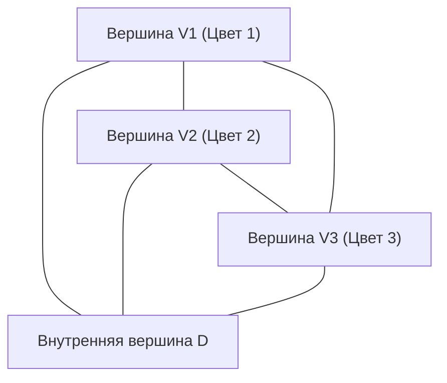

# 1. Введение: Тайна математики, начинающаяся с головоломки

Красота математики часто заключается в том, как чрезвычайно простые правила могут приводить к глубоким и совершенно неожиданным результатам. Одним из самых знаковых примеров этого является **[Лемма Шпернера](https://kenji.blog/ru/p/sperners-lemma/)** ([Sperner's Lemma](https://kenji.blog/ru/p/sperners-lemma/)). Опубликованная в 1928 году немецким математиком Эмануэлем Шпернером, эта лемма на первый взгляд кажется не более чем «головоломкой с раскрашиванием треугольников», которую мог бы понять даже ученик начальной школы.

Однако эта простая головоломка занимает чрезвычайно важное место в современной математике. В частности, она служит мощным инструментом для комбинаторного и конструктивного доказательства **Теоремы Брауэра о неподвижной точке** (Brouwer Fixed-Point Theorem), которая является фундаментальной теоремой в топологии и широко применяется в таких областях, как теория игр в экономике (например, при доказательстве существования равновесия Нэша).

В этой статье мы подробно объясним лемму Шпернера с диаграммами, охватывая все: от ее интуитивного смысла и строгого математического доказательства до ее применения к теоремам о неподвижной точке, которые служат мостом в непрерывный мир.

# 2. Симплексы и симплициальные комплексы: Основы геометрии

Чтобы понять лемму Шпернера, мы должны сначала прояснить концепции **Симплекса** (Simplex) и **Симплициального комплекса** (Simplicial Complex / Triangulation).

## 2.1. Что такое симплекс?

В $n$-мерном пространстве, когда имеется $n+1$ геометрически независимых точек, наименьшее выпуклое множество, построенное с ними в качестве вершин, называется **$n$-симплексом**.
- 0-симплекс: Точка
- 1-симплекс: Отрезок прямой
- 2-симплекс: Треугольник
- 3-симплекс: Тетраэдр

Здесь мы в основном сосредоточимся на 2-симплексе, «треугольнике», который легче всего понять визуально. Предположим, есть большой треугольник $T$, и пусть его три вершины будут $V_1, V_2, V_3$.

## 2.2. Симплициальный комплекс (Триангуляция)

Рассмотрим разбиение этого большого треугольника $T$ на множество меньших треугольников. Однако вы не можете разделить его произвольно. Разбиение, удовлетворяющее следующим условиям, называется **Триангуляцией**.

1. Пусть $\mathcal{K}$ — множество маленьких треугольников, образованных разбиением. Если любые два треугольника в $\mathcal{K}$ пересекаются, их пересечением должна быть «общая вершина» или «общее ребро».
2. «Половинчатые соединения», где маленькие треугольники частично перекрываются или когда вершина другого треугольника находится посередине ребра, не допускаются.

Для сети треугольников, разделенной таким образом, раскраска каждой вершины подготавливает почву для леммы Шпернера.

# 3. Раскраска Шпернера: Граничные правила

Предположим, задана триангуляция треугольника $T$. Рассмотрим функцию $C: V \to \{1, 2, 3\}$, которая назначает цвет **всем вершинам**, появляющимся в этом разбиении (вершинам большого треугольника, вершинам на ребрах и внутренним вершинам).

Однако вы должны раскрасить их в соответствии со следующим строгим **Условием Шпернера** (граничными правилами).

1. **Раскраска главных вершин** : Три вершины большого треугольника, $V_1, V_2, V_3$, должны быть раскрашены в разные цвета. Например, пусть $C(V_1) = 1, C(V_2) = 2, C(V_3) = 3$.
2. **Раскраска вершин на ребрах** : Вершины на ребрах большого треугольника должны быть раскрашены в один из тех же цветов, что и конечные точки этого ребра.
   - Вершины на ребре $V_1V_2$ имеют цвет 1 или цвет 2.
   - Вершины на ребре $V_2V_3$ имеют цвет 2 или цвет 3.
   - Вершины на ребре $V_3V_1$ имеют цвет 3 или цвет 1.
3. **Раскраска внутренних вершин** : Вершины внутри большого треугольника могут быть свободно раскрашены в любой из цветов 1, 2 или 3.

Раскраска, которая следует этим правилам, называется **Раскраской Шпернера** (Sperner Coloring).

# 4. Утверждение леммы Шпернера

Когда вы заканчиваете раскраску в соответствии с правилами раскраски Шпернера, какое явление происходит? [Лемма Шпернера](https://kenji.blog/ru/p/sperners-lemma/) утверждает следующий поразительный факт.

> **[Лемма Шпернера](https://kenji.blog/ru/p/sperners-lemma/) (2D)**
> В любой раскраске Шпернера количество маленьких треугольников, в которых все три вершины окрашены в разные цвета (цвет 1, цвет 2 и цвет 3), **должно быть нечетным числом**.
> Поскольку это нечетное число (1, 3, 5, ...), такой «полный маленький треугольник со всеми 3 цветами» **должен существовать по крайней мере один раз**.

Независимо от того, насколько намеренно вы раскрашиваете внутренние вершины или насколько тонко и сложно вы разбиваете треугольник, маленький треугольник со всеми 3 цветами (назовем его **Полным треугольником**) обязательно где-нибудь появится.

# 5. Красивое доказательство с использованием теории графов

Эта теорема может казаться магической интуитивно, но ее можно прекрасно доказать, используя концепции «Двойственного графа» и «Леммы о рукопожатиях». Этот подход очень легко понять, если использовать аналогию «комнат и дверей».

## 5.1. Определение комнат и дверей

Считайте каждый триангулированный маленький треугольник «комнатой». Кроме того, давайте назовем пространство за пределами большого треугольника $T$ «улицей».
То, что отделяет комнату от другой комнаты или комнату от улицы, — это «ребро» (стена) маленького треугольника.

Здесь мы определяем особую стену как **дверь**.
- **Определение двери** : Ребро, концы которого раскрашены в **Цвет 1 и Цвет 2**, называется «дверью».

Давайте посчитаем, сколько дверей в каждой комнате (маленьком треугольнике). Поскольку у маленького треугольника три вершины, он классифицируется на следующие случаи в зависимости от комбинаций цветов.

1. **Комнаты с цветами (1, 1, 1), (2, 2, 2), (3, 3, 3)**
   - Поскольку нет ребер с парой 1 и 2, имеется **0 дверей** .
2. **Комнаты с цветами (1, 1, 2) или (1, 2, 2)**
   - Имеется ровно два ребра, соединяющих цвет 1 и цвет 2. Следовательно, имеется **2 двери** .
3. **Комнаты с цветами (1, 3, 3) или (2, 2, 3) и т. д.**
   - Поскольку нет пары 1 и 2, имеется **0 дверей** .
4. **Комнаты с цветами (1, 2, 3) (Полный треугольник)**
   - Есть только одно ребро, соединяющее цвет 1 и цвет 2. Следовательно, имеется **1 дверь** .

Подводя итог, **только комнаты полных треугольников имеют нечетное (1) количество дверей, а все остальные комнаты имеют четное (0 или 2) количество дверей** .

## 5.2. Количество дверей на внешней стене

Далее мы считаем количество дверей на внешнем периметре (внешней стене) большого треугольника.
Внешняя стена, где могут существовать двери (ребра цвета 1 и 2), находится только на ребре $V_1V_2$. (Цвета 1 и 2 никогда не появятся вместе на ребрах $V_2V_3$ или $V_3V_1$ из-за правил).

Если мы посмотрим на цвета вершин на ребре $V_1V_2$ последовательно от $V_1$, первый цвет — 1, а последний — 2. Количество раз, когда цвет меняется с 1 на 2 или с 2 на 1, **должно быть нечетным числом**, потому что начальная и конечная точки имеют разные цвета.
Следовательно, ясно, что количество дверей, ведущих на улицу, является **нечетным числом** .

## 5.3. Вычисление степеней с использованием леммы о рукопожатиях

Здесь вступает в игру [теория графов](/ru/p/graph-theory-dijkstra-a-star/).
- Вершины графа: Каждый маленький треугольник (комната) и улица.
- Ребра графа: Двери (ребра цвета 1 и 2). Когда две комнаты имеют общую дверь, соедините их вершины ребром.

Согласно «Лемме о рукопожатиях», фундаментальной теореме в теории графов, сумма «степеней» (количества соединенных ребер) всех вершин всегда должна быть четным числом (вдвое больше количества ребер).

$$ \sum_{v \in V} \text{deg}(v) = 2|E| $$

В созданном нами графе каковы степени (количество дверей) каждой вершины?
- Степень улицы = Количество дверей на внешней стене = **Нечетное число**
- Степень комнат полных треугольников = 1 = **Нечетное число**
- Степень других комнат = 0 или 2 = **Четное число**

Давайте вычислим общую сумму степеней.
$$ \text{Общая сумма} = \text{Степень улицы} + \text{Сумма степеней полных треугольников} + \text{Сумма степеней других комнат} $$

Общая сумма должна быть четным числом.
Степень улицы «нечетная», а сумма степеней других комнат «четная».
Поэтому «Сумма степеней полных треугольников» **должна быть нечетным числом**, чтобы общая сумма была четной.
Поскольку степень каждого полного треугольника равна 1, количество полных треугольников **должно быть нечетным числом** .

Таким образом, прекрасно доказано, что существует как минимум один полный треугольник.

# 6. Обобщение на высшие размерности

[Лемма Шпернера](https://kenji.blog/ru/p/sperners-lemma/) не ограничивается двумерными треугольниками, а справедлива для любого $n$-мерного симплекса.

В случае $n$-мерного симплекса (например, тетраэдра для $n=3$) имеется $n+1$ вершин, и мы используем $n+1$ цветов, $1, 2, \dots, n+1$.
Граничное условие обобщается следующим образом: «Вершины на любой $k$-мерной грани (фасете) должны использовать только те же цвета, что и $k+1$ вершин, составляющих эту грань».

Доказательство использует математическую индукцию.
- Для $n=1$: Концы отрезка прямой имеют цвет 1 и цвет 2. Промежуточные точки — 1 или 2. Количество мест, где он меняется с 1 на 2 (полный 1-симплекс), всегда нечетно.
- Предполагая, что это выполняется для $n=k$, при доказательстве для $n=k+1$ мы считаем количество «дверей» (полных граней из $n$ цветов) тем же способом, что и раньше, что блестяще показывает существование нечетного количества полных симплексов из $n+1$ цветов.

# 7. Применение к теореме Брауэра о неподвижной точке

Почему лемма Шпернера считается такой важной? Это потому, что эта дискретная теорема действует как мост для доказательства непрерывной топологической теоремы, **Теоремы Брауэра о неподвижной точке**.

## 7.1. Что такое теорема Брауэра о неподвижной точке?

> **Теорема Брауэра о неподвижной точке**
> Любое непрерывное отображение $f: D \to D$ из $n$-мерного единичного шара (или симплекса) в себя должно иметь по крайней мере одну точку $x$ (неподвижную точку) такую, что $f(x) = x$.

Это знаменитая теорема, которая часто объясняется метафорой: когда вы размешиваете свой кофе и ставите чашку, всегда есть как минимум одна частица кофе, которая находится точно в том же положении, что и до того, как вы начали размешивать.

## 7.2. Подход из леммы Шпернера

Логика вывода теоремы о неподвижной точке из леммы Шпернера очень элегантна.

1. **Оценка барицентрических координат и векторов смещения**
   Примените непрерывное отображение $f$ к произвольной точке $x$ на симплексе и посмотрите на место назначения $f(x)$. Назначьте цвет точке $x$ на основе направления, в котором она сместилась (какая компонента барицентрических координат уменьшилась).
   $$ \text{Например, если } i \text{-я компонента } x \text{ строго больше } i \text{-й компоненты } f(x) \text{, покрасьте ее в цвет } i $$
   
2. **Проверка граничных условий**
   Из-за природы непрерывного отображения, где вы не можете выйти наружу на границах, этот метод раскраски в точности удовлетворяет условиям раскраски Шпернера.

3. **Переход к пределу**
   Мы триангулируем треугольник все тоньше и тоньше. В каждой триангуляции, согласно лемме Шпернера, всегда есть маленький треугольник, в котором присутствуют все 3 цвета.
   
4. **Компактность и сходимость**
   Мы переходим к пределу, когда размер разбиения приближается к нулю. Согласно теореме Больцано-Вейерштрасса (последовательность в компактном пространстве имеет сходящуюся подпоследовательность), эта последовательность полных треугольников сходится к единственной точке $x^*$.
   
5. **Определение неподвижной точки**
   Поскольку отображение $f$ непрерывно, в этой предельной точке $x^*$ оно должно иметь «направление, где все компоненты уменьшаются», но поскольку сумма барицентрических координат всегда равна 1, невозможно, чтобы все компоненты уменьшились. Следовательно, единственная возможность — «никакая компонента не меняется», то есть $f(x^*) = x^*$. Это и есть неподвижная точка.

# 8. Другие применения: Справедливое разделение и экономика

Помимо теоремы о неподвижной точке, лемма Шпернера применяется непосредственно к проблемам реального мира.
Типичными примерами являются «задача о справедливом разделении арендной платы» и «задача о разрезании торта».

Когда несколько человек живут в одном доме, могут возникнуть конфликты по поводу того, кто снимает какую комнату и за сколько, потому что размер и условия комнат различаются. Используя алгоритмы, применяющие лемму Шпернера (например, алгоритм Су), можно доказать, что всегда существует справедливое распределение, при котором «каждый удовлетворен выбранной комнатой и арендной платой, а сумма арендной платы совпадает с исходной суммой», и, более того, его можно найти приближенно.

Также «существование равновесия Нэша», доказанное Джоном Нэшем в экономике, зависит от теорем Брауэра или Какутани о неподвижной точке, фундаментально скрывая комбинаторные структуры, подобные лемме Шпернера.

# 9. Заключение

[Лемма Шпернера](https://kenji.blog/ru/p/sperners-lemma/) начинается с почти похожей на игру установки раскрашивания вершин треугольника по правилам. Однако внутри этой простой логики «подсчета количества дверей» скрывались глубокие истины о непрерывности и инвариантности пространства.

Дискретная математика и непрерывная математика. Тот факт, что эти два, казалось бы, совершенно разных мира связаны такой красивой теоремой, возможно, является одной из самых больших привлекательностей математики как дисциплины. Мы призываем читателей взять бумагу и ручку, произвольно разбить треугольник и раскрасить его в 3 цвета. Когда вы найдете «полный треугольник», который всегда там прячется, вы также сможете прикоснуться к тайне математики.
