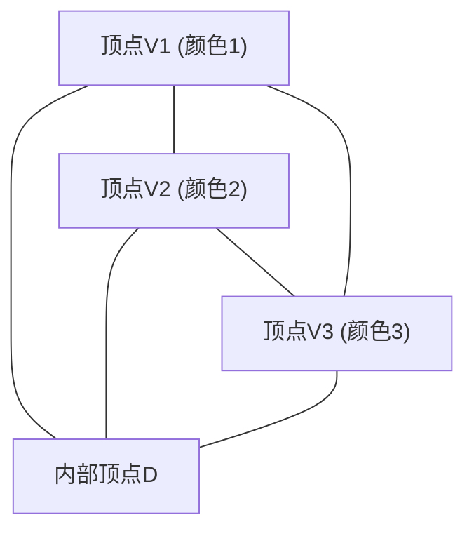

# 1. 引言：始于拼图的数学奥秘

数学之美常常在于：极其简单的规则却能推导出无人预料的深奥结果。“ **[斯佩纳引理](https://kenji.blog/zh-cn/p/sperners-lemma/)** ([Sperner's Lemma](https://kenji.blog/zh-cn/p/sperners-lemma/))”就是其中最具代表性的例子之一。这个由德国数学家埃马努埃尔·斯佩纳（Emanuel Sperner）于1928年发表的引理，乍看之下不过是一个连小学生都能看懂的“三角形着色拼图”。

然而，这个简单的拼图在现代数学中占据着极其重要的地位。特别是在拓扑学中，它是用来组合化、构造性地证明 **布劳威尔不动点定理** (Brouwer Fixed-Point Theorem) 的强大工具，该定理也是经济学中博弈论（如纳什均衡的存在性证明）等领域的基础。

在本文中，我们将结合图解，详细解释[斯佩纳引理](https://kenji.blog/zh-cn/p/sperners-lemma/)：从其直观含义、严密的数学证明，到其作为通往连续世界的桥梁在不动点定理中的应用。

# 2. 单形与单纯复形：几何学基础

为了理解[斯佩纳引理](https://kenji.blog/zh-cn/p/sperners-lemma/)，我们首先需要明确“ **单形** (Simplex)”和“ **单纯复形** (Simplicial Complex / Triangulation)”的概念。

## 2.1. 什么是单形？

在 $n$ 维空间中，当有 $n+1$ 个几何上独立的点时，以它们为顶点构成的最小凸集被称为 **$n$维单形** (n-simplex)。
- 0维单形：点
- 1维单形：线段
- 2维单形：三角形
- 3维单形：四面体

这里我们将主要讨论最容易直观理解的2维单形，即“三角形”。假设有一个大三角形 $T$，其三个顶点为 $V_1, V_2, V_3$。

## 2.2. 单纯复形（三角剖分）

我们考虑将这个大三角形 $T$ 分割成多个小三角形。但是，不能随意分割，满足以下条件的分割称为 **三角剖分** (Triangulation)。

1. 假设分割后的小三角形集合为 $\mathcal{K}$，如果 $\mathcal{K}$ 中的任意两个三角形相交，其交集必须是“共享的顶点”或“共享的边”。
2. 不允许出现“半途相接”的情况，即小三角形部分重叠，或者另一个三角形的顶点落在某条边的中间。

对于这样分割成的三角形网络，为每个顶点着色，便构成了[斯佩纳引理](https://kenji.blog/zh-cn/p/sperners-lemma/)的舞台。

# 3. 斯佩纳着色：边界规则

假设给定了三角形 $T$ 的三角剖分。考虑一个函数 $C: V \to \{1, 2, 3\}$，为出现在这个剖分中的 **所有顶点**（大三角形的顶点、边上的顶点以及内部顶点）分配颜色。

但是，必须严格按照以下 **边界规则** (Sperner Condition) 进行着色。

1. **主顶点的着色** ：大三角形的三个顶点 $V_1, V_2, V_3$ 必须分别涂上不同的颜色。例如，令 $C(V_1) = 1, C(V_2) = 2, C(V_3) = 3$。
2. **边上顶点的着色** ：大三角形边上的顶点，必须涂上与该边两个端点颜色相同的颜色之一。
   - 边 $V_1V_2$ 上的顶点，颜色为1或2。
   - 边 $V_2V_3$ 上的顶点，颜色为2或3。
   - 边 $V_3V_1$ 上的顶点，颜色为3或1。
3. **内部顶点的着色** ：大三角形内部的顶点，可以自由涂上颜色1、2或3中的任意一种。

遵循此规则的着色被称为 **斯佩纳着色** (Sperner Coloring)。

# 4. [斯佩纳引理](https://kenji.blog/zh-cn/p/sperners-lemma/)的结论

当按照斯佩纳着色的规则完成着色后，会发生什么现象呢？[斯佩纳引理](https://kenji.blog/zh-cn/p/sperners-lemma/)提出了以下令人惊叹的事实。

> **[斯佩纳引理](https://kenji.blog/zh-cn/p/sperners-lemma/) (二维)**
> 在任意的斯佩纳着色中，三个顶点全被涂上不同颜色（颜色1、颜色2、颜色3）的小三角形， **必然存在奇数个** 。
> 因为是奇数个（1, 3, 5, ...），所以这种“集齐了3种颜色的完整小三角形” **至少必然存在一个** 。

无论你如何刻意地为内部顶点着色，也无论你将三角形分割得多么细密复杂，集齐3种颜色的小三角形（我们称之为 **完整三角形** ）一定会在某处出现。

# 5. 使用图论的优美证明

这个定理在直观上可能显得不可思议，但通过使用“对偶图 (Dual [Graph](https://kenji.blog/zh-cn/p/tree-graph-data-structures-search-dfs-bfs-dijkstra/))”和“握手引理 (Handshaking Lemma)”，可以像变魔术一样优美地证明它。如果使用“房间与门”的比喻，这种方法将非常容易理解。

## 5.1. 房间与门的定义

将三角剖分后的每个小三角形视为一个“房间”。同时，将大三角形 $T$ 的外部称为“室外”。
隔开房间与房间、或房间与室外的，是小三角形的“边（墙壁）”。

在这里，我们将一种特殊的墙壁定义为 **门** 。
- **门的定义** ：两端顶点分别涂有 **颜色1和颜色2** 的边称为“门”。

让我们考虑一下每个房间（小三角形）有几扇门。因为小三角形有三个顶点，根据其颜色组合可分为以下情况：

1. **颜色为 (1, 1, 1), (2, 2, 2), (3, 3, 3) 的房间**
   - 因为不存在包含1和2的边，所以有 **0扇门** 。
2. **颜色为 (1, 1, 2) 或 (1, 2, 2) 的房间**
   - 恰好有两条边连接颜色1和颜色2。因此，有 **2扇门** 。
3. **颜色为 (1, 3, 3) 或 (2, 2, 3) 等的房间**
   - 因为没有1和2的配对，所以有 **0扇门** 。
4. **颜色为 (1, 2, 3) 的房间（完整三角形）**
   - 只有一条边连接颜色1和颜色2。因此，有 **1扇门** 。

总结一下， **只有完整三角形的房间拥有奇数（1扇）门，而其他所有房间都拥有偶数（0扇或2扇）门** 。

## 5.2. 外墙上的门数

接下来，我们计算大三角形外围（外墙）上的门数。
能够存在门（颜色1和2的边）的外墙，只有在边 $V_1V_2$ 上。（根据规则，边 $V_2V_3$ 或 $V_3V_1$ 上永远不会同时出现颜色1和颜色2。）

如果我们从 $V_1$ 开始顺次观察边 $V_1V_2$ 上顶点的颜色，最开始是颜色1，最后是颜色2。从1变为2，或者从2变为1的次数，因为起点和终点颜色不同， **必然是奇数次** 。
因此，通向室外的门的数量是 **奇数个** 。

## 5.3. 利用握手引理计算度数

现在轮到图论出场了。
- 图的顶点：每个小三角形（房间）以及室外。
- 图的边：门（颜色1和2的边）。如果两个房间共享一扇门，则用边连接它们的顶点。

根据图论的基本定理“握手引理”，所有顶点的“度数（相连的边数）”之和，必定是偶数（边数的2倍）。

$$ \sum_{v \in V} \text{deg}(v) = 2|E| $$

在我们构建的图中，各个顶点的度数（门的数量）是怎样的呢？
- 室外的度数 = 外墙的门数 = **奇数**
- 完整三角形房间的度数 = 1 = **奇数**
- 其他房间的度数 = 0 或 2 = **偶数**

我们计算度数的总和。
$$ \text{总和} = \text{室外的度数} + \text{完整三角形的度数之和} + \text{其他房间的度数之和} $$

总和必须是偶数。
室外的度数是“奇数”，其他房间的度数之和是“偶数”。
因此，为了使整体总和为偶数，“完整三角形的度数之和” **必须是奇数** 。
由于每个完整三角形的度数都是1，所以完整三角形的数量 **必然是奇数个** 。

至此，完美地证明了至少存在一个完整三角形。

# 6. 向高维的推广

[斯佩纳引理](https://kenji.blog/zh-cn/p/sperners-lemma/)不仅局限于二维的三角形，对于任意的 $n$ 维单形同样成立。

在 $n$ 维单形（例如 $n=3$ 时的四面体）的情况下，有 $n+1$ 个顶点，并使用 $1, 2, \dots, n+1$ 的 $n+1$ 种颜色。
边界条件被推广为：“任意 $k$ 维面（facet）上的顶点，只能使用构成该面的 $k+1$ 个顶点的颜色”。

证明采用数学归纳法。
- $n=1$ 的情况：线段两端是颜色1和颜色2。中间的点是1或2。从1变为2的地方（完整的一维单形）必然有奇数个。
- 假设在 $n=k$ 时成立，在证明 $n=k+1$ 时，通过与之前同样的方式计算“门（包含 $n$ 种颜色的完整面）”的数量，便能奇妙地证明存在奇数个 $n+1$ 种颜色的完整单形。

# 7. 在布劳威尔不动点定理中的应用

为什么[斯佩纳引理](https://kenji.blog/zh-cn/p/sperners-lemma/)受到如此高的重视呢？这是因为这个离散定理成为了证明连续拓扑学定理—— **布劳威尔不动点定理** ——的桥梁。

## 7.1. 什么是布劳威尔不动点定理

> **布劳威尔不动点定理**
> 对于从 $n$ 维单位球（或单形）到其自身的任意连续映射 $f: D \to D$，必然至少存在一个点 $x$ （不动点）使得 $f(x) = x$。

这个著名的定理常被这样一个比喻来解释：当你搅拌完咖啡并放下杯子时，必然至少有一颗咖啡粒子的位置与搅拌前完全相同。

## 7.2. 从[斯佩纳引理](https://kenji.blog/zh-cn/p/sperners-lemma/)的推导路径

从[斯佩纳引理](https://kenji.blog/zh-cn/p/sperners-lemma/)推导不动点定理的逻辑非常优雅。

1. **重心坐标与位移向量的评估**
   对单形上的任意点 $x$ 应用连续映射 $f$，观察其移动后的位置 $f(x)$。根据点 $x$ 移动的方向（重心坐标的哪个分量减小了），为点 $x$ 分配颜色。
   $$ \text{例如，如果 } x \text{ 的第 } i \text{ 个分量严格大于 } f(x) \text{ 的第 } i \text{ 个分量，则涂上颜色 } i $$
   
2. **确认边界条件**
   由于连续映射的性质决定了点不能移动到边界之外，这种着色方法恰好满足斯佩纳着色的条件。

3. **向极限过渡**
   将三角形不断地进行更细密的三角剖分。在每一次剖分中，根据[斯佩纳引理](https://kenji.blog/zh-cn/p/sperners-lemma/)，必然存在集齐了3种颜色的小三角形。
   
4. **紧致性与收敛**
   取剖分尺寸趋近于零的极限。根据波尔查诺-魏尔斯特拉斯定理（紧致空间中的点列存在收敛子列），这个完整三角形的序列将收敛于某一点 $x^*$。
   
5. **确定不动点**
   由于映射 $f$ 是连续的，在这个极限点 $x^*$ 处，它必须具有“所有分量都减小的方向”，但是因为重心坐标之和始终为1，所有分量同时减小是不可能的。因此，唯一的可能性就是“没有任何分量发生变化”，即 $f(x^*) = x^*$。这就是不动点。

# 8. 其他应用：公平分割与经济学

除了不动点定理，[斯佩纳引理](https://kenji.blog/zh-cn/p/sperners-lemma/)还直接应用于现实世界的问题中。
典型的例子是“公平分租问题”和“切蛋糕问题”。

当多人合租房屋时，由于房间的大小和条件不同，大家往往会为了谁以多少钱租哪个房间而产生争议。应用基于[斯佩纳引理](https://kenji.blog/zh-cn/p/sperners-lemma/)的算法（如 Su 的算法），可以证明必然存在一种公平的分配方式，使得“每个人都对自己选择的房间和租金感到满意，且租金总和等于原总额”，并且还能近似地找出这种分配方式。

此外，约翰·纳什在经济学中证明的“纳什均衡的存在性”也依赖于布劳威尔或角谷的不动点定理，其根本上隐藏着类似[斯佩纳引理](https://kenji.blog/zh-cn/p/sperners-lemma/)的组合数学结构。

# 9. 结语

[斯佩纳引理](https://kenji.blog/zh-cn/p/sperners-lemma/)从一个近乎游戏的设定——按照规则为三角形顶点着色——出发。然而，在“计算门的数量”这般简单的逻辑中，却隐藏着关于空间连续性与不变性的深奥真理。

离散数学与连续数学。这两个看似截然不同的世界，竟然通过如此优美的定理联系在一起，这可以说是数学这门学科最大的魅力之一。我们也鼓励读者拿起纸笔，随意地画个三角形进行剖分并用3种颜色着色。当你找到那个必定隐藏其中的“完整三角形”时，你也一定能触碰到数学的奥秘。
