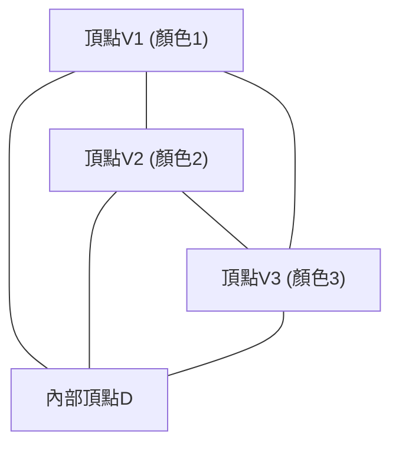

# 1. 引言：始於拼圖的數學奧秘

數學之美常常在於：極其簡單的規則卻能推導出無人預料的深奧結果。「 **[斯佩納引理](https://kenji.blog/zh-tw/p/sperners-lemma/)** ([Sperner's Lemma](https://kenji.blog/zh-tw/p/sperners-lemma/))」就是其中最具代表性的例子之一。這個由德國數學家埃馬努埃爾·斯佩納（Emanuel Sperner）於1928年發表的引理，乍看之下不過是一個連小學生都能看懂的「三角形著色拼圖」。

然而，這個簡單的拼圖在現代數學中佔據著極其重要的地位。特別是在拓撲學中，它是用來組合化、構造性地證明 **布勞威爾不動點定理** (Brouwer Fixed-Point Theorem) 的強大工具，該定理也是經濟學中賽局理論（如納什均衡的存在性證明）等領域的基礎。

在本文中，我們將結合圖解，詳細解釋[斯佩納引理](https://kenji.blog/zh-tw/p/sperners-lemma/)：從其直觀含義、嚴密的數學證明，到其作為通往連續世界的橋樑在不動點定理中的應用。

# 2. 單形與單純複形：幾何學基礎

為了理解[斯佩納引理](https://kenji.blog/zh-tw/p/sperners-lemma/)，我們先需要明確「 **單形** (Simplex)」和「 **單純複形** (Simplicial Complex / Triangulation)」的概念。

## 2.1. 什麼是單形？

在 $n$ 維空間中，當有 $n+1$ 個幾何上獨立的點時，以它們為頂點構成的最小凸集被稱為 **$n$維單形** (n-simplex)。
- 0維單形：點
- 1維單形：線段
- 2維單形：三角形
- 3維單形：四面體

這裡我們將主要討論最容易直觀理解的2維單形，即「三角形」。假設有一個大三角形 $T$，其三個頂點為 $V_1, V_2, V_3$。

## 2.2. 單純複形（三角剖分）

我們考慮將這個大三角形 $T$ 分割成多個小三角形。但是，不能隨意分割，滿足以下條件的分割稱為 **三角剖分** (Triangulation)。

1. 假設分割後的小三角形集合為 $\mathcal{K}$，如果 $\mathcal{K}$ 中的任意兩個三角形相交，其交集必須是「共享的頂點」或「共享的邊」。
2. 不允許出現「半途相接」的情況，即小三角形部分重疊，或者另一個三角形的頂點落在某條邊的中間。

對於這樣分割成的三角形網路，為每個頂點著色，便構成了[斯佩納引理](https://kenji.blog/zh-tw/p/sperners-lemma/)的舞台。

# 3. 斯佩納著色：邊界規則

假設給定了三角形 $T$ 的三角剖分。考慮一個函數 $C: V \to \{1, 2, 3\}$，為出現在這個剖分中的 **所有頂點**（大三角形的頂點、邊上的頂點以及內部頂點）分配顏色。

但是，必須嚴格按照以下 **邊界規則** (Sperner Condition) 進行著色。

1. **主頂點的著色** ：大三角形的三個頂點 $V_1, V_2, V_3$ 必須分別塗上不同的顏色。例如，令 $C(V_1) = 1, C(V_2) = 2, C(V_3) = 3$。
2. **邊上頂點的著色** ：大三角形邊上的頂點，必須塗上與該邊兩個端點顏色相同的顏色之一。
   - 邊 $V_1V_2$ 上的頂點，顏色為1或2。
   - 邊 $V_2V_3$ 上的頂點，顏色為2或3。
   - 邊 $V_3V_1$ 上的頂點，顏色為3或1。
3. **內部頂點的著色** ：大三角形內部的頂點，可以自由塗上顏色1、2或3中的任意一種。

遵循此規則的著色被稱為 **斯佩納著色** (Sperner Coloring)。

# 4. [斯佩納引理](https://kenji.blog/zh-tw/p/sperners-lemma/)的結論

當按照斯佩納著色的規則完成著色後，會發生什麼現象呢？[斯佩納引理](https://kenji.blog/zh-tw/p/sperners-lemma/)提出了以下令人驚嘆的事實。

> **[斯佩納引理](https://kenji.blog/zh-tw/p/sperners-lemma/) (二維)**
> 在任意的斯佩納著色中，三個頂點全被塗上不同顏色（顏色1、顏色2、顏色3）的小三角形， **必然存在奇數個** 。
> 因為是奇數個（1, 3, 5, ...），所以這種「集齊了3種顏色的完整小三角形」 **至少必然存在一個** 。

無論你如何刻意地為內部頂點著色，也無論你將三角形分割得多麼細密複雜，集齊3種顏色的小三角形（我們稱之為 **完整三角形** ）一定會在某處出現。

# 5. 使用圖論的優美證明

這個定理在直觀上可能顯得不可思議，但透過使用「對偶圖 (Dual Graph)」和「握手引理 (Handshaking Lemma)」，可以像變魔術一樣優美地證明它。如果使用「房間與門」的比喻，這種方法將非常容易理解。

## 5.1. 房間與門的定義

將三角剖分後的每個小三角形視為一個「房間」。同時，將大三角形 $T$ 的外部稱為「室外」。
隔開房間與房間、或房間與室外的，是小三角形的「邊（牆壁）」。

在這裡，我們將一種特殊的牆壁定義為 **門** 。
- **門的定義** ：兩端頂點分別塗有 **顏色1和顏色2** 的邊稱為「門」。

讓我們考慮一下每個房間（小三角形）有幾扇門。因為小三角形有三個頂點，根據其顏色組合可分為以下情況：

1. **顏色為 (1, 1, 1), (2, 2, 2), (3, 3, 3) 的房間**
   - 因為不存在包含1和2的邊，所以有 **0扇門** 。
2. **顏色為 (1, 1, 2) 或 (1, 2, 2) 的房間**
   - 恰好有兩條邊連接顏色1和顏色2。因此，有 **2扇門** 。
3. **顏色為 (1, 3, 3) 或 (2, 2, 3) 等的房間**
   - 因為沒有1和2的配對，所以有 **0扇門** 。
4. **顏色為 (1, 2, 3) 的房間（完整三角形）**
   - 只有一條邊連接顏色1和顏色2。因此，有 **1扇門** 。

總結一下， **只有完整三角形的房間擁有奇數（1扇）門，而其他所有房間都擁有偶數（0扇或2扇）門** 。

## 5.2. 外牆上的門數

接下來，我們計算大三角形外圍（外牆）上的門數。
能夠存在門（顏色1和2的邊）的外牆，只有在邊 $V_1V_2$ 上。（根據規則，邊 $V_2V_3$ 或 $V_3V_1$ 上永遠不會同時出現顏色1和顏色2。）

如果我們從 $V_1$ 開始順次觀察邊 $V_1V_2$ 上頂點的顏色，最開始是顏色1，最後是顏色2。從1變為2，或者從2變為1的次數，因為起點和終點顏色不同， **必然是奇數次** 。
因此，通向室外的門的數量是 **奇數個** 。

## 5.3. 利用握手引理計算度數

現在輪到圖論出場了。
- 圖的頂點：每個小三角形（房間）以及室外。
- 圖的邊：門（顏色1和2的邊）。如果兩個房間共享一扇門，則用邊連接它們的頂點。

根據圖論的基本定理「握手引理」，所有頂點的「度數（相連的邊數）」之和，必定是偶數（邊數的2倍）。

$$ \sum_{v \in V} \text{deg}(v) = 2|E| $$

在我們構建的圖中，各個頂點的度數（門的數量）是怎樣的呢？
- 室外的度數 = 外牆的門數 = **奇數**
- 完整三角形房間的度数 = 1 = **奇數**
- 其他房間的度数 = 0 或 2 = **偶數**

我們計算度數的總和。
$$ \text{總和} = \text{室外的度數} + \text{完整三角形的度數之和} + \text{其他房間的度數之和} $$

總和必須是偶數。
室外的度數是「奇數」，其他房間的度數之和是「偶數」。
因此，為了使整體總和為偶數，「完整三角形的度數之和」 **必須是奇數** 。
由於每個完整三角形的度數都是1，所以完整三角形的數量 **必然是奇數個** 。

至此，完美地證明了至少存在一個完整三角形。

# 6. 向高維的推廣

[斯佩納引理](https://kenji.blog/zh-tw/p/sperners-lemma/)不僅侷限於二維的三角形，對於任意的 $n$ 維單形同樣成立。

在 $n$ 維單形（例如 $n=3$ 時的四面體）的情況下，有 $n+1$ 個頂點，並使用 $1, 2, \dots, n+1$ 的 $n+1$ 種顏色。
邊界條件被推廣為：「任意 $k$ 維面（facet）上的頂點，只能使用構成該面的 $k+1$ 個頂點的顏色」。

證明採用數學歸納法。
- $n=1$ 的情況：線段兩端是顏色1和顏色2。中間的點是1或2。從1變為2的地方（完整的一維單形）必然有奇數個。
- 假設在 $n=k$ 時成立，在證明 $n=k+1$ 時，透過與之前同樣的方式計算「門（包含 $n$ 種顏色的完整面）」的數量，便能奇妙地證明存在奇數個 $n+1$ 種顏色的完整單形。

# 7. 在布勞威爾不動點定理中的應用

為什麼[斯佩納引理](https://kenji.blog/zh-tw/p/sperners-lemma/)受到如此高的重視呢？這是因為這個離散定理成為了證明連續拓撲學定理—— **布勞威爾不動點定理** ——的橋樑。

## 7.1. 什麼是布勞威爾不動點定理

> **布勞威爾不動點定理**
> 對於從 $n$ 維單位球（或單形）到其自身的任意連續映射 $f: D \to D$，必然至少存在一個點 $x$ （不動點）使得 $f(x) = x$。

這個著名的定理常被這樣一個比喻來解釋：當你攪拌完咖啡並放下杯子時，必然至少有一顆咖啡粒子的位置與攪拌前完全相同。

## 7.2. 從[斯佩納引理](https://kenji.blog/zh-tw/p/sperners-lemma/)的推導路徑

從[斯佩納引理](https://kenji.blog/zh-tw/p/sperners-lemma/)推導不動點定理的邏輯非常優雅。

1. **重心座標與位移向量的評估**
   對單形上的任意點 $x$ 應用連續映射 $f$，觀察其移動後的位置 $f(x)$。根據點 $x$ 移動的方向（重心座標的哪個分量減小了），為點 $x$ 分配顏色。
   $$ \text{例如，如果 } x \text{ 的第 } i \text{ 個分量嚴格大於 } f(x) \text{ 的第 } i \text{ 個分量，則塗上顏色 } i $$
   
2. **確認邊界條件**
   由於連續映射的性質決定了點不能移動到邊界之外，這種著色方法恰好滿足斯佩納著色的條件。

3. **向極限過渡**
   將三角形不斷地進行更細密的三角剖分。在每一次剖分中，根據[斯佩納引理](https://kenji.blog/zh-tw/p/sperners-lemma/)，必然存在集齊了3種顏色的小三角形。
   
4. **緊緻性與收斂**
   取剖分尺寸趨近於零的極限。根據波爾查諾-魏爾斯特拉斯定理（緊緻空間中的點列存在收斂子列），這個完整三角形的序列將收斂於某一點 $x^*$。
   
5. **確定不動點**
   由於映射 $f$ 是連續的，在這個極限點 $x^*$ 處，它必須具有「所有分量都減小的方向」，但是因為重心座標之和始終為1，所有分量同時減小是不可能的。因此，唯一的可能性就是「沒有任何分量發生變化」，即 $f(x^*) = x^*$。這就是不動點。

# 8. 其他應用：公平分割與經濟學

除了不動點定理，[斯佩納引理](https://kenji.blog/zh-tw/p/sperners-lemma/)還直接應用於現實世界的問題中。
典型的例子是「公平分租問題」和「切蛋糕問題」。

當多人合租房屋時，由於房間的大小和條件不同，大家往往會為了誰以多少錢租哪個房間而產生爭議。應用基於[斯佩納引理](https://kenji.blog/zh-tw/p/sperners-lemma/)的演算法（如 Su 的演算法），可以證明必然存在一種公平的分配方式，使得「每個人都對自己選擇的房間和租金感到滿意，且租金總和等於原總額」，並且還能近似地找出這種分配方式。

此外，約翰·納什在經濟學中證明的「納什均衡的存在性」也依賴於布勞威爾或角谷的不動點定理，其根本上隱藏著類似[斯佩納引理](https://kenji.blog/zh-tw/p/sperners-lemma/)的組合數學結構。

# 9. 結語

[斯佩納引理](https://kenji.blog/zh-tw/p/sperners-lemma/)從一個近乎遊戲的設定——按照規則為三角形頂點著色——出發。然而，在「計算門的數量」這般簡單的邏輯中，卻隱藏著關於空間連續性與不變性的深奧真理。

離散數學與連續數學。這兩個看似截然不同的世界，竟然透過如此優美的定理聯繫在一起，這可以說是數學這門學科最大的魅力之一。我們也鼓勵讀者拿起紙筆，隨意地畫個三角形進行剖分並用3種顏色著色。當你找到那個必定隱藏其中的「完整三角形」時，你也一定能觸碰到數學的奧秘。
