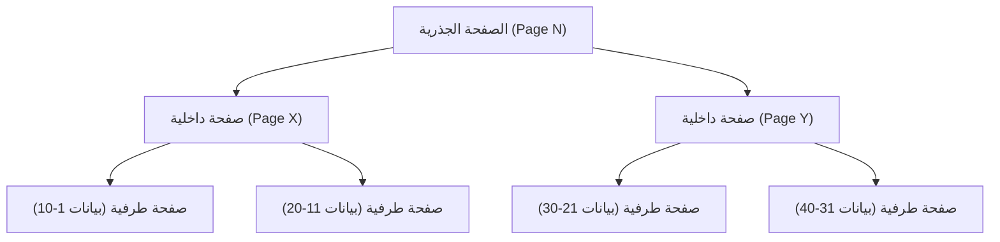
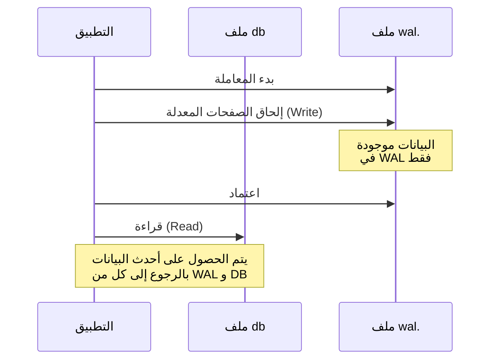

## مقدمة

في تطوير البرمجيات الحديثة، تعتبر قواعد البيانات وجودًا لا غنى عنه. من بينها، ليس من المبالغة القول إن "SQLite" هو أحد محركات قواعد البيانات الأكثر استخدامًا في العالم، من تطبيقات الهواتف الذكية إلى الأنظمة المدمجة، ومتصفحات الويب، وحتى خوادم الويب الصغيرة.

أهم ميزة لـ SQLite، كما يوحي اسمها، هي كونها "خفيفة الوزن (Lite)"، وقبل كل شيء، بنيتها في "**تخزين البيانات بالكامل في ملف واحد فقط**". بخلاف قواعد البيانات التي تعتمد على نموذج العميل-الخادم مثل MySQL و PostgreSQL، يعمل SQLite كمكتبة تعمل مباشرة داخل عملية التطبيق.

مع ذلك، على الرغم من بساطة هيكل الملف الواحد، يدعم SQLite معاملات بخصائص ACID كاملة (الذرية، الاتساق، العزلة، المتانة). حتى عندما تصل عمليات متعددة في نفس الوقت، فلن تتلف البيانات.

في هذه المقالة، سنتعمق في البنية الداخلية لـ SQLite (B-tree، WAL، وآلية القفل) لتوضيح كيف تتحقق هذه الآلية السحرية من منظور عملي.

---

## 1. سحر الملف الواحد: الصفحات وبنية B-tree

ملف بيانات SQLite من منظور نظام التشغيل ليس سوى ملف ثنائي عادي. ولكن داخل SQLite، يتم تقسيم هذا الملف إلى كتل ذات حجم ثابت (عادة 4 كيلوبايت) تسمى "الصفحات" ويتم إدارتها.

### بنية الصفحة

يتم فهرسة الملف بالكامل بأرقام الصفحات بدءًا من 1. الصفحة 1 هي صفحة خاصة تحتوي على معلومات رأس قاعدة البيانات (الإصدار، حجم الصفحة، الترميز، إلخ) والعقدة الجذرية لجدول خاص (`sqlite_schema`) يخزن معلومات مخطط قاعدة البيانات.

كل صفحة لها أحد الأدوار التالية:
- **صفحات B-tree**: تخزن بيانات الجداول أو الفهارس
- **صفحات القائمة الحرة**: الصفحات التي تم حذفها وأصبحت مساحة فارغة
- **صفحات خريطة المؤشرات**: صفحات لتتبع حركة الصفحات (عند تمكين ميزات معينة)

### إدارة البيانات باستخدام B-tree

تستخدم SQLite بنية البيانات **B-tree (شجرة B)** للبحث عن البيانات وإدراجها وحذفها بكفاءة. على وجه التحديد، تستخدم "B+tree (تخزن البيانات في العقد الطرفية فقط)" لبيانات الجدول، و "B-tree (تخزن المفاتيح في العقد الداخلية أيضًا)" لبيانات الفهرس.



بفضل هذه البنية الهرمية، حتى مع وجود ملايين السجلات، يمكن الوصول إلى البيانات المطلوبة بعدد قليل من عمليات إدخال/إخراج القرص (قراءة الصفحات). يتم تعيين هذه البنية الشجرية المعقدة داخل ملف واحد.

---

## 2. آليات حماية المعاملات: من سجل التراجع إلى WAL

واحدة من أهم المهام في قواعد البيانات هي "القدرة على تحمل الأعطال". من الضروري منع البيانات من الوصول إلى حالة غير متسقة حتى في حالة انقطاع التيار الكهربائي أو تجميد نظام التشغيل أثناء كتابة البيانات.

استخدمت SQLite تاريخيًا طريقة تُسمى "سجل التراجع" (Rollback Journal)، ولكن اليوم أصبحت وضعية "**WAL (Write-Ahead Logging)**" التي توفر أداءً وتزامنًا فائقين هي السائدة.

### الطريقة القديمة: سجل التراجع

في طريقة سجل التراجع، قبل تعديل البيانات، يتم نسخ "الحالة السابقة" للصفحات المعدلة إلى ملف منفصل (ملف السجل).
إذا فشلت المعاملة أو حدث عطل، في بداية التشغيل التالية، يتم استخدام ملف السجل هذا لـ "التراجع" عن التغييرات واستعادة الاتساق.

كان العيب الرئيسي لهذه الطريقة هو أنه "أثناء تقدم عملية الكتابة، لا يمكن للعمليات الأخرى حتى القراءة (يتم قفل قاعدة البيانات بالكامل)".

### الطريقة الجديدة: WAL (Write-Ahead Logging)

حسّن وضع WAL، الذي تم تقديمه في الإصدار 3.7.0 من SQLite، من مشكلة التزامن هذه بشكل كبير.

في وضع WAL، لا تتم كتابة الصفحات المعدلة مباشرة إلى ملف قاعدة البيانات الأصلي، بل يتم **إلحاقها في نهاية ملف منفصل (ملف wal.)**.



**مزايا WAL:**
1. **تحسين التزامن**: بما أن عمليات الكتابة تتم عن طريق الإلحاق في ملف `.wal`، فإنها لا تحظر "عمليات القراءة" التي تشير إلى ملف قاعدة البيانات الأصلي. بعبارة أخرى، **يمكن لكتابة واحدة وقراءات متعددة أن تتقدم في نفس الوقت**.
2. **تحسين الأداء**: نظرًا لأنه يتم الإلحاق التسلسلي (المستمر) بدلاً من إعادة الكتابة في مواقع عشوائية على القرص، فإن أداء إدخال/إخراج القرص يكون أعلى.

يتم كتابة التغييرات المتراكمة في ملف WAL مرة أخرى إلى ملف قاعدة البيانات الأصلي عندما تصل إلى حجم معين أو عندما يتم تنفيذ أمر صريح. تسمى هذه العملية بـ "**نقطة الفحص**" (Checkpoint).

---

## 3. التحكم في الوصول المتزامن: آلية القفل

عندما تقوم عمليات متعددة (أو خيوط) بالوصول إلى SQLite، وهو ملف واحد، في نفس الوقت، فمن الضروري وجود آلية قفل لمنع تضارب البيانات.

### حالات قفل SQLite

تتخذ اتصالات قاعدة بيانات SQLite إحدى حالات القفل الخمس التالية:

1. **UNLOCKED (غير مقفل)**: الاتصال لا يصل إلى قاعدة البيانات.
2. **SHARED (قفل مشترك)**: قفل لقراءة البيانات. يمكن للعديد من الاتصالات الحصول على قفل SHARED في نفس الوقت (القراءة المتزامنة ممكنة).
3. **RESERVED (قفل محجوز)**: قفل يعلن عن النية في كتابة البيانات في المستقبل. يمكن لاتصال واحد فقط الحصول عليه في قاعدة البيانات بأكملها. في هذه الحالة، لا يزال بإمكان الاتصالات الأخرى الاستمرار في الحصول على أقفال SHARED.
4. **PENDING (قفل معلق)**: حالة يكون فيها كل شيء جاهزًا للكتابة وينتظر تحرير أقفال SHARED النشطة حاليًا. يتم حظر الحصول على أقفال SHARED جديدة.
5. **EXCLUSIVE (قفل حصري)**: قفل لإجراء الكتابة الفعلية. في هذه الحالة، لا يمكن لأي اتصال آخر القراءة أو الكتابة.

### تصعيد القفل

عند بدء معاملة وقراءة وكتابة البيانات، تقوم SQLite تلقائيًا بترقية حالات القفل هذه تدريجيًا (تصعيد).

- عند تنفيذ `SELECT`، يتم الحصول على قفل **SHARED**.
- عند محاولة تنفيذ `INSERT` أو `UPDATE`، يتم الحصول أولاً على قفل **RESERVED**.
- في مرحلة اعتماد المعاملة الفعلي وعكس التغييرات في الملف، تمر عبر **PENDING** وتحاول الحصول على قفل **EXCLUSIVE**.

إذا احتفظت عملية أخرى بقفل SHARED لفترة طويلة، فلن تتمكن عملية الكتابة من الحصول على قفل EXCLUSIVE، وسيحدث خطأ `SQLITE_BUSY` (قاعدة البيانات مقفلة).

### إعداد Busy Timeout

في تطوير التطبيقات، الطريقة الأبسط والأكثر فعالية للتعامل مع خطأ `SQLITE_BUSY` هذا هي إعداد **مهلة (busy_timeout)**.

```sql
PRAGMA busy_timeout = 5000; -- الانتظار لمدة 5000 مللي ثانية (5 ثوانٍ)
```

عند إعداد هذا، حتى إذا تعذر الحصول على القفل، فإنه لا يُرجع خطأً على الفور، بل يكرر إعادة المحاولة للوقت المحدد. من خلال تعيين المهلة بشكل مناسب، يمكن تجنب معظم الأخطاء في الوصول المتزامن الصغير إلى المتوسط.

---

## 4. أفضل الممارسات لتحقيق أقصى أداء

بعد فهم البنية الداخلية لـ SQLite، إليك بعض الإعدادات العملية (PRAGMA) لزيادة أداء وأمان التطبيق إلى أقصى حد.

### 1. تمكين وضع WAL
كما ذكرنا سابقًا، فهو إلزامي في حالة وجود وصول متزامن.
```sql
PRAGMA journal_mode = WAL;
```

### 2. تحسين وضع المزامنة
عند دمجه مع وضع WAL، حتى إذا قمت بتخفيض وضع المزامنة إلى `NORMAL`، فإن خطر تلف البيانات منخفض للغاية، ويتحسن أداء الكتابة بشكل كبير.
```sql
PRAGMA synchronous = NORMAL;
```

### 3. زيادة ذاكرة التخزين المؤقت
عن طريق زيادة عدد الصفحات التي يمكن لـ SQLite تخزينها في ذاكرة الوصول العشوائي مؤقتًا، يتم تقليل إدخال/إخراج القرص. (الافتراضي هو 2000 صفحة)
```sql
-- إذا حددت حجم ذاكرة التخزين المؤقت بقيمة سالبة، فسيكون بالكيلوبايت. ما يلي هو 64 ميجابايت.
PRAGMA cache_size = -64000; 
```

### 4. قراءة سريعة باستخدام mmap
عند تمكين الإدخال/الإخراج المعين بالذاكرة (mmap)، فإنه يصل إلى الملف مباشرة باستخدام آلية الذاكرة الافتراضية لنظام التشغيل، مما يسرع عمليات القراءة.
```sql
PRAGMA mmap_size = 30000000000;
```

---

## خاتمة

خلف مظهرها البسيط للغاية كـ "ملف واحد"، تخفي SQLite بنية بيانات معقدة تعتمد على B-tree، وإدارة متقدمة للمعاملات بفضل WAL، وآلية قفل متطورة.

من المفاهيم الخاطئة الكبيرة أن نقول "لأنها خفيفة الوزن، لا يمكن استخدامها للأغراض الجادة". من خلال الفهم الصحيح لبنيتها الداخلية وإجراء الإعدادات المناسبة (مثل تمكين وضع WAL وإعداد المهلة)، ستوفر SQLite أداءً واستقرارًا مذهلين.

في المرة القادمة التي تختار فيها قاعدة بيانات لمشروعك، قد تكون هذه "قاعدة البيانات الأكثر استخدامًا في العالم" في الواقع هي الخيار الأكثر منطقية.
