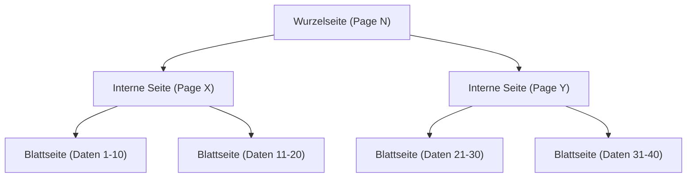
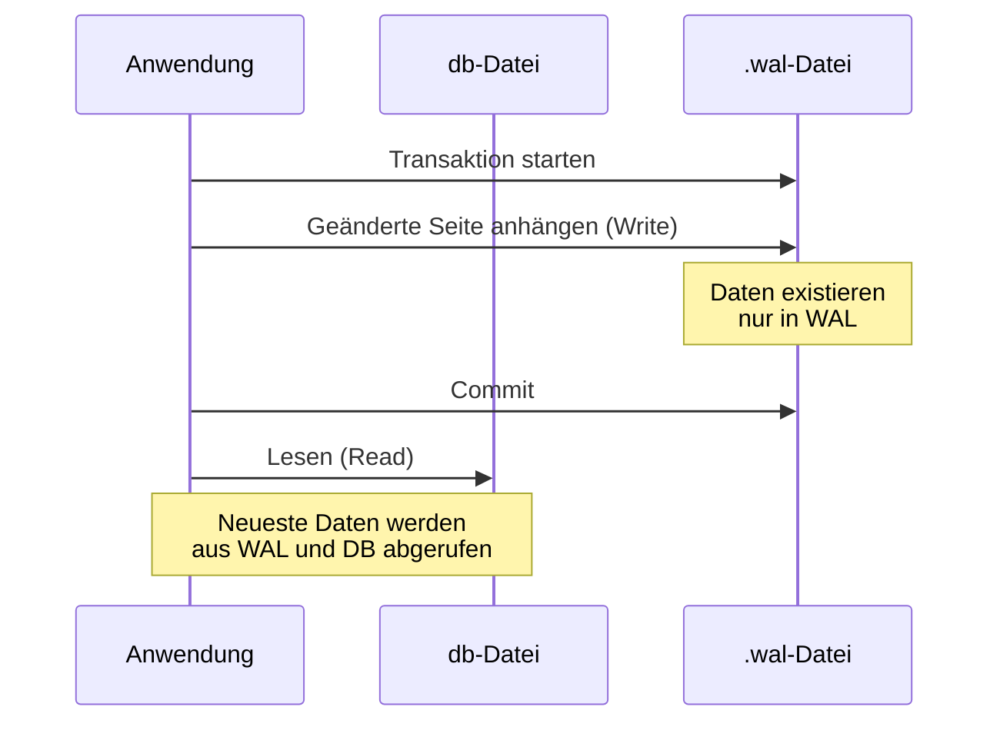

## Einführung

In der modernen Softwareentwicklung sind Datenbanken unverzichtbar. Unter ihnen ist "SQLite" zweifellos eine der weltweit am häufigsten verwendeten Datenbank-Engines, die von Smartphone-Apps über eingebettete Systeme und Webbrowser bis hin zu kleinen Webservern reicht.

Das größte Merkmal von SQLite ist, wie der Name schon sagt, dass es "leichtgewichtig (Lite)" ist und vor allem seine Architektur, die "**die gesamten Daten in nur einer einzigen Datei speichert**". Im Gegensatz zu Client-Server-Datenbanken wie MySQL oder PostgreSQL fungiert SQLite als Bibliothek, die direkt im Prozess der Anwendung läuft.

Trotz dieser einfachen Struktur einer einzigen Datei unterstützt SQLite Transaktionen mit vollständigen ACID-Eigenschaften (Atomarität, Konsistenz, Isolation, Dauerhaftigkeit). Selbst wenn mehrere Prozesse gleichzeitig darauf zugreifen, werden die Daten nicht beschädigt.

In diesem Artikel werden wir tief in die interne Architektur von SQLite (B-Tree, WAL, Sperrmechanismen) eintauchen und aus einer praktischen Perspektive erklären, wie diese magische Funktionalität erreicht wird.

---

## 1. Die Magie der einzelnen Datei: Seiten und B-Tree-Architektur

Aus Sicht des Betriebssystems ist die Datendatei von SQLite nur eine einfache Binärdatei. Intern wird diese Datei jedoch von SQLite verwaltet, indem sie in Blöcke fester Größe (normalerweise 4 KB) unterteilt wird, die als "Seiten (Pages)" bezeichnet werden.

### Struktur der Seiten

Die gesamte Datei ist mit Seitennummern indiziert, die bei 1 beginnen. Seite 1 ist eine spezielle Seite und enthält die Datenbank-Header-Informationen (Version, Seitengröße, Kodierung usw.) sowie den Wurzelknoten der speziellen Tabelle (`sqlite_schema`), die die Schema-Informationen der Datenbank speichert.

Jede Seite hat eine der folgenden Rollen:
- **B-Tree-Seite**: Speichert Tabellendaten und Indexdaten.
- **Freelist-Seite**: Seiten, die gelöscht wurden und zu freiem Speicherplatz geworden sind.
- **Pointer-Map-Seite**: Seiten zur Verfolgung von Seitenverschiebungen (wenn bestimmte Funktionen aktiviert sind).

### Datenmanagement mit B-Tree

SQLite verwendet die **B-Tree (B-Baum)**-Datenstruktur, um Daten effizient zu suchen, einzufügen und zu löschen. Konkret verwendet es "B+Tree (speichert Daten nur in Blattknoten)" für Tabellendaten und "B-Tree (speichert Schlüssel auch in internen Knoten)" für Indexdaten.



Dank dieser hierarchischen Struktur kann selbst bei Millionen von Datensätzen das gewünschte Datum mit nur wenigen Festplatten-I/O-Operationen (Seitenlesevorgängen) erreicht werden. Innerhalb einer einzigen Datei ist diese ausgeklügelte Baumstruktur abgebildet.

---

## 2. Der Mechanismus zum Schutz von Transaktionen: Vom Rollback-Journal zum WAL

Eine der wichtigsten Aufgaben einer Datenbank ist die "Ausfallsicherheit (Crash-Resilienz)". Es muss sichergestellt werden, dass die Daten nicht in einen inkonsistenten Zustand geraten, selbst wenn während des Schreibens von Daten ein Stromausfall oder ein Einfrieren des Betriebssystems auftritt.

Historisch gesehen verwendete SQLite eine Methode namens "Rollback-Journal", aber heute ist der "**WAL (Write-Ahead Logging)**"-Modus, der eine hervorragende Leistung und Nebenläufigkeit bietet, der Mainstream.

### Alte Methode: Rollback-Journal

Bei der Rollback-Journal-Methode wird vor dem Ändern von Daten der "Zustand vor der Änderung" der zu ändernden Seiten in eine separate Datei (Journaldatei) kopiert.
Wenn eine Transaktion fehlschlägt oder abstürzt, wird diese Journaldatei beim nächsten Start verwendet, um die Änderungen "rückgängig zu machen (Rollback)" und die Konsistenz wiederherzustellen.

Der größte Nachteil dieser Methode bestand darin, dass "während ein Schreibvorgang läuft, andere Prozesse nicht einmal lesen können (die gesamte Datenbank wird gesperrt)".

### Neue Methode: WAL (Write-Ahead Logging)

Der WAL-Modus, der ab SQLite Version 3.7.0 eingeführt wurde, hat dieses Nebenläufigkeitsproblem drastisch verbessert.

Im WAL-Modus werden geänderte Seiten nicht direkt in die ursprüngliche Datenbankdatei geschrieben, sondern **an das Ende einer separaten Datei (.wal-Datei) angehängt**.



**Vorteile von WAL:**
1. **Verbesserte Nebenläufigkeit**: Da Schreibvorgänge durch Anhängen an die `.wal`-Datei ausgeführt werden, blockieren sie keine "Lesevorgänge", die auf die ursprüngliche Datenbankdatei verweisen. Das bedeutet, dass **ein Schreibvorgang und mehrere Lesevorgänge gleichzeitig stattfinden können**.
2. **Leistungssteigerung**: Anstatt zufällige Stellen auf der Festplatte zu überschreiben, werden sequenzielle (fortlaufende) Anhänge vorgenommen, was zu einer höheren Festplatten-I/O-Leistung führt.

Die in der WAL-Datei angesammelten Änderungen werden in die ursprüngliche Datenbankdatei zurückgeschrieben, wenn sie eine bestimmte Größe erreichen oder wenn ein Befehl explizit ausgeführt wird. Dieser Prozess wird als "**Checkpoint**" bezeichnet.

---

## 3. Gleichzeitige Zugriffe steuern: Sperrmechanismen

Wenn mehrere Prozesse (oder Threads) gleichzeitig auf SQLite zugreifen, das aus einer einzigen Datei besteht, ist ein Sperrmechanismus (Locking) unerlässlich, um Datenkonflikte zu vermeiden.

### SQLite-Sperrzustände

Eine SQLite-Datenbankverbindung nimmt einen der folgenden fünf Sperrzustände ein:

1. **UNLOCKED (Nicht gesperrt)**: Der Zustand, in dem die Verbindung nicht auf die Datenbank zugreift.
2. **SHARED (Gemeinsame Sperre)**: Eine Sperre zum Lesen von Daten. Mehrere Verbindungen können gleichzeitig eine SHARED-Sperre erhalten (gleichzeitiges Lesen ist möglich).
3. **RESERVED (Reservierte Sperre)**: Eine Sperre, die erklärt, dass in Zukunft Daten geschrieben werden sollen. Es kann nur eine Verbindung in der gesamten Datenbank diese erhalten. In diesem Zustand können andere Verbindungen weiterhin SHARED-Sperren erhalten.
4. **PENDING (Ausstehende Sperre)**: Der Zustand, in dem Vorbereitungen für das Schreiben getroffen wurden und darauf gewartet wird, dass aktuell aktive SHARED-Sperren freigegeben werden. Der Erwerb neuer SHARED-Sperren wird blockiert.
5. **EXCLUSIVE (Exklusive Sperre)**: Die Sperre zur Durchführung des eigentlichen Schreibvorgangs. In diesem Zustand kann keine andere Verbindung lesen oder schreiben.

### Sperr-Eskalation

Beim Starten einer Transaktion und dem Lesen/Schreiben von Daten erhöht SQLite automatisch diese Sperrzustände schrittweise (Eskalation).

- Die Ausführung von `SELECT` erhält eine **SHARED**-Sperre.
- Wenn versucht wird, `INSERT` oder `UPDATE` auszuführen, wird zuerst eine **RESERVED**-Sperre erhalten.
- In der Phase, in der die Transaktion tatsächlich festgeschrieben (Commit) und die Änderungen in der Datei widergespiegelt werden, wird versucht, eine **EXCLUSIVE**-Sperre über **PENDING** zu erhalten.

Wenn ein anderer Prozess eine SHARED-Sperre für lange Zeit hält, kann der Schreibprozess keine EXCLUSIVE-Sperre erhalten, und es tritt ein Fehler namens `SQLITE_BUSY` (Datenbank ist gesperrt) auf.

### Einstellung des Busy Timeout

In der Anwendungsentwicklung ist die einfachste und effektivste Methode zur Behandlung dieses `SQLITE_BUSY`-Fehlers die Einstellung eines **Timeouts (busy_timeout)**.

```sql
PRAGMA busy_timeout = 5000; -- 5000 Millisekunden (5 Sekunden) warten
```

Wenn dies eingestellt ist, wird bei Nichterhalt einer Sperre nicht sofort ein Fehler zurückgegeben, sondern es wird für die angegebene Zeit immer wieder neu versucht. Durch eine angemessene Einstellung des Timeouts können bei kleinen bis mittleren gleichzeitigen Zugriffen die meisten Fehler vermieden werden.

---

## 4. Best Practices zur Maximierung der Leistung

Nachdem wir die interne Architektur von SQLite verstanden haben, stellen wir einige praktische Einstellungen (PRAGMA) vor, um die Leistung und Sicherheit der Anwendung zu maximieren.

### 1. Aktivierung des WAL-Modus
Wie bereits erwähnt, ist dies bei gleichzeitigem Zugriff unerlässlich.
```sql
PRAGMA journal_mode = WAL;
```

### 2. Optimierung des Synchronisationsmodus
In Kombination mit dem WAL-Modus ist das Risiko einer Datenbeschädigung selbst dann extrem gering, wenn der Synchronisationsmodus auf `NORMAL` herabgesetzt wird, und die Schreibleistung verbessert sich dramatisch.
```sql
PRAGMA synchronous = NORMAL;
```

### 3. Erhöhung des Speicher-Caches
Durch die Erhöhung der Anzahl der Seiten, die SQLite im RAM zwischenspeichern (cachen) kann, wird der Festplatten-I/O reduziert. (Der Standardwert ist 2000 Seiten)
```sql
-- Wenn die Cache-Größe als negativer Wert angegeben wird, ist sie in KB. Das Folgende sind 64 MB.
PRAGMA cache_size = -64000; 
```

### 4. Schnelles Lesen durch mmap
Wenn Memory-mapped I/O (mmap) aktiviert ist, wird der virtuelle Speichermechanismus des Betriebssystems verwendet, um direkt auf die Datei zuzugreifen, wodurch das Lesen beschleunigt wird.
```sql
PRAGMA mmap_size = 30000000000;
```

---

## Fazit

Hinter dem äußerst einfachen Erscheinungsbild der "einzigen Datei" verbirgt SQLite eine ausgefeilte Datenstruktur mit B-Trees, ein fortschrittliches Transaktionsmanagement mit WAL und einen raffinierten Sperrmechanismus.

Die Aussage "Es ist zu leichtgewichtig, um für ernsthafte Zwecke verwendet zu werden" ist ein großes Missverständnis. Durch das richtige Verständnis seiner internen Architektur und die Anwendung geeigneter Einstellungen (wie die Aktivierung des WAL-Modus und die Einstellung von Timeouts) bietet SQLite eine erstaunliche Leistung und Stabilität.

Wenn Sie das nächste Mal eine Datenbank für Ihr Projekt auswählen, könnte diese "weltweit am häufigsten verwendete Datenbank" tatsächlich die sinnvollste Wahl sein.
