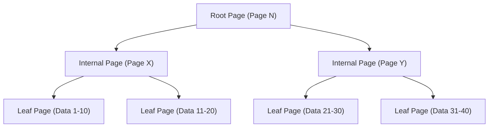
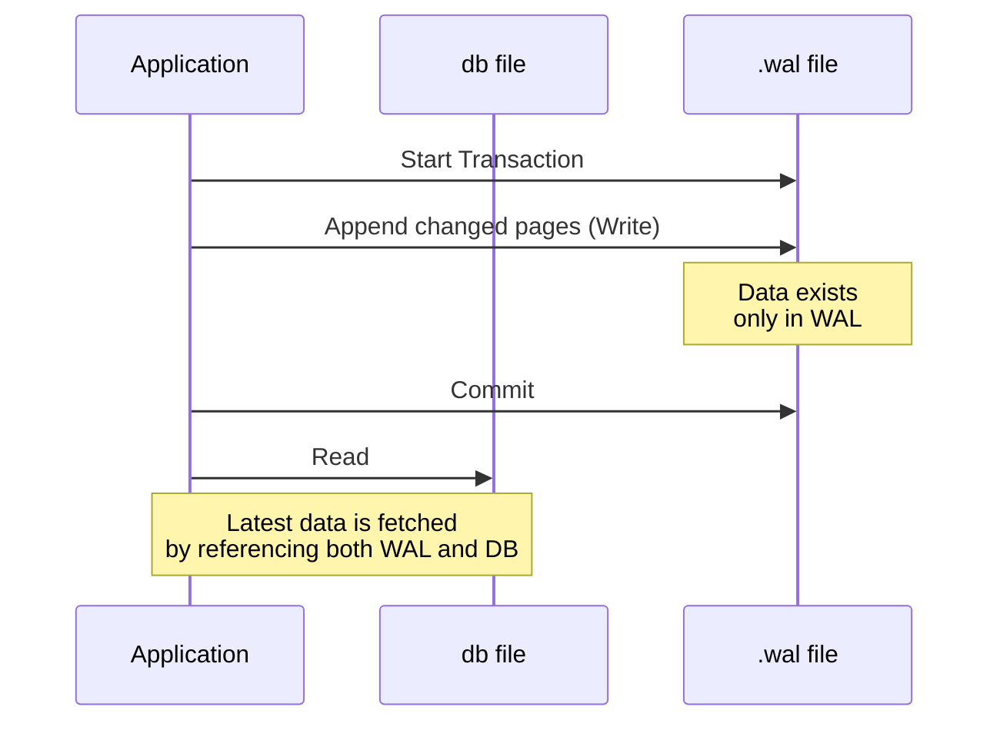

## Introduction

In modern software development, databases are indispensable. Among them, "SQLite" is arguably one of the most widely used database engines in the world, spanning from smartphone apps and embedded systems to web browsers and even small-scale web servers.

The most notable feature of SQLite is, as its name suggests, being "Lite", and above all, its architecture of **storing the entire data in a single file**. Unlike client-server databases such as MySQL or PostgreSQL, SQLite functions as a library that operates directly within the application's process.

However, despite its simple single-file structure, SQLite supports transactions with full ACID (Atomicity, Consistency, Isolation, Durability) properties. Even when accessed simultaneously by multiple processes, the data will not be corrupted.

In this article, we will delve deep into the internal architecture of SQLite (B-tree, WAL, locking mechanisms) and explain from a practical perspective how this magical mechanism is realized.

---

## 1. The Magic of a Single File: Pages and B-tree Architecture

From the OS's perspective, an SQLite data file is nothing more than a simple binary file. However, internally, SQLite manages this file by dividing it into fixed-size blocks (usually 4KB) called "pages".

### Page Structure

The entire file is indexed by page numbers starting from 1. Page 1 is a special page containing the database header information (version, page size, encoding, etc.) and the root node of a special table (`sqlite_schema`) that stores the database schema information.

Each page has one of the following roles:
- **B-tree page**: Stores table data and index data
- **Freelist page**: Pages that have been deleted and are now free space
- **Pointer map page**: Pages for tracking page movements (when specific features are enabled)

### Data Management with B-tree

To efficiently search, insert, and delete data, SQLite adopts the **B-tree** data structure. Specifically, it uses a "B+tree" (storing data only in leaf nodes) for table data, and a "B-tree" (storing keys in internal nodes as well) for index data.



Thanks to this hierarchical structure, even if there are millions of records, the desired data can be reached with just a few disk I/Os (page reads). This intricate tree structure is mapped within a single file.

---

## 2. Mechanisms to Protect Transactions: From Rollback Journal to WAL

One of the most important tasks in a database is "crash resilience". It is essential to ensure that data does not fall into an inconsistent state even if a power outage or OS freeze occurs during a write operation.

Historically, SQLite used a technique called the "Rollback Journal", but today, the "**WAL (Write-Ahead Logging)**" mode, which excels in performance and concurrency, has become mainstream.

### Old Method: Rollback Journal

In the Rollback Journal method, before rewriting data, the "pre-change state" of the pages to be modified is copied to a separate file (the journal file).
If a transaction fails or a crash occurs, this journal file is used upon the next startup to "rollback" (rewind) the changes and restore consistency.

The biggest drawback of this method was that "while a write operation is in progress, other processes cannot even read (the entire database is locked)."

### New Method: WAL (Write-Ahead Logging)

Introduced in SQLite version 3.7.0 and later, the WAL mode drastically improved this concurrency issue.

In WAL mode, modified pages are not directly written to the original database file, but are instead **appended to the end of a separate file (the .wal file)**.



**Advantages of WAL:**
1. **Improved Concurrency**: Since write operations are performed by appending to the `.wal` file, they do not block "read operations" that reference the original database file. This means **one write and multiple reads can proceed simultaneously**.
2. **Improved Performance**: Instead of rewriting random locations on the disk, it performs sequential appending, resulting in higher disk I/O performance.

Changes accumulated in the WAL file are written back to the original database file when they reach a certain size or when a command is explicitly executed. This process is called a "**Checkpoint**".

---

## 3. Controlling Concurrent Access: Locking Mechanism

When multiple processes (or threads) access SQLite, which is a single file, simultaneously, a locking mechanism is indispensable to prevent data conflicts.

### SQLite Lock States

An SQLite database connection takes one of the following five lock states:

1. **UNLOCKED**: The connection is not accessing the database.
2. **SHARED**: A lock for reading data. Multiple connections can acquire a SHARED lock at the same time (concurrent reads are possible).
3. **RESERVED**: A lock declaring the intention to write data in the future. Only one connection in the entire database can acquire this. Even in this state, other connections can continue to acquire SHARED locks.
4. **PENDING**: A state where preparation for writing is complete, waiting for currently active SHARED locks to be released. The acquisition of new SHARED locks is blocked.
5. **EXCLUSIVE**: A lock for performing the actual write. In this state, no other connections can read or write.

### Lock Escalation

When starting a transaction to read or write data, SQLite automatically upgrades these lock states in stages (escalation).

- Executing a `SELECT` acquires a **SHARED** lock.
- Attempting to execute an `INSERT` or `UPDATE` first acquires a **RESERVED** lock.
- At the stage of actually committing the transaction and reflecting the changes in the file, it attempts to acquire an **EXCLUSIVE** lock via **PENDING**.

If another process holds a SHARED lock for a long time, the writing process cannot acquire an EXCLUSIVE lock, resulting in an `SQLITE_BUSY` (database is locked) error.

### Busy Timeout Setting

In application development, the simplest and most effective way to handle this `SQLITE_BUSY` error is to set a **timeout (`busy_timeout`)**.

```sql
PRAGMA busy_timeout = 5000; -- Wait for 5000 milliseconds (5 seconds)
```

By setting this, instead of immediately returning an error when a lock cannot be acquired, it will repeatedly retry for the specified amount of time. By appropriately setting a timeout, most errors can be avoided for small to medium-scale concurrent access.

---

## 4. Best Practices for Maximizing Performance

Having understood SQLite's internal structure, here are some practical settings (PRAGMA) to maximize application performance and safety.

### 1. Enabling WAL Mode
As mentioned above, this is essential if there is concurrent access.
```sql
PRAGMA journal_mode = WAL;
```

### 2. Optimizing Synchronous Mode
When combined with WAL mode, lowering the synchronous mode to `NORMAL` drastically improves write performance while keeping the risk of data corruption extremely low.
```sql
PRAGMA synchronous = NORMAL;
```

### 3. Increasing Memory Cache
By increasing the number of pages SQLite can cache in RAM, disk I/O is reduced. (The default is 2000 pages)
```sql
-- Specifying cache size as a negative value sets it in KB. The following is 64MB.
PRAGMA cache_size = -64000; 
```

### 4. Fast Reading with mmap
Enabling Memory-mapped I/O (mmap) allows direct file access using the OS's virtual memory mechanism, speeding up reads.
```sql
PRAGMA mmap_size = 30000000000;
```

---

## Conclusion

Behind the extremely simple appearance of a "single file", SQLite hides an intricate data structure with B-trees, advanced transaction management with WAL, and a sophisticated locking mechanism.

The idea that "it cannot be used for serious purposes because it's lightweight" is a major misconception. By correctly understanding its internal architecture and applying appropriate settings (such as enabling WAL mode and setting timeouts), SQLite delivers astonishing performance and stability.

The next time you select a database for your project, this "most widely used database in the world" might actually be the most logical choice.
