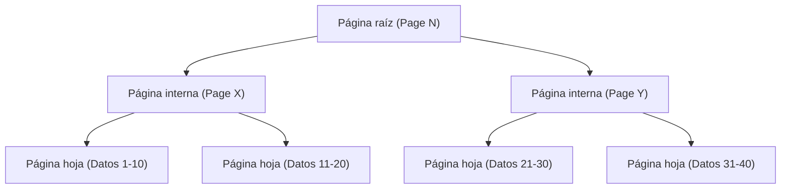
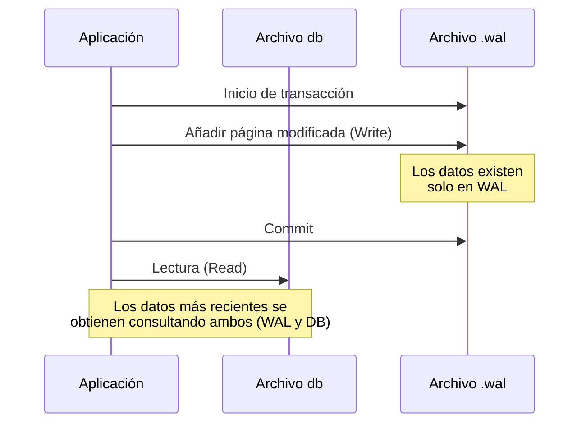

## Introducción

En el desarrollo de software moderno, las bases de datos son indispensables. Entre ellas, "SQLite" es sin duda uno de los motores de bases de datos más utilizados en el mundo, presente en todo tipo de aplicaciones, desde aplicaciones para teléfonos inteligentes hasta sistemas integrados, navegadores web e incluso pequeños servidores web.

La característica más importante de SQLite, como su nombre indica, es que es "ligera (Lite)" y, sobre todo, su arquitectura que consiste en "**almacenar todos los datos en un solo archivo**". A diferencia de las bases de datos cliente-servidor como MySQL o PostgreSQL, SQLite funciona como una biblioteca que se ejecuta directamente dentro del proceso de la aplicación.

Sin embargo, a pesar de su simple estructura de archivo único, SQLite soporta transacciones con propiedades ACID completas (Atomicidad, Consistencia, Aislamiento, Durabilidad). Incluso cuando múltiples procesos acceden al mismo tiempo, los datos no se corrompen.

En este artículo, profundizaremos en la estructura interna de SQLite (B-tree, WAL y mecanismos de bloqueo) y explicaremos desde una perspectiva práctica cómo se logra esta magia.

---

## 1. La magia del archivo único: Páginas y arquitectura B-tree

Para el sistema operativo, el archivo de datos de SQLite es solo un archivo binario. Sin embargo, internamente, SQLite divide y gestiona este archivo en bloques de tamaño fijo (generalmente 4KB) llamados "páginas".

### Estructura de las páginas

Todo el archivo está indexado por números de página que comienzan en 1. La página 1 es una página especial que contiene la información del encabezado de la base de datos (versión, tamaño de página, codificación, etc.) y el nodo raíz de una tabla especial (`sqlite_schema`) que almacena la información del esquema de la base de datos.

Cada página tiene una de las siguientes funciones:
- **Páginas B-tree**: Almacenan los datos de las tablas o los datos de los índices.
- **Páginas de lista libre (freelist)**: Páginas que han sido eliminadas y ahora son espacio libre.
- **Páginas de mapa de punteros**: Páginas para rastrear el movimiento de las páginas (cuando ciertas funciones están habilitadas).

### Gestión de datos con B-tree

SQLite utiliza la estructura de datos **B-tree (Árbol B)** para buscar, insertar y eliminar datos de manera eficiente. Específicamente, utiliza "B+tree" (que almacena datos solo en los nodos hoja) para los datos de las tablas, y "B-tree" (que también almacena claves en los nodos internos) para los datos de los índices.



Gracias a esta estructura jerárquica, incluso si existen millones de registros, se puede llegar a los datos deseados con solo unas pocas operaciones de E/S de disco (lecturas de página). Esta sofisticada estructura de árbol está mapeada dentro de un solo archivo.

---

## 2. Mecanismos para proteger las transacciones: Del Rollback Journal al WAL

Una de las tareas más importantes de una base de datos es la "resistencia a fallos (crashes)". Es necesario evitar que los datos queden en un estado inconsistente incluso si ocurre un corte de energía o el sistema operativo se congela a mitad de una escritura de datos.

Históricamente, SQLite utilizaba un método llamado "Rollback Journal", pero hoy en día el modo principal es "**WAL (Write-Ahead Logging)**", que ofrece un excelente rendimiento y concurrencia.

### El método antiguo: Rollback Journal

En el método Rollback Journal, antes de modificar los datos, el "estado anterior a la modificación" de las páginas que van a cambiar se copia en otro archivo (el archivo journal).
Si una transacción falla o hay un colapso, en el próximo inicio se usa este archivo journal para "revertir (rollback)" los cambios y recuperar la consistencia.

La mayor desventaja de este método era que "mientras la operación de escritura está en curso, otros procesos ni siquiera pueden leer (se bloquea toda la base de datos)".

### El método nuevo: WAL (Write-Ahead Logging)

El modo WAL, introducido a partir de la versión 3.7.0 de SQLite, mejoró drásticamente este problema de concurrencia.

En el modo WAL, las páginas modificadas no se escriben directamente en el archivo original de la base de datos, sino que **se añaden (append) al final de otro archivo (el archivo .wal)**.



**Ventajas de WAL:**
1. **Mejora en la concurrencia**: Dado que la operación de escritura se realiza añadiendo al archivo `.wal`, no bloquea las "operaciones de lectura" que consultan el archivo de base de datos original. Es decir, **una escritura y múltiples lecturas pueden proceder simultáneamente**.
2. **Mejora en el rendimiento**: Al realizar anexos secuenciales (continuos) en lugar de sobrescribir en ubicaciones aleatorias del disco, el rendimiento de E/S del disco es mucho mayor.

Los cambios acumulados en el archivo WAL se reescriben en el archivo de base de datos original cuando alcanzan un cierto tamaño o cuando se ejecuta explícitamente un comando. Este proceso se llama "**Checkpoint**" (punto de control).

---

## 3. Control del acceso simultáneo: Mecanismos de bloqueo

Cuando múltiples procesos (o hilos) acceden simultáneamente a SQLite, que es de un solo archivo, un mecanismo de bloqueo es esencial para prevenir conflictos de datos.

### Estados de bloqueo de SQLite

Una conexión a la base de datos de SQLite asume uno de los siguientes cinco estados de bloqueo:

1. **UNLOCKED (Desbloqueado)**: La conexión no está accediendo a la base de datos.
2. **SHARED (Bloqueo compartido)**: Un bloqueo para leer datos. Múltiples conexiones pueden obtener un bloqueo SHARED simultáneamente (se permite la lectura concurrente).
3. **RESERVED (Bloqueo reservado)**: Un bloqueo que declara la intención de escribir datos en el futuro. Solo una conexión puede obtenerlo en toda la base de datos. Incluso en este estado, otras conexiones pueden seguir obteniendo bloqueos SHARED.
4. **PENDING (Bloqueo pendiente)**: Un estado en el que la escritura está lista y está esperando a que se liberen los bloqueos SHARED activos actualmente. Se bloquea la adquisición de nuevos bloqueos SHARED.
5. **EXCLUSIVE (Bloqueo exclusivo)**: Un bloqueo para realizar la escritura real. En este estado, ninguna otra conexión puede leer ni escribir.

### Escalada de bloqueos

Al iniciar una transacción y leer/escribir datos, SQLite eleva automáticamente (escala) estos estados de bloqueo de forma gradual.

- Al ejecutar un `SELECT`, obtiene un bloqueo **SHARED**.
- Al intentar ejecutar un `INSERT` o `UPDATE`, primero obtiene un bloqueo **RESERVED**.
- En la etapa en que la transacción se confirma (commit) y los cambios se reflejan en el archivo, pasa por **PENDING** e intenta obtener un bloqueo **EXCLUSIVE**.

Si otro proceso mantiene un bloqueo SHARED durante mucho tiempo, el proceso de escritura no podrá obtener el bloqueo EXCLUSIVE y se producirá un error `SQLITE_BUSY` (la base de datos está bloqueada).

### Configuración del Busy Timeout

En el desarrollo de aplicaciones, la forma más sencilla y efectiva de lidiar con este error `SQLITE_BUSY` es establecer un **tiempo de espera (busy_timeout)**.

```sql
PRAGMA busy_timeout = 5000; -- Esperar 5000 milisegundos (5 segundos)
```

Al configurarlo, si no se puede obtener el bloqueo, en lugar de devolver un error de inmediato, seguirá reintentándolo durante el tiempo especificado. Al configurar un tiempo de espera adecuado, se pueden evitar casi todos los errores en casos de acceso concurrente de pequeña a mediana escala.

---

## 4. Mejores prácticas para maximizar el rendimiento

Una vez comprendida la estructura interna de SQLite, presentamos algunas configuraciones prácticas (PRAGMA) para maximizar el rendimiento y la seguridad de su aplicación.

### 1. Habilitación del modo WAL
Como se mencionó anteriormente, es indispensable si hay acceso concurrente.
```sql
PRAGMA journal_mode = WAL;
```

### 2. Optimización del modo de sincronización
Cuando se combina con el modo WAL, incluso si se reduce el modo de sincronización a `NORMAL`, el riesgo de corrupción de datos es extremadamente bajo, y el rendimiento de escritura mejora drásticamente.
```sql
PRAGMA synchronous = NORMAL;
```

### 3. Aumento de la memoria caché
Aumentar el número de páginas que SQLite puede almacenar en la caché RAM reduce las E/S de disco. (El valor predeterminado es de 2000 páginas)
```sql
-- Al especificar un tamaño de caché con un valor negativo, se establece en KB. Lo siguiente equivale a 64MB.
PRAGMA cache_size = -64000; 
```

### 4. Lecturas más rápidas con mmap
Al habilitar la E/S mapeada en memoria (mmap), se utiliza el mecanismo de memoria virtual del sistema operativo para acceder directamente al archivo, lo que acelera las lecturas.
```sql
PRAGMA mmap_size = 30000000000;
```

---

## Conclusión

Detrás de su apariencia extremadamente simple de ser un "archivo único", SQLite oculta una estructura de datos sofisticada basada en B-tree, una gestión avanzada de transacciones a través de WAL y un refinado mecanismo de bloqueo.

La idea de que "es ligero, por lo tanto no se puede usar para propósitos serios" es un gran malentendido. Comprendiendo correctamente su arquitectura interna y realizando las configuraciones adecuadas (como habilitar el modo WAL y configurar el tiempo de espera), SQLite ofrecerá un rendimiento y una estabilidad sorprendentes.

La próxima vez que elija una base de datos para su proyecto, esta "base de datos más utilizada del mundo" bien podría ser la opción más lógica.
