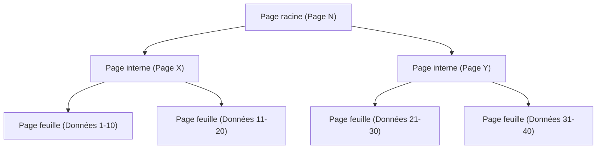
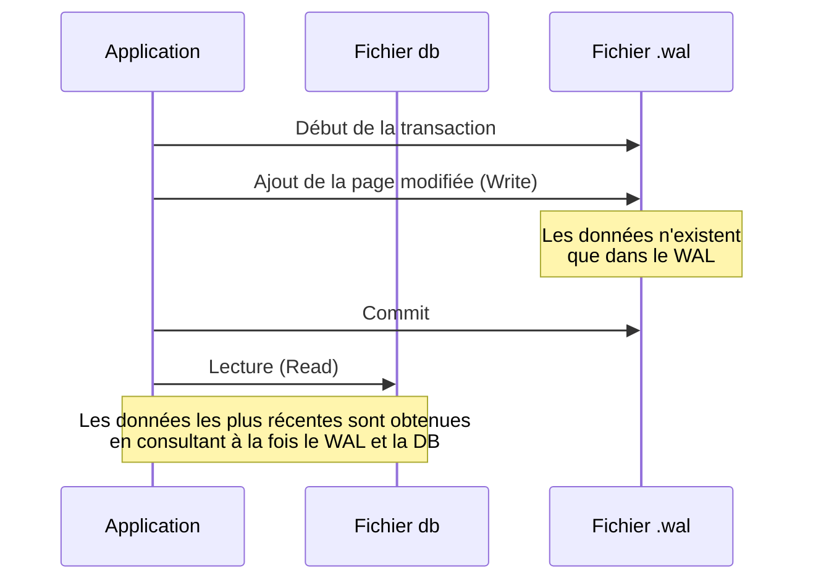

## Introduction

Dans le développement logiciel moderne, les bases de données sont indispensables. Parmi elles, on peut affirmer sans exagérer que "SQLite" est l'un des moteurs de base de données les plus utilisés au monde, allant des applications pour smartphones aux systèmes embarqués, en passant par les navigateurs web et même les serveurs web à petite échelle.

La caractéristique principale de SQLite, comme son nom l'indique, est sa "légèreté (Lite)", et surtout son architecture qui consiste à "**stocker l'intégralité des données dans un seul et unique fichier**". Contrairement aux bases de données client-serveur telles que MySQL ou PostgreSQL, SQLite fonctionne comme une bibliothèque qui s'exécute directement dans le processus de l'application.

Cependant, malgré cette structure simple basée sur un fichier unique, SQLite prend en charge des transactions avec des propriétés ACID complètes (Atomicité, Cohérence, Isolation, Durabilité). Même lorsque plusieurs processus y accèdent simultanément, les données ne sont pas corrompues.

Cet article explore comment ce mécanisme magique est réalisé, en examinant en profondeur l'architecture interne de SQLite (B-tree, WAL, mécanismes de verrouillage), avec des explications d'un point de vue pratique.

---

## 1. La magie du fichier unique : Pages et architecture B-tree

Du point de vue du système d'exploitation, le fichier de données SQLite n'est qu'un simple fichier binaire. Cependant, en interne, ce fichier est divisé et géré en blocs de taille fixe (généralement 4 Ko) appelés "pages".

### Structure des pages

L'ensemble du fichier est indexé par des numéros de page commençant à 1. La page 1 est spéciale et contient les informations d'en-tête de la base de données (version, taille de page, encodage, etc.) ainsi que le nœud racine d'une table spéciale (`sqlite_schema`) qui stocke les informations de schéma de la base de données.

Chaque page a l'un des rôles suivants :
- **Page B-tree** : Stocke les données des tables ou les données des index.
- **Page Freelist** : Page devenue un espace libre suite à une suppression.
- **Page Pointer-map** : Page permettant de suivre le déplacement des pages (lorsque certaines fonctionnalités sont activées).

### Gestion des données par B-tree

SQLite utilise la structure de données **B-tree (Arbre B)** pour rechercher, insérer et supprimer efficacement des données. Plus précisément, il utilise un "B+tree" (où seules les feuilles stockent les données) pour les données des tables, et un "B-tree" (où les nœuds internes stockent également des clés) pour les données des index.



Grâce à cette structure hiérarchique, même avec des millions d'enregistrements, il est possible d'accéder aux données souhaitées avec seulement quelques opérations d'E/S disque (lecture de pages). Cette structure arborescente sophistiquée est cartographiée au sein d'un seul fichier.

---

## 2. Le mécanisme de protection des transactions : Du Rollback Journal au WAL

L'une des tâches les plus importantes pour une base de données est la "résistance aux pannes". Il faut s'assurer que les données ne se retrouvent pas dans un état incohérent en cas de panne de courant ou de blocage du système d'exploitation pendant l'écriture des données.

Historiquement, SQLite utilisait une méthode appelée "Rollback Journal" (Journal d'annulation), mais aujourd'hui, le mode "**WAL (Write-Ahead Logging)**", qui offre de meilleures performances et une plus grande concurrence, est devenu la norme.

### Ancienne méthode : Rollback Journal

Dans la méthode du Rollback Journal, avant de modifier les données, l'"état antérieur" des pages à modifier est copié dans un autre fichier (le fichier journal).
Si la transaction échoue ou si une panne survient, ce fichier journal est utilisé au prochain démarrage pour "annuler (rollback)" les modifications et restaurer la cohérence.

Le plus grand inconvénient de cette méthode était que "pendant qu'une opération d'écriture est en cours, les autres processus ne peuvent même pas lire (la base de données entière est verrouillée)".

### Nouvelle méthode : WAL (Write-Ahead Logging)

Le mode WAL, introduit dans la version 3.7.0 de SQLite, a considérablement amélioré ce problème de concurrence.

Dans le mode WAL, les pages modifiées ne sont pas écrites directement dans le fichier de base de données d'origine, mais sont **ajoutées (append) à la fin d'un autre fichier (le fichier .wal)**.



**Avantages du WAL :**
1. **Amélioration de la concurrence** : Les opérations d'écriture étant effectuées par ajout au fichier `.wal`, elles ne bloquent pas les opérations de "lecture" se référant au fichier de base de données original. En d'autres termes, **une écriture et plusieurs lectures peuvent se dérouler simultanément**.
2. **Amélioration des performances** : Au lieu de modifier des emplacements aléatoires sur le disque, l'ajout séquentiel (continu) permet d'obtenir des performances d'E/S disque plus élevées.

Les modifications accumulées dans le fichier WAL sont réécrites dans le fichier de base de données d'origine lorsqu'elles atteignent une certaine taille ou lorsqu'une commande explicite est exécutée. Ce processus est appelé "**Checkpoint**" (Point de contrôle).

---

## 3. Contrôler les accès simultanés : Le mécanisme de verrouillage

Lorsque plusieurs processus (ou threads) accèdent simultanément à SQLite, qui est un fichier unique, un mécanisme de verrouillage est indispensable pour éviter les conflits de données.

### Les états de verrouillage de SQLite

Une connexion de base de données SQLite adopte l'un des cinq états de verrouillage suivants :

1. **UNLOCKED (Non verrouillé)** : La connexion n'accède pas à la base de données.
2. **SHARED (Verrou partagé)** : Verrou pour lire des données. Plusieurs connexions peuvent obtenir un verrou SHARED simultanément (lecture simultanée possible).
3. **RESERVED (Verrou réservé)** : Verrou déclarant l'intention d'écrire des données à l'avenir. Une seule connexion peut l'obtenir sur toute la base de données. Même dans cet état, les autres connexions peuvent continuer à obtenir des verrous SHARED.
4. **PENDING (Verrou en attente)** : État où la préparation à l'écriture est terminée, en attente de la libération des verrous SHARED actuellement actifs. L'obtention de nouveaux verrous SHARED est bloquée.
5. **EXCLUSIVE (Verrou exclusif)** : Verrou pour effectuer l'écriture réelle. Dans cet état, aucune autre connexion ne peut lire ni écrire.

### Escalade des verrous

Lors du démarrage d'une transaction pour lire ou écrire des données, SQLite élève automatiquement ces états de verrouillage par étapes (escalade).

- Lors de l'exécution d'un `SELECT`, un verrou **SHARED** est obtenu.
- Lors d'une tentative d'exécution d'un `INSERT` ou d'un `UPDATE`, un verrou **RESERVED** est d'abord obtenu.
- Au stade où la transaction est réellement validée et que les modifications sont appliquées au fichier, SQLite tente d'obtenir un verrou **EXCLUSIVE** en passant par l'état **PENDING**.

Si un autre processus maintient un verrou SHARED pendant une longue période, le processus d'écriture ne peut pas obtenir le verrou EXCLUSIVE, et une erreur `SQLITE_BUSY` (la base de données est verrouillée) se produit.

### Configuration du Busy Timeout

Dans le développement d'applications, la méthode la plus simple et la plus efficace pour gérer cette erreur `SQLITE_BUSY` consiste à définir un **délai d'attente (busy_timeout)**.

```sql
PRAGMA busy_timeout = 5000; -- Attendre 5000 millisecondes (5 secondes)
```

En configurant cela, même si le verrou ne peut pas être obtenu, le système ne renvoie pas immédiatement une erreur, mais réessaie de manière répétée pendant le temps spécifié. En définissant un délai d'attente approprié, vous pouvez éviter la plupart des erreurs dans le cas d'accès simultanés à petite ou moyenne échelle.

---

## 4. Bonnes pratiques pour maximiser les performances

Après avoir compris la structure interne de SQLite, voici quelques configurations pratiques (PRAGMA) pour maximiser les performances et la sécurité de votre application.

### 1. Activer le mode WAL
Comme mentionné précédemment, c'est indispensable s'il y a des accès simultanés.
```sql
PRAGMA journal_mode = WAL;
```

### 2. Optimisation du mode de synchronisation
En le combinant avec le mode WAL, même si le mode de synchronisation est réduit à `NORMAL`, le risque de corruption des données est extrêmement faible et les performances d'écriture sont considérablement améliorées.
```sql
PRAGMA synchronous = NORMAL;
```

### 3. Augmenter le cache en mémoire
En augmentant le nombre de pages que SQLite peut mettre en cache dans la RAM, vous réduisez les E/S disque (la valeur par défaut est de 2000 pages).
```sql
-- Spécifier une taille de cache négative définit la valeur en Ko. Voici 64 Mo.
PRAGMA cache_size = -64000; 
```

### 4. Lecture rapide avec mmap
L'activation des E/S mappées en mémoire (mmap) accélère la lecture en utilisant le mécanisme de mémoire virtuelle du système d'exploitation pour accéder directement au fichier.
```sql
PRAGMA mmap_size = 30000000000;
```

---

## Conclusion

Derrière l'apparence extrêmement simple d'un "fichier unique", SQLite cache une structure de données sophistiquée basée sur le B-tree, une gestion avancée des transactions avec le WAL, et un mécanisme de verrouillage raffiné.

C'est une grande erreur de penser que "parce qu'il est léger, il ne peut pas être utilisé pour des applications sérieuses". En comprenant correctement son architecture interne et en appliquant les paramètres appropriés (comme l'activation du mode WAL et la configuration d'un délai d'attente), SQLite offre des performances et une stabilité remarquables.

La prochaine fois que vous choisirez une base de données pour votre projet, la "base de données la plus utilisée au monde" pourrait bien s'avérer être l'option la plus logique.
