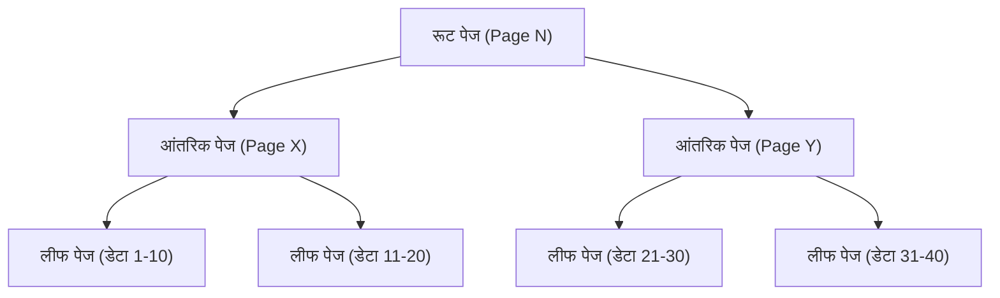
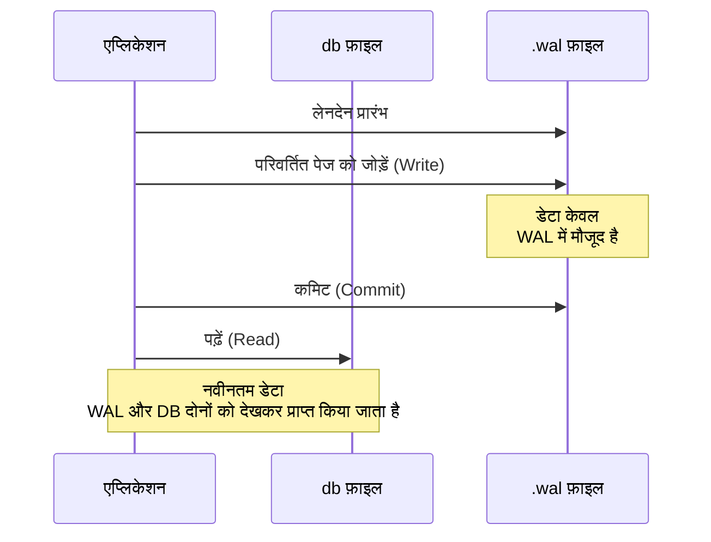

## प्रस्तावना

आधुनिक सॉफ्टवेयर विकास में, डेटाबेस एक अनिवार्य उपस्थिति हैं। इनमें से, "SQLite" स्मार्टफोन ऐप्स से लेकर एम्बेडेड सिस्टम, वेब ब्राउज़र और यहां तक ​​कि छोटे वेब सर्वर तक दुनिया में सबसे व्यापक रूप से उपयोग किए जाने वाले डेटाबेस इंजनों में से एक है, यह कहना अतिशयोक्ति नहीं होगी।

SQLite की सबसे बड़ी विशेषता, जैसा कि इसके नाम से पता चलता है, यह है कि यह "लाइट (हल्का)" है, और सबसे बढ़कर, इसका आर्किटेक्चर "**संपूर्ण डेटा को सिर्फ एक फ़ाइल में संग्रहीत करता है**"। MySQL या PostgreSQL जैसे क्लाइंट-सर्वर डेटाबेस के विपरीत, SQLite एक लाइब्रेरी के रूप में कार्य करता है जो सीधे एप्लिकेशन की प्रक्रिया के भीतर चलता है।

हालाँकि, एकल फ़ाइल की अपनी सरल संरचना के बावजूद, SQLite पूर्ण ACID गुणों (परमाणुता, स्थिरता, अलगाव, स्थायित्व) के साथ लेनदेन का समर्थन करता है। यहां तक ​​कि जब कई प्रक्रियाएं एक साथ डेटा तक पहुंचती हैं, तब भी डेटा दूषित नहीं होता है।

इस लेख में, हम गहराई से जानेंगे कि SQLite की आंतरिक संरचना (B-tree, WAL, लॉकिंग तंत्र) के माध्यम से यह जादुई तंत्र कैसे प्राप्त किया जाता है, और इसे व्यावहारिक दृष्टिकोण से समझाएंगे।

---

## 1. एकल फ़ाइल का जादू: पेज और B-tree आर्किटेक्चर

OS के दृष्टिकोण से, SQLite डेटा फ़ाइल केवल एक बाइनरी फ़ाइल है। हालाँकि, SQLite के अंदर, इस फ़ाइल को प्रबंधित करने के लिए "पेज" नामक निश्चित आकार के ब्लॉकों (आमतौर पर 4KB) में विभाजित किया जाता है।

### पेज की संरचना

पूरी फ़ाइल को 1 से शुरू होने वाले पेज नंबरों द्वारा अनुक्रमित किया गया है। पेज 1 एक विशेष पेज है, जिसमें डेटाबेस हेडर जानकारी (संस्करण, पेज का आकार, एन्कोडिंग, आदि) और डेटाबेस स्कीमा जानकारी संग्रहीत करने वाली विशेष टेबल (`sqlite_schema`) का रूट नोड होता है।

प्रत्येक पेज की निम्नलिखित भूमिकाओं में से एक होती है:
- **B-tree पेज**: टेबल डेटा और इंडेक्स डेटा संग्रहीत करता है
- **फ्रीलिस्ट पेज**: वे पेज जिन्हें हटा दिया गया है और अब खाली स्थान हैं
- **पॉइंटर मैप पेज**: पेजों की आवाजाही को ट्रैक करने वाले पेज (विशिष्ट सुविधाएँ सक्षम होने पर)

### B-tree के माध्यम से डेटा प्रबंधन

डेटा को कुशलतापूर्वक खोजने, सम्मिलित करने और हटाने के लिए SQLite **B-tree** डेटा संरचना को अपनाता है। विशेष रूप से, यह टेबल डेटा के लिए "B+tree (केवल लीफ नोड्स में डेटा संग्रहीत करता है)" और इंडेक्स डेटा के लिए "B-tree (आंतरिक नोड्स में भी कुंजियाँ संग्रहीत करता है)" का उपयोग करता है।



इस पदानुक्रमित संरचना के साथ, भले ही लाखों रिकॉर्ड हों, आप केवल कुछ डिस्क I/O (पेज रीड्स) के साथ वांछित डेटा तक पहुंच सकते हैं। यह विस्तृत ट्री संरचना एक ही फ़ाइल में मैप की गई है।

---

## 2. लेनदेन को सुरक्षित करने का तंत्र: रोलबैक जर्नल से WAL तक

डेटाबेस में सबसे महत्वपूर्ण कार्यों में से एक "क्रैश के प्रति लचीलापन" है। यदि डेटा लिखते समय पावर आउटेज या OS फ्रीज हो जाता है, तो हमें यह सुनिश्चित करना चाहिए कि डेटा असंगत स्थिति में न जाए।

ऐतिहासिक रूप से, SQLite ने "रोलबैक जर्नल (Rollback Journal)" दृष्टिकोण का उपयोग किया था, लेकिन आज, उत्कृष्ट प्रदर्शन और समवर्तीता (Concurrency) के साथ "**WAL (Write-Ahead Logging)**" मोड मुख्यधारा बन गया है।

### पुरानी विधि: रोलबैक जर्नल

रोलबैक जर्नल पद्धति में, डेटा को अधिलेखित करने से पहले, बदले जा रहे पेज की "परिवर्तन से पहले की स्थिति" को एक अलग फ़ाइल (जर्नल फ़ाइल) में कॉपी किया जाता है।
यदि कोई लेनदेन विफल हो जाता है या क्रैश हो जाता है, तो अगली बार डेटाबेस शुरू होने पर यह जर्नल फ़ाइल परिवर्तनों को "रोलबैक" करने और स्थिरता बहाल करने के लिए उपयोग की जाती है।

इस पद्धति का सबसे बड़ा नुकसान यह था कि "जब कोई लेखन प्रक्रिया चल रही होती है, तो अन्य प्रक्रियाएं पढ़ भी नहीं सकती हैं (पूरा डेटाबेस लॉक हो जाता है)।"

### नई विधि: WAL (Write-Ahead Logging)

SQLite संस्करण 3.7.0 में पेश किए गए WAL मोड ने इस समवर्तीता की समस्या में नाटकीय रूप से सुधार किया है।

WAL मोड में, संशोधित पेजों को सीधे मूल डेटाबेस फ़ाइल में नहीं लिखा जाता है, बल्कि **एक अलग फ़ाइल (.wal फ़ाइल) के अंत में जोड़ा (Append) जाता है**।



**WAL के लाभ:**
1. **बेहतर समवर्तीता (Concurrency)**: चूँकि लेखन प्रक्रिया `.wal` फ़ाइल में जोड़कर की जाती है, यह मूल डेटाबेस फ़ाइल का संदर्भ देने वाली "पढ़ने की प्रक्रिया" को अवरुद्ध नहीं करती है। दूसरे शब्दों में, **एक लेखन और कई पठन एक साथ आगे बढ़ सकते हैं**।
2. **प्रदर्शन में सुधार**: डिस्क पर यादृच्छिक (random) स्थानों को अधिलेखित करने बजाय क्रमिक रूप से जोड़ने के कारण, डिस्क I/O प्रदर्शन बहुत अधिक है।

WAL फ़ाइल में जमा हुए परिवर्तन एक निश्चित आकार तक पहुँचने पर, या जब कोई कमांड स्पष्ट रूप से निष्पादित किया जाता है, तो उन्हें मूल डेटाबेस फ़ाइल में वापस लिख दिया जाता है। इस प्रक्रिया को "**चेकपॉइंट (Checkpoint)**" कहा जाता है।

---

## 3. समवर्ती पहुँच को नियंत्रित करना: लॉकिंग तंत्र

जब कई प्रक्रियाएँ (या थ्रेड) एक साथ SQLite जैसी एकल फ़ाइल तक पहुँचती हैं, तो डेटा विवादों को रोकने के लिए एक लॉकिंग तंत्र आवश्यक है।

### SQLite की लॉक स्थितियाँ

SQLite डेटाबेस कनेक्शन निम्नलिखित 5 लॉक स्थितियों में से एक लेते हैं:

1. **UNLOCKED (अनलॉक)**: कनेक्शन डेटाबेस तक नहीं पहुँच रहा है।
2. **SHARED (शेयर्ड लॉक)**: डेटा पढ़ने के लिए एक लॉक। कई कनेक्शन एक ही समय में SHARED लॉक प्राप्त कर सकते हैं (एक साथ पढ़ना संभव है)।
3. **RESERVED (रिज़र्व्ड लॉक)**: एक लॉक जो भविष्य में डेटा लिखने के इरादे की घोषणा करता है। पूरे डेटाबेस में केवल एक ही कनेक्शन इसे प्राप्त कर सकता है। इस अवस्था में भी, अन्य कनेक्शन SHARED लॉक प्राप्त करना जारी रख सकते हैं।
4. **PENDING (पेंडिंग लॉक)**: लेखन की तैयारी पूरी हो गई है और यह वर्तमान में सक्रिय SHARED लॉक के रिलीज़ होने की प्रतीक्षा कर रहा है। नए SHARED लॉक का अधिग्रहण अवरुद्ध कर दिया जाता है।
5. **EXCLUSIVE (एक्सक्लूसिव लॉक)**: वास्तविक लेखन करने के लिए एक लॉक। इस स्थिति में, कोई अन्य कनेक्शन पढ़ या लिख नहीं सकता है।

### लॉक एस्केलेशन (Lock Escalation)

जब आप लेनदेन शुरू करते हैं और डेटा पढ़ते और लिखते हैं, तो SQLite स्वचालित रूप से चरण दर चरण (एस्केलेशन) इन लॉक स्थितियों को बढ़ाता है।

- `SELECT` निष्पादित करने पर, एक **SHARED** लॉक प्राप्त होता है।
- `INSERT` या `UPDATE` निष्पादित करने का प्रयास करते समय, यह पहले **RESERVED** लॉक प्राप्त करता है।
- उस स्तर पर जहां लेनदेन वास्तव में कमिट किया जाता है और परिवर्तन फ़ाइल में परिलक्षित होते हैं, यह **PENDING** के माध्यम से **EXCLUSIVE** लॉक प्राप्त करने का प्रयास करता है।

यदि कोई अन्य प्रक्रिया लंबे समय तक SHARED लॉक रखती है, तो लेखन प्रक्रिया EXCLUSIVE लॉक प्राप्त नहीं कर सकती है, और एक `SQLITE_BUSY` (डेटाबेस लॉक है) त्रुटि उत्पन्न होगी।

### Busy Timeout सेट करना

एप्लिकेशन डेवलपमेंट में, इस `SQLITE_BUSY` त्रुटि से निपटने का सबसे सरल और सबसे प्रभावी तरीका **टाइमआउट (busy_timeout)** सेट करना है।

```sql
PRAGMA busy_timeout = 5000; -- 5000 मिलीसेकंड (5 सेकंड) प्रतीक्षा करें
```

इसे सेट करके, यदि लॉक प्राप्त नहीं किया जा सकता है तो यह तुरंत एक त्रुटि वापस करने के बजाय निर्दिष्ट समय के लिए पुनः प्रयास करना दोहराता है। उचित रूप से टाइमआउट सेट करके, छोटे से मध्यम आकार की समवर्ती पहुँच के लिए अधिकांश त्रुटियों से बचा जा सकता है।

---

## 4. प्रदर्शन को अधिकतम करने के लिए सर्वोत्तम अभ्यास

SQLite की आंतरिक संरचना को समझने के बाद, यहां आपके एप्लिकेशन के प्रदर्शन और सुरक्षा को अधिकतम करने के लिए कुछ व्यावहारिक सेटिंग्स (PRAGMA) दी गई हैं।

### 1. WAL मोड सक्षम करना
जैसा कि ऊपर उल्लेख किया गया है, समवर्ती पहुँच होने पर यह अनिवार्य है।
```sql
PRAGMA journal_mode = WAL;
```

### 2. सिंक्रनाइज़ेशन मोड का अनुकूलन
जब WAL मोड के साथ जोड़ा जाता है, तब भी जब सिंक्रनाइज़ेशन मोड को `NORMAL` पर कम कर दिया जाता है, डेटा भ्रष्टाचार का जोखिम बेहद कम होता है, और लेखन प्रदर्शन में नाटकीय रूप से सुधार होता है।
```sql
PRAGMA synchronous = NORMAL;
```

### 3. मेमोरी कैश बढ़ाना
रैम में कैश किए जा सकने वाले पेजों की संख्या बढ़ाकर SQLite डिस्क I/O को कम कर देता है। (डिफ़ॉल्ट 2000 पेज है)
```sql
-- यदि आप कैश आकार को ऋणात्मक मान के साथ निर्दिष्ट करते हैं, तो यह KB में होगा। निम्नलिखित 64MB है।
PRAGMA cache_size = -64000; 
```

### 4. mmap के माध्यम से तेज़ पठन
जब Memory-mapped I/O (mmap) सक्षम होता है, तो यह फ़ाइल को सीधे एक्सेस करने के लिए OS के वर्चुअल मेमोरी तंत्र का उपयोग करता है, इस प्रकार पढ़ने में तेज़ी आती है।
```sql
PRAGMA mmap_size = 30000000000;
```

---

## निष्कर्ष

SQLite के "एकल फ़ाइल" के बेहद सरल बाहरी हिस्से के पीछे B-tree के माध्यम से एक विस्तृत डेटा संरचना, WAL के माध्यम से उन्नत लेनदेन प्रबंधन और एक परिष्कृत लॉकिंग तंत्र छिपा है।

यह एक बड़ी गलतफहमी है कि "क्योंकि यह हल्का है, इसे गंभीर अनुप्रयोगों के लिए उपयोग नहीं किया जा सकता है।" इसके आंतरिक आर्किटेक्चर को सही ढंग से समझकर और उचित सेटिंग्स (जैसे WAL मोड सक्षम करना और टाइमआउट सेट करना) करके, SQLite अद्भुत प्रदर्शन और स्थिरता प्रदान करता है।

अगली बार जब आप अपने प्रोजेक्ट के लिए डेटाबेस चुनते हैं, तो यह "दुनिया में सबसे अधिक इस्तेमाल किया जाने वाला डेटाबेस" वास्तव में सबसे तार्किक विकल्प हो सकता है।
