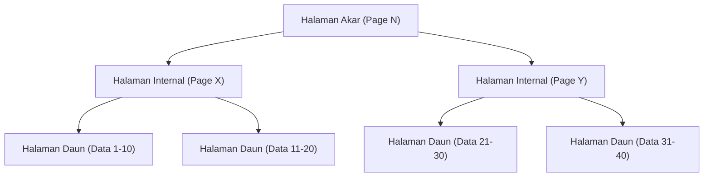
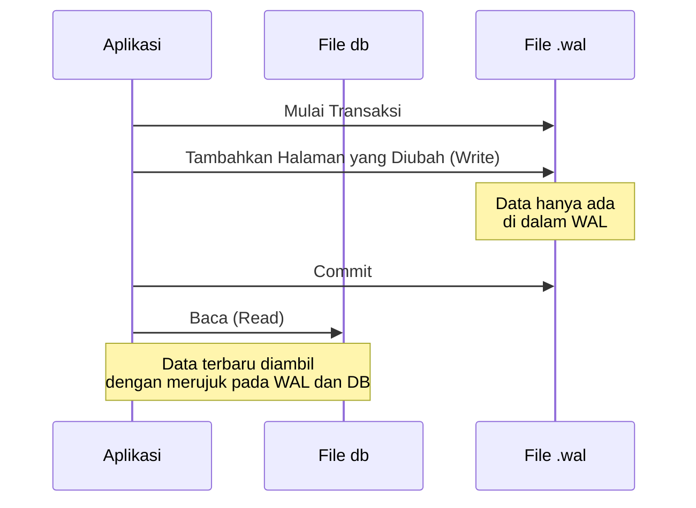

## Pendahuluan

Dalam pengembangan perangkat lunak modern, basis data adalah keberadaan yang sangat penting. Di antaranya, "SQLite", yang digunakan mulai dari aplikasi ponsel cerdas hingga sistem tertanam (embedded systems), peramban web, dan bahkan server web berskala kecil, dapat dikatakan sebagai salah satu mesin basis data yang paling banyak digunakan di dunia.

Karakteristik terbesar SQLite, seperti namanya yang berarti "ringan (Lite)", dan yang terpenting, arsitekturnya yang "**menyimpan seluruh data hanya dalam satu file**". Berbeda dengan basis data tipe klien-server seperti MySQL atau PostgreSQL, SQLite berfungsi sebagai pustaka (library) yang beroperasi langsung di dalam proses aplikasi.

Namun, meskipun memiliki struktur yang sederhana berupa file tunggal, SQLite mendukung transaksi yang dilengkapi dengan properti ACID (Atomicity, Consistency, Isolation, Durability) sepenuhnya. Bahkan ketika diakses oleh beberapa proses secara bersamaan, data tidak akan mengalami kerusakan.

Dalam artikel ini, kita akan menggali lebih dalam tentang bagaimana keajaiban ini diwujudkan, dengan membahas arsitektur internal SQLite (B-tree, WAL, mekanisme penguncian), dan menjelaskannya dari sudut pandang praktis.

---

## 1. Keajaiban File Tunggal: Arsitektur Halaman (Page) dan B-tree

File data SQLite, jika dilihat dari OS, hanyalah sebuah file biner biasa. Namun, di dalam SQLite, file ini dibagi dan dikelola dalam blok berukuran tetap (biasanya 4KB) yang disebut "halaman (page)".

### Struktur Halaman

Seluruh file diindeks dengan nomor halaman yang dimulai dari 1. Halaman 1 adalah halaman khusus yang berisi informasi header basis data (versi, ukuran halaman, pengkodean (encoding), dll.), serta simpul akar (root node) dari tabel khusus (`sqlite_schema`) yang menyimpan informasi skema basis data.

Setiap halaman memiliki salah satu peran berikut:
- **Halaman B-tree**: Menyimpan data tabel atau data indeks.
- **Halaman Freelist**: Halaman yang telah dihapus dan menjadi ruang kosong.
- **Halaman Peta Pointer (Pointer Map Page)**: Halaman untuk melacak pergerakan halaman (saat fitur tertentu diaktifkan).

### Manajemen Data dengan B-tree

Untuk mencari, menyisipkan, dan menghapus data secara efisien, SQLite mengadopsi struktur data **B-tree (B-pohon)**. Secara khusus, SQLite menggunakan "B+tree (hanya menyimpan data di simpul daun)" untuk data tabel, dan "B-tree (juga menyimpan kunci di simpul internal)" untuk data indeks.



Dengan struktur hierarki ini, meskipun terdapat jutaan rekaman, data yang dituju dapat dicapai hanya dengan beberapa kali I/O disk (pembacaan halaman). Struktur pohon yang rumit ini dipetakan di dalam sebuah file tunggal.

---

## 2. Mekanisme Melindungi Transaksi: Dari Rollback Journal hingga WAL

Salah satu tugas terpenting dalam basis data adalah "ketahanan terhadap kerusakan (crash)". Bahkan jika terjadi pemadaman listrik atau OS macet (freeze) di tengah penulisan data, kita harus memastikan bahwa data tidak jatuh ke dalam keadaan yang tidak konsisten.

Secara historis, SQLite menggunakan metode yang disebut "Rollback Journal", tetapi saat ini, mode "**WAL (Write-Ahead Logging)**", yang unggul dalam kinerja dan konkurensi, telah menjadi arus utama.

### Metode Lama: Rollback Journal

Dalam metode Rollback Journal, sebelum data diubah, "keadaan sebelum perubahan" dari halaman yang akan diubah disalin ke file lain (file journal).
Jika transaksi gagal atau terjadi crash, pada saat dihidupkan ulang (startup) berikutnya, perubahan tersebut akan di-"rollback (dikembalikan)" menggunakan file journal ini untuk memulihkan konsistensi.

Kekurangan terbesar dari metode ini adalah bahwa "selama proses penulisan berlangsung, proses lain bahkan tidak dapat melakukan pembacaan (seluruh basis data dikunci)".

### Metode Baru: WAL (Write-Ahead Logging)

Mode WAL, yang diperkenalkan pada SQLite versi 3.7.0 dan setelahnya, secara drastis memperbaiki masalah konkurensi ini.

Dalam mode WAL, halaman yang diubah tidak langsung ditulis ke file basis data asli, melainkan **ditambahkan (append) ke akhir file lain (file .wal)**.



**Keuntungan WAL:**
1. **Peningkatan Konkurensi**: Karena proses penulisan dilakukan dengan menambahkan (append) ke file `.wal`, proses ini tidak memblokir "proses pembacaan" yang merujuk pada file basis data asli. Dengan kata lain, **satu penulisan dan beberapa pembacaan dapat berlangsung secara bersamaan**.
2. **Peningkatan Kinerja**: Kinerja I/O disk menjadi lebih tinggi karena penulisan dilakukan secara berurutan (sekuensial) ke akhir file, bukan dengan menulis ulang (overwrite) lokasi acak pada disk.

Perubahan yang terakumulasi di dalam file WAL akan ditulis kembali ke file basis data asli ketika ukurannya mencapai batas tertentu, atau pada saat perintah dijalankan secara eksplisit. Proses ini disebut "**Checkpoint**".

---

## 3. Mengontrol Akses Bersamaan: Mekanisme Penguncian (Lock)

Ketika beberapa proses (atau thread) mengakses SQLite yang merupakan file tunggal secara bersamaan, mekanisme penguncian sangat penting untuk mencegah konflik data (data race).

### Status Penguncian SQLite

Koneksi basis data SQLite mengambil salah satu dari 5 status penguncian berikut:

1. **UNLOCKED (Tidak Terkunci)**: Status di mana koneksi tidak mengakses basis data.
2. **SHARED (Kunci Bersama)**: Kunci untuk membaca data. Beberapa koneksi dapat memperoleh kunci SHARED secara bersamaan (pembacaan bersamaan dimungkinkan).
3. **RESERVED (Kunci Pesanan)**: Kunci yang mendeklarasikan niat untuk menulis data di masa mendatang. Hanya 1 koneksi yang dapat memperolehnya di seluruh basis data. Bahkan dalam status ini, koneksi lain dapat terus memperoleh kunci SHARED.
4. **PENDING (Kunci Tertunda)**: Status di mana persiapan penulisan telah selesai, dan sedang menunggu kunci SHARED yang sedang aktif untuk dilepaskan. Perolehan kunci SHARED baru diblokir.
5. **EXCLUSIVE (Kunci Eksklusif)**: Kunci untuk melakukan penulisan yang sebenarnya. Dalam status ini, koneksi lain mana pun tidak dapat membaca atau menulis.

### Eskalasi Kunci

Saat memulai transaksi untuk membaca dan menulis data, SQLite secara otomatis meningkatkan status penguncian ini secara bertahap (eskalasi).

- Ketika mengeksekusi `SELECT`, SQLite memperoleh kunci **SHARED**.
- Ketika mencoba mengeksekusi `INSERT` atau `UPDATE`, SQLite pertama-tama memperoleh kunci **RESERVED**.
- Pada tahap di mana transaksi benar-benar di-commit dan perubahan direfleksikan ke dalam file, SQLite mencoba memperoleh kunci **EXCLUSIVE** melalui status **PENDING**.

Jika proses lain menahan kunci SHARED untuk waktu yang lama, proses penulisan tidak dapat memperoleh kunci EXCLUSIVE, dan akan muncul kesalahan (error) `SQLITE_BUSY` (basis data terkunci).

### Pengaturan Busy Timeout

Dalam pengembangan aplikasi, metode paling sederhana dan efektif untuk menangani kesalahan `SQLITE_BUSY` ini adalah dengan mengatur **batas waktu (busy_timeout)**.

```sql
PRAGMA busy_timeout = 5000; -- Menunggu 5000 milidetik (5 detik)
```

Dengan mengatur ini, bahkan jika kunci tidak dapat diperoleh, SQLite tidak akan langsung mengembalikan kesalahan, melainkan akan mengulang percobaan selama waktu yang ditentukan. Dengan mengatur batas waktu secara tepat, sebagian besar kesalahan dapat dihindari untuk akses bersamaan skala kecil hingga menengah.

---

## 4. Praktik Terbaik untuk Memaksimalkan Kinerja

Setelah memahami arsitektur internal SQLite, berikut adalah beberapa pengaturan praktis (PRAGMA) untuk memaksimalkan kinerja dan keamanan aplikasi.

### 1. Mengaktifkan Mode WAL
Seperti yang disebutkan sebelumnya, ini wajib dilakukan jika ada akses bersamaan.
```sql
PRAGMA journal_mode = WAL;
```

### 2. Optimalisasi Mode Sinkronisasi
Ketika dikombinasikan dengan mode WAL, menurunkan mode sinkronisasi ke `NORMAL` membuat risiko kerusakan data menjadi sangat rendah, sementara kinerja penulisan meningkat secara drastis.
```sql
PRAGMA synchronous = NORMAL;
```

### 3. Meningkatkan Cache Memori
Mengurangi I/O disk dengan meningkatkan jumlah halaman yang dapat di-cache (disimpan) SQLite ke dalam RAM. (Default adalah 2000 halaman)
```sql
-- Jika ukuran cache ditentukan dengan nilai negatif, satuannya adalah KB. Berikut ini adalah 64MB.
PRAGMA cache_size = -64000; 
```

### 4. Pembacaan Cepat dengan mmap
Jika Memory-mapped I/O (mmap) diaktifkan, SQLite akan mengakses file secara langsung menggunakan mekanisme memori virtual OS, sehingga mempercepat pembacaan.
```sql
PRAGMA mmap_size = 30000000000;
```

---

## Penutup

Di balik tampilan "file tunggal" yang sangat sederhana, SQLite menyembunyikan struktur data yang rumit menggunakan B-tree, manajemen transaksi tingkat lanjut menggunakan WAL, dan mekanisme penguncian yang canggih.

"Tidak bisa digunakan untuk penggunaan serius karena ringan" adalah kesalahpahaman besar. Dengan memahami arsitektur internalnya secara benar dan melakukan pengaturan yang tepat (seperti mengaktifkan mode WAL dan mengatur batas waktu), SQLite akan menunjukkan kinerja dan stabilitas yang luar biasa.

Lain kali saat Anda memilih basis data untuk proyek Anda, "basis data yang paling banyak digunakan di dunia" ini, mungkin saja menjadi pilihan yang paling masuk akal.
