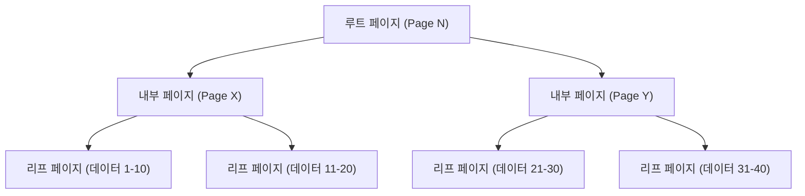
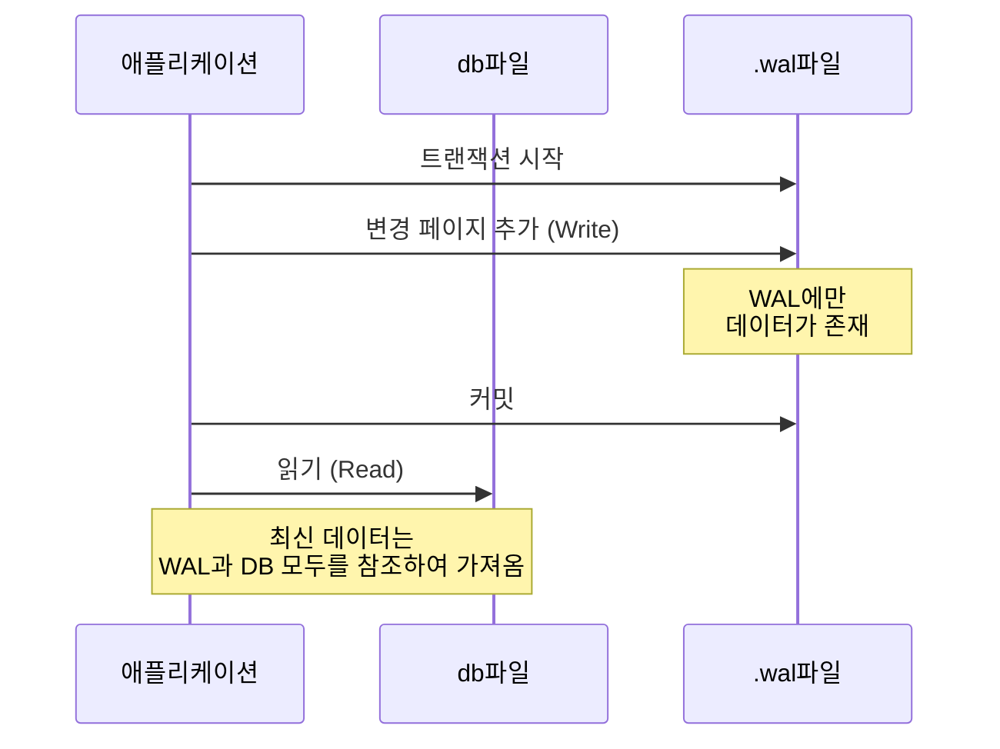

## 들어가며

현대의 소프트웨어 개발에 있어서 데이터베이스는 불가결한 존재입니다. 그중에서도 "SQLite"는 스마트폰 앱부터 임베디드 시스템, 웹 브라우저, 나아가 소규모 웹 서버에 이르기까지 전 세계에서 가장 널리 사용되는 데이터베이스 엔진 중 하나라고 해도 과언이 아닙니다.

SQLite의 가장 큰 특징은 그 이름대로 "가볍다(Lite)"는 것, 그리고 무엇보다 "**데이터 전체를 단 하나의 파일에 저장한다**"는 아키텍처에 있습니다. MySQL이나 PostgreSQL 같은 클라이언트-서버형 데이터베이스와 달리, SQLite는 애플리케이션의 프로세스 내에서 직접 동작하는 라이브러리로서 기능합니다.

그러나 단일 파일이라는 단순한 구조이면서도 SQLite는 완전한 ACID 특성(원자성, 일관성, 고립성, 지속성)을 갖춘 트랜잭션을 지원합니다. 여러 프로세스가 동시에 접근하더라도 데이터가 손상되지 않습니다.

본 기사에서는 이 마법 같은 메커니즘이 어떻게 실현되고 있는지, SQLite의 내부 구조(B-tree, WAL, 잠금 메커니즘)를 깊이 파헤치고 실천적인 관점에서 해설합니다.

---

## 1. 단일 파일의 마법: 페이지와 B-tree 아키텍처

SQLite의 데이터 파일은 OS에서 보면 단순한 바이너리 파일에 불과합니다. 하지만 SQLite 내부에서 이 파일은 "페이지"라고 불리는 고정 크기의 블록(일반적으로 4KB)으로 분할되어 관리됩니다.

### 페이지의 구조

파일 전체는 1부터 시작하는 페이지 번호로 인덱싱됩니다. 페이지 1은 특별한 페이지로, 데이터베이스의 헤더 정보(버전, 페이지 크기, 인코딩 등)와 데이터베이스의 스키마 정보를 저장하는 특별한 테이블(`sqlite_schema`)의 루트 노드를 포함합니다.

각 페이지는 다음 중 하나의 역할을 가집니다.
- **B-tree 페이지**: 테이블의 데이터나 인덱스의 데이터를 저장
- **프리리스트(Freelist) 페이지**: 삭제되어 빈 영역이 된 페이지
- **포인터 맵 페이지**: 페이지의 이동을 추적하기 위한 페이지(특정 기능 활성화 시)

### B-tree를 통한 데이터 관리

SQLite는 데이터를 효율적으로 검색·삽입·삭제하기 위해 **B-tree(B-트리)** 데이터 구조를 채택하고 있습니다. 구체적으로는, 테이블 데이터에는 "B+tree(리프 노드에만 데이터를 저장)", 인덱스 데이터에는 "B-tree(내부 노드에도 키를 저장)"를 사용하고 있습니다.



이 계층 구조를 통해 수백만 건의 레코드가 존재하더라도 단 몇 번의 디스크 I/O(페이지 읽기)만으로 원하는 데이터에 도달할 수 있습니다. 단일 파일 안에 이 정교한 트리 구조가 매핑되어 있는 것입니다.

---

## 2. 트랜잭션을 지키는 메커니즘: 롤백 저널에서 WAL로

데이터베이스에서 가장 중요한 과제 중 하나가 "충돌에 대한 내성"입니다. 데이터 쓰기 도중 정전이나 OS의 프리징이 발생하더라도 데이터가 불일치 상태에 빠지지 않도록 해야 합니다.

SQLite는 역사적으로 "롤백 저널(Rollback Journal)"이라는 방식을 사용해왔지만, 현재는 성능과 동시성이 뛰어난 "**WAL(Write-Ahead Logging)**" 모드가 주류가 되었습니다.

### 이전 방식: 롤백 저널

롤백 저널 방식에서는 데이터를 덮어쓰기 전에, 변경될 페이지의 "변경 전 상태"를 다른 파일(저널 파일)에 복사합니다.
만약 트랜잭션이 실패하거나 충돌할 경우, 다음번 시작 시 이 저널 파일을 사용하여 변경을 "롤백(되돌리기)"하고 정합성을 회복합니다.

이 방식의 가장 큰 단점은 "쓰기 처리가 진행되는 동안에는 다른 프로세스가 읽기조차 불가능해진다(데이터베이스 전체가 잠긴다)"는 점이었습니다.

### 새로운 방식: WAL(Write-Ahead Logging)

SQLite 버전 3.7.0 이후 도입된 WAL 모드는 이 동시성 문제를 극적으로 개선했습니다.

WAL 모드에서는 변경된 페이지가 원본 데이터베이스 파일에 직접 기록되는 것이 아니라, **다른 파일(.wal 파일)의 끝에 추가(어펜드)**됩니다.



**WAL의 장점:**
1. **동시성 향상**: 쓰기 처리는 `.wal` 파일에 추가하는 방식으로 이루어지므로, 원본 데이터베이스 파일을 참조하는 "읽기 처리"를 차단하지 않습니다. 즉, **하나의 쓰기와 여러 읽기가 동시에 진행 가능**해집니다.
2. **성능 향상**: 디스크 상의 무작위 위치를 덮어쓰는 것이 아니라 순차적인 추가 쓰기를 수행하므로 디스크 I/O의 성능이 높아집니다.

WAL 파일에 축적된 변경 사항은 일정 크기에 도달하거나 명시적으로 명령이 실행되는 시점에 원본 데이터베이스 파일에 다시 기록됩니다. 이 처리를 "**체크포인트(Checkpoint)**"라고 부릅니다.

---

## 3. 동시 접근 제어: 잠금 메커니즘

단일 파일인 SQLite에 여러 프로세스(또는 스레드)가 동시에 접근하는 경우, 데이터 충돌을 방지하기 위한 잠금(Lock) 메커니즘이 필수적입니다.

### SQLite의 잠금 상태

SQLite의 데이터베이스 연결은 다음 5가지 잠금 상태 중 하나를 취합니다.

1. **UNLOCKED(잠금 없음)**: 연결이 데이터베이스에 접근하지 않은 상태.
2. **SHARED(공유 잠금)**: 데이터를 읽기 위한 잠금. 여러 연결이 동시에 SHARED 잠금을 얻을 수 있습니다(동시 읽기 가능).
3. **RESERVED(예약 잠금)**: 장래에 데이터를 쓸 예정임을 선언하는 잠금. 데이터베이스 전체에서 1개의 연결만 얻을 수 있습니다. 이 상태에서도 다른 연결은 계속해서 SHARED 잠금을 얻을 수 있습니다.
4. **PENDING(보류 잠금)**: 쓰기 준비가 완료되어 현재 활성화된 SHARED 잠금이 해제되기를 기다리는 상태. 새로운 SHARED 잠금의 획득은 차단됩니다.
5. **EXCLUSIVE(배타적 잠금)**: 실제 쓰기를 수행하기 위한 잠금. 이 상태에서는 다른 어떠한 연결도 읽고 쓸 수 없습니다.

### 잠금 에스컬레이션

트랜잭션을 시작하고 데이터를 읽고 쓸 때, SQLite는 자동으로 이러한 잠금 상태를 단계적으로 끌어올립니다(에스컬레이션).

- `SELECT`를 실행하면 **SHARED** 잠금을 얻습니다.
- `INSERT`나 `UPDATE`를 실행하려고 하면 먼저 **RESERVED** 잠금을 얻습니다.
- 실제로 트랜잭션을 커밋하여 파일에 변경을 반영하는 단계에서, **PENDING**을 거쳐 **EXCLUSIVE** 잠금을 얻으려 시도합니다.

만약 다른 프로세스가 장시간 SHARED 잠금을 유지하고 있다면, 쓰기 프로세스는 EXCLUSIVE 잠금을 얻지 못하고 `SQLITE_BUSY`(데이터베이스가 잠겨 있음)라는 오류가 발생합니다.

### Busy Timeout 설정

애플리케이션 개발에 있어 이 `SQLITE_BUSY` 오류에 대처하는 가장 단순하고 효과적인 방법은 **타임아웃(busy_timeout)**을 설정하는 것입니다.

```sql
PRAGMA busy_timeout = 5000; -- 5000밀리초(5초) 대기한다
```

이를 설정해 두면 잠금을 얻을 수 없는 경우에도 즉시 오류를 반환하지 않고 지정된 시간 동안 재시도를 반복해 줍니다. 적절하게 타임아웃을 설정함으로써, 중소규모의 동시 접근이라면 대부분의 오류를 회피할 수 있습니다.

---

## 4. 성능 극대화를 위한 모범 사례

SQLite의 내부 구조를 이해한 바탕 위에 애플리케이션의 성능과 안전성을 극대화하기 위한 실천적인 설정(PRAGMA)을 몇 가지 소개합니다.

### 1. WAL 모드 활성화
앞서 언급했듯이, 동시 접근이 있는 경우 필수입니다.
```sql
PRAGMA journal_mode = WAL;
```

### 2. 동기화 모드 최적화
WAL 모드와 조합할 경우, 동기화 모드를 `NORMAL`로 낮추어도 데이터 손상 위험은 극히 낮으며 쓰기 성능이 극적으로 향상됩니다.
```sql
PRAGMA synchronous = NORMAL;
```

### 3. 메모리 캐시 증량
SQLite가 RAM에 캐시할 수 있는 페이지 수를 늘려 디스크 I/O를 줄입니다. (기본값은 2000페이지)
```sql
-- 캐시 크기를 음수로 지정하면 KB 단위가 됩니다. 아래는 64MB.
PRAGMA cache_size = -64000; 
```

### 4. mmap을 통한 고속 읽기
Memory-mapped I/O(mmap)를 활성화하면 OS의 가상 메모리 메커니즘을 사용하여 직접 파일에 접근하므로 읽기가 빨라집니다.
```sql
PRAGMA mmap_size = 30000000000;
```

---

## 맺음말

SQLite는 "단일 파일"이라는 극히 단순한 외형 이면에 B-tree를 통한 정교한 데이터 구조, WAL에 의한 고도화된 트랜잭션 관리, 그리고 세련된 잠금 메커니즘을 숨기고 있습니다.

"가볍기 때문에 본격적인 용도로는 사용할 수 없다"는 것은 큰 오해입니다. 그 내부 아키텍처를 올바르게 이해하고 적절한 설정(WAL 모드 활성화나 타임아웃 설정 등)을 함으로써 SQLite는 놀라운 성능과 안정성을 발휘합니다.

다음에 당신의 프로젝트에서 데이터베이스를 선정할 때, 이 "세계에서 가장 많이 사용되는 데이터베이스"가 실은 가장 이치에 맞는 선택지가 될지도 모릅니다.
