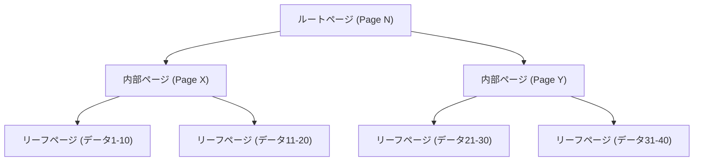
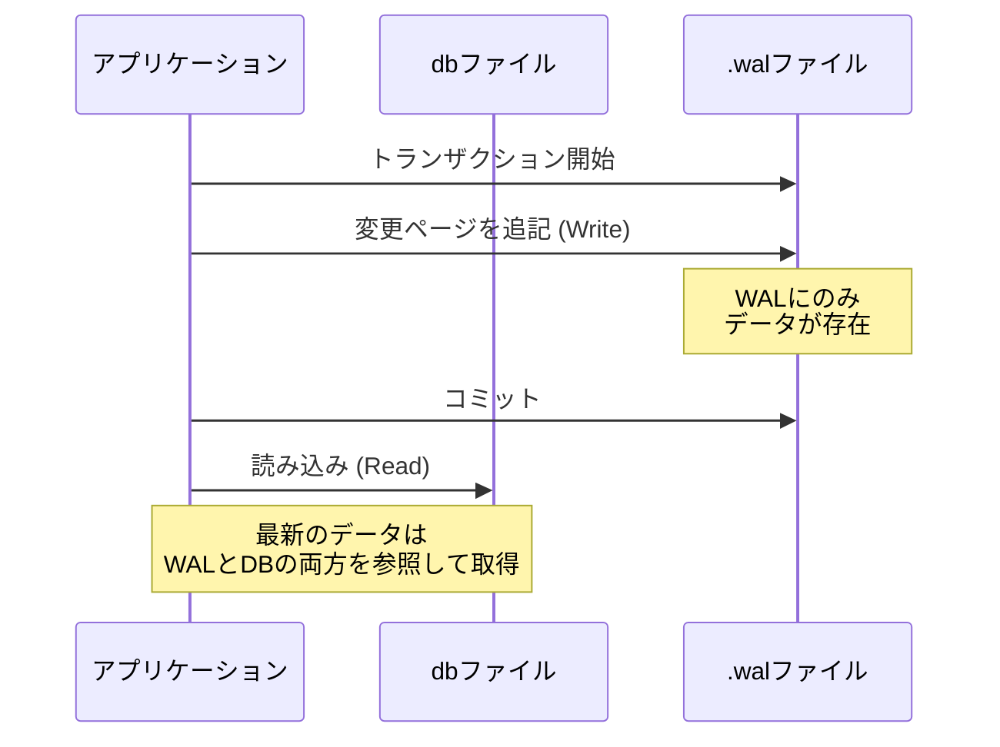

## はじめに

現代のソフトウェア開発において、データベースは不可欠な存在です。その中でも「SQLite」は、スマートフォンアプリから組み込みシステム、ウェブブラウザ、さらには小規模なウェブサーバーに至るまで、世界中で最も広く使われているデータベースエンジンの一つと言っても過言ではありません。

SQLiteの最大の特徴は、その名の通り「軽量（Lite）」であること、そして何よりも「**データ全体をたった一つのファイルに格納する**」というアーキテクチャにあります。MySQLやPostgreSQLのようなクライアント・サーバー型のデータベースとは異なり、SQLiteはアプリケーションのプロセス内で直接動作するライブラリとして機能します。

しかし、単一ファイルというシンプルな構造でありながら、SQLiteは完全なACID特性（原子性、一貫性、独立性、永続性）を備えたトランザクションをサポートしています。複数のプロセスが同時にアクセスした場合でも、データが破損することはありません。

本記事では、この魔法のような仕組みがどのように実現されているのか、SQLiteの内部構造（B-tree、WAL、ロック機構）を深掘りし、実践的な視点から解説します。

---

## 1. 単一ファイルの魔法：ページとB-treeアーキテクチャ

SQLiteのデータファイルは、OSから見れば単なるバイナリファイルに過ぎません。しかし、SQLiteの内部では、このファイルは「ページ」と呼ばれる固定サイズのブロック（通常は4KB）に分割されて管理されています。

### ページの構造

ファイル全体は、1から始まるページ番号でインデックス付けされます。ページ1は特別なページであり、データベースのヘッダー情報（バージョン、ページサイズ、エンコーディングなど）と、データベースのスキーマ情報を格納する特別なテーブル（`sqlite_schema`）のルートノードを含みます。

各ページは、以下のいずれかの役割を持ちます。
- **B-treeページ**: テーブルのデータやインデックスのデータを格納
- **フリーリストページ**: 削除されて空き領域となったページ
- **ポインターマップページ**: ページの移動を追跡するためのページ（特定の機能有効時）

### B-treeによるデータ管理

SQLiteはデータを効率的に検索・挿入・削除するために、**B-tree（B木）** データ構造を採用しています。具体的には、テーブルデータには「B+tree（葉ノードにのみデータを格納）」、インデックスデータには「B-tree（内部ノードにもキーを格納）」を使用しています。



この階層構造により、数百万件のレコードが存在しても、わずか数回のディスクI/O（ページの読み込み）で目的のデータに到達することができます。単一ファイルの中に、この精巧なツリー構造がマッピングされているのです。

---

## 2. トランザクションを守る仕組み：ロールバックジャーナルからWALへ

データベースにおいて最も重要なタスクの一つが「クラッシュに対する耐性」です。データの書き込み途中で停電やOSのフリーズが発生しても、データが不整合な状態に陥らないようにする必要があります。

SQLiteは歴史的に「ロールバックジャーナル」という手法を用いていましたが、現在ではパフォーマンスと並行性に優れた「**WAL（Write-Ahead Logging）**」モードが主流となっています。

### 旧方式：ロールバックジャーナル

ロールバックジャーナル方式では、データを書き換える前に、変更されるページの「変更前の状態」を別のファイル（ジャーナルファイル）にコピーします。
もしトランザクションが失敗したりクラッシュしたりした場合、次回起動時にこのジャーナルファイルを使って変更を「ロールバック（巻き戻し）」し、整合性を回復します。

この方式の最大の欠点は、「書き込み処理が進行中の間、他のプロセスは読み込みすらできなくなる（データベース全体がロックされる）」という点でした。

### 新方式：WAL（Write-Ahead Logging）

SQLiteバージョン3.7.0以降で導入されたWALモードは、この並行性の問題を劇的に改善しました。

WALモードでは、変更されたページは元のデータベースファイルに直接書き込まれるのではなく、**別のファイル（.walファイル）の末尾に追記（アペンド）**されます。



**WALの利点：**
1. **並行性の向上**: 書き込み処理は`.wal`ファイルへの追記で行われるため、元のデータベースファイルを参照する「読み込み処理」をブロックしません。つまり、**1つの書き込みと複数の読み込みが同時に進行可能**になります。
2. **パフォーマンス向上**: ディスク上のランダムな場所を書き換えるのではなく、シーケンシャル（連続的）な追記を行うため、ディスクI/Oのパフォーマンスが高くなります。

WALファイルに蓄積された変更は、ある程度のサイズに達するか、明示的にコマンドが実行されたタイミングで、元のデータベースファイルに書き戻されます。この処理を「**チェックポイント**」と呼びます。

---

## 3. 同時アクセスを制御する：ロック機構

単一ファイルであるSQLiteに複数のプロセス（またはスレッド）が同時にアクセスする場合、データ競合を防ぐためのロック機構が不可欠です。

### SQLiteのロック状態

SQLiteのデータベース接続は、以下の5つのロック状態のいずれかをとります。

1. **UNLOCKED（未ロック）**: 接続がデータベースにアクセスしていない状態。
2. **SHARED（共有ロック）**: データを読み込むためのロック。複数の接続が同時にSHAREDロックを取得できます（同時読み込みが可能）。
3. **RESERVED（予約ロック）**: 将来的にデータを書き込む予定であることを宣言するロック。データベース全体で1つの接続しか取得できません。この状態でも、他の接続はSHAREDロックを取得し続けることができます。
4. **PENDING（保留ロック）**: 書き込みの準備が整い、現在アクティブなSHAREDロックが解放されるのを待っている状態。新しいSHAREDロックの取得はブロックされます。
5. **EXCLUSIVE（排他ロック）**: 実際の書き込みを行うためのロック。この状態では、他のいかなる接続も読み書きできません。

### ロックのエスカレーション

トランザクションを開始してデータを読み書きする際、SQLiteは自動的にこれらのロック状態を段階的に引き上げます（エスカレーション）。

- `SELECT`を実行すると、**SHARED**ロックを取得します。
- `INSERT`や`UPDATE`を実行しようとすると、まず**RESERVED**ロックを取得します。
- 実際にトランザクションをコミットしてファイルに変更を反映させる段階で、**PENDING**を経て**EXCLUSIVE**ロックを取得しようとします。

もし別のプロセスが長時間SHAREDロックを保持していると、書き込みプロセスはEXCLUSIVEロックを取得できず、`SQLITE_BUSY`（データベースがロックされている）というエラーが発生します。

### Busy Timeoutの設定

アプリケーション開発において、この`SQLITE_BUSY`エラーに対処するための最もシンプルで効果的な方法は、**タイムアウト（busy_timeout）**を設定することです。

```sql
PRAGMA busy_timeout = 5000; -- 5000ミリ秒（5秒）待機する
```

これを設定しておくと、ロックが取得できない場合でも即座にエラーを返すのではなく、指定された時間だけ再試行を繰り返してくれます。適切にタイムアウトを設定することで、小〜中規模の並行アクセスであればほとんどのエラーを回避できます。

---

## 4. パフォーマンスを最大化するためのベストプラクティス

SQLiteの内部構造を理解した上で、アプリケーションのパフォーマンスと安全性を最大化するための実践的な設定（PRAGMA）をいくつか紹介します。

### 1. WALモードの有効化
前述の通り、並行アクセスがある場合は必須です。
```sql
PRAGMA journal_mode = WAL;
```

### 2. 同期モードの最適化
WALモードと組み合わせる場合、同期モードを`NORMAL`に下げてもデータ破損のリスクは極めて低く、書き込みパフォーマンスが劇的に向上します。
```sql
PRAGMA synchronous = NORMAL;
```

### 3. メモリキャッシュの増量
SQLiteがRAMにキャッシュできるページ数を増やすことで、ディスクI/Oを減らします。（デフォルトは2000ページ）
```sql
-- キャッシュサイズを負の値で指定するとKB単位になります。以下は64MB。
PRAGMA cache_size = -64000; 
```

### 4. mmapによる高速な読み込み
Memory-mapped I/O（mmap）を有効にすると、OSの仮想メモリ機構を使って直接ファイルにアクセスするため、読み込みが高速化されます。
```sql
PRAGMA mmap_size = 30000000000;
```

---

## 結び

SQLiteは「単一のファイル」という極めてシンプルな外見の裏側に、B-treeによる精巧なデータ構造、WALによる高度なトランザクション管理、そして洗練されたロック機構を隠し持っています。

「軽量だから本格的な用途には使えない」というのは大きな誤解です。その内部アーキテクチャを正しく理解し、適切な設定（WALモードの有効化やタイムアウトの設定など）を行うことで、SQLiteは驚くほどのパフォーマンスと安定性を発揮します。

次にあなたのプロジェクトでデータベースを選定する際、この「世界で最も使われているデータベース」が、実は最も理にかなった選択肢になるかもしれません。
