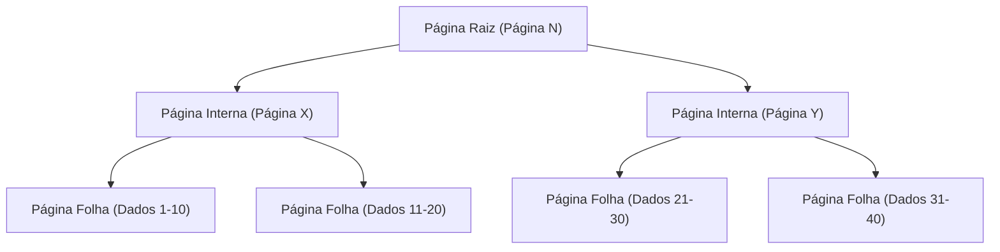
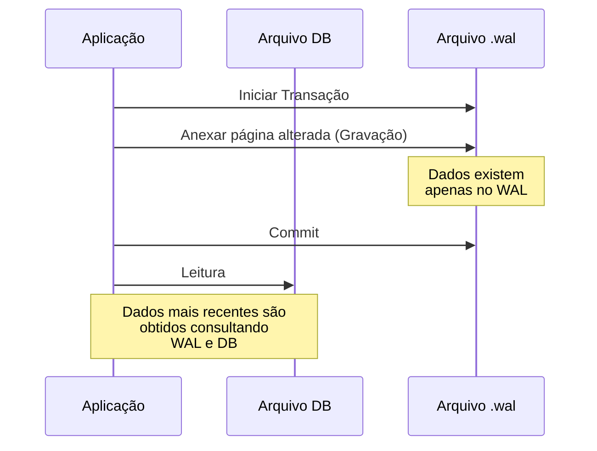

## Introdução

No desenvolvimento de software moderno, os bancos de dados são indispensáveis. Entre eles, não é exagero dizer que o "SQLite" é um dos motores de banco de dados mais amplamente utilizados no mundo, desde aplicativos de smartphones até sistemas embarcados, navegadores da web e até pequenos servidores da web.

A maior característica do SQLite, como o próprio nome sugere, é ser "leve (Lite)" e, acima de tudo, sua arquitetura de "**armazenar todos os dados em apenas um arquivo**". Diferente de bancos de dados cliente-servidor como MySQL e PostgreSQL, o SQLite funciona como uma biblioteca que opera diretamente dentro do processo da aplicação.

No entanto, mesmo com uma estrutura simples de arquivo único, o SQLite suporta transações com propriedades ACID completas (Atomicidade, Consistência, Isolamento, Durabilidade). Mesmo quando múltiplos processos acessam simultaneamente, os dados não são corrompidos.

Neste artigo, aprofundaremos como esse mecanismo mágico é realizado, explorando a estrutura interna do SQLite (B-tree, WAL, mecanismo de bloqueio) de uma perspectiva prática.

---

## 1. A Magia do Arquivo Único: Páginas e Arquitetura B-tree

O arquivo de dados do SQLite, do ponto de vista do sistema operacional, é apenas um arquivo binário. No entanto, internamente no SQLite, esse arquivo é dividido e gerenciado em blocos de tamanho fixo (geralmente 4KB) chamados "páginas".

### Estrutura da Página

O arquivo inteiro é indexado por números de página que começam em 1. A página 1 é uma página especial e contém informações de cabeçalho do banco de dados (versão, tamanho da página, codificação, etc.) e o nó raiz de uma tabela especial (`sqlite_schema`) que armazena informações de esquema do banco de dados.

Cada página tem uma das seguintes funções:
- **Página B-tree**: Armazena dados de tabelas ou índices
- **Página Freelist**: Páginas que foram excluídas e se tornaram espaço livre
- **Página Pointer-map**: Página para rastrear a movimentação de páginas (quando funções específicas estão habilitadas)

### Gerenciamento de Dados com B-tree

Para pesquisar, inserir e excluir dados de forma eficiente, o SQLite adota a estrutura de dados **B-tree**. Especificamente, ele usa "B+tree (armazena dados apenas nos nós folhas)" para dados de tabelas e "B-tree (armazena chaves também em nós internos)" para dados de índices.



Graças a essa estrutura hierárquica, mesmo com milhões de registros, é possível alcançar os dados desejados com apenas algumas operações de E/S de disco (leituras de página). Esta estrutura de árvore elaborada é mapeada dentro de um único arquivo.

---

## 2. O Mecanismo para Proteger Transações: De Rollback Journal para WAL

Uma das tarefas mais importantes em um banco de dados é a "tolerância a falhas (crash)". Mesmo que ocorra uma queda de energia ou o congelamento do SO durante a gravação de dados, é necessário garantir que os dados não fiquem em um estado inconsistente.

O SQLite historicamente usava uma técnica chamada "Rollback Journal", mas atualmente o modo "**WAL (Write-Ahead Logging)**", excelente em desempenho e concorrência, é o padrão.

### Método Antigo: Rollback Journal

No método Rollback Journal, antes de reescrever os dados, o "estado anterior à alteração" das páginas a serem modificadas é copiado para outro arquivo (arquivo de journal).
Se uma transação falhar ou o sistema travar, o SQLite usa este arquivo de journal na próxima inicialização para "reverter (rollback)" as alterações e restaurar a consistência.

A maior desvantagem desse método era que "enquanto um processo de gravação está em andamento, outros processos não podem nem mesmo ler (o banco de dados inteiro é bloqueado)".

### Novo Método: WAL (Write-Ahead Logging)

O modo WAL, introduzido no SQLite versão 3.7.0 e posteriores, melhorou drasticamente esse problema de concorrência.

No modo WAL, as páginas alteradas não são gravadas diretamente no arquivo de banco de dados original, mas são **anexadas ao final de outro arquivo (arquivo .wal)**.



**Vantagens do WAL:**
1. **Melhoria da Concorrência**: Como o processo de gravação é feito anexando ao arquivo `.wal`, ele não bloqueia o "processo de leitura" que consulta o arquivo de banco de dados original. Em outras palavras, **uma gravação e várias leituras podem ocorrer simultaneamente**.
2. **Melhoria de Desempenho**: Em vez de reescrever locais aleatórios no disco, gravações sequenciais (contínuas) são realizadas, resultando em maior desempenho de E/S de disco.

As alterações acumuladas no arquivo WAL são gravadas de volta no arquivo de banco de dados original quando atingem um determinado tamanho ou quando um comando é executado explicitamente. Esse processo é chamado de "**Checkpoint**".

---

## 3. Controlando o Acesso Simultâneo: Mecanismo de Bloqueio

Quando múltiplos processos (ou threads) acessam o SQLite, que é um arquivo único, um mecanismo de bloqueio (lock) é essencial para evitar conflitos de dados.

### Estados de Bloqueio do SQLite

Uma conexão de banco de dados no SQLite assume um dos seguintes 5 estados de bloqueio:

1. **UNLOCKED (Não Bloqueado)**: Estado em que a conexão não está acessando o banco de dados.
2. **SHARED (Bloqueio Compartilhado)**: Bloqueio para leitura de dados. Múltiplas conexões podem obter um bloqueio SHARED simultaneamente (leitura simultânea é possível).
3. **RESERVED (Bloqueio Reservado)**: Bloqueio que declara a intenção de gravar dados no futuro. Apenas uma conexão em todo o banco de dados pode obtê-lo. Mesmo neste estado, outras conexões podem continuar obtendo bloqueios SHARED.
4. **PENDING (Bloqueio Pendente)**: O estado de espera quando a gravação está pronta, aguardando que os bloqueios SHARED atualmente ativos sejam liberados. A aquisição de novos bloqueios SHARED é bloqueada.
5. **EXCLUSIVE (Bloqueio Exclusivo)**: Bloqueio para realizar a gravação real. Neste estado, nenhuma outra conexão pode ler ou gravar.

### Escalonamento de Bloqueios

Ao iniciar uma transação e ler/gravar dados, o SQLite eleva automaticamente esses estados de bloqueio em etapas (escalonamento).

- Ao executar um `SELECT`, ele obtém um bloqueio **SHARED**.
- Ao tentar executar um `INSERT` ou `UPDATE`, ele primeiro obtém um bloqueio **RESERVED**.
- Na fase em que a transação é realmente confirmada (commit) e as alterações são refletidas no arquivo, ele tenta obter um bloqueio **EXCLUSIVE** passando pelo **PENDING**.

Se outro processo mantiver um bloqueio SHARED por muito tempo, o processo de gravação não poderá obter o bloqueio EXCLUSIVE, e ocorrerá um erro `SQLITE_BUSY` (banco de dados bloqueado).

### Configuração de Busy Timeout

No desenvolvimento de aplicações, o método mais simples e eficaz para lidar com esse erro `SQLITE_BUSY` é configurar um **timeout (busy_timeout)**.

```sql
PRAGMA busy_timeout = 5000; -- Aguarda 5000 milissegundos (5 segundos)
```

Se isso estiver configurado, em vez de retornar um erro imediatamente quando um bloqueio não puder ser obtido, o SQLite repetirá as tentativas de obtenção de bloqueio durante o tempo especificado. Ao configurar adequadamente o timeout, a maioria dos erros pode ser evitada em acessos simultâneos de pequeno a médio porte.

---

## 4. Melhores Práticas para Maximizar o Desempenho

Com base no entendimento da estrutura interna do SQLite, aqui estão algumas configurações práticas (PRAGMA) para maximizar o desempenho e a segurança da sua aplicação.

### 1. Habilitando o modo WAL
Como mencionado anteriormente, é essencial quando há acesso simultâneo.
```sql
PRAGMA journal_mode = WAL;
```

### 2. Otimização do Modo de Sincronização
Ao combinar com o modo WAL, mesmo diminuindo o modo de sincronização para `NORMAL`, o risco de corrupção de dados é extremamente baixo e o desempenho de gravação melhora drasticamente.
```sql
PRAGMA synchronous = NORMAL;
```

### 3. Aumentando o Cache de Memória
Aumentar o número de páginas que o SQLite pode fazer cache na RAM reduz a E/S de disco. (O padrão é 2000 páginas)
```sql
-- Especificar o tamanho do cache como um valor negativo o define em KB. O seguinte é 64MB.
PRAGMA cache_size = -64000; 
```

### 4. Leitura Rápida com mmap
Habilitar a E/S mapeada em memória (mmap) acelera a leitura usando o mecanismo de memória virtual do SO para acessar o arquivo diretamente.
```sql
PRAGMA mmap_size = 30000000000;
```

---

## Conclusão

Por trás de sua aparência extremamente simples de "um único arquivo", o SQLite esconde uma estrutura de dados elaborada através de B-tree, gerenciamento avançado de transações através de WAL e um mecanismo de bloqueio refinado.

Dizer que "não pode ser usado para aplicações sérias porque é leve" é um grande mal-entendido. Ao entender corretamente sua arquitetura interna e fazer as configurações apropriadas (como habilitar o modo WAL e configurar timeouts), o SQLite exibe um desempenho e estabilidade surpreendentes.

Na próxima vez que você for escolher um banco de dados para o seu projeto, este "banco de dados mais usado no mundo" pode ser, na verdade, a escolha mais lógica.
