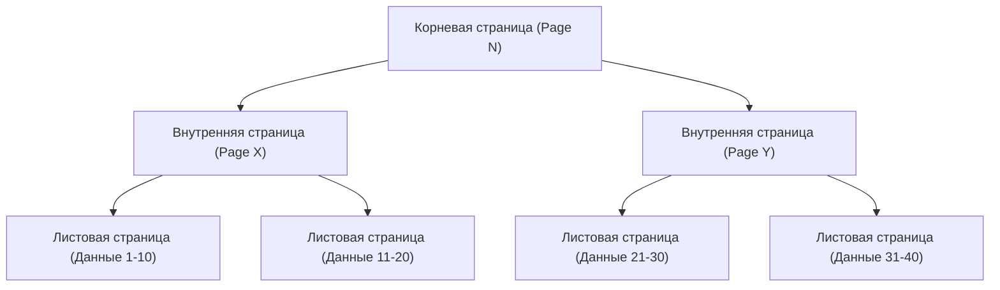
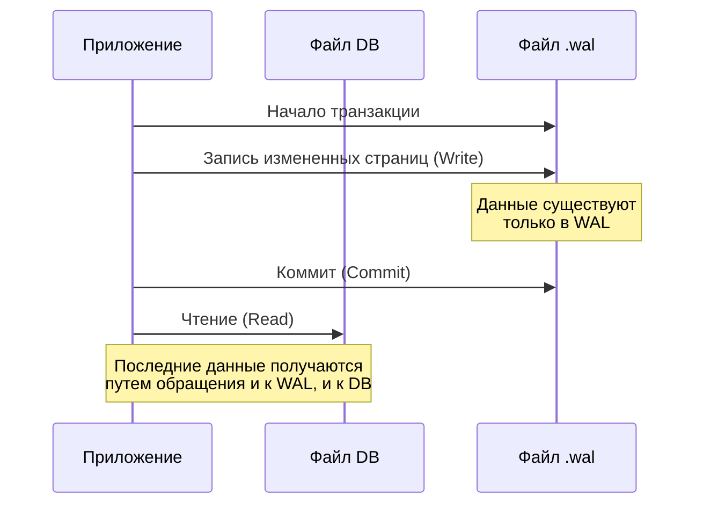

## Введение

В современной разработке программного обеспечения базы данных играют важнейшую роль. Среди них «SQLite», без преувеличения, является одной из самых широко используемых СУБД в мире, применяемой во всем: от приложений для смартфонов до встроенных систем, веб-браузеров и даже небольших веб-серверов.

Главной особенностью SQLite, как следует из названия, является ее "легкость" (Lite) и, прежде всего, архитектура, при которой **все данные хранятся в одном единственном файле**. В отличие от клиент-серверных баз данных, таких как MySQL или PostgreSQL, SQLite работает как библиотека, выполняющаяся непосредственно в процессе приложения.

Однако, несмотря на простую структуру в виде одного файла, SQLite поддерживает транзакции с полным соответствием свойствам ACID (Атомарность, Согласованность, Изолированность, Долговечность). Даже при одновременном доступе нескольких процессов данные не будут повреждены.

В этой статье мы подробно рассмотрим внутреннюю архитектуру SQLite (B-tree, WAL, механизмы блокировки) и с практической точки зрения объясним, как реализуется эта магия.

---

## 1. Магия одного файла: страницы и архитектура B-tree

Файл данных SQLite для операционной системы — это всего лишь обычный бинарный файл. Однако внутри SQLite этот файл разделен на блоки фиксированного размера (обычно 4 КБ), называемые «страницами» (pages), через которые осуществляется управление.

### Структура страницы

Весь файл индексируется номерами страниц, начиная с 1. Страница 1 является особенной — она содержит заголовок базы данных (версия, размер страницы, кодировка и т.д.) и корневой узел специальной таблицы (`sqlite_schema`), в которой хранится информация о схеме базы данных.

Каждая страница выполняет одну из следующих ролей:
- **B-tree страница**: хранит данные таблиц или индексов.
- **Свободная страница (Freelist page)**: страница, ставшая свободным пространством после удаления данных.
- **Страница карты указателей (Pointer-map page)**: страница для отслеживания перемещения страниц (при включении определенных функций).

### Управление данными с помощью B-tree

Для эффективного поиска, вставки и удаления данных SQLite использует структуру данных **B-tree (B-дерево)**. Конкретно, для данных таблиц используется «B+tree» (данные хранятся только в листовых узлах), а для данных индексов — «B-tree» (ключи хранятся также во внутренних узлах).



Благодаря этой иерархической структуре, даже при наличии миллионов записей, можно получить доступ к нужным данным всего за несколько дисковых операций ввода-вывода (чтений страниц). Эта сложная древовидная структура отображается внутри одного файла.

---

## 2. Механизм защиты транзакций: от журнала откатов к WAL

Одной из самых важных задач баз данных является «устойчивость к сбоям». Необходимо предотвратить переход данных в несогласованное состояние даже в случае отключения питания или зависания ОС во время записи данных.

Исторически SQLite использовала метод «журнала откатов» (rollback journal), но сегодня основным является режим «**WAL (Write-Ahead Logging)**», который обладает превосходной производительностью и параллелизмом.

### Старый метод: Журнал откатов

В методе журнала откатов перед изменением данных "предыдущее состояние" изменяемых страниц копируется в отдельный файл (файл журнала).
Если транзакция завершается неудачно или происходит сбой, при следующем запуске этот файл журнала используется для «отката» изменений и восстановления согласованности.

Самым большим недостатком этого метода было то, что «пока идет процесс записи, другие процессы даже не могут читать данные (вся база данных блокируется)».

### Новый метод: WAL (Write-Ahead Logging)

Режим WAL, представленный в SQLite версии 3.7.0, кардинально решил эту проблему параллелизма.

В режиме WAL измененные страницы не записываются напрямую в исходный файл базы данных, а **добавляются в конец другого файла (файл .wal)**.



**Преимущества WAL:**
1. **Улучшение параллелизма**: поскольку процесс записи выполняется путем добавления данных в файл `.wal`, он не блокирует «процесс чтения», который обращается к исходному файлу базы данных. То есть **одна запись и множество чтений могут происходить одновременно**.
2. **Повышение производительности**: поскольку данные добавляются последовательно, а не перезаписываются в случайных местах на диске, производительность дискового ввода-вывода возрастает.

Изменения, накопленные в файле WAL, переносятся в исходный файл базы данных, когда достигается определенный размер или когда явно выполняется соответствующая команда. Этот процесс называется «**контрольной точкой**» (checkpoint).

---

## 3. Управление одновременным доступом: Механизм блокировок

Когда несколько процессов (или потоков) одновременно получают доступ к SQLite, представляющей собой один файл, механизм блокировок для предотвращения конфликтов данных становится жизненно важным.

### Состояния блокировки SQLite

Подключение к базе данных SQLite может находиться в одном из пяти следующих состояний блокировки:

1. **UNLOCKED (Не заблокировано)**: Подключение не обращается к базе данных.
2. **SHARED (Разделяемая блокировка)**: Блокировка для чтения данных. Несколько подключений могут одновременно получить блокировку SHARED (возможно одновременное чтение).
3. **RESERVED (Зарезервированная блокировка)**: Блокировка, объявляющая о намерении записать данные в будущем. Только одно подключение во всей базе данных может получить эту блокировку. В этом состоянии другие подключения могут продолжать получать блокировки SHARED.
4. **PENDING (Ожидающая блокировка)**: Состояние, когда данные готовы к записи и ожидается освобождение всех активных блокировок SHARED. Получение новых блокировок SHARED блокируется.
5. **EXCLUSIVE (Эксклюзивная блокировка)**: Блокировка для фактического выполнения записи. В этом состоянии никакие другие подключения не могут ни читать, ни писать.

### Эскалация блокировок

При запуске транзакции и чтении/записи данных SQLite автоматически поэтапно повышает эти состояния блокировки (эскалация).

- При выполнении `SELECT` получается блокировка **SHARED**.
- При попытке выполнить `INSERT` или `UPDATE` сначала получается блокировка **RESERVED**.
- На этапе фактического коммита транзакции и применения изменений к файлу происходит попытка получить блокировку **EXCLUSIVE** после прохождения состояния **PENDING**.

Если другой процесс удерживает блокировку SHARED в течение длительного времени, записывающий процесс не сможет получить блокировку EXCLUSIVE, и возникнет ошибка `SQLITE_BUSY` (база данных заблокирована).

### Настройка Busy Timeout

При разработке приложений самым простым и эффективным способом справиться с этой ошибкой `SQLITE_BUSY` является установка **тайм-аута (busy_timeout)**.

```sql
PRAGMA busy_timeout = 5000; -- Ожидание 5000 миллисекунд (5 секунд)
```

Если установить этот параметр, база данных не будет сразу возвращать ошибку, когда блокировку получить не удается, а будет повторять попытки в течение указанного времени. Правильно настроив тайм-аут, можно избежать большинства ошибок при параллельном доступе малого и среднего масштаба.

---

## 4. Лучшие практики для максимальной производительности

Понимая внутреннюю структуру SQLite, давайте рассмотрим несколько практических настроек (PRAGMA) для максимального повышения производительности и безопасности вашего приложения.

### 1. Включение режима WAL
Как упоминалось ранее, это необходимо при наличии параллельного доступа.
```sql
PRAGMA journal_mode = WAL;
```

### 2. Оптимизация режима синхронизации
В сочетании с режимом WAL снижение режима синхронизации до `NORMAL` практически исключает риск повреждения данных, при этом кардинально повышая производительность записи.
```sql
PRAGMA synchronous = NORMAL;
```

### 3. Увеличение кэша в памяти
Уменьшает дисковый ввод-вывод за счет увеличения количества страниц, которые SQLite может кэшировать в оперативной памяти (по умолчанию 2000 страниц).
```sql
-- Если размер кэша указан отрицательным значением, он задается в КБ. Ниже пример для 64 МБ.
PRAGMA cache_size = -64000; 
```

### 4. Быстрое чтение с помощью mmap
Включение ввода-вывода, отображаемого в память (Memory-mapped I/O, mmap), ускоряет чтение, так как для прямого доступа к файлам используется механизм виртуальной памяти операционной системы.
```sql
PRAGMA mmap_size = 30000000000;
```

---

## Заключение

За крайне простым внешним видом "одного файла" SQLite скрывает сложную структуру данных с использованием B-tree, расширенное управление транзакциями с помощью WAL и продуманный механизм блокировок.

Мнение о том, что "SQLite нельзя использовать для серьезных задач из-за ее легковесности", является большим заблуждением. При правильном понимании внутренней архитектуры и соответствующих настройках (например, включение режима WAL и установка тайм-аутов) SQLite демонстрирует удивительную производительность и стабильность.

Когда вы в следующий раз будете выбирать базу данных для своего проекта, эта «самая используемая база данных в мире» может оказаться наиболее логичным выбором.
