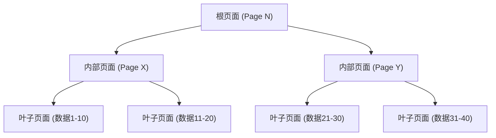
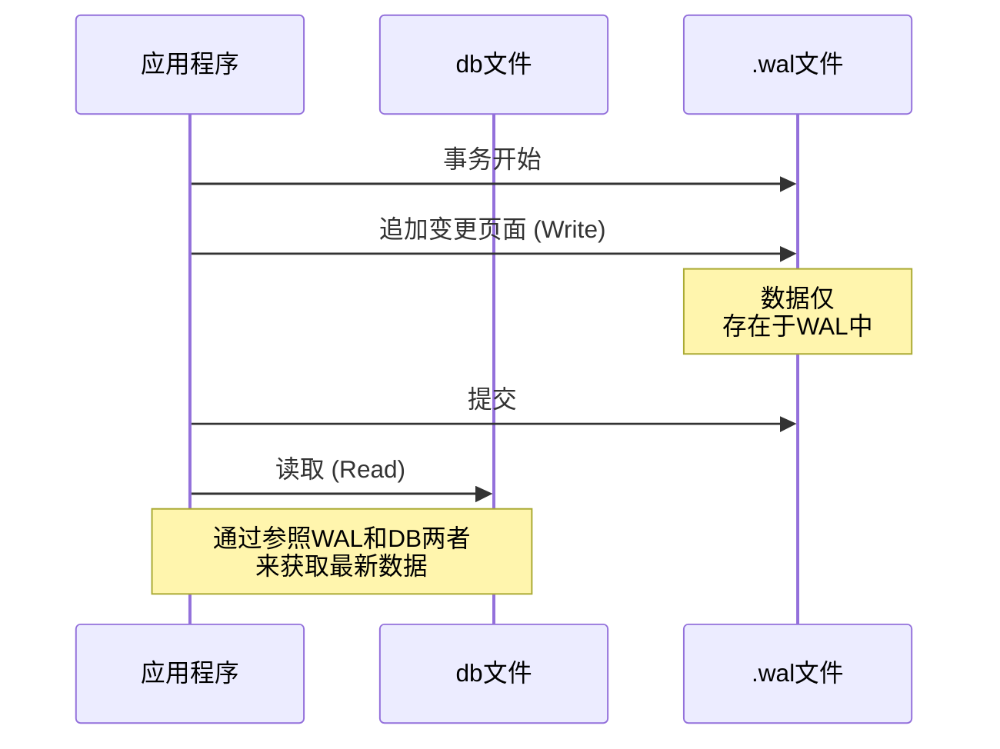

## 引言

在现代软件开发中，数据库是不可或缺的存在。其中“SQLite”更是从智能手机应用到嵌入式系统、Web浏览器，乃至小型Web服务器中，称得上是世界上使用最广泛的数据库引擎之一。

SQLite最大的特点，正如其名，是“轻量（Lite）”，而最重要的是其“**将整个数据存储在单一文件中**”的架构。与MySQL或PostgreSQL等客户端-服务器架构的数据库不同，SQLite作为在应用程序进程内直接运行的库发挥作用。

然而，尽管采用了单一文件的简单结构，SQLite依然支持具备完整ACID特性（原子性、一致性、隔离性、持久性）的事务。即使多个进程同时访问，数据也不会损坏。

本文将深入探讨SQLite的内部架构（B-tree、WAL、锁机制），从实践的角度解析这一如同魔法般的机制是如何实现的。

---

## 1. 单一文件的魔法：页面与B-tree架构

在操作系统看来，SQLite的数据文件不过是一个普通的二进制文件。但在SQLite内部，该文件被划分为被称为“页面（Page）”的固定大小块（通常为4KB）进行管理。

### 页面的结构

整个文件通过从1开始的页码进行索引。第1页是一个特殊的页面，包含数据库头部信息（版本、页面大小、编码等）以及存储数据库模式信息的特殊表（`sqlite_schema`）的根节点。

每个页面具有以下作用之一：
- **B-tree页面**：存储表数据或索引数据
- **空闲列表页面（Freelist page）**：被删除后成为空闲区域的页面
- **指针映射页面（Pointer map page）**：用于追踪页面移动的页面（在启用特定功能时）

### 通过B-tree进行数据管理

为了高效地检索、插入和删除数据，SQLite采用了**B-tree（B树）**数据结构。具体来说，表数据使用“B+tree（仅在叶子节点存储数据）”，索引数据则使用“B-tree（内部节点也存储键值）”。



得益于这种层级结构，即使存在数百万条记录，也只需极少次的磁盘I/O（页面读取）即可到达目标数据。在这个单一文件中，巧妙地映射了这种精巧的树状结构。

---

## 2. 守护事务的机制：从回滚日志到WAL

在数据库中最重要的任务之一就是“抗崩溃能力”。我们需要确保即使在数据写入过程中发生停电或操作系统无响应，数据也不会陷入不一致的状态。

SQLite历史上曾使用“回滚日志（Rollback Journal）”的方法，但如今性能和并发性更优秀的“**WAL（Write-Ahead Logging，预写式日志）**”模式已成为主流。

### 旧方案：回滚日志

在回滚日志方案中，在修改数据之前，会将变更页面的“变更前状态”复制到另一个文件（日志文件）中。
如果事务失败或发生崩溃，在下次启动时会使用该日志文件将变更“回滚（Rollback）”，从而恢复一致性。

这种方式最大的缺点是，“在写入处理进行期间，其他进程甚至无法进行读取（整个数据库被锁定）”。

### 新方案：WAL（预写式日志）

自SQLite版本3.7.0引入的WAL模式，极大地改善了这一并发性问题。

在WAL模式下，变更后的页面不会直接写入原始数据库文件，而是**追加（Append）到另一个文件（.wal文件）的末尾**。



**WAL的优点：**
1. **提升并发性**：因为写入处理是通过追加到`.wal`文件来进行的，所以它不会阻塞参照原始数据库文件的“读取处理”。也就是说，**可以同时进行一个写入和多个读取**。
2. **提升性能**：不是在磁盘上的随机位置进行重写，而是进行顺序（连续）追加，因此磁盘I/O性能更高。

累积在WAL文件中的变更，会在达到一定大小，或被显式执行命令时，回写到原始数据库文件中。这个处理被称为“**检查点（Checkpoint）**”。

---

## 3. 控制并发访问：锁机制

当多个进程（或线程）同时访问单一文件的SQLite时，防止数据冲突的锁机制是不可或缺的。

### SQLite的锁状态

SQLite的数据库连接会处于以下五种锁状态之一。

1. **UNLOCKED（未锁定）**：连接未访问数据库的状态。
2. **SHARED（共享锁）**：用于读取数据的锁。多个连接可以同时获取SHARED锁（允许并发读取）。
3. **RESERVED（保留锁）**：宣告将来计划写入数据的锁。整个数据库只能有一个连接获取该锁。即使在这种状态下，其他连接仍然可以继续获取SHARED锁。
4. **PENDING（未决锁）**：写入准备就绪，正在等待当前活动的SHARED锁释放的状态。新的SHARED锁的获取将被阻塞。
5. **EXCLUSIVE（排他锁）**：执行实际写入操作的锁。在这种状态下，其他任何连接都无法读写。

### 锁的升级

在开始事务并读写数据时，SQLite会自动逐步提升这些锁状态（升级，Escalation）。

- 执行`SELECT`时，会获取**SHARED**锁。
- 尝试执行`INSERT`或`UPDATE`时，会首先获取**RESERVED**锁。
- 在实际提交事务并将变更反映到文件的阶段，会尝试经过**PENDING**最终获取**EXCLUSIVE**锁。

如果另一个进程长时间保持SHARED锁，写入进程将无法获取EXCLUSIVE锁，从而引发`SQLITE_BUSY`（数据库被锁定）错误。

### Busy Timeout（繁忙超时）设置

在应用程序开发中，应对此`SQLITE_BUSY`错误最简单且有效的方法是设置**超时（busy_timeout）**。

```sql
PRAGMA busy_timeout = 5000; -- 等待5000毫秒（5秒）
```

设置此项后，即使无法获取锁，也不会立即返回错误，而是在指定的时间内不断重试。通过正确设置超时，中小型并发访问的绝大多数错误都可以避免。

---

## 4. 最大化性能的最佳实践

在理解了SQLite内部架构的基础上，介绍几个旨在最大化应用程序性能与安全性的实践设置（PRAGMA）。

### 1. 启用WAL模式
如前所述，在存在并发访问时，这是必选项。
```sql
PRAGMA journal_mode = WAL;
```

### 2. 优化同步模式
与WAL模式组合使用时，即使将同步模式降为`NORMAL`，数据损坏的风险也极低，而写入性能将获得戏剧性的提升。
```sql
PRAGMA synchronous = NORMAL;
```

### 3. 增加内存缓存
通过增加SQLite可以在RAM中缓存的页面数，从而减少磁盘I/O。（默认值为2000页）
```sql
-- 使用负值指定缓存大小时，单位为KB。以下为64MB。
PRAGMA cache_size = -64000; 
```

### 4. 利用mmap实现高速读取
启用内存映射I/O（mmap）后，因为使用了操作系统的虚拟内存机制直接访问文件，读取速度会大幅提高。
```sql
PRAGMA mmap_size = 30000000000;
```

---

## 结语

SQLite在“单一文件”这个极其简单的外表之下，隐藏着通过B-tree实现的精巧数据结构、借助WAL实现的高级事务管理，以及成熟的锁机制。

“因为轻量所以不适合正式用途”是一个巨大的误解。只要正确理解其内部架构，并进行合理的设置（如启用WAL模式或设置超时等），SQLite就能发挥出惊人的性能与稳定性。

下次为你的项目选择数据库时，这个“世界上使用最广泛的数据库”或许才是最合乎情理的选项。
