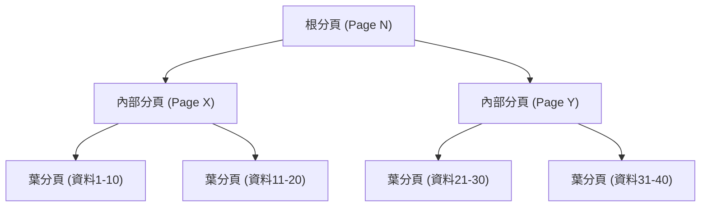
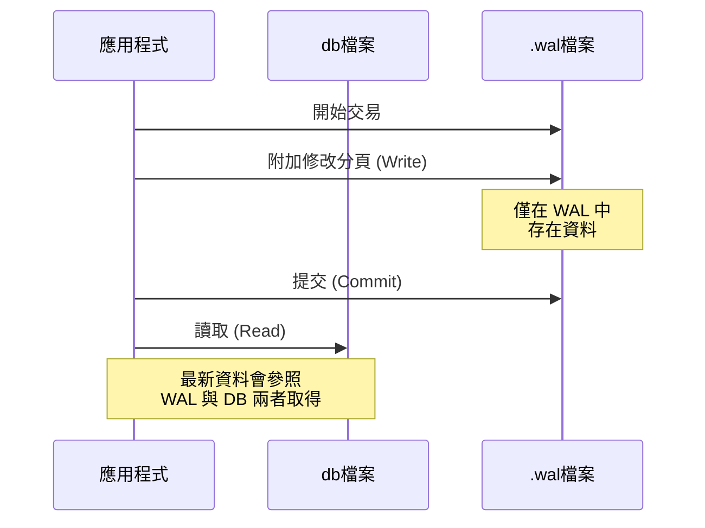

## 前言

在現代軟體開發中，資料庫是不可或缺的存在。其中，「SQLite」可以說是在全球被最廣泛使用的資料庫引擎之一，從智慧型手機應用程式到嵌入式系統、網頁瀏覽器，甚至是小型的網頁伺服器，都能看到它的身影。

SQLite 最大的特色就如其名，在於它的「輕量（Lite）」，且最重要的是「**將全部資料儲存於單一檔案中**」的架構。與 MySQL 或 PostgreSQL 等主從式架構（Client-Server）的資料庫不同，SQLite 是作為一個在應用程式行程（Process）內直接運作的函式庫來發揮作用。

然而，儘管是單一檔案如此簡單的結構，SQLite 卻支援具備完整 ACID 特性（原子性、一致性、隔離性、持久性）的交易（Transaction）。即使多個行程同時存取，資料也不會損壞。

本文將深入探討這個魔法般的機制是如何實現的，實務解析 SQLite 的內部結構（B-tree、WAL、鎖定機制）。

---

## 1. 單一檔案的魔法：分頁與 B-tree 架構

從作業系統的角度來看，SQLite 的資料檔不過是一個二進位檔案。但在 SQLite 內部，這個檔案會被劃分為固定大小的區塊（通常為 4KB），稱為「分頁（Page）」來進行管理。

### 分頁的結構

整個檔案會以從 1 開始的分頁編號建立索引。分頁 1 是一個特殊的分頁，包含了資料庫的標頭資訊（版本、分頁大小、編碼等），以及儲存資料庫綱要（Schema）資訊的特殊資料表（`sqlite_schema`）的根節點。

每個分頁都具備以下其中一種作用：
- **B-tree 分頁**：儲存資料表資料或索引資料
- **空閒列表分頁（Freelist Page）**：被刪除後變成可用空間的分頁
- **指標對應分頁（Pointer Map Page）**：用於追蹤分頁移動的分頁（在啟用特定功能時）

### 透過 B-tree 進行資料管理

為了高效率地搜尋、插入及刪除資料，SQLite 採用了 **B-tree（B 樹）** 資料結構。具體來說，資料表資料使用了「B+tree（僅在葉節點儲存資料）」，而索引資料則使用了「B-tree（內部節點也會儲存鍵值）」。



透過這種階層結構，即使存在數百萬筆記錄，也只需要少數幾次的磁碟 I/O（讀取分頁）就能到達目標資料。在這個單一檔案中，就映射了這樣精巧的樹狀結構。

---

## 2. 守護交易的機制：從還原日誌到 WAL

在資料庫中，最重要的任務之一就是「對崩潰的容錯能力」。即使在資料寫入途中發生停電或作業系統當機，也必須確保資料不會陷入不一致的狀態。

過去，SQLite 使用的是稱為「還原日誌（Rollback Journal）」的手法，但現在主流已轉變為在效能與並行性上更優異的「**WAL（Write-Ahead Logging）**」模式。

### 舊方式：還原日誌（Rollback Journal）

在還原日誌方式中，在修改資料之前，會將即將被修改的分頁的「修改前狀態」複製到另一個檔案（日誌檔案）中。
如果交易失敗或發生崩潰，下次啟動時便會使用這個日誌檔案將變更「還原（Rollback）」，以恢復一致性。

這種方式最大的缺點在於「在寫入處理進行期間，其他行程甚至連讀取都無法進行（整個資料庫會被鎖定）」。

### 新方式：WAL（Write-Ahead Logging）

自 SQLite 3.7.0 版本引入的 WAL 模式，大幅改善了這個並行性的問題。

在 WAL 模式下，被修改的分頁不會直接寫回原始的資料庫檔案，而是會**附加（Append）到另一個檔案（.wal 檔）的尾端**。



**WAL 的優點：**
1. **提升並行性**：因為寫入處理是透過附加到 `.wal` 檔案來進行，不會阻擋參照原始資料庫檔案的「讀取處理」。換言之，**可以讓 1 個寫入與多個讀取同時進行**。
2. **提升效能**：由於不是去覆寫磁碟上隨機的位置，而是進行循序（Sequential）附加，因此磁碟 I/O 的效能更高。

累積在 WAL 檔案中的變更，會在達到一定大小，或明確執行指令的時機，被寫回原始的資料庫檔案中。這個處理稱為「**檢查點（Checkpoint）**」。

---

## 3. 控制同時存取：鎖定機制

當多個行程（或執行緒）同時存取單一檔案的 SQLite 時，為了防止資料衝突，鎖定機制是不可或缺的。

### SQLite 的鎖定狀態

SQLite 的資料庫連線會處於以下 5 種鎖定狀態之一：

1. **UNLOCKED（未鎖定）**：連線尚未存取資料庫的狀態。
2. **SHARED（共用鎖定）**：為了讀取資料的鎖定。多個連線可以同時取得 SHARED 鎖定（允許多個同時讀取）。
3. **RESERVED（保留鎖定）**：宣告未來計畫寫入資料的鎖定。整個資料庫只能有 1 個連線取得。在此狀態下，其他連線依然可以繼續取得 SHARED 鎖定。
4. **PENDING（待定鎖定）**：寫入準備就緒，正在等待目前作用中的 SHARED 鎖定被釋放的狀態。會阻擋新的 SHARED 鎖定取得。
5. **EXCLUSIVE（排他鎖定）**：為了進行實際寫入的鎖定。在此狀態下，其他任何連線都無法進行讀寫。

### 鎖定的升級（Escalation）

當開始交易並進行資料讀寫時，SQLite 會自動將這些鎖定狀態逐步提升（升級）。

- 執行 `SELECT` 時，會取得 **SHARED** 鎖定。
- 嘗試執行 `INSERT` 或 `UPDATE` 時，會先取得 **RESERVED** 鎖定。
- 在實際提交交易並將變更反映到檔案的階段，會經過 **PENDING**，然後嘗試取得 **EXCLUSIVE** 鎖定。

如果另一個行程長時間持有 SHARED 鎖定，寫入行程就會無法取得 EXCLUSIVE 鎖定，進而發生 `SQLITE_BUSY`（資料庫被鎖定）的錯誤。

### Busy Timeout 的設定

在應用程式開發中，應對這個 `SQLITE_BUSY` 錯誤最簡單且有效的方法就是設定**逾時（busy_timeout）**。

```sql
PRAGMA busy_timeout = 5000; -- 等待 5000 毫秒（5 秒）
```

只要設定了這個，即使無法取得鎖定也不會立刻回傳錯誤，而是會在指定的時間內不斷重試。只要適當設定逾時時間，中小規模的並行存取幾乎就能避免大部分的錯誤。

---

## 4. 最大化效能的最佳實務

在理解了 SQLite 的內部結構後，接下來介紹幾個能將應用程式效能與安全性最大化的實務設定（PRAGMA）。

### 1. 啟用 WAL 模式
如前所述，當有並行存取時是必備的。
```sql
PRAGMA journal_mode = WAL;
```

### 2. 最佳化同步模式
當與 WAL 模式搭配使用時，即使將同步模式（synchronous）降至 `NORMAL`，資料損壞的風險也極低，且寫入效能會大幅提升。
```sql
PRAGMA synchronous = NORMAL;
```

### 3. 增加記憶體快取
透過增加 SQLite 能在 RAM 中快取的分頁數量，來減少磁碟 I/O。（預設為 2000 個分頁）
```sql
-- 若指定負值，單位將為 KB。以下為 64MB。
PRAGMA cache_size = -64000; 
```

### 4. 透過 mmap 加速讀取
啟用記憶體對應 I/O（Memory-mapped I/O，mmap）後，會使用作業系統的虛擬記憶體機制直接存取檔案，從而加快讀取速度。
```sql
PRAGMA mmap_size = 30000000000;
```

---

## 結語

在 SQLite「單一檔案」極為簡單的外表下，其實隱藏著透過 B-tree 實現的精巧資料結構、透過 WAL 實現的高階交易管理，以及洗鍊的鎖定機制。

「因為是輕量級，所以無法用於正式用途」這是一個很大的誤解。只要正確理解其內部架構，並進行適當的設定（例如啟用 WAL 模式、設定逾時等），SQLite 就能發揮驚人的效能與穩定性。

下次在為您的專案挑選資料庫時，這個「世界上被使用最廣泛的資料庫」，或許會是您最合理的選擇。
