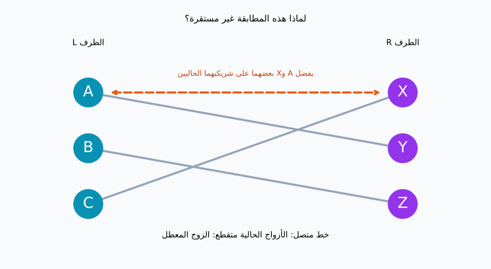
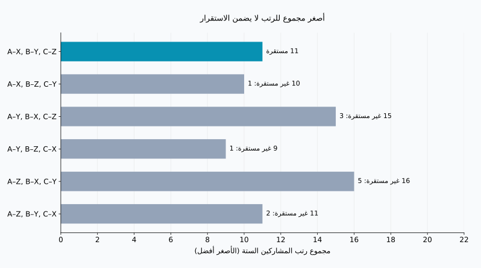
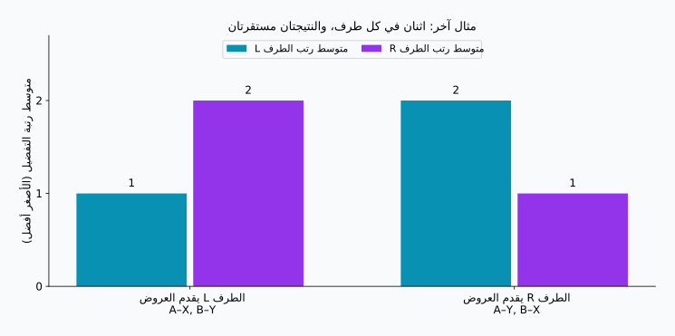

## 1. جمع التفضيلات ليس كافيًا

تخيّل توزيع الطلاب على مشرفي مشروع بحثي، بحيث يقابل كل مشرف طالبًا واحدًا. للطلاب تفضيلات بشأن من يريدون التعلّم منه، وللمشرفين تفضيلات أيضًا. يبدو طلب قائمة مرتبة من كل شخص بداية مناسبة.

لكن عدة طلاب قد يختارون المشرف نفسه، وقد لا تكون الرغبات متبادلة. تحقيق الخيار الأول لشخص قد يمنع تحقيقه لآخر. فما الذي نعنيه بتوزيع «جيد»؟

تقدم **[مسألة الزواج المستقر](https://kenji.blog/ar/p/stable-marriage-problem/)** معيارًا دقيقًا. رغم اسمها، فإن جوهرها الرياضي هو مطابقة واحد لواحد بين مجموعتين لهما تفضيلات. سنستخدم A وB وC، وX وY وZ، دون افتراض جنس معين أو وصف زيجات فعلية.

**الاستقرار لا يعني أن الجميع سعداء تمامًا.** بل يعني أنه لا يوجد شخصان غير مقترنين يفضل كل منهما الآخر على شريكه الحالي. وتضمن خوارزمية غيل–شابلي هذا الشرط ضمن الافتراضات الآتية.

## 2. تعريف الاستقرار رياضيًا

### افتراضات النموذج أولًا

لتكن $L$ و$R$ مجموعتين، في كل منهما $n$ أشخاص. يرتب كل شخص جميع أفراد المجموعة الأخرى من 1 إلى $n$ دون تعادل. تبقى التفضيلات ثابتة، ويعد كل شخص أي شريك أفضل من البقاء دون شريك.

هذه الافتراضات مهمة. الشركاء غير المقبولين، وتعدد المقاعد، وتعادل الرتب، كلها تحتاج إلى توسيع النموذج. نبدأ بالحالة البسيطة لفهم آلية العمل.

في المطابقة $M$، يرمز $M(a)$ إلى شريك $a$، ويرمز $r_a(b)$ إلى الرتبة التي يمنحها $a$ للشخص $b$. الرقم الأصغر يعني تفضيلًا أعلى. يشكل شخصان غير مقترنين، $a\in L$ و$b\in R$، **زوجًا معطّلًا** إذا تحققت المتباينتان معًا:

$$
r_a(b)\lt r_a(M(a))
\quad\land\quad
r_b(a)\lt r_b(M(b))
$$

أي إن كليهما يريد ترك شريكه الحالي واختيار الآخر. إذا كانت $\mathcal{B}(M)$ مجموعة الأزواج المعطلة، فإن المطابقة تكون مستقرة بالضبط عندما:

$$
\mathcal{B}(M)=\varnothing
$$

الرغبة من طرف واحد لا تكفي. وفي المقابل، يظل الزوج معطّلًا حتى لو تضرر الشريكان السابقان من التغيير. أما المنفعة الإجمالية للمجموعة فهي سؤال آخر.

### قد يبقى بعض الاستياء

قد يحصل شخص على خياره الثالث دون أن ينشأ زوج معطّل، إذا كان خياراه الأول والثاني يفضلان شريكيهما الحاليين. **عدم الرضا يختلف عن إمكان الاتفاق على انتقال مرغوب من الطرفين.** الاستقرار خاصية للقوائم المعلنة والثابتة، وليس ضمانًا لاستمرار العلاقات أو قبول الجميع بالنتيجة.

## 3. مثال بثلاثة أشخاص في كل طرف

تعني $X\succ Y\succ Z$ تفضيل X على Y، وY على Z. أُعدّت القوائم التالية لحسابات هذا المقال ورسومه.

| الطرف L | الأول | الثاني | الثالث |
| --- | --- | --- | --- |
| A | X | Y | Z |
| B | Y | Z | X |
| C | X | Y | Z |

| الطرف R | الأول | الثاني | الثالث |
| --- | --- | --- | --- |
| X | A | C | B |
| Y | A | B | C |
| Z | B | A | C |

يضع A وC الشخص X في المرتبة الأولى. ولأن X لا يستطيع الارتباط إلا بشخص واحد، يستحيل تحقيق جميع الخيارات الأولى للطرف L. ومع ذلك، يمكن إيجاد مطابقة مستقرة.

انظر إلى A–Y وB–Z وC–X. يحصل A وB على الخيار الثاني، وC على الأول. يبدو ذلك معقولًا، لكن A يفضل X على Y، وX يفضل A على C. لذلك يشكل A وX زوجًا معطّلًا.



تمثل الخطوط المتصلة الأزواج الحالية، والخط البرتقالي المتقطع التغيير الممكن. تقاطع الخطوط في الرسم لا يحدد الاستقرار؛ ما يهم هو تفضيلات الأشخاص عند طرفيها.

## 4. غيل–شابلي: إبقاء القبول مؤقتًا

قدّم غيل وشابلي الطريقة في عام 1962. وتُعرف باسم **القبول المؤجل**: تلقي عرض لا يعني اتخاذ قرار نهائي فورًا. [الورقة الأصلية](https://www.math.utoronto.ca/mccann/assignments/477/GaleShapley62.pdf)

هنا يقدم L العروض، ويتلقاها R.

1. يقدم شخص بلا شريك من L عرضًا إلى أكثر الأشخاص تفضيلًا ممن لم يعرض عليهم بعد.
2. يقارن المتلقي صاحب العرض الجديد بالشريك المؤقت، إن وجد، ويحتفظ بالأفضل لديه فقط.
3. ينتقل من رُفض إلى خياره التالي.
4. عندما يُحتفظ بكل أفراد L مؤقتًا، تصبح الأزواج نهائية.

يمكن تغيير الشريك المؤقت، ولكن إلى شخص أكثر تفضيلًا فقط. وهكذا يحتفظ المتلقي دائمًا بأفضل عرض تلقاه حتى تلك اللحظة.

### تتبع خمسة عروض

نبدأ بالترتيب C ثم B ثم A لكي نرى استبدال شريك مؤقت.

| الخطوة | العرض | القرار | الأزواج المؤقتة |
| --- | --- | --- | --- |
| 1 | C → X | X بلا شريك فيحتفظ بـ C مؤقتًا | C–X |
| 2 | B → Y | Y بلا شريك فيحتفظ بـ B مؤقتًا | C–X, B–Y |
| 3 | A → X | X يفضل A فيستبدل C | A–X, B–Y |
| 4 | C → Y | Y يفضل B فيرفض C | A–X, B–Y |
| 5 | C → Z | Z بلا شريك فيحتفظ بـ C مؤقتًا | A–X, B–Y, C–Z |

النتيجة A–X وB–Y وC–Z. يحصل C على الخيار الثالث، لكن X يفضل A على C، وY يفضل B على C. لا يوافق أي خيار أفضل لـC على التغيير. ولدى A وB الخيار الأول أصلًا، فلا يوجد زوج معطّل.

لو كان القبول نهائيًا بحسب أسبقية الوصول، لتثبت الزوج C–X قبل وصول A. وقد يبقى A وX يفضلان بعضهما. الطابع المؤقت للقبول يمنع هذه المشكلة.

## 5. لماذا تنتهي الخوارزمية وتنتج مطابقة مستقرة؟

لا يقدم أحد عرضًا إلى الشخص نفسه مرتين. مع وجود $n$ مقدمي عروض و$n$ متلقين، يحقق العدد الكلي للعروض $P$:

$$
P\leq n\times n=n^2
$$

هذا حد أعلى، وليس العدد الدقيق لكل تشغيل. يحتاج مثالنا إلى خمسة عروض عند $n=3$. إذا خزنا الرتب في قواميس للمقارنة بزمن ثابت، كانت الكلفة الزمنية $O(n^2)$. وتحتوي قوائم الإدخال نفسها على $2n^2$ خانة.

لا يمكن أن يبقى أحد بلا شريك في النهاية. فلو استنفد مقدم عرض حر جميع خياراته، لكان كل متلقٍ قد استقبل عرضًا. وبعد أن يحتفظ المتلقي بشخص، لا يعود فارغًا، وإن استبدل ذلك الشخص. سيملك المتلقون جميعًا شركاء مختلفين، وهذا يناقض بقاء شخص حر بين مقدمي العروض الذين يساوونهم عددًا.

والآن افترض وجود زوج معطّل $a,b$ في النتيجة. بما أن $a$ يفضل $b$ على شريكه النهائي، فلا بد أنه عرض عليه سابقًا. عدم استمرارهما معًا يعني أن $b$ رفض $a$ فورًا، أو استبدله لاحقًا بشخص أفضل لديه. وبما أن اختيار $b$ المؤقت لا يتراجع، فإن شريكه النهائي أفضل لديه من $a$. وهذا يناقض رغبته المفترضة في الانتقال إلى $a$. سبب الرفض لا ينعكس لاحقًا، فلا حاجة إلى فحص كل التركيبات.

## 6. الاستقرار والرضا هدفان مختلفان

للمقارنة، نجمع رتب الشركاء الذين حصل عليهم جميع المشاركين:

$$
S(M)=\sum_{a\in L}r_a(M(a))
      +\sum_{b\in R}r_b(M(b))
$$

تعني قيمة أصغر لـ$S(M)$ رتبًا أفضل إجمالًا، لكنها ليست مقياسًا للسعادة. الفرق بين الخيارين الأول والثاني قد لا يساوي الفرق بين الثاني والثالث، كما تختلف قوة التفضيلات بين الأشخاص. نستخدم المجموع مؤشرًا توضيحيًا بسيطًا فقط.

مع ثلاثة أشخاص في كل طرف توجد $3!=6$ مطابقات كاملة:

| المطابقة | مجموع رتب L | مجموع رتب R | المجموع | الأزواج المعطلة |
| --- | --- | --- | --- | --- |
| A–X, B–Y, C–Z | 5 | 6 | 11 | 0 |
| A–X, B–Z, C–Y | 5 | 5 | 10 | 1 |
| A–Y, B–X, C–Z | 8 | 7 | 15 | 3 |
| A–Y, B–Z, C–X | 5 | 4 | 9 | 1 |
| A–Z, B–X, C–Y | 8 | 8 | 16 | 5 |
| A–Z, B–Y, C–X | 5 | 6 | 11 | 2 |



أصغر مجموع، وهو 9، يعود إلى A–Y وB–Z وC–X، لكن A وX يعطّلانه. أما نتيجة غيل–شابلي فمجموعها 11، وهي المستقرة الوحيدة في هذا المثال. **تصغير مجموع الرتب وإزالة الأزواج المعطلة هدفان مختلفان.**

الصفان الأول والأخير لهما المجموع نفسه، 11، لكن الأخير يحتوي على زوجين معطلين. لذلك لا تكفي القيمة وحدها للحكم على الاستقرار. وقد تعني عبارة «رضا الجميع» حصول الكل على الخيار الأول، أو أحد الخيارين الأولين، أو تحسين أسوأ رتبة، أو تقريب متوسطَي الطرفين. وكلها معايير مختلفة عن الاستقرار.

## 7. تغيير الطرف الذي يقدم العروض قد يغيّر النتيجة

لنأخذ مثالًا آخر، فيه شخصان بكل طرف وتفضيلات جديدة:

| المشارك | الأول | الثاني |
| --- | --- | --- |
| A | X | Y |
| B | Y | X |
| X | B | A |
| Y | A | B |

عندما يقدم L العروض، نحصل على A–X وB–Y: الخيارات الأولى لـL والثانية لـR. النتيجة مستقرة لأن A وB لا يريدان التغيير. وعندما يقدم R العروض، نحصل على A–Y وB–X: الخيارات الأولى لـR والثانية لـL. وهذه النتيجة مستقرة أيضًا.



في النموذج الأساسي ذي التفضيلات الصارمة، تمنح الخوارزمية **كل مقدم عرض أفضل شريك يمكنه الحصول عليه بين جميع المطابقات المستقرة**. هذه هي الأمثلية للطرف مقدم العروض. المقارنة محصورة بالحلول المستقرة، ولا تضمن الخيار الأول دون قيود. [مبرهنة الأمثلية في الورقة الأصلية](https://www.math.utoronto.ca/mccann/assignments/477/GaleShapley62.pdf)

وفي النموذج نفسه، يحصل كل متلقٍ على أقل شركائه تفضيلًا بين الحلول المستقرة. لذلك فإن اختيار الطرف مقدم العروض قرار تصميمي مهم. إذا ثبت هذا الطرف، فإن تغيير ترتيب معالجة مقدمي العروض الأحرار لا يغيّر المطابقة النهائية؛ أما تبادل الدورين فقد يغيّرها.

## 8. التحقق باستخدام Python

ينفذ الكود مثال الثلاثة مقابل الثلاثة. تمثل `deque` طابورًا؛ ويعود من رُفض إلى نهايته. تُحوّل قوائم المتلقين إلى قواميس رتب لتسريع المقارنة.

```python
from collections import deque

left = {"A": ["X", "Y", "Z"],
        "B": ["Y", "Z", "X"],
        "C": ["X", "Y", "Z"]}
right = {"X": ["A", "C", "B"],
         "Y": ["A", "B", "C"],
         "Z": ["B", "A", "C"]}

def gale_shapley(proposers, receivers, order=None):
    rank = {b: {a: i for i, a in enumerate(prefs)}
            for b, prefs in receivers.items()}
    free = deque(proposers if order is None else order)
    next_choice = {a: 0 for a in proposers}
    held = {}
    proposals = 0
    while free:
        a = free.popleft()
        b = proposers[a][next_choice[a]]
        next_choice[a] += 1
        proposals += 1
        if b not in held:
            held[b] = a
        elif rank[b][a] < rank[b][held[b]]:
            free.append(held[b])
            held[b] = a
        else:
            free.append(a)
    return {a: b for b, a in held.items()}, proposals

def blocking_pairs(match, left, right):
    inverse = {b: a for a, b in match.items()}
    return [(a, b) for a in left for b in right
            if left[a].index(b) < left[a].index(match[a])
            and right[b].index(a) < right[b].index(inverse[b])]

match, count = gale_shapley(left, right, ["C", "B", "A"])
print("المطابقة:", sorted(match.items()))
print("عدد العروض:", count)
print("الأزواج المعطلة:", blocking_pairs(match, left, right))
```

```text
المطابقة: [('A', 'X'), ('B', 'Y'), ('C', 'Z')]
عدد العروض: 5
الأزواج المعطلة: []
```

تعني القائمة الفارغة عدم العثور على زوج معطّل. أما فحص `{"A": "Y", "B": "Z", "C": "X"}` فيعيد `[('A', 'X')]`.

يفترض هذا التنفيذ التعليمي تساوي حجم المجموعتين واكتمال القوائم وعدم وجود تعادل. لا يتضمن التحقق من المدخلات أو معالجة الشركاء غير المقبولين. تستخدم دالة الفحص `.index()` لتبقى مقروءة، فتستغرق $O(n^3)$. أما الحد $O(n^2)$ السابق فيخص خوارزمية المطابقة نفسها، دون الفحص الإضافي.

يولّد [سكربت إعادة الإنتاج](generate_graphs.ar.py) الرسوم والنتائج الست، والمتاحة أيضًا بصيغة [JSON](calculation-results.ar.json). جرّب تغيير ترتيب لتستكشف عدد الحلول المستقرة وأثر تبديل الطرف مقدم العروض.

## 9. قبل التطبيق على توزيع واقعي

الطلاب والمؤسسات، أو المتقدمون والجهات المستقبلة، أمثلة على تفضيلات أو أولويات لدى الطرفين. لكن الأنظمة الواقعية غالبًا أكثر تعقيدًا.

إذا تعددت المقاعد، يمكن للمتلقي الاحتفاظ بعدة مرشحين حتى سعته. غير أن اختيار أفضل الأفراد بحسب قائمة ليس هو افتراض الرغبة في مجموعة محددة من الأشخاص معًا. وجود شركاء غير مقبولين يتطلب السماح ببقاء بعض المشاركين دون تخصيص. ومع تعادل الرتب تختلف تعريفات الاستقرار بحسب التعامل مع عدم المفاضلة. يجب إعادة فحص الضمانات عند تغيير القواعد.

ومن المهم أيضًا معرفة ما إذا كانت القوائم المعلنة تعكس التفضيلات الحقيقية. فالاستقرار يُقيّم أولًا بالنسبة إلى القوائم المقدمة. نقص المعلومات أو القيود على الترتيب قد يمنع استنتاج الرضا من المخرجات وحدها. توضح الرياضيات ما يمكن ضمانه تحت افتراضات معلنة؛ ولا يصبح التوزيع عادلًا لمجرد أن خوارزمية حسبته.

## 10. الخلاصة: ميّز الاستقرار عن السعادة

تجمع غيل–شابلي بين العروض والقبول المؤقت لمنع انتقال يريده شخصان غير مقترنين معًا.

- **المستقر لا يعني الخيار الأول للجميع.** قد يبقى الاستياء دون تغيير مقبول للطرفين.
- **المستقر لا يعني أصغر مجموع للرتب.** الحد الأدنى في المثال 9، والنتيجة المستقرة الوحيدة 11.
- **الطرف مقدم العروض مهم.** قد تخدم الحلول المستقرة المختلفة أطرافًا مختلفة.

عندما يتعذر تحقيق كل الرغبات، تزداد أهمية تعريف الهدف بدقة. قبل البحث عن الحل الأمثل، حدد معنى المطابقة «الجيدة».

### المرجع

D. Gale and L. S. Shapley, “College Admissions and the Stability of Marriage,” *The American Mathematical Monthly*, 69(1), 9–15, 1962. [PDF](https://www.math.utoronto.ca/mccann/assignments/477/GaleShapley62.pdf). المصدر الأصلي للنموذج والقبول المؤجل والأمثلية. حُسب مثال الثلاثة مقابل الثلاثة والجداول والرسوم بصورة مستقلة.
